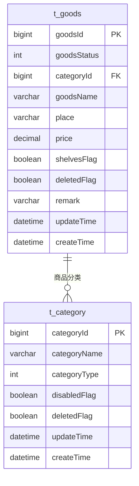
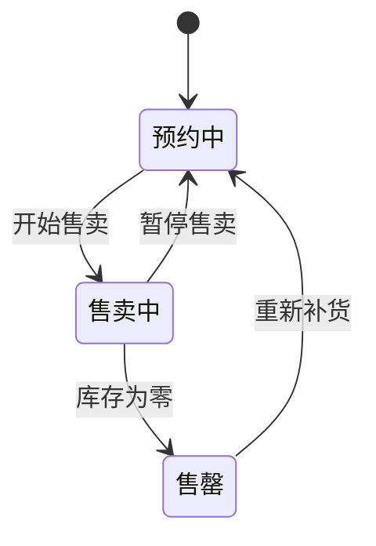
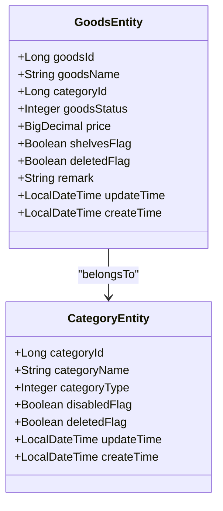
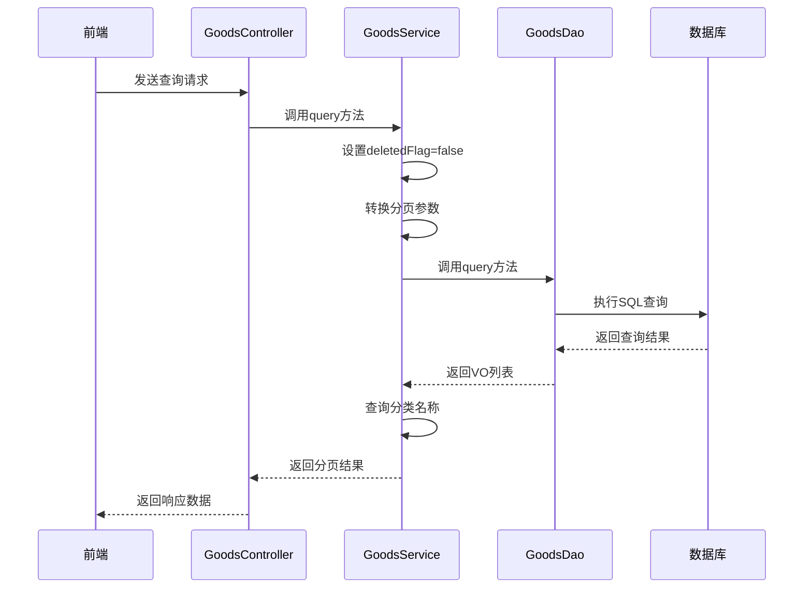
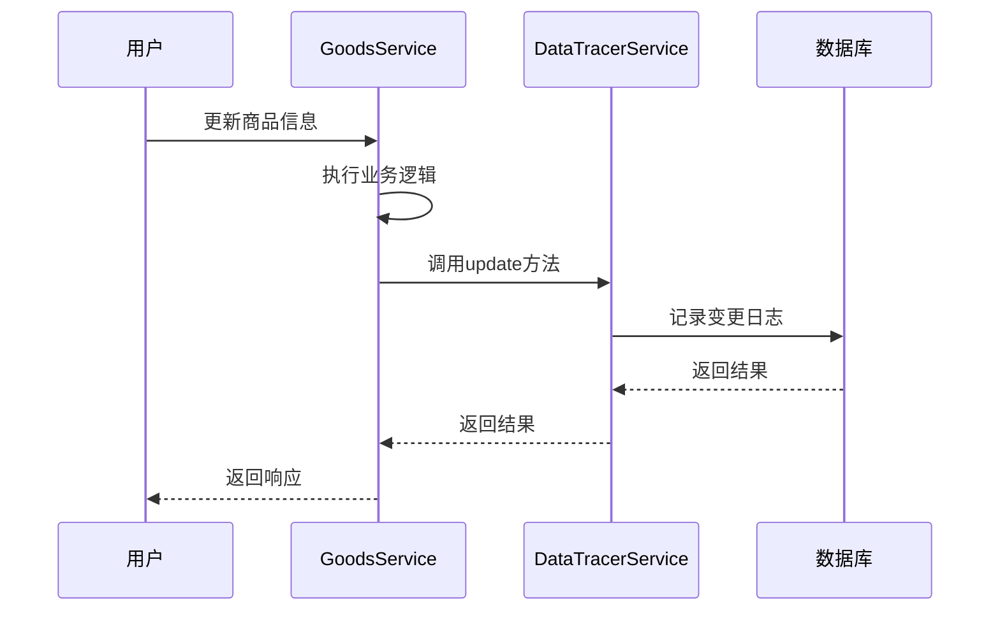

# 商品管理表结构

<cite>
**本文档引用的文件**
- [GoodsEntity.java](file://smart-admin-api-java17-springboot3\sa-admin\src\main\java\net\lab1024\sa\admin\module\business\goods\domain\entity\GoodsEntity.java)
- [GoodsDao.java](file://smart-admin-api-java17-springboot3\sa-admin\src\main\java\net\lab1024\sa\admin\module\business\goods\dao\GoodsDao.java)
- [GoodsMapper.xml](file://smart-admin-api-java17-springboot3\sa-admin\src\main\resources\mapper\business\goods\GoodsMapper.xml)
- [GoodsStatusEnum.java](file://smart-admin-api-java17-springboot3\sa-admin\src\main\java\net\lab1024\sa\admin\module\business\goods\constant\GoodsStatusEnum.java)
- [GoodsService.java](file://smart-admin-api-java17-springboot3\sa-admin\src\main\java\net\lab1024\sa\admin\module\business\goods\service\GoodsService.java)
- [DataTracerTypeEnum.java](file://smart-admin-api-java17-springboot3\sa-base\src\main\java\net\lab1024\sa\base\module\support\datatracer\constant\DataTracerTypeEnum.java)
- [DataTracerService.java](file://smart-admin-api-java17-springboot3\sa-base\src\main\java\net\lab1024\sa\base\module\support\datatracer\service\DataTracerService.java)
</cite>

## 目录
1. [引言](#引言)
2. [商品表结构设计](#商品表结构设计)
3. [核心字段说明](#核心字段说明)
4. [商品状态流转机制](#商品状态流转机制)
5. [商品与分类关联关系](#商品与分类关联关系)
6. [数据查询与性能优化](#数据查询与性能优化)
7. [数据追踪与审计日志](#数据追踪与审计日志)
8. [结论](#结论)

## 引言
本文档详细介绍了商品管理模块的数据库表结构设计，重点分析了`t_goods`表的字段定义、约束条件以及相关业务逻辑。文档涵盖了商品状态流转、分类关联、查询性能优化和数据审计等关键方面，为开发人员和数据库管理员提供全面的技术参考。

## 商品表结构设计

**图表来源**
- [GoodsEntity.java](file://smart-admin-api-java17-springboot3\sa-admin\src\main\java\net\lab1024\sa\admin\module\business\goods\domain\entity\GoodsEntity.java)

**本节来源**
- [GoodsEntity.java](file://smart-admin-api-java17-springboot3\sa-admin\src\main\java\net\lab1024\sa\admin\module\business\goods\domain\entity\GoodsEntity.java)

## 核心字段说明

| 字段名 | 数据类型 | 约束条件 | 含义说明 |
|--------|---------|---------|---------|
| goodsId | BIGINT | 主键，自增 | 商品唯一标识符 |
| goodsName | VARCHAR | 非空 | 商品名称 |
| categoryId | BIGINT | 外键，非空 | 商品分类ID，关联t_category表 |
| price | DECIMAL | 非空 | 商品价格，使用BigDecimal确保精度 |
| goodsStatus | INT | 非空 | 商品状态：1-预约中，2-售卖中，3-售罄 |
| shelvesFlag | BOOLEAN | 非空 | 上架状态，true表示已上架，false表示未上架 |
| deletedFlag | BOOLEAN | 非空 | 删除状态，true表示已删除，false表示正常 |
| coverImage | VARCHAR | 可选 | 商品封面图片URL |
| detailContent | TEXT | 可选 | 商品详情内容，支持富文本 |
| place | VARCHAR | 可选 | 商品产地 |
| remark | VARCHAR | 可选 | 备注信息 |
| updateTime | DATETIME | 非空 | 最后更新时间 |
| createTime | DATETIME | 非空 | 创建时间 |

**本节来源**
- [GoodsEntity.java](file://smart-admin-api-java17-springboot3\sa-admin\src\main\java\net\lab1024\sa\admin\module\business\goods\domain\entity\GoodsEntity.java)

## 商品状态流转机制

商品状态通过`goodsStatus`字段管理，采用枚举值控制状态流转。系统定义了三种主要状态：

状态流转规则：
1. **预约中**：商品已创建但尚未开始售卖，用户无法购买
2. **售卖中**：商品正在销售中，用户可以正常购买
3. **售罄**：商品库存已为零，停止销售

状态变更约束：
- 只有状态为"售罄"的商品才能被删除
- 状态变更需通过业务服务层进行校验和记录
- 状态变更会触发数据审计日志记录

**本节来源**
- [GoodsStatusEnum.java](file://smart-admin-api-java17-springboot3\sa-admin\src\main\java\net\lab1024\sa\admin\module\business\goods\constant\GoodsStatusEnum.java)
- [GoodsService.java](file://smart-admin-api-java17-springboot3\sa-admin\src\main\java\net\lab1024\sa\admin\module\business\goods\service\GoodsService.java#L115-L128)

## 商品与分类关联关系

商品与分类之间通过外键约束建立关联关系，确保数据一致性：

**图表来源**
- [GoodsEntity.java](file://smart-admin-api-java17-springboot3\sa-admin\src\main\java\net\lab1024\sa\admin\module\business\goods\domain\entity\GoodsEntity.java)
- [CategoryEntity.java](file://smart-admin-api-java17-springboot3\sa-admin\src\main\java\net\lab1024\sa\admin\module\business\category\domain\entity\CategoryEntity.java)

**本节来源**
- [GoodsService.java](file://smart-admin-api-java17-springboot3\sa-admin\src\main\java\net\lab1024\sa\admin\module\business\goods\service\GoodsService.java#L101-L107)

## 数据查询与性能优化

### 分页查询实现
系统通过`GoodsDao`接口提供分页查询功能，支持多种条件过滤：

**图表来源**
- [GoodsDao.java](file://smart-admin-api-java17-springboot3\sa-admin\src\main\java\net\lab1024\sa\admin\module\business\goods\dao\GoodsDao.java)
- [GoodsService.java](file://smart-admin-api-java17-springboot3\sa-admin\src\main\java\net\lab1024\sa\admin\module\business\goods\service\GoodsService.java#L147-L165)

### 查询性能优化策略
1. **索引设计**：
   - 在`categoryId`字段上创建索引，优化按分类查询性能
   - 在`goodsStatus`和`shelvesFlag`字段上创建复合索引，优化状态过滤查询
   - 在`goodsName`字段上考虑全文索引，优化模糊搜索性能

2. **分页策略**：
   - 使用MyBatis-Plus分页插件实现高效分页
   - 默认按`goodsId`降序排列，确保最新商品优先显示
   - 支持多条件动态查询，通过`<if>`标签实现条件拼接

3. **批量操作**：
   - 提供`batchUpdateDeleted`方法实现批量逻辑删除
   - 减少数据库交互次数，提高批量操作效率

**本节来源**
- [GoodsMapper.xml](file://smart-admin-api-java17-springboot3\sa-admin\src\main\resources\mapper\business\goods\GoodsMapper.xml)
- [GoodsDao.java](file://smart-admin-api-java17-springboot3\sa-admin\src\main\java\net\lab1024\sa\admin\module\business\goods\dao\GoodsDao.java)

## 数据追踪与审计日志

系统实现了完整的数据变更追踪机制，确保商品信息变更可追溯：

**图表来源**
- [GoodsService.java](file://smart-admin-api-java17-springboot3\sa-admin\src\main\java\net\lab1024\sa\admin\module\business\goods\service\GoodsService.java#L77-L94)
- [DataTracerService.java](file://smart-admin-api-java17-springboot3\sa-base\src\main\java\net\lab1024\sa\base\module\support\datatracer\service\DataTracerService.java)

### 审计日志实现方案
1. **数据追踪类型**：
   - 定义`DataTracerTypeEnum.GOODS`枚举值标识商品类型
   - 在`t_data_tracker`表中记录所有商品变更

2. **变更记录内容**：
   - 记录变更前后的数据快照
   - 记录操作用户、IP地址、用户代理等上下文信息
   - 记录变更时间和业务类型

3. **API接口**：
   - 提供`dataTracerService.insert()`记录新增操作
   - 提供`dataTracerService.update()`记录更新操作
   - 提供`dataTracerService.batchDelete()`记录批量删除操作

4. **最佳实践建议**：
   - 对敏感字段变更进行特别标记
   - 定期归档历史审计日志以控制表大小
   - 提供审计日志查询接口供管理员审查

**本节来源**
- [DataTracerTypeEnum.java](file://smart-admin-api-java17-springboot3\sa-base\src\main\java\net\lab1024\sa\base\module\support\datatracer\constant\DataTracerTypeEnum.java)
- [DataTracerService.java](file://smart-admin-api-java17-springboot3\sa-base\src\main\java\net\lab1024\sa\base\module\support\datatracer\service\DataTracerService.java)
- [GoodsService.java](file://smart-admin-api-java17-springboot3\sa-admin\src\main\java\net\lab1024\sa\admin\module\business\goods\service\GoodsService.java)

## 结论
本文档全面介绍了商品管理模块的数据库表结构设计和相关业务逻辑。`t_goods`表通过合理的字段设计和约束条件，支持了商品全生命周期管理。系统通过外键约束确保商品与分类的数据一致性，通过状态枚举实现清晰的状态流转控制。分页查询和批量操作设计考虑了大数据量下的性能优化，而数据追踪机制则确保了所有变更的可审计性。建议在实际应用中根据具体业务需求进一步优化索引策略和审计日志管理方案。