# 基础模块 (sa-base)

<cite>
**本文档引用的文件**  
- [ResponseDTO.java](file://smart-admin-api-java17-springboot3\sa-base\src\main\java\net\lab1024\sa\base\common\domain\ResponseDTO.java)
- [BusinessException.java](file://smart-admin-api-java17-springboot3\sa-base\src\main\java\net\lab1024\sa\base\common\exception\BusinessException.java)
- [SmartBeanUtil.java](file://smart-admin-api-java17-springboot3\sa-base\src\main\java\net\lab1024\sa\base\common\util\SmartBeanUtil.java)
- [TokenConfig.java](file://smart-admin-api-java17-springboot3\sa-base\src\main\java\net\lab1024\sa\base\config\TokenConfig.java)
- [MybatisPlusConfig.java](file://smart-admin-api-java17-springboot3\sa-base\src\main\java\net\lab1024\sa\base\config\MybatisPlusConfig.java)
- [SwaggerConfig.java](file://smart-admin-api-java17-springboot3\sa-base\src\main\java\net\lab1024\sa\base\config\SwaggerConfig.java)
- [GlobalExceptionHandler.java](file://smart-admin-api-java17-springboot3\sa-base\src\main\java\net\lab1024\sa\base\handler\GlobalExceptionHandler.java)
- [MybatisPlusFillHandler.java](file://smart-admin-api-java17-springboot3\sa-base\src\main\java\net\lab1024\sa\base\handler\MybatisPlusFillHandler.java)
- [CacheService.java](file://smart-admin-api-java17-springboot3\sa-base\src\main\java\net\lab1024\sa\base\module\support\cache\CacheService.java)
- [ApiEncryptController.java](file://smart-admin-api-java17-springboot3\sa-base\src\main\java\net\lab1024\sa\base\module\support\apiencrypt\ApiEncryptController.java)
- [DataMaskingAspect.java](file://smart-admin-api-java17-springboot3\sa-base\src\main\java\net\lab1024\sa\base\module\support\datamasking\DataMaskingAspect.java)
- [OperateLogAspect.java](file://smart-admin-api-java17-springboot3\sa-base\src\main\java\net\lab1024\sa\base\module\support\operatelog\OperateLogAspect.java)
</cite>

## 目录
1. [简介](#简介)
2. [项目结构](#项目结构)
3. [核心组件](#核心组件)
4. [架构概述](#架构概述)
5. [详细组件分析](#详细组件分析)
6. [依赖分析](#依赖分析)
7. [性能考虑](#性能考虑)
8. [故障排除指南](#故障排除指南)
9. [结论](#结论)

## 简介
sa-base模块是整个系统的基础公共组件，为上层应用提供统一的基础功能支持。该模块封装了系统运行所需的通用功能，包括统一响应结构、业务异常体系、工具类、系统配置、全局异常处理等核心功能。通过将这些公共功能抽象到基础模块中，实现了代码复用和系统解耦，提高了开发效率和系统稳定性。

## 项目结构
sa-base模块采用分层架构设计，主要包含common、config、handler和module/support四个核心包。common包提供基础工具和数据结构，config包管理各类系统配置，handler包处理全局异常和数据填充，module/support包则提供缓存、加解密、数据脱敏等支持功能。

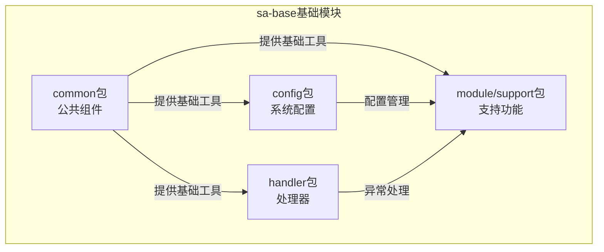

**图示来源**
- [sa-base模块结构](file://smart-admin-api-java17-springboot3\sa-base\src\main\java\net\lab1024\sa\base)

## 核心组件

sa-base模块的核心组件包括ResponseDTO统一响应结构、BusinessException业务异常体系、SmartBeanUtil工具类等。这些组件为系统提供了标准化的数据交互格式、统一的异常处理机制和便捷的工具方法。

**组件来源**
- [ResponseDTO.java](file://smart-admin-api-java17-springboot3\sa-base\src\main\java\net\lab1024\sa\base\common\domain\ResponseDTO.java)
- [BusinessException.java](file://smart-admin-api-java17-springboot3\sa-base\src\main\java\net\lab1024\sa\base\common\exception\BusinessException.java)
- [SmartBeanUtil.java](file://smart-admin-api-java17-springboot3\sa-base\src\main\java\net\lab1024\sa\base\common\util\SmartBeanUtil.java)

## 架构概述

sa-base模块采用模块化设计，各功能组件相互独立又协同工作。通过配置类实现系统参数的集中管理，通过处理器类实现全局异常处理和数据自动填充，通过支持模块提供各种增强功能。

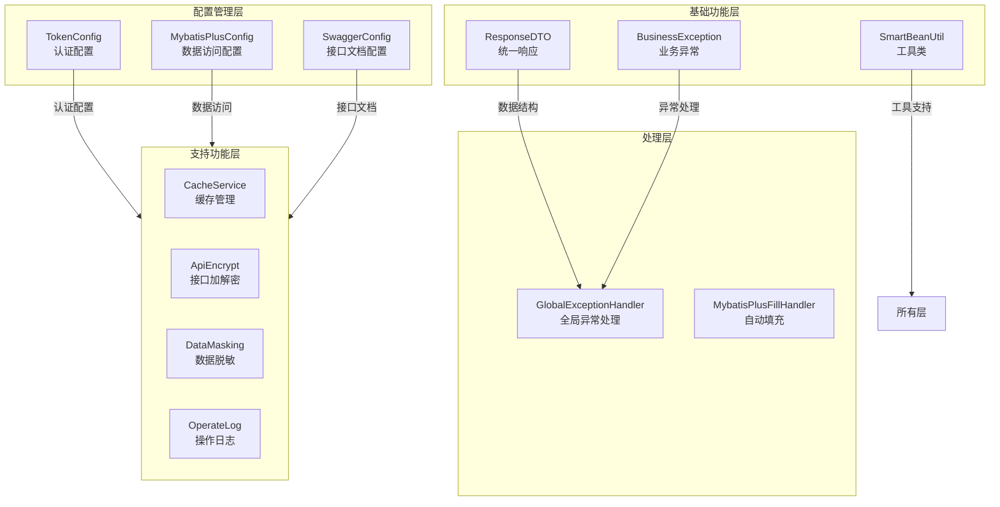

**图示来源**
- [sa-base架构](file://smart-admin-api-java17-springboot3\sa-base\src\main\java\net\lab1024\sa\base)

## 详细组件分析

### 公共组件分析

#### ResponseDTO统一响应结构
ResponseDTO是系统统一的响应数据结构，封装了接口返回的状态码、消息和数据，确保前后端交互的数据格式一致性。

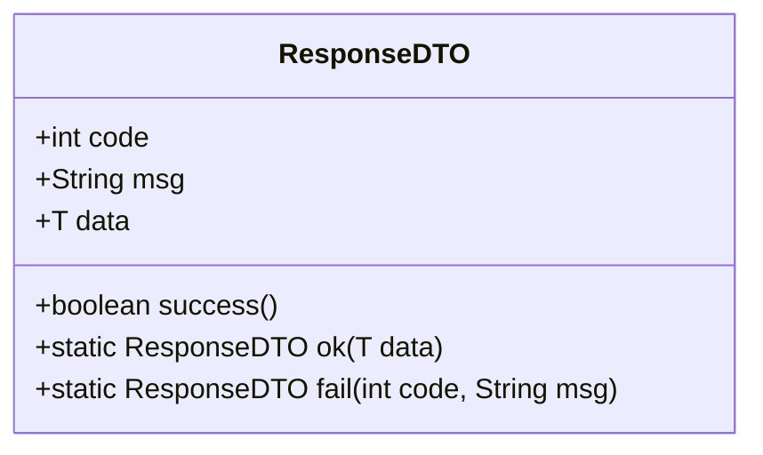

**图示来源**
- [ResponseDTO.java](file://smart-admin-api-java17-springboot3\sa-base\src\main\java\net\lab1024\sa\base\common\domain\ResponseDTO.java)

#### BusinessException业务异常体系
BusinessException是系统业务异常的基类，用于处理业务逻辑中的各种异常情况，提供统一的异常码和异常信息。

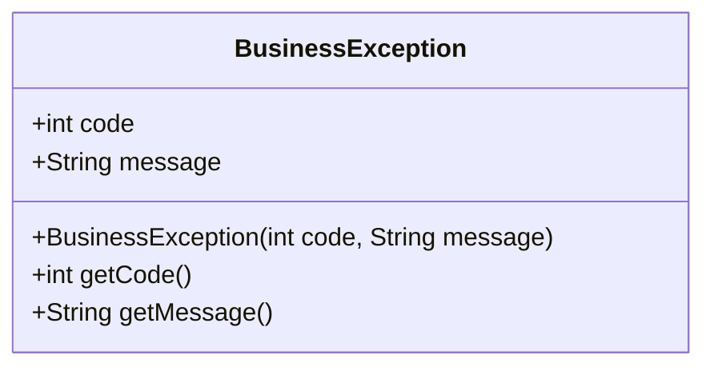

**图示来源**
- [BusinessException.java](file://smart-admin-api-java17-springboot3\sa-base\src\main\java\net\lab1024\sa\base\common\exception\BusinessException.java)

#### SmartBeanUtil工具类
SmartBeanUtil提供了一系列便捷的Bean操作工具方法，如对象属性拷贝、空值检查等，简化了开发中的常见操作。

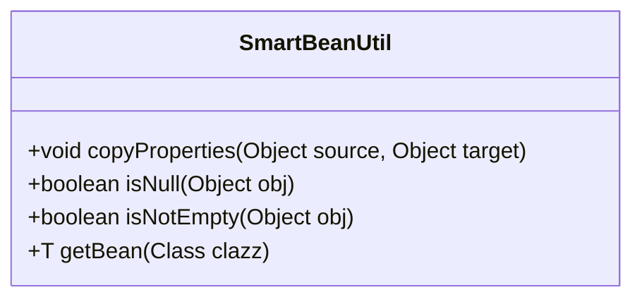

**图示来源**
- [SmartBeanUtil.java](file://smart-admin-api-java17-springboot3\sa-base\src\main\java\net\lab1024\sa\base\common\util\SmartBeanUtil.java)

### 配置类分析

#### TokenConfig认证配置
TokenConfig类负责管理系统的认证相关配置，包括token的生成、验证和过期时间等参数。

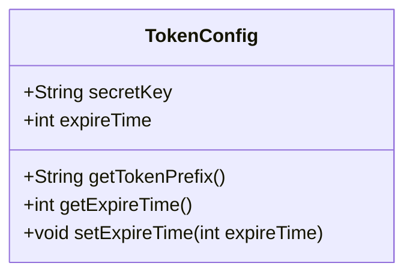

**图示来源**
- [TokenConfig.java](file://smart-admin-api-java17-springboot3\sa-base\src\main\java\net\lab1024\sa\base\config\TokenConfig.java)

#### MybatisPlusConfig数据访问配置
MybatisPlusConfig类配置MyBatis-Plus框架的相关参数，包括分页插件、性能分析插件等。

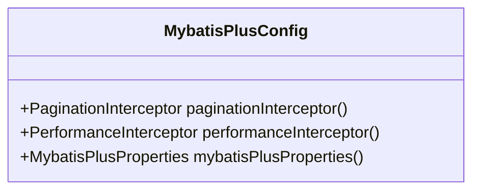

**图示来源**
- [MybatisPlusConfig.java](file://smart-admin-api-java17-springboot3\sa-base\src\main\java\net\lab1024\sa\base\config\MybatisPlusConfig.java)

#### SwaggerConfig接口文档配置
SwaggerConfig类配置Swagger接口文档的相关参数，包括API信息、扫描包路径等。

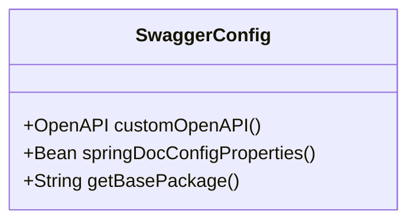

**图示来源**
- [SwaggerConfig.java](file://smart-admin-api-java17-springboot3\sa-base\src\main\java\net\lab1024\sa\base\config\SwaggerConfig.java)

### 处理器分析

#### GlobalExceptionHandler全局异常处理器
GlobalExceptionHandler通过@ControllerAdvice注解实现全局异常处理，捕获系统中所有未处理的异常。

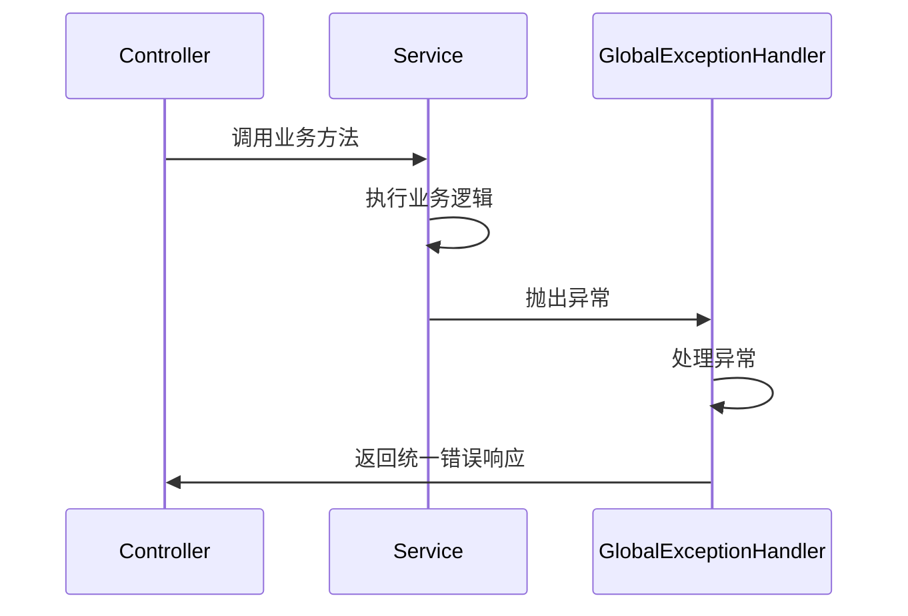

**图示来源**
- [GlobalExceptionHandler.java](file://smart-admin-api-java17-springboot3\sa-base\src\main\java\net\lab1024\sa\base\handler\GlobalExceptionHandler.java)

#### MybatisPlusFillHandler自动填充处理器
MybatisPlusFillHandler实现MetaObjectHandler接口，自动填充创建时间、更新时间等公共字段。

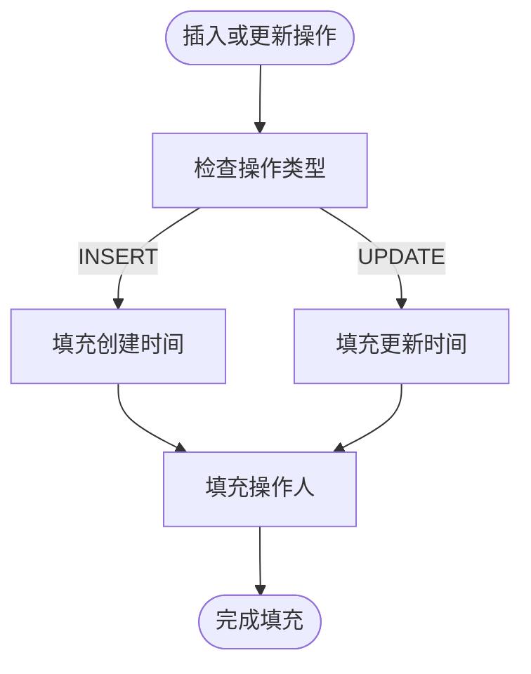

**图示来源**
- [MybatisPlusFillHandler.java](file://smart-admin-api-java17-springboot3\sa-base\src\main\java\net\lab1024\sa\base\handler\MybatisPlusFillHandler.java)

### 支持功能分析

#### 缓存管理（CacheService）
CacheService提供统一的缓存操作接口，封装了Redis等缓存技术的使用。

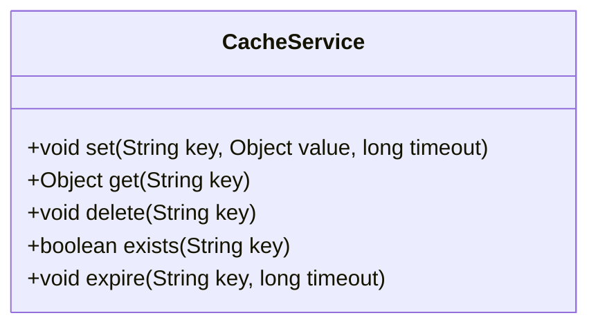

**图示来源**
- [CacheService.java](file://smart-admin-api-java17-springboot3\sa-base\src\main\java\net\lab1024\sa\base\module\support\cache\CacheService.java)

#### 接口加解密（apiencrypt）
apiencrypt模块通过AOP实现接口参数的自动加密和响应数据的自动解密。

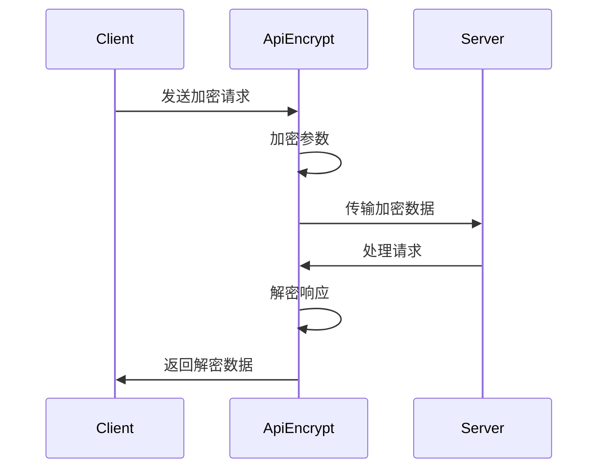

**图示来源**
- [ApiEncryptController.java](file://smart-admin-api-java17-springboot3\sa-base\src\main\java\net\lab1024\sa\base\module\support\apiencrypt\ApiEncryptController.java)

#### 数据脱敏（datamasking）
datamasking模块通过注解和AOP实现敏感数据的自动脱敏处理。

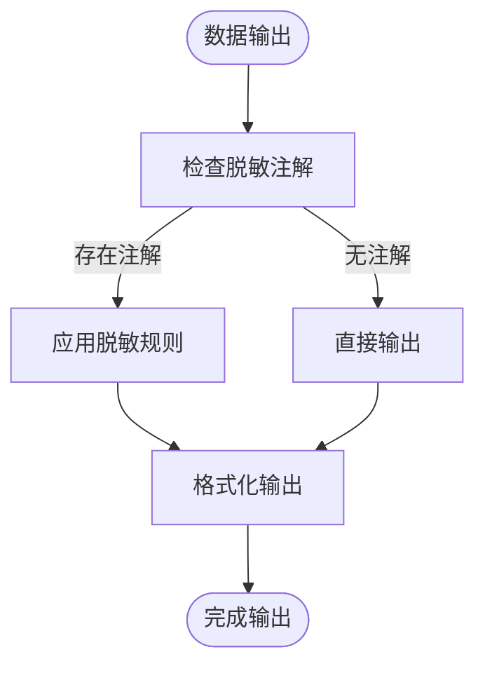

**图示来源**
- [DataMaskingAspect.java](file://smart-admin-api-java17-springboot3\sa-base\src\main\java\net\lab1024\sa\base\module\support\datamasking\DataMaskingAspect.java)

#### 操作日志（operatelog）
operatelog模块记录系统关键操作的日志信息，用于审计和追踪。

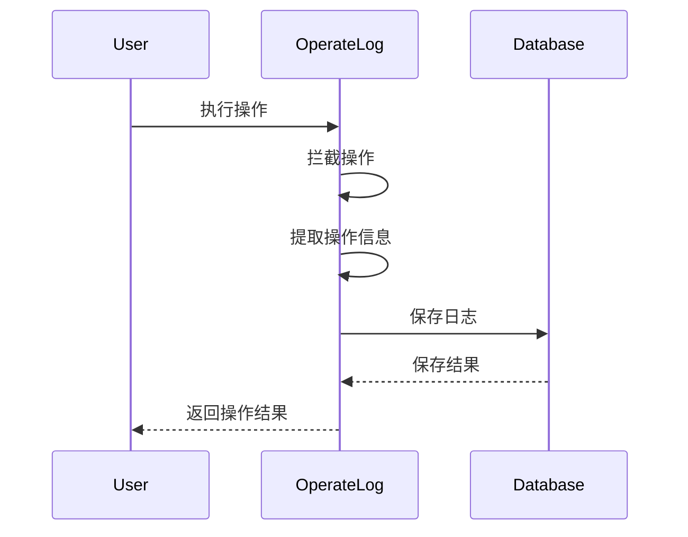

**图示来源**
- [OperateLogAspect.java](file://smart-admin-api-java17-springboot3\sa-base\src\main\java\net\lab1024\sa\base\module\support\operatelog\OperateLogAspect.java)

## 依赖分析

sa-base模块作为基础组件，被上层应用模块所依赖。其内部各组件之间也存在明确的依赖关系。

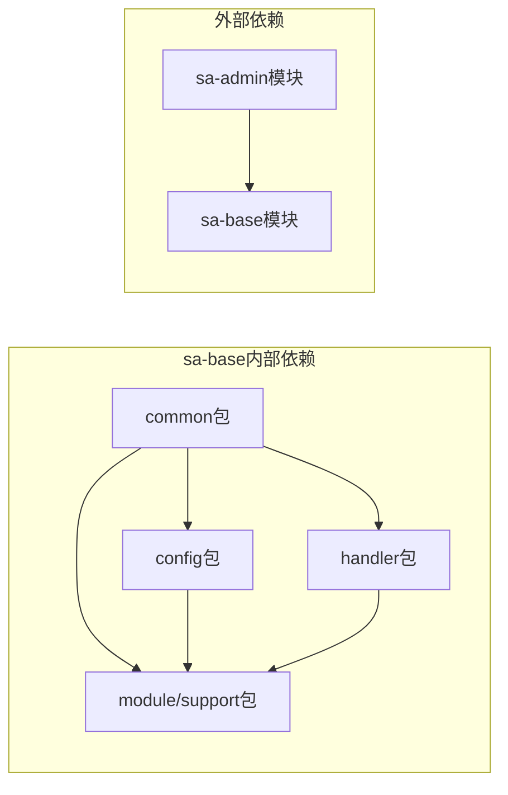

**图示来源**
- [pom.xml](file://smart-admin-api-java17-springboot3\sa-base\pom.xml)

## 性能考虑

sa-base模块在设计时充分考虑了性能因素，通过缓存、异步处理等机制优化系统性能。

- **缓存策略**：使用Redis缓存频繁访问的数据，减少数据库压力
- **异步处理**：将非关键操作（如日志记录）放入异步队列处理
- **连接池**：使用连接池管理数据库连接，提高连接复用率
- **对象池**：对常用对象进行池化管理，减少对象创建开销

## 故障排除指南

### 常见问题及解决方案

1. **配置不生效**
   - 检查配置文件路径和命名是否正确
   - 确认YamlProcessor.java是否正确加载配置
   - 验证配置项的优先级设置

2. **异常处理失效**
   - 确认GlobalExceptionHandler类是否被Spring扫描到
   - 检查@ControllerAdvice注解是否正确使用
   - 验证异常映射关系是否正确配置

3. **缓存数据不一致**
   - 检查缓存过期时间设置
   - 确认缓存更新策略是否合理
   - 验证缓存穿透和雪崩的防护措施

**组件来源**
- [GlobalExceptionHandler.java](file://smart-admin-api-java17-springboot3\sa-base\src\main\java\net\lab1024\sa\base\handler\GlobalExceptionHandler.java)
- [CacheService.java](file://smart-admin-api-java17-springboot3\sa-base\src\main\java\net\lab1024\sa\base\module\support\cache\CacheService.java)

## 结论

sa-base基础模块通过提供统一的响应结构、异常处理、工具类和各种支持功能，为整个系统奠定了坚实的基础。其模块化设计使得各功能组件既独立又协同，提高了代码的可维护性和可扩展性。通过合理使用该基础模块，可以显著提升开发效率，保证系统的一致性和稳定性。