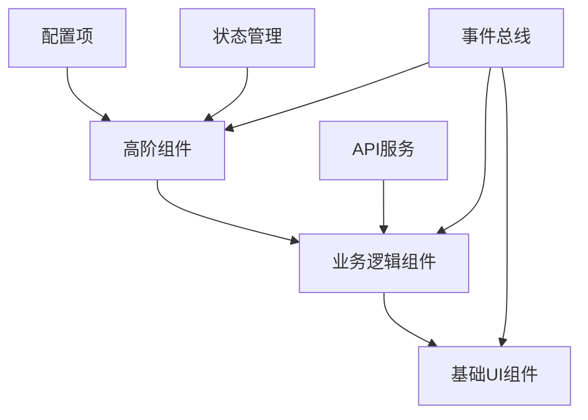
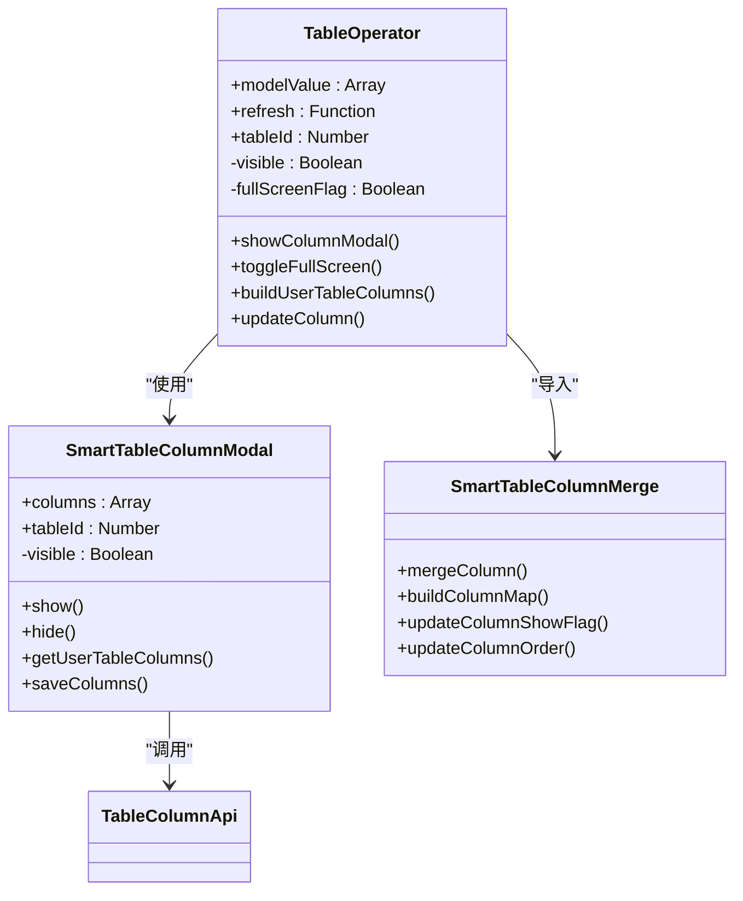
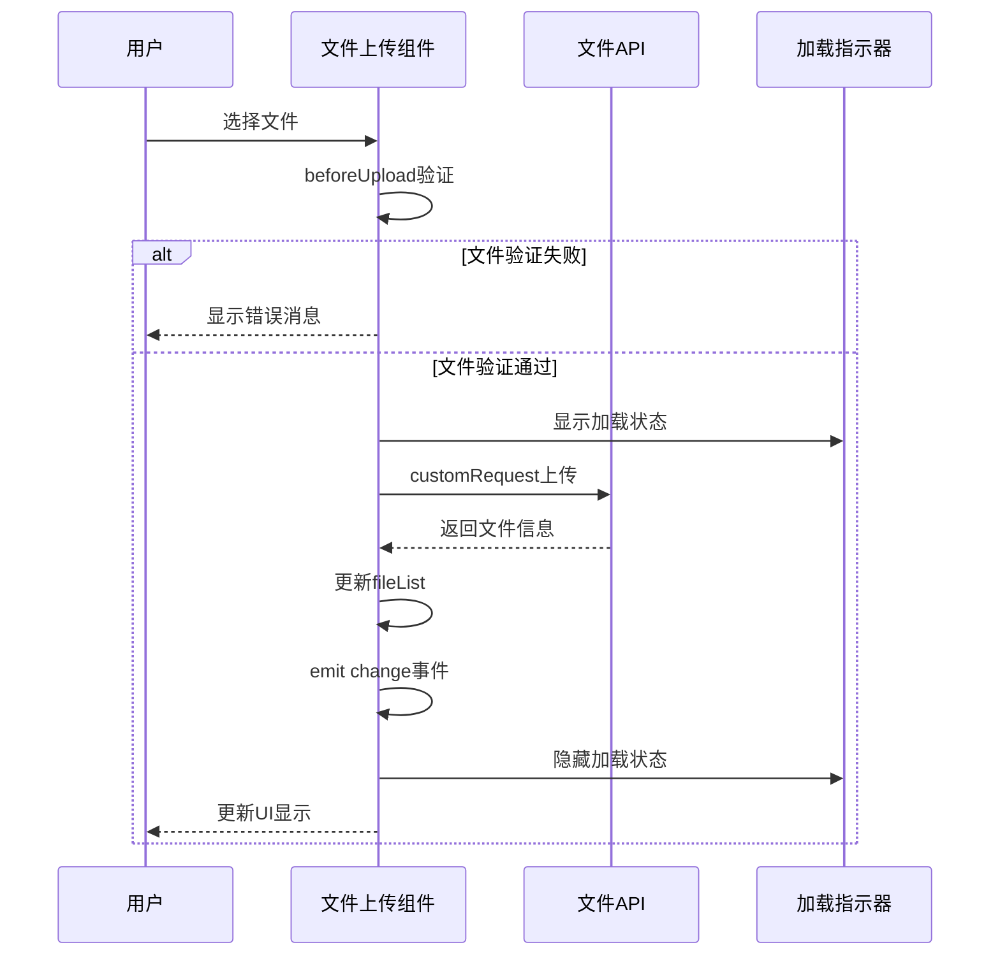
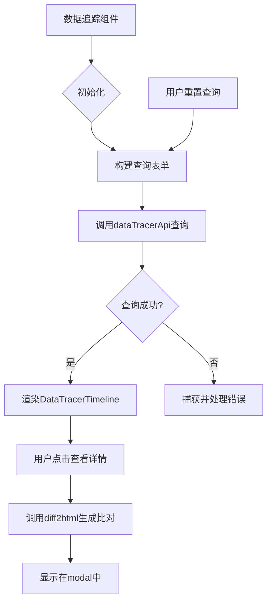
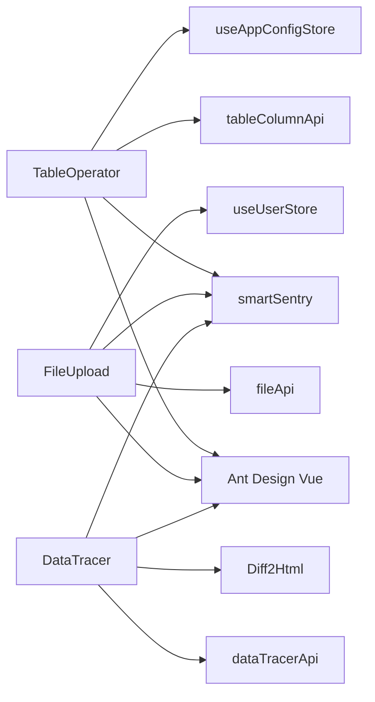

# 复合组件

<cite>
**本文档引用的文件**  
- [table-operator/index.vue](file://smart-admin-web-javascript/src/components/support/table-operator/index.vue)
- [table-operator/smart-table-column-merge.js](file://smart-admin-web-javascript/src/components/support/table-operator/smart-table-column-merge.js)
- [table-operator/smart-table-column-modal.vue](file://smart-admin-web-javascript/src/components/support/table-operator/smart-table-column-modal.vue)
- [file-upload/index.vue](file://smart-admin-web-javascript/src/components/support/file-upload/index.vue)
- [data-tracer/index.vue](file://smart-admin-web-javascript/src/components/support/data-tracer/index.vue)
- [data-tracer/data-tracer-table.vue](file://smart-admin-web-javascript/src/components/support/data-tracer/data-tracer-table.vue)
- [data-tracer/data-tracer-timeline.vue](file://smart-admin-web-javascript/src/components/support/data-tracer/data-tracer-timeline.vue)
- [table-id-const.js](file://smart-admin-web-javascript/src/constants/support/table-id-const.js)
- [file-const.js](file://smart-admin-web-javascript/src/constants/support/file-const.js)
- [data-tracer-const.js](file://smart-admin-web-javascript/src/constants/support/data-tracer-const.js)
</cite>

## 目录
1. [引言](#引言)
2. [项目结构](#项目结构)
3. [核心组件](#核心组件)
4. [架构概述](#架构概述)
5. [详细组件分析](#详细组件分析)
6. [依赖分析](#依赖分析)
7. [性能考虑](#性能考虑)
8. [故障排除指南](#故障排除指南)
9. [结论](#结论)

## 引言
本文档旨在深入分析智能管理系统中的复合组件设计模式，重点介绍高阶组件和复合组件的架构实现。文档将详细阐述表格操作符（table-operator）、文件上传（file-upload）和数据追踪（data-tracer）等关键组件的设计原理、组合方式和业务逻辑集成。通过分析这些组件如何通过mitt事件总线进行通信，以及如何在系统管理、数据审计等场景下进行集成和定制，为开发者提供全面的技术指导。

## 项目结构
本项目采用前后端分离架构，前端基于Vue3框架构建，后端采用Spring Boot 3技术栈。复合组件主要位于前端项目的`src/components/support`目录下，按照功能模块进行组织。每个复合组件都遵循统一的代码组织规范，包含模板、脚本和样式三个部分，通过props接收外部配置，通过emit触发事件，实现了高度的可复用性和可配置性。

```mermaid
graph TB
subgraph "前端项目"
A[smart-admin-web-javascript]
A --> B[src/components/support]
B --> C[table-operator]
B --> D[file-upload]
B --> E[data-tracer]
B --> F[dict-select]
B --> G[smart-enum-select]
end
subgraph "后端项目"
H[smart-admin-api-java17-springboot3]
H --> I[sa-base]
I --> J[module/support/datatracer]
I --> K[module/support/file]
I --> L[module/support/table]
end
A < --> H
```

**图表来源**
- [table-operator/index.vue](file://smart-admin-web-javascript/src/components/support/table-operator/index.vue)
- [data-tracer/index.vue](file://smart-admin-web-javascript/src/components/support/data-tracer/index.vue)

## 核心组件
系统中的核心复合组件包括表格操作符、文件上传和数据追踪三大模块。这些组件通过组合基础UI组件并添加特定业务逻辑，实现了复杂的用户交互模式。表格操作符组件提供了列配置、全屏显示等高级功能；文件上传组件支持多种文件类型和上传限制；数据追踪组件则实现了对数据变更的完整记录和可视化展示。

**章节来源**
- [table-operator/index.vue](file://smart-admin-web-javascript/src/components/support/table-operator/index.vue)
- [file-upload/index.vue](file://smart-admin-web-javascript/src/components/support/file-upload/index.vue)
- [data-tracer/index.vue](file://smart-admin-web-javascript/src/components/support/data-tracer/index.vue)

## 架构概述
复合组件采用分层架构设计，上层为高阶组件，负责组合和协调；中层为业务逻辑组件，实现具体功能；底层为基础UI组件，提供基本的交互元素。组件间通过事件总线进行松耦合通信，确保了系统的可维护性和可扩展性。配置项驱动的设计模式使得功能模块可以根据不同场景进行灵活定制。



**图表来源**
- [table-operator/index.vue](file://smart-admin-web-javascript/src/components/support/table-operator/index.vue)
- [data-tracer/index.vue](file://smart-admin-web-javascript/src/components/support/data-tracer/index.vue)

## 详细组件分析

### 表格操作符组件分析
表格操作符组件是一个典型的复合组件，它通过组合Ant Design Vue的表格组件和其他UI元素，提供了列配置、全屏切换等高级功能。组件通过`tableId`属性与后端服务关联，实现用户个性化列设置的持久化存储。



**图表来源**
- [table-operator/index.vue](file://smart-admin-web-javascript/src/components/support/table-operator/index.vue)
- [table-operator/smart-table-column-modal.vue](file://smart-admin-web-javascript/src/components/support/table-operator/smart-table-column-modal.vue)
- [table-operator/smart-table-column-merge.js](file://smart-admin-web-javascript/src/components/support/table-operator/smart-table-column-merge.js)

**章节来源**
- [table-operator/index.vue](file://smart-admin-web-javascript/src/components/support/table-operator/index.vue)
- [table-operator/smart-table-column-merge.js](file://smart-admin-web-javascript/src/components/support/table-operator/smart-table-column-merge.js)

### 文件上传组件分析
文件上传组件封装了复杂的文件上传逻辑，提供了统一的API接口。组件支持多种上传模式（单文件、多文件）、文件类型限制、大小限制等配置选项，并通过事件机制通知父组件上传状态的变化。



**图表来源**
- [file-upload/index.vue](file://smart-admin-web-javascript/src/components/support/file-upload/index.vue)
- [file-api.js](file://smart-admin-web-javascript/src/api/support/file-api.js)

**章节来源**
- [file-upload/index.vue](file://smart-admin-web-javascript/src/components/support/file-upload/index.vue)

### 数据追踪组件分析
数据追踪组件用于记录和展示数据的变更历史，支持表格和时间轴两种展示模式。组件通过dataId和type属性定位特定数据实体的变更记录，并提供详细的变更内容比对功能。



**图表来源**
- [data-tracer/index.vue](file://smart-admin-web-javascript/src/components/support/data-tracer/index.vue)
- [data-tracer-timeline.vue](file://smart-admin-web-javascript/src/components/support/data-tracer/data-tracer-timeline.vue)

**章节来源**
- [data-tracer/index.vue](file://smart-admin-web-javascript/src/components/support/data-tracer/index.vue)

## 依赖分析
复合组件依赖于多个外部模块和服务，形成了清晰的依赖关系网络。主要依赖包括UI框架组件、API服务、状态管理、工具库等。通过合理的依赖管理，确保了组件的独立性和可测试性。



**图表来源**
- [table-operator/index.vue](file://smart-admin-web-javascript/src/components/support/table-operator/index.vue)
- [file-upload/index.vue](file://smart-admin-web-javascript/src/components/support/file-upload/index.vue)
- [data-tracer/index.vue](file://smart-admin-web-javascript/src/components/support/data-tracer/index.vue)

**章节来源**
- [table-operator/index.vue](file://smart-admin-web-javascript/src/components/support/table-operator/index.vue)
- [file-upload/index.vue](file://smart-admin-web-javascript/src/components/support/file-upload/index.vue)
- [data-tracer/index.vue](file://smart-admin-web-javascript/src/components/support/data-tracer/index.vue)

## 性能考虑
在设计复合组件时，充分考虑了性能优化。通过使用`reactive`和`ref`等Vue3响应式API，确保了数据变更的高效更新。对于大数据量的表格操作，采用了虚拟滚动和懒加载等技术。文件上传组件通过分片上传和进度显示，提升了大文件上传的用户体验。数据追踪组件则通过分页查询和缓存机制，避免了一次性加载过多数据。

## 故障排除指南
当复合组件出现问题时，可以按照以下步骤进行排查：首先检查组件的props传递是否正确，特别是`tableId`、`dataId`等关键标识符；其次查看浏览器控制台是否有JavaScript错误；然后检查网络请求是否正常，API返回数据格式是否符合预期；最后确认相关配置项是否正确设置。对于文件上传问题，特别需要注意文件大小和类型限制的配置。

**章节来源**
- [table-operator/index.vue](file://smart-admin-web-javascript/src/components/support/table-operator/index.vue)
- [file-upload/index.vue](file://smart-admin-web-javascript/src/components/support/file-upload/index.vue)
- [data-tracer/index.vue](file://smart-admin-web-javascript/src/components/support/data-tracer/index.vue)

## 结论
本文档详细分析了智能管理系统中的复合组件设计模式，展示了如何通过高阶组件和复合组件的组合来实现复杂的业务功能。这些组件不仅提高了代码的复用性，还通过统一的设计模式降低了维护成本。未来可以进一步优化组件的可配置性，增加更多的集成场景示例，为开发者提供更加完善的使用指南。