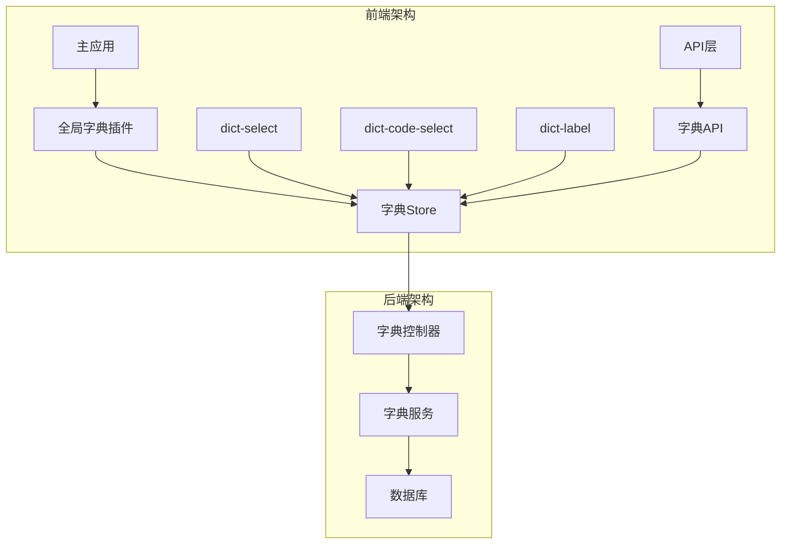
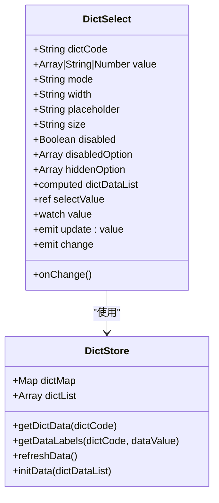
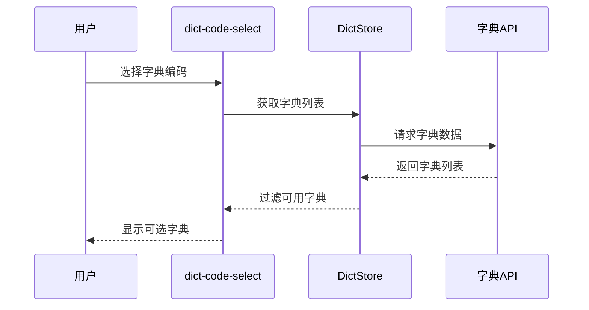
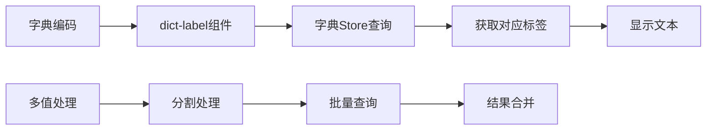
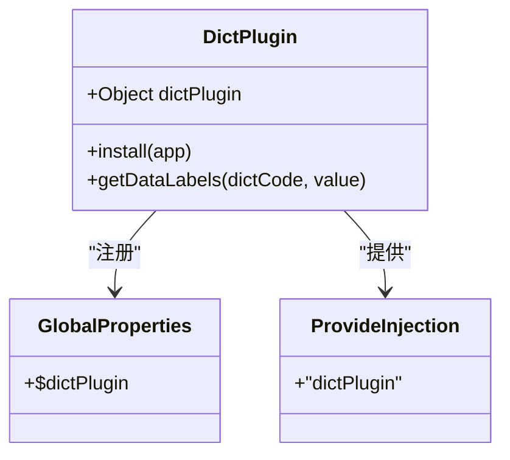
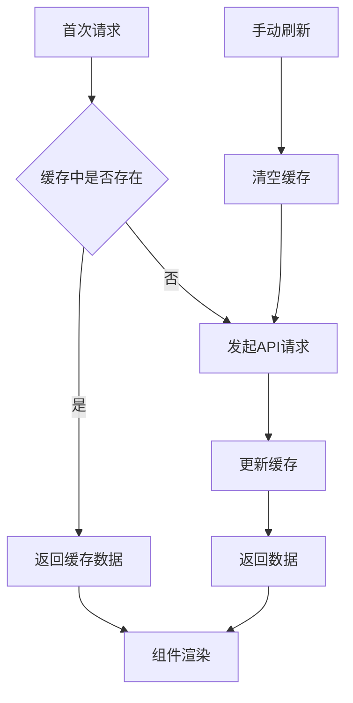
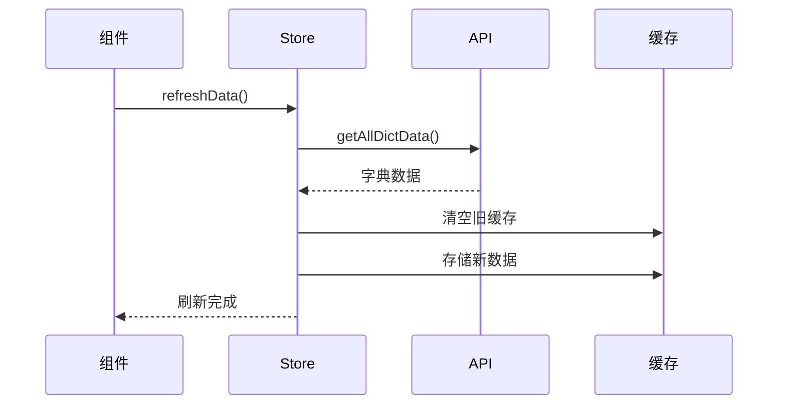
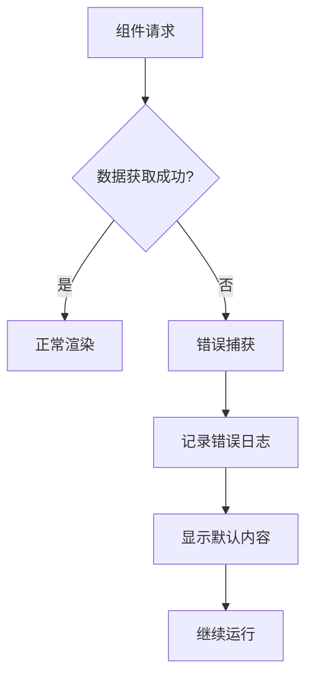

# 字典组件系列设计与实现文档

<cite>
**本文档中引用的文件**
- [dict-plugin.js](file://smart-admin-web-javascript/src/plugins/dict-plugin.js)
- [dict-select/index.vue](file://smart-admin-web-javascript/src/components/support/dict-select/index.vue)
- [dict-code-select/index.vue](file://smart-admin-web-javascript/src/components/support/dict-code-select/index.vue)
- [dict-label/index.vue](file://smart-admin-web-javascript/src/components/support/dict-label/index.vue)
- [dict.js](file://smart-admin-web-javascript/src/store/modules/system/dict.js)
- [dict-const.js](file://smart-admin-web-javascript/src/constants/support/dict-const.js)
- [dict-api.js](file://smart-admin-web-javascript/src/api/support/dict-api.js)
- [main.js](file://smart-admin-web-javascript/src/main.js)
- [goods-list.vue](file://smart-admin-web-javascript/src/views/business/erp/goods/goods-list.vue)
- [code-generator-table-config-form-field.vue](file://smart-admin-web-javascript/src/views/support/code-generator/components/form/code-generator-table-config-form-field.vue)
- [table-header-cell/index.vue](file://smart-admin-web-javascript/src/components/support/table-header-cell/index.vue)
</cite>

## 目录
1. [概述](#概述)
2. [架构设计](#架构设计)
3. [核心组件分析](#核心组件分析)
4. [全局字典插件](#全局字典插件)
5. [数据存储与缓存](#数据存储与缓存)
6. [使用场景与示例](#使用场景与示例)
7. [动态刷新机制](#动态刷新机制)
8. [本地化适配](#本地化适配)
9. [错误处理与默认行为](#错误处理与默认行为)
10. [性能优化策略](#性能优化策略)
11. [总结](#总结)

## 概述

字典组件系列是Smart Admin框架中的核心数据展示和选择组件，包含三个主要组件：`dict-select`（下拉选择）、`dict-code-select`（字典编码选择）和`dict-label`（字典标签）。这些组件通过全局字典插件实现数据缓存与按需加载，避免重复请求，提供高效的字典数据管理解决方案。

### 组件职责划分

- **dict-select**: 提供标准的下拉选择功能，支持单选和多选模式
- **dict-code-select**: 通过字典编码快速渲染，主要用于选择字典类型
- **dict-label**: 用于展示字典文本标签，提供只读的字典数据显示

## 架构设计



**图表来源**
- [dict-plugin.js](file://smart-admin-web-javascript/src/plugins/dict-plugin.js#L1-L32)
- [dict.js](file://smart-admin-web-javascript/src/store/modules/system/dict.js#L1-L87)

## 核心组件分析

### dict-select 组件

`dict-select`是最常用的字典选择组件，提供完整的下拉选择功能。

#### 主要特性



**图表来源**
- [dict-select/index.vue](file://smart-admin-web-javascript/src/components/support/dict-select/index.vue#L34-L67)
- [dict.js](file://smart-admin-web-javascript/src/store/modules/system/dict.js#L21-L55)

#### 核心功能实现

1. **数据过滤**: 支持禁用选项和隐藏选项的过滤
2. **双向绑定**: 通过v-model实现数据的双向绑定
3. **多选支持**: 支持combobox和multiple两种模式
4. **动态验证**: 自动验证传入值的有效性

**章节来源**
- [dict-select/index.vue](file://smart-admin-web-javascript/src/components/support/dict-select/index.vue#L72-L76)
- [dict-select/index.vue](file://smart-admin-web-javascript/src/components/support/dict-select/index.vue#L82-L93)

### dict-code-select 组件

专门用于选择字典类型的组件，提供快速的字典编码选择功能。

#### 实现特点



**图表来源**
- [dict-code-select/index.vue](file://smart-admin-web-javascript/src/components/support/dict-code-select/index.vue#L56-L57)
- [dict.js](file://smart-admin-web-javascript/src/store/modules/system/dict.js#L66-L84)

**章节来源**
- [dict-code-select/index.vue](file://smart-admin-web-javascript/src/components/support/dict-code-select/index.vue#L1-L74)

### dict-label 组件

最简单的字典展示组件，专注于只读的数据展示。

#### 设计理念



**图表来源**
- [dict-label/index.vue](file://smart-admin-web-javascript/src/components/support/dict-label/index.vue#L13-L15)
- [dict.js](file://smart-admin-web-javascript/src/store/modules/system/dict.js#L46-L54)

**章节来源**
- [dict-label/index.vue](file://smart-admin-web-javascript/src/components/support/dict-label/index.vue#L1-L17)

## 全局字典插件

全局字典插件提供了统一的字典访问接口，简化了组件间的字典数据共享。

### 插件结构



**图表来源**
- [dict-plugin.js](file://smart-admin-web-javascript/src/plugins/dict-plugin.js#L13-L31)

### 插件集成

插件在应用启动时自动注册到Vue实例中，提供全局访问能力。

**章节来源**
- [dict-plugin.js](file://smart-admin-web-javascript/src/plugins/dict-plugin.js#L1-L32)
- [main.js](file://smart-admin-web-javascript/src/main.js#L81-L82)

## 数据存储与缓存

### Store架构

字典数据通过Pinia Store进行集中管理，采用Map结构存储字典数据，提供高效的查找性能。

#### 数据结构设计

| 属性 | 类型 | 描述 |
|------|------|------|
| dictList | Array | 字典基本信息列表 |
| dictMap | Map | 字典数据映射表，键为字典编码，值为字典项数组 |

#### 缓存策略



**图表来源**
- [dict.js](file://smart-admin-web-javascript/src/store/modules/system/dict.js#L7-L14)
- [dict.js](file://smart-admin-web-javascript/src/store/modules/system/dict.js#L21-L27)

**章节来源**
- [dict.js](file://smart-admin-web-javascript/src/store/modules/system/dict.js#L1-L87)

## 使用场景与示例

### 表单场景

在表单中使用字典组件进行数据选择：

```vue
<!-- 表单字段示例 -->
<DictSelect
  v-model:value="formData.status"
  dictCode="USER_STATUS"
  placeholder="请选择用户状态"
  width="200px"
/>
```

### 表格列渲染

在表格中使用字典组件进行数据展示：

```javascript
// 表格列配置
const columns = [
  {
    title: '用户状态',
    dataIndex: 'status',
    render: (text) => h(DictLabel, { 
      dictCode: 'USER_STATUS', 
      dataValue: text 
    })
  }
];
```

### 动态筛选

在表格头部单元格中使用字典筛选：

```javascript
// 筛选配置
{
  title: '地区',
  dataIndex: 'region',
  filterOptions: {
    type: 'dict-select',
    dictCode: 'REGION_DICT'
  }
}
```

**章节来源**
- [goods-list.vue](file://smart-admin-web-javascript/src/views/business/erp/goods/goods-list.vue#L244-L247)
- [table-header-cell/index.vue](file://smart-admin-web-javascript/src/components/support/table-header-cell/index.vue#L44-L57)

## 动态刷新机制

### 刷新触发时机

字典数据支持多种刷新机制：

1. **应用启动时自动刷新**
2. **手动触发刷新**
3. **组件级刷新**

### 刷新流程



**图表来源**
- [dict.js](file://smart-admin-web-javascript/src/store/modules/system/dict.js#L56-L64)
- [code-generator-table-config-form-field.vue](file://smart-admin-web-javascript/src/views/support/code-generator/components/form/code-generator-table-config-form-field.vue#L90-L92)

**章节来源**
- [dict.js](file://smart-admin-web-javascript/src/store/modules/system/dict.js#L56-L64)

## 本地化适配

### 多语言支持

字典组件天然支持国际化，通过字典数据的本地化标签实现多语言显示。

### 本地化策略

1. **字典数据本地化**: 后端提供多语言字典标签
2. **组件本地化**: 组件内部的占位符和提示信息
3. **动态切换**: 支持运行时语言切换

## 错误处理与默认行为

### 默认行为设计

| 场景 | 默认行为 |
|------|----------|
| 字典数据为空 | 显示空字符串 |
| 值不存在 | 显示原始值或空字符串 |
| 网络错误 | 记录错误但不影响界面 |
| 参数无效 | 安全处理，不抛出异常 |

### 错误处理机制



**图表来源**
- [dict.js](file://smart-admin-web-javascript/src/store/modules/system/dict.js#L58-L63)

**章节来源**
- [dict.js](file://smart-admin-web-javascript/src/store/modules/system/dict.js#L29-L35)

## 性能优化策略

### 缓存优化

1. **内存缓存**: 将字典数据缓存在Store中
2. **懒加载**: 按需加载字典数据
3. **去重处理**: 避免重复请求相同字典

### 渲染优化

1. **计算属性**: 使用computed优化数据处理
2. **条件渲染**: 只渲染必要的DOM节点
3. **防抖处理**: 避免频繁的重新渲染

### 网络优化

1. **批量请求**: 一次性获取多个字典数据
2. **请求合并**: 合并相似的请求
3. **超时控制**: 设置合理的请求超时时间

## 总结

字典组件系列通过精心设计的架构实现了高效、灵活的字典数据管理。主要优势包括：

1. **模块化设计**: 三个组件各司其职，功能明确
2. **高性能缓存**: 通过Store实现数据缓存，避免重复请求
3. **灵活配置**: 支持多种使用场景和配置选项
4. **良好的扩展性**: 易于扩展新的字典类型和功能
5. **完善的错误处理**: 提供健壮的错误处理机制

这套字典组件体系不仅提高了开发效率，还确保了用户体验的一致性和稳定性，是Smart Admin框架中不可或缺的重要组成部分。