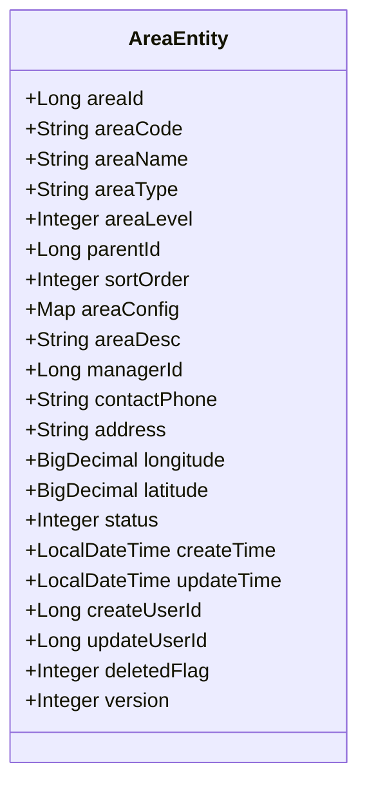
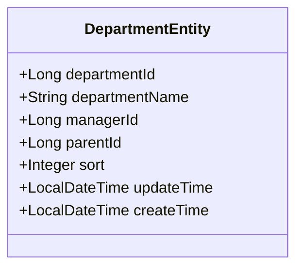
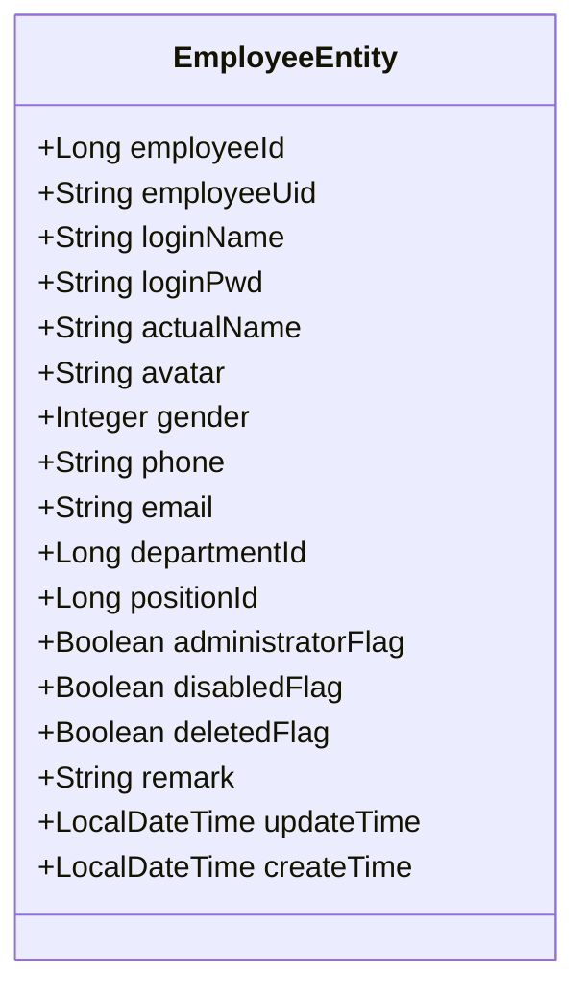
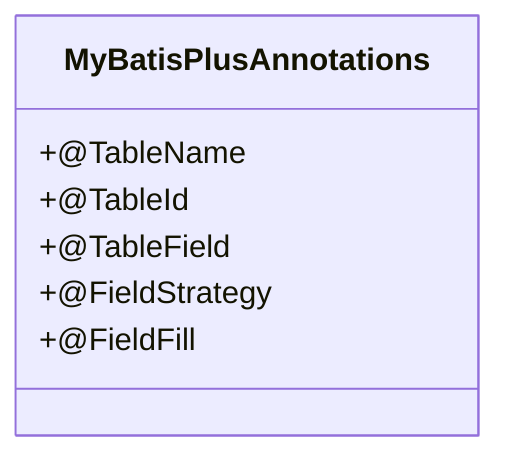
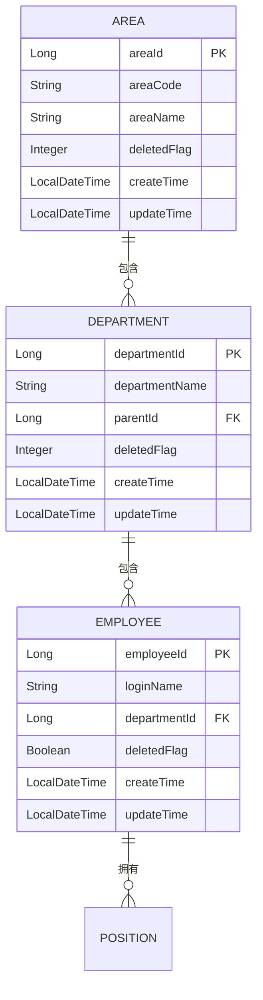
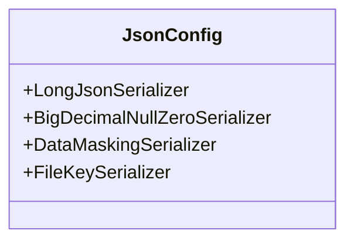
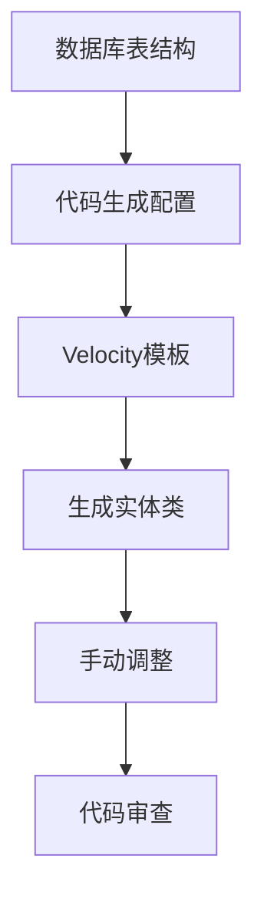

# 实体模型设计

<cite>
**本文档引用的文件**  
- [AreaEntity.java](file://smart-admin-api-java17-springboot3\sa-admin\src\main\java\net\lab1024\sa\admin\module\system\area\domain\entity\AreaEntity.java)
- [DepartmentEntity.java](file://smart-admin-api-java17-springboot3\sa-admin\src\main\java\net\lab1024\sa\admin\module\system\department\domain\entity\DepartmentEntity.java)
- [EmployeeEntity.java](file://smart-admin-api-java17-springboot3\sa-admin\src\main\java\net\lab1024\sa\admin\module\system\employee\domain\entity\EmployeeEntity.java)
- [MybatisPlusConfig.java](file://smart-admin-api-java17-springboot3\sa-base\src\main\java\net\lab1024\sa\base\config\MybatisPlusConfig.java)
- [JsonConfig.java](file://smart-admin-api-java17-springboot3\sa-base\src\main\java\net\lab1024\sa\base\config\JsonConfig.java)
- [MybatisPlusFillHandler.java](file://smart-admin-api-java17-springboot3\sa-base\src\main\java\net\lab1024\sa\base\handler\MybatisPlusFillHandler.java)
- [Entity.java.vm](file://smart-admin-api-java17-springboot3\sa-base\src\main\resources\code-generator-template\java\domain\entity\Entity.java.vm)
</cite>

## 目录
1. [引言](#引言)
2. [实体类设计规范](#实体类设计规范)
3. [核心实体类分析](#核心实体类分析)
4. [注解应用详解](#注解应用详解)
5. [数据库映射关系](#数据库映射关系)
6. [字段命名与数据类型](#字段命名与数据类型)
7. [继承与复杂类型处理](#继承与复杂类型处理)
8. [最佳实践](#最佳实践)

## 引言
本文档详细介绍了IOE-DREAM项目中基于MyBatis-Plus的实体模型设计规范。通过分析AreaEntity、DepartmentEntity、EmployeeEntity等核心实体类，阐述了Lombok和MyBatis-Plus注解的应用，实体类与数据库表的映射关系，以及业务字段命名规范和数据类型选择原则。

## 实体类设计规范
IOE-DREAM项目中的实体类遵循统一的设计规范，确保代码的一致性和可维护性。实体类位于`module/system`模块下的`domain/entity`包中，每个实体类对应数据库中的一个表。

**实体类结构**
- 使用Lombok的`@Data`注解自动生成getter、setter、toString等方法
- 使用MyBatis-Plus的`@TableName`注解指定对应的数据库表名
- 主键字段使用`@TableId`注解，并设置自增策略
- 通用字段如createTime、updateTime、deletedFlag等遵循统一命名规范

**Section sources**
- [AreaEntity.java](file://smart-admin-api-java17-springboot3\sa-admin\src\main\java\net\lab1024\sa\admin\module\system\area\domain\entity\AreaEntity.java#L1-L132)
- [DepartmentEntity.java](file://smart-admin-api-java17-springboot3\sa-admin\src\main\java\net\lab1024\sa\admin\module\system\department\domain\entity\DepartmentEntity.java#L1-L65)

## 核心实体类分析
### AreaEntity分析
AreaEntity是区域管理的核心实体类，包含区域的基本信息、配置和状态管理。



**Diagram sources**
- [AreaEntity.java](file://smart-admin-api-java17-springboot3\sa-admin\src\main\java\net\lab1024\sa\admin\module\system\area\domain\entity\AreaEntity.java#L1-L132)

**Section sources**
- [AreaEntity.java](file://smart-admin-api-java17-springboot3\sa-admin\src\main\java\net\lab1024\sa\admin\module\system\area\domain\entity\AreaEntity.java#L1-L132)

### DepartmentEntity分析
DepartmentEntity表示部门信息，包含部门名称、负责人、层级关系等属性。



**Diagram sources**
- [DepartmentEntity.java](file://smart-admin-api-java17-springboot3\sa-admin\src\main\java\net\lab1024\sa\admin\module\system\department\domain\entity\DepartmentEntity.java#L1-L65)

**Section sources**
- [DepartmentEntity.java](file://smart-admin-api-java17-springboot3\sa-admin\src\main\java\net\lab1024\sa\admin\module\system\department\domain\entity\DepartmentEntity.java#L1-L65)

### EmployeeEntity分析
EmployeeEntity表示员工信息，包含登录账户、个人信息、部门归属等。



**Diagram sources**
- [EmployeeEntity.java](file://smart-admin-api-java17-springboot3\sa-admin\src\main\java\net\lab1024\sa\admin\module\system\employee\domain\entity\EmployeeEntity.java#L1-L103)

**Section sources**
- [EmployeeEntity.java](file://smart-admin-api-java17-springboot3\sa-admin\src\main\java\net\lab1024\sa\admin\module\system\employee\domain\entity\EmployeeEntity.java#L1-L103)

## 注解应用详解
### Lombok注解
- `@Data`: 自动生成getter、setter、toString、equals、hashCode等方法
- `@NoArgsConstructor`: 生成无参构造函数
- `@AllArgsConstructor`: 生成全参构造函数

### MyBatis-Plus注解
- `@TableName`: 指定实体类对应的数据库表名
- `@TableId`: 标识主键字段，可设置自增策略
- `@TableField`: 配置字段属性，如填充策略、更新策略等



**Diagram sources**
- [MybatisPlusConfig.java](file://smart-admin-api-java17-springboot3\sa-base\src\main\java\net\lab1024\sa\base\config\MybatisPlusConfig.java#L1-L34)
- [MybatisPlusFillHandler.java](file://smart-admin-api-java17-springboot3\sa-base\src\main\java\net\lab1024\sa\base\handler\MybatisPlusFillHandler.java#L1-L40)

**Section sources**
- [MybatisPlusConfig.java](file://smart-admin-api-java17-springboot3\sa-base\src\main\java\net\lab1024\sa\base\config\MybatisPlusConfig.java#L1-L34)
- [MybatisPlusFillHandler.java](file://smart-admin-api-java17-springboot3\sa-base\src\main\java\net\lab1024\sa\base\handler\MybatisPlusFillHandler.java#L1-L40)

## 数据库映射关系
### 逻辑删除字段
项目采用逻辑删除而非物理删除，通过`deletedFlag`字段标识记录状态：
- 0: 未删除
- 1: 已删除



**Diagram sources**
- [AreaEntity.java](file://smart-admin-api-java17-springboot3\sa-admin\src\main\java\net\lab1024\sa\admin\module\system\area\domain\entity\AreaEntity.java#L1-L132)
- [DepartmentEntity.java](file://smart-admin-api-java17-springboot3\sa-admin\src\main\java\net\lab1024\sa\admin\module\system\department\domain\entity\DepartmentEntity.java#L1-L65)
- [EmployeeEntity.java](file://smart-admin-api-java17-springboot3\sa-admin\src\main\java\net\lab1024\sa\admin\module\system\employee\domain\entity\EmployeeEntity.java#L1-L103)

**Section sources**
- [AreaEntity.java](file://smart-admin-api-java17-springboot3\sa-admin\src\main\java\net\lab1024\sa\admin\module\system\area\domain\entity\AreaEntity.java#L1-L132)
- [DepartmentEntity.java](file://smart-admin-api-java17-springboot3\sa-admin\src\main\java\net\lab1024\sa\admin\module\system\department\domain\entity\DepartmentEntity.java#L1-L65)
- [EmployeeEntity.java](file://smart-admin-api-java17-springboot3\sa-admin\src\main\java\net\lab1024\sa\admin\module\system\employee\domain\entity\EmployeeEntity.java#L1-L103)

### JSON类型处理器
对于复杂类型字段，使用JacksonTypeHandler进行序列化和反序列化：

```java
@TableField(typeHandler = JacksonTypeHandler.class)
private Map<String, Object> areaConfig;
```

**Section sources**
- [AreaEntity.java](file://smart-admin-api-java17-springboot3\sa-admin\src\main\java\net\lab1024\sa\admin\module\system\area\domain\entity\AreaEntity.java#L63-L64)

## 字段命名与数据类型
### 命名规范
- 主键字段：`{entityName}Id`，如`areaId`、`departmentId`
- 外键字段：`{referencedEntity}Id`，如`parentId`、`managerId`
- 状态字段：`{fieldName}Flag`，如`deletedFlag`、`disabledFlag`
- 时间字段：`createTime`、`updateTime`

### 数据类型选择
- ID字段：Long
- 名称字段：String
- 状态字段：Integer或Boolean
- 数值字段：BigDecimal
- 时间字段：LocalDateTime
- 复杂对象：Map<String, Object>配合JacksonTypeHandler

**Section sources**
- [AreaEntity.java](file://smart-admin-api-java17-springboot3\sa-admin\src\main\java\net\lab1024\sa\admin\module\system\area\domain\entity\AreaEntity.java#L1-L132)
- [DepartmentEntity.java](file://smart-admin-api-java17-springboot3\sa-admin\src\main\java\net\lab1024\sa\admin\module\system\department\domain\entity\DepartmentEntity.java#L1-L65)
- [EmployeeEntity.java](file://smart-admin-api-java17-springboot3\sa-admin\src\main\java\net\lab1024\sa\admin\module\system\employee\domain\entity\EmployeeEntity.java#L1-L103)

## 继承与复杂类型处理
### 实体继承
项目中实体类通常不使用继承，而是通过组合和关联来建立关系。对于通用字段，通过代码生成模板统一处理。

### 嵌套对象处理
对于需要存储复杂结构的字段，使用Map类型配合JacksonTypeHandler：

```java
@TableField(typeHandler = JacksonTypeHandler.class)
private Map<String, Object> areaConfig;
```

### 复杂类型序列化
通过自定义序列化器处理特殊类型：



**Diagram sources**
- [JsonConfig.java](file://smart-admin-api-java17-springboot3\sa-base\src\main\java\net\lab1024\sa\base\config\JsonConfig.java#L1-L64)

**Section sources**
- [JsonConfig.java](file://smart-admin-api-java17-springboot3\sa-base\src\main\java\net\lab1024\sa\base\config\JsonConfig.java#L1-L64)

## 最佳实践
### 代码生成模板
项目使用Velocity模板自动生成实体类代码，确保一致性：



**Diagram sources**
- [Entity.java.vm](file://smart-admin-api-java17-springboot3\sa-base\src\main\resources\code-generator-template\java\domain\entity\Entity.java.vm#L1-L38)

**Section sources**
- [Entity.java.vm](file://smart-admin-api-java17-springboot3\sa-base\src\main\resources\code-generator-template\java\domain\entity\Entity.java.vm#L1-L38)

### 自动填充
使用MyBatis-Plus的自动填充功能处理创建时间和更新时间：

```java
@Component
public class MybatisPlusFillHandler implements MetaObjectHandler {
    @Override
    public void insertFill(MetaObject metaObject) {
        if (metaObject.hasSetter("createTime")) {
            this.fillStrategy(metaObject, "createTime", LocalDateTime.now());
        }
        if (metaObject.hasSetter("updateTime")) {
            this.fillStrategy(metaObject, "updateTime", LocalDateTime.now());
        }
    }

    @Override
    public void updateFill(MetaObject metaObject) {
        if (metaObject.hasSetter("updateTime")) {
            this.fillStrategy(metaObject, "updateTime", LocalDateTime.now());
        }
    }
}
```

**Section sources**
- [MybatisPlusFillHandler.java](file://smart-admin-api-java17-springboot3\sa-base\src\main\java\net\lab1024\sa\base\handler\MybatisPlusFillHandler.java#L1-L40)

### 版本控制
对于需要乐观锁控制的实体，添加version字段：

```java
/**
 * 版本号（乐观锁）
 */
private Integer version;
```

**Section sources**
- [AreaEntity.java](file://smart-admin-api-java17-springboot3\sa-admin\src\main\java\net\lab1024\sa\admin\module\system\area\domain\entity\AreaEntity.java#L129-L130)