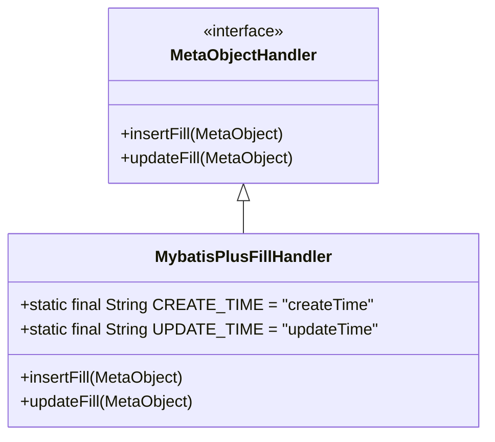
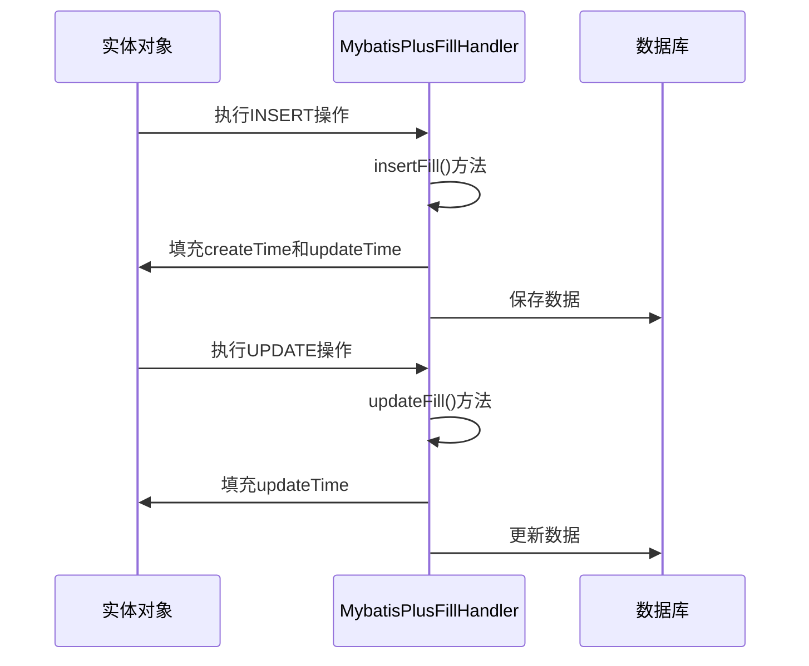
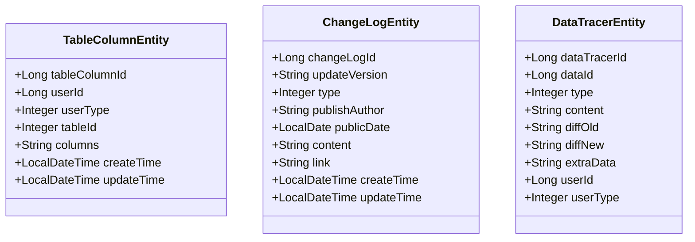
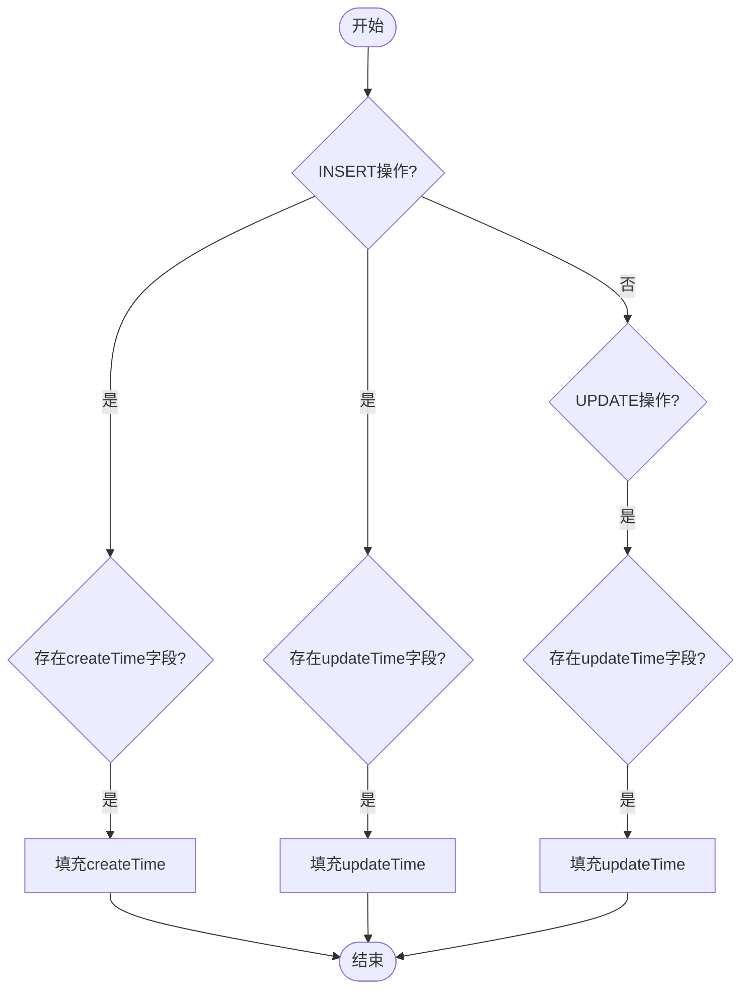

# 审计字段管理

<cite>
**本文档引用的文件**
- [MybatisPlusFillHandler.java](file://smart-admin-api-java17-springboot3\sa-base\src\main\java\net\lab1024\sa\base\handler\MybatisPlusFillHandler.java)
- [TableColumnEntity.java](file://smart-admin-api-java17-springboot3\sa-base\src\main\java\net\lab1024\sa\base\module\support\table\domain\TableColumnEntity.java)
- [ChangeLogEntity.java](file://smart-admin-api-java17-springboot3\sa-base\src\main\java\net\lab1024\sa\base\module\support\changelog\domain\entity\ChangeLogEntity.java)
- [DataTracerEntity.java](file://smart-admin-api-java17-springboot3\sa-base\src\main\java\net\lab1024\sa\base\module\support\datatracer\domain\entity\DataTracerEntity.java)
</cite>

## 目录
1. [引言](#引言)
2. [审计字段概述](#审计字段概述)
3. [MybatisPlusFillHandler实现原理](#mybatisplusfillhandler实现原理)
4. [字段自动填充机制](#字段自动填充机制)
5. [实体类中的审计字段定义](#实体类中的审计字段定义)
6. [配置方法](#配置方法)
7. [填充时机与条件判断](#填充时机与条件判断)
8. [实际应用示例](#实际应用示例)
9. [总结](#总结)

## 引言
本文档详细介绍了系统中审计字段的自动填充机制，重点阐述了`create_time`、`update_time`、`create_user_id`、`update_user_id`等审计字段的管理方式。通过分析MybatisPlusFillHandler的实现原理和配置方法，为开发人员提供完整的审计字段管理指南。

## 审计字段概述
审计字段是系统中用于记录数据创建和修改信息的重要字段，主要包括：
- **create_time**: 记录数据创建时间
- **update_time**: 记录数据最后更新时间
- **create_user_id**: 记录数据创建者ID
- **update_user_id**: 记录数据最后修改者ID

这些字段对于数据追踪、安全审计和问题排查具有重要意义。

## MybatisPlusFillHandler实现原理
MybatisPlusFillHandler是基于MyBatis-Plus框架的MetaObjectHandler接口实现的字段自动填充处理器。



**图示来源**
- [MybatisPlusFillHandler.java](file://smart-admin-api-java17-springboot3\sa-base\src\main\java\net\lab1024\sa\base\handler\MybatisPlusFillHandler.java#L1-L40)

**本节来源**
- [MybatisPlusFillHandler.java](file://smart-admin-api-java17-springboot3\sa-base\src\main\java\net\lab1024\sa\base\handler\MybatisPlusFillHandler.java#L1-L40)

## 字段自动填充机制
系统通过MyBatis-Plus的自动填充功能实现审计字段的自动化管理。当执行INSERT或UPDATE操作时，框架会自动调用相应的填充方法。



**图示来源**
- [MybatisPlusFillHandler.java](file://smart-admin-api-java17-springboot3\sa-base\src\main\java\net\lab1024\sa\base\handler\MybatisPlusFillHandler.java#L23-L38)

**本节来源**
- [MybatisPlusFillHandler.java](file://smart-admin-api-java17-springboot3\sa-base\src\main\java\net\lab1024\sa\base\handler\MybatisPlusFillHandler.java#L23-L38)

## 实体类中的审计字段定义
在实体类中，审计字段通常定义为LocalDateTime类型，并直接声明在需要审计的实体中。



**图示来源**
- [TableColumnEntity.java](file://smart-admin-api-java17-springboot3\sa-base\src\main\java\net\lab1024\sa\base\module\support\table\domain\TableColumnEntity.java#L21-L49)
- [ChangeLogEntity.java](file://smart-admin-api-java17-springboot3\sa-base\src\main\java\net\lab1024\sa\base\module\support\changelog\domain\entity\ChangeLogEntity.java#L15-L68)
- [DataTracerEntity.java](file://smart-admin-api-java17-springboot3\sa-base\src\main\java\net\lab1024\sa\base\module\support\datatracer\domain\entity\DataTracerEntity.java#L15-L64)

**本节来源**
- [TableColumnEntity.java](file://smart-admin-api-java17-springboot3\sa-base\src\main\java\net\lab1024\sa\base\module\support\table\domain\TableColumnEntity.java#L21-L49)
- [ChangeLogEntity.java](file://smart-admin-api-java17-springboot3\sa-base\src\main\java\net\lab1024\sa\base\module\support\changelog\domain\entity\ChangeLogEntity.java#L15-L68)
- [DataTracerEntity.java](file://smart-admin-api-java17-springboot3\sa-base\src\main\java\net\lab1024\sa\base\module\support\datatracer\domain\entity\DataTracerEntity.java#L15-L64)

## 配置方法
要启用审计字段自动填充功能，需要进行以下配置：

1. **创建填充处理器**：实现MetaObjectHandler接口
2. **注册为Spring Bean**：使用@Component注解
3. **定义常量字段**：声明CREATE_TIME和UPDATE_TIME常量
4. **实现填充逻辑**：在insertFill和updateFill方法中设置值

```mermaid
flowchart TD
A[创建MybatisPlusFillHandler类] --> B[实现MetaObjectHandler接口]
B --> C[添加@Component注解]
C --> D[定义CREATE_TIME和UPDATE_TIME常量]
D --> E[实现insertFill方法]
E --> F[实现updateFill方法]
F --> G[自动填充字段值]
```

**本节来源**
- [MybatisPlusFillHandler.java](file://smart-admin-api-java17-springboot3\sa-base\src\main\java\net\lab1024\sa\base\handler\MybatisPlusFillHandler.java#L1-L40)

## 填充时机与条件判断
审计字段的填充时机和条件判断逻辑如下：

### INSERT操作填充
- **时机**：执行INSERT语句时
- **条件**：实体中存在createTime或updateTime字段
- **填充字段**：createTime和updateTime都填充当前时间

### UPDATE操作填充
- **时机**：执行UPDATE语句时
- **条件**：实体中存在updateTime字段
- **填充字段**：仅填充updateTime为当前时间



**图示来源**
- [MybatisPlusFillHandler.java](file://smart-admin-api-java17-springboot3\sa-base\src\main\java\net\lab1024\sa\base\handler\MybatisPlusFillHandler.java#L23-L38)

**本节来源**
- [MybatisPlusFillHandler.java](file://smart-admin-api-java17-springboot3\sa-base\src\main\java\net\lab1024\sa\base\handler\MybatisPlusFillHandler.java#L23-L38)

## 实际应用示例
以下是一些实际应用中的审计字段使用示例：

### 表格列配置实体
```java
public class TableColumnEntity {
    private LocalDateTime createTime;  // 创建时间
    private LocalDateTime updateTime;  // 更新时间
}
```

### 系统更新日志实体
```java
public class ChangeLogEntity {
    private LocalDateTime createTime;  // 创建时间
    private LocalDateTime updateTime;  // 更新时间
}
```

### 数据变动记录实体
```java
public class DataTracerEntity {
    // 虽然没有直接的时间字段，但通过关联实体获取
}
```

**本节来源**
- [TableColumnEntity.java](file://smart-admin-api-java17-springboot3\sa-base\src\main\java\net\lab1024\sa\base\module\support\table\domain\TableColumnEntity.java#L46-L48)
- [ChangeLogEntity.java](file://smart-admin-api-java17-springboot3\sa-base\src\main\java\net\lab1024\sa\base\module\support\changelog\domain\entity\ChangeLogEntity.java#L55-L60)

## 总结
本文档详细介绍了系统中审计字段的自动填充机制。通过MybatisPlusFillHandler的实现，系统能够自动管理create_time和update_time等审计字段，确保数据的完整性和可追溯性。开发人员在创建新的实体类时，只需按照规范定义相应的字段，即可享受自动填充带来的便利。

**本节来源**
- [MybatisPlusFillHandler.java](file://smart-admin-api-java17-springboot3\sa-base\src\main\java\net\lab1024\sa\base\handler\MybatisPlusFillHandler.java#L1-L40)
- [TableColumnEntity.java](file://smart-admin-api-java17-springboot3\sa-base\src\main\java\net\lab1024\sa\base\module\support\table\domain\TableColumnEntity.java#L21-L49)
- [ChangeLogEntity.java](file://smart-admin-api-java17-springboot3\sa-base\src\main\java\net\lab1024\sa\base\module\support\changelog\domain\entity\ChangeLogEntity.java#L15-L68)
- [DataTracerEntity.java](file://smart-admin-api-java17-springboot3\sa-base\src\main\java\net\lab1024\sa\base\module\support\datatracer\domain\entity\DataTracerEntity.java#L15-L64)