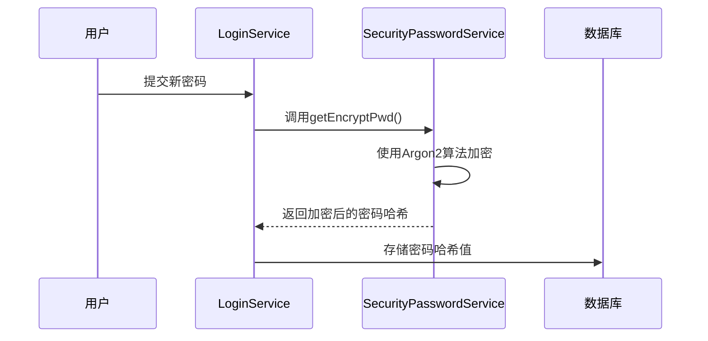
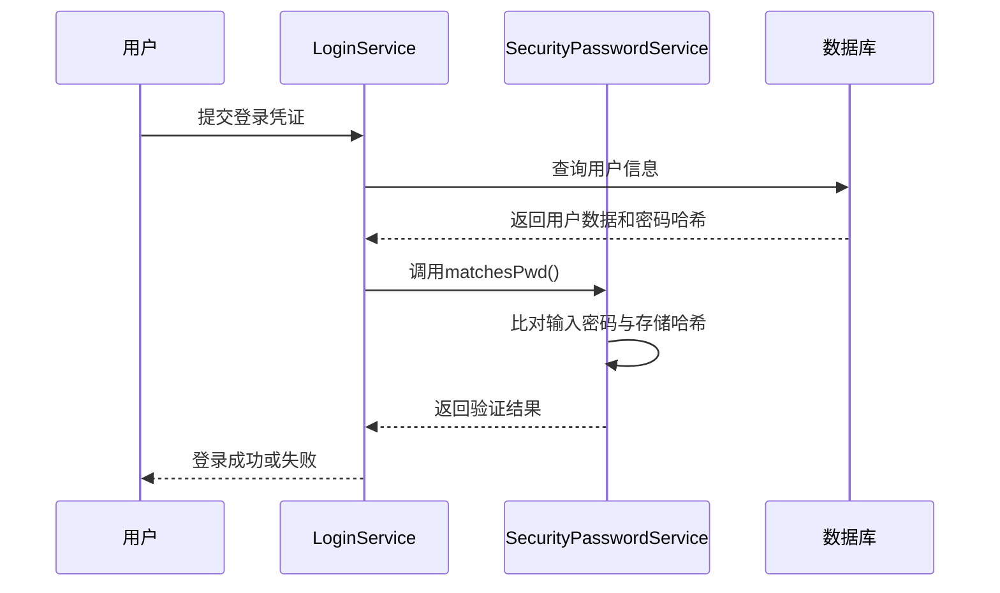
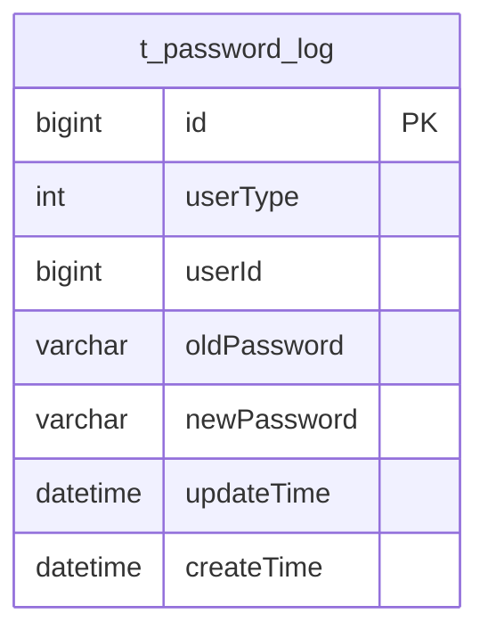

# 密码加密与验证

<cite>
**本文档引用的文件**   
- [SecurityPasswordService.java](file://smart-admin-api-java17-springboot3\sa-base\src\main\java\net\lab1024\sa\base\module\support\securityprotect\service\SecurityPasswordService.java)
- [LoginService.java](file://smart-admin-api-java17-springboot3\sa-admin\src\main\java\net\lab1024\sa\admin\module\system\login\service\LoginService.java)
- [PasswordLogDao.java](file://smart-admin-api-java17-springboot3\sa-base\src\main\java\net\lab1024\sa\base\module\support\securityprotect\dao\PasswordLogDao.java)
- [PasswordLogMapper.xml](file://smart-admin-api-java17-springboot3\sa-base\src\main\resources\mapper\support\PasswordLogMapper.xml)
- [PasswordLogEntity.java](file://smart-admin-api-java17-springboot3\sa-base\src\main\java\net\lab1024\sa\base\module\support\securityprotect\domain\PasswordLogEntity.java)
- [Level3ProtectConfigService.java](file://smart-admin-api-java17-springboot3\sa-base\src\main\java\net\lab1024\sa\base\module\support\securityprotect\service\Level3ProtectConfigService.java)
</cite>

## 目录
1. [引言](#引言)
2. [密码加密机制](#密码加密机制)
3. [密码验证机制](#密码验证机制)
4. [Argon2算法技术优势](#argon2算法技术优势)
5. [密码安全配置与管理](#密码安全配置与管理)
6. [密码历史记录与重复检测](#密码历史记录与重复检测)
7. [安全最佳实践](#安全最佳实践)

## 引言

本系统采用Argon2PasswordEncoder作为密码安全存储的核心机制，为用户提供高强度的密码保护。Argon2是2015年密码哈希竞赛(PHC)的获胜者，被广泛认为是目前最安全的密码哈希算法之一。系统通过`SecurityPasswordService`类封装了完整的密码加密与验证功能，确保用户密码在存储和验证过程中的安全性。

密码安全机制不仅包括密码的加密存储，还涵盖了密码复杂度校验、历史密码重复检测、定期密码更换等多重安全策略。这些功能共同构成了系统的三级等保密码安全体系，满足了现代应用对用户身份认证的严格安全要求。

**本文档引用的文件**   
- [SecurityPasswordService.java](file://smart-admin-api-java17-springboot3\sa-base\src\main\java\net\lab1024\sa\base\module\support\securityprotect\service\SecurityPasswordService.java)

## 密码加密机制

系统使用`getEncryptPwd`方法实现密码的加密存储，该方法基于Argon2PasswordEncoder算法对明文密码进行哈希处理。当用户设置或修改密码时，系统会调用此方法将明文密码转换为安全的哈希值进行存储。



**图示来源**
- [SecurityPasswordService.java](file://smart-admin-api-java17-springboot3\sa-base\src\main\java\net\lab1024\sa\base\module\support\securityprotect\service\SecurityPasswordService.java#L145-L147)

**本节来源**
- [SecurityPasswordService.java](file://smart-admin-api-java17-springboot3\sa-base\src\main\java\net\lab1024\sa\base\module\support\securityprotect\service\SecurityPasswordService.java#L142-L148)

## 密码验证机制

密码验证通过`matchesPwd`方法实现，该方法安全地比对用户输入的密码与存储的哈希值是否匹配。在用户登录过程中，系统会解密用户提交的密码，然后使用此方法进行验证。



在`LoginService`中，密码验证的具体实现如下：
```java
// 密码错误
if (!SecurityPasswordService.matchesPwd(employeeService.generateSaltPassword(requestPassword, employeeEntity.getEmployeeUid()), employeeEntity.getLoginPwd())) {
    // 记录登录失败
    saveLoginLog(employeeEntity, ip, userAgent, "密码错误", LoginLogResultEnum.LOGIN_FAIL, loginDeviceEnum);
    // 记录等级保护次数
    String msg = securityLoginService.recordLoginFail(employeeEntity.getEmployeeId(), UserTypeEnum.ADMIN_EMPLOYEE, employeeEntity.getLoginName(), loginFailEntityResponseDTO.getData());
    return msg == null ? ResponseDTO.userErrorParam("登录名或密码错误！") : ResponseDTO.error(UserErrorCode.LOGIN_FAIL_WILL_LOCK, msg);
}
```

**图示来源**
- [SecurityPasswordService.java](file://smart-admin-api-java17-springboot3\sa-base\src\main\java\net\lab1024\sa\base\module\support\securityprotect\service\SecurityPasswordService.java#L151-L153)
- [LoginService.java](file://smart-admin-api-java17-springboot3\sa-admin\src\main\java\net\lab1024\sa\admin\module\system\login\service\LoginService.java#L188-L193)

**本节来源**
- [SecurityPasswordService.java](file://smart-admin-api-java17-springboot3\sa-base\src\main\java\net\lab1024\sa\base\module\support\securityprotect\service\SecurityPasswordService.java#L149-L154)
- [LoginService.java](file://smart-admin-api-java17-springboot3\sa-admin\src\main\java\net\lab1024\sa\admin\module\system\login\service\LoginService.java#L188-L193)

## Argon2算法技术优势

系统采用的Argon2PasswordEncoder使用了Spring Security推荐的v5.8默认配置，具有强大的抗攻击能力。Argon2算法作为密码哈希竞赛的获胜者，相比传统的bcrypt、PBKDF2等算法具有显著优势。

### 抗暴力破解能力

Argon2通过高计算成本和内存消耗来抵御暴力破解攻击。其设计特点包括：

- **可调节的计算成本**：通过时间成本、内存成本和并行度参数，可以灵活调整哈希计算的难度
- **内存硬化**：需要大量内存进行计算，有效抵御基于GPU和ASIC的硬件加速攻击
- **抗侧信道攻击**：算法设计考虑了时间侧信道攻击的防护

### 安全参数配置

系统使用`Argon2PasswordEncoder.defaultsForSpringSecurity_v5_8()`静态方法初始化密码编码器，这代表了Spring Security团队推荐的最佳实践配置：

```java
static Argon2PasswordEncoder ARGON2_PASSWORD_ENCODER = Argon2PasswordEncoder.defaultsForSpringSecurity_v5_8();
```

这种配置平衡了安全性和性能，适用于大多数应用场景。Argon2的v5.8默认配置经过安全专家的严格审查，能够有效抵御当前已知的各种密码破解技术。

**本节来源**
- [SecurityPasswordService.java](file://smart-admin-api-java17-springboot3\sa-base\src\main\java\net\lab1024\sa\base\module\support\securityprotect\service\SecurityPasswordService.java#L46)

## 密码安全配置与管理

系统通过`Level3ProtectConfigService`实现了密码安全策略的集中管理，允许管理员根据安全需求调整密码策略。这些配置存储在数据库中，可以在运行时动态调整。

### 密码复杂度策略

系统强制执行严格的密码复杂度要求：
- 密码长度必须在8-20位之间
- 必须包含大小写字母、数字和特殊符号中的至少三种
- 使用正则表达式进行复杂度验证

```java
public static final String PASSWORD_PATTERN = "^(?![a-zA-Z]+$)(?![A-Z0-9]+$)(?![A-Z\\W_!@#$%^&*`~()-+=]+$)(?![a-z0-9]+$)(?![a-z\\W_!@#$%^&*`~()-+=]+$)(?![0-9\\W_!@#$%^&*`~()-+=]+$)[a-zA-Z0-9\\W_!@#$%^&*`~()-+=]*$";
```

### 配置管理机制

密码安全配置通过三级等保配置服务进行管理，支持以下可配置项：
- 密码复杂度是否启用
- 定期更换密码的时间间隔
- 历史密码重复限制次数
- 双因子登录是否启用

这些配置允许系统根据不同的安全等级要求进行灵活调整，满足不同场景下的安全合规需求。

**本节来源**
- [SecurityPasswordService.java](file://smart-admin-api-java17-springboot3\sa-base\src\main\java\net\lab1024\sa\base\module\support\securityprotect\service\SecurityPasswordService.java#L30-L33)
- [Level3ProtectConfigService.java](file://smart-admin-api-java17-springboot3\sa-base\src\main\java\net\lab1024\sa\base\module\support\securityprotect\service\Level3ProtectConfigService.java)

## 密码历史记录与重复检测

系统实现了完善的密码历史记录机制，防止用户重复使用近期使用过的密码，增强账户安全性。

### 密码变更日志

每次密码变更都会记录到`t_password_log`表中，包含以下信息：
- 用户类型和用户ID
- 旧密码哈希值
- 新密码哈希值
- 创建时间



**图示来源**
- [PasswordLogEntity.java](file://smart-admin-api-java17-springboot3\sa-base\src\main\java\net\lab1024\sa\base\module\support\securityprotect\domain\PasswordLogEntity.java)
- [PasswordLogMapper.xml](file://smart-admin-api-java17-springboot3\sa-base\src\main\resources\mapper\support\PasswordLogMapper.xml)

### 历史密码重复检测

在用户修改密码时，系统会检查新密码是否与历史密码重复：

```java
public ResponseDTO<String> validatePasswordRepeatTimes(RequestUser requestUser, String newPassword) {
    // 检查最近几次是否有重复密码
    List<String> oldPasswords = passwordLogDao.selectOldPassword(requestUser.getUserType().getValue(), requestUser.getUserId(), level3ProtectConfigService.getRegularChangePasswordNotAllowRepeatTimes());
    boolean isDuplicate = oldPasswords.stream().anyMatch(oldPassword -> ARGON2_PASSWORD_ENCODER.matches(newPassword, oldPassword));
    if (isDuplicate) {
        return ResponseDTO.userErrorParam(String.format("与前%d个历史密码重复，请换个密码!", level3ProtectConfigService.getRegularChangePasswordNotAllowRepeatTimes()));
    }
    return ResponseDTO.ok();
}
```

此机制确保用户不能重复使用最近使用过的密码，强制用户定期更新为真正的新密码，提高了账户的安全性。

**本节来源**
- [SecurityPasswordService.java](file://smart-admin-api-java17-springboot3\sa-base\src\main\java\net\lab1024\sa\base\module\support\securityprotect\service\SecurityPasswordService.java#L77-L91)
- [PasswordLogDao.java](file://smart-admin-api-java17-springboot3\sa-base\src\main\java\net\lab1024\sa\base\module\support\securityprotect\dao\PasswordLogDao.java#L31)
- [PasswordLogMapper.xml](file://smart-admin-api-java17-springboot3\sa-base\src\main\resources\mapper\support\PasswordLogMapper.xml#L22-L27)

## 安全最佳实践

基于系统的密码安全实现，总结以下安全最佳实践：

### 密码策略最佳实践
1. **强制密码复杂度**：要求密码包含多种字符类型，增加破解难度
2. **限制密码长度**：设置合理的密码长度范围，平衡安全性和用户体验
3. **定期更换密码**：强制用户定期更新密码，减少密码泄露风险
4. **历史密码检测**：防止用户循环使用旧密码

### 技术实现最佳实践
1. **使用现代哈希算法**：优先选择Argon2等经过验证的现代密码哈希算法
2. **避免自定义加密**：使用经过广泛审查的加密库，而非自定义加密算法
3. **安全的密码比较**：使用恒定时间比较算法，防止时序攻击
4. **适当的盐值管理**：确保每个密码都有唯一的盐值，防止彩虹表攻击

### 系统集成最佳实践
1. **分层安全验证**：结合密码复杂度、历史密码检测、登录失败锁定等多重安全措施
2. **可配置的安全策略**：允许根据安全需求调整密码策略，适应不同安全等级要求
3. **详细的审计日志**：记录所有密码变更和登录尝试，便于安全审计和问题排查
4. **用户友好的错误信息**：提供清晰的错误提示，帮助用户正确设置安全密码

这些最佳实践共同构成了系统的密码安全体系，为用户账户提供了全面的保护。

**本节来源**
- [SecurityPasswordService.java](file://smart-admin-api-java17-springboot3\sa-base\src\main\java\net\lab1024\sa\base\module\support\securityprotect\service\SecurityPasswordService.java)
- [LoginService.java](file://smart-admin-api-java17-springboot3\sa-admin\src\main\java\net\lab1024\sa\admin\module\system\login\service\LoginService.java)
- [Level3ProtectConfigService.java](file://smart-admin-api-java17-springboot3\sa-base\src\main\java\net\lab1024\sa\base\module\support\securityprotect\service\Level3ProtectConfigService.java)