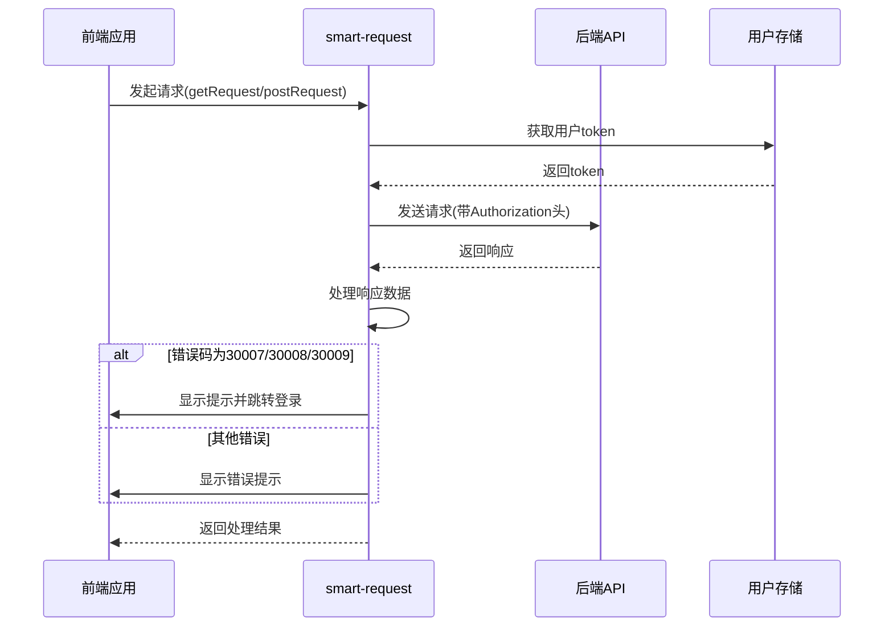
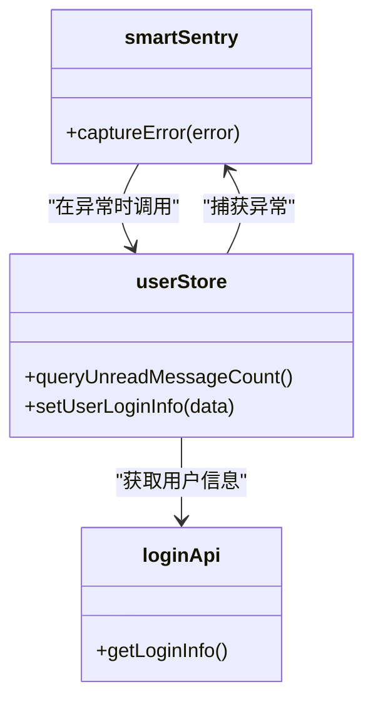
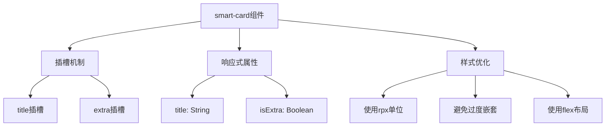
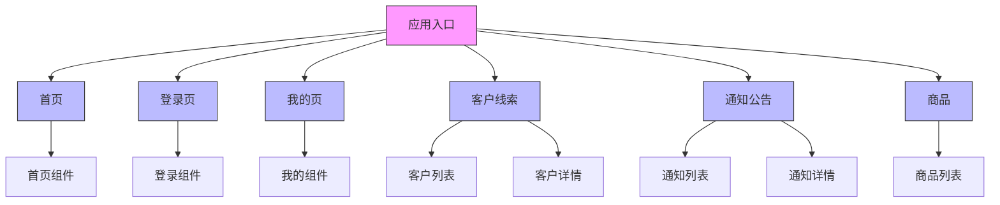
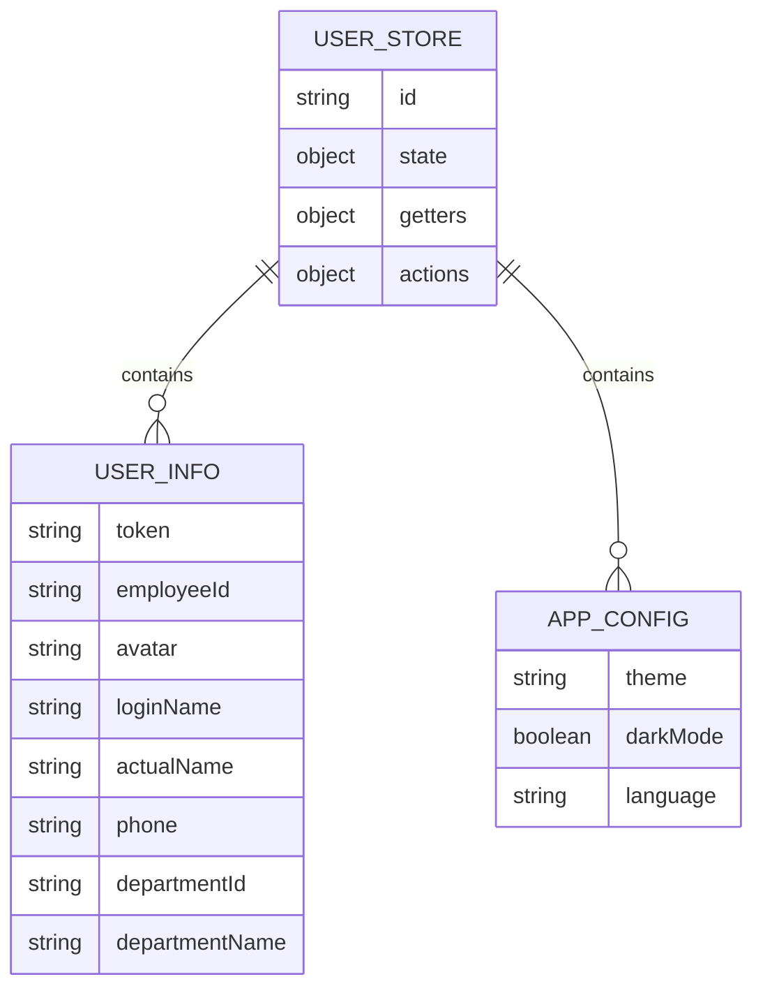

# 性能优化策略

<cite>
**本文档引用的文件**  
- [smart-request.js](file://smart-app/src/lib/smart-request.js)
- [smart-sentry.js](file://smart-app/src/lib/smart-sentry.js)
- [smart-card/index.vue](file://smart-app/src/components/smart-card/index.vue)
- [main.js](file://smart-app/src/main.js)
- [vite.config.js](file://smart-app/vite.config.js)
- [user.js](file://smart-app/src/store/modules/system/user.js)
- [smart-enums-plugin.js](file://smart-app/src/plugins/smart-enums-plugin.js)
- [pages.json](file://smart-app/src/pages.json)
- [index.vue](file://smart-app/src/pages/home/index.vue)
- [str-util.js](file://smart-app/src/utils/str-util.js)
</cite>

## 目录
1. [引言](#引言)
2. [请求库封装策略](#请求库封装策略)
3. [前端监控系统集成](#前端监控系统集成)
4. [组件级别优化技巧](#组件级别优化技巧)
5. [启动速度优化方案](#启动速度优化方案)
6. [内存管理与渲染性能优化](#内存管理与渲染性能优化)
7. [用户体验提升建议](#用户体验提升建议)
8. [结论](#结论)

## 引言
本项目是一个基于uni-app框架的移动端应用，采用Vue 3 + Pinia + Vite技术栈构建。系统通过模块化设计实现了良好的可维护性和扩展性，重点关注移动端性能优化。项目结构清晰，包含API封装、组件库、状态管理、工具函数等核心模块，为性能优化提供了坚实的基础。

**Section sources**
- [main.js](file://smart-app/src/main.js#L1-L23)
- [vite.config.js](file://smart-app/vite.config.js#L1-L38)

## 请求库封装策略

### 请求拦截与错误处理
项目通过`smart-request.js`文件实现了统一的请求封装，提供了GET、POST等常用HTTP方法的封装。请求封装中集成了自动添加Authorization头的功能，通过读取本地存储的用户token实现身份验证。错误处理机制完善，能够识别特定的错误码（如30007、30008、30009）并执行相应的业务逻辑，如token过期时自动跳转到登录页面。

**Diagram sources**
- [smart-request.js](file://smart-app/src/lib/smart-request.js#L1-L129)

### 缓存机制
请求库实现了智能缓存机制，通过`handleResponse`函数处理返回的数据。对于加密数据，请求库会自动进行解密处理，确保数据安全。同时，项目通过Pinia状态管理库实现了应用级的数据缓存，避免重复请求相同数据，提升用户体验。

**Section sources**
- [smart-request.js](file://smart-app/src/lib/smart-request.js#L1-L129)
- [user.js](file://smart-app/src/store/modules/system/user.js#L1-L114)

## 前端监控系统集成

### 错误上报机制
项目通过`smart-sentry.js`实现了前端错误监控和上报功能。该模块提供了一个`captureError`方法，能够捕获并上报应用运行时的异常。虽然当前实现主要是控制台输出错误信息，但已预留了Sentry集成接口，便于后续接入专业的错误监控平台。

**Diagram sources**
- [smart-sentry.js](file://smart-app/src/lib/smart-sentry.js#L1-L23)
- [user.js](file://smart-app/src/store/modules/system/user.js#L1-L114)

### 性能监控功能
项目通过Vite构建配置实现了生产环境的性能优化。在`vite.config.js`中配置了terser压缩选项，能够在构建时自动删除console语句，减少包体积。同时，通过配置`transpileDependencies`确保第三方库的兼容性，提升应用在不同设备上的运行性能。

**Section sources**
- [smart-sentry.js](file://smart-app/src/lib/smart-sentry.js#L1-L23)
- [vite.config.js](file://smart-app/vite.config.js#L1-L38)

## 组件级别优化技巧

### smart-card组件优化
`smart-card`组件是一个可复用的卡片式UI组件，通过合理的结构设计和样式优化提升了渲染性能。组件采用Vue 3的`<script setup>`语法，减少了运行时的开销。样式方面使用了CSS变量和合理的层级结构，避免了样式重绘和回流。

**Diagram sources**
- [smart-card/index.vue](file://smart-app/src/components/smart-card/index.vue#L1-L70)

### 其他组件优化
项目中的组件遵循统一的命名规范和结构约定，通过`easycom`配置实现了组件的自动导入，减少了手动import的开销。同时，组件设计注重可复用性和可配置性，如通过插槽机制实现内容的灵活定制，通过props实现外观和行为的配置。

**Section sources**
- [smart-card/index.vue](file://smart-app/src/components/smart-card/index.vue#L1-L70)
- [pages.json](file://smart-app/src/pages.json#L1-L213)

## 启动速度优化方案

### 代码分割与懒加载
项目通过uni-app的路由配置实现了页面级别的代码分割。在`pages.json`中定义的所有页面都会被自动分割成独立的chunk，实现按需加载。这种策略显著减少了应用的初始加载时间，提升了用户体验。

**Diagram sources**
- [pages.json](file://smart-app/src/pages.json#L1-L213)

### 静态资源优化
项目通过Vite的构建能力实现了静态资源的优化。所有JavaScript代码在生产构建时都会经过terser压缩，删除console语句和不必要的代码，减小包体积。同时，项目合理组织了静态资源目录，将图片等资源分类存放，便于管理和缓存。

**Section sources**
- [pages.json](file://smart-app/src/pages.json#L1-L213)
- [vite.config.js](file://smart-app/vite.config.js#L1-L38)

## 内存管理与渲染性能优化

### 状态管理优化
项目采用Pinia作为状态管理库，通过`useUserStore`等store实现了应用状态的集中管理。这种模式避免了组件间通过props传递大量数据，减少了不必要的重新渲染。同时，Pinia的轻量级设计和TypeScript支持确保了状态管理的高效性和类型安全。

**Diagram sources**
- [user.js](file://smart-app/src/store/modules/system/user.js#L1-L114)

### 渲染性能优化
项目通过多种技术手段提升渲染性能：使用`<script setup>`语法减少运行时开销；采用rpx单位实现响应式布局；合理使用v-if和v-show控制元素的渲染；通过组件化设计复用UI代码。同时，项目遵循uni-app的最佳实践，避免在模板中使用复杂的JavaScript表达式。

**Section sources**
- [user.js](file://smart-app/src/store/modules/system/user.js#L1-L114)
- [main.js](file://smart-app/src/main.js#L1-L23)
- [str-util.js](file://smart-app/src/utils/str-util.js#L1-L47)

## 用户体验提升建议

### 启动体验优化
建议进一步优化应用的启动体验，可以通过以下方式实现：添加启动页（splash screen）遮挡初始化过程；实现核心功能的预加载；使用骨架屏（skeleton screen）技术提升感知性能。同时，可以考虑实现资源的预缓存，确保用户首次使用时的流畅体验。

### 交互反馈优化
项目中的交互反馈机制可以进一步完善。当前主要依赖uni.showToast进行提示，建议增加更多类型的反馈方式，如加载状态、成功提示、警告提示等。同时，可以考虑实现操作的撤销功能，提升用户操作的安全感。

### 离线体验优化
建议增强应用的离线能力，通过本地存储缓存关键数据，确保在网络不佳或离线状态下仍能提供基本功能。可以实现数据的本地持久化，并在网络恢复时自动同步，提升应用的可用性和用户体验。

**Section sources**
- [smart-request.js](file://smart-app/src/lib/smart-request.js#L1-L129)
- [smart-sentry.js](file://smart-app/src/lib/smart-sentry.js#L1-L23)
- [main.js](file://smart-app/src/main.js#L1-L23)

## 结论
本项目通过合理的架构设计和技术选型，为移动端性能优化提供了良好的基础。请求库的封装、监控系统的集成、组件的优化以及启动速度的提升等方面都体现了对性能的重视。建议在现有基础上进一步优化启动体验、交互反馈和离线能力，持续提升应用的性能和用户体验。同时，可以考虑引入更专业的性能监控工具，对关键指标进行持续跟踪和优化。