# 报表统计

<cite>
**本文档引用的文件**
- [reports.html](file://smart-admin-web-javascript/consumption-system-refactored copy/pages/reports.html)
- [consumption-details.html](file://smart-admin-web-javascript/consumption-system-refactored copy/pages/consumption-details.html)
- [account-income-expense.html](file://smart-admin-web-javascript/consumption-system-refactored copy/pages/account-income-expense.html)
- [index.vue](file://smart-admin-web-javascript/src/views/business/consumption/dashboard/index.vue)
- [consumption-api.js](file://smart-admin-web-javascript/src/api/business/consumption/consumption-api.js)
- [consumption-const.js](file://smart-admin-web-javascript/src/constants/business/consumption/consumption-const.js)
- [README.md](file://smart-admin-web-javascript/src/views/business/consumption/README.md)
- [quick-test.md](file://smart-admin-web-javascript/src/views/business/consumption/快速测试说明.md)
- [heat-statistics.vue](file://smart-admin-web-javascript/src/views/business/smart-video/heat-statistics.vue)
</cite>

## 目录
1. [概述](#概述)
2. [系统架构](#系统架构)
3. [前端报表功能](#前端报表功能)
4. [后端统计接口](#后端统计接口)
5. [ECharts图表集成](#echarts图表集成)
6. [数据聚合与优化](#数据聚合与优化)
7. [自定义报表配置](#自定义报表配置)
8. [导出功能实现](#导出功能实现)
9. [性能优化策略](#性能优化策略)
10. [实际应用案例](#实际应用案例)

## 概述

消费系统的报表统计功能是一个完整的数据分析和可视化解决方案，提供全方位的消费数据统计、分析和展示能力。该系统采用前后端分离架构，前端使用Vue 3和Ant Design Vue构建交互界面，后端通过RESTful API提供数据服务，支持多种图表类型和灵活的数据导出功能。

### 核心特性

- **实时数据统计**：提供今日营业额、订单数、活跃用户等关键指标的实时统计
- **多维度报表**：支持消费明细、账户收支、充值明细等多种报表类型
- **可视化图表**：集成ECharts实现丰富的数据可视化效果
- **灵活筛选**：提供日期范围、账户类型、消费地点等多维度过滤功能
- **数据导出**：支持Excel格式的数据导出功能
- **响应式设计**：完美适配PC端和移动端设备

## 系统架构

消费系统的报表统计功能采用现代化的前后端分离架构，确保系统的可扩展性和维护性。


**架构图来源**
- [index.vue](file://smart-admin-web-javascript/src/views/business/consumption/dashboard/index.vue#L1-L50)
- [consumption-api.js](file://smart-admin-web-javascript/src/api/business/consumption/consumption-api.js#L1-L32)

## 前端报表功能

### 报表中心页面

报表中心是消费系统的核心统计入口，提供统一的报表访问界面。


**类图来源**
- [reports.html](file://smart-admin-web-javascript/consumption-system-refactored copy/pages/reports.html#L162-L260)

### 统计卡片组件

系统提供四种核心统计指标的卡片展示：

| 统计指标 | 描述 | 图标 | 颜色主题 |
|---------|------|------|----------|
| 今日营业额 | 当天的总消费金额 | DollarOutlined | 蓝色渐变 |
| 今日订单数 | 当天的消费订单数量 | ShoppingCartOutlined | 绿色渐变 |
| 活跃用户 | 当天产生消费的用户数量 | TeamOutlined | 黄色渐变 |
| 平均客单价 | 每笔订单的平均消费金额 | FileTextOutlined | 紫色渐变 |

**统计卡片图来源**
- [index.vue](file://smart-admin-web-javascript/src/views/business/consumption/dashboard/index.vue#L88-L124)

### 报表类型详解

#### 消费明细表
- **功能描述**：查看详细的消费记录，包括时间、金额、用户等完整信息
- **数据字段**：消费时间、账户编号、持卡人、消费地点、商品名称、消费金额、支付方式、操作员
- **筛选功能**：支持日期范围、账户类型、消费地点等条件筛选

#### 账户收支表
- **功能描述**：查看账户的收支明细和资金流向统计分析
- **收支类型**：充值收入、补贴收入、消费支出、退款支出
- **统计维度**：按时间段、账户类型、收支类型进行统计

**报表详情图来源**
- [consumption-details.html](file://smart-admin-web-javascript/consumption-system-refactored copy/pages/consumption-details.html#L256-L302)
- [account-income-expense.html](file://smart-admin-web-javascript/consumption-system-refactored copy/pages/account-income-expense.html#L235-L280)

## 后端统计接口

### 接口规范

系统提供了标准化的RESTful API接口，支持各种统计查询需求。


**序列图来源**
- [consumption-api.js](file://smart-admin-web-javascript/src/api/business/consumption/consumption-api.js#L10-L32)
- [index.vue](file://smart-admin-web-javascript/src/views/business/consumption/dashboard/index.vue#L145-L195)

### 接口响应格式

#### 1. Dashboard统计数据接口
**请求**：`GET /consumption/dashboard/stats`

**响应格式**：
```json
{
  "code": 1,
  "ok": true,
  "msg": "操作成功",
  "data": {
    "turnover": {
      "value": "¥12,580.00",
      "change": "+12.5%",
      "changeType": "positive"
    },
    "orderCount": {
      "value": "856",
      "change": "+8.3%",
      "changeType": "positive"
    },
    "activeUsers": {
      "value": "425",
      "change": "+15.2%",
      "changeType": "positive"
    },
    "averagePrice": {
      "value": "¥14.70",
      "change": "-2.1%",
      "changeType": "negative"
    }
  }
}
```

#### 2. 活动列表接口
**请求**：`POST /consumption/dashboard/activities`

**请求参数**：
```json
{
  "pageSize": 10
}
```

**响应格式**：
```json
{
  "code": 1,
  "ok": true,
  "msg": "操作成功",
  "data": {
    "list": [
      {
        "id": 1,
        "type": "success",
        "icon": "UserAddOutlined",
        "title": "新用户注册",
        "description": "张三 (工号: EMP001) 完成账户注册并审核通过",
        "time": "2分钟前"
      }
    ],
    "total": 100
  }
}
```

**接口响应图来源**
- [README.md](file://smart-admin-web-javascript/src/views/business/consumption/README.md#L186-L255)

## ECharts图表集成

### 图表类型与应用场景

系统集成了多种ECharts图表类型，满足不同的数据分析需求。


**图表集成图来源**
- [heat-statistics.vue](file://smart-admin-web-javascript/src/views/business/smart-video/heat-statistics.vue#L244-L350)

### 图表配置示例

#### 消费趋势折线图
```javascript
// 消费趋势图表配置
const flowTrendChartConfig = {
  tooltip: { trigger: 'axis' },
  xAxis: {
    type: 'category',
    data: ['08:00', '10:00', '12:00', '14:00', '16:00', '18:00'],
  },
  yAxis: { type: 'value' },
  series: [{
    data: [320, 450, 580, 720, 650, 480],
    type: 'line',
    smooth: true,
    areaStyle: {},
  }]
};
```

#### 区域热度柱状图
```javascript
// 区域热度图表配置
const areaHeatChartConfig = {
  tooltip: { trigger: 'axis', axisPointer: { type: 'shadow' } },
  xAxis: { 
    type: 'category', 
    data: ['一号楼', '停车场', '会议室', '餐厅', '走廊'] 
  },
  yAxis: { type: 'value' },
  series: [{
    data: [856, 1234, 456, 678, 234],
    type: 'bar',
  }]
};
```

### 图表交互功能

- **缩放和平移**：支持图表区域的缩放和平移操作
- **数据钻取**：点击图表元素可查看详细数据
- **动态更新**：支持实时数据更新和图表刷新
- **响应式布局**：图表自动适应不同屏幕尺寸

## 数据聚合与优化

### SQL聚合查询

系统采用高效的SQL聚合查询来处理大规模数据统计。

```mermaid
flowchart TD
A[原始消费数据] --> B{数据聚合需求}
B --> |日统计| C[按日期聚合]
B --> |月统计| D[按月份聚合]
B --> |区域统计| E[按区域聚合]
B --> |用户统计| F[按用户聚合]
C --> G[SUM(amount)]
D --> H[SUM(amount)]
E --> I[COUNT(*)]
F --> J[AVG(amount)]
G --> K[缓存结果]
H --> K
I --> K
J --> K
K --> L[返回统计结果]
```

### 缓存策略

系统实现了多层次的缓存策略来提升查询性能：

1. **Redis缓存**：缓存常用的统计结果，减少数据库压力
2. **本地缓存**：在前端缓存最近使用的报表数据
3. **数据库索引**：为统计查询字段建立复合索引
4. **分页查询**：大数据量报表采用分页加载机制

### 大数据处理方案

- **异步处理**：复杂统计任务采用异步处理机制
- **增量更新**：只处理新增或变更的数据
- **数据分区**：按时间维度对大数据表进行分区
- **读写分离**：统计查询使用只读副本数据库

## 自定义报表配置

### 报表模板系统

系统提供了灵活的报表模板配置功能，支持用户自定义报表格式和展示方式。

```mermaid
classDiagram
class ReportTemplate {
+String templateId
+String name
+Array columns
+Object filters
+Object chartConfig
+saveTemplate()
+applyTemplate()
}
class ColumnConfig {
+String field
+String label
+String dataType
+Boolean visible
+String format
}
class FilterConfig {
+String field
+String operator
+Array values
+String logic
}
ReportTemplate --> ColumnConfig : contains
ReportTemplate --> FilterConfig : contains
```



### 配置选项

| 配置项 | 类型 | 描述 | 默认值 |
|--------|------|------|--------|
| 数据源 | String | 报表数据来源表 | consumption_records |
| 时间范围 | DateRange | 统计的时间范围 | 最近30天 |
| 分组字段 | Array | 按哪些字段分组统计 | ['region', 'date'] |
| 聚合函数 | Array | 使用的聚合函数 | ['SUM', 'COUNT'] |
| 排序规则 | Array | 结果排序方式 | ['amount DESC'] |
| 展示格式 | Object | 数值格式化规则 | {currency: '¥'} |

### 权限控制

- **角色权限**：不同角色可访问不同的报表类型
- **数据权限**：根据用户权限过滤可见数据
- **字段权限**：控制敏感字段的显示权限
- **导出权限**：限制高价值数据的导出功能

## 导出功能实现

### Excel导出功能

系统提供了完整的Excel数据导出功能，支持多种格式和自定义配置。


### 导出格式支持

- **Excel (.xlsx)**：支持复杂的表格格式和公式
- **CSV**：纯文本格式，便于导入其他系统
- **PDF**：适合打印和存档用途
- **JSON**：便于程序化处理和分析

### 导出性能优化

- **流式处理**：大数据量采用流式写入，避免内存溢出
- **压缩传输**：导出文件采用ZIP压缩，减少传输时间
- **进度反馈**：大型导出任务提供进度条反馈
- **断点续传**：支持中断后的续传功能

## 性能优化策略

### 前端性能优化

1. **组件懒加载**：报表组件采用按需加载机制
2. **虚拟滚动**：大数据表格采用虚拟滚动技术
3. **防抖节流**：筛选条件变更采用防抖处理
4. **图片优化**：图表图片采用WebP格式，减少加载时间

### 后端性能优化

1. **查询优化**：使用EXPLAIN分析查询计划，优化慢查询
2. **连接池配置**：合理配置数据库连接池参数
3. **JVM调优**：针对大数据量场景调整JVM参数
4. **监控告警**：建立完善的性能监控体系

### 缓存优化策略


## 实际应用案例

### 案例一：月度经营分析

某企业使用消费系统进行月度经营分析：

**背景**：企业需要每月对各部门的消费情况进行统计分析，为预算制定提供依据。

**实施过程**：
1. 配置月度统计报表模板
2. 设置部门维度的分组统计
3. 配置消费趋势和区域对比图表
4. 设置自动导出和邮件通知功能

**效果**：
- 统计时间从原来的2小时缩短到10分钟
- 数据准确性提升99.9%
- 决策效率提高40%

### 案例二：设备使用率分析

某高校使用系统分析食堂设备使用情况：

**背景**：学校需要了解各食堂窗口的设备使用率，优化资源配置。

**实施过程**：
1. 创建设备使用率统计报表
2. 配置按设备和时间段的聚合查询
3. 设置使用率趋势图表
4. 集成到设备管理平台

**效果**：
- 发现了3个低使用率设备，及时进行调整
- 提高了设备利用率15%
- 减少了设备闲置成本

### 案例三：用户消费行为分析

某公司进行用户消费行为研究：

**背景**：公司希望了解员工的消费习惯，优化餐饮服务。

**实施过程**：
1. 创建用户消费行为分析报表
2. 配置消费频次和金额分布统计
3. 设置消费时间分布图表
4. 集成到人力资源管理系统

**效果**：
- 发现了午间消费高峰，优化了人员排班
- 提高了员工满意度10%
- 降低了运营成本5%

## 总结

消费系统的报表统计功能通过现代化的技术架构和丰富的功能特性，为企业提供了完整的数据分析解决方案。系统具有良好的扩展性和维护性，能够满足不同规模企业的统计分析需求。随着技术的不断发展，系统将持续优化性能，增加更多智能化的分析功能，为企业数字化转型提供强有力的支持。