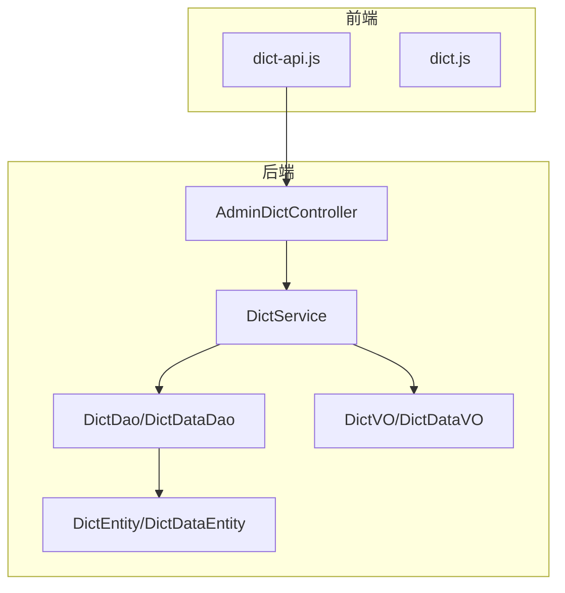
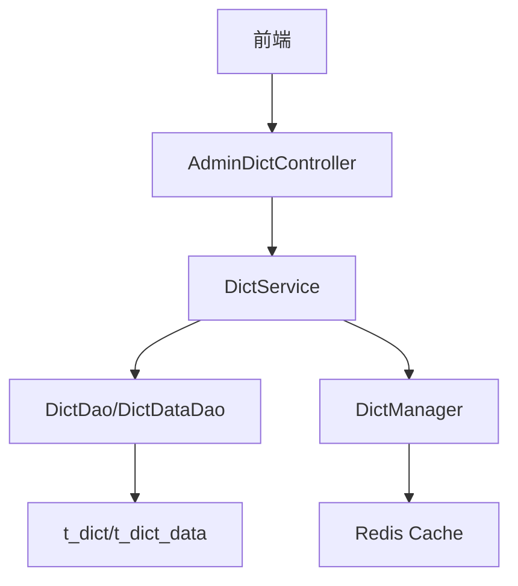
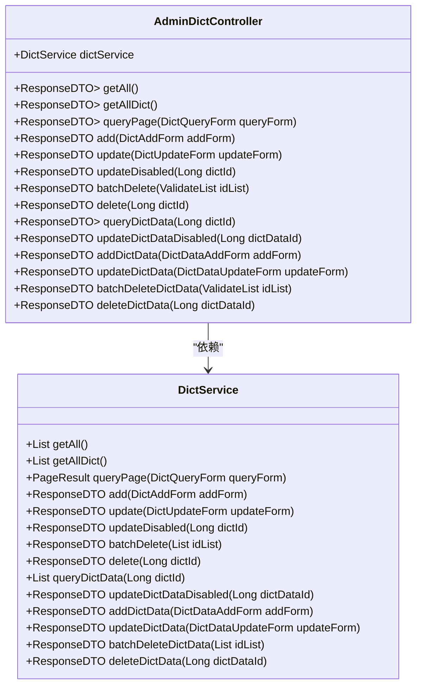
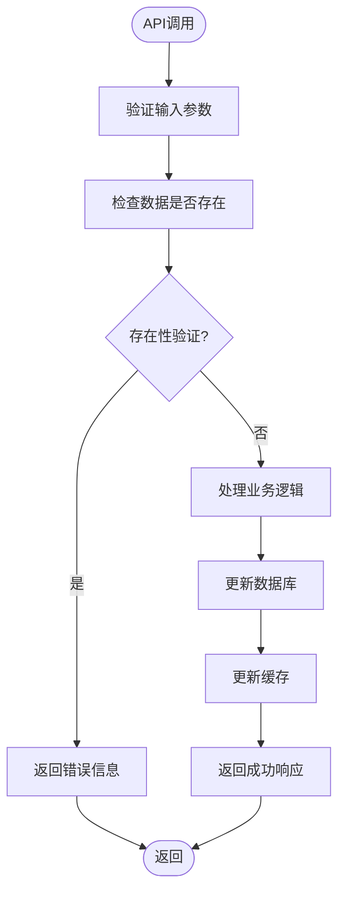
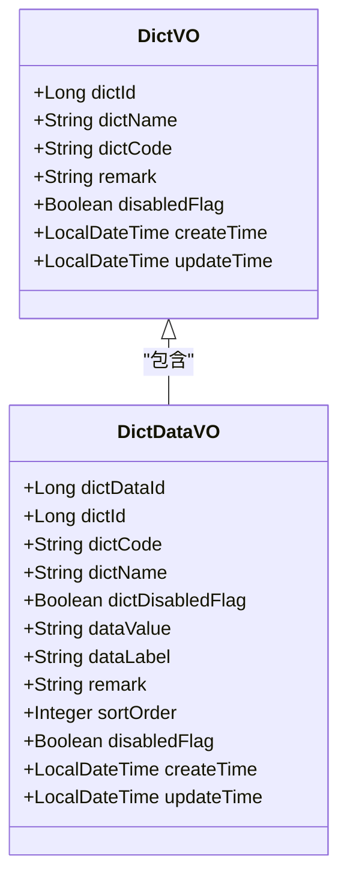
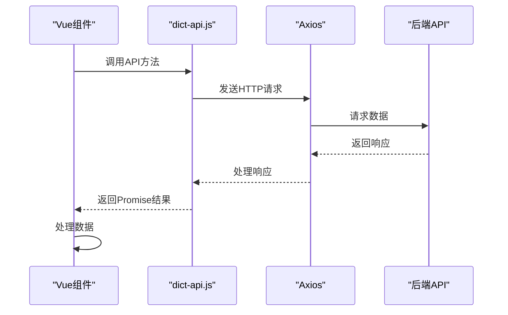
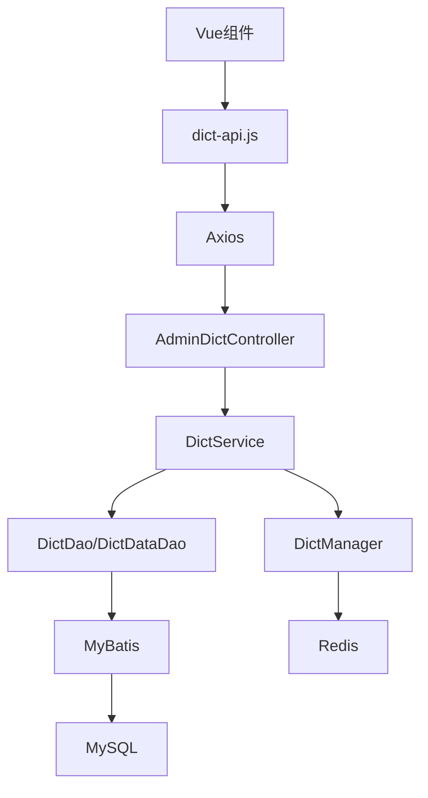

# 数据字典API

<cite>
**本文档引用的文件**
- [AdminDictController.java](file://smart-admin-api-java17-springboot3\sa-admin\src\main\java\net\lab1024\sa\admin\module\system\support\AdminDictController.java)
- [DictService.java](file://smart-admin-api-java17-springboot3\sa-base\src\main\java\net\lab1024\sa\base\module\support\dict\service\DictService.java)
- [DictVO.java](file://smart-admin-api-java17-springboot3\sa-base\src\main\java\net\lab1024\sa\base\module\support\dict\domain\vo\DictVO.java)
- [DictDataVO.java](file://smart-admin-api-java17-springboot3\sa-base\src\main\java\net\lab1024\sa\base\module\support\dict\domain\vo\DictDataVO.java)
- [dict-api.js](file://smart-admin-web-javascript\src\api\support\dict-api.js)
- [dict.js](file://smart-admin-web-javascript\src\store\modules\system\dict.js)
</cite>

## 目录
1. [简介](#简介)
2. [项目结构](#项目结构)
3. [核心组件](#核心组件)
4. [架构概述](#架构概述)
5. [详细组件分析](#详细组件分析)
6. [依赖分析](#依赖分析)
7. [性能考虑](#性能考虑)
8. [故障排除指南](#故障排除指南)
9. [结论](#结论)
10. [附录](#附录)（如有必要）

## 简介
本文档详细说明了数据字典模块的API设计，重点描述了字典的增删改查操作接口。文档涵盖了DictController中查询、添加、更新、删除字典项的RESTful API设计，包括请求方法、URL路径、参数说明和返回格式。同时解释了DictService服务层的业务逻辑处理流程，以及DictVO数据传输对象的结构定义。提供了实际使用示例，展示如何通过API进行字典数据的批量操作和级联查询，并说明了权限控制机制和数据一致性保障措施。

## 项目结构
数据字典模块主要分布在`sa-base`和`sa-admin`两个模块中，采用前后端分离的架构设计。后端Java代码位于`sa-base`模块的`net.lab1024.sa.base.module.support.dict`包下，包含控制器、服务、DAO、实体类和VO等组件。前端JavaScript代码位于`smart-admin-web-javascript`项目的`src/api/support/dict-api.js`文件中，通过Axios封装了对后端API的调用。

**图示来源**
- [AdminDictController.java](file://smart-admin-api-java17-springboot3\sa-admin\src\main\java\net\lab1024\sa\admin\module\system\support\AdminDictController.java)
- [DictService.java](file://smart-admin-api-java17-springboot3\sa-base\src\main\java\net\lab1024\sa\base\module\support\dict\service\DictService.java)
- [dict-api.js](file://smart-admin-web-javascript\src\api\support\dict-api.js)

**本节来源**
- [AdminDictController.java](file://smart-admin-api-java17-springboot3\sa-admin\src\main\java\net\lab1024\sa\admin\module\system\support\AdminDictController.java)
- [dict-api.js](file://smart-admin-web-javascript\src\api\support\dict-api.js)

## 核心组件
数据字典模块的核心组件包括`AdminDictController`控制器、`DictService`服务层、`DictDao`和`DictDataDao`数据访问层，以及`DictVO`和`DictDataVO`数据传输对象。这些组件共同实现了字典数据的增删改查功能，提供了完整的RESTful API接口。

**本节来源**
- [AdminDictController.java](file://smart-admin-api-java17-springboot3\sa-admin\src\main\java\net\lab1024\sa\admin\module\system\support\AdminDictController.java)
- [DictService.java](file://smart-admin-api-java17-springboot3\sa-base\src\main\java\net\lab1024\sa\base\module\support\dict\service\DictService.java)

## 架构概述
数据字典模块采用典型的分层架构，包括控制器层、服务层、数据访问层和实体层。前端通过API调用控制器，控制器调用服务层处理业务逻辑，服务层通过DAO访问数据库，实体类映射数据库表结构。整个架构遵循单一职责原则，各层职责分明，便于维护和扩展。

**图示来源**
- [AdminDictController.java](file://smart-admin-api-java17-springboot3\sa-admin\src\main\java\net\lab1024\sa\admin\module\system\support\AdminDictController.java)
- [DictService.java](file://smart-admin-api-java17-springboot3\sa-base\src\main\java\net\lab1024\sa\base\module\support\dict\service\DictService.java)
- [DictManager.java](file://smart-admin-api-java17-springboot3\sa-base\src\main\java\net\lab1024\sa\base\module\support\dict\manager\DictManager.java)

## 详细组件分析

### 控制器分析
`AdminDictController`是数据字典模块的RESTful API入口，提供了完整的增删改查接口。控制器通过`@RestController`注解标记为REST控制器，使用`@RequestMapping`注解定义了基础路径`/support/dict`。每个API方法都使用`@Operation`注解描述功能，并通过`@SaCheckPermission`注解实现权限控制。

#### 控制器类图

**图示来源**
- [AdminDictController.java](file://smart-admin-api-java17-springboot3\sa-admin\src\main\java\net\lab1024\sa\admin\module\system\support\AdminDictController.java)
- [DictService.java](file://smart-admin-api-java17-springboot3\sa-base\src\main\java\net\lab1024\sa\base\module\support\dict\service\DictService.java)

**本节来源**
- [AdminDictController.java](file://smart-admin-api-java17-springboot3\sa-admin\src\main\java\net\lab1024\sa\admin\module\system\support\AdminDictController.java)

### 服务层分析
`DictService`是数据字典模块的核心业务逻辑处理层，实现了所有字典相关的业务规则和数据处理逻辑。服务层通过`@Service`注解标记为Spring服务组件，使用`@Resource`注解注入DAO依赖。服务方法实现了数据验证、事务处理、缓存管理等核心功能。

#### 服务层处理流程

**图示来源**
- [DictService.java](file://smart-admin-api-java17-springboot3\sa-base\src\main\java\net\lab1024\sa\base\module\support\dict\service\DictService.java)

**本节来源**
- [DictService.java](file://smart-admin-api-java17-springboot3\sa-base\src\main\java\net\lab1024\sa\base\module\support\dict\service\DictService.java)

### 数据传输对象分析
数据传输对象（DTO/VO）用于在不同层之间传递数据，确保数据结构的一致性和安全性。`DictVO`和`DictDataVO`是数据字典模块的主要数据传输对象，通过Lombok的`@Data`注解自动生成getter、setter、toString等方法，简化了代码编写。

#### 数据传输对象结构

**图示来源**
- [DictVO.java](file://smart-admin-api-java17-springboot3\sa-base\src\main\java\net\lab1024\sa\base\module\support\dict\domain\vo\DictVO.java)
- [DictDataVO.java](file://smart-admin-api-java17-springboot3\sa-base\src\main\java\net\lab1024\sa\base\module\support\dict\domain\vo\DictDataVO.java)

**本节来源**
- [DictVO.java](file://smart-admin-api-java17-springboot3\sa-base\src\main\java\net\lab1024\sa\base\module\support\dict\domain\vo\DictVO.java)
- [DictDataVO.java](file://smart-admin-api-java17-springboot3\sa-base\src\main\java\net\lab1024\sa\base\module\support\dict\domain\vo\DictDataVO.java)

### 前端API分析
前端通过`dict-api.js`文件封装了对后端API的调用，使用Axios库发送HTTP请求。API封装遵循统一的命名规范，提供了清晰的接口方法，便于在Vue组件中调用。每个API方法都返回Promise对象，支持async/await语法。

#### 前端API调用流程

**图示来源**
- [dict-api.js](file://smart-admin-web-javascript\src\api\support\dict-api.js)

**本节来源**
- [dict-api.js](file://smart-admin-web-javascript\src\api\support\dict-api.js)

## 依赖分析
数据字典模块的依赖关系清晰，各组件之间通过接口或依赖注入进行通信。控制器依赖服务层，服务层依赖DAO层，DAO层依赖MyBatis框架与数据库交互。前端API依赖Axios库进行HTTP通信，同时依赖Pinia状态管理库缓存字典数据。

**图示来源**
- [dict-api.js](file://smart-admin-web-javascript\src\api\support\dict-api.js)
- [AdminDictController.java](file://smart-admin-api-java17-springboot3\sa-admin\src\main\java\net\lab1024\sa\admin\module\system\support\AdminDictController.java)
- [DictService.java](file://smart-admin-api-java17-springboot3\sa-base\src\main\java\net\lab1024\sa\base\module\support\dict\service\DictService.java)

**本节来源**
- [dict-api.js](file://smart-admin-web-javascript\src\api\support\dict-api.js)
- [AdminDictController.java](file://smart-admin-api-java17-springboot3\sa-admin\src\main\java\net\lab1024\sa\admin\module\system\support\AdminDictController.java)

## 性能考虑
数据字典模块在性能方面做了多项优化措施。首先，通过Redis缓存常用字典数据，减少数据库查询次数。其次，在服务层使用`synchronized`关键字确保并发安全，防止数据竞争。再者，DAO层使用MyBatis的分页插件实现高效分页查询。最后，前端通过Pinia状态管理库缓存字典数据，减少重复API调用。

**本节来源**
- [DictService.java](file://smart-admin-api-java17-springboot3\sa-base\src\main\java\net\lab1024\sa\base\module\support\dict\service\DictService.java)
- [dict.js](file://smart-admin-web-javascript\src\store\modules\system\dict.js)

## 故障排除指南
当遇到数据字典模块的问题时，可以按照以下步骤进行排查：
1. 检查API调用是否正确，包括URL路径、请求方法和参数格式
2. 查看后端日志，确认是否有异常信息
3. 检查数据库连接是否正常，表结构是否正确
4. 验证Redis缓存是否正常工作
5. 确认权限配置是否正确，用户是否有相应操作权限

**本节来源**
- [AdminDictController.java](file://smart-admin-api-java17-springboot3\sa-admin\src\main\java\net\lab1024\sa\admin\module\system\support\AdminDictController.java)
- [DictService.java](file://smart-admin-api-java17-springboot3\sa-base\src\main\java\net\lab1024\sa\base\module\support\dict\service\DictService.java)

## 结论
数据字典模块提供了完整的RESTful API接口，实现了字典数据的增删改查功能。通过分层架构设计，确保了代码的可维护性和可扩展性。服务层实现了完善的业务逻辑和数据验证，前端API封装提供了便捷的调用方式。模块还通过Redis缓存和Pinia状态管理优化了性能，为系统提供了高效、可靠的字典数据管理功能。

## 附录

### API接口列表
| 接口名称 | HTTP方法 | URL路径 | 参数说明 | 返回格式 |
|--------|--------|--------|--------|--------|
| 获取全部字典数据 | GET | /support/dict/getAllDictData | 无 | ResponseDTO<List<DictDataVO>> |
| 获取所有字典code | GET | /support/dict/getAllDict | 无 | ResponseDTO<List<DictVO>> |
| 分页查询字典 | POST | /support/dict/queryPage | DictQueryForm | ResponseDTO<PageResult<DictVO>> |
| 添加字典 | POST | /support/dict/add | DictAddForm | ResponseDTO<String> |
| 更新字典 | POST | /support/dict/update | DictUpdateForm | ResponseDTO<String> |
| 启用/禁用字典 | GET | /support/dict/updateDisabled/{dictId} | dictId | ResponseDTO<String> |
| 批量删除字典 | POST | /support/dict/batchDelete | List<Long> | ResponseDTO<String> |
| 单个删除字典 | GET | /support/dict/delete/{dictId} | dictId | ResponseDTO<String> |
| 查询字典数据 | GET | /support/dict/dictData/queryDictData/{dictId} | dictId | ResponseDTO<List<DictDataVO>> |
| 添加字典数据 | POST | /support/dict/dictData/add | DictDataAddForm | ResponseDTO<String> |
| 更新字典数据 | POST | /support/dict/dictData/update | DictDataUpdateForm | ResponseDTO<String> |
| 批量删除字典数据 | POST | /support/dict/dictData/batchDelete | List<Long> | ResponseDTO<String> |
| 单个删除字典数据 | GET | /support/dict/dictData/delete/{dictDataId} | dictDataId | ResponseDTO<String> |

**本节来源**
- [AdminDictController.java](file://smart-admin-api-java17-springboot3\sa-admin\src\main\java\net\lab1024\sa\admin\module\system\support\AdminDictController.java)