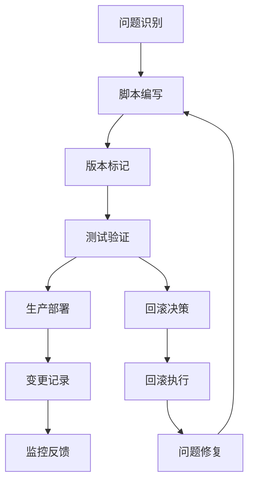
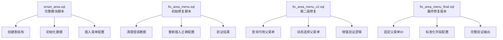
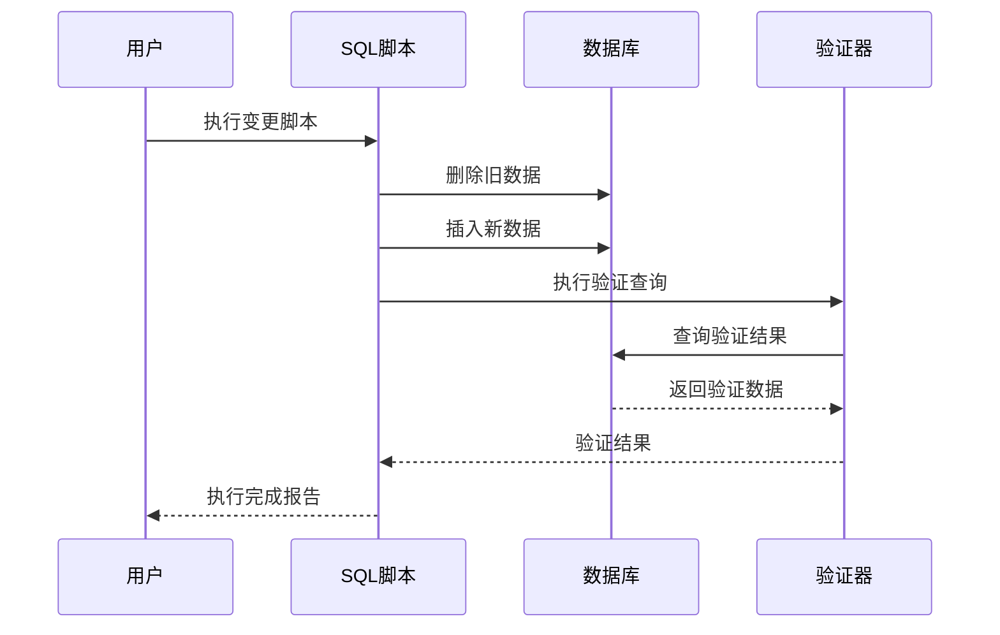
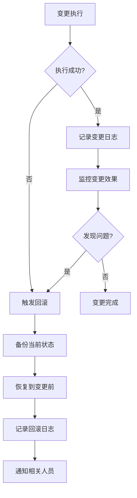
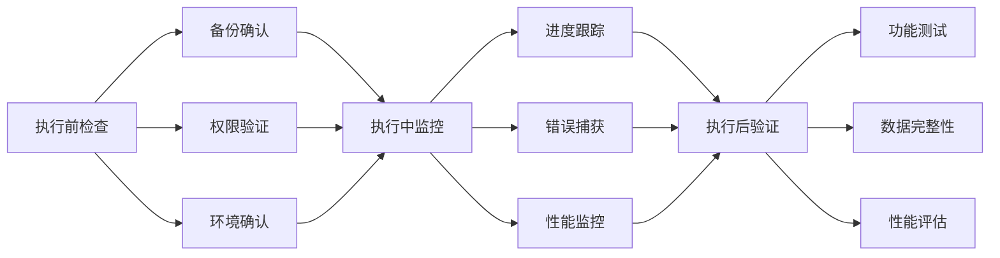
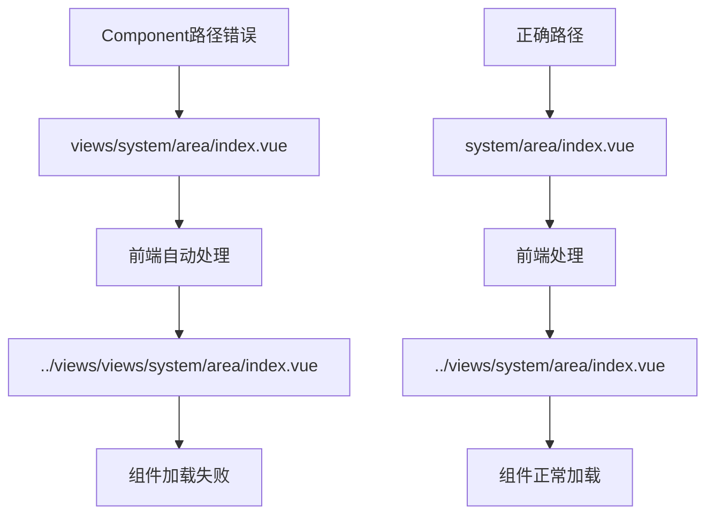
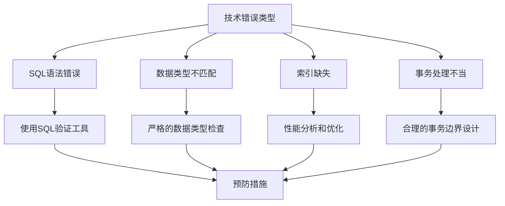

# 数据库变更管理

<cite>
**本文档引用的文件**
- [fix_area_menu.sql](file://数据库SQL脚本/mysql/fix_area_menu.sql)
- [fix_area_menu_v2.sql](file://数据库SQL脚本/mysql/fix_area_menu_v2.sql)
- [fix_area_menu_final.sql](file://数据库SQL脚本/mysql/fix_area_menu_final.sql)
- [smart_area.sql](file://数据库SQL脚本/mysql/smart_area.sql)
- [check_menu.sql](file://数据库SQL脚本/mysql/check_menu.sql)
- [ChangeLogEntity.java](file://smart-admin-api-java17-springboot3/sa-base/src/main/java/net/lab1024/sa/base/module/support/changelog/domain/entity/ChangeLogEntity.java)
- [ChangeLogService.java](file://smart-admin-api-java17-springboot3/sa-base/src/main/java/net/lab1024/sa/base/module/support/changelog/service/ChangeLogService.java)
- [DataSourceConfig.java](file://smart-admin-api-java17-springboot3/sa-base/src/main/java/net/lab1024/sa/base/config/DataSourceConfig.java)
- [区域管理菜单问题修复说明.md](file://区域管理菜单问题修复说明.md)
- [区域管理模块部署说明.md](file://区域管理模块部署说明.md)
</cite>

## 目录
1. [概述](#概述)
2. [SQL脚本版本控制流程](#sql脚本版本控制流程)
3. [数据库变更脚本命名规范](#数据库变更脚本命名规范)
4. [变更脚本组织结构](#变更脚本组织结构)
5. [变更脚本执行顺序管理](#变更脚本执行顺序管理)
6. [数据库迁移回滚策略](#数据库迁移回滚策略)
7. [变更验证流程](#变更验证流程)
8. [区域菜单修复案例分析](#区域菜单修复案例分析)
9. [最佳实践指南](#最佳实践指南)
10. [常见错误防范](#常见错误防范)

## 概述

SmartAdmin项目采用严格的数据库变更管理流程，确保数据库结构的稳定性和可追溯性。项目通过SQL脚本版本控制、变更日志记录、自动化验证等机制，实现了数据库变更的安全管理和高效协作。

### 核心特性

- **版本化管理**：每个数据库变更都有明确的版本标识
- **可追溯性**：完整的变更历史记录和回滚能力
- **自动化验证**：执行后的自动验证和结果反馈
- **安全保护**：备份要求和变更确认机制

## SQL脚本版本控制流程

### 变更生命周期



**图表来源**
- [ChangeLogService.java](file://smart-admin-api-java17-springboot3/sa-base/src/main/java/net/lab1024/sa/base/module/support/changelog/service/ChangeLogService.java#L33-L66)

### 变更分类体系

| 变更类型 | 描述 | 示例 |
|---------|------|------|
| **重大更新** | 特大版本功能更新 | 新增核心业务模块 |
| **功能更新** | 功能增强和改进 | 新增API接口、优化查询性能 |
| **Bug修复** | 问题修复和缺陷修正 | 修复SQL语法错误、性能问题 |

**章节来源**
- [ChangeLogEntity.java](file://smart-admin-api-java17-springboot3/sa-base/src/main/java/net/lab1024/sa/base/module/support/changelog/domain/entity/ChangeLogEntity.java#L1-L68)

## 数据库变更脚本命名规范

### 命名模式

项目采用统一的SQL脚本命名规范，确保脚本的可读性和可管理性：

```
{功能描述}_{版本标识}.sql
```

### 命名示例

| 脚本名称 | 说明 | 版本含义 |
|---------|------|----------|
| `fix_area_menu_v2.sql` | 区域菜单修复V2版本 | 第二次迭代修复 |
| `fix_area_menu_final.sql` | 区域菜单修复最终版本 | 最终确定版本 |
| `smart_area.sql` | 区域管理模块完整脚本 | 初始版本 |

### 命名原则

1. **功能描述**：清晰描述脚本的主要功能
2. **版本标识**：使用语义化的版本号或迭代标识
3. **文件扩展名**：统一使用`.sql`扩展名
4. **字符规范**：使用小写字母和下划线

**章节来源**
- [区域管理菜单问题修复说明.md](file://区域管理菜单问题修复说明.md#L1-L165)

## 变更脚本组织结构

### 目录结构

```
数据库SQL脚本/
├── mysql/
│   ├── smart_area.sql          # 完整模块脚本
│   ├── fix_area_menu.sql       # 初始修复脚本
│   ├── fix_area_menu_v2.sql    # 第二版修复脚本
│   ├── fix_area_menu_final.sql # 最终修复脚本
│   └── check_menu.sql          # 菜单验证脚本
```

### 脚本职责分工



**图表来源**
- [smart_area.sql](file://数据库SQL脚本/mysql/smart_area.sql#L1-L197)
- [fix_area_menu.sql](file://数据库SQL脚本/mysql/fix_area_menu.sql#L1-L59)

## 变更脚本执行顺序管理

### 依赖关系处理



**图表来源**
- [fix_area_menu.sql](file://数据库SQL脚本/mysql/fix_area_menu.sql#L6-L13)
- [fix_area_menu_v2.sql](file://数据库SQL脚本/mysql/fix_area_menu_v2.sql#L6-L13)

### 执行顺序原则

1. **清理优先**：先删除旧数据，避免冲突
2. **依赖保证**：确保被依赖的对象先创建
3. **验证跟进**：执行后立即验证结果
4. **原子性**：每个脚本作为一个独立的变更单元

**章节来源**
- [fix_area_menu.sql](file://数据库SQL脚本/mysql/fix_area.sql#L6-L13)

## 数据库迁移回滚策略

### 回滚机制设计



### 回滚安全措施

| 安全措施 | 实现方式 | 目的 |
|---------|----------|------|
| **数据备份** | 执行前自动备份关键表 | 确保数据可恢复 |
| **事务保护** | 使用数据库事务包装变更 | 保证操作原子性 |
| **验证确认** | 执行后验证变更结果 | 及时发现问题 |
| **版本记录** | 记录变更版本和时间 | 可追溯变更历史 |

### 回滚执行流程

1. **评估影响**：分析变更的影响范围
2. **准备回滚**：备份当前状态数据
3. **执行回滚**：逆向执行变更脚本
4. **验证恢复**：确认系统功能正常
5. **记录日志**：详细记录回滚过程

**章节来源**
- [ChangeLogService.java](file://smart-admin-api-java17-springboot3/sa-base/src/main/java/net/lab1024/sa/base/module/support/changelog/service/ChangeLogService.java#L45-L66)

## 变更验证流程

### 验证检查清单



### 验证脚本示例

项目提供了专门的验证脚本来检查变更结果：

```sql
-- 检查菜单配置
SELECT menu_id, menu_name, parent_id, path, component
FROM t_sys_menu
WHERE menu_name = '区域管理' AND deleted_flag = 0;

-- 检查系统设置下的子菜单
SELECT m.menu_id, m.menu_name, m.menu_type, m.parent_id
FROM t_sys_menu m
LEFT JOIN t_sys_menu p ON m.parent_id = p.menu_id
WHERE p.menu_name = '系统设置' AND m.deleted_flag = 0
ORDER BY m.sort;
```

**章节来源**
- [check_menu.sql](file://数据库SQL脚本/mysql/check_menu.sql#L1-L31)

## 区域菜单修复案例分析

### 问题背景

区域管理菜单在部署后出现不显示的问题，根本原因是前端路由处理机制的理解不足。

### 问题根源



**图表来源**
- [区域管理菜单问题修复说明.md](file://区域管理菜单问题修复说明.md#L1-L165)

### 修复过程演进

#### V1版本修复（初始修复）

- **主要问题**：Component路径配置错误
- **解决方案**：删除旧数据，重新插入正确配置
- **技术要点**：使用变量存储父菜单ID，避免嵌套子查询

#### V2版本修复（增强版）

- **主要改进**：增加父菜单选择灵活性
- **解决方案**：查询可用父菜单，支持动态选择
- **技术要点**：提供两种父菜单选项，增强适应性

#### Final版本修复（最终版）

- **主要特点**：固定父菜单ID，标准化配置
- **解决方案**：明确指定"系统设置"作为父菜单
- **技术要点**：完整的字段配置和验证输出

### 修复脚本对比

| 版本 | 主要特点 | 技术改进 | 适用场景 |
|------|----------|----------|----------|
| **V1** | 初始修复 | 变量使用，避免嵌套查询 | 通用修复场景 |
| **V2** | 增强灵活性 | 父菜单动态选择 | 多种部署环境 |
| **Final** | 标准化配置 | 固定父菜单ID | 生产环境部署 |

**章节来源**
- [fix_area_menu.sql](file://数据库SQL脚本/mysql/fix_area_menu.sql#L1-L59)
- [fix_area_menu_v2.sql](file://数据库SQL脚本/mysql/fix_area_menu_v2.sql#L1-L78)
- [fix_area_menu_final.sql](file://数据库SQL脚本/mysql/fix_area_menu_final.sql#L1-L90)

## 最佳实践指南

### 开发阶段最佳实践

1. **脚本编写规范**
   - 使用清晰的功能描述作为脚本名称
   - 包含详细的注释说明
   - 遵循统一的SQL语法风格

2. **测试验证标准**
   - 编写对应的验证脚本
   - 包含边界条件测试
   - 进行性能影响评估

3. **版本管理策略**
   - 使用语义化版本号
   - 保持版本号的连续性
   - 记录版本变更说明

### 部署阶段最佳实践

1. **环境准备**
   - 确认数据库连接信息
   - 检查数据库版本兼容性
   - 准备必要的备份

2. **执行流程**
   - 先在测试环境验证
   - 制定详细的执行计划
   - 准备回滚预案

3. **监控观察**
   - 监控系统性能指标
   - 观察业务功能影响
   - 及时处理异常情况

### 维护阶段最佳实践

1. **变更记录**
   - 详细记录变更内容
   - 保存相关脚本文件
   - 维护变更历史文档

2. **知识传承**
   - 编写变更说明文档
   - 培训相关人员
   - 建立变更知识库

**章节来源**
- [区域管理模块部署说明.md](file://区域管理模块部署说明.md#L156-L308)

## 常见错误防范

### 技术错误防范



### 防范措施清单

| 错误类型 | 防范措施 | 实施方法 |
|---------|----------|----------|
| **SQL语法错误** | 语法检查工具 | 使用IDE SQL验证功能 |
| **数据丢失风险** | 备份策略 | 执行前自动备份 |
| **性能问题** | 性能测试 | 执行前进行基准测试 |
| **权限问题** | 权限验证 | 验证执行用户权限 |
| **版本冲突** | 版本控制 | 使用Git管理脚本版本 |

### 错误处理流程

1. **错误检测**：自动检测脚本执行结果
2. **错误分类**：区分不同类型的错误
3. **应急响应**：立即停止执行并通知相关人员
4. **问题分析**：深入分析错误原因
5. **修复验证**：验证修复方案的有效性

### 监控和告警

建立完善的监控体系：

- **执行监控**：实时监控脚本执行状态
- **性能监控**：跟踪数据库性能指标
- **错误监控**：及时发现和处理错误
- **变更监控**：跟踪变更实施效果

**章节来源**
- [DataSourceConfig.java](file://smart-admin-api-java17-springboot3/sa-base/src/main/java/net/lab1024/sa/base/config/DataSourceConfig.java#L1-L202)

## 结论

SmartAdmin项目的数据库变更管理流程体现了现代软件开发的最佳实践。通过严格的版本控制、完善的验证机制、灵活的回滚策略和丰富的文档支持，确保了数据库变更的安全性和可追溯性。

### 核心价值

1. **安全性**：多重保护机制防止数据丢失
2. **可追溯性**：完整的变更历史记录
3. **高效性**：标准化流程提升工作效率
4. **可靠性**：完善的验证和监控机制

### 持续改进建议

1. **自动化程度**：进一步提升变更管理的自动化水平
2. **监控覆盖**：扩大监控范围和深度
3. **文档完善**：持续更新和完善相关文档
4. **培训加强**：定期开展变更管理培训

通过遵循本文档的指导原则和最佳实践，开发团队能够更加安全、高效地管理数据库变更，确保系统的稳定运行和持续发展。