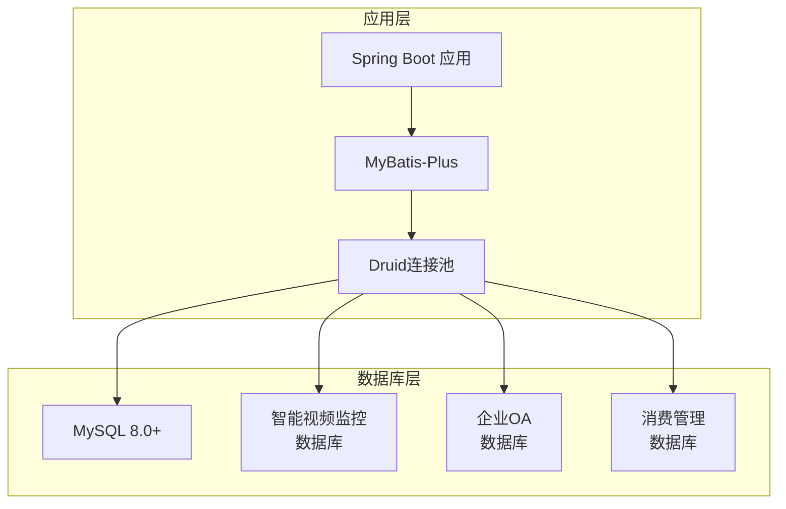
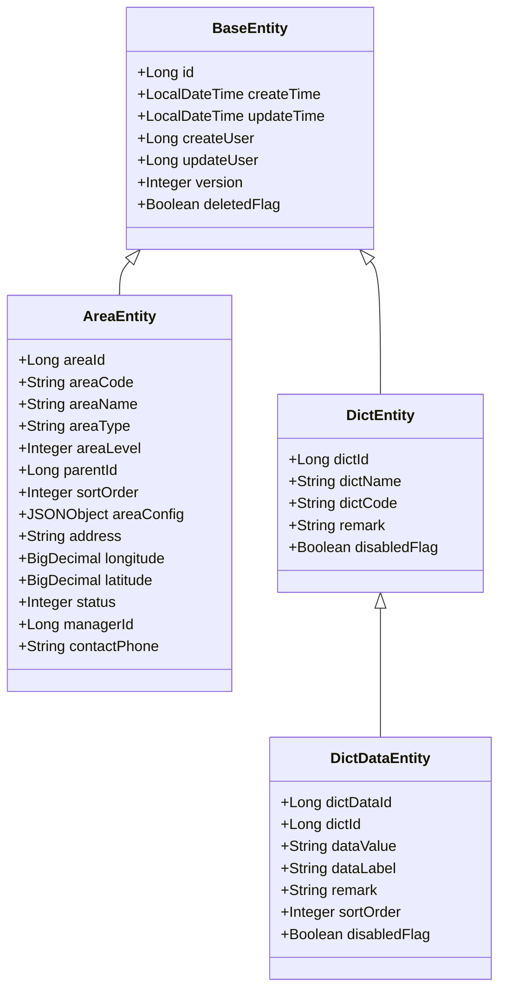
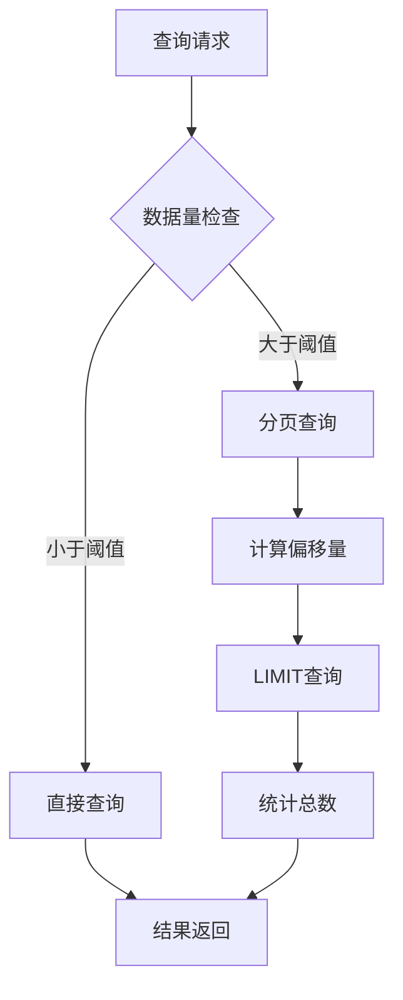
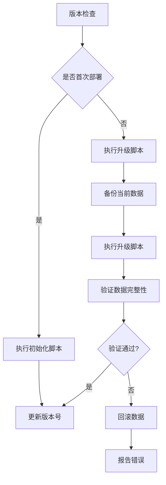

# IOE-DREAM数据库设计文档

<cite>
**本文档引用的文件**
- [DataSourceConfig.java](file://smart-admin-api-java17-springboot3/sa-base/src/main/java/net/lab1024/sa/base/config/DataSourceConfig.java)
- [MybatisPlusConfig.java](file://smart-admin-api-java17-springboot3/sa-base/src/main/java/net/lab1024/sa/base/config/MybatisPlusConfig.java)
- [smart_area.sql](file://数据库SQL脚本/mysql/smart_area.sql)
- [消费管理菜单配置.sql](file://smart-admin-web-javascript/src/views/business/consumption/消费管理菜单配置.sql)
- [sa-base.yaml](file://smart-admin-api-java17-springboot3/sa-base/src/main/resources/dev/sa-base.yaml)
- [DictEntity.java](file://smart-admin-api-java17-springboot3/sa-base/src/main/java/net/lab1024/sa/base/module/support/dict/domain/entity/DictEntity.java)
- [DictDataEntity.java](file://smart-admin-api-java17-springboot3/sa-base/src/main/java/net/lab1024/sa/base/module/support/dict/domain/entity/DictDataEntity.java)
- [TableColumnEntity.java](file://smart-admin-api-java17-springboot3/sa-base/src/main/java/net/lab1024/sa/base/module/support/table/domain/TableColumnEntity.java)
</cite>

## 目录
1. [项目概述](#项目概述)
2. [数据库架构](#数据库架构)
3. [核心业务模块数据库设计](#核心业务模块数据库设计)
4. [系统基础模块数据库设计](#系统基础模块数据库设计)
5. [数据模型关系图](#数据模型关系图)
6. [MyBatis-Plus实体映射](#mybatis-plus实体映射)
7. [数据库性能优化](#数据库性能优化)
8. [版本管理与迁移](#版本管理与迁移)
9. [最佳实践与常见问题](#最佳实践与常见问题)

## 项目概述

IOE-DREAM是一个基于Spring Boot 3和Java 17的企业级智慧管理平台，采用MySQL作为主数据库，支持区域管理、企业OA、智能视频监控、消费管理等多个业务模块。系统采用MyBatis-Plus作为ORM框架，实现了完整的数据库设计和业务逻辑封装。

### 技术栈特点
- **数据库**: MySQL 8.0+
- **ORM框架**: MyBatis-Plus 3.x
- **连接池**: Druid
- **分页插件**: MyBatis-Plus内置分页
- **缓存**: Redis集成
- **数据源**: 支持多数据源配置

## 数据库架构

### 数据库连接配置

系统采用Druid连接池进行数据库连接管理，提供了完善的连接池配置和监控功能。



**图表来源**
- [DataSourceConfig.java](file://smart-admin-api-java17-springboot3/sa-base/src/main/java/net/lab1024/sa/base/config/DataSourceConfig.java#L102-L131)

### 连接池配置参数

| 参数名称 | 默认值 | 说明 |
|---------|--------|------|
| initialSize | 2 | 初始连接数 |
| minIdle | 2 | 最小空闲连接数 |
| maxActive | 10 | 最大活跃连接数 |
| maxWait | 60000ms | 获取连接最大等待时间 |
| timeBetweenEvictionRunsMillis | 60000ms | 连接回收线程运行间隔 |
| minEvictableIdleTimeMillis | 300000ms | 连接空闲最小时间 |

**章节来源**
- [DataSourceConfig.java](file://smart-admin-api-java17-springboot3/sa-base/src/main/java/net/lab1024/sa/base/config/DataSourceConfig.java#L50-L131)
- [sa-base.yaml](file://smart-admin-api-java17-springboot3/sa-base/src/main/resources/dev/sa-base.yaml#L3-L15)

## 核心业务模块数据库设计

### 区域管理模块

区域管理模块是IOE-DREAM的核心功能之一，提供了完整的区域层级管理、设备关联、人员权限控制等功能。

#### 主要表结构

**区域表 (t_area)**

| 字段名 | 数据类型 | 约束 | 说明 |
|--------|----------|------|------|
| area_id | BIGINT | PRIMARY KEY, AUTO_INCREMENT | 区域唯一标识 |
| area_code | VARCHAR(100) | NOT NULL, UNIQUE | 区域编码 |
| area_name | VARCHAR(200) | NOT NULL | 区域名称 |
| area_type | VARCHAR(50) | NOT NULL | 区域类型 |
| area_level | INT | DEFAULT 1 | 区域层级 |
| parent_id | BIGINT | DEFAULT 0 | 父区域ID |
| sort_order | INT | DEFAULT 0 | 排序权重 |
| area_config | JSON | NULLABLE | 区域配置JSON |
| longitude | DECIMAL(11,8) | NULLABLE | 经度坐标 |
| latitude | DECIMAL(10,8) | NULLABLE | 纬度坐标 |
| status | TINYINT | DEFAULT 1 | 状态：1-启用，0-禁用 |
| deleted_flag | TINYINT | DEFAULT 0 | 删除标志：0-未删除，1-已删除 |
| version | INT | DEFAULT 1 | 版本号（乐观锁） |

**索引设计**
- `idx_parent_id`: 父区域ID索引，支持层级查询
- `idx_area_type`: 区域类型索引，支持类型过滤
- `idx_area_level`: 区域层级索引，支持层级排序
- `idx_status`: 状态索引，支持状态筛选
- `idx_manager_id`: 负责人索引，支持权限查询
- `idx_location`: 地理位置复合索引，支持地理查询

**区域设备关联表 (t_area_device)**

| 字段名 | 数据类型 | 约束 | 说明 |
|--------|----------|------|------|
| relation_id | BIGINT | PRIMARY KEY, AUTO_INCREMENT | 关联唯一标识 |
| area_id | BIGINT | NOT NULL | 区域ID |
| device_id | BIGINT | NOT NULL | 设备ID |
| device_type | VARCHAR(50) | NOT NULL | 设备类型 |
| bind_time | DATETIME | DEFAULT CURRENT_TIMESTAMP | 绑定时间 |
| status | TINYINT | DEFAULT 1 | 状态：1-绑定，0-解绑 |

**区域人员关联表 (t_area_user)**

| 字段名 | 数据类型 | 约束 | 说明 |
|--------|----------|------|------|
| relation_id | BIGINT | PRIMARY KEY, AUTO_INCREMENT | 关联唯一标识 |
| area_id | BIGINT | NOT NULL | 区域ID |
| user_id | BIGINT | NOT NULL | 用户ID |
| user_type | VARCHAR(20) | NOT NULL | 用户类型 |
| relation_type | VARCHAR(20) | NOT NULL | 关联类型 |
| access_level | TINYINT | DEFAULT 1 | 访问级别 |
| valid_start_time | DATETIME | NULLABLE | 有效开始时间 |
| valid_end_time | DATETIME | NULLABLE | 有效结束时间 |

**章节来源**
- [smart_area.sql](file://数据库SQL脚本/mysql/smart_area.sql#L7-L94)

### 智能视频监控模块

视频监控模块支持解码器管理、设备监控、实时视频流控制等功能。

#### 设备管理表结构

**解码器表 (t_video_decoder)**

| 字段名 | 数据类型 | 约束 | 说明 |
|--------|----------|------|------|
| decoder_id | BIGINT | PRIMARY KEY, AUTO_INCREMENT | 解码器ID |
| decoder_name | VARCHAR(100) | NOT NULL | 解码器名称 |
| decoder_code | VARCHAR(50) | NOT NULL, UNIQUE | 解码器编码 |
| manufacturer | VARCHAR(50) | NOT NULL | 制造商 |
| model | VARCHAR(100) | NOT NULL | 型号 |
| ip_address | VARCHAR(50) | NOT NULL | IP地址 |
| port | INT | NOT NULL | 端口号 |
| status | TINYINT | NOT NULL | 状态：1-在线，0-离线 |
| total_channels | INT | NOT NULL | 总通道数 |
| used_channels | INT | NOT NULL | 已用通道数 |
| firmware_version | VARCHAR(50) | NULLABLE | 固件版本 |
| cpu_usage | INT | NULLABLE | CPU使用率 |
| memory_usage | INT | NULLABLE | 内存使用率 |
| temperature | INT | NULLABLE | 温度 |

#### 监控数据表

**监控记录表 (t_video_monitor_log)**

| 字段名 | 数据类型 | 约束 | 说明 |
|--------|----------|------|------|
| log_id | BIGINT | PRIMARY KEY, AUTO_INCREMENT | 日志ID |
| device_id | BIGINT | NOT NULL | 设备ID |
| channel_id | INT | NOT NULL | 通道ID |
| event_type | VARCHAR(50) | NOT NULL | 事件类型 |
| event_time | DATETIME | NOT NULL | 事件时间 |
| event_data | JSON | NULLABLE | 事件数据 |
| status | TINYINT | NOT NULL | 状态：1-正常，0-异常 |

### 消费管理模块

消费管理模块提供完整的消费业务流程，包括账户管理、消费记录、补贴管理等功能。

#### 核心表结构

**账户表 (t_consumption_account)**

| 字段名 | 数据类型 | 约束 | 说明 |
|--------|----------|------|------|
| account_id | BIGINT | PRIMARY KEY, AUTO_INCREMENT | 账户ID |
| account_name | VARCHAR(100) | NOT NULL | 账户名称 |
| account_type | VARCHAR(50) | NOT NULL | 账户类型 |
| balance | DECIMAL(10,2) | NOT NULL | 账户余额 |
| status | TINYINT | NOT NULL | 状态：1-启用，0-禁用 |
| region_id | BIGINT | NULLABLE | 所属区域ID |

**消费记录表 (t_consumption_record)**

| 字段名 | 数据类型 | 约束 | 说明 |
|--------|----------|------|------|
| record_id | BIGINT | PRIMARY KEY, AUTO_INCREMENT | 记录ID |
| account_id | BIGINT | NOT NULL | 账户ID |
| amount | DECIMAL(10,2) | NOT NULL | 消费金额 |
| consume_time | DATETIME | NOT NULL | 消费时间 |
| consume_type | VARCHAR(50) | NOT NULL | 消费类型 |
| device_id | BIGINT | NULLABLE | 设备ID |
| operator_id | BIGINT | NULLABLE | 操作员ID |

**章节来源**
- [消费管理菜单配置.sql](file://smart-admin-web-javascript/src/views/business/consumption/消费管理菜单配置.sql#L1-L444)

## 系统基础模块数据库设计

### 用户权限系统

#### 用户表 (t_sys_user)

| 字段名 | 数据类型 | 约束 | 说明 |
|--------|----------|------|------|
| user_id | BIGINT | PRIMARY KEY, AUTO_INCREMENT | 用户ID |
| login_name | VARCHAR(50) | NOT NULL, UNIQUE | 登录名 |
| password | VARCHAR(100) | NOT NULL | 密码 |
| user_name | VARCHAR(50) | NOT NULL | 用户名 |
| email | VARCHAR(100) | NULLABLE | 邮箱 |
| phone | VARCHAR(20) | NULLABLE | 手机号 |
| avatar | VARCHAR(200) | NULLABLE | 头像URL |
| status | TINYINT | NOT NULL | 状态：1-启用，0-禁用 |
| create_time | DATETIME | DEFAULT CURRENT_TIMESTAMP | 创建时间 |

#### 角色表 (t_sys_role)

| 字段名 | 数据类型 | 约束 | 说明 |
|--------|----------|------|------|
| role_id | BIGINT | PRIMARY KEY, AUTO_INCREMENT | 角色ID |
| role_name | VARCHAR(50) | NOT NULL | 角色名称 |
| role_code | VARCHAR(50) | NOT NULL, UNIQUE | 角色编码 |
| description | TEXT | NULLABLE | 角色描述 |
| status | TINYINT | NOT NULL | 状态：1-启用，0-禁用 |

#### 菜单表 (t_sys_menu)

| 字段名 | 数据类型 | 约束 | 说明 |
|--------|----------|------|------|
| menu_id | BIGINT | PRIMARY KEY, AUTO_INCREMENT | 菜单ID |
| menu_name | VARCHAR(50) | NOT NULL | 菜单名称 |
| menu_type | TINYINT | NOT NULL | 菜单类型：1-目录，2-菜单，3-按钮 |
| parent_id | BIGINT | NOT NULL | 父菜单ID |
| path | VARCHAR(200) | NULLABLE | 路由路径 |
| component | VARCHAR(200) | NULLABLE | 组件路径 |
| perms | VARCHAR(100) | NULLABLE | 权限标识 |
| icon | VARCHAR(50) | NULLABLE | 图标 |
| sort | INT | NOT NULL | 排序 |
| visible_flag | TINYINT | NOT NULL | 可见标志：1-可见，0-隐藏 |

### 数据字典系统

#### 字典表 (t_dict)

| 字段名 | 数据类型 | 约束 | 说明 |
|--------|----------|------|------|
| dict_id | BIGINT | PRIMARY KEY, AUTO_INCREMENT | 字典ID |
| dict_name | VARCHAR(100) | NOT NULL | 字典名称 |
| dict_code | VARCHAR(50) | NOT NULL, UNIQUE | 字典编码 |
| remark | TEXT | NULLABLE | 备注 |
| disabled_flag | TINYINT | NOT NULL | 禁用标志：1-禁用，0-启用 |

#### 字典数据表 (t_dict_data)

| 字段名 | 数据类型 | 约束 | 说明 |
|--------|----------|------|------|
| dict_data_id | BIGINT | PRIMARY KEY, AUTO_INCREMENT | 字典数据ID |
| dict_id | BIGINT | NOT NULL | 字典ID |
| data_value | VARCHAR(50) | NOT NULL | 数据值 |
| data_label | VARCHAR(100) | NOT NULL | 显示标签 |
| remark | TEXT | NULLABLE | 备注 |
| sort_order | INT | NOT NULL | 排序 |
| disabled_flag | TINYINT | NOT NULL | 禁用标志 |

**章节来源**
- [DictEntity.java](file://smart-admin-api-java17-springboot3/sa-base/src/main/java/net/lab1024/sa/base/module/support/dict/domain/entity/DictEntity.java#L1-L58)
- [DictDataEntity.java](file://smart-admin-api-java17-springboot3/sa-base/src/main/java/net/lab1024/sa/base/module/support/dict/domain/entity/DictDataEntity.java#L1-L68)

## 数据模型关系图

```mermaid
erDiagram
T_AREA {
bigint area_id PK
varchar area_code UK
varchar area_name
varchar area_type
int area_level
bigint parent_id
int sort_order
json area_config
varchar address
decimal longitude
decimal latitude
tinyint status
datetime create_time
datetime update_time
bigint create_user_id
bigint update_user_id
tinyint deleted_flag
int version
}
T_AREA_DEVICE {
bigint relation_id PK
bigint area_id FK
bigint device_id
varchar device_type
datetime bind_time
bigint bind_user_id
datetime unbind_time
bigint unbind_user_id
varchar bind_remark
tinyint status
datetime create_time
datetime update_time
tinyint deleted_flag
}
T_AREA_USER {
bigint relation_id PK
bigint area_id FK
bigint user_id
varchar user_type
varchar relation_type
tinyint access_level
json access_time_config
datetime valid_start_time
datetime valid_end_time
bigint grant_user_id
datetime grant_time
bigint revoke_user_id
datetime revoke_time
varchar grant_remark
tinyint status
datetime create_time
datetime update_time
tinyint deleted_flag
}
T_SYS_USER {
bigint user_id PK
varchar login_name UK
varchar password
varchar user_name
varchar email
varchar phone
varchar avatar
tinyint status
datetime create_time
datetime update_time
}
T_SYS_ROLE {
bigint role_id PK
varchar role_name
varchar role_code UK
text description
tinyint status
datetime create_time
datetime update_time
}
T_SYS_MENU {
bigint menu_id PK
varchar menu_name
tinyint menu_type
bigint parent_id
varchar path
varchar component
varchar perms
varchar icon
int sort
tinyint visible_flag
tinyint disabled_flag
tinyint deleted_flag
}
T_DICT {
bigint dict_id PK
varchar dict_name
varchar dict_code UK
text remark
tinyint disabled_flag
datetime create_time
datetime update_time
}
T_DICT_DATA {
bigint dict_data_id PK
bigint dict_id FK
varchar data_value
varchar data_label
text remark
int sort_order
tinyint disabled_flag
datetime create_time
datetime update_time
}
T_CONSUMPTION_ACCOUNT {
bigint account_id PK
varchar account_name
varchar account_type
decimal balance
bigint region_id FK
tinyint status
datetime create_time
datetime update_time
}
T_VIDEO_DECODER {
bigint decoder_id PK
varchar decoder_name
varchar decoder_code UK
varchar manufacturer
varchar model
varchar ip_address
int port
tinyint status
int total_channels
int used_channels
varchar firmware_version
int cpu_usage
int memory_usage
int temperature
datetime register_time
datetime last_heartbeat
text description
}
T_AREA ||--o{ T_AREA_DEVICE : "区域-设备关联"
T_AREA ||--o{ T_AREA_USER : "区域-用户关联"
T_SYS_USER ||--o{ T_AREA_USER : "用户-区域权限"
T_SYS_ROLE ||o{ T_SYS_MENU : "角色-菜单权限"
T_DICT ||--o{ T_DICT_DATA : "字典-字典数据"
T_AREA ||--o{ T_CONSUMPTION_ACCOUNT : "区域-账户"
T_AREA ||--o{ T_VIDEO_DECODER : "区域-解码器"
```

**图表来源**
- [smart_area.sql](file://数据库SQL脚本/mysql/smart_area.sql#L7-L197)
- [DictEntity.java](file://smart-admin-api-java17-springboot3/sa-base/src/main/java/net/lab1024/sa/base/module/support/dict/domain/entity/DictEntity.java#L1-L58)
- [DictDataEntity.java](file://smart-admin-api-java17-springboot3/sa-base/src/main/java/net/lab1024/sa/base/module/support/dict/domain/entity/DictDataEntity.java#L1-L68)

## MyBatis-Plus实体映射

### 实体类设计规范

系统采用MyBatis-Plus的注解来实现数据库表与Java实体类的映射，遵循以下设计规范：

#### 基础实体类注解



**图表来源**
- [DictEntity.java](file://smart-admin-api-java17-springboot3/sa-base/src/main/java/net/lab1024/sa/base/module/support/dict/domain/entity/DictEntity.java#L1-L58)
- [DictDataEntity.java](file://smart-admin-api-java17-springboot3/sa-base/src/main/java/net/lab1024/sa/base/module/support/dict/domain/entity/DictDataEntity.java#L1-L68)
- [TableColumnEntity.java](file://smart-admin-api-java17-springboot3/sa-base/src/main/java/net/lab1024/sa/base/module/support/table/domain/TableColumnEntity.java#L1-L49)

### 注解使用规范

| 注解 | 用途 | 示例 |
|------|------|------|
| @TableName | 表名映射 | `@TableName("t_area")` |
| @TableId | 主键标识 | `@TableId(type = IdType.AUTO)` |
| @TableField | 字段映射 | `@TableField(fill = FieldFill.INSERT)` |
| @ApiModelProperty | Swagger文档 | `@ApiModelProperty("区域名称")` |

### 自动填充机制

系统实现了全局的字段自动填充功能，包括：
- **创建时间**: `create_time` 字段在插入时自动填充当前时间
- **更新时间**: `update_time` 字段在插入和更新时自动填充当前时间
- **创建人**: `create_user_id` 字段在插入时自动填充当前用户ID
- **更新人**: `update_user_id` 字段在插入和更新时自动填充当前用户ID

**章节来源**
- [TableColumnEntity.java](file://smart-admin-api-java17-springboot3/sa-base/src/main/java/net/lab1024/sa/base/module/support/table/domain/TableColumnEntity.java#L1-L49)

## 数据库性能优化

### 索引优化策略

#### 复合索引设计原则

1. **最左前缀原则**: 复合索引按照最常用于查询条件的字段顺序创建
2. **选择性原则**: 将区分度高的字段放在前面
3. **查询频率原则**: 将经常一起出现在WHERE条件中的字段组合成复合索引

#### 关键索引设计

**区域管理模块索引**
```sql
-- 区域层级查询优化
CREATE INDEX idx_area_hierarchy ON t_area(area_level, parent_id, status);

-- 区域设备关联查询优化  
CREATE INDEX idx_device_area_relation ON t_area_device(device_id, area_id, status);

-- 区域人员权限查询优化
CREATE INDEX idx_user_area_permission ON t_area_user(user_id, area_id, relation_type, status);
```

**视频监控模块索引**
```sql
-- 解码器状态查询优化
CREATE INDEX idx_decoder_status ON t_video_decoder(status, manufacturer, model);

-- 监控记录查询优化
CREATE INDEX idx_monitor_log ON t_video_monitor_log(device_id, channel_id, event_time);
```

**消费管理模块索引**
```sql
-- 账户余额查询优化
CREATE INDEX idx_account_balance ON t_consumption_account(balance, status);

-- 消费记录查询优化
CREATE INDEX idx_consume_record ON t_consumption_record(account_id, consume_time, consume_type);
```

### 查询优化策略

#### 分页查询优化

系统采用MyBatis-Plus的分页插件，支持大数据量的高效分页查询：



#### 查询缓存策略

1. **Redis缓存**: 对于频繁查询但不经常变化的数据（如字典数据、系统配置）
2. **本地缓存**: 对于热点数据的本地存储
3. **数据库连接池缓存**: 减少连接建立开销

### 分库分表策略

对于大规模数据场景，建议采用以下分库分表策略：

1. **按业务模块分库**: 不同业务模块使用独立的数据库实例
2. **按时间分表**: 按年份或月份对历史数据进行分表
3. **按用户ID分表**: 对于用户相关数据进行水平拆分

## 版本管理与迁移

### 数据库版本控制

系统采用基于SQL脚本的数据库版本管理方式，每个功能模块都有对应的初始化脚本和升级脚本。

#### 脚本命名规范
- `smart_area.sql`: 区域管理模块初始化脚本
- `fix_area_menu.sql`: 区域管理菜单修复脚本
- `fix_area_menu_v2.sql`: 区域管理菜单修复v2脚本

#### 版本升级流程



### 数据迁移工具

系统提供了完整的数据迁移工具，支持：
- **数据备份**: 自动备份现有数据
- **增量升级**: 支持增量式数据库升级
- **回滚机制**: 支持升级失败后的数据回滚
- **兼容性检查**: 检查新旧版本的兼容性

**章节来源**
- [smart_area.sql](file://数据库SQL脚本/mysql/smart_area.sql#L1-L197)

## 最佳实践与常见问题

### 数据库设计最佳实践

#### 1. 字段设计原则
- **使用合适的数据类型**: 避免使用过大的数据类型
- **设置合理的默认值**: 减少NULL值的使用
- **添加必要的约束**: 确保数据完整性
- **考虑国际化需求**: 使用UTF-8字符集支持多语言

#### 2. 索引设计原则
- **避免过度索引**: 每个索引都会增加写入开销
- **定期分析索引使用情况**: 删除 unused 索引
- **合理使用覆盖索引**: 减少回表查询

#### 3. 事务管理
- **保持事务短小**: 减少锁竞争
- **合理设置隔离级别**: 平衡一致性和性能
- **避免长事务**: 防止死锁和性能问题

### 常见问题解决方案

#### 1. 性能问题

**问题**: 查询速度慢
**解决方案**:
- 检查SQL语句是否使用了合适的索引
- 分析执行计划，优化查询条件
- 考虑添加复合索引
- 使用查询缓存减少重复查询

**问题**: 写入性能差
**解决方案**:
- 批量插入代替逐条插入
- 调整InnoDB缓冲池大小
- 优化事务提交频率
- 考虑读写分离

#### 2. 数据一致性问题

**问题**: 并发更新导致数据不一致
**解决方案**:
- 使用乐观锁(version字段)
- 使用悲观锁(SELECT ... FOR UPDATE)
- 实现分布式锁机制
- 采用最终一致性方案

#### 3. 数据安全问题

**问题**: 敏感数据泄露
**解决方案**:
- 实施数据脱敏策略
- 加强访问权限控制
- 记录数据访问日志
- 定期进行安全审计

### 监控与维护

#### 数据库监控指标

| 监控指标 | 正常范围 | 告警阈值 | 说明 |
|----------|----------|----------|------|
| 连接数 | < 80%最大连接数 | > 90%最大连接数 | 监控连接池使用情况 |
| CPU使用率 | < 70% | > 85% | 监控数据库服务器负载 |
| 内存使用率 | < 80% | > 90% | 监控数据库内存使用 |
| 磁盘空间 | < 85% | > 95% | 监控存储空间使用 |
| 慢查询 | < 1% | > 5% | 监控慢查询比例 |

#### 定期维护任务

1. **数据备份**: 每日全量备份，每小时增量备份
2. **索引优化**: 每月分析索引使用情况，重建碎片索引
3. **统计信息更新**: 定期更新表统计信息
4. **日志清理**: 清理过期的日志文件
5. **性能分析**: 分析慢查询日志，优化查询语句

通过以上全面的数据库设计文档，开发者可以深入了解IOE-DREAM项目的数据库架构，掌握核心业务模块的设计思路，并能够根据实际需求进行数据库优化和扩展。系统的模块化设计和标准化的数据库结构为后续的功能扩展和性能优化奠定了良好的基础。