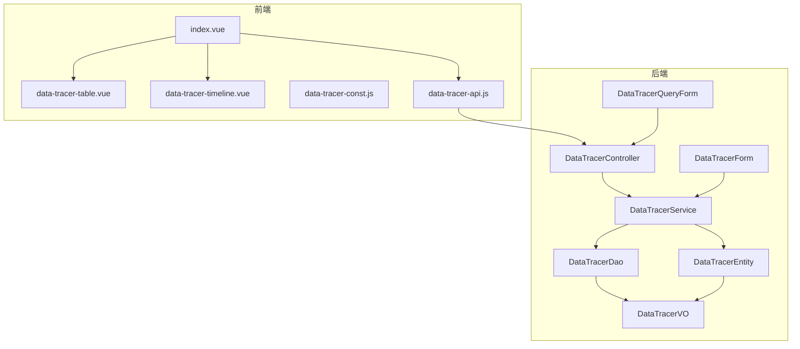
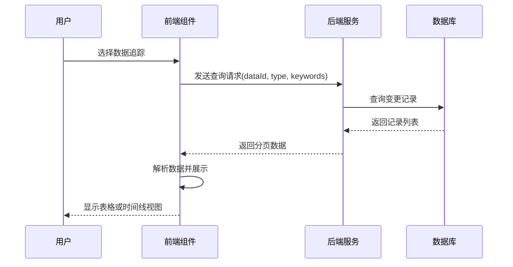
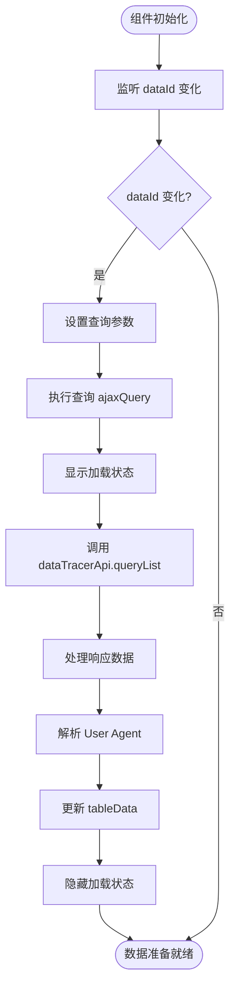
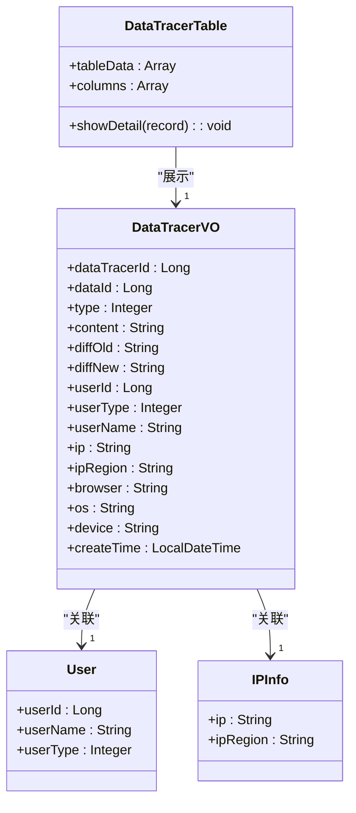
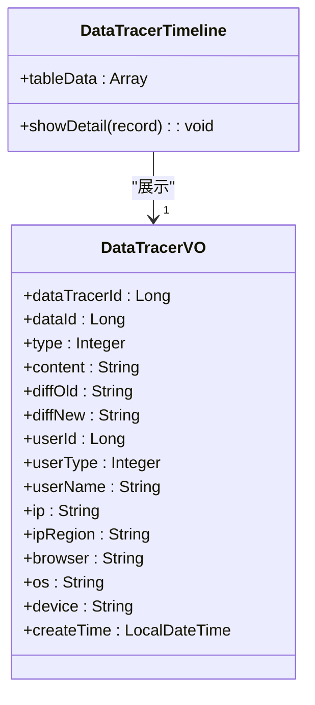
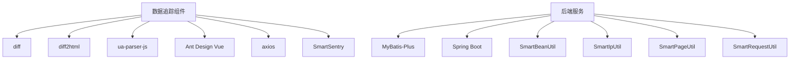

# 数据追踪组件

<cite>
**本文档引用的文件**
- [index.vue](file://smart-admin-web-javascript\src\components\support\data-tracer\index.vue)
- [data-tracer-table.vue](file://smart-admin-web-javascript\src\components\support\data-tracer\data-tracer-table.vue)
- [data-tracer-timeline.vue](file://smart-admin-web-javascript\src\components\support\data-tracer\data-tracer-timeline.vue)
- [data-tracer-const.js](file://smart-admin-web-javascript\src\constants\support\data-tracer-const.js)
- [data-tracer-api.js](file://smart-admin-web-javascript\src\api\support\data-tracer-api.js)
- [DataTracerController.java](file://smart-admin-api-java17-springboot3\sa-base\src\main\java\net\lab1024\sa\base\module\support\datatracer\controller\DataTracerController.java)
- [DataTracerService.java](file://smart-admin-api-java17-springboot3\sa-base\src\main\java\net\lab1024\sa\base\module\support\datatracer\service\DataTracerService.java)
- [DataTracerEntity.java](file://smart-admin-api-java17-springboot3\sa-base\src\main\java\net\lab1024\sa\base\module\support\datatracer\domain\entity\DataTracerEntity.java)
- [DataTracerQueryForm.java](file://smart-admin-api-java17-springboot3\sa-base\src\main\java\net\lab1024\sa\base\module\support\datatracer\domain\form\DataTracerQueryForm.java)
- [DataTracerForm.java](file://smart-admin-api-java17-springboot3\sa-base\src\main\java\net\lab1024\sa\base\module\support\datatracer\domain\form\DataTracerForm.java)
- [DataTracerVO.java](file://smart-admin-api-java17-springboot3\sa-base\src\main\java\net\lab1024\sa\base\module\support\datatracer\domain\vo\DataTracerVO.java)
- [DataTracerMapper.xml](file://smart-admin-api-java17-springboot3\sa-base\src\main\resources\mapper\support\DataTracerMapper.xml)
- [DataTracerTypeEnum.java](file://smart-admin-api-java17-springboot3\sa-base\src\main\java\net\lab1024\sa\base\module\support\datatracer\constant\DataTracerTypeEnum.java)
- [DataTracerFieldLabel.java](file://smart-admin-api-java17-springboot3\sa-base\src\main\java\net\lab1024\sa\base\module\support\datatracer\annoation\DataTracerFieldLabel.java)
- [enterprise-detail.vue](file://smart-admin-web-javascript\src\views\business\oa\enterprise\enterprise-detail.vue)
- [EnterpriseEntity.java](file://smart-admin-api-java17-springboot3\sa-admin\src\main\java\net\lab1024\sa\admin\module\business\oa\enterprise\domain\entity\EnterpriseEntity.java)
- [EnterpriseService.java](file://smart-admin-api-java17-springboot3\sa-admin\src\main\java\net\lab1024\sa\admin\module\business\oa\enterprise\service\EnterpriseService.java)
</cite>

## 目录
1. [简介](#简介)
2. [项目结构](#项目结构)
3. [核心组件](#核心组件)
4. [架构概述](#架构概述)
5. [详细组件分析](#详细组件分析)
6. [依赖分析](#依赖分析)
7. [性能考虑](#性能考虑)
8. [故障排除指南](#故障排除指南)
9. [结论](#结论)

## 简介
数据追踪组件（data-tracer）是一个用于记录和展示业务数据变更历史的前端组件，它能够帮助用户了解数据的修改过程，包括谁在何时进行了哪些修改。该组件提供了两种视图模式：表格视图和时间线视图，以满足不同场景下的需求。通过集成后端服务，组件可以查询特定业务实体的数据变更记录，并以结构化的方式展示字段级别的修改详情。

## 项目结构
数据追踪组件位于前端项目的 `src/components/support/data-tracer/` 目录下，包含主组件 `index.vue` 以及两个子组件 `data-tracer-table.vue` 和 `data-tracer-timeline.vue`。后端服务位于 `sa-base` 模块的 `support/datatracer` 包中，包含控制器、服务、DAO 层以及相关的实体类和常量定义。

**图示来源**
- [index.vue](file://smart-admin-web-javascript\src\components\support\data-tracer\index.vue)
- [data-tracer-table.vue](file://smart-admin-web-javascript\src\components\support\data-tracer\data-tracer-table.vue)
- [data-tracer-timeline.vue](file://smart-admin-web-javascript\src\components\support\data-tracer\data-tracer-timeline.vue)
- [data-tracer-const.js](file://smart-admin-web-javascript\src\constants\support\data-tracer-const.js)
- [data-tracer-api.js](file://smart-admin-web-javascript\src\api\support\data-tracer-api.js)
- [DataTracerController.java](file://smart-admin-api-java17-springboot3\sa-base\src\main\java\net\lab1024\sa\base\module\support\datatracer\controller\DataTracerController.java)
- [DataTracerService.java](file://smart-admin-api-java17-springboot3\sa-base\src\main\java\net\lab1024\sa\base\module\support\datatracer\service\DataTracerService.java)
- [DataTracerDao.java](file://smart-admin-api-java17-springboot3\sa-base\src\main\java\net\lab1024\sa\base\module\support\datatracer\dao\DataTracerDao.java)
- [DataTracerEntity.java](file://smart-admin-api-java17-springboot3\sa-base\src\main\java\net\lab1024\sa\base\module\support\datatracer\domain\entity\DataTracerEntity.java)
- [DataTracerVO.java](file://smart-admin-api-java17-springboot3\sa-base\src\main\java\net\lab1024\sa\base\module\support\datatracer\domain\vo\DataTracerVO.java)
- [DataTracerQueryForm.java](file://smart-admin-api-java17-springboot3\sa-base\src\main\java\net\lab1024\sa\base\module\support\datatracer\domain\form\DataTracerQueryForm.java)
- [DataTracerForm.java](file://smart-admin-api-java17-springboot3\sa-base\src\main\java\net\lab1024\sa\base\module\support\datatracer\domain\form\DataTracerForm.java)

## 核心组件
数据追踪组件的核心是 `index.vue` 文件，它负责协调表格视图和时间线视图的切换与数据同步。组件通过 `dataId` 和 `type` 两个属性来标识需要追踪的业务数据，其中 `dataId` 是业务实体的唯一标识，`type` 是业务类型，用于区分不同的业务场景。

**组件来源**
- [index.vue](file://smart-admin-web-javascript\src\components\support\data-tracer\index.vue#L72-L81)

## 架构概述
数据追踪组件采用前后端分离的架构，前端通过 API 调用后端服务获取数据变更记录，后端服务则负责从数据库中查询相关数据并返回给前端。前端组件根据用户的选择展示不同的视图模式，同时支持关键字搜索和分页功能。

**图示来源**
- [index.vue](file://smart-admin-web-javascript\src\components\support\data-tracer\index.vue#L106-L127)
- [DataTracerController.java](file://smart-admin-api-java17-springboot3\sa-base\src\main\java\net\lab1024\sa\base\module\support\datatracer\controller\DataTracerController.java#L34-L38)
- [DataTracerService.java](file://smart-admin-api-java17-springboot3\sa-base\src\main\java\net\lab1024\sa\base\module\support\datatracer\service\DataTracerService.java#L218-L227)
- [DataTracerMapper.xml](file://smart-admin-api-java17-springboot3\sa-base\src\main\resources\mapper\support\DataTracerMapper.xml#L13-L30)

## 详细组件分析
### 主组件分析
主组件 `index.vue` 负责管理数据查询、视图切换和分页功能。组件初始化时会监听 `dataId` 属性的变化，一旦发生变化就会触发数据查询。查询结果会存储在 `tableData` 中，并传递给子组件进行展示。

#### 数据查询与同步
主组件通过 `dataTracerApi.queryList` 方法向后端发送查询请求，请求参数包括分页信息、关键字搜索条件以及业务标识（dataId 和 type）。后端返回的数据经过处理后，会包含浏览器、操作系统和设备信息，这些信息是通过解析用户代理字符串（User Agent）得到的。

**图示来源**
- [index.vue](file://smart-admin-web-javascript\src\components\support\data-tracer\index.vue#L130-L140)
- [index.vue](file://smart-admin-web-javascript\src\components\support\data-tracer\index.vue#L106-L127)

**组件来源**
- [index.vue](file://smart-admin-web-javascript\src\components\support\data-tracer\index.vue#L67)
- [data-tracer-api.js](file://smart-admin-web-javascript\src\api\support\data-tracer-api.js#L14-L16)

#### 视图切换机制
主组件默认使用时间线视图进行展示，但可以通过注释切换到表格视图。两种视图都接收相同的 `tableData` 数据，并通过 `@showDetail` 事件监听器来处理详情查看操作。当用户点击"详情"或"查看修改"链接时，会触发 `showDetail` 方法，该方法会使用 `diff` 和 `diff2html` 库生成美观的差异对比视图。

**组件来源**
- [index.vue](file://smart-admin-web-javascript\src\components\support\data-tracer\index.vue#L42)
- [index.vue](file://smart-admin-web-javascript\src\components\support\data-tracer\index.vue#L146-L178)

### 表格视图分析
表格视图组件 `data-tracer-table.vue` 使用 Ant Design Vue 的 `a-table` 组件来展示数据变更记录。表格包含序号、操作时间、操作人、IP、IP地区、客户端、操作内容和操作等列。其中，操作人列会显示用户名和用户类型，客户端列会显示浏览器、操作系统和设备信息。

**图示来源**
- [data-tracer-table.vue](file://smart-admin-web-javascript\src\components\support\data-tracer\data-tracer-table.vue#L45-L90)
- [DataTracerVO.java](file://smart-admin-api-java17-springboot3\sa-base\src\main\java\net\lab1024\sa\base\module\support\datatracer\domain\vo\DataTracerVO.java)

**组件来源**
- [data-tracer-table.vue](file://smart-admin-web-javascript\src\components\support\data-tracer\data-tracer-table.vue)

### 时间线视图分析
时间线视图组件 `data-tracer-timeline.vue` 使用 Ant Design Vue 的 `a-timeline` 组件来按时间顺序组织变更事件。每个时间线项包含操作内容和详细的元信息（操作时间、操作人、IP地区、IP、浏览器、操作系统等）。这种视图模式更适合查看数据变更的时间序列。

**图示来源**
- [data-tracer-timeline.vue](file://smart-admin-web-javascript\src\components\support\data-tracer\data-tracer-timeline.vue)
- [DataTracerVO.java](file://smart-admin-api-java17-springboot3\sa-base\src\main\java\net\lab1024\sa\base\module\support\datatracer\domain\vo\DataTracerVO.java)

**组件来源**
- [data-tracer-timeline.vue](file://smart-admin-web-javascript\src\components\support\data-tracer\data-tracer-timeline.vue)

## 依赖分析
数据追踪组件依赖于多个外部库和内部模块。前端依赖包括 `diff` 和 `diff2html` 用于生成差异对比视图，`ua-parser-js` 用于解析用户代理字符串。后端依赖包括 MyBatis-Plus 用于数据库操作，以及项目内部的公共工具类。

**图示来源**
- [index.vue](file://smart-admin-web-javascript\src\components\support\data-tracer\index.vue#L62-L65)
- [DataTracerService.java](file://smart-admin-api-java17-springboot3\sa-base\src\main\java\net\lab1024\sa\base\module\support\datatracer\service\DataTracerService.java#L23-L28)

## 性能考虑
数据追踪组件在设计时考虑了性能优化。前端通过分页机制避免一次性加载过多数据，后端也实现了分页查询功能。查询结果默认按 `data_tracer_id` 降序排列，确保最新的变更记录优先显示。此外，组件还支持关键字搜索，可以帮助用户快速定位特定的变更记录。

**组件来源**
- [DataTracerMapper.xml](file://smart-admin-api-java17-springboot3\sa-base\src\main\resources\mapper\support\DataTracerMapper.xml#L26-L28)
- [index.vue](file://smart-admin-web-javascript\src\components\support\data-tracer\index.vue#L44-L55)

## 故障排除指南
### 常见问题
1. **无法显示数据追踪记录**：检查 `dataId` 和 `type` 参数是否正确传递，确认后端服务是否正常运行。
2. **用户代理信息解析失败**：确保 `ua-parser-js` 库正确加载，检查用户代理字符串格式是否符合标准。
3. **差异对比视图不显示**：确认 `diff` 和 `diff2html` 库已正确引入，检查 `diffOld` 和 `diffNew` 字段是否包含有效数据。

**组件来源**
- [index.vue](file://smart-admin-web-javascript\src\components\support\data-tracer\index.vue#L123-L126)
- [index.vue](file://smart-admin-web-javascript\src\components\support\data-tracer\index.vue#L146-L178)

## 结论
数据追踪组件提供了一套完整的解决方案，用于记录和展示业务数据的变更历史。通过表格视图和时间线视图的结合，用户可以从不同角度查看数据变更情况。组件设计合理，前后端分离清晰，易于集成到各种业务场景中。通过合理的配置和使用，可以有效提升系统的可追溯性和安全性。