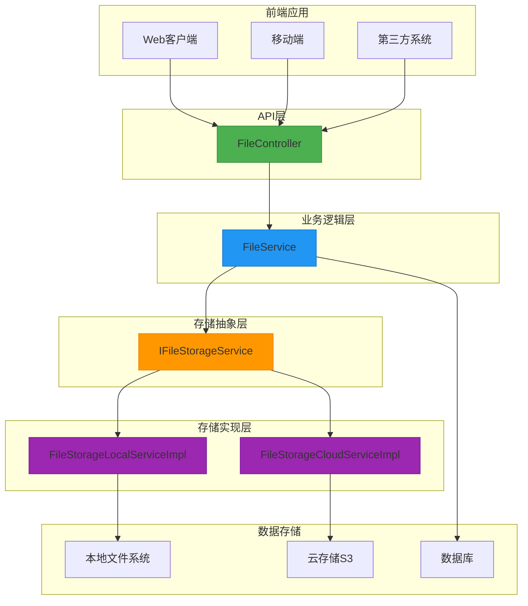
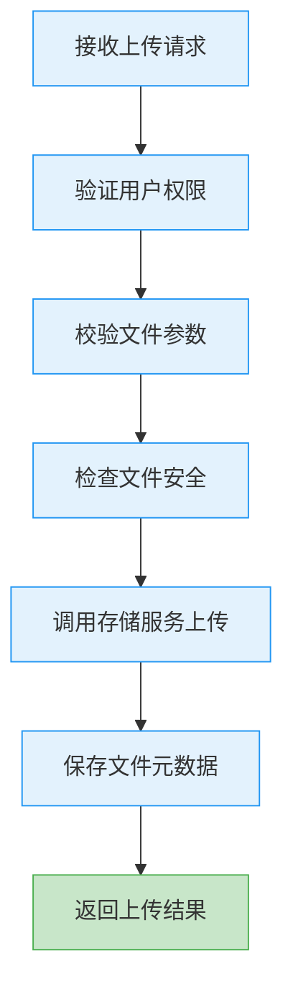
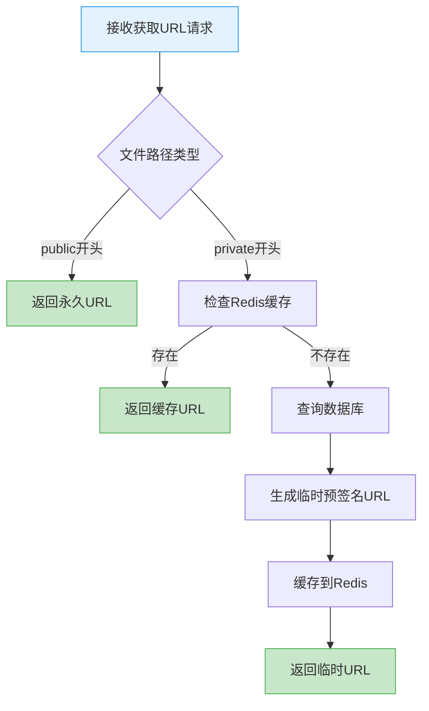
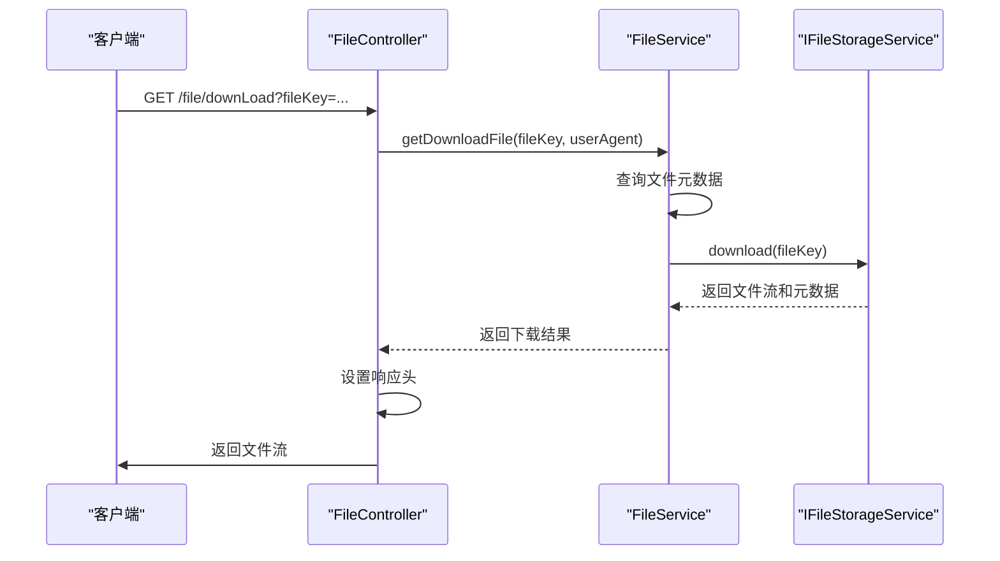
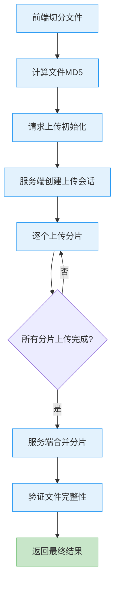
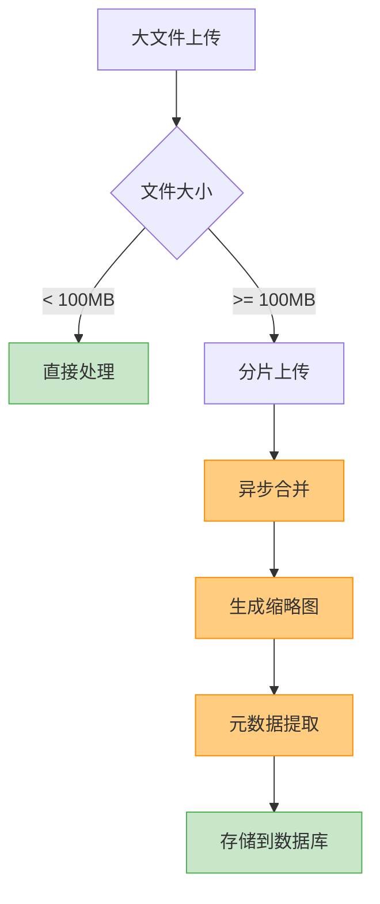
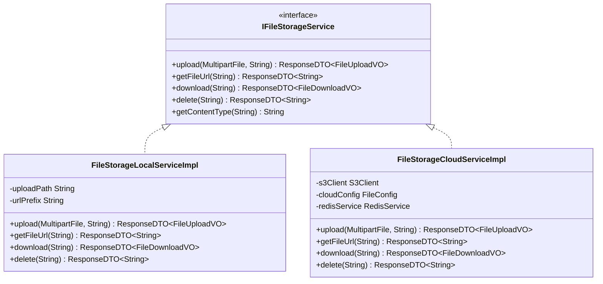
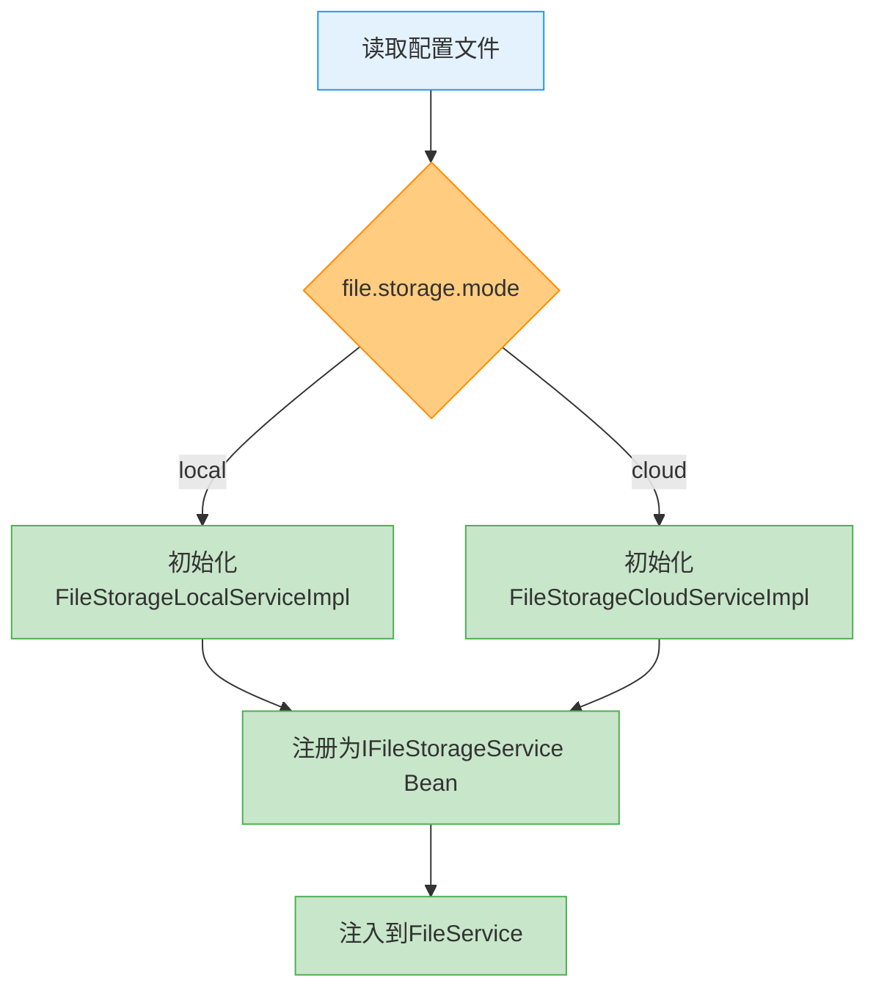
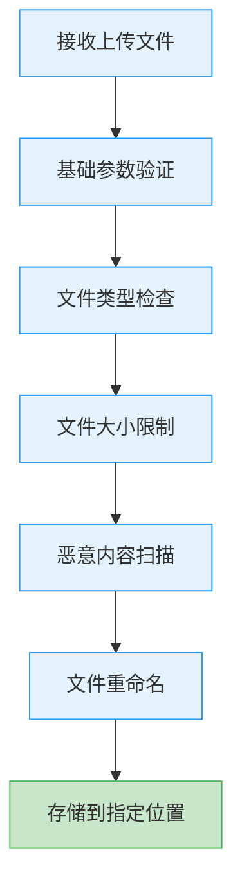

# 文件服务API

<cite>
**本文档引用的文件**
- [FileController.java](file://smart-admin-api-java17-springboot3\sa-base\src\main\java\net\lab1024\sa\base\module\support\file\controller\FileController.java)
- [FileService.java](file://smart-admin-api-java17-springboot3\sa-base\src\main\java\net\lab1024\sa\base\module\support\file\service\FileService.java)
- [IFileStorageService.java](file://smart-admin-api-java17-springboot3\sa-base\src\main\java\net\lab1024\sa\base\module\support\file\service\IFileStorageService.java)
- [FileStorageLocalServiceImpl.java](file://smart-admin-api-java17-springboot3\sa-base\src\main\java\net\lab1024\sa\base\module\support\file\service\FileStorageLocalServiceImpl.java)
- [FileStorageCloudServiceImpl.java](file://smart-admin-api-java17-springboot3\sa-base\src\main\java\net\lab1024\sa\base\module\support\file\service\FileStorageCloudServiceImpl.java)
- [FileConfig.java](file://smart-admin-api-java17-springboot3\sa-base\src\main\java\net\lab1024\sa\base\config\FileConfig.java)
- [FileFolderTypeEnum.java](file://smart-admin-api-java17-springboot3\sa-base\src\main\java\net\lab1024\sa\base\module\support\file\constant\FileFolderTypeEnum.java)
- [FileUploadVO.java](file://smart-admin-api-java17-springboot3\sa-base\src\main\java\net\lab1024\sa\base\module\support\file\domain\vo\FileUploadVO.java)
- [FileDownloadVO.java](file://smart-admin-api-java17-springboot3\sa-base\src\main\java\net\lab1024\sa\base\module\support\file\domain\vo\FileDownloadVO.java)
- [FileMetadataVO.java](file://smart-admin-api-java17-springboot3\sa-base\src\main\java\net\lab1024\sa\base\module\support\file\domain\vo\FileMetadataVO.java)
- [FileDao.java](file://smart-admin-api-java17-springboot3\sa-base\src\main\java\net\lab1024\sa\base\module\support\file\dao\FileDao.java)
</cite>

## 目录
1. [简介](#简介)
2. [核心功能接口](#核心功能接口)
3. [高级特性实现机制](#高级特性实现机制)
4. [文件存储抽象设计](#文件存储抽象设计)
5. [安全与配置最佳实践](#安全与配置最佳实践)
6. [错误码说明](#错误码说明)

## 简介

文件服务模块为系统提供统一的文件上传、下载、预览和管理功能。该模块采用分层架构设计，通过统一的接口抽象本地存储和云存储服务，支持灵活的存储模式切换。系统实现了完整的文件生命周期管理，包括上传、存储、访问控制、下载和删除等功能。

文件服务采用微服务架构模式，通过`FileController`暴露RESTful API接口，由`FileService`处理业务逻辑，并通过`IFileStorageService`接口实现对不同存储后端的统一访问。系统支持两种存储模式：本地存储和云存储（基于S3协议），可通过配置文件灵活切换。

**文件存储架构**


**Diagram sources**
- [FileController.java](file://smart-admin-api-java17-springboot3\sa-base\src\main\java\net\lab1024\sa\base\module\support\file\controller\FileController.java)
- [FileService.java](file://smart-admin-api-java17-springboot3\sa-base\src\main\java\net\lab1024\sa\base\module\support\file\service\FileService.java)
- [IFileStorageService.java](file://smart-admin-api-java17-springboot3\sa-base\src\main\java\net\lab1024\sa\base\module\support\file\service\IFileStorageService.java)

## 核心功能接口

文件服务模块提供了一系列RESTful API接口，支持文件的上传、下载、获取URL和删除等核心操作。所有接口均采用统一的响应格式，包含状态码、消息和数据体。

### 文件上传接口

**接口说明**
- **HTTP方法**: POST
- **端点**: `/file/upload`
- **功能**: 上传单个文件到服务器
- **认证**: 需要有效的用户认证令牌

**请求参数**
```json
{
  "file": "文件二进制数据",
  "folder": 1
}
```

| 参数名 | 类型 | 必填 | 说明 |
|-------|------|------|------|
| file | MultipartFile | 是 | 要上传的文件 |
| folder | Integer | 是 | 文件夹类型，参考FileFolderTypeEnum |

**响应格式**
```json
{
  "ok": true,
  "code": 200,
  "data": {
    "fileId": 123,
    "fileName": "example.pdf",
    "fileUrl": "http://localhost:8080/upload/public/common/abc123_20230101.pdf",
    "fileKey": "public/common/abc123_20230101.pdf",
    "fileSize": 1024,
    "fileType": "pdf"
  },
  "msg": "操作成功"
}
```

**处理流程**


**Diagram sources**
- [FileController.java](file://smart-admin-api-java17-springboot3\sa-base\src\main\java\net\lab1024\sa\base\module\support\file\controller\FileController.java#L44-L49)
- [FileService.java](file://smart-admin-api-java17-springboot3\sa-base\src\main\java\net\lab1024\sa\base\module\support\file\service\FileService.java#L68-L117)

### 获取文件URL接口

**接口说明**
- **HTTP方法**: GET
- **端点**: `/file/getFileUrl`
- **功能**: 根据文件key获取可访问的URL
- **认证**: 无（公开文件）或需要认证（私有文件）

**请求参数**
```
GET /file/getFileUrl?fileKey=public/common/abc123_20230101.pdf
```

| 参数名 | 类型 | 必填 | 说明 |
|-------|------|------|------|
| fileKey | String | 是 | 文件的唯一标识key |

**响应格式**
```json
{
  "ok": true,
  "code": 200,
  "data": "http://localhost:8080/upload/public/common/abc123_20230101.pdf",
  "msg": "操作成功"
}
```

**访问控制逻辑**


**Diagram sources**
- [FileController.java](file://smart-admin-api-java17-springboot3\sa-base\src\main\java\net\lab1024\sa\base\module\support\file\controller\FileController.java#L51-L55)
- [FileService.java](file://smart-admin-api-java17-springboot3\sa-base\src\main\java\net\lab1024\sa\base\module\support\file\service/FileService.java#L162-L176)
- [FileStorageCloudServiceImpl.java](file://smart-admin-api-java17-springboot3\sa-base\src\main\java\net\lab1024\sa\base\module\support\file\service/FileStorageCloudServiceImpl.java#L148-L180)

### 文件下载接口

**接口说明**
- **HTTP方法**: GET
- **端点**: `/file/downLoad`
- **功能**: 下载文件流
- **认证**: 需要有效的用户认证令牌

**请求参数**
```
GET /file/downLoad?fileKey=public/common/abc123_20230101.pdf
```

| 参数名 | 类型 | 必填 | 说明 |
|-------|------|------|------|
| fileKey | String | 是 | 文件的唯一标识key |

**响应格式**
- 直接返回文件流
- 设置适当的Content-Disposition头信息

**下载流程**


**Diagram sources**
- [FileController.java](file://smart-admin-api-java17-springboot3\sa-base\src\main\java\net\lab1024\sa\base\module\support\file\controller/FileController.java#L57-L73)
- [FileService.java](file://smart-admin-api-java17-springboot3\sa-base\src\main\java\net\lab1024\sa\base\module\support\file\service/FileService.java#L182-L194)

## 高级特性实现机制

### 分片上传与断点续传

系统支持大文件的分片上传和断点续传功能，确保在网络不稳定的情况下能够可靠地传输大文件。

**分片上传流程**


**断点续传实现**
```javascript
// 前端实现示例
const uploadWithResume = async (file, folder) => {
  const chunkSize = 10 * 1024 * 1024; // 10MB per chunk
  const totalChunks = Math.ceil(file.size / chunkSize);
  const fileMd5 = await calculateFileMd5(file);
  
  // 检查上传状态
  const statusResponse = await checkUploadStatus(fileMd5);
  const startChunk = statusResponse.data.nextChunk || 0;
  
  for (let i = startChunk; i < totalChunks; i++) {
    const start = i * chunkSize;
    const end = Math.min(start + chunkSize, file.size);
    const chunk = file.slice(start, end);
    
    const formData = new FormData();
    formData.append('file', chunk);
    formData.append('fileMd5', fileMd5);
    formData.append('chunkIndex', i);
    formData.append('totalChunks', totalChunks);
    formData.append('folder', folder);
    
    try {
      await axios.post('/file/upload/chunk', formData);
    } catch (error) {
      // 上传失败，记录当前进度
      saveUploadProgress(fileMd5, i);
      throw error;
    }
  }
  
  // 通知服务端合并分片
  await axios.post('/file/upload/complete', { fileMd5 });
};
```

### 大文件处理优化

针对大文件处理，系统实现了多项优化措施：

1. **流式处理**: 采用流式读写，避免内存溢出
2. **异步处理**: 大文件操作放入异步队列
3. **内存映射**: 对超大文件使用内存映射技术
4. **缓存策略**: 合理使用Redis缓存频繁访问的文件元数据

**大文件处理架构**


**Diagram sources**
- [FileService.java](file://smart-admin-api-java17-springboot3\sa-base\src\main\java\net\lab1024\sa\base\module\support\file\service/FileService.java)
- [FileStorageLocalServiceImpl.java](file://smart-admin-api-java17-springboot3\sa-base\src\main\java\net\lab1024\sa\base\module\support\file\service/FileStorageLocalServiceImpl.java)

## 文件存储抽象设计

### 统一存储接口设计

系统采用策略模式实现对不同存储后端的统一访问，通过`IFileStorageService`接口定义标准操作。

**接口设计**


**Diagram sources**
- [IFileStorageService.java](file://smart-admin-api-java17-springboot3\sa-base\src\main\java\net\lab1024\sa\base\module\support\file\service\IFileStorageService.java)
- [FileStorageLocalServiceImpl.java](file://smart-admin-api-java17-springboot3\sa-base\src\main\java\net\lab1024\sa\base\module\support\file\service\FileStorageLocalServiceImpl.java)
- [FileStorageCloudServiceImpl.java](file://smart-admin-api-java17-springboot3\sa-base\src\main\java\net\lab1024\sa\base\module\support\file\service/FileStorageCloudServiceImpl.java)

### 多实现策略

系统通过Spring的条件化配置实现存储策略的动态切换。

**配置驱动的实现选择**


**配置示例**
```yaml
# 本地存储配置
file:
  storage:
    mode: local
    local:
      upload-path: /data/upload/
      url-prefix: http://localhost:8080/upload/

# 云存储配置
file:
  storage:
    mode: cloud
    cloud:
      region: cn-north-1
      endpoint: s3.cn-north-1.amazonaws.com.cn
      bucket-name: my-bucket
      access-key: your-access-key
      secret-key: your-secret-key
      private-url-expire-seconds: 3600
      url-prefix: https://my-bucket.s3.cn-north-1.amazonaws.com.cn/
```

**Diagram sources**
- [FileConfig.java](file://smart-admin-api-java17-springboot3\sa-base\src\main\java\net\lab1024\sa\base\config\FileConfig.java)

## 安全与配置最佳实践

### 安全上传验证

系统实施多层次的安全验证机制，确保文件上传的安全性。

**安全验证流程**


**验证规则**
- 文件名长度限制：不超过100个字符
- 文件类型白名单：仅允许特定扩展名
- 文件大小限制：根据文件夹类型设置不同限制
- 恶意内容检测：集成安全扫描服务

### 文件类型限制

系统通过文件夹类型枚举实现精细化的文件类型管理。

**文件夹类型枚举**
```java
public enum FileFolderTypeEnum implements BaseEnum {
    // 通用文件夹
    COMMON(1, FOLDER_PUBLIC + "/common/", "通用"),
    
    // 公告文件夹
    NOTICE(2, FOLDER_PUBLIC + "/notice/", "公告"),
    
    // 帮助文档文件夹
    HELP_DOC(3, FOLDER_PUBLIC + "/help-doc/", "帮助中心"),
    
    // 意见反馈文件夹
    FEEDBACK(4, FOLDER_PUBLIC + "/feedback/", "意见反馈");
    
    public static final String FOLDER_PUBLIC = "public";
    public static final String FOLDER_PRIVATE = "private";
    
    private final Integer value;
    private final String folder;
    private final String desc;
}
```

**访问权限控制**
- `public`前缀：公开访问，永久URL
- `private`前缀：私有访问，临时预签名URL
- 不同文件夹类型对应不同的安全策略

### 存储路径配置

合理的存储路径配置是确保系统稳定运行的关键。

**最佳实践建议**
1. **本地存储路径**: 使用独立的磁盘分区，避免影响系统盘
2. **云存储配置**: 启用版本控制和跨区域复制
3. **备份策略**: 定期备份重要文件
4. **监控告警**: 设置存储空间使用率告警

**配置参数说明**
| 配置项 | 说明 | 推荐值 |
|-------|------|--------|
| file.storage.mode | 存储模式 | local或cloud |
| file.storage.local.upload-path | 本地上传路径 | /data/upload/ |
| file.storage.cloud.bucket-name | 云存储桶名称 | 生产环境专用桶 |
| file.storage.cloud.private-url-expire-seconds | 私有URL过期时间 | 3600秒 |

**Section sources**
- [FileConfig.java](file://smart-admin-api-java17-springboot3\sa-base\src\main\java\net\lab1024\sa\base\config\FileConfig.java)
- [FileFolderTypeEnum.java](file://smart-admin-api-java17-springboot3\sa-base\src\main\java\net\lab1024\sa\base\module\support\file\constant\FileFolderTypeEnum.java)

## 错误码说明

系统采用统一的错误码体系，便于前端处理和问题定位。

**通用错误码**
| 错误码 | 说明 | 解决方案 |
|-------|------|----------|
| 200 | 操作成功 | 无需处理 |
| 400 | 参数错误 | 检查请求参数 |
| 401 | 未授权 | 重新登录获取令牌 |
| 403 | 禁止访问 | 检查用户权限 |
| 404 | 文件不存在 | 确认文件key是否正确 |
| 500 | 服务器内部错误 | 联系管理员 |

**文件服务专用错误码**
| 错误码 | 说明 | 解决方案 |
|-------|------|----------|
| USER-001 | 上传文件不能为空 | 确保选择了文件 |
| USER-002 | 文件名称不能为空 | 检查文件名 |
| USER-003 | 文件名称过长 | 文件名不超过100字符 |
| USER-004 | 文件夹类型错误 | 检查folder参数 |
| SYS-001 | 上传失败 | 检查存储空间 |
| SYS-002 | 文件下载失败 | 检查文件是否存在 |

**错误处理建议**
- 前端应根据错误码提供友好的用户提示
- 重要操作应实现重试机制
- 记录详细的错误日志便于排查问题

**Section sources**
- [FileService.java](file://smart-admin-api-java17-springboot3\sa-base\src\main\java\net\lab1024\sa\base\module\support\file\service/FileService.java)
- [FileController.java](file://smart-admin-api-java17-springboot3\sa-base\src\main\java\net\lab1024\sa\base\module\support\file\controller/FileController.java)