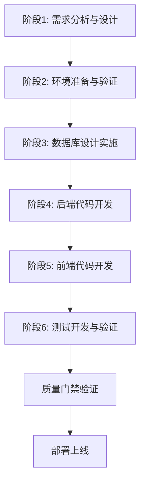

# 🚀 IOE-DREAM新模块开发标准流程

**版本**: v1.0
**创建时间**: 2025-11-17
**适用范围**: 所有新业务模块开发
**遵循规范**: D:\IOE-DREAM\docs\repowiki权威规范体系

## 📋 开发流程概览

### 六阶段标准开发流程



### 核心质量保障机制

- **零容忍政策**: 编码异常零容忍，违反规范立即停止
- **七层质量门禁**: 每层必须100%通过才能进入下一层
- **技能驱动开发**: 基于任务类型智能选择合适技能
- **全程自动化检查**: 每个关键节点都有自动化验证

## 🔧 技能调用核心策略

### 技能选择决策树

```bash
# 基于任务类型的智能技能选择
function select_skills_by_task_type() {
    local task_type="$1"
    local module_type="$2"

    case "$task_type" in
        "新模块开发")
            echo "🎯 新模块开发技能调用序列:"
            echo "1. openspec-compliance-specialist     # OpenSpec规范检查"
            echo "2. development-standards-specialist   # 开发规范检查"
            echo "3. four-tier-architecture-guardian    # 四层架构设计"
            echo "4. database-design-specialist         # 数据库设计"
            echo "5. business-module-developer          # 业务模块开发"
            ;;
        "代码修复")
            echo "🔧 代码修复技能调用序列:"
            echo "1. spring-boot-jakarta-guardian       # Jakarta包名修复"
            echo "2. code-quality-protector             # 编码质量修复"
            echo "3. four-tier-architecture-guardian    # 架构违规修复"
            ;;
        "性能优化")
            echo "⚡ 性能优化技能调用序列:"
            echo "1. cache-architecture-specialist      # 缓存架构优化"
            echo "2. database-design-specialist         # 数据库优化"
            echo "3. quality-assurance-expert           # 性能测试验证"
            ;;
    esac

    # 基于模块类型的业务专家技能
    case "$module_type" in
        "access_control")
            echo "📌 业务专家技能: access-control-business-specialist"
            ;;
        "consume")
            echo "💳 业务专家技能: business-module-developer (消费模块)"
            ;;
        "attendance")
            echo "⏰ 业务专家技能: business-module-developer (考勤模块)"
            ;;
    esac
}
```

### 技能组合使用矩阵

| 开发阶段 | 核心技能 | 质量保证技能 | 业务专家技能 |
|---------|---------|-------------|-------------|
| 需求分析 | openspec-compliance-specialist | development-standards-specialist | 根据模块类型选择 |
| 架构设计 | four-tier-architecture-guardian | database-design-specialist | 无 |
| 后端开发 | spring-boot-jakarta-guardian | code-quality-protector | business-module-developer |
| 前端开发 | frontend-development-specialist | code-quality-protector | 无 |
| 测试验证 | quality-assurance-expert | code-quality-protector | 无 |
| 部署上线 | intelligent-operations-expert | quality-assurance-expert | 无 |

## 🏗️ 详细开发流程

### 阶段1: 需求分析与设计 (1-3天)

#### 1.1 规范文档研究
```bash
# 必读规范文档 (优先级排序)
PRIORITY_1_DOCS=(
    "docs/repowiki/zh/content/开发规范体系.md"                 # 权威规范体系
    "docs/repowiki/zh/content/核心规范/架构设计规范.md"         # 架构设计标准
    "docs/repowiki/zh/content/核心规范/Java编码规范.md"         # Java编码标准
    "docs/repowiki/zh/content/核心规范/缓存架构规范.md"         # 缓存架构标准
    "docs/CHECKLISTS/通用开发检查清单.md"                      # 通用检查标准
)

# 业务模块专用规范
case "$MODULE_TYPE" in
    "access_control")
        PRIORITY_2_DOCS=("docs/CHECKLISTS/门禁系统开发检查清单.md")
        ;;
    "consume")
        PRIORITY_2_DOCS=("docs/CHECKLISTS/消费系统开发检查清单.md")
        ;;
    "attendance")
        PRIORITY_2_DOCS=("docs/CHECKLISTS/考勤系统开发检查清单.md")
        ;;
esac
```

#### 1.2 技能调用策略
```bash
# 阶段1技能调用序列
Skill("openspec-compliance-specialist")        # OpenSpec规范遵循
Skill("development-standards-specialist")      # 开发规范检查
```

**输出物清单**:
- [ ] 需求分析文档
- [ ] 技术设计方案
- [ ] 数据库设计文档
- [ ] API接口设计文档
- [ ] 权限设计方案

#### 1.3 设计规范检查点
```bash
#!/bin/bash
# 设计阶段质量检查
echo "🔍 执行设计阶段质量检查..."

# 1. 架构规范检查
check_architecture_design() {
    echo "检查项: 四层架构设计规范"
    # Controller → Service → Manager → DAO
    # 每层职责明确，无跨层访问
}

# 2. 数据库设计规范检查
check_database_design() {
    echo "检查项: 数据库设计规范"
    # 表命名: t_{business}_{entity}
    # 主键: {table}_id BIGINT AUTO_INCREMENT
    # 审计字段: create_time, update_time, deleted_flag
}

# 3. API设计规范检查
check_api_design() {
    echo "检查项: RESTful API设计规范"
    # 路径格式: /api/{module}/{action}
    # HTTP方法正确使用
    # 统一响应格式
}

# 4. 权限设计规范检查
check_permission_design() {
    echo "检查项: 权限设计规范"
    # 权限标识: {module}:{action}
    # 前后端权限一致
    # 数据权限设计
}
```

### 阶段2: 环境准备与验证 (0.5天)

#### 2.1 开发前强制验证
```bash
#!/bin/bash
# 开发前环境验证脚本
echo "🔍 执行开发前环境验证..."

# 1. 基础环境检查
check_basic_environment() {
    echo "检查项: 基础开发环境"

    # Java版本检查
    java_version=$(java -version 2>&1 | head -1 | cut -d'"' -f2)
    if [[ ! "$java_version" =~ "17" ]]; then
        echo "❌ Java版本错误: $java_version (需要Java 17)"
        exit 1
    fi

    # Maven版本检查
    mvn_version=$(mvn -version | head -1)
    echo "✅ Maven版本: $mvn_version"

    # 数据库连接检查
    if ! mysql -h 192.168.10.110 -P 33060 -u root -e "USE smart_admin_v3;"; then
        echo "❌ 数据库连接失败"
        exit 1
    fi

    # Redis连接检查
    if ! redis-cli -h 127.0.0.1 -p 6389 -n 1 ping; then
        echo "❌ Redis连接失败"
        exit 1
    fi

    echo "✅ 基础环境检查通过"
}

# 2. 项目编译状态检查
check_project_compilation() {
    echo "检查项: 项目编译状态"

    cd smart-admin-api-java17-springboot3
    mvn clean compile -q
    if [ $? -ne 0 ]; then
        echo "❌ 项目编译失败，请先修复现有问题"
        exit 1
    fi

    echo "✅ 项目编译状态正常"
}

# 3. 代码规范合规检查
check_coding_standards() {
    echo "检查项: 代码规范合规状态"

    # javax包检查
    javax_count=$(find . -name "*.java" -exec grep -l "javax\." {} \; | wc -l)
    if [ $javax_count -ne 0 ]; then
        echo "❌ 发现 $javax_count 个文件使用javax包"
        exit 1
    fi

    # @Autowired检查
    autowired_count=$(find . -name "*.java" -exec grep -l "@Autowired" {} \; | wc -l)
    if [ $autowired_count -ne 0 ]; then
        echo "❌ 发现 $autowired_count 个文件使用@Autowired"
        exit 1
    fi

    echo "✅ 代码规范合规检查通过"
}

# 执行所有检查
check_basic_environment
check_project_compilation
check_coding_standards

echo "🎉 开发前环境验证通过，可以开始开发"
```

#### 2.2 技能调用策略
```bash
# 阶段2技能调用序列
Skill("development-standards-specialist")      # 开发规范检查
Skill("spring-boot-jakarta-guardian")         # SpringBoot环境检查
Skill("four-tier-architecture-guardian")      # 架构合规检查
```

### 阶段3: 数据库设计实施 (1天)

#### 3.1 技能调用策略
```bash
# 阶段3技能调用序列
Skill("database-design-specialist")           # 数据库设计专家
```

#### 3.2 数据库设计标准模板
```sql
-- ========================================
-- 标准表结构设计模板
-- ========================================

-- 1. 主表设计
CREATE TABLE `t_{business}_{entity}` (
  `{entity}_id` bigint(20) NOT NULL AUTO_INCREMENT COMMENT '{实体}ID',

  -- 业务字段 (根据实际业务需求添加)
  `{field_name}` {field_type} {field_constraint} COMMENT '{字段描述}',
  `{field_name}_status` tinyint(1) NOT NULL DEFAULT '1' COMMENT '状态 1-启用 0-禁用',

  -- 审计字段 (BaseEntity已包含，这里仅作参考)
  `create_time` datetime NOT NULL DEFAULT CURRENT_TIMESTAMP COMMENT '创建时间',
  `update_time` datetime NOT NULL DEFAULT CURRENT_TIMESTAMP ON UPDATE CURRENT_TIMESTAMP COMMENT '更新时间',
  `deleted_flag` tinyint(1) NOT NULL DEFAULT '0' COMMENT '删除标记 0-正常 1-删除',
  `create_user_id` bigint(20) DEFAULT NULL COMMENT '创建人ID',
  `update_user_id` bigint(20) DEFAULT NULL COMMENT '更新人ID',
  `version` int(11) NOT NULL DEFAULT '0' COMMENT '版本号（乐观锁）',

  PRIMARY KEY (`{entity}_id`),
  KEY `idx_create_time` (`create_time`),
  KEY `idx_{business}_{field_name}` (`{field_name}`),
  KEY `idx_deleted_flag` (`deleted_flag`),
  KEY `idx_{business}_status` (`{field_name}_status`)
) ENGINE=InnoDB DEFAULT CHARSET=utf8mb4 COLLATE=utf8mb4_unicode_ci COMMENT='{实体表}';

-- 2. 关联表设计 (如需要)
CREATE TABLE `t_{business}_{entity}_relation` (
  `relation_id` bigint(20) NOT NULL AUTO_INCREMENT COMMENT '关联ID',
  `{entity}_id` bigint(20) NOT NULL COMMENT '{实体}ID',
  `related_entity_id` bigint(20) NOT NULL COMMENT '关联实体ID',
  `relation_type` tinyint(1) NOT NULL COMMENT '关联类型',
  `create_time` datetime NOT NULL DEFAULT CURRENT_TIMESTAMP COMMENT '创建时间',

  PRIMARY KEY (`relation_id`),
  KEY `idx_{entity}_id` (`{entity}_id`),
  KEY `idx_related_entity_id` (`related_entity_id`),
  UNIQUE KEY `uk_{entity}_relation` (`{entity}_id`, `related_entity_id`, `relation_type`)
) ENGINE=InnoDB DEFAULT CHARSET=utf8mb4 COLLATE=utf8mb4_unicode_ci COMMENT='{实体}关联表';
```

#### 3.3 数据库设计验证脚本
```bash
#!/bin/bash
# 数据库设计质量验证脚本
echo "🔍 执行数据库设计质量验证..."

# 1. 表命名规范检查
check_table_naming() {
    echo "检查项: 表命名规范"

    non_compliant_tables=$(mysql -u root -h 192.168.10.110 -P 33060 smart_admin_v3 -e "
        SELECT TABLE_NAME FROM information_schema.TABLES
        WHERE TABLE_SCHEMA = 'smart_admin_v3'
        AND TABLE_NAME NOT LIKE 't_%_%'
        AND TABLE_NAME NOT LIKE 'sys_%';" | tail -n +2)

    if [ ! -z "$non_compliant_tables" ]; then
        echo "❌ 发现不符合命名规范的表:"
        echo "$non_compliant_tables"
        return 1
    fi

    echo "✅ 表命名规范检查通过"
}

# 2. 审计字段完整性检查
check_audit_fields() {
    echo "检查项: 审计字段完整性"

    tables_missing_audit=$(mysql -u root -h 192.168.10.110 -P 33060 smart_admin_v3 -e "
        SELECT DISTINCT TABLE_NAME
        FROM information_schema.TABLES t
        WHERE t.TABLE_SCHEMA = 'smart_admin_v3'
        AND t.TABLE_NAME LIKE 't_%_%'
        AND NOT EXISTS (
            SELECT 1 FROM information_schema.COLUMNS c
            WHERE c.TABLE_SCHEMA = t.TABLE_SCHEMA
            AND c.TABLE_NAME = t.TABLE_NAME
            AND c.COLUMN_NAME IN ('create_time', 'update_time', 'deleted_flag')
            GROUP BY TABLE_NAME HAVING COUNT(DISTINCT COLUMN_NAME) = 3
        );" | tail -n +2)

    if [ ! -z "$tables_missing_audit" ]; then
        echo "❌ 缺少完整审计字段的表:"
        echo "$tables_missing_audit"
        return 1
    fi

    echo "✅ 审计字段完整性检查通过"
}

# 3. 主键规范检查
check_primary_key() {
    echo "检查项: 主键规范"

    invalid_primary_keys=$(mysql -u root -h 192.168.10.110 -P 33060 smart_admin_v3 -e "
        SELECT TABLE_NAME, COLUMN_NAME, DATA_TYPE
        FROM information_schema.COLUMNS
        WHERE TABLE_SCHEMA = 'smart_admin_v3'
        AND TABLE_NAME LIKE 't_%_%'
        AND COLUMN_KEY = 'PRI'
        AND (COLUMN_NAME NOT LIKE '%_id' OR DATA_TYPE != 'bigint');" | tail -n +2)

    if [ ! -z "$invalid_primary_keys" ]; then
        echo "❌ 主键设计不符合规范:"
        echo "$invalid_primary_keys"
        return 1
    fi

    echo "✅ 主键规范检查通过"
}

# 4. 索引设计检查
check_index_design() {
    echo "检查项: 索引设计"

    # 检查常用查询字段是否有索引
    missing_indexes=$(mysql -u root -h 192.168.10.110 -P 33060 smart_admin_v3 -e "
        SELECT TABLE_NAME, COLUMN_NAME
        FROM information_schema.COLUMNS
        WHERE TABLE_SCHEMA = 'smart_admin_v3'
        AND TABLE_NAME LIKE 't_%_%'
        AND COLUMN_NAME IN ('create_time', 'deleted_flag', 'status')
        AND COLUMN_NAME NOT IN (
            SELECT COLUMN_NAME FROM information_schema.STATISTICS
            WHERE TABLE_SCHEMA = 'smart_admin_v3'
            AND TABLE_NAME = COLUMNS.TABLE_NAME
        );" | tail -n +2)

    if [ ! -z "$missing_indexes" ]; then
        echo "⚠️ 建议添加索引的字段:"
        echo "$missing_indexes"
    fi

    echo "✅ 索引设计检查完成"
}

# 执行所有检查
check_table_naming
check_audit_fields
check_primary_key
check_index_design

echo "🎉 数据库设计质量验证完成"
```

### 阶段4: 后端代码开发 (3-5天)

#### 4.1 技能调用策略
```bash
# 阶段4技能调用序列
Skill("spring-boot-jakarta-guardian")         # SpringBoot开发
Skill("four-tier-architecture-guardian")      # 架构规范守护
Skill("cache-architecture-specialist")        # 缓存架构专家
Skill("business-module-developer")            # 业务模块开发
```

#### 4.2 Entity层开发标准
```java
// ========================================
// Entity层标准模板
// ========================================

@Data
@EqualsAndHashCode(callSuper = true)
@TableName("t_{business}_{entity}")
@ApiModel(description = "{实体}实体")
public class {Module}Entity extends BaseEntity {

    @ApiModelProperty("{实体}ID")
    @TableId(value = "{entity}_id", type = IdType.AUTO)
    private Long {entity}Id;

    // 业务字段设计标准
    @ApiModelProperty("{字段描述}")
    @TableField("{field_name}")
    @NotBlank(message = "{字段描述}不能为空")
    @Size(max = 100, message = "{字段描述}长度不能超过100个字符")
    private String {fieldName};

    @ApiModelProperty("{数值字段描述}")
    @TableField("{number_field}")
    @NotNull(message = "{数值字段描述}不能为空")
    @DecimalMin(value = "0.00", message = "{数值字段描述}不能小于0")
    private BigDecimal {numberField};

    @ApiModelProperty("{状态字段描述}")
    @TableField("{status_field}")
    @NotNull(message = "{状态字段描述}不能为空")
    private Integer {statusField};

    // 注意：严禁重复定义BaseEntity已有的审计字段
    // BaseEntity已包含：createTime, updateTime, createUserId, updateUserId, deletedFlag, version
}
```

#### 4.3 DAO层开发标准
```java
// ========================================
// DAO层标准模板
// ========================================

@Mapper
public interface {Module}Dao extends BaseMapper<{Module}Entity> {

    /**
     * 根据唯一标识查询实体
     *
     * @param {unique_field} 唯一标识值
     * @return 实体信息
     */
    @Select("SELECT * FROM t_{business}_{entity} WHERE deleted_flag = 0 AND {unique_field} = #{value}")
    {Module}Entity selectBy{UniqueField}(@Param("value") String {unique_field});

    /**
     * 批量更新状态
     *
     * @param ids ID列表
     * @param status 状态值
     * @param updateUserId 更新人ID
     * @return 更新数量
     */
    @Update("<script>" +
            "UPDATE t_{business}_{entity} " +
            "SET {status_field} = #{status}, update_user_id = #{updateUserId}, update_time = NOW() " +
            "WHERE deleted_flag = 0 AND {entity}_id IN " +
            "<foreach collection='ids' item='id' open='(' separator=',' close=')'>" +
            "#{id}" +
            "</foreach>" +
            "</script>")
    int batchUpdateStatus(@Param("ids") List<Long> ids,
                        @Param("status") Integer status,
                        @Param("updateUserId") Long updateUserId);

    /**
     * 软删除
     *
     * @param id 实体ID
     * @return 删除数量
     */
    @Update("UPDATE t_{business}_{entity} SET deleted_flag = 1 WHERE {entity}_id = #{id}")
    int softDeleteById(@Param("id") Long id);

    /**
     * 分页查询（支持多条件）
     *
     * @param queryForm 查询表单
     * @return 实体列表
     */
    List<{Module}Entity> selectPageByCondition(@Param("query") {Module}QueryForm queryForm);
}
```

#### 4.4 Manager层开发标准
```java
// ========================================
// Manager层标准模板（缓存集成）
// ========================================

@Component
@Slf4j
public class {Module}Manager extends BaseModuleCacheService {

    public {Module}Manager(UnifiedCacheService unifiedCacheService,
                          EnhancedCacheMetricsCollector metricsCollector) {
        super(unifiedCacheService, metricsCollector, CacheModule.{MODULE});
    }

    /**
     * 缓存{module}详细信息
     *
     * @param id 实体ID
     * @param data 数据信息
     */
    public void cache{Module}Detail(Long id, {Module}Data data) {
        String key = "detail:" + id.toString();
        BusinessDataType dataType = BusinessDataType.NORMAL; // 根据业务特性选择TTL

        setCachedData(key, data, dataType);
        log.info("缓存{module}详细信息成功，ID: {}", id);
    }

    /**
     * 获取缓存的{module}详细信息
     *
     * @param id 实体ID
     * @return 数据信息
     */
    public {Module}Data getCached{Module}Detail(Long id) {
        String key = "detail:" + id.toString();

        {Module}Data data = getCachedData(key, {Module}Data.class);
        if (data != null) {
            log.info("命中{module}详细信息缓存，ID: {}", id);
            return data;
        }

        log.info("未命中{module}详细信息缓存，ID: {}", id);
        return null;
    }

    /**
     * 清除{module}相关缓存
     *
     * @param patterns 清除模式列表
     */
    public void clear{Module}Cache(String... patterns) {
        for (String pattern : patterns) {
            clearCachePattern(pattern);
        }
        log.info("清除{module}缓存完成");
    }

    /**
     * 批量获取{module}缓存数据
     *
     * @param ids ID列表
     * @return 数据映射
     */
    public Map<Long, {Module}Data> batchGet{Module}Details(List<Long> ids) {
        List<String> keys = ids.stream()
                .map(id -> "detail:" + id)
                .collect(Collectors.toList());

        BatchCacheResult<{Module}Data> result = batchGetCachedData(keys, {Module}Data.class);

        Map<Long, {Module}Data> dataMap = new HashMap<>();
        for (int i = 0; i < ids.size(); i++) {
            {Module}Data data = result.getResults().get(i);
            if (data != null) {
                dataMap.put(ids.get(i), data);
            }
        }

        log.info("批量获取{module}缓存数据完成，命中: {}/{}",
                dataMap.size(), ids.size());

        return dataMap;
    }
}
```

#### 4.5 Service层开发标准
```java
// ========================================
// Service层标准模板
// ========================================

@Service
@Transactional(rollbackFor = Exception.class)
@Slf4j
public class {Module}ServiceImpl implements {Module}Service {

    @Resource
    private {Module}Manager {module}Manager;

    @Resource
    private {Module}Dao {module}Dao;

    @Override
    public String add{Module}({Module}AddForm addForm) {
        log.info("开始添加{module}，参数: {}", addForm);

        // 1. 参数验证
        this.validateAddForm(addForm);

        // 2. 业务规则验证
        this.validateBusinessRules(addForm);

        // 3. 构建实体
        {Module}Entity entity = SmartBeanUtil.copy(addForm, {Module}Entity.class);
        entity.setCreateTime(LocalDateTime.now());
        entity.setDeletedFlag(DeletedFlagEnum.NORMAL);

        // 4. 保存数据
        int insertCount = {module}Dao.insert(entity);
        if (insertCount != 1) {
            throw new BusinessException("添加{module}失败");
        }

        // 5. 清除相关缓存
        {module}Manager.clear{Module}Cache("list:*", "detail:*");

        log.info("添加{module}成功，ID: {}", entity.get{Entity}Id());
        return ResponseStringConst.SUCCESS;
    }

    @Override
    public String update{Module}({Module}UpdateForm updateForm) {
        log.info("开始更新{module}，参数: {}", updateForm);

        // 1. 参数验证
        this.validateUpdateForm(updateForm);

        // 2. 检查实体是否存在
        {Module}Entity existingEntity = {module}Dao.selectById(updateForm.get{Entity}Id());
        if (existingEntity == null || existingEntity.getDeletedFlag() == DeletedFlagEnum.DELETED) {
            throw new BusinessException("{module}不存在");
        }

        // 3. 业务规则验证
        this.validateUpdateBusinessRules(updateForm, existingEntity);

        // 4. 更新实体
        {Module}Entity updateEntity = SmartBeanUtil.copy(updateForm, {Module}Entity.class);
        updateEntity.setUpdateTime(LocalDateTime.now());

        int updateCount = {module}Dao.updateById(updateEntity);
        if (updateCount != 1) {
            throw new BusinessException("更新{module}失败");
        }

        // 5. 清除相关缓存
        {module}Manager.clear{Module}Cache(
                "detail:" + updateForm.get{Entity}Id(),
                "list:*"
        );

        log.info("更新{module}成功，ID: {}", updateForm.get{Entity}Id());
        return ResponseStringConst.SUCCESS;
    }

    @Override
    public String delete{Module}(Long id) {
        log.info("开始删除{module}，ID: {}", id);

        // 1. 检查实体是否存在
        {Module}Entity entity = {module}Dao.selectById(id);
        if (entity == null || entity.getDeletedFlag() == DeletedFlagEnum.DELETED) {
            throw new BusinessException("{module}不存在");
        }

        // 2. 业务规则验证（检查是否可删除）
        this.validateDeletePermission(id);

        // 3. 软删除
        int deleteCount = {module}Dao.softDeleteById(id);
        if (deleteCount != 1) {
            throw new BusinessException("删除{module}失败");
        }

        // 4. 清除相关缓存
        {module}Manager.clear{Module}Cache(
                "detail:" + id,
                "list:*"
        );

        log.info("删除{module}成功，ID: {}", id);
        return ResponseStringConst.SUCCESS;
    }

    @Override
    public {Module}DetailVO get{Module}Detail(Long id) {
        log.info("查询{module}详情，ID: {}", id);

        // 1. 尝试从缓存获取
        {Module}Data cachedData = {module}Manager.getCached{Module}Detail(id);
        if (cachedData != null) {
            return SmartBeanUtil.copy(cachedData, {Module}DetailVO.class);
        }

        // 2. 从数据库查询
        {Module}Entity entity = {module}Dao.selectById(id);
        if (entity == null || entity.getDeletedFlag() == DeletedFlagEnum.DELETED) {
            throw new BusinessException("{module}不存在");
        }

        // 3. 构建详情数据
        {Module}Data data = this.build{Module}Data(entity);

        // 4. 缓存数据
        {module}Manager.cache{Module}Detail(id, data);

        // 5. 返回结果
        return SmartBeanUtil.copy(data, {Module}DetailVO.class);
    }

    @Override
    public PageResult<{Module}VO> query{Module}Page({Module}QueryForm queryForm) {
        log.info("分页查询{module}，参数: {}", queryForm);

        // 1. 构建分页对象
        Page<{Module}Entity> page = new Page<>(queryForm.getPageNum(), queryForm.getPageSize());

        // 2. 执行查询
        Page<{Module}Entity> entityPage = {module}Dao.selectPage(page, this.buildQueryWrapper(queryForm));

        // 3. 转换为VO对象
        List<{Module}VO> voList = entityPage.getRecords().stream()
                .map(entity -> SmartBeanUtil.copy(entity, {Module}VO.class))
                .collect(Collectors.toList());

        // 4. 构建分页结果
        return PageResult.of(voList, entityPage.getTotal());
    }

    // ==================== 私有方法 ====================

    /**
     * 验证添加表单
     */
    private void validateAddForm({Module}AddForm addForm) {
        // 参数验证
        SmartValidatorUtil.validate(addForm);

        // 业务唯一性验证
        {Module}Entity existingEntity = {module}Dao.selectBy{UniqueField}(addForm.get{UniqueField}());
        if (existingEntity != null) {
            throw new BusinessException("{unique_field}已存在");
        }
    }

    /**
     * 验证更新表单
     */
    private void validateUpdateForm({Module}UpdateForm updateForm) {
        // 参数验证
        SmartValidatorUtil.validate(updateForm);

        // 业务唯一性验证（排除自身）
        {Module}Entity existingEntity = {module}Dao.selectBy{UniqueField}(updateForm.get{UniqueField}());
        if (existingEntity != null && !existingEntity.get{Entity}Id().equals(updateForm.get{Entity}Id())) {
            throw new BusinessException("{unique_field}已存在");
        }
    }

    /**
     * 验证业务规则
     */
    private void validateBusinessRules({Module}AddForm addForm) {
        // 实现具体的业务规则验证
        // 例如：状态检查、关联数据检查等
    }

    /**
     * 验证更新业务规则
     */
    private void validateUpdateBusinessRules({Module}UpdateForm updateForm, {Module}Entity existingEntity) {
        // 实现具体的更新业务规则验证
    }

    /**
     * 验证删除权限
     */
    private void validateDeletePermission(Long id) {
        // 检查是否有关联数据，防止数据完整性问题
        // 例如：是否被其他模块引用
    }

    /**
     * 构建{module}数据
     */
    private {Module}Data build{Module}Data({Module}Entity entity) {
        return SmartBeanUtil.copy(entity, {Module}Data.class);
    }

    /**
     * 构建查询条件
     */
    private LambdaQueryWrapper<{Module}Entity> buildQueryWrapper({Module}QueryForm queryForm) {
        LambdaQueryWrapper<{Module}Entity> wrapper = new LambdaQueryWrapper<>();

        // 基础查询条件
        wrapper.eq({Module}Entity::getDeletedFlag, DeletedFlagEnum.NORMAL);

        // 动态查询条件
        if (StringUtils.isNotBlank(queryForm.getKeyword())) {
            wrapper.and(w -> w.like({Module}Entity::get{FieldName}, queryForm.getKeyword())
                            .or()
                            .like({Module}Entity::get{OtherFieldName}, queryForm.getKeyword()));
        }

        if (queryForm.get{StatusField} != null) {
            wrapper.eq({Module}Entity::get{StatusField}, queryForm.get{StatusField}());
        }

        if (queryForm.getStartTime() != null) {
            wrapper.ge({Module}Entity::getCreateTime, queryForm.getStartTime());
        }

        if (queryForm.getEndTime() != null) {
            wrapper.le({Module}Entity::getCreateTime, queryForm.getEndTime());
        }

        // 排序条件
        wrapper.orderByDesc({Module}Entity::getCreateTime);

        return wrapper;
    }
}
```

#### 4.6 Controller层开发标准
```java
// ========================================
// Controller层标准模板
// ========================================

@RestController
@RequestMapping("/api/{module}")
@Tag(name = "{Module}管理", description = "{Module}管理接口")
@SaCheckLogin
public class {Module}Controller {

    @Resource
    private {Module}Service {module}Service;

    @PostMapping("/add")
    @Operation(summary = "添加{module}")
    @SaCheckPermission("{module}:add")
    @OperationLog(operationType = "INSERT", operationDesc = "添加{module}")
    public ResponseDTO<String> add{Module}(@RequestBody @Valid {Module}AddForm addForm) {
        return ResponseDTO.ok({module}Service.add{Module}(addForm));
    }

    @PostMapping("/update")
    @Operation(summary = "更新{module}")
    @SaCheckPermission("{module}:update")
    @OperationLog(operationType = "UPDATE", operationDesc = "更新{module}")
    public ResponseDTO<String> update{Module}(@RequestBody @Valid {Module}UpdateForm updateForm) {
        return ResponseDTO.ok({module}Service.update{Module}(updateForm));
    }

    @PostMapping("/delete")
    @Operation(summary = "删除{module}")
    @SaCheckPermission("{module}:delete")
    @OperationLog(operationType = "DELETE", operationDesc = "删除{module}")
    public ResponseDTO<String> delete{Module}(@Valid @RequestBody Long id) {
        return ResponseDTO.ok({module}Service.delete{Module}(id));
    }

    @GetMapping("/detail")
    @Operation(summary = "获取{module}详情")
    @SaCheckPermission("{module}:query")
    public ResponseDTO<{Module}DetailVO> get{Module}Detail(@RequestParam Long id) {
        return ResponseDTO.ok({module}Service.get{Module}Detail(id));
    }

    @PostMapping("/page")
    @Operation(summary = "分页查询{module}")
    @SaCheckPermission("{module}:query")
    public ResponseDTO<PageResult<{Module}VO>> query{Module}Page(@RequestBody {Module}QueryForm queryForm) {
        return ResponseDTO.ok({module}Service.query{Module}Page(queryForm));
    }

    @PostMapping("/batch-update-status")
    @Operation(summary = "批量更新{module}状态")
    @SaCheckPermission("{module}:update")
    @OperationLog(operationType = "BATCH_UPDATE", operationDesc = "批量更新{module}状态")
    public ResponseDTO<String> batchUpdate{Module}Status(@RequestBody @Valid {Module}BatchUpdateStatusForm form) {
        return ResponseDTO.ok({module}Service.batchUpdateStatus(form.getIds(), form.getStatus(), RequestTokenUtil.getUserId()));
    }

    @GetMapping("/export")
    @Operation(summary = "导出{module}数据")
    @SaCheckPermission("{module}:export")
    @OperationLog(operationType = "EXPORT", operationDesc = "导出{module}数据")
    public void export{Module}(@ModelAttribute {Module}QueryForm queryForm, HttpServletResponse response) {
        {module}Service.export{Module}(queryForm, response);
    }
}
```

### 阶段5: 前端代码开发 (2-3天)

#### 5.1 技能调用策略
```bash
# 阶段5技能调用序列
Skill("frontend-development-specialist")       # Vue3前端开发专家
Skill("code-quality-protector")                # 代码质量守护
```

#### 5.2 API封装标准
```javascript
// ========================================
// API封装标准模板 - @/api/business/{module}.js
// ========================================

import { request } from '@/utils/request'

// {Module} API管理
export const {module}Api = {

  // 添加{module}
  add{Module}: (data) => {
    return request.post('/api/{module}/add', data)
  },

  // 更新{module}
  update{Module}: (data) => {
    return request.post('/api/{module}/update', data)
  },

  // 删除{module}
  delete{Module}: (id) => {
    return request.post('/api/{module}/delete', { id })
  },

  // 获取{module}详情
  get{Module}Detail: (id) => {
    return request.get('/api/{module}/detail', { params: { id } })
  },

  // 分页查询{module}
  query{Module}Page: (params) => {
    return request.post('/api/{module}/page', params)
  },

  // 批量更新状态
  batchUpdate{Module}Status: (ids, status) => {
    return request.post('/api/{module}/batch-update-status', { ids, status })
  },

  // 导出{module}数据
  export{Module}: (params) => {
    return request.download('/api/{module}/export', params)
  }
}
```

#### 5.3 状态管理标准
```javascript
// ========================================
// Pinia状态管理标准模板 - @/store/business/{module}.js
// ========================================

import { defineStore } from 'pinia'
import { ref, computed } from 'vue'
import { {module}Api } from '@/api/business/{module}'
import { message } from 'ant-design-vue'

export const use{Module}Store = defineStore('{module}', () => {

  // 状态定义
  const {module}List = ref([])
  const {module}Detail = ref(null)
  const loading = ref(false)
  const queryParams = ref({
    pageNum: 1,
    pageSize: 20,
    keyword: '',
    status: undefined,
    dateRange: []
  })
  const total = ref(0)

  // 计算属性
  const {module}Options = computed(() => {
    return {module}List.value.map(item => ({
      label: item.name,
      value: item.id
    }))
  })

  const loadingStates = computed(() => ({
    list: loading.value && !{module}Detail.value,
    detail: loading.value && !!{module}Detail.value
  }))

  // Actions
  const fetch{Module}List = async (params = {}) => {
    try {
      loading.value = true
      const mergedParams = { ...queryParams.value, ...params }
      const response = {module}Api.query{Module}Page(mergedParams)

      if (response.data) {
        {module}List.value = response.data.records || []
        total.value = response.data.total || 0
        queryParams.value = mergedParams
      }
    } catch (error) {
      console.error('获取{module}列表失败:', error)
      message.error('获取{module}列表失败')
    } finally {
      loading.value = false
    }
  }

  const fetch{Module}Detail = async (id) => {
    if (!id) return

    try {
      loading.value = true
      const response = await {module}Api.get{Module}Detail(id)

      if (response.data) {
        {module}Detail.value = response.data
      }
    } catch (error) {
      console.error('获取{module}详情失败:', error)
      message.error('获取{module}详情失败')
    } finally {
      loading.value = false
    }
  }

  const create{Module} = async (formData) => {
    try {
      const response = await {module}Api.add{Module}(formData)

      if (response.data) {
        message.success('添加{module}成功')
        await fetch{Module}List() // 刷新列表
        return true
      }
    } catch (error) {
      console.error('添加{module}失败:', error)
      message.error(error.message || '添加{module}失败')
      return false
    }
  }

  const update{Module} = async (formData) => {
    try {
      const response = await {module}Api.update{Module}(formData)

      if (response.data) {
        message.success('更新{module}成功')
        await fetch{Module}List() // 刷新列表
        return true
      }
    } catch (error) {
      console.error('更新{module}失败:', error)
      message.error(error.message || '更新{module}失败')
      return false
    }
  }

  const delete{Module} = async (id) => {
    try {
      const response = await {module}Api.delete{Module}(id)

      if (response.data) {
        message.success('删除{module}成功')
        await fetch{Module}List() // 刷新列表
        return true
      }
    } catch (error) {
      console.error('删除{module}失败:', error)
      message.error(error.message || '删除{module}失败')
      return false
    }
  }

  const batchUpdate{Module}Status = async (ids, status) => {
    try {
      const response = await {module}Api.batchUpdate{Module}Status(ids, status)

      if (response.data) {
        message.success('批量更新状态成功')
        await fetch{Module}List() // 刷新列表
        return true
      }
    } catch (error) {
      console.error('批量更新状态失败:', error)
      message.error(error.message || '批量更新状态失败')
      return false
    }
  }

  const export{Module}Data = async (params = {}) => {
    try {
      const mergedParams = { ...queryParams.value, ...params }
      await {module}Api.export{Module}(mergedParams)
      message.success('导出成功')
    } catch (error) {
      console.error('导出失败:', error)
      message.error('导出失败')
    }
  }

  const resetQueryParams = () => {
    queryParams.value = {
      pageNum: 1,
      pageSize: 20,
      keyword: '',
      status: undefined,
      dateRange: []
    }
  }

  const setQueryParams = (params) => {
    queryParams.value = { ...queryParams.value, ...params }
  }

  return {
    // 状态
    {module}List,
    {module}Detail,
    loading,
    queryParams,
    total,

    // 计算属性
    {module}Options,
    loadingStates,

    // Actions
    fetch{Module}List,
    fetch{Module}Detail,
    create{Module},
    update{Module},
    delete{Module},
    batchUpdate{Module}Status,
    export{Module}Data,
    resetQueryParams,
    setQueryParams
  }
})
```

#### 5.4 组件开发标准
```vue
<!-- ========================================
-- Vue组件标准模板 - @/views/business/{module}/index.vue
-- ======================================== -->
<template>
  <div class="{module}-management">
    <a-card :bordered="false">
      <!-- 查询表单 -->
      <{module}-query-form
        v-model:query-params="queryParams"
        @search="handleSearch"
        @reset="handleReset"
      />

      <!-- 操作按钮区 -->
      <{module}-action-bar
        :selected-row-keys="selectedRowKeys"
        @add="handleAdd"
        @batch-delete="handleBatchDelete"
        @batch-update-status="handleBatchUpdateStatus"
        @export="handleExport"
      />

      <!-- 数据表格 -->
      <{module}-table
        :data="{module}List"
        :loading="loading"
        :selected-row-keys="selectedRowKeys"
        @update:selected-row-keys="handleSelectionChange"
        @view="handleView"
        @edit="handleEdit"
        @delete="handleDelete"
        @status-change="handleStatusChange"
      />

      <!-- 分页 -->
      <a-pagination
        v-model:current="queryParams.pageNum"
        v-model:page-size="queryParams.pageSize"
        :total="total"
        :show-total="(total) => \`共 \${total} 条\`"
        :show-size-changer="true"
        :page-size-options="['20', '50', '100', '200']"
        @change="handlePageChange"
        @show-size-change="handlePageSizeChange"
        style="margin-top: 16px; text-align: right;"
      />
    </a-card>

    <!-- 添加/编辑弹窗 -->
    <{module}-form-modal
      v-model:visible="formModalVisible"
      :form-data="currentFormData"
      :mode="formMode"
      @success="handleFormSuccess"
    />

    <!-- 详情弹窗 -->
    <{module}-detail-modal
      v-model:visible="detailModalVisible"
      :record-id="currentRecordId"
    />
  </div>
</template>

<script setup>
import { ref, reactive, onMounted, computed } from 'vue'
import { message, Modal } from 'ant-design-vue'
import { use{Module}Store } from '@/store/business/{module}'
import { hasPermission } from '@/utils/permission'
import {MODULE_PERMISSIONS} from '@/constants/permission'

// 子组件引入
import {Module}QueryForm from './components/{Module}QueryForm.vue'
import {Module}ActionBar from './components/{Module}ActionBar.vue'
import {Module}Table from './components/{Module}Table.vue'
import {Module}FormModal from './components/{Module}FormModal.vue'
import {Module}DetailModal from './components/{Module}DetailModal.vue'

// Store
const {module}Store = use{Module}Store()

// 响应式数据
const selectedRowKeys = ref([])
const formModalVisible = ref(false)
const detailModalVisible = ref(false)
const formMode = ref('add') // 'add' | 'edit'
const currentFormData = ref(null)
const currentRecordId = ref(null)

// 计算属性
const {module}List = computed(() => {module}Store.{module}List)
const loading = computed(() => {module}Store.loading)
const queryParams = computed({
  get: () => {module}Store.queryParams,
  set: (value) => {module}Store.setQueryParams(value)
})
const total = computed(() => {module}Store.total)

// 权限检查
const permissions = computed(() => ({
  add: hasPermission(MODULE_PERMISSIONS.ADD),
  edit: hasPermission(MODULE_PERMISSIONS.UPDATE),
  delete: hasPermission(MODULE_PERMISSIONS.DELETE),
  query: hasPermission(MODULE_PERMISSIONS.QUERY),
  export: hasPermission(MODULE_PERMISSIONS.EXPORT)
}))

// 事件处理
const handleSearch = () => {
  queryParams.value.pageNum = 1
  fetchData()
}

const handleReset = () => {
  {module}Store.resetQueryParams()
  fetchData()
}

const handlePageChange = (page, pageSize) => {
  queryParams.value.pageNum = page
  queryParams.value.pageSize = pageSize
  fetchData()
}

const handlePageSizeChange = (current, size) => {
  queryParams.value.pageNum = 1
  queryParams.value.pageSize = size
  fetchData()
}

const handleSelectionChange = (keys) => {
  selectedRowKeys.value = keys
}

const handleAdd = () => {
  formMode.value = 'add'
  currentFormData.value = null
  formModalVisible.value = true
}

const handleEdit = (record) => {
  formMode.value = 'edit'
  currentFormData.value = record
  formModalVisible.value = true
}

const handleView = (record) => {
  currentRecordId.value = record.id
  detailModalVisible.value = true
}

const handleDelete = (record) => {
  Modal.confirm({
    title: '确认删除',
    content: \`确定要删除"\${record.name}"吗？\`,
    onOk: async () => {
      const success = await {module}Store.delete{Module}(record.id)
      if (success) {
        selectedRowKeys.value = selectedRowKeys.value.filter(key => key !== record.id)
      }
    }
  })
}

const handleBatchDelete = () => {
  if (selectedRowKeys.value.length === 0) {
    message.warning('请选择要删除的记录')
    return
  }

  Modal.confirm({
    title: '批量删除确认',
    content: \`确定要删除选中的 \${selectedRowKeys.value.length} 条记录吗？\`,
    onOk: async () => {
      let successCount = 0
      for (const id of selectedRowKeys.value) {
        const success = await {module}Store.delete{Module}(id)
        if (success) successCount++
      }

      if (successCount > 0) {
        selectedRowKeys.value = []
        message.success(\`成功删除 \${successCount} 条记录\`)
      }
    }
  })
}

const handleBatchUpdateStatus = (status) => {
  if (selectedRowKeys.value.length === 0) {
    message.warning('请选择要操作的记录')
    return
  }

  const statusText = status === 1 ? '启用' : '禁用'
  Modal.confirm({
    title: \`批量\${statusText}确认\`,
    content: \`确定要\${statusText}选中的 \${selectedRowKeys.value.length} 条记录吗？\`,
    onOk: async () => {
      const success = await {module}Store.batchUpdate{Module}Status(selectedRowKeys.value, status)
      if (success) {
        selectedRowKeys.value = []
      }
    }
  })
}

const handleStatusChange = (record, status) => {
  const statusText = status === 1 ? '启用' : '禁用'
  Modal.confirm({
    title: \`\${statusText}确认\`,
    content: \`确定要\${statusText}"\${record.name}"吗？\`,
    onOk: async () => {
      await {module}Store.batchUpdate{Module}Status([record.id], status)
    }
  })
}

const handleExport = () => {
  {module}Store.export{Module}Data()
}

const handleFormSuccess = () => {
  formModalVisible.value = false
  fetchData()
}

const fetchData = async () => {
  await {module}Store.fetch{Module}List()
}

// 生命周期
onMounted(() => {
  fetchData()
})
</script>

<style lang="less" scoped>
.{module}-management {
  .ant-card {
    .ant-card-body {
      padding: 24px;
    }
  }
}
</style>
```

### 阶段6: 测试开发与验证 (1-2天)

#### 6.1 技能调用策略
```bash
# 阶段6技能调用序列
Skill("quality-assurance-expert")           # 质量保证专家
Skill("code-quality-protector")              # 代码质量守护
```

## 🛡️ 七层质量门禁验证体系

### 质量门禁检查脚本
```bash
#!/bin/bash
# 七层质量门禁验证脚本
echo "🔍 开始执行七层质量门禁验证..."

TOTAL_CHECKS=7
PASSED_CHECKS=0

# 第一层：编码规范检查 (零容忍)
echo "=========================================="
echo "第一层：编码规范检查 (零容忍)"
echo "=========================================="

if ./scripts/coding-standards-check.sh; then
    echo "✅ 第一层：编码规范检查通过"
    ((PASSED_CHECKS++))
else
    echo "❌ 第一层：编码规范检查失败"
    echo "违规详情："
    find . -name "*.java" -exec grep -l "javax\." {} \; 2>/dev/null || true
    find . -name "*.java" -exec grep -l "@Autowired" {} \; 2>/dev/null || true
    echo "❌ 编码规范为零容忍项，必须修复后继续"
    exit 1
fi

# 第二层：编译完整性检查
echo "=========================================="
echo "第二层：编译完整性检查"
echo "=========================================="

cd smart-admin-api-java17-springboot3
mvn clean compile -DskipTests -q
if [ $? -eq 0 ]; then
    echo "✅ 第二层：编译完整性检查通过"
    ((PASSED_CHECKS++))
else
    echo "❌ 第二层：编译完整性检查失败"
    exit 1
fi

# 第三层：缓存架构规范检查
echo "=========================================="
echo "第三层：缓存架构规范检查"
echo "=========================================="

if ./scripts/cache-architecture-check.sh; then
    echo "✅ 第三层：缓存架构规范检查通过"
    ((PASSED_CHECKS++))
else
    echo "❌ 第三层：缓存架构规范检查失败"
    exit 1
fi

# 第四层：安全规范检查
echo "=========================================="
echo "第四层：安全规范检查"
echo "=========================================="

if ./scripts/security-standards-check.sh; then
    echo "✅ 第四层：安全规范检查通过"
    ((PASSED_CHECKS++))
else
    echo "❌ 第四层：安全规范检查失败"
    exit 1
fi

# 第五层：性能基准检查
echo "=========================================="
echo "第五层：性能基准检查"
echo "=========================================="

if ./scripts/performance-benchmark-check.sh; then
    echo "✅ 第五层：性能基准检查通过"
    ((PASSED_CHECKS++))
else
    echo "❌ 第五层：性能基准检查失败"
    exit 1
fi

# 第六层：Docker部署验证
echo "=========================================="
echo "第六层：Docker部署验证 (120秒持续监控)"
echo "=========================================="

if ./scripts/docker-deployment-verification.sh; then
    echo "✅ 第六层：Docker部署验证通过"
    ((PASSED_CHECKS++))
else
    echo "❌ 第六层：Docker部署验证失败"
    exit 1
fi

# 第七层：repowiki规范符合性检查
echo "=========================================="
echo "第七层：repowiki规范符合性检查"
echo "=========================================="

if ./scripts/repowiki-compliance-check.sh; then
    echo "✅ 第七层：repowiki规范符合性检查通过"
    ((PASSED_CHECKS++))
else
    echo "❌ 第七层：repowiki规范符合性检查失败"
    exit 1
fi

# 验证结果汇总
echo "=========================================="
echo "🎉 质量门禁验证完成"
echo "=========================================="
echo "通过检查: $PASSED_CHECKS/$TOTAL_CHECKS"
echo "通过率: $(( PASSED_CHECKS * 100 / TOTAL_CHECKS ))%"

if [ $PASSED_CHECKS -eq $TOTAL_CHECKS ]; then
    echo "✅ 所有质量门禁验证通过，模块可以交付！"
    exit 0
else
    echo "❌ 质量门禁验证失败，请修复问题后重试"
    exit 1
fi
```

## 📊 全局变量和配置规范

### 模块常量定义标准
```java
/**
 * {Module}模块常量定义
 *
 * @author IOE-DREAM Team
 * @version 1.0.0
 */
public class {Module}Const {

    // ==================== 缓存键常量 ====================

    /** 缓存键前缀 */
    public static final String CACHE_PREFIX = "{module}:";

    /** 详情缓存后缀 */
    public static final String DETAIL_SUFFIX = ":detail";

    /** 列表缓存后缀 */
    public static final String LIST_SUFFIX = ":list";

    /** 选项缓存后缀 */
    public static final String OPTIONS_SUFFIX = ":options";

    // ==================== 权限常量 ====================

    /** 添加权限 */
    public static final String PERMISSION_ADD = "{module}:add";

    /** 更新权限 */
    public static final String PERMISSION_UPDATE = "{module}:update";

    /** 删除权限 */
    public static final String PERMISSION_DELETE = "{module}:delete";

    /** 查询权限 */
    public static final String PERMISSION_QUERY = "{module}:query";

    /** 导出权限 */
    public static final String PERMISSION_EXPORT = "{module}:export";

    /** 批量操作权限 */
    public static final String PERMISSION_BATCH = "{module}:batch";

    // ==================== 业务状态常量 ====================

    /** 状态 - 启用 */
    public static final int STATUS_ACTIVE = 1;

    /** 状态 - 禁用 */
    public static final int STATUS_INACTIVE = 0;

    /** 状态 - 待审核 */
    public static final int STATUS_PENDING = 2;

    /** 状态 - 已审核 */
    public static final int STATUS_APPROVED = 3;

    /** 状态 - 已拒绝 */
    public static final int STATUS_REJECTED = 4;

    // ==================== 错误码常量 ====================

    /** 模块前缀 */
    public static final String ERROR_PREFIX = "{MODULE}_";

    /** {module}不存在 */
    public static final String ERROR_{MODULE}_NOT_FOUND = ERROR_PREFIX + "NOT_FOUND";

    /** {module}已存在 */
    public static final String ERROR_{MODULE}_EXISTS = ERROR_PREFIX + "EXISTS";

    /** {module}状态错误 */
    public static final String ERROR_{MODULE}_STATUS_INVALID = ERROR_PREFIX + "STATUS_INVALID";

    /** {module}操作失败 */
    public static final String ERROR_{MODULE}_OPERATION_FAILED = ERROR_PREFIX + "OPERATION_FAILED";

    // ==================== 配置常量 ====================

    /** 默认页大小 */
    public static final int DEFAULT_PAGE_SIZE = 20;

    /** 最大页大小 */
    public static final int MAX_PAGE_SIZE = 200;

    /** 缓存过期时间(分钟) */
    public static final int CACHE_TTL_MINUTES = 30;

    /** 批量操作最大数量 */
    public static final int BATCH_OPERATION_MAX_SIZE = 100;

    // ==================== 枚举映射 ====================

    /** 状态枚举映射 */
    public static final Map<Integer, String> STATUS_MAP = Map.of(
        STATUS_ACTIVE, "启用",
        STATUS_INACTIVE, "禁用",
        STATUS_PENDING, "待审核",
        STATUS_APPROVED, "已审核",
        STATUS_REJECTED, "已拒绝"
    );

    /** 私有构造器，防止实例化 */
    private {Module}Const() {
        throw new UnsupportedOperationException("常量类不能被实例化");
    }
}
```

### 统一数据模型标准
```java
/**
 * 统一响应数据传输对象
 */
@Data
@ApiModel(description = "统一响应结果")
public class ResponseDTO<T> {

    @ApiModelProperty("响应码")
    private Integer code;

    @ApiModelProperty("响应消息")
    private String message;

    @ApiModelProperty("响应数据")
    private T data;

    @ApiModelProperty("时间戳")
    private Long timestamp;

    public ResponseDTO() {
        this.timestamp = System.currentTimeMillis();
    }

    public ResponseDTO(Integer code, String message, T data) {
        this.code = code;
        this.message = message;
        this.data = data;
        this.timestamp = System.currentTimeMillis();
    }

    public static <T> ResponseDTO<T> ok(T data) {
        return new ResponseDTO<>(200, "操作成功", data);
    }

    public static <T> ResponseDTO<T> ok(T data, String message) {
        return new ResponseDTO<>(200, message, data);
    }

    public static <T> ResponseDTO<T> error(String message) {
        return new ResponseDTO<>(500, message, null);
    }

    public static <T> ResponseDTO<T> error(Integer code, String message) {
        return new ResponseDTO<>(code, message, null);
    }

    public static <T> ResponseDTO<T> userError(String message) {
        return new ResponseDTO<>(400, message, null);
    }

    public boolean isSuccess() {
        return this.code != null && this.code == 200;
    }
}

/**
 * 统一分页请求参数
 */
@Data
@ApiModel(description = "分页请求参数")
public class PageParam {

    @ApiModelProperty("页码")
    private Integer pageNum = 1;

    @ApiModelProperty("页大小")
    private Integer pageSize = 20;

    @ApiModelProperty("关键词")
    private String keyword;

    @ApiModelProperty("开始时间")
    private LocalDateTime startTime;

    @ApiModelProperty("结束时间")
    private LocalDateTime endTime;

    @ApiModelProperty("排序字段")
    private String sortField;

    @ApiModelProperty("排序方式")
    private String sortOrder = "desc";
}

/**
 * 统一分页结果
 */
@Data
@ApiModel(description = "分页结果")
public class PageResult<T> {

    @ApiModelProperty("数据列表")
    private List<T> records;

    @ApiModelProperty("总记录数")
    private Long total;

    @ApiModelProperty("当前页码")
    private Integer pageNum;

    @ApiModelProperty("当前页大小")
    private Integer pageSize;

    @ApiModelProperty("总页数")
    private Integer pages;

    public PageResult() {}

    public PageResult(List<T> records, Long total, Integer pageNum, Integer pageSize) {
        this.records = records;
        this.total = total;
        this.pageNum = pageNum;
        this.pageSize = pageSize;
        this.pages = (int) Math.ceil((double) total / pageSize);
    }

    public static <T> PageResult<T> of(List<T> records, Long total) {
        return new PageResult<>(records, total, 1, records.size());
    }

    public static <T> PageResult<T> empty() {
        return new PageResult<>(Collections.emptyList(), 0L, 1, 20);
    }
}
```

## 🎯 任务完成标准

### 代码质量标准
- **编译通过率**: 100%
- **编码规范合规**: 100%
- **单元测试覆盖率**: ≥80%
- **repowiki规范符合性**: 100%
- **Docker部署成功率**: 100%
- **缓存架构规范符合**: 100%

### 文档完整性
- [ ] API接口文档完整 (Swagger自动生成)
- [ ] 数据库设计文档完整
- [ ] 业务流程图完整
- [ ] 测试报告完整
- [ ] 部署文档完整

### 性能指标
- **接口响应时间**: P95 ≤ 200ms
- **缓存命中率**: ≥90%
- **数据库查询时间**: ≤100ms
- **系统可用性**: ≥99.9%

### 安全标准
- **权限注解覆盖率**: 100%
- **SQL注入防护**: 100%
- **XSS防护**: 100%
- **CSRF防护**: 100%

---

## 📞 技术支持

如在新模块开发过程中遇到问题，请按以下顺序寻求支持：

1. **查阅规范文档**: D:\IOE-DREAM\docs\repowiki 下的权威规范
2. **调用相关技能**: 基于任务类型选择合适的专家技能
3. **执行验证脚本**: 运行相应的质量检查脚本
4. **团队技术支持**: 联系项目架构师或技术负责人

**重要提醒**: 严格遵循本流程和规范，确保每个新模块都达到IOE-DREAM项目的质量标准！