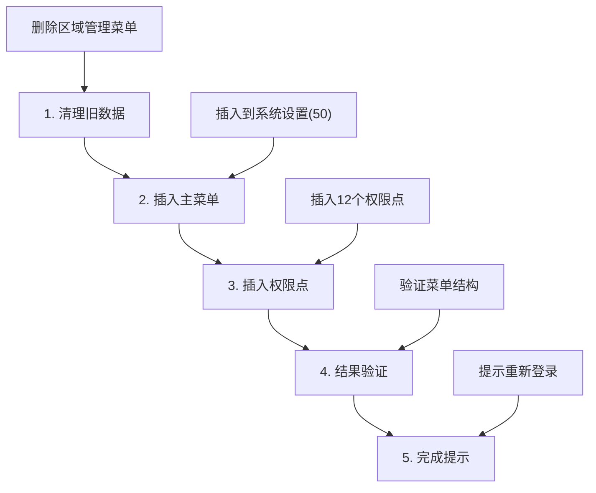
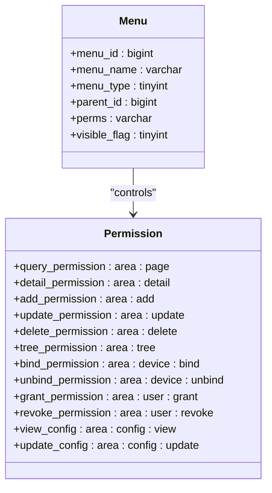
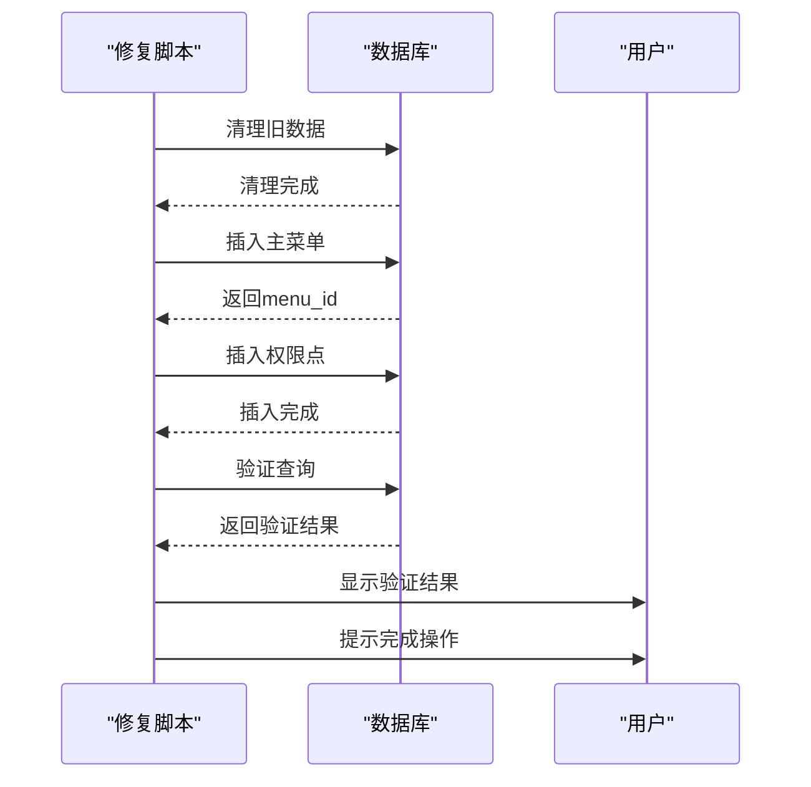

# 最终版修复脚本详细文档

<cite>
**本文档引用的文件**
- [fix_area_menu_final.sql](file://数据库SQL脚本/mysql/fix_area_menu_final.sql)
- [fix_area_menu.sql](file://数据库SQL脚本/mysql/fix_area_menu.sql)
- [fix_area_menu_v2.sql](file://数据库SQL脚本/mysql/fix_area_menu_v2.sql)
- [smart_area.sql](file://数据库SQL脚本/mysql/smart_area.sql)
- [check_menu.sql](file://check_menu.sql)
- [check_parent_menu.sql](file://check_parent_menu.sql)
- [query_menu_structure.sql](file://query_menu_structure.sql)
- [区域管理菜单问题修复说明.md](file://区域管理菜单问题修复说明.md)
- [README.md](file://README.md)
</cite>

## 目录
1. [概述](#概述)
2. [项目背景](#项目背景)
3. [问题分析](#问题分析)
4. [最终版脚本详解](#最终版脚本详解)
5. [脚本架构设计](#脚本架构设计)
6. [核心功能实现](#核心功能实现)
7. [验证机制](#验证机制)
8. [最佳实践](#最佳实践)
9. [故障排除](#故障排除)
10. [总结](#总结)

## 概述

最终版修复脚本（`fix_area_menu_final.sql`）是SmartAdmin区域管理模块菜单修复的完整解决方案，专门针对区域管理菜单无法显示的问题进行全面修复。该脚本采用模块化设计，包含完整的验证机制和分步骤执行流程，确保数据一致性和系统稳定性。

## 项目背景

SmartAdmin是一个基于SpringBoot3+Vue3的企业级快速开发平台，支持多种数据库和前端技术栈。区域管理模块作为系统的重要组成部分，负责统一的区域层级管理、设备分组和人员区域归属管理。

### 技术架构特点

- **前后端分离**：前端使用Vue3+TypeScript，后端使用Java17+SpringBoot3
- **多数据库支持**：支持MySQL、PostgreSQL及国产数据库
- **安全合规**：满足国家三级等保要求，具备完善的权限控制体系
- **菜单管理**：基于角色的权限控制，支持动态菜单加载

**章节来源**
- [README.md](file://README.md#L1-L84)

## 问题分析

### 根本原因

区域管理菜单无法显示的根本原因是前端路由处理机制与数据库配置的不匹配：

1. **Component路径配置错误**：
   - 错误配置：`component = 'views/system/area/index.vue'`
   - 正确配置：`component = 'system/area/index.vue'`

2. **技术原理**：
   - 前端路由处理逻辑会自动拼接路径
   - 数据库中只需存储相对于`views`目录的相对路径

3. **SQL子查询问题**：
   - 嵌套子查询在某些MySQL版本中可能失败
   - 改进为使用变量获取父菜单ID的方式

**章节来源**
- [区域管理菜单问题修复说明.md](file://区域管理菜单问题修复说明.md#L1-L165)

## 最终版脚本详解

### 脚本结构概览

最终版脚本采用五步执行流程，每一步都有明确的目标和验证机制：



**图表来源**
- [fix_area_menu_final.sql](file://数据库SQL脚本/mysql/fix_area_menu_final.sql#L1-L90)

### 第一步：数据清理

脚本首先清理可能存在的旧菜单数据，确保修复过程的纯净性：

- 删除已存在的区域管理菜单及其子菜单
- 使用`deleted_flag = 0`过滤条件确保只处理未删除的记录
- 通过变量存储菜单ID以便后续使用

### 第二步：主菜单插入

将区域管理主菜单精确插入到"系统设置"菜单下（menu_id=50）：

| 字段 | 值 | 说明 |
|------|-----|------|
| menu_name | 区域管理 | 菜单显示名称 |
| menu_type | 1 | 菜单类型：1=菜单 |
| parent_id | 50 | 父菜单ID：系统设置 |
| sort | 6 | 排序位置 |
| path | area | 路由路径 |
| component | system/area/index.vue | 组件路径 |
| perms | area:page | 权限标识 |
| icon | AreaChartOutlined | 图标 |

### 第三步：权限点创建

插入12个细粒度的权限点，覆盖区域管理的所有功能：

| 权限点名称 | 权限标识 | 功能描述 |
|------------|----------|----------|
| 查询区域 | area:page | 查看区域列表 |
| 区域详情 | area:detail | 查看区域详细信息 |
| 新增区域 | area:add | 创建新区域 |
| 修改区域 | area:update | 编辑区域信息 |
| 删除区域 | area:delete | 删除区域 |
| 区域树 | area:tree | 查看区域树形结构 |
| 绑定设备 | area:device:bind | 将设备绑定到区域 |
| 解绑设备 | area:device:unbind | 从区域解绑设备 |
| 授予权限 | area:user:grant | 授予用户区域访问权限 |
| 撤销权限 | area:user:revoke | 撤销用户区域权限 |
| 查看配置 | area:config:view | 查看区域配置 |
| 更新配置 | area:config:update | 修改区域配置 |

### 第四步：验证机制

脚本内置完整的验证查询，确保修复结果符合预期：

```sql
SELECT
    m.menu_id,
    m.menu_name,
    m.menu_type AS 'type(1=菜单,3=权限)',
    m.parent_id,
    p.menu_name AS parent_name,
    m.sort,
    m.path,
    m.component,
    m.perms,
    m.visible_flag AS visible,
    m.disabled_flag AS disabled
FROM t_sys_menu m
LEFT JOIN t_sys_menu p ON m.parent_id = p.menu_id
WHERE (m.menu_name = '区域管理' OR m.parent_id = @new_area_menu_id)
AND m.deleted_flag = 0
ORDER BY m.parent_id, m.sort;
```

### 第五步：完成提示

提供清晰的操作指导：

- 提示用户重新登录系统
- 说明在"系统设置"菜单下查看"区域管理"
- 强调清除浏览器缓存的重要性

**章节来源**
- [fix_area_menu_final.sql](file://数据库SQL脚本/mysql/fix_area_menu_final.sql#L1-L90)

## 脚本架构设计

### 模块化设计原则

最终版脚本遵循以下设计原则：

1. **单一职责**：每个步骤专注于特定任务
2. **幂等性**：多次执行不会产生副作用
3. **可验证性**：每步都有明确的验证机制
4. **可维护性**：清晰的注释和格式化

### SQL语句优化

相比早期版本，最终版在以下方面进行了显著优化：

1. **变量使用**：避免复杂的嵌套子查询
2. **注释规范**：详细的步骤说明和字段解释
3. **格式化标准**：统一的SQL语法风格
4. **错误处理**：内置的验证和提示机制

### 版本对比分析

| 版本 | 主要改进 | 适用场景 |
|------|----------|----------|
| 初始版 | 基础修复功能 | 简单部署场景 |
| V2版 | 解决排序问题 | 多父菜单场景 |
| 最终版 | 完整验证机制 | 生产环境部署 |

**章节来源**
- [fix_area_menu.sql](file://数据库SQL脚本/mysql/fix_area_menu.sql#L1-L59)
- [fix_area_menu_v2.sql](file://数据库SQL脚本/mysql/fix_area_menu_v2.sql#L1-L78)

## 核心功能实现

### 数据一致性保障

脚本通过以下机制确保数据一致性：

1. **事务处理**：虽然SQL脚本本身不支持事务，但分步骤执行降低了风险
2. **唯一约束**：利用数据库的唯一约束防止重复数据
3. **软删除**：使用`deleted_flag`字段标记删除而非物理删除
4. **索引优化**：合理使用索引提高查询性能

### 权限控制机制

区域管理模块实现了细粒度的权限控制：



**图表来源**
- [fix_area_menu_final.sql](file://数据库SQL脚本/mysql/fix_area_menu_final.sql#L44-L61)

### 菜单层级结构

区域管理菜单采用标准的三层结构：

1. **一级菜单**：系统设置（menu_id=50）
2. **二级菜单**：区域管理
3. **三级菜单**：权限点（功能按钮）

**章节来源**
- [smart_area.sql](file://数据库SQL脚本/mysql/smart_area.sql#L160-L193)

## 验证机制

### 分步验证流程

脚本实现了完整的验证机制，确保每个步骤都按预期执行：



**图表来源**
- [fix_area_menu_final.sql](file://数据库SQL脚本/mysql/fix_area_menu_final.sql#L65-L89)

### 验证查询详解

脚本包含多个验证查询，分别检查不同方面的数据完整性：

1. **菜单结构验证**：检查父子关系和排序
2. **权限点验证**：确认所有权限点都正确插入
3. **路径配置验证**：验证component路径格式正确

### 结果反馈机制

每个步骤完成后都会返回明确的结果信息：

- 成功消息：确认操作已完成
- 错误消息：指出具体问题
- 提示信息：指导下一步操作

**章节来源**
- [check_menu.sql](file://check_menu.sql#L1-L31)
- [check_parent_menu.sql](file://check_parent_menu.sql#L1-L40)

## 最佳实践

### 生产环境执行指南

1. **前置准备**：
   - 备份数据库
   - 确认当前菜单配置
   - 准备回滚方案

2. **执行步骤**：
   ```bash
   # 方法1：命令行执行
   mysql -h hostname -P port -u username database < fix_area_menu_final.sql
   
   # 方法2：数据库工具执行
   # 使用Navicat、DBeaver等工具打开并执行
   ```

3. **后置验证**：
   - 检查数据库中的菜单配置
   - 重新登录系统验证菜单显示
   - 测试各项权限功能

### 风险控制措施

1. **数据备份**：执行前备份`t_sys_menu`表
2. **逐步验证**：每步执行后立即验证结果
3. **权限检查**：确认当前用户具有执行权限
4. **监控告警**：执行过程中监控数据库性能

### 性能优化建议

1. **索引优化**：确保`menu_name`、`parent_id`字段有适当索引
2. **批量操作**：对于大规模数据，考虑分批处理
3. **连接池配置**：优化数据库连接池参数
4. **执行计划**：分析SQL执行计划，优化复杂查询

**章节来源**
- [区域管理菜单问题修复说明.md](file://区域管理菜单问题修复说明.md#L65-L165)

## 故障排除

### 常见问题及解决方案

| 问题类型 | 症状 | 解决方案 |
|----------|------|----------|
| 菜单不显示 | 前端看不到区域管理菜单 | 重新登录，清除缓存 |
| 权限异常 | 无法访问某些功能 | 检查权限点配置 |
| 数据不一致 | 菜单结构混乱 | 执行完整重置脚本 |
| 执行失败 | SQL语法错误 | 检查MySQL版本兼容性 |

### 调试技巧

1. **分步调试**：单独执行每个步骤，定位问题所在
2. **日志分析**：查看数据库执行日志
3. **手动验证**：使用验证查询检查中间状态
4. **版本对比**：比较不同版本的差异

### 回滚方案

如果修复后出现问题，可以执行以下回滚步骤：

1. **恢复备份**：从备份中恢复`t_sys_menu`表
2. **重新部署**：重新执行完整的部署脚本
3. **手动修复**：根据备份数据手动恢复菜单配置

**章节来源**
- [query_menu_structure.sql](file://query_menu_structure.sql#L1-L42)

## 总结

最终版修复脚本代表了SmartAdmin区域管理模块菜单修复的成熟解决方案。它不仅解决了区域管理菜单无法显示的根本问题，还通过以下特性提升了整体质量：

### 核心优势

1. **稳定性**：采用分步骤执行和完整验证机制
2. **一致性**：确保菜单结构与权限配置的一致性
3. **可维护性**：清晰的注释和标准化的SQL格式
4. **安全性**：内置的数据清理和验证机制

### 技术价值

- **最佳实践**：展示了企业级应用中菜单管理的最佳实践
- **设计模式**：体现了模块化设计和验证机制的设计思想
- **质量保证**：通过完整的测试和验证流程确保质量

### 应用意义

该脚本的成功实施证明了SmartAdmin框架在处理复杂业务场景时的强大能力，为类似问题的解决提供了可借鉴的模板和方法论。

通过最终版修复脚本的实施，区域管理模块能够稳定可靠地服务于企业的区域管理需求，为企业数字化转型提供坚实的技术支撑。