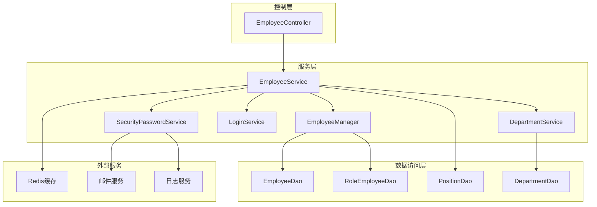
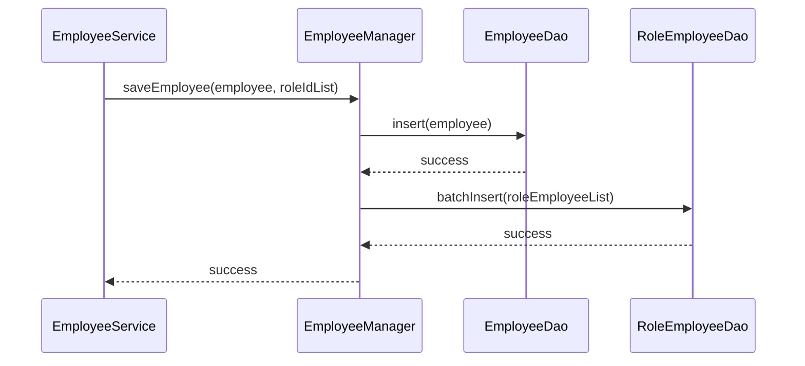
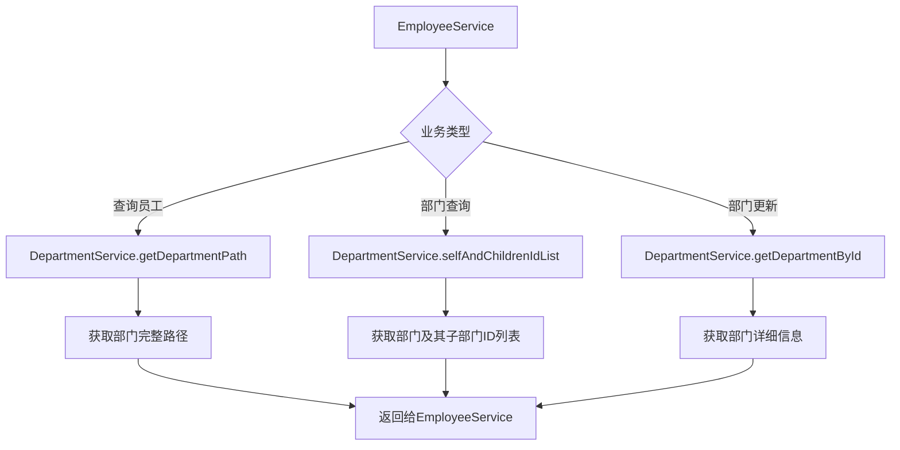
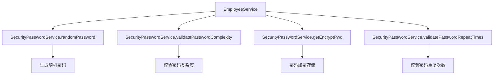
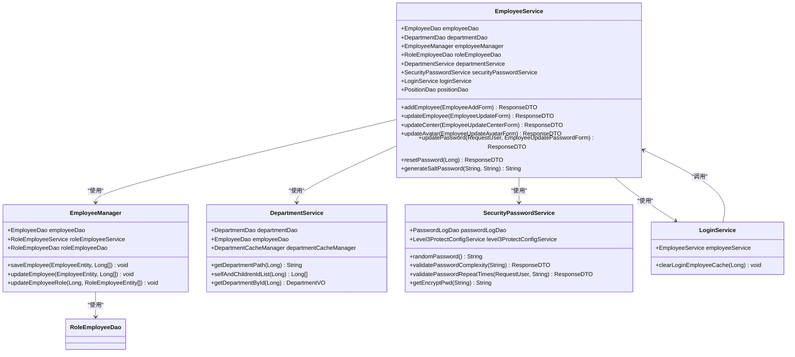
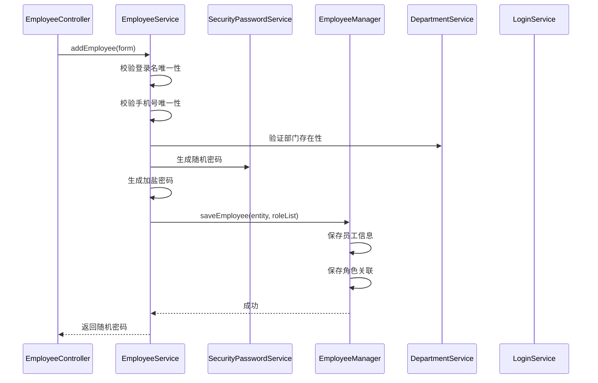
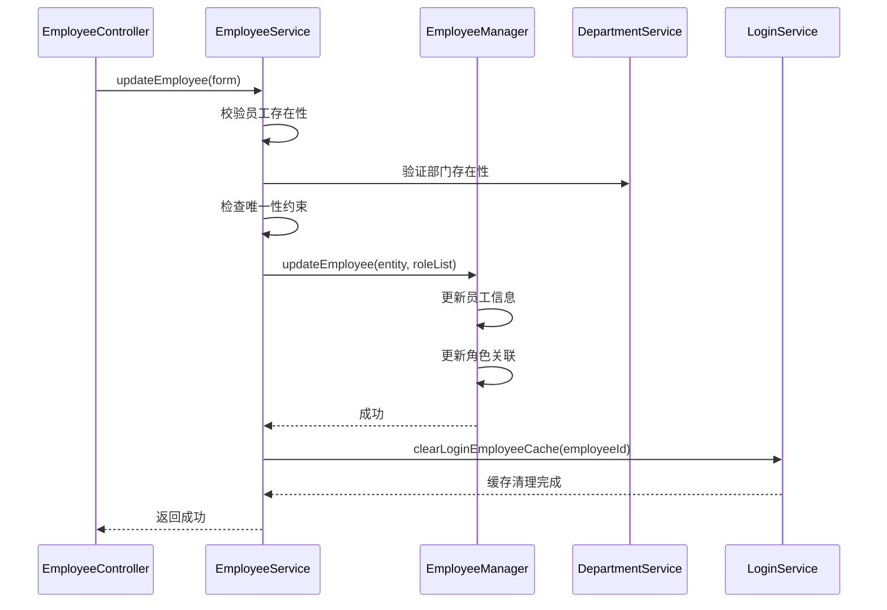
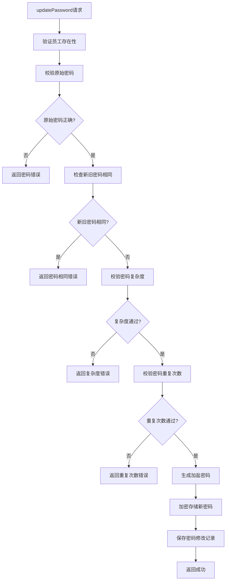
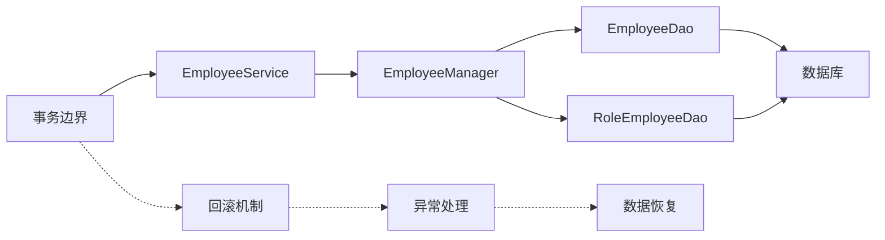
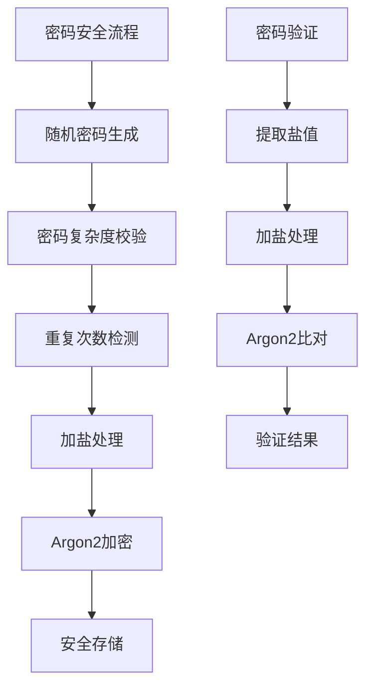

# 服务协调

<cite>
**本文档引用的文件**
- [EmployeeService.java](file://smart-admin-api-java17-springboot3/sa-admin/src/main/java/net/lab1024/sa/admin/module/system/employee/service/EmployeeService.java)
- [EmployeeManager.java](file://smart-admin-api-java17-springboot3/sa-admin/src/main/java/net/lab1024/sa/admin/module/system/employee/manager/EmployeeManager.java)
- [DepartmentService.java](file://smart-admin-api-java17-springboot3/sa-admin/src/main/java/net/lab1024/sa/admin/module/system/department/service/DepartmentService.java)
- [LoginService.java](file://smart-admin-api-java17-springboot3/sa-admin/src/main/java/net/lab1024/sa/admin/module/system/login/service/LoginService.java)
- [SecurityPasswordService.java](file://smart-admin-api-java17-springboot3/sa-base/src/main/java/net/lab1024/sa/base/module/support/securityprotect/service/SecurityPasswordService.java)
- [EmployeeDao.java](file://smart-admin-api-java17-springboot3/sa-admin/src/main/java/net/lab1024/sa/admin/module/system/employee/dao/EmployeeDao.java)
- [RoleEmployeeDao.java](file://smart-admin-api-java17-springboot3/sa-admin/src/main/java/net/lab1024/sa/admin/module/system/role/dao/RoleEmployeeDao.java)
- [PositionDao.java](file://smart-admin-api-java17-springboot3/sa-admin/src/main/java/net/lab1024/sa/admin/module/system/position/dao/PositionDao.java)
- [EmployeeController.java](file://smart-admin-api-java17-springboot3/sa-admin/src/main/java/net/lab1024/sa/admin/module/system/employee/controller/EmployeeController.java)
</cite>

## 目录
1. [概述](#概述)
2. [核心架构](#核心架构)
3. [EmployeeService核心功能](#employeeservice核心功能)
4. [服务协调机制](#服务协调机制)
5. [依赖关系分析](#依赖关系分析)
6. [业务流程详解](#业务流程详解)
7. [数据访问协作](#数据访问协作)
8. [安全机制集成](#安全机制集成)
9. [性能优化策略](#性能优化策略)
10. [故障排除指南](#故障排除指南)

## 概述

EmployeeService是智能管理系统中的核心业务协调服务，负责统一管理和协调员工相关的复杂业务逻辑。作为系统中多个服务的协调者，它不仅处理基础的CRUD操作，还深度集成了权限管理、安全管理、部门协作等多个子系统的功能。

该服务采用分层架构设计，通过依赖注入的方式协调EmployeeManager、DepartmentService、SecurityPasswordService、LoginService等关键组件，实现了业务逻辑的解耦和复用。

## 核心架构

**图表来源**
- [EmployeeService.java](file://smart-admin-api-java17-springboot3/sa-admin/src/main/java/net/lab1024/sa/admin/module/system/employee/service/EmployeeService.java#L47-L74)
- [EmployeeController.java](file://smart-admin-api-java17-springboot3/sa-admin/src/main/java/net/lab1024/sa/admin/module/system/employee/controller/EmployeeController.java#L33-L36)

## EmployeeService核心功能

### 主要职责

EmployeeService承担着以下核心职责：

1. **业务逻辑协调**：统一处理员工的新增、修改、删除等业务逻辑
2. **跨服务协作**：协调与其他业务服务的交互
3. **数据完整性保证**：确保业务数据的一致性和完整性
4. **安全策略执行**：集成密码安全、权限验证等安全机制

### 核心方法分类

| 方法类别 | 主要方法 | 功能描述 |
|---------|---------|---------|
| 员工管理 | addEmployee, updateEmployee | 处理员工基本信息的增删改 |
| 个人中心 | updateCenter, updateAvatar | 处理员工个人资料更新 |
| 权限管理 | updatePassword, resetPassword | 处理密码相关业务 |
| 状态管理 | updateDisableFlag, batchUpdateDeleteFlag | 处理员工状态变更 |
| 部门协作 | batchUpdateDepartment | 处理批量部门调整 |

**章节来源**
- [EmployeeService.java](file://smart-admin-api-java17-springboot3/sa-admin/src/main/java/net/lab1024/sa/admin/module/system/employee/service/EmployeeService.java#L122-L447)

## 服务协调机制

### EmployeeManager集成

EmployeeManager专门负责复杂的业务逻辑处理，EmployeeService通过委托模式将其集成到业务流程中。

**图表来源**
- [EmployeeService.java](file://smart-admin-api-java17-springboot3/sa-admin/src/main/java/net/lab1024/sa/admin/module/system/employee/service/EmployeeService.java#L122-L154)
- [EmployeeManager.java](file://smart-admin-api-java17-springboot3/sa-admin/src/main/java/net/lab1024/sa/admin/module/system/employee/manager/EmployeeManager.java#L43-L51)

### DepartmentService协作

DepartmentService提供部门层级路径查询和部门树形结构管理功能，EmployeeService在多个场景中调用这些功能。

**图表来源**
- [EmployeeService.java](file://smart-admin-api-java17-springboot3/sa-admin/src/main/java/net/lab1024/sa/admin/module/system/employee/service/EmployeeService.java#L87-L114)
- [DepartmentService.java](file://smart-admin-api-java17-springboot3/sa-admin/src/main/java/net/lab1024/sa/admin/module/system/department/service/DepartmentService.java#L140-L145)

### SecurityPasswordService集成

SecurityPasswordService提供密码安全相关的功能，包括密码生成、复杂度校验和加密存储。

**图表来源**
- [EmployeeService.java](file://smart-admin-api-java17-springboot3/sa-admin/src/main/java/net/lab1024/sa/admin/module/system/employee/service/EmployeeService.java#L145-L149)
- [SecurityPasswordService.java](file://smart-admin-api-java17-springboot3/sa-base/src/main/java/net/lab1024/sa/base/module/support/securityprotect/service/SecurityPasswordService.java#L95-L108)

## 依赖关系分析

### 服务依赖图

**图表来源**
- [EmployeeService.java](file://smart-admin-api-java17-springboot3/sa-admin/src/main/java/net/lab1024/sa/admin/module/system/employee/service/EmployeeService.java#L50-L74)
- [EmployeeManager.java](file://smart-admin-api-java17-springboot3/sa-admin/src/main/java/net/lab1024/sa/admin/module/system/employee/manager/EmployeeManager.java#L28-L38)

### 注入方式分析

EmployeeService采用Spring的@Resource注解进行依赖注入，体现了以下设计原则：

1. **构造函数注入**：主要依赖通过构造函数注入
2. **延迟加载**：LoginService使用@Lazy注解实现延迟加载
3. **循环依赖处理**：通过接口抽象避免循环依赖

**章节来源**
- [EmployeeService.java](file://smart-admin-api-java17-springboot3/sa-admin/src/main/java/net/lab1024/sa/admin/module/system/employee/service/EmployeeService.java#L50-L74)

## 业务流程详解

### 新增员工流程

**图表来源**
- [EmployeeService.java](file://smart-admin-api-java17-springboot3/sa-admin/src/main/java/net/lab1024/sa/admin/module/system/employee/service/EmployeeService.java#L122-L154)

### 更新员工流程

**图表来源**
- [EmployeeService.java](file://smart-admin-api-java17-springboot3/sa-admin/src/main/java/net/lab1024/sa/admin/module/system/employee/service/EmployeeService.java#L160-L191)

### 密码更新流程

**图表来源**
- [EmployeeService.java](file://smart-admin-api-java17-springboot3/sa-admin/src/main/java/net/lab1024/sa/admin/module/system/employee/service/EmployeeService.java#L340-L380)

## 数据访问协作

### DAO组件协作模式

EmployeeService与多个DAO组件协作，形成了清晰的数据访问层次：

| DAO组件 | 主要职责 | 协作方式 |
|---------|---------|---------|
| EmployeeDao | 员工基础数据操作 | 直接调用进行CRUD操作 |
| RoleEmployeeDao | 员工角色关联管理 | 协作处理角色分配 |
| PositionDao | 职位信息管理 | 提供职位名称映射 |
| DepartmentDao | 部门信息管理 | 提供部门层级查询 |

### 数据一致性保障

**图表来源**
- [EmployeeManager.java](file://smart-admin-api-java17-springboot3/sa-admin/src/main/java/net/lab1024/sa/admin/module/system/employee/manager/EmployeeManager.java#L43-L83)

**章节来源**
- [EmployeeDao.java](file://smart-admin-api-java17-springboot3/sa-admin/src/main/java/net/lab1024/sa/admin/module/system/employee/dao/EmployeeDao.java#L25-L111)
- [RoleEmployeeDao.java](file://smart-admin-api-java17-springboot3/sa-admin/src/main/java/net/lab1024/sa/admin/module/system/role/dao/RoleEmployeeDao.java#L28-L89)

## 安全机制集成

### 密码安全策略

EmployeeService深度集成了多层次的安全防护机制：

1. **随机密码生成**：使用SecurityPasswordService生成符合安全标准的随机密码
2. **密码复杂度校验**：强制执行密码强度要求
3. **密码重复检测**：防止用户重复使用历史密码
4. **加盐加密存储**：采用Argon2算法进行密码加密

### 安全流程图

**图表来源**
- [SecurityPasswordService.java](file://smart-admin-api-java17-springboot3/sa-base/src/main/java/net/lab1024/sa/base/module/support/securityprotect/service/SecurityPasswordService.java#L30-L108)
- [EmployeeService.java](file://smart-admin-api-java17-springboot3/sa-admin/src/main/java/net/lab1024/sa/admin/module/system/employee/service/EmployeeService.java#L438-L446)

**章节来源**
- [SecurityPasswordService.java](file://smart-admin-api-java17-springboot3/sa-base/src/main/java/net/lab1024/sa/base/module/support/securityprotect/service/SecurityPasswordService.java#L1-L157)

## 性能优化策略

### 缓存策略

EmployeeService通过多种方式实现性能优化：

1. **懒加载机制**：LoginService使用@Lazy注解延迟初始化
2. **批量操作**：支持批量更新部门、批量删除等操作
3. **数据预加载**：在查询员工时预加载相关角色和职位信息

### 性能监控点

| 监控指标 | 实现方式 | 优化策略 |
|---------|---------|---------|
| 缓存命中率 | Redis缓存统计 | 合理设置缓存过期时间 |
| 数据库查询效率 | SQL执行时间监控 | 添加索引，优化查询条件 |
| 事务执行时间 | 事务监控 | 减少事务范围，优化业务逻辑 |
| 并发处理能力 | 线程池监控 | 合理配置线程池参数 |

**章节来源**
- [EmployeeService.java](file://smart-admin-api-java17-springboot3/sa-admin/src/main/java/net/lab1024/sa/admin/module/system/employee/service/EmployeeService.java#L31-L32)

## 故障排除指南

### 常见问题及解决方案

#### 1. 员工新增失败

**问题现象**：新增员工时返回"登录名重复"错误

**排查步骤**：
1. 检查EmployeeDao.getByLoginName方法的查询逻辑
2. 验证数据库中是否存在重复的登录名
3. 确认deletedFlag字段的过滤逻辑

**解决方案**：
- 在调用addEmployee方法前增加唯一性检查
- 优化数据库索引以提高查询性能

#### 2. 密码更新失败

**问题现象**：密码更新时返回"原密码有误"错误

**排查步骤**：
1. 检查generateSaltPassword方法的加盐逻辑
2. 验证SecurityPasswordService.matchesPwd方法的密码比对
3. 确认密码加密存储过程

**解决方案**：
- 增加密码格式化处理
- 提供更详细的错误信息

#### 3. 缓存同步问题

**问题现象**：更新员工信息后，缓存未及时刷新

**排查步骤**：
1. 检查LoginService.clearLoginEmployeeCache方法的调用时机
2. 验证缓存键的生成规则
3. 确认缓存过期策略

**解决方案**：
- 在业务方法中显式调用缓存清理
- 实现分布式缓存同步机制

**章节来源**
- [EmployeeService.java](file://smart-admin-api-java17-springboot3/sa-admin/src/main/java/net/lab1024/sa/admin/module/system/employee/service/EmployeeService.java#L227-L244)
- [EmployeeService.java](file://smart-admin-api-java17-springboot3/sa-admin/src/main/java/net/lab1024/sa/admin/module/system/employee/service/EmployeeService.java#L348-L351)

## 总结

EmployeeService作为智能管理系统的核心协调服务，展现了优秀的架构设计和业务整合能力。通过合理的分层设计、清晰的职责划分和完善的依赖管理，它成功地将复杂的业务逻辑进行了有效组织和协调。

该服务的主要优势包括：

1. **高度内聚**：将员工相关的所有业务逻辑集中在单一服务中
2. **松耦合**：通过接口抽象实现各组件间的解耦
3. **可扩展性**：良好的架构设计便于功能扩展和维护
4. **安全性**：深度集成多层次的安全防护机制
5. **性能优化**：通过缓存、批量操作等手段提升系统性能

这种设计模式为构建大型企业级应用提供了宝贵的参考价值，展示了如何通过服务协调来实现复杂业务场景的有效管理。