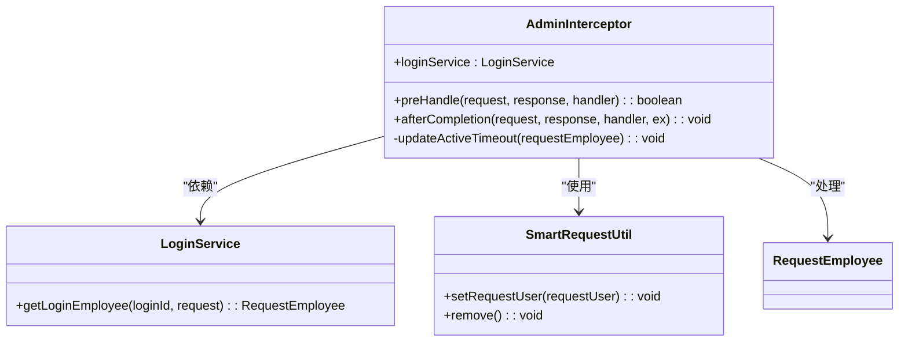
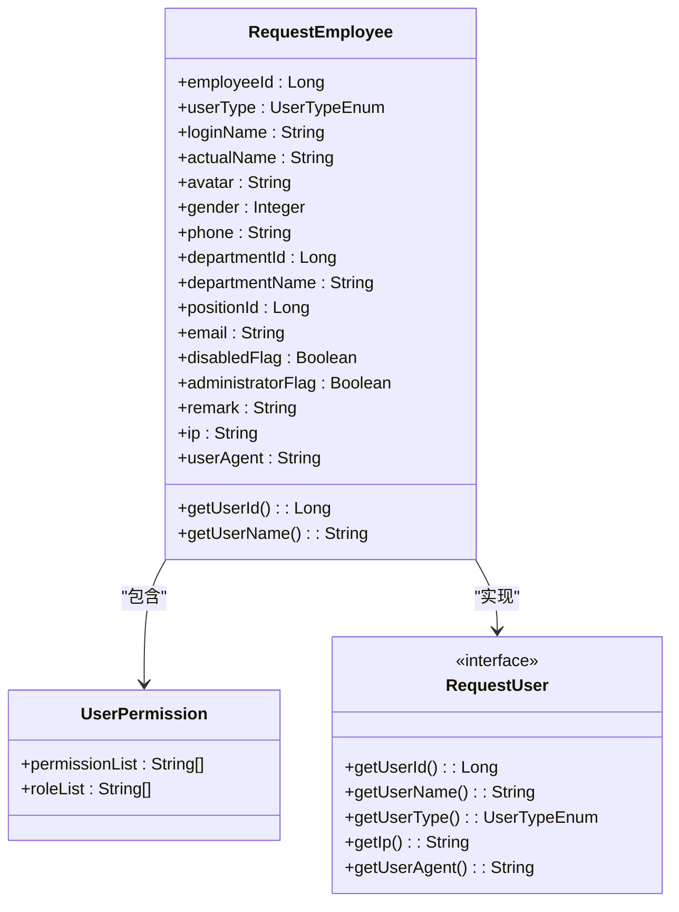
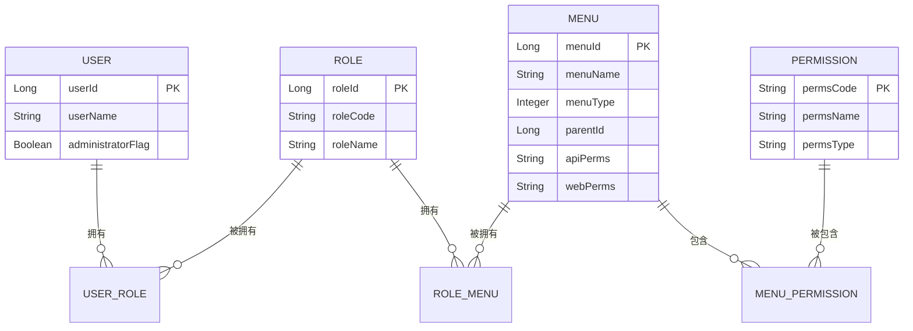
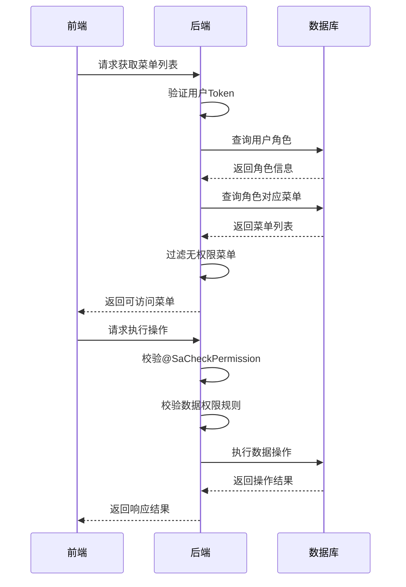
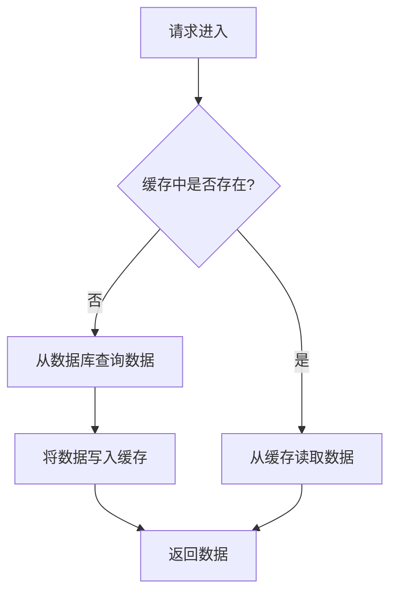
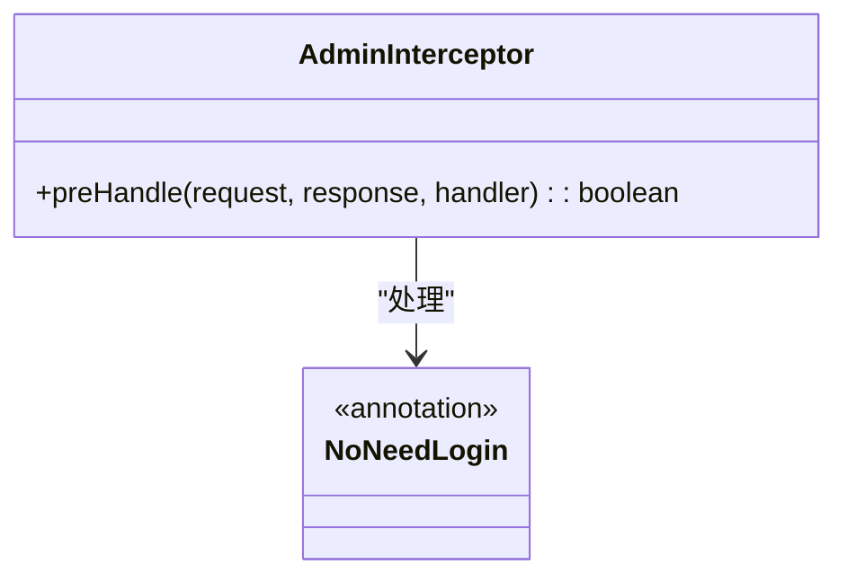
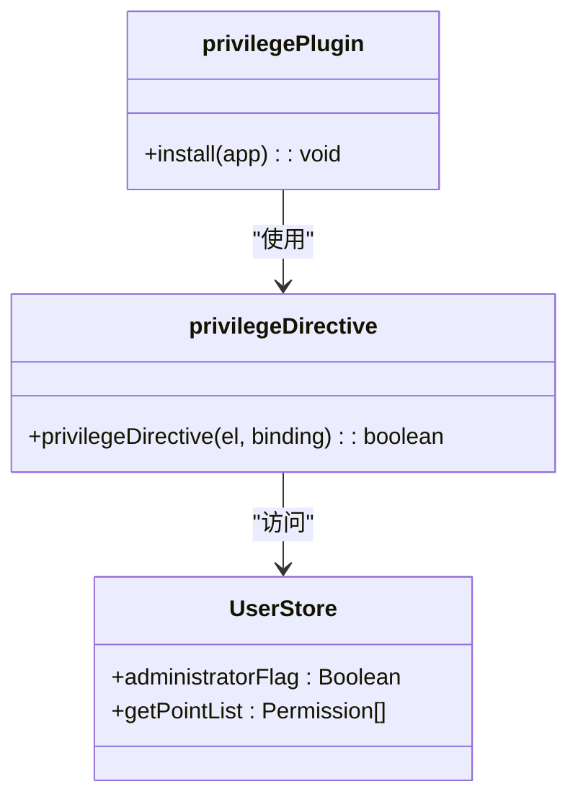
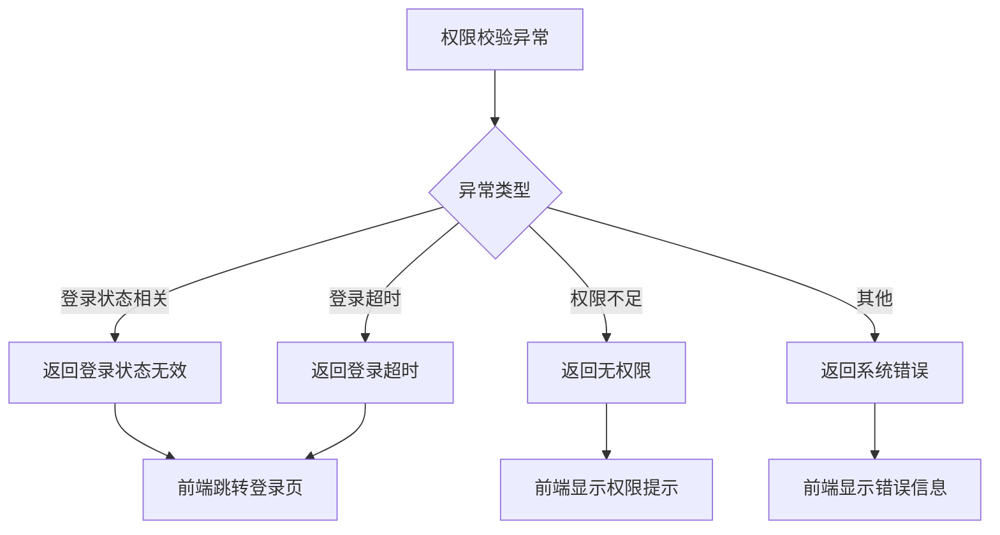

# 权限校验

<cite>
**本文档引用的文件**  
- [AdminInterceptor.java](file://smart-admin-api-java17-springboot3\sa-admin\src\main\java\net\lab1024\sa\admin\interceptor\AdminInterceptor.java)
- [LoginService.java](file://smart-admin-api-java17-springboot3\sa-admin\src\main\java\net\lab1024\sa\admin\module\system\login\service\LoginService.java)
- [LoginManager.java](file://smart-admin-api-java17-springboot3\sa-admin\src\main\java\net\lab1024\sa\admin\module\system\login\manager\LoginManager.java)
- [RequestEmployee.java](file://smart-admin-api-java17-springboot3\sa-admin\src\main\java\net\lab1024\sa\admin\module\system\login\domain\RequestEmployee.java)
- [UserPermission.java](file://smart-admin-api-java17-springboot3\sa-base\src\main\java\net\lab1024\sa\base\common\domain\UserPermission.java)
- [privilege-plugin.js](file://smart-admin-web-javascript\src\plugins\privilege-plugin.js)
- [privilege.js](file://smart-admin-web-javascript\src\directives\privilege.js)
- [NoNeedLogin.java](file://smart-admin-api-java17-springboot3\sa-base\src\main\java\net\lab1024\sa\base\common\annoation\NoNeedLogin.java)
</cite>

## 目录
1. [权限校验机制概述](#权限校验机制概述)
2. [AdminInterceptor拦截器实现](#admininterceptor拦截器实现)
3. [RequestUser对象与权限传递](#requestuser对象与权限传递)
4. [基于角色的访问控制(RBAC)模型](#基于角色的访问控制rbac模型)
5. [菜单权限与数据权限校验](#菜单权限与数据权限校验)
6. [权限校验性能优化策略](#权限校验性能优化策略)
7. [自定义权限校验扩展方法](#自定义权限校验扩展方法)
8. [权限校验失败处理流程](#权限校验失败处理流程)

## 权限校验机制概述

本系统采用基于sa-token框架的权限校验机制，通过拦截器模式实现对所有请求的统一权限控制。系统实现了完整的RBAC（基于角色的访问控制）模型，支持细粒度的菜单权限和功能点权限控制。权限校验流程包括登录状态验证、角色校验和具体权限校验三个阶段，确保系统安全性和访问控制的灵活性。

**权限校验流程图**
```mermaid
flowchart TD
A[请求进入] --> B{是否为OPTIONS请求?}
B --> |是| C[直接返回204状态码]
B --> |否| D{是否为HandlerMethod?}
D --> |否| E[放行]
D --> |是| F[获取Token并解析用户信息]
F --> G{是否标注@NoNeedLogin?}
G --> |是| H[更新活跃时间并放行]
G --> |否| I{用户是否有效?}
I --> |否| J[返回登录状态无效]
I --> |是| K[更新活跃时间]
K --> L{是否标注@SaIgnore?}
L --> |是| M[放行]
L --> |否| N{是否为超级管理员?}
N --> |是| O[放行]
N --> |否| P[执行sa-token权限校验]
P --> Q{校验通过?}
Q --> |是| R[放行]
Q --> |否| S[返回相应错误码]
```

**Diagram sources**
- [AdminInterceptor.java](file://smart-admin-api-java17-springboot3\sa-admin\src\main\java\net\lab1024\sa\admin\interceptor\AdminInterceptor.java#L45-L121)

## AdminInterceptor拦截器实现

AdminInterceptor是系统权限校验的核心组件，作为Spring MVC拦截器注册到系统中，负责拦截所有请求并进行权限验证。该拦截器通过sa-token框架提供的功能实现完整的权限控制流程。

拦截器的主要功能包括：
- 处理OPTIONS预检请求，直接返回204状态码
- 从Token中解析用户登录信息
- 验证用户登录状态的有效性
- 执行基于角色和权限的访问控制
- 处理权限校验异常情况



**Diagram sources**
- [AdminInterceptor.java](file://smart-admin-api-java17-springboot3\sa-admin\src\main\java\net\lab1024\sa\admin\interceptor\AdminInterceptor.java#L39-L141)
- [LoginService.java](file://smart-admin-api-java17-springboot3\sa-admin\src\main\java\net\lab1024\sa\admin\module\system\login\service\LoginService.java#L70-L481)

**Section sources**
- [AdminInterceptor.java](file://smart-admin-api-java17-springboot3\sa-admin\src\main\java\net\lab1024\sa\admin\interceptor\AdminInterceptor.java#L39-L141)

## RequestUser对象与权限传递

RequestUser接口定义了请求用户的基本信息结构，是权限校验过程中用户信息传递的核心载体。系统通过RequestEmployee类实现该接口，封装了员工的详细信息和权限数据。

RequestUser对象在权限校验中的作用包括：
- 存储当前请求的用户身份信息
- 传递用户的角色和权限列表
- 提供用户的基本属性（如ID、名称、IP地址等）
- 作为上下文信息在系统各层间传递



**Diagram sources**
- [RequestEmployee.java](file://smart-admin-api-java17-springboot3\sa-admin\src\main\java\net\lab1024\sa\admin\module\system\login\domain\RequestEmployee.java#L22-L82)
- [UserPermission.java](file://smart-admin-api-java17-springboot3\sa-base\src\main\java\net\lab1024\sa\base\common\domain\UserPermission.java#L19-L32)

**Section sources**
- [RequestEmployee.java](file://smart-admin-api-java17-springboot3\sa-admin\src\main\java\net\lab1024\sa\admin\module\system\login\domain\RequestEmployee.java#L22-L82)
- [UserPermission.java](file://smart-admin-api-java17-springboot3\sa-base\src\main\java\net\lab1024\sa\base\common\domain\UserPermission.java#L19-L32)

## 基于角色的访问控制(RBAC)模型

系统实现了标准的RBAC（基于角色的访问控制）模型，通过角色-权限-用户的三层结构实现灵活的权限管理。该模型支持多角色分配、权限继承和细粒度的访问控制。

RBAC模型的核心组件包括：
- **用户(User)**：系统使用者，可以分配一个或多个角色
- **角色(Role)**：权限的集合，代表一类用户的访问权限
- **权限(Permission)**：最小的访问控制单元，对应具体的操作或资源
- **菜单(Menu)**：系统功能的组织方式，与权限关联



**Diagram sources**
- [LoginManager.java](file://smart-admin-api-java17-springboot3\sa-admin\src\main\java\net\lab1024\sa\admin\module\system\login\manager\LoginManager.java#L122-L153)
- [LoginService.java](file://smart-admin-api-java17-springboot3\sa-admin\src\main\java\net\lab1024\sa\admin\module\system\login\service\LoginService.java#L360-L379)

## 菜单权限与数据权限校验

系统实现了多层次的权限校验机制，包括菜单权限校验和数据权限校验。菜单权限控制用户可见的功能菜单，数据权限控制用户可访问的数据范围。

### 菜单权限校验

菜单权限校验通过以下流程实现：
1. 用户登录时，系统根据用户角色加载对应的菜单列表
2. 前端根据菜单列表动态生成导航菜单
3. 后端通过@SaCheckPermission注解校验具体操作权限

### 数据权限校验

数据权限校验主要通过以下方式实现：
- 部门数据隔离：用户只能访问所属部门的数据
- 自定义数据规则：通过数据权限配置定义复杂的访问规则
- 操作权限控制：不同角色对同一数据的增删改查权限不同



**Diagram sources**
- [LoginManager.java](file://smart-admin-api-java17-springboot3\sa-admin\src\main\java\net\lab1024\sa\admin\module\system\login\manager\LoginManager.java#L130-L150)
- [RoleMenuService.java](file://smart-admin-api-java17-springboot3\sa-admin\src\main\java\net\lab1024\sa\admin\module\system\role\service\RoleMenuService.java)

## 权限校验性能优化策略

为提高权限校验的性能，系统采用了多种优化策略，包括缓存机制、懒加载和预加载等技术。

### 缓存机制

系统使用Redis作为缓存存储，对频繁访问的权限数据进行缓存：
- 用户登录信息缓存
- 用户权限列表缓存
- 菜单树结构缓存



### 懒加载与预加载

系统采用懒加载策略，在用户登录时只加载必要的基本信息，权限数据在首次需要时才加载。同时，系统也支持预加载关键数据，减少后续请求的延迟。

**性能优化策略表**
| 优化策略 | 实现方式 | 缓存键 | 过期时间 |
|---------|---------|-------|---------|
| 用户登录信息缓存 | @Cacheable注解 | login:request_employee:{employeeId} | 30分钟 |
| 用户权限缓存 | @Cacheable注解 | login:user_permission:{employeeId} | 30分钟 |
| 菜单列表缓存 | @Cacheable注解 | role:menu_list:{roleId} | 30分钟 |

**Diagram sources**
- [LoginManager.java](file://smart-admin-api-java17-springboot3\sa-admin\src\main\java\net\lab1024\sa\admin\module\system\login\manager\LoginManager.java#L66-L174)
- [AdminCacheConst.java](file://smart-admin-api-java17-springboot3\sa-admin\src\main\java\net\lab1024\sa\admin\constant\AdminCacheConst.java)

**Section sources**
- [LoginManager.java](file://smart-admin-api-java17-springboot3\sa-admin\src\main\java\net\lab1024\sa\admin\module\system\login\manager\LoginManager.java#L66-L174)

## 自定义权限校验扩展方法

系统提供了灵活的权限校验扩展机制，支持自定义权限校验逻辑和注解。

### 自定义注解

系统定义了NoNeedLogin注解，用于标记不需要登录即可访问的接口：



### 前端权限指令

系统提供了前端权限控制指令，用于动态控制UI元素的显示：

```javascript
// 权限指令实现
function privilegeDirective(el, binding) {
    // 超级管理员直接放行
    if (useUserStore().administratorFlag) {
        return true;
    }
    // 检查用户是否有对应权限
    let userPointsList = useUserStore().getPointList;
    if (!userPointsList) {
        return false;
    }
    // 无权限则删除DOM节点
    if (!_.some(userPointsList, ['webPerms', binding.value])) {
        el.parentNode.removeChild(el);
    }
    return true;
}
```

**前端权限插件**


**Diagram sources**
- [NoNeedLogin.java](file://smart-admin-api-java17-springboot3\sa-base\src\main\java\net\lab1024\sa\base\common\annoation\NoNeedLogin.java#L19)
- [privilege-plugin.js](file://smart-admin-web-javascript\src\plugins\privilege-plugin.js)
- [privilege.js](file://smart-admin-web-javascript\src\directives\privilege.js)

**Section sources**
- [NoNeedLogin.java](file://smart-admin-api-java17-springboot3\sa-base\src\main\java\net\lab1024\sa\base\common\annoation\NoNeedLogin.java#L19)
- [privilege-plugin.js](file://smart-admin-web-javascript\src\plugins\privilege-plugin.js)
- [privilege.js](file://smart-admin-web-javascript\src\directives\privilege.js)

## 权限校验失败处理流程

当权限校验失败时，系统会根据不同的错误类型返回相应的错误响应，确保客户端能够正确处理权限问题。

### 错误类型与响应

| 错误类型 | 错误码 | 响应消息 | 处理方式 |
|---------|-------|---------|---------|
| 登录状态无效 | 11011-11015 | 登录状态无效 | 跳转到登录页 |
| 权限不足 | 11041, 11051 | 无权限访问 | 显示权限不足提示 |
| 登录超时 | 11016 | 登录已超时 | 跳转到登录页 |
| 参数错误 | 其他 | 参数错误 | 显示错误提示 |

### 错误处理流程



**错误处理代码片段**
```java
catch (SaTokenException e) {
    int code = e.getCode();
    if (code == 11041 || code == 11051) {
        SmartResponseUtil.write(response, ResponseDTO.error(UserErrorCode.NO_PERMISSION));
    } else if (code == 11016) {
        SmartResponseUtil.write(response, ResponseDTO.error(UserErrorCode.LOGIN_ACTIVE_TIMEOUT));
    } else if (code >= 11011 && code <= 11015) {
        SmartResponseUtil.write(response, ResponseDTO.error(UserErrorCode.LOGIN_STATE_INVALID));
    } else {
        SmartResponseUtil.write(response, ResponseDTO.error(UserErrorCode.PARAM_ERROR));
    }
    return false;
}
```

**Diagram sources**
- [AdminInterceptor.java](file://smart-admin-api-java17-springboot3\sa-admin\src\main\java\net\lab1024\sa\admin\interceptor\AdminInterceptor.java#L98-L113)

**Section sources**
- [AdminInterceptor.java](file://smart-admin-api-java17-springboot3\sa-admin\src\main\java\net\lab1024\sa\admin\interceptor\AdminInterceptor.java#L98-L113)
- [UserErrorCode.java](file://smart-admin-api-java17-springboot3\sa-base\src\main\java\net\lab1024\sa\base\common\code\UserErrorCode.java)