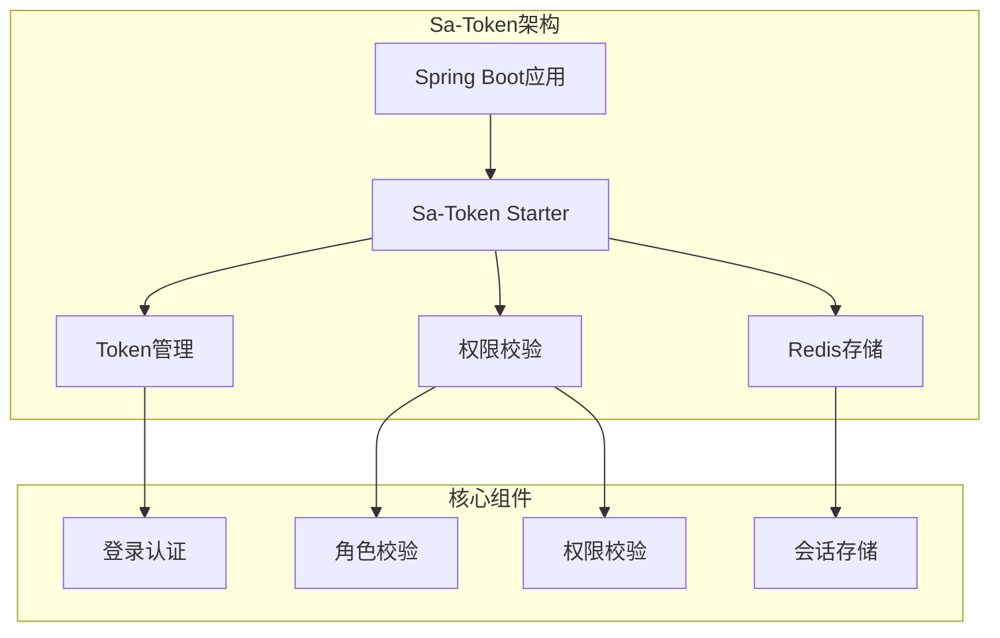
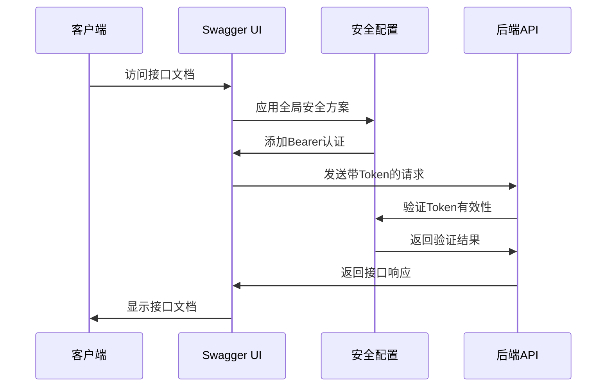
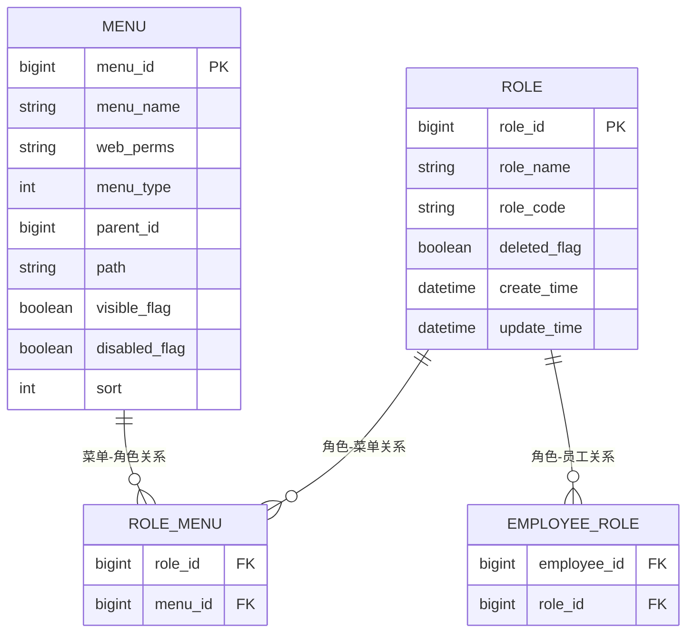
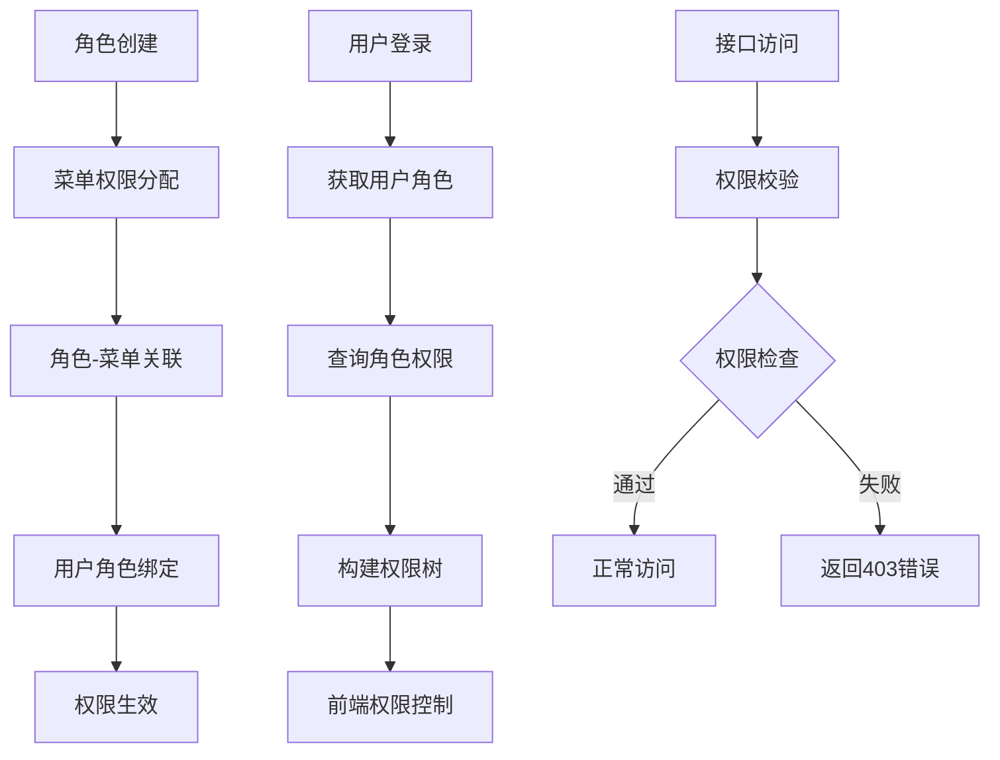
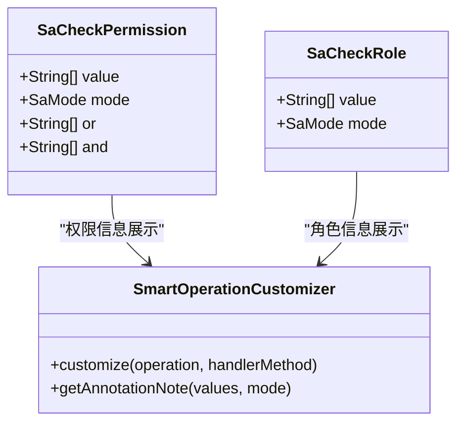
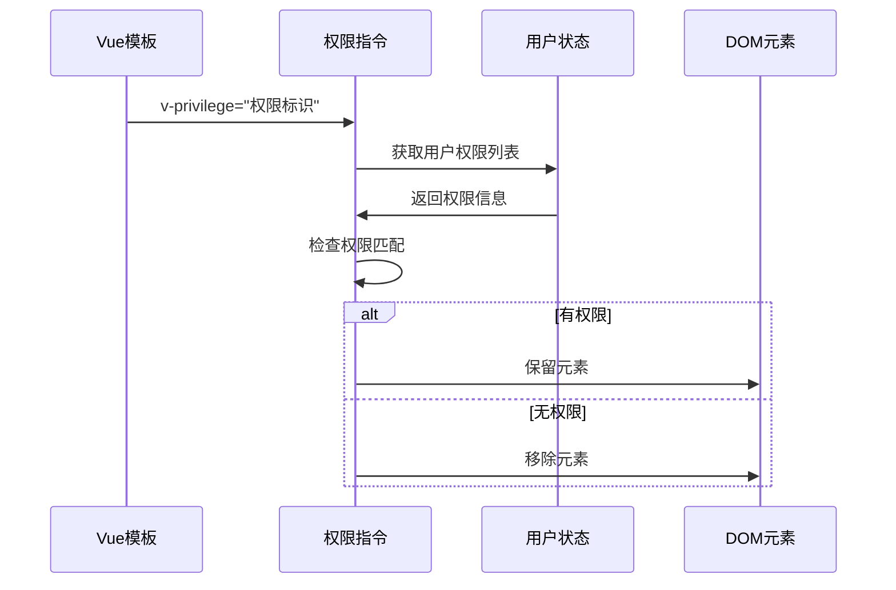
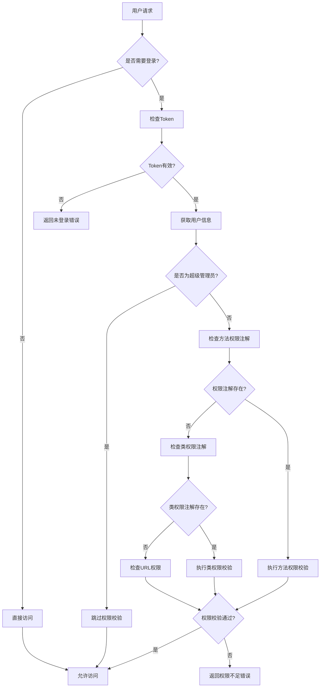
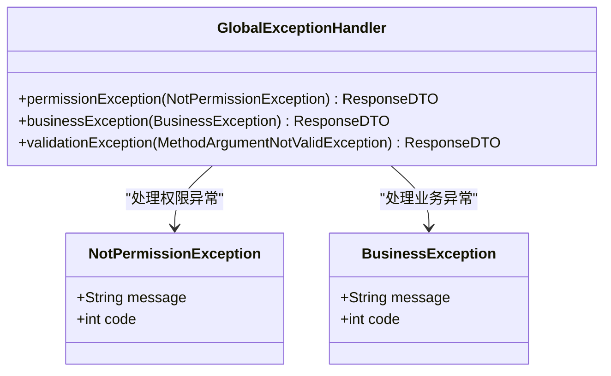

# 权限管理

<cite>
**本文档引用的文件**
- [AdminApplication.java](file://smart-admin-api-java17-springboot3/sa-admin/src/main/java/net/lab1024/sa/admin/AdminApplication.java)
- [SwaggerConfig.java](file://smart-admin-api-java17-springboot3/sa-base/src/main/java/net/lab1024/sa/base/config/SwaggerConfig.java)
- [RoleController.java](file://smart-admin-api-java17-springboot3/sa-admin/src/main/java/net/lab1024/sa/admin/module/system/role/controller/RoleController.java)
- [MenuController.java](file://smart-admin-api-java17-springboot3/sa-admin/src/main/java/net/lab1024/sa/admin/module/system/menu/controller/MenuController.java)
- [RoleMenuController.java](file://smart-admin-api-java17-springboot3/sa-admin/src/main/java/net/lab1024/sa/admin/module/system/role/controller/RoleMenuController.java)
- [RoleService.java](file://smart-admin-api-java17-springboot3/sa-admin/src/main/java/net/lab1024/sa/admin/module/system/role/service/RoleService.java)
- [MenuService.java](file://smart-admin-api-java17-springboot3/sa-admin/src/main/java/net/lab1024/sa/admin/module/system/menu/service/MenuService.java)
- [privilege.js](file://smart-admin-web-javascript/src/directives/privilege.js)
- [privilege-plugin.js](file://smart-admin-web-javascript/src/plugins/privilege-plugin.js)
- [user.js](file://smart-admin-web-javascript/src/store/modules/system/user.js)
- [GlobalExceptionHandler.java](file://smart-admin-api-java17-springboot3/sa-base/src/main/java/net/lab1024/sa/base/handler/GlobalExceptionHandler.java)
- [SmartOperationCustomizer.java](file://smart-admin-api-java17-springboot3/sa-base/src/main/java/net/lab1024/sa/base/common/swagger/SmartOperationCustomizer.java)
</cite>

## 目录
1. [概述](#概述)
2. [Sa-Token框架集成](#sa-token框架集成)
3. [Swagger全局安全配置](#swagger全局安全配置)
4. [角色-菜单权限模型](#角色-菜单权限模型)
5. [接口级别权限校验](#接口级别权限校验)
6. [前端权限控制](#前端权限控制)
7. [权限校验流程](#权限校验流程)
8. [权限配置示例](#权限配置示例)
9. [异常处理机制](#异常处理机制)
10. [最佳实践](#最佳实践)

## 概述

SmartAdmin采用基于Sa-Token框架的权限管理系统，实现了完整的角色-菜单权限模型。该系统支持后端接口级别的权限校验和前端UI元素的动态权限控制，确保系统的安全性和用户体验。

### 核心特性

- **基于Sa-Token的认证授权**：提供令牌管理和权限校验能力
- **角色-菜单权限模型**：支持灵活的角色权限分配和菜单权限管理
- **前后端一体化权限控制**：后端接口校验+前端UI动态控制
- **全局异常处理**：统一的权限异常处理机制
- **Swagger集成**：自动化的权限信息展示

## Sa-Token框架集成

### 框架配置

SmartAdmin通过Spring Boot Starter方式集成了Sa-Token框架，提供了完整的认证授权解决方案。



**图表来源**
- [AdminApplication.java](file://smart-admin-api-java17-springboot3/sa-admin/src/main/java/net/lab1024/sa/admin/AdminApplication.java#L24-L30)

### 认证流程

系统通过Sa-Token提供的注解和拦截器实现自动化的权限校验：

1. **登录认证**：用户凭据验证通过后生成访问令牌
2. **会话管理**：令牌存储在Redis中，支持分布式部署
3. **权限校验**：通过注解或编程方式实现权限控制

**章节来源**
- [AdminApplication.java](file://smart-admin-api-java17-springboot3/sa-admin/src/main/java/net/lab1024/sa/admin/AdminApplication.java#L1-L41)

## Swagger全局安全配置

### 安全方案配置

SwaggerConfig类负责配置全局的安全方案，确保所有接口都必须携带Bearer格式的Authorization头。



**图表来源**
- [SwaggerConfig.java](file://smart-admin-api-java17-springboot3/sa-base/src/main/java/net/lab1024/sa/base/config/SwaggerConfig.java#L78-L98)

### 配置细节

| 配置项 | 值 | 说明 |
|--------|-----|------|
| 安全方案名称 | TOKEN | 使用Bearer Token认证 |
| 认证方式 | APIKEY | 在HTTP头部传递Token |
| 位置 | HEADER | Token放置在Authorization头部 |
| 格式 | Bearer {token} | Token的标准格式 |

**章节来源**
- [SwaggerConfig.java](file://smart-admin-api-java17-springboot3/sa-base/src/main/java/net/lab1024/sa/base/config/SwaggerConfig.java#L1-L154)

## 角色-菜单权限模型

### 系统架构

SmartAdmin采用经典的基于角色的访问控制（RBAC）模型，结合菜单权限管理，实现细粒度的权限控制。



### 核心控制器

#### 角色管理控制器

RoleController提供了角色的基本CRUD操作和权限校验：

| 方法 | 权限标识 | 功能描述 |
|------|----------|----------|
| addRole | system:role:add | 添加新角色 |
| updateRole | system:role:update | 更新角色信息 |
| deleteRole | system:role:delete | 删除角色 |
| getRole | - | 获取角色详情 |
| getAllRole | - | 获取所有角色列表 |

#### 菜单管理控制器

MenuController负责菜单的管理和权限配置：

| 方法 | 权限标识 | 功能描述 |
|------|----------|----------|
| addMenu | system:menu:add | 添加新菜单 |
| updateMenu | system:menu:update | 更新菜单信息 |
| batchDeleteMenu | system:menu:batchDelete | 批量删除菜单 |
| queryMenuList | - | 查询菜单列表 |
| getMenuDetail | - | 获取菜单详情 |
| queryMenuTree | - | 查询菜单树结构 |
| getAuthUrl | - | 获取所有请求路径 |

**章节来源**
- [RoleController.java](file://smart-admin-api-java17-springboot3/sa-admin/src/main/java/net/lab1024/sa/admin/module/system/role/controller/RoleController.java#L1-L68)
- [MenuController.java](file://smart-admin-api-java17-springboot3/sa-admin/src/main/java/net/lab1024/sa/admin/module/system/menu/controller/MenuController.java#L1-L84)

### 权限绑定流程



**图表来源**
- [RoleService.java](file://smart-admin-api-java17-springboot3/sa-admin/src/main/java/net/lab1024/sa/admin/module/system/role/service/RoleService.java#L1-L124)
- [MenuService.java](file://smart-admin-api-java17-springboot3/sa-admin/src/main/java/net/lab1024/sa/admin/module/system/menu/service/MenuService.java#L1-L238)

**章节来源**
- [RoleService.java](file://smart-admin-api-java17-springboot3/sa-admin/src/main/java/net/lab1024/sa/admin/module/system/role/service/RoleService.java#L1-L124)
- [MenuService.java](file://smart-admin-api-java17-springboot3/sa-admin/src/main/java/net/lab1024/sa/admin/module/system/menu/service/MenuService.java#L1-L238)

## 接口级别权限校验

### SaCheckPermission注解

SmartAdmin大量使用SaCheckPermission注解实现接口级别的权限校验，确保只有具备相应权限的用户才能访问特定接口。



**图表来源**
- [SmartOperationCustomizer.java](file://smart-admin-api-java17-springboot3/sa-base/src/main/java/net/lab1024/sa/base/common/swagger/SmartOperationCustomizer.java#L67-L114)

### 权限校验机制

系统通过拦截器实现自动化的权限校验：

1. **注解扫描**：拦截器扫描方法上的权限注解
2. **权限检查**：验证当前用户是否具备所需权限
3. **异常处理**：权限不足时抛出相应的异常

### 权限校验优先级

| 校验类型 | 优先级 | 描述 |
|----------|--------|------|
| 超级管理员 | 最高 | 超级管理员跳过所有权限校验 |
| 注解校验 | 高 | 通过SaCheckPermission注解校验 |
| 角色校验 | 中 | 通过SaCheckRole注解校验 |
| 默认校验 | 低 | 基于URL的默认权限校验 |

**章节来源**
- [SmartOperationCustomizer.java](file://smart-admin-api-java17-springboot3/sa-base/src/main/java/net/lab1024/sa/base/common/swagger/SmartOperationCustomizer.java#L67-L114)

## 前端权限控制

### Vue指令权限

SmartAdmin提供了专门的Vue指令来实现前端的权限控制，通过自定义指令动态控制UI元素的显示与隐藏。



**图表来源**
- [privilege.js](file://smart-admin-web-javascript/src/directives/privilege.js#L1-L30)

### 权限指令实现

权限指令的核心逻辑：

1. **超级管理员检查**：超级管理员直接通过所有权限校验
2. **权限列表获取**：从用户状态中获取功能点权限列表
3. **权限匹配**：使用lodash的some方法检查权限是否存在
4. **DOM操作**：根据权限结果决定是否移除DOM元素

### 权限插件

除了指令外，还提供了权限检查插件，方便在JavaScript代码中进行权限判断：

| 方法 | 参数 | 返回值 | 说明 |
|------|------|--------|------|
| $privilege | 权限标识 | boolean | 检查当前用户是否有指定权限 |
| useUserStore().getPointList | - | Array | 获取用户功能点权限列表 |

**章节来源**
- [privilege.js](file://smart-admin-web-javascript/src/directives/privilege.js#L1-L30)
- [privilege-plugin.js](file://smart-admin-web-javascript/src/plugins/privilege-plugin.js#L1-L31)

### 用户权限状态管理

用户权限信息通过Pinia状态管理，包含以下核心字段：

| 字段名 | 类型 | 说明 |
|--------|------|------|
| administratorFlag | boolean | 是否为超级管理员 |
| pointsList | Array | 功能点权限列表 |
| menuTree | Array | 菜单权限树 |
| menuRouterList | Array | 路由菜单列表 |

**章节来源**
- [user.js](file://smart-admin-web-javascript/src/store/modules/system/user.js#L1-L800)

## 权限校验流程

### 完整权限校验流程



### 异常处理流程

当权限校验失败时，系统会按照以下流程处理：

1. **捕获异常**：GlobalExceptionHandler捕获NotPermissionException
2. **环境判断**：区分生产环境和开发环境
3. **错误响应**：返回标准化的错误信息
4. **日志记录**：记录权限异常信息用于审计

**章节来源**
- [GlobalExceptionHandler.java](file://smart-admin-api-java17-springboot3/sa-base/src/main/java/net/lab1024/sa/base/handler/GlobalExceptionHandler.java#L64-L97)

## 权限配置示例

### 角色权限配置

以下是角色权限配置的具体代码示例：

#### 角色添加权限配置

```java
// 角色添加权限校验
@PostMapping("/role/add")
@SaCheckPermission("system:role:add")
public ResponseDTO<String> addRole(@Valid @RequestBody RoleAddForm roleAddForm) {
    return roleService.addRole(roleAddForm);
}
```

#### 菜单权限配置

```java
// 菜单添加权限校验
@PostMapping("/menu/add")
@SaCheckPermission("system:menu:add")
public ResponseDTO<String> addMenu(@RequestBody @Valid MenuAddForm menuAddForm) {
    menuAddForm.setCreateUserId(SmartRequestUtil.getRequestUserId());
    return menuService.addMenu(menuAddForm);
}
```

### 前端权限配置

#### 按钮权限控制

```vue
<a-button type="primary" @click="showRoleFormModal" v-privilege="'system:role:add'">
  添加角色
</a-button>
```

#### 菜单项权限控制

```vue
<a-menu-item v-for="item in roleList" :key="item.roleId">
  <a-popover placement="right">
    <template #content>
      <div style="display: flex; flex-direction: column">
        <a-button type="text" @click="deleteRole(item.roleId)" 
                  v-privilege="'system:role:delete'">删除</a-button>
        <a-button type="text" @click="showRoleFormModal(item)" 
                  v-privilege="'system:role:update'">编辑</a-button>
      </div>
    </template>
    {{ item.roleName }}
  </a-menu-item>
</a-menu>
```

### 权限标识命名规范

| 模块 | 命名格式 | 示例 |
|------|----------|------|
| 系统管理 | system:{模块}:{操作} | system:role:add |
| 业务管理 | business:{模块}:{操作} | business:order:approve |
| 支撑服务 | support:{模块}:{操作} | support:config:update |

## 异常处理机制

### 权限异常类型

SmartAdmin针对不同的权限异常场景提供了专门的处理机制：



**图表来源**
- [GlobalExceptionHandler.java](file://smart-admin-api-java17-springboot3/sa-base/src/main/java/net/lab1024/sa/base/handler/GlobalExceptionHandler.java#L1-L31)

### 异常处理策略

| 异常类型 | 处理策略 | 返回信息 |
|----------|----------|----------|
| 权限不足 | 返回403错误 | "您没有访问该资源的权限" |
| 业务异常 | 返回业务错误码 | 具体的业务错误信息 |
| 参数异常 | 返回参数错误 | 参数验证失败信息 |

### 开发环境与生产环境差异

系统根据运行环境自动调整异常处理策略：

- **开发环境**：返回详细的异常信息便于调试
- **生产环境**：返回通用的错误信息保护系统安全

**章节来源**
- [GlobalExceptionHandler.java](file://smart-admin-api-java17-springboot3/sa-base/src/main/java/net/lab1024/sa/base/handler/GlobalExceptionHandler.java#L64-L97)

## 最佳实践

### 权限设计原则

1. **最小权限原则**：用户只获得完成任务所需的最小权限
2. **职责分离**：不同角色承担不同的职责，避免权限重叠
3. **定期审查**：定期审查和清理不必要的权限配置
4. **权限继承**：合理利用角色继承机制简化权限管理

### 性能优化建议

1. **权限缓存**：将用户权限信息缓存在内存中，减少数据库查询
2. **权限树构建**：在用户登录时一次性构建完整的权限树
3. **懒加载**：对于复杂的权限树，采用懒加载策略

### 安全加固措施

1. **Token安全**：设置合理的Token过期时间和刷新策略
2. **权限验证**：在每个关键操作点都进行权限验证
3. **审计日志**：记录重要的权限变更和访问操作

### 前端权限控制

1. **指令使用**：优先使用v-privilege指令而非条件渲染
2. **状态管理**：通过Pinia集中管理用户权限状态
3. **路由守卫**：结合路由守卫实现页面级别的权限控制

通过以上完整的权限管理体系，SmartAdmin实现了既安全又灵活的权限控制机制，为系统的稳定运行提供了有力保障。