# 状态管理架构设计

<cite>
**本文档中引用的文件**
- [src/store/index.js](file://smart-admin-web-javascript/src/store/index.js)
- [src/store/modules/system/user.js](file://smart-admin-web-javascript/src/store/modules/system/user.js)
- [src/store/modules/system/dict.js](file://smart-admin-web-javascript/src/store/modules/system/dict.js)
- [src/store/modules/system/app-config.js](file://smart-admin-web-javascript/src/store/modules/system/app-config.js)
- [src/store/modules/system/role.js](file://smart-admin-web-javascript/src/store/modules/system/role.js)
- [src/store/modules/business/device.js](file://smart-admin-web-javascript/src/store/modules/business/device.js)
- [src/store/modules/business/decoder.js](file://smart-admin-web-javascript/src/store/modules/business/decoder.js)
- [src/main.js](file://smart-admin-web-javascript/src/main.js)
- [src/constants/system/menu-const.js](file://smart-admin-web-javascript/src/constants/system/menu-const.js)
- [src/constants/support/dict-const.js](file://smart-admin-web-javascript/src/constants/support/dict-const.js)
- [src/config/app-config.js](file://smart-admin-web-javascript/src/config/app-config.js)
</cite>

## 目录
1. [概述](#概述)
2. [架构设计原则](#架构设计原则)
3. [模块化分层设计](#模块化分层设计)
4. [核心模块详解](#核心模块详解)
5. [数据流与依赖关系](#数据流与依赖关系)
6. [安全访问策略](#安全访问策略)
7. [类型安全实现](#类型安全实现)
8. [模块初始化流程](#模块初始化流程)
9. [最佳实践与规范](#最佳实践与规范)
10. [总结](#总结)

## 概述

SmartAdmin采用基于Pinia的状态管理架构，实现了高度模块化的状态管理设计。该架构遵循单一职责原则，将系统状态分为基础状态（system模块）和业务状态（business模块），通过清晰的边界定义和数据隔离机制，确保系统的可维护性和扩展性。

### 核心特性

- **模块化分层**：系统状态按功能域划分为system和business两大模块群
- **数据隔离**：严格的模块边界，防止状态污染和意外依赖
- **类型安全**：完整的TypeScript类型定义和验证
- **自动加载**：支持模块的动态注册和自动发现
- **安全访问**：基于权限的访问控制和数据过滤

## 架构设计原则

### 1. 单一职责原则
每个store模块专注于特定的功能领域，避免状态的过度耦合。

### 2. 边界清晰原则
system模块负责基础状态管理，business模块处理业务逻辑状态。

### 3. 数据不可变原则
通过Pinia的响应式机制，确保状态变更的可追踪性和调试友好性。

### 4. 安全优先原则
实施多层次的安全检查和权限验证机制。

## 模块化分层设计

### system模块（基础状态）

system模块包含系统运行所需的基础状态，这些状态对所有业务功能都至关重要。

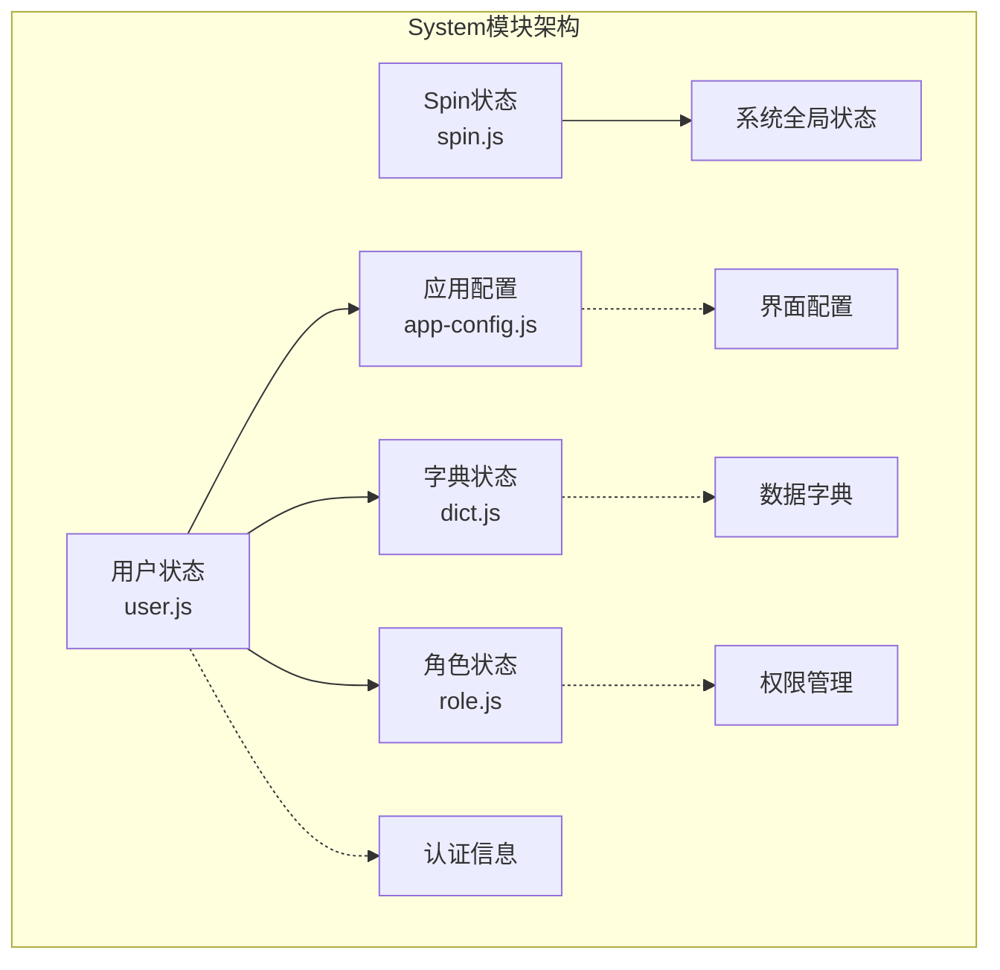

**图表来源**
- [src/store/modules/system/user.js](file://smart-admin-web-javascript/src/store/modules/system/user.js#L20-L68)
- [src/store/modules/system/app-config.js](file://smart-admin-web-javascript/src/store/modules/system/app-config.js#L38-L65)
- [src/store/modules/system/dict.js](file://smart-admin-web-javascript/src/store/modules/system/dict.js#L7-L14)

#### system模块职责边界

| 模块 | 职责范围 | 状态类型 | 访问频率 |
|------|----------|----------|----------|
| user | 用户认证、个人信息、菜单权限 | 认证状态 | 高 |
| app-config | 界面主题、布局配置、语言设置 | 应用配置 | 中 |
| dict | 数据字典、枚举值映射 | 静态数据 | 低 |
| role | 权限树、功能点管理 | 权限状态 | 中 |

### business模块（业务状态）

business模块专注于具体的业务功能状态管理，每个模块对应一个业务领域。

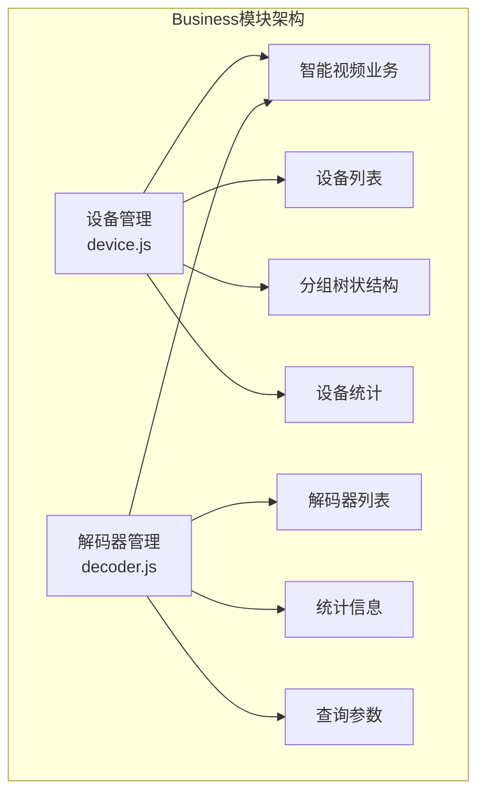

**图表来源**
- [src/store/modules/business/device.js](file://smart-admin-web-javascript/src/store/modules/business/device.js#L13-L19)
- [src/store/modules/business/decoder.js](file://smart-admin-web-javascript/src/store/modules/business/decoder.js#L13-L49)

#### business模块职责边界

| 模块 | 业务领域 | 状态复杂度 | 数据规模 |
|------|----------|------------|----------|
| device | 设备管理、设备监控 | 中等 | 小到中等 |
| decoder | 解码器管理、通道管理 | 高 | 中等 |

**章节来源**
- [src/store/modules/business/device.js](file://smart-admin-web-javascript/src/store/modules/business/device.js#L1-L227)
- [src/store/modules/business/decoder.js](file://smart-admin-web-javascript/src/store/modules/business/decoder.js#L1-L439)

## 核心模块详解

### 用户状态模块 (user.js)

用户状态模块是整个系统的核心，管理用户的认证信息、权限数据和个性化配置。

#### 状态结构设计

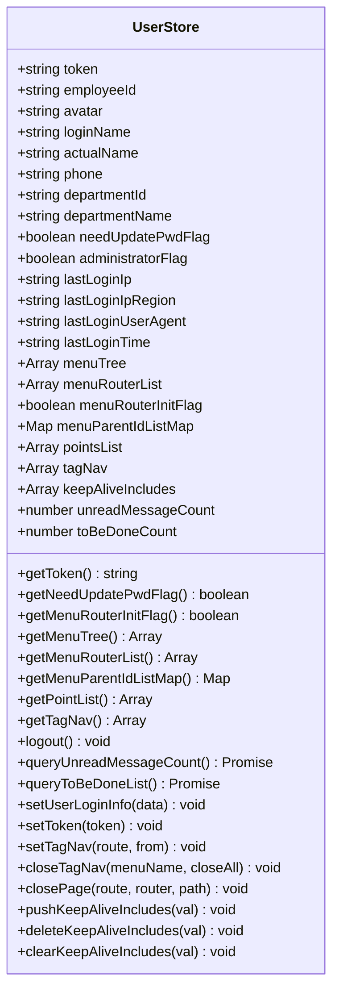

**图表来源**
- [src/store/modules/system/user.js](file://smart-admin-web-javascript/src/store/modules/system/user.js#L20-L68)

#### 关键功能实现

1. **菜单权限管理**：通过`buildMenuTree`和`buildMenuParentIdListMap`函数构建复杂的菜单树结构
2. **标签页管理**：实现多标签页的生命周期管理和状态持久化
3. **缓存管理**：通过`keepAliveIncludes`优化页面性能

### 字典状态模块 (dict.js)

字典状态模块提供全局的数据字典管理，支持多种数据类型的枚举值映射。

#### 数据结构设计

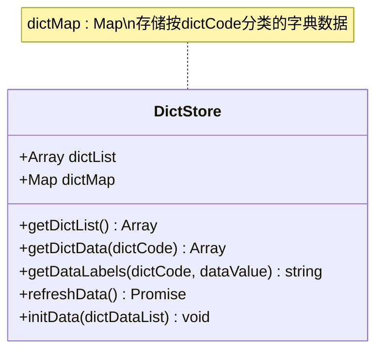

**图表来源**
- [src/store/modules/system/dict.js](file://smart-admin-web-javascript/src/store/modules/system/dict.js#L7-L14)

### 业务模块示例 (device.js)

设备管理模块展示了business模块的设计模式和最佳实践。

#### 状态管理模式

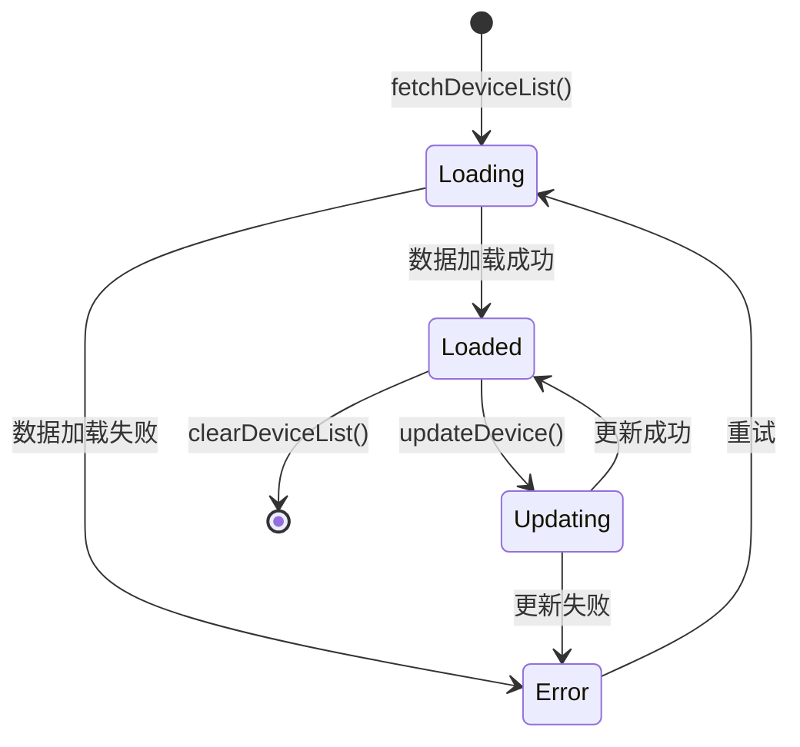

**图表来源**
- [src/store/modules/business/device.js](file://smart-admin-web-javascript/src/store/modules/business/device.js#L48-L226)

**章节来源**
- [src/store/modules/system/user.js](file://smart-admin-web-javascript/src/store/modules/system/user.js#L1-L908)
- [src/store/modules/system/dict.js](file://smart-admin-web-javascript/src/store/modules/system/dict.js#L1-L87)
- [src/store/modules/business/device.js](file://smart-admin-web-javascript/src/store/modules/business/device.js#L1-L227)

## 数据流与依赖关系

### 状态流转图

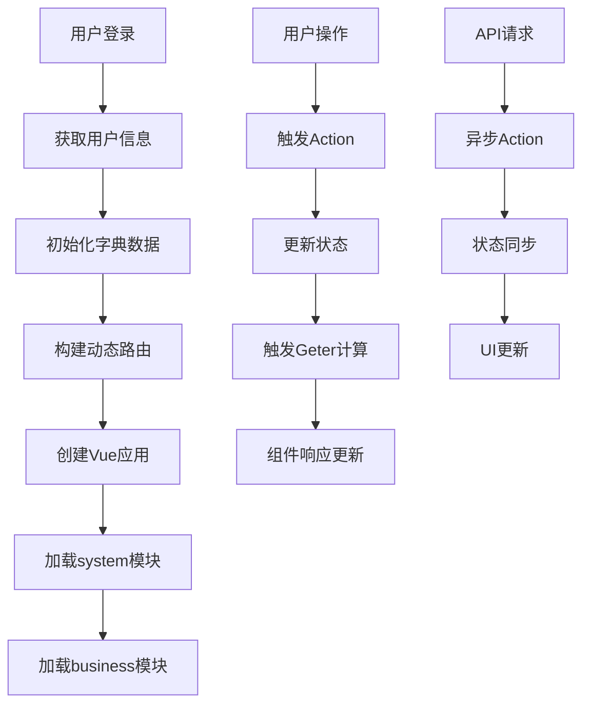

**图表来源**
- [src/main.js](file://smart-admin-web-javascript/src/main.js#L50-L71)

### 模块间通信机制

1. **直接依赖**：system模块可以被business模块直接依赖
2. **事件驱动**：通过Pinia的响应式系统实现松耦合通信
3. **状态共享**：通过store实例的全局访问实现跨模块状态共享

### 数据流向规范

| 流向 | 方向 | 适用场景 | 安全级别 |
|------|------|----------|----------|
| 上游 | API → Store | 数据获取、状态初始化 | 高 |
| 下游 | Store → Component | 状态展示、UI更新 | 中 |
| 内部 | Store → Store | 状态同步、数据转换 | 中 |
| 外部 | Component → Store | 用户交互、状态变更 | 低 |

## 安全访问策略

### 权限验证机制

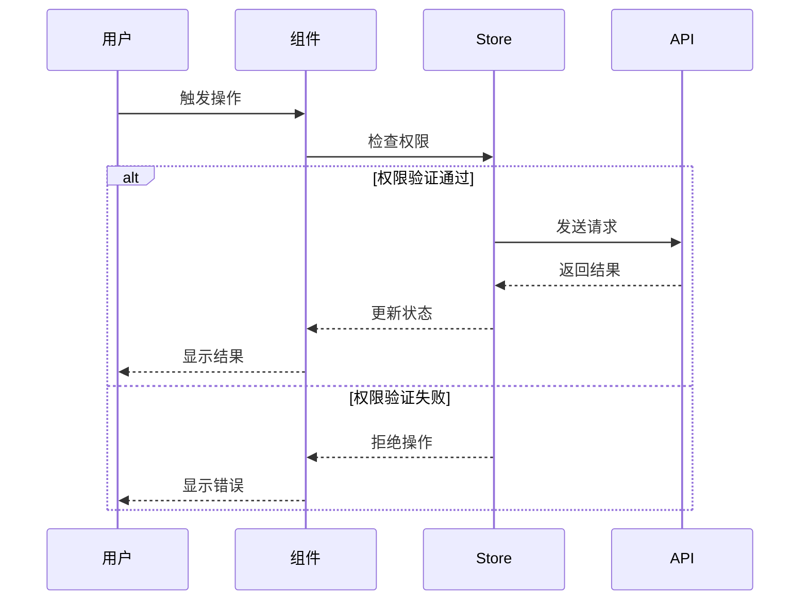

**图表来源**
- [src/store/modules/system/user.js](file://smart-admin-web-javascript/src/store/modules/system/user.js#L119-L131)

### 数据隔离策略

1. **模块边界**：严格限制模块间的直接数据访问
2. **权限检查**：在访问敏感数据前进行权限验证
3. **数据脱敏**：对敏感信息进行适当的脱敏处理

### 访问控制实现

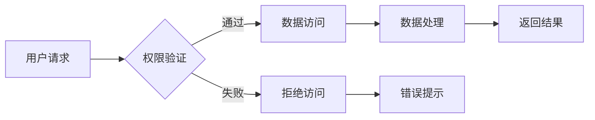

**章节来源**
- [src/store/modules/system/user.js](file://smart-admin-web-javascript/src/store/modules/system/user.js#L119-L131)

## 类型安全实现

### TypeScript集成

系统全面采用TypeScript，确保类型安全和开发体验。

#### 接口定义规范

```typescript
// 示例：用户状态接口
interface UserState {
  token: string;
  employeeId: string;
  avatar: string;
  loginName: string;
  actualName: string;
  phone: string;
  departmentId: string;
  departmentName: string;
  needUpdatePwdFlag: boolean;
  administratorFlag: boolean;
  lastLoginIp: string;
  lastLoginIpRegion: string;
  lastLoginUserAgent: string;
  lastLoginTime: string;
  menuTree: MenuTreeNode[];
  menuRouterList: MenuRoute[];
  menuRouterInitFlag: boolean;
  menuParentIdListMap: Map<string, MenuParent[]>;
  pointsList: Point[];
  tagNav: TagNavItem[];
  keepAliveIncludes: string[];
  unreadMessageCount: number;
  toBeDoneCount: number;
}

// 示例：设备状态接口
interface DeviceState {
  deviceList: DeviceInfo[];
  groupTreeData: GroupTree[];
  loading: boolean;
  currentDevice: DeviceInfo | null;
}
```

### 类型推断机制

1. **自动类型推断**：Pinia自动推断store的状态类型
2. **显式类型注解**：关键接口使用明确的类型定义
3. **编译时检查**：利用TypeScript的编译时类型检查

### 错误处理类型

```typescript
// 异常类型定义
interface StoreError {
  code: number;
  message: string;
  timestamp: number;
  module: string;
}

// API响应类型
interface ApiResponse<T> {
  code: number;
  data: T;
  msg: string;
  timestamp: number;
}
```

## 模块初始化流程

### 应用启动序列

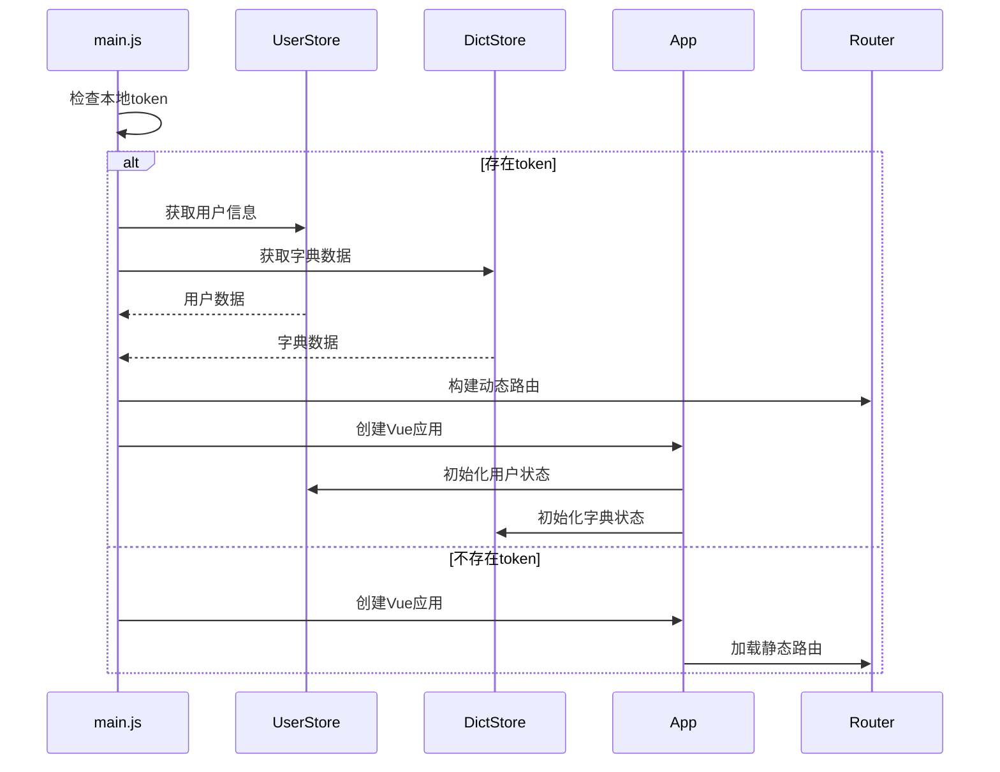

**图表来源**
- [src/main.js](file://smart-admin-web-javascript/src/main.js#L50-L71)

### 模块注册机制

#### 自动加载实现

```javascript
// 模块自动注册示例
const storeModules = {
  system: {
    user: useUserStore,
    dict: useDictStore,
    appConfig: useAppConfigStore,
    role: useRoleStore,
    spin: useSpinStore
  },
  business: {
    device: useDeviceStore,
    decoder: useDecoderStore
  }
};
```

#### 初始化顺序控制

1. **system模块优先**：确保基础状态先就绪
2. **依赖解析**：根据模块间的依赖关系排序
3. **并发初始化**：相同层级的模块并行初始化
4. **错误恢复**：单个模块初始化失败不影响整体

### 依赖注入模式

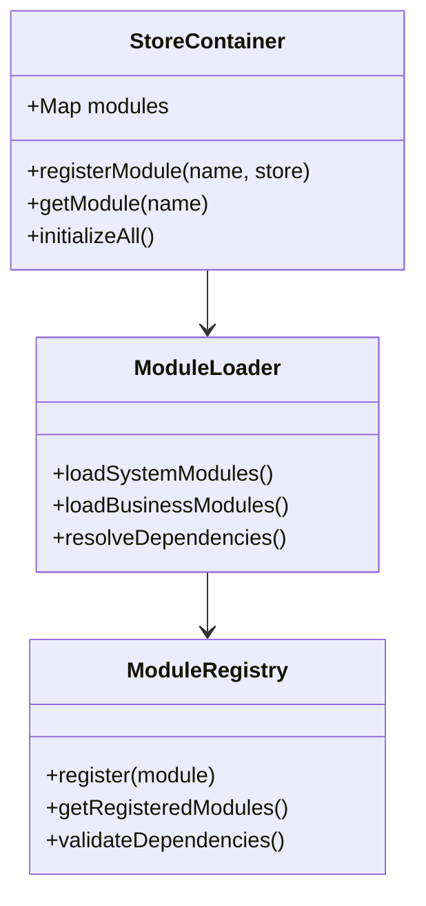

**章节来源**
- [src/main.js](file://smart-admin-web-javascript/src/main.js#L50-L107)
- [src/store/index.js](file://smart-admin-web-javascript/src/store/index.js#L1-L13)

## 最佳实践与规范

### 命名规范

#### 文件命名规范

| 模块类型 | 命名模式 | 示例 | 说明 |
|----------|----------|------|------|
| system模块 | `{功能}.js` | `user.js`, `dict.js` | 基础功能，小写 |
| business模块 | `{业务}.{功能}.js` | `device.js`, `decoder.js` | 业务相关，小写 |
| 常量文件 | `{领域}.{类型}.js` | `menu-const.js`, `dict-const.js` | 配置常量 |

#### 变量命名规范

```typescript
// Store实例命名
const useUserStore = defineStore('user');
const useDeviceStore = defineStore('device');

// Getter命名
getUserName(): string;
getDeviceList(): DeviceInfo[];

// Action命名
fetchDeviceList(): Promise<void>;
updateDeviceStatus(): Promise<boolean>;
```

### 目录结构约定

```
src/
├── store/
│   ├── index.js              # Store容器
│   └── modules/
│       ├── system/           # 基础状态模块
│       │   ├── user.js
│       │   ├── dict.js
│       │   ├── app-config.js
│       │   ├── role.js
│       │   └── spin.js
│       └── business/         # 业务状态模块
│           ├── device.js
│           └── decoder.js
```

### 性能优化策略

#### 状态分割原则

1. **按需加载**：business模块的状态按页面需求动态加载
2. **状态压缩**：移除不必要的状态字段
3. **懒加载**：大型数据集采用分页或虚拟滚动

#### 缓存策略

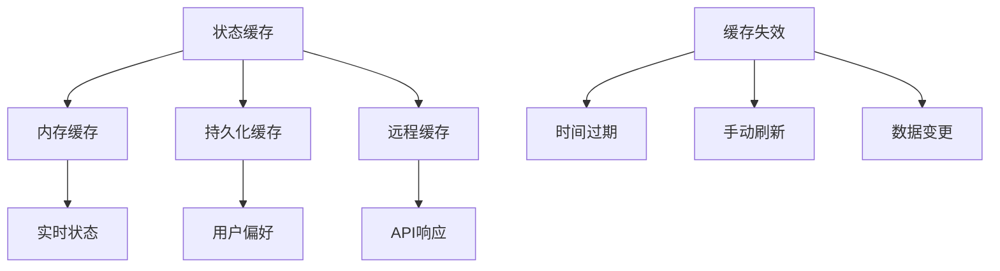

### 错误处理规范

#### 异常分类

| 异常类型 | 处理策略 | 用户反馈 | 日志级别 |
|----------|----------|----------|----------|
| 网络异常 | 重试机制 | 显示错误提示 | ERROR |
| 权限异常 | 权限检查 | 无提示 | WARN |
| 数据异常 | 数据校验 | 显示错误信息 | INFO |
| 系统异常 | 优雅降级 | 显示维护页面 | FATAL |

#### 错误恢复机制

```javascript
// 错误恢复示例
async function fetchDataWithRetry(action, maxRetries = 3) {
  let lastError;
  
  for (let i = 0; i < maxRetries; i++) {
    try {
      return await action();
    } catch (error) {
      lastError = error;
      if (i < maxRetries - 1) {
        await delay(1000 * Math.pow(2, i)); // 指数退避
      }
    }
  }
  
  throw lastError;
}
```

### 测试策略

#### 单元测试覆盖

1. **Store Actions**：测试状态变更逻辑
2. **Store Getters**：验证计算属性正确性
3. **异步操作**：模拟API调用和错误场景
4. **副作用**：测试与外部系统的交互

#### 集成测试


## 总结

SmartAdmin的状态管理架构通过以下核心设计实现了高效、安全、可维护的状态管理：

### 架构优势

1. **模块化设计**：清晰的system和business模块划分，便于维护和扩展
2. **类型安全**：全面的TypeScript支持，提供编译时类型检查
3. **安全机制**：多层次的权限验证和数据隔离
4. **性能优化**：合理的状态分割和缓存策略
5. **开发体验**：完善的工具链和错误处理机制

### 技术特色

- **Pinia集成**：充分利用Vue 3的响应式系统
- **自动加载**：支持模块的动态注册和发现
- **类型推断**：减少样板代码，提高开发效率
- **错误恢复**：健壮的异常处理和恢复机制

### 扩展性考虑

该架构设计充分考虑了未来的扩展需求：
- 新模块可以轻松添加到system或business分类
- 支持插件化的状态管理扩展
- 提供标准化的接口和规范
- 兼容现有的Vue生态工具

通过这套完整的状态管理架构，SmartAdmin为复杂的业务系统提供了稳定可靠的状态管理解决方案，同时保持了良好的开发体验和系统性能。