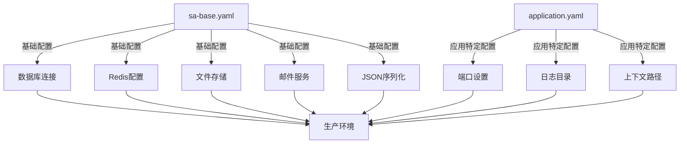
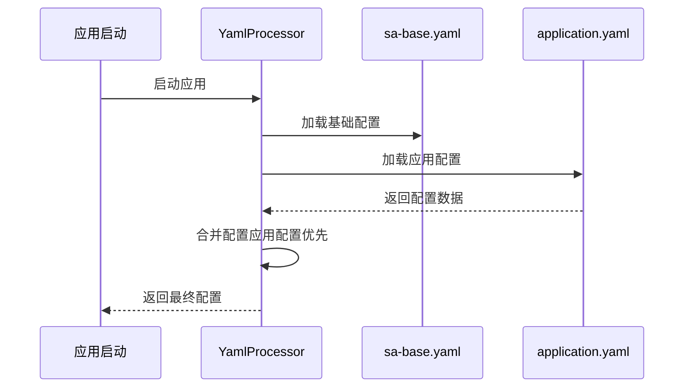
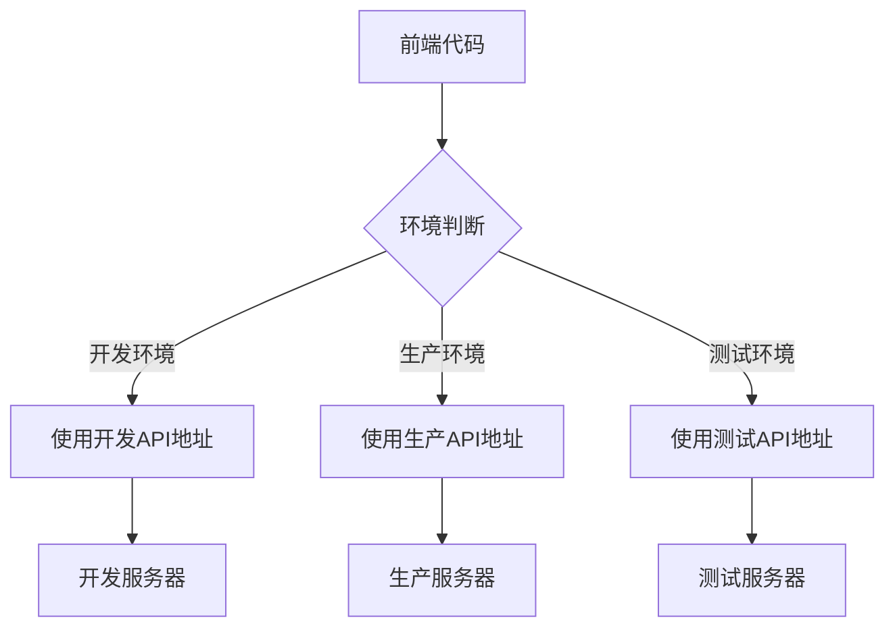

# 环境配置

<cite>
**本文档引用的文件**  
- [application.yaml](file://smart-admin-api-java17-springboot3/sa-admin/src/main/resources/dev/application.yaml)
- [sa-base.yaml](file://smart-admin-api-java17-springboot3/sa-base/src/main/resources/dev/sa-base.yaml)
- [DataSourceConfig.java](file://smart-admin-api-java17-springboot3/sa-base/src/main/java/net/lab1024/sa/base/config/DataSourceConfig.java)
- [RedisConfig.java](file://smart-admin-api-java17-springboot3/sa-base/src/main/java/net/lab1024/sa/base/config/RedisConfig.java)
- [FileConfig.java](file://smart-admin-api-java17-springboot3/sa-base/src/main/java/net/lab1024/sa/base/config/FileConfig.java)
- [.env.development](file://smart-admin-web-javascript/.env.development)
- [.env.production](file://smart-admin-web-javascript/.env.production)
- [.env.test](file://smart-admin-web-javascript/.env.test)
- [vite.config.js](file://smart-admin-web-javascript/vite.config.js)
</cite>

## 目录

1. [项目结构概述](#项目结构概述)
2. [后端配置体系](#后端配置体系)
   1. [配置文件结构](#配置文件结构)
   2. [多环境配置管理](#多环境配置管理)
   3. [配置加载优先级与覆盖机制](#配置加载优先级与覆盖机制)
   4. [核心配置项详解](#核心配置项详解)
3. [前端环境配置](#前端环境配置)
4. [配置安全最佳实践](#配置安全最佳实践)

## 项目结构概述

IOE-DREAM项目采用前后端分离架构，包含后端Spring Boot应用和前端JavaScript应用。后端配置采用模块化设计，通过sa-base和sa-admin两个模块实现通用配置与特定配置的分离。

**本文档引用的文件**
- [smart-admin-api-java17-springboot3/sa-admin/src/main/resources/dev/application.yaml](file://smart-admin-api-java17-springboot3/sa-admin/src/main/resources/dev/application.yaml)
- [smart-admin-api-java17-springboot3/sa-base/src/main/resources/dev/sa-base.yaml](file://smart-admin-api-java17-springboot3/sa-base/src/main/resources/dev/sa-base.yaml)

## 后端配置体系

### 配置文件结构

IOE-DREAM项目的后端配置采用分层结构，主要由两个核心配置文件组成：

1. **sa-base.yaml**：位于sa-base模块中，包含所有环境通用的基础配置
2. **application.yaml**：位于sa-admin模块中，包含特定于sa-admin应用的配置

这种设计实现了配置的复用和分离，避免了重复配置。sa-base.yaml作为基础配置文件，包含了数据库、Redis、文件存储等核心组件的默认配置，而application.yaml则主要包含应用特定的配置，如端口、日志目录等。



**图示来源**
- [sa-base.yaml](file://smart-admin-api-java17-springboot3/sa-base/src/main/resources/dev/sa-base.yaml)
- [application.yaml](file://smart-admin-api-java17-springboot3/sa-admin/src/main/resources/dev/application.yaml)

**本节来源**
- [smart-admin-api-java17-springboot3/sa-base/src/main/resources/dev/sa-base.yaml](file://smart-admin-api-java17-springboot3/sa-base/src/main/resources/dev/sa-base.yaml)
- [smart-admin-api-java17-springboot3/sa-admin/src/main/resources/dev/application.yaml](file://smart-admin-api-java17-springboot3/sa-admin/src/main/resources/dev/application.yaml)

### 多环境配置管理

项目支持四种环境配置：开发(dev)、预发布(pre)、生产(prod)和测试(test)。每种环境都有独立的配置文件目录，实现了环境隔离。

#### 环境配置目录结构

```
sa-admin/
└── src/main/resources/
    ├── dev/          # 开发环境配置
    ├── pre/          # 预发布环境配置  
    ├── prod/         # 生产环境配置
    └── test/         # 测试环境配置

sa-base/
└── src/main/resources/
    ├── dev/          # 开发环境配置
    ├── pre/          # 预发布环境配置
    ├── prod/         # 生产环境配置
    └── test/         # 测试环境配置
```

#### 各环境特点

| 环境 | 特点 | 适用场景 |
|------|------|----------|
| 开发环境 | 配置宽松，日志级别详细，便于调试 | 本地开发和功能测试 |
| 预发布环境 | 接近生产环境配置，用于最终验证 | 上线前的最后验证 |
| 生产环境 | 高性能配置，严格的安全设置 | 正式生产运行 |
| 测试环境 | 独立端口，便于并行测试 | 自动化测试和集成测试 |


**图示来源**
- [smart-admin-api-java17-springboot3/sa-admin/src/main/resources/dev/application.yaml](file://smart-admin-api-java17-springboot3/sa-admin/src/main/resources/dev/application.yaml)
- [smart-admin-api-java17-springboot3/sa-admin/src/main/resources/test/application.yaml](file://smart-admin-api-java17-springboot3/sa-admin/src/main/resources/test/application.yaml)

**本节来源**
- [smart-admin-api-java17-springboot3/sa-admin/src/main/resources/dev/application.yaml](file://smart-admin-api-java17-springboot3/sa-admin/src/main/resources/dev/application.yaml)
- [smart-admin-api-java17-springboot3/sa-admin/src/main/resources/pre/application.yaml](file://smart-admin-api-java17-springboot3/sa-admin/src/main/resources/pre/application.yaml)
- [smart-admin-api-java17-springboot3/sa-admin/src/main/resources/prod/application.yaml](file://smart-admin-api-java17-springboot3/sa-admin/src/main/resources/prod/application.yaml)
- [smart-admin-api-java17-springboot3/sa-admin/src/main/resources/test/application.yaml](file://smart-admin-api-java17-springboot3/sa-admin/src/main/resources/test/application.yaml)

### 配置加载优先级与覆盖机制

项目的配置加载遵循特定的优先级规则，确保配置的灵活性和可维护性。

#### 配置加载流程

1. 首先加载sa-base模块中的sa-base.yaml配置
2. 然后加载sa-admin模块中的application.yaml配置
3. application.yaml中的配置会覆盖sa-base.yaml中的同名配置

这种机制通过YamlProcessor.java类实现，允许在不修改基础配置的情况下，针对特定应用进行配置覆盖。



**图示来源**
- [smart-admin-api-java17-springboot3/sa-admin/src/main/resources/dev/application.yaml](file://smart-admin-api-java17-springboot3/sa-admin/src/main/resources/dev/application.yaml)
- [smart-admin-api-java17-springboot3/sa-base/src/main/resources/dev/sa-base.yaml](file://smart-admin-api-java17-springboot3/sa-base/src/main/resources/dev/sa-base.yaml)

#### 配置覆盖示例

以数据库连接池配置为例，不同环境的配置差异体现了覆盖机制：

- **开发环境**：较小的连接池（max-active: 10），便于本地资源管理
- **生产环境**：较大的连接池（max-active: 200），确保高并发性能
- **测试环境**：中等连接池（max-active: 10），平衡资源和性能

这种设计使得基础配置可以保持稳定，而特定环境的优化配置可以通过覆盖机制实现。

**本节来源**
- [smart-admin-api-java17-springboot3/sa-admin/src/main/resources/dev/application.yaml](file://smart-admin-api-java17-springboot3/sa-admin/src/main/resources/dev/application.yaml)
- [smart-admin-api-java17-springboot3/sa-base/src/main/resources/dev/sa-base.yaml](file://smart-admin-api-java17-springboot3/sa-base/src/main/resources/dev/sa-base.yaml)

### 核心配置项详解

#### 数据库连接配置

数据库配置是系统的核心，不同环境有不同的连接设置：

```yaml
spring:
  datasource:
    url: jdbc:mysql://host:port/database?parameters
    username: 用户名
    password: 密码
    driver-class-name: 驱动类名
    initial-size: 初始连接数
    min-idle: 最小空闲连接数
    max-active: 最大活跃连接数
    max-wait: 最大等待时间
```

- **开发环境**：使用P6Spy驱动，便于SQL监控
- **生产环境**：使用原生MySQL驱动，性能更优
- **连接池参数**：根据环境负载调整，生产环境配置更高的连接数

**本节来源**
- [smart-admin-api-java17-springboot3/sa-base/src/main/resources/dev/sa-base.yaml](file://smart-admin-api-java17-springboot3/sa-base/src/main/resources/dev/sa-base.yaml)
- [smart-admin-api-java17-springboot3/sa-base/src/main/resources/prod/sa-base.yaml](file://smart-admin-api-java17-springboot3/sa-base/src/main/resources/prod/sa-base.yaml)
- [smart-admin-api-java17-springboot3/sa-base/src/main/java/net/lab1024/sa/base/config/DataSourceConfig.java](file://smart-admin-api-java17-springboot3/sa-base/src/main/java/net/lab1024/sa/base/config/DataSourceConfig.java)

#### Redis配置

Redis作为缓存和会话存储的核心组件，其配置对系统性能至关重要：

```yaml
spring:
  data:
    redis:
      database: 数据库编号
      host: 主机地址
      port: 端口
      password: 密码
      timeout: 超时时间
      lettuce:
        pool:
          max-active: 最大活跃连接
          min-idle: 最小空闲连接
          max-idle: 最大空闲连接
          max-wait: 最大等待时间
```

- **开发环境**：较小的连接池，本地Redis实例
- **生产环境**：较大的连接池，更高的性能要求
- **密码设置**：生产环境通常不设置密码，依赖网络隔离

**本节来源**
- [smart-admin-api-java17-springboot3/sa-base/src/main/resources/dev/sa-base.yaml](file://smart-admin-api-java17-springboot3/sa-base/src/main/resources/dev/sa-base.yaml)
- [smart-admin-api-java17-springboot3/sa-base/src/main/resources/prod/sa-base.yaml](file://smart-admin-api-java17-springboot3/sa-base/src/main/resources/prod/sa-base.yaml)
- [smart-admin-api-java17-springboot3/sa-base/src/main/java/net/lab1024/sa/base/config/RedisConfig.java](file://smart-admin-api-java17-springboot3/sa-base/src/main/java/net/lab1024/sa/base/config/RedisConfig.java)

#### 文件存储配置

文件存储支持本地和云存储两种模式，通过配置灵活切换：

```yaml
file:
  storage:
    mode: 存储模式(local/cloud)
    local:
      upload-path: 本地上传路径
      url-prefix: URL前缀
    cloud:
      region: 区域
      endpoint: 端点
      bucket-name: 存储桶名称
      access-key: 访问密钥
      secret-key: 密钥
      url-prefix: URL前缀
      private-url-expire-seconds: 私有URL过期时间
```

- **本地存储**：适用于开发和测试环境
- **云存储**：适用于生产环境，提供高可用性
- **条件注入**：通过@ConditionalOnProperty注解实现存储服务的条件注入

**本节来源**
- [smart-admin-api-java17-springboot3/sa-base/src/main/resources/dev/sa-base.yaml](file://smart-admin-api-java17-springboot3/sa-base/src/main/resources/dev/sa-base.yaml)
- [smart-admin-api-java17-springboot3/sa-base/src/main/java/net/lab1024/sa/base/config/FileConfig.java](file://smart-admin-api-java17-springboot3/sa-base/src/main/java/net/lab1024/sa/base/config/FileConfig.java)

#### 其他关键配置

| 配置项 | 开发环境 | 生产环境 | 说明 |
|--------|----------|----------|------|
| 日志级别 | debug | warn | 生产环境减少日志输出 |
| 心跳间隔 | 300秒 | 60秒 | 生产环境更频繁的心跳检测 |
| 热加载间隔 | 300秒 | 60秒 | 生产环境更快的配置更新 |
| sa-token日志 | true | false | 生产环境关闭操作日志 |
| Tomcat日志保留 | 7天 | 30天 | 生产环境更长的日志保留期 |

**本节来源**
- [smart-admin-api-java17-springboot3/sa-base/src/main/resources/dev/sa-base.yaml](file://smart-admin-api-java17-springboot3/sa-base/src/main/resources/dev/sa-base.yaml)
- [smart-admin-api-java17-springboot3/sa-base/src/main/resources/prod/sa-base.yaml](file://smart-admin-api-java17-springboot3/sa-base/src/main/resources/prod/sa-base.yaml)

## 前端环境配置

前端环境配置主要通过.env文件实现，支持不同环境的变量设置。

### 环境变量文件

前端项目包含以下环境变量文件：

- **.env.development**：开发环境配置
- **.env.production**：生产环境配置
- **.env.test**：测试环境配置

#### 环境变量示例

```env
# 开发环境
NODE_ENV=development
VITE_APP_TITLE='SmartAdmin 开发环境(Dev)'
VITE_APP_API_URL='http://127.0.0.1:1024'

# 生产环境
NODE_ENV=production
VITE_APP_TITLE='SmartAdmin V3.X'
VITE_APP_API_URL='https://preview.smartadmin.vip/smart-admin-api'

# 测试环境
NODE_ENV=production
VITE_APP_TITLE='SmartAdmin 测试环境(Test)'
VITE_APP_API_URL='http://127.0.0.1:1024'
```

### Vite构建配置

Vite配置文件vite.config.js定义了构建和开发服务器的行为：

```javascript
export default {
  base: process.env.NODE_ENV === 'production' ? '/' : '/',
  server: {
    host: '0.0.0.0',
    port: 8081,
    proxy: {
      '/': {
        target: 'http://127.0.0.1:1024/',
        changeOrigin: true,
        rewrite: (path) => path,
      },
    },
  },
  build: {
    terserOptions: {
      compress: {
        drop_console: true,
        drop_debugger: true,
      },
    },
    outDir: 'dist',
    emptyOutDir: true,
  },
}
```

- **代理配置**：开发环境通过代理转发API请求
- **构建优化**：生产环境移除console和debugger语句
- **输出目录**：指定构建输出目录为dist



**图示来源**
- [smart-admin-web-javascript/.env.development](file://smart-admin-web-javascript/.env.development)
- [smart-admin-web-javascript/.env.production](file://smart-admin-web-javascript/.env.production)
- [smart-admin-web-javascript/vite.config.js](file://smart-admin-web-javascript/vite.config.js)

**本节来源**
- [smart-admin-web-javascript/.env.development](file://smart-admin-web-javascript/.env.development)
- [smart-admin-web-javascript/.env.production](file://smart-admin-web-javascript/.env.production)
- [smart-admin-web-javascript/.env.test](file://smart-admin-web-javascript/.env.test)
- [smart-admin-web-javascript/vite.config.js](file://smart-admin-web-javascript/vite.config.js)

## 配置安全最佳实践

### 敏感信息管理

1. **密码管理**：
   - 生产环境避免在配置文件中明文存储密码
   - 使用环境变量或密钥管理服务
   - 定期轮换密码

2. **密钥管理**：
   - 云存储访问密钥不应硬编码在配置中
   - 使用IAM角色或临时凭证
   - 限制密钥权限到最小必要范围

### 环境隔离策略

1. **网络隔离**：
   - 不同环境使用独立的网络区域
   - 生产环境数据库不对外暴露
   - 使用防火墙规则限制访问

2. **数据隔离**：
   - 不同环境使用独立的数据库实例
   - 禁止生产数据直接用于开发测试
   - 敏感数据脱敏处理

3. **访问控制**：
   - 严格控制生产环境访问权限
   - 实施最小权限原则
   - 记录和监控所有配置变更

### 配置审计与监控

1. **配置版本控制**：
   - 所有配置文件纳入版本控制系统
   - 记录配置变更历史
   - 实施代码审查流程

2. **变更监控**：
   - 监控关键配置的变更
   - 设置变更告警
   - 定期审计配置状态

3. **备份与恢复**：
   - 定期备份重要配置
   - 测试配置恢复流程
   - 制定灾难恢复计划

**本节来源**
- [smart-admin-api-java17-springboot3/sa-base/src/main/resources/prod/sa-base.yaml](file://smart-admin-api-java17-springboot3/sa-base/src/main/resources/prod/sa-base.yaml)
- [smart-admin-web-javascript/.env.production](file://smart-admin-web-javascript/.env.production)