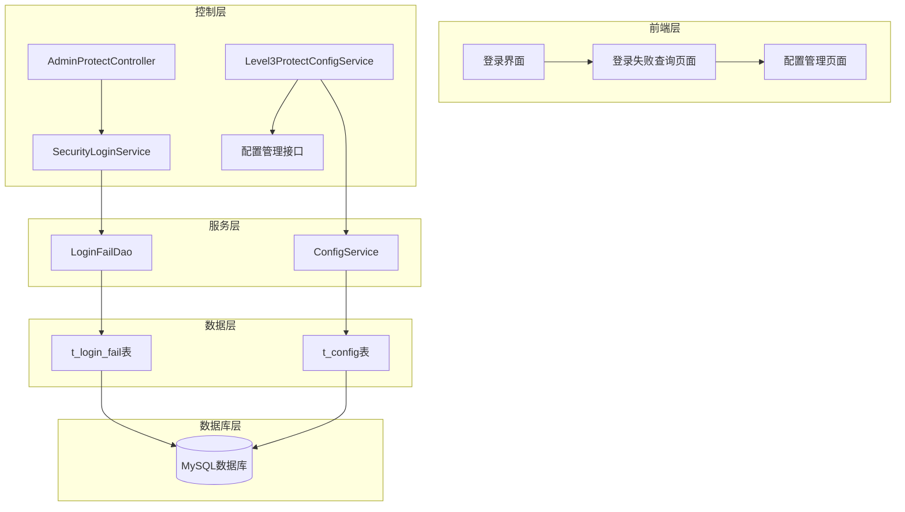
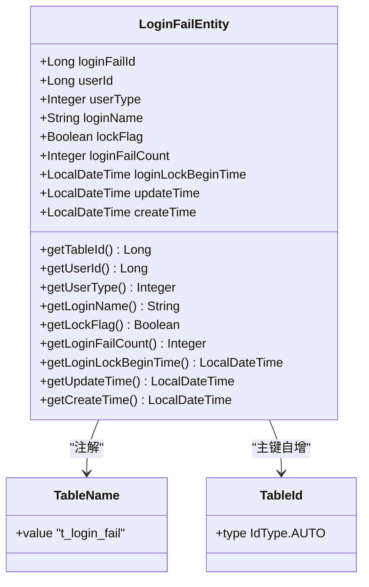
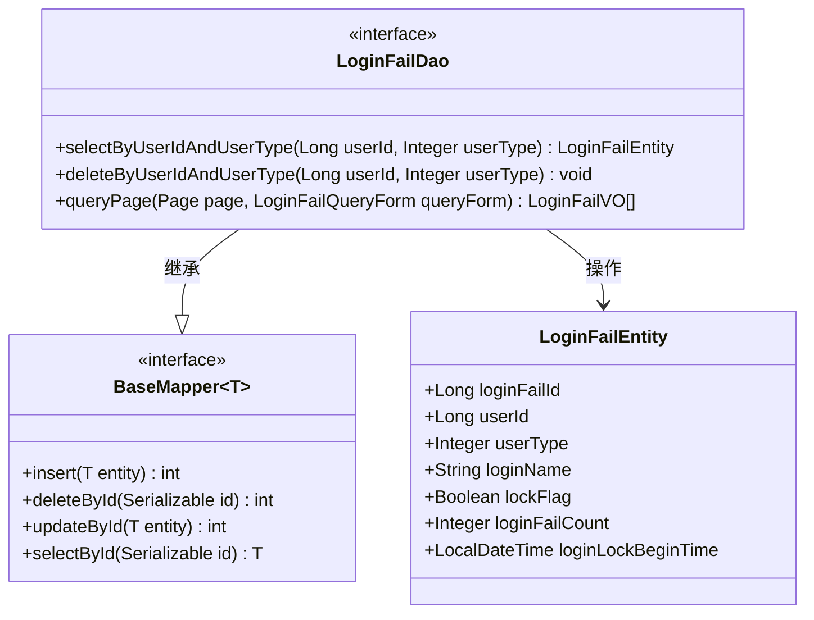
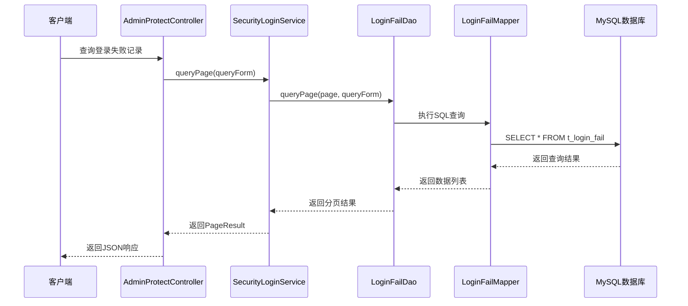
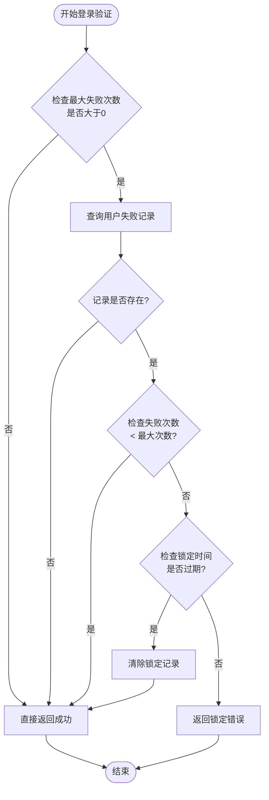
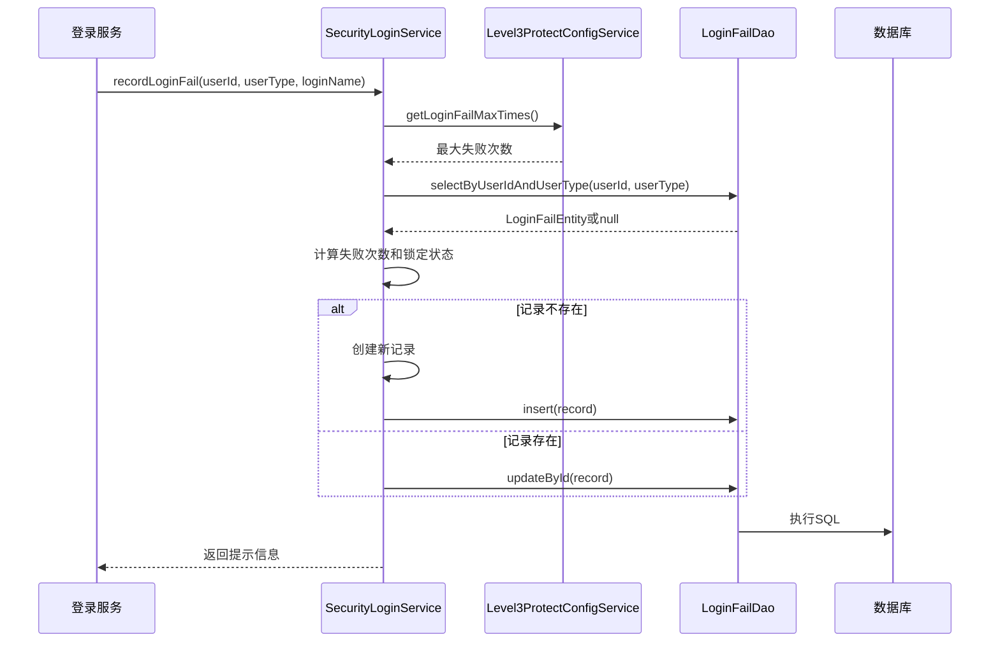
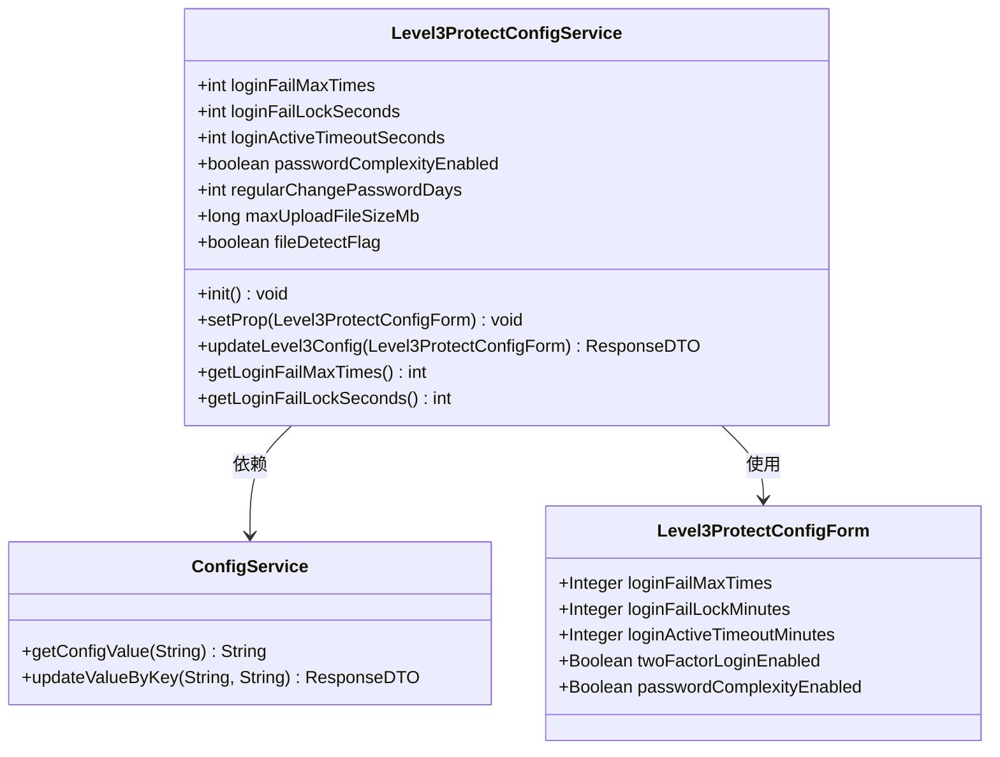
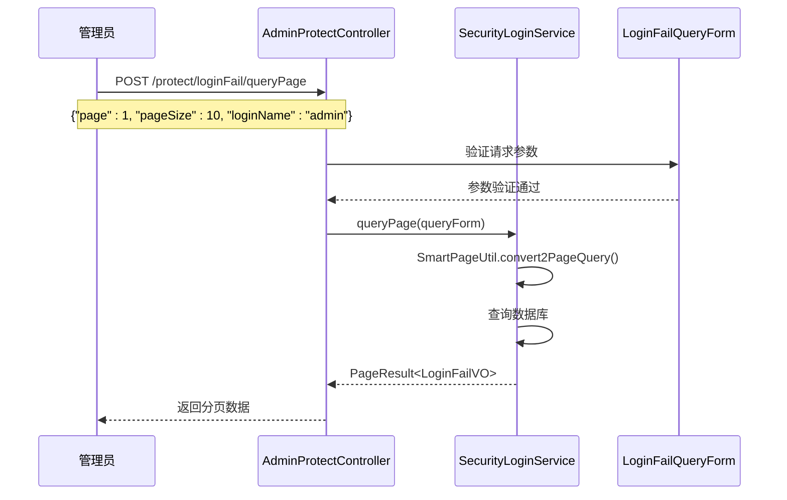
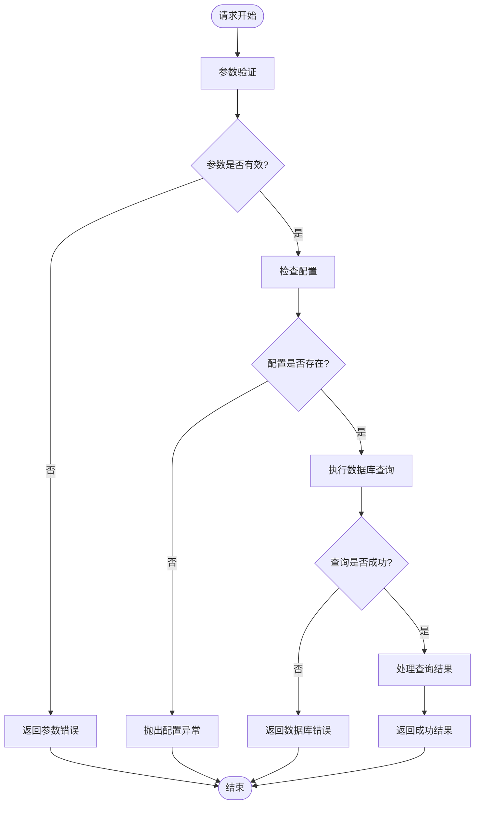

# 登录失败防护机制详细实现文档

<cite>
**本文档中引用的文件**
- [LoginFailEntity.java](file://smart-admin-api-java17-springboot3/sa-base/src/main/java/net/lab1024.sa.base/module/support/securityprotect/domain/LoginFailEntity.java)
- [LoginFailDao.java](file://smart-admin-api-java17-springboot3/sa-base/src/main/java/net/lab1024.sa.base/module/support/securityprotect/dao/LoginFailDao.java)
- [SecurityLoginService.java](file://smart-admin-api-java17-springboot3/sa-base/src/main/java/net/lab1024.sa.base/module/support/securityprotect/service/SecurityLoginService.java)
- [LoginFailMapper.xml](file://smart-admin-api-java17-springboot3/sa-base/src/main/resources/mapper/support/LoginFailMapper.xml)
- [Level3ProtectConfigService.java](file://smart-admin-api-java17-springboot3/sa-base/src/main/java/net/lab1024.sa.base/module/support/securityprotect/service/Level3ProtectConfigService.java)
- [LoginFailQueryForm.java](file://smart-admin-api-java17-springboot3/sa-base/src/main/java/net/lab1024.sa.base/module/support/securityprotect/domain/LoginFailQueryForm.java)
- [AdminProtectController.java](file://smart-admin-api-java17-springboot3/sa-admin/src/main/java/net/lab1024.sa.admin/module/system/support/AdminProtectController.java)
- [login-fail-api.js](file://smart-admin-web-javascript/src/api/support/login-fail-api.js)
</cite>

## 目录
1. [概述](#概述)
2. [系统架构](#系统架构)
3. [核心实体类设计](#核心实体类设计)
4. [数据访问层实现](#数据访问层实现)
5. [业务服务层分析](#业务服务层分析)
6. [配置管理机制](#配置管理机制)
7. [API接口设计](#api接口设计)
8. [异常处理与性能优化](#异常处理与性能优化)
9. [使用示例与最佳实践](#使用示例与最佳实践)
10. [总结](#总结)

## 概述

登录失败防护机制是智能管理系统中的重要安全防护措施，旨在防范暴力破解攻击，保护用户账户安全。该机制通过记录用户的登录失败尝试，根据预设策略自动锁定可疑账户，并提供管理员查询和管理功能。

### 核心功能特性

- **失败次数统计**：实时记录用户的登录失败次数
- **自动锁定机制**：达到阈值后自动锁定账户
- **时间窗口控制**：支持设置锁定时间和解锁条件
- **灵活配置**：可动态调整失败次数和锁定时间
- **管理员查询**：提供完整的登录失败记录查询功能
- **批量管理**：支持批量删除和清理操作

## 系统架构



**架构图来源**
- [AdminProtectController.java](file://smart-admin-api-java17-springboot3/sa-admin/src/main/java/net/lab1024.sa.admin/module/system/support/AdminProtectController.java#L23-L72)
- [SecurityLoginService.java](file://smart-admin-api-java17-springboot3/sa-base/src/main/java/net/lab1024.sa.base/module/support/securityprotect/service/SecurityLoginService.java#L28-L42)

## 核心实体类设计

### LoginFailEntity实体类

LoginFailEntity是登录失败记录的核心数据模型，采用MyBatis-Plus注解映射到数据库表`t_login_fail`。



**类图来源**
- [LoginFailEntity.java](file://smart-admin-api-java17-springboot3/sa-base/src/main/java/net/lab1024.sa.base/module/support/securityprotect/domain/LoginFailEntity.java#L24-L66)

#### 字段设计详解

| 字段名 | 类型 | 描述 | 约束 |
|--------|------|------|------|
| loginFailId | Long | 主键ID | 自增主键 |
| userId | Long | 用户ID | 关联用户表 |
| userType | Integer | 用户类型 | 枚举值标识 |
| loginName | String | 登录用户名 | 记录登录凭据 |
| lockFlag | Boolean | 锁定状态 | true/false |
| loginFailCount | Integer | 失败次数 | 累计计数 |
| loginLockBeginTime | LocalDateTime | 锁定开始时间 | 时间戳 |
| updateTime | LocalDateTime | 更新时间 | 自动更新 |
| createTime | LocalDateTime | 创建时间 | 自动创建 |

**字段来源**
- [LoginFailEntity.java](file://smart-admin-api-java17-springboot3/sa-base/src/main/java/net/lab1024.sa.base/module/support/securityprotect/domain/LoginFailEntity.java#L27-L63)

### 数据库表结构

基于LoginFailEntity实体类，数据库表`t_login_fail`的设计遵循以下原则：

- **主键设计**：使用自增ID确保唯一性
- **索引优化**：对`user_id`和`user_type`建立复合索引
- **时间字段**：记录创建和更新时间便于审计
- **布尔字段**：使用`BOOLEAN`类型存储锁定状态

## 数据访问层实现

### LoginFailDao接口设计

LoginFailDao继承MyBatis-Plus的BaseMapper，提供基础的CRUD操作和自定义查询方法。



**类图来源**
- [LoginFailDao.java](file://smart-admin-api-java17-springboot3/sa-base/src/main/java/net/lab1024.sa.base/module/support/securityprotect/dao/LoginFailDao.java#L24-L52)

### MyBatis-Plus映射实现

LoginFailMapper.xml提供了完整的SQL映射定义，支持复杂的查询条件和分页操作。

#### 核心查询方法

1. **按用户ID和类型查询**：`selectByUserIdAndUserType`
2. **删除指定用户记录**：`deleteByUserIdAndUserType`
3. **分页查询**：`queryPage`支持多条件过滤



**序列图来源**
- [SecurityLoginService.java](file://smart-admin-api-java17-springboot3/sa-base/src/main/java/net/lab1024.sa.base/module/support/securityprotect/service/SecurityLoginService.java#L147-L157)
- [LoginFailMapper.xml](file://smart-admin-api-java17-springboot3/sa-base/src/main/resources/mapper/support/LoginFailMapper.xml#L6-L28)

**节来源**
- [LoginFailDao.java](file://smart-admin-api-java17-springboot3/sa-base/src/main/java/net/lab1024.sa.base/module/support/securityprotect/dao/LoginFailDao.java#L24-L52)
- [LoginFailMapper.xml](file://smart-admin-api-java17-springboot3/sa-base/src/main/resources/mapper/support/LoginFailMapper.xml#L1-L47)

## 业务服务层分析

### SecurityLoginService核心逻辑

SecurityLoginService是登录失败防护机制的核心业务服务，负责处理登录验证、失败记录、锁定判断等关键逻辑。



**流程图来源**
- [SecurityLoginService.java](file://smart-admin-api-java17-springboot3/sa-base/src/main/java/net/lab1024.sa.base/module/support/securityprotect/service/SecurityLoginService.java#L52-L83)

### 失败记录更新机制

当用户登录失败时，系统会执行以下步骤：

1. **计算失败次数**：现有次数+1或初始化为1
2. **判断是否锁定**：达到最大失败次数时设置锁定标志
3. **更新数据库**：
   - 新记录：插入新记录
   - 存在记录：更新现有记录
4. **返回提示信息**：根据锁定状态返回相应消息



**序列图来源**
- [SecurityLoginService.java](file://smart-admin-api-java17-springboot3/sa-base/src/main/java/net/lab1024.sa.base/module/support/securityprotect/service/SecurityLoginService.java#L92-L128)

### 锁定策略实现

系统采用双重锁定策略：

1. **失败次数锁定**：达到设定次数后立即锁定
2. **时间窗口解锁**：锁定一定时间后自动解锁

锁定判断逻辑：
- 检查锁定开始时间是否为空
- 计算锁定时间是否超过设定阈值
- 根据结果决定是否允许登录

**节来源**
- [SecurityLoginService.java](file://smart-admin-api-java17-springboot3/sa-base/src/main/java/net/lab1024.sa.base/module/support/securityprotect/service/SecurityLoginService.java#L28-L175)

## 配置管理机制

### Level3ProtectConfigService配置服务

Level3ProtectConfigService负责管理三级等保相关的配置参数，包括登录失败防护的关键配置。



**类图来源**
- [Level3ProtectConfigService.java](file://smart-admin-api-java17-springboot3/sa-base/src/main/java/net/lab1024.sa.base/module/support/securityprotect/service/Level3ProtectConfigService.java#L30-L188)

### 配置参数详解

| 参数名称 | 默认值 | 描述 | 单位 |
|----------|--------|------|------|
| loginFailMaxTimes | -1 | 最大失败次数 | 次数 |
| loginFailLockSeconds | 1800 | 锁定时间 | 秒 |
| loginActiveTimeoutSeconds | -1 | 活跃超时时间 | 秒 |
| passwordComplexityEnabled | true | 密码复杂度 | 布尔值 |
| regularChangePasswordDays | 90 | 密码更换周期 | 天 |
| maxUploadFileSizeMb | 50 | 文件大小限制 | MB |
| fileDetectFlag | false | 文件检测开关 | 布尔值 |

### 动态配置更新

系统支持运行时动态更新配置，无需重启服务：

1. **配置解析**：从`t_config`表读取JSON格式配置
2. **参数转换**：将分钟单位转换为秒
3. **属性设置**：更新内存中的配置参数
4. **生效通知**：通知相关服务配置已更新

**节来源**
- [Level3ProtectConfigService.java](file://smart-admin-api-java17-springboot3/sa-base/src/main/java/net/lab1024.sa.base/module/support/securityprotect/service/Level3ProtectConfigService.java#L45-L188)

## API接口设计

### 管理员查询接口

AdminProtectController提供了完整的登录失败记录管理接口。

#### 分页查询接口



**序列图来源**
- [AdminProtectController.java](file://smart-admin-api-java17-springboot3/sa-admin/src/main/java/net/lab1024.sa.admin/module/system/support/AdminProtectController.java#L42-L46)

#### 接口参数说明

| 参数名 | 类型 | 必填 | 描述 |
|--------|------|------|------|
| loginName | String | 否 | 登录用户名（模糊查询） |
| lockFlag | Boolean | 否 | 锁定状态（true/false） |
| loginLockBeginTimeBegin | LocalDate | 否 | 锁定开始时间范围-起始 |
| loginLockBeginTimeEnd | LocalDate | 否 | 锁定开始时间范围-结束 |
| page | Integer | 是 | 当前页码 |
| pageSize | Integer | 是 | 每页数量 |

### 前端API封装

前端通过loginFailApi提供统一的接口调用方式：

```javascript
// 分页查询示例
loginFailApi.queryPage({
    page: 1,
    pageSize: 10,
    loginName: "admin",
    lockFlag: true
}).then(response => {
    console.log("查询结果:", response.data);
});

// 批量删除示例
loginFailApi.batchDelete([1, 2, 3]).then(response => {
    console.log("删除成功");
});
```

**节来源**
- [AdminProtectController.java](file://smart-admin-api-java17-springboot3/sa-admin/src/main/java/net/lab1024.sa.admin/module/system/support/AdminProtectController.java#L42-L72)
- [login-fail-api.js](file://smart-admin-web-javascript/src/api/support/login-fail-api.js#L1-L26)

## 异常处理与性能优化

### 异常处理流程

系统在多个层面实现了完善的异常处理机制：

1. **配置缺失处理**：当`t_config`表中缺少配置时抛出初始化异常
2. **数据库异常**：捕获SQL执行异常并返回友好错误信息
3. **参数验证**：使用Bean Validation确保输入参数正确性
4. **空数据处理**：对查询结果进行空值检查



### 性能优化建议

1. **索引优化**：
   - 在`user_id`和`user_type`字段上建立复合索引
   - 对`login_lock_begin_time`字段建立单独索引

2. **缓存策略**：
   - 缓存频繁查询的配置参数
   - 对热点用户记录进行内存缓存

3. **批量操作**：
   - 支持批量删除操作减少数据库交互
   - 使用分页查询避免大数据量加载

4. **异步处理**：
   - 失败记录写入可以采用异步方式
   - 定期清理过期的锁定记录

5. **连接池优化**：
   - 合理配置数据库连接池参数
   - 设置合适的超时时间和最大连接数

## 使用示例与最佳实践

### 基本配置示例

```yaml
# 三级等保配置示例
level3_protect_config:
  loginFailMaxTimes: 5
  loginFailLockMinutes: 30
  loginActiveTimeoutMinutes: 30
  twoFactorLoginEnabled: true
  passwordComplexityEnabled: true
  regularChangePasswordMonths: 3
  regularChangePasswordNotAllowRepeatTimes: 3
  maxUploadFileSizeMb: 50
  fileDetectFlag: false
```

### 登录失败防护集成示例

```java
// 在登录服务中集成失败防护
@Service
public class LoginServiceImpl implements LoginService {
    
    @Resource
    private SecurityLoginService securityLoginService;
    
    @Override
    public ResponseDTO<String> login(LoginForm loginForm) {
        // 1. 检查是否可以登录
        ResponseDTO<LoginFailEntity> checkResult = securityLoginService.checkLogin(
            loginForm.getUserId(), 
            loginForm.getUserType()
        );
        
        if (!checkResult.getOk()) {
            return ResponseDTO.error(checkResult.getCode(), checkResult.getMessage());
        }
        
        // 2. 执行登录逻辑...
        
        // 3. 如果登录失败，记录失败尝试
        if (loginFailed) {
            String message = securityLoginService.recordLoginFail(
                loginForm.getUserId(),
                loginForm.getUserType(),
                loginForm.getLoginName(),
                checkResult.getData()
            );
            return ResponseDTO.error(UserErrorCode.LOGIN_FAIL, message);
        }
        
        // 4. 如果登录成功，清除失败记录
        securityLoginService.removeLoginFail(
            loginForm.getUserId(),
            loginForm.getUserType()
        );
        
        return ResponseDTO.ok("登录成功");
    }
}
```

### 管理员操作示例

```javascript
// 查询登录失败记录
async function queryLoginFailRecords() {
    try {
        const response = await loginFailApi.queryPage({
            page: 1,
            pageSize: 10,
            loginName: "",
            lockFlag: null,
            loginLockBeginTimeBegin: "2024-01-01",
            loginLockBeginTimeEnd: "2024-12-31"
        });
        
        console.log("登录失败记录:", response.data);
    } catch (error) {
        console.error("查询失败:", error);
    }
}

// 批量删除锁定记录
async function batchDeleteLockedRecords() {
    try {
        const response = await loginFailApi.batchDelete([1, 2, 3, 4, 5]);
        console.log("批量删除成功");
    } catch (error) {
        console.error("批量删除失败:", error);
    }
}
```

### 安全最佳实践

1. **合理设置阈值**：
   - 失败次数：建议设置为3-5次
   - 锁定时间：建议设置为30分钟
   - 活跃超时：建议设置为30分钟

2. **定期清理**：
   - 定期清理已解锁的记录
   - 监控系统资源使用情况

3. **监控告警**：
   - 监控异常登录行为
   - 设置失败率告警阈值

4. **日志审计**：
   - 记录所有锁定和解锁操作
   - 定期分析登录失败模式

## 总结

登录失败防护机制通过多层次的安全设计，有效防范了暴力破解攻击，保护了用户账户安全。该机制具有以下优势：

### 技术优势

1. **模块化设计**：清晰的分层架构便于维护和扩展
2. **配置灵活**：支持动态调整防护策略
3. **性能优化**：合理的索引设计和查询优化
4. **异常处理**：完善的错误处理和恢复机制

### 安全价值

1. **主动防护**：实时监控和自动响应
2. **策略多样**：支持多种锁定策略组合
3. **管理便捷**：提供完整的管理界面
4. **审计完整**：完整的操作日志记录

### 应用场景

- **企业内部系统**：保护员工账户安全
- **电商平台**：防范恶意注册和攻击
- **金融系统**：满足合规要求
- **政府系统**：符合三级等保标准

通过持续优化和改进，该登录失败防护机制能够为智能管理系统提供可靠的安全保障，有效抵御各种形式的暴力破解攻击。