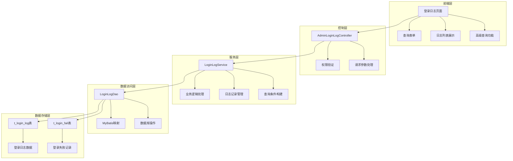
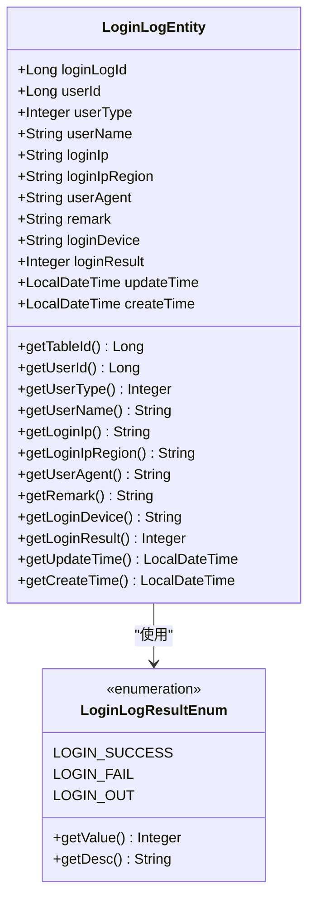
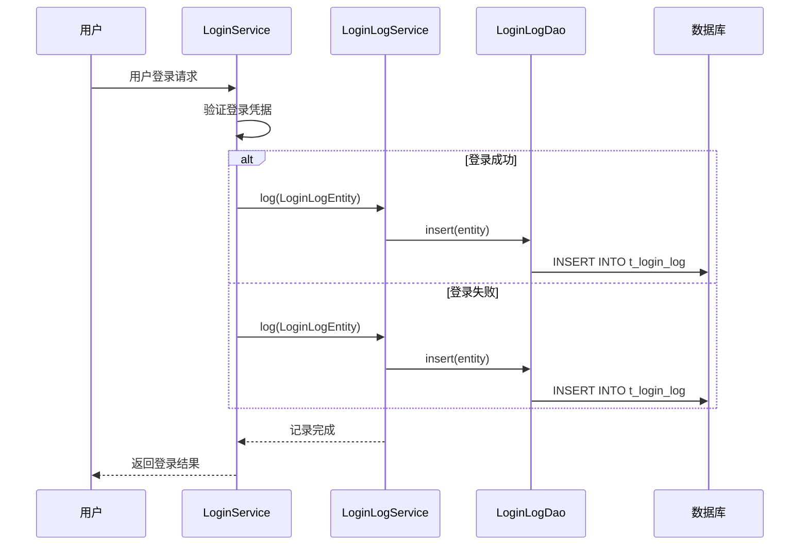
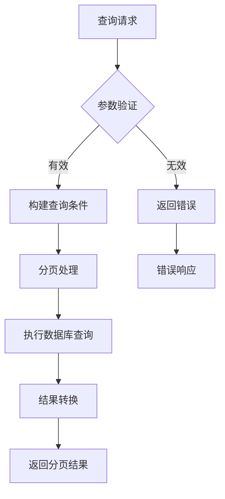
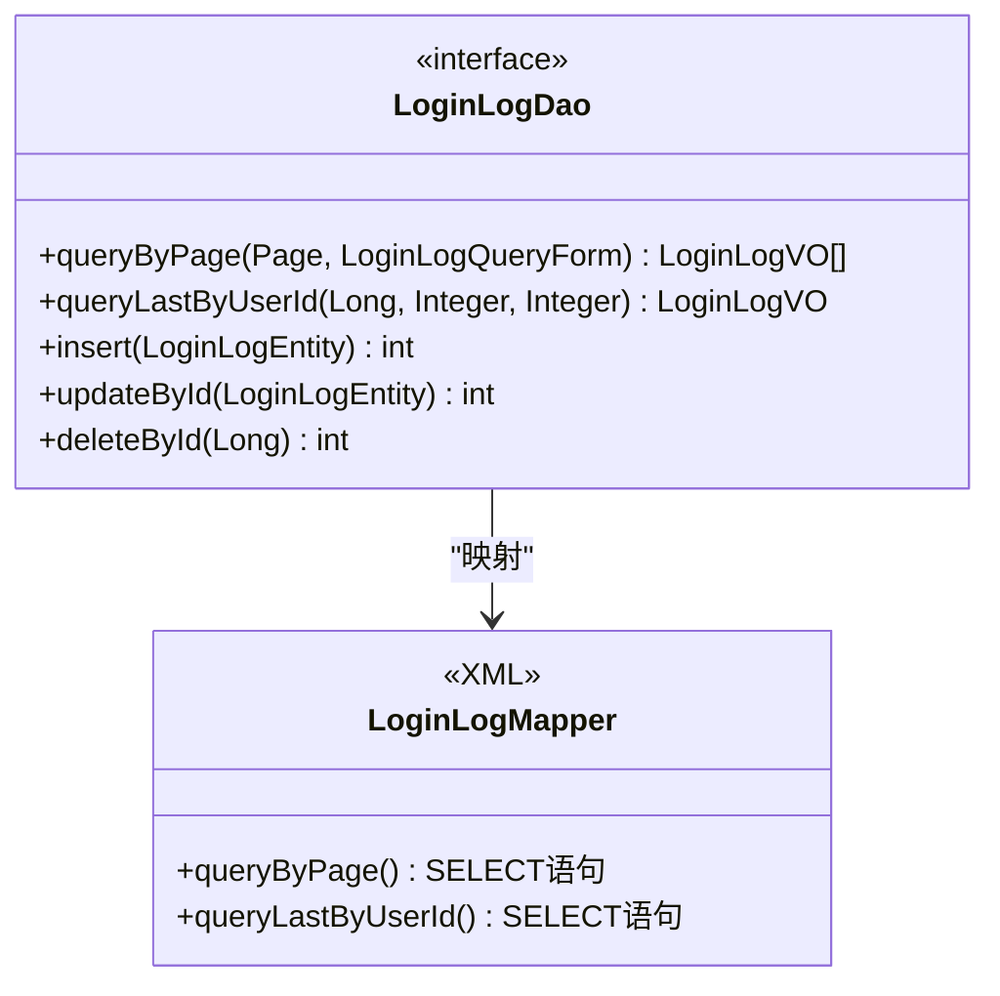
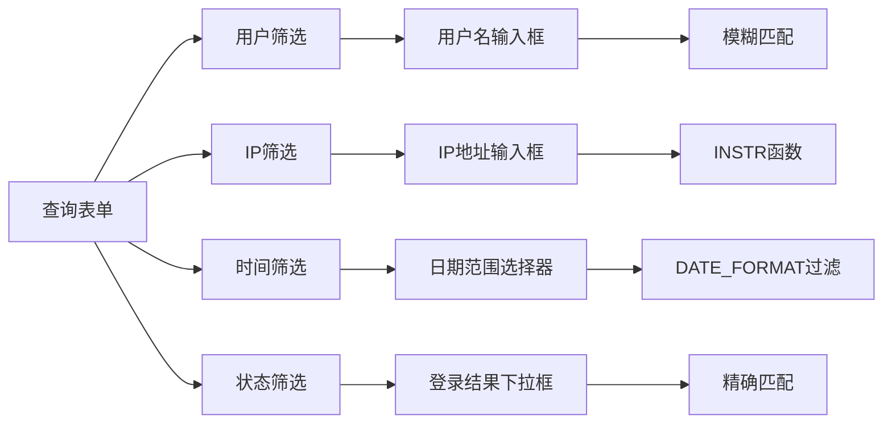
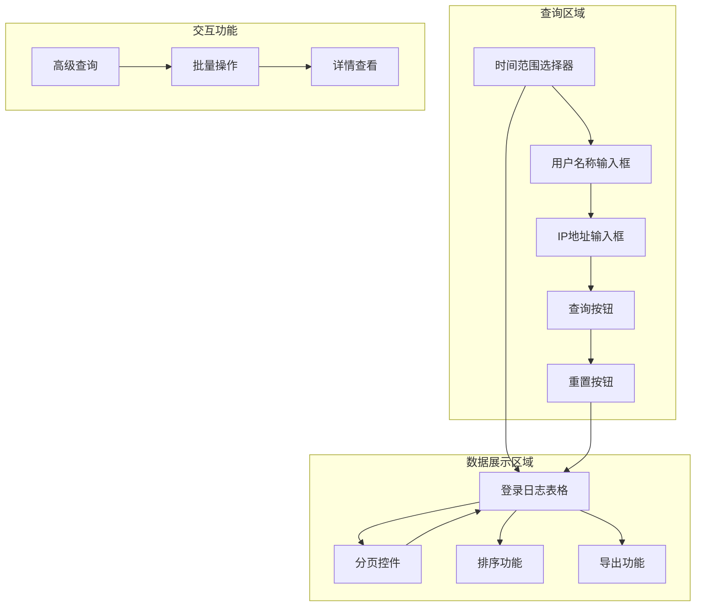
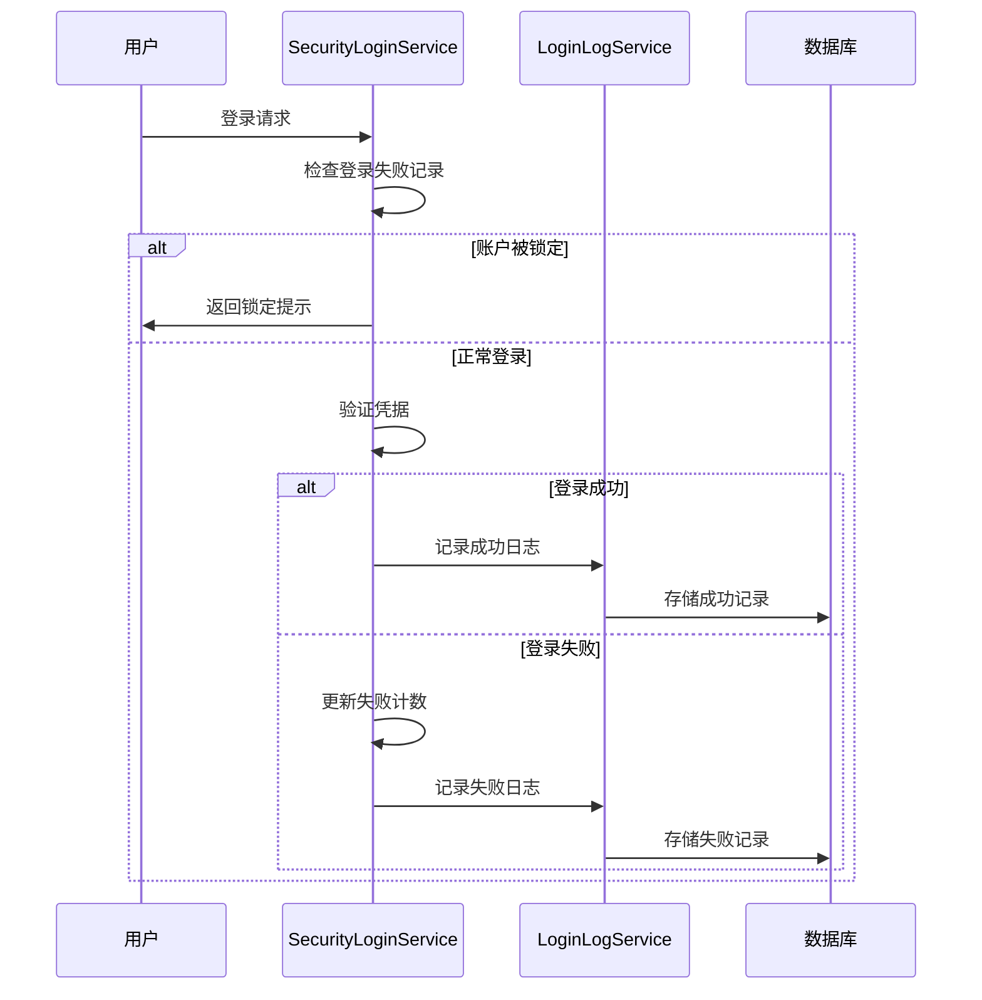
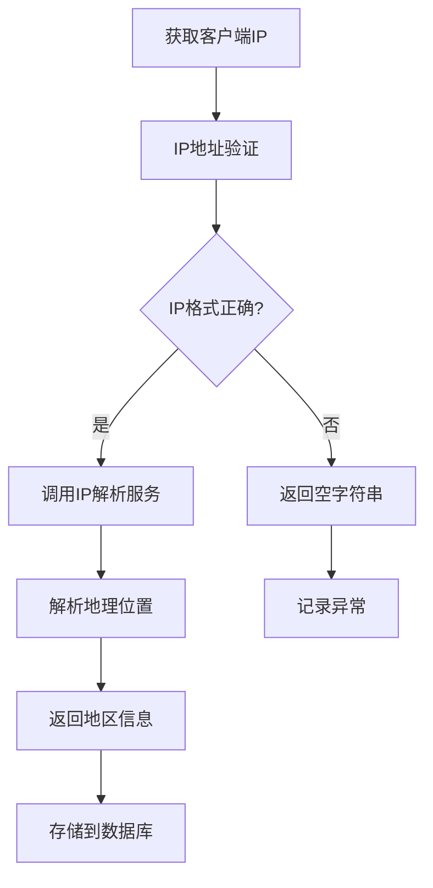

# 登录日志

<cite>
**本文档中引用的文件**
- [LoginLogEntity.java](file://smart-admin-api-java17-springboot3/sa-base/src/main/java/net/lab1024/sa/base/module/support/loginlog/domain/LoginLogEntity.java)
- [LoginLogVO.java](file://smart-admin-api-java17-springboot3/sa-base/src/main/java/net/lab1024/sa/base/module/support/loginlog/domain/LoginLogVO.java)
- [LoginLogService.java](file://smart-admin-api-java17-springboot3/sa-base/src/main/java/net/lab1024/sa/base/module/support/loginlog/LoginLogService.java)
- [LoginLogDao.java](file://smart-admin-api-java17-springboot3/sa-base/src/main/java/net/lab1024/sa/base/module/support/loginlog/LoginLogDao.java)
- [LoginLogMapper.xml](file://smart-admin-api-java17-springboot3/sa-base/src/main/resources/mapper/support/LoginLogMapper.xml)
- [AdminLoginLogController.java](file://smart-admin-api-java17-springboot3/sa-admin/src/main/java/net/lab1024/sa/admin/module/system/support/AdminLoginLogController.java)
- [LoginLogQueryForm.java](file://smart-admin-api-java17-springboot3/sa-base/src/main/java/net/lab1024/sa/base/module/support/loginlog/domain/LoginLogQueryForm.java)
- [LoginLogResultEnum.java](file://smart-admin-api-java17-springboot3/sa-base/src/main/java/net/lab1024/sa/base/module/support/loginlog/LoginLogResultEnum.java)
- [LoginFailEntity.java](file://smart-admin-api-java17-springboot3/sa-base/src/main/java/net/lab1024/sa/base/module/support/securityprotect/domain/LoginFailEntity.java)
- [SecurityLoginService.java](file://smart-admin-api-java17-springboot3/sa-base/src/main/java/net/lab1024/sa/base/module/support/securityprotect/service/SecurityLoginService.java)
- [SmartIpUtil.java](file://smart-admin-api-java17-springboot3/sa-base/src/main/java/net/lab1024/sa/base/common/util/SmartIpUtil.java)
- [login-log-api.js](file://smart-admin-web-javascript/src/api/support/login-log-api.js)
- [login-log-list.vue](file://smart-admin-web-javascript/src/views/support/login-log/login-log-list.vue)
</cite>

## 目录
1. [概述](#概述)
2. [系统架构](#系统架构)
3. [核心组件分析](#核心组件分析)
4. [数据结构设计](#数据结构设计)
5. [服务层实现](#服务层实现)
6. [数据持久化策略](#数据持久化策略)
7. [审计功能](#审计功能)
8. [前端展示](#前端展示)
9. [安全防护机制](#安全防护机制)
10. [最佳实践](#最佳实践)
11. [总结](#总结)

## 概述

登录日志系统是智能视频管理系统中的重要安全组件，负责记录和管理用户的登录行为。该系统提供了完整的登录日志记录、查询、分析和审计功能，支持按时间范围、用户、IP地址等多种条件进行精确查询，同时具备异常登录行为识别和安全态势感知能力。

系统采用分层架构设计，包含数据模型层、服务层、数据访问层和前端展示层，确保了系统的可扩展性和维护性。通过自动化的日志记录机制，系统能够在用户登录成功或失败时自动捕获相关信息，为安全管理提供有力支撑。

## 系统架构

**图表来源**
- [AdminLoginLogController.java](file://smart-admin-api-java17-springboot3/sa-admin/src/main/java/net/lab1024/sa/admin/module/system/support/AdminLoginLogController.java#L1-L53)
- [LoginLogService.java](file://smart-admin-api-java17-springboot3/sa-base/src/main/java/net/lab1024/sa/base/module/support/loginlog/LoginLogService.java#L1-L68)
- [LoginLogDao.java](file://smart-admin-api-java17-springboot3/sa-base/src/main/java/net/lab1024/sa/base/module/support/loginlog/LoginLogDao.java#L1-L45)

## 核心组件分析

### 登录日志实体类 (LoginLogEntity)

LoginLogEntity是登录日志的核心数据模型，包含了登录过程中的所有关键信息：

**图表来源**
- [LoginLogEntity.java](file://smart-admin-api-java17-springboot3/sa-base/src/main/java/net/lab1024/sa/base/module/support/loginlog/domain/LoginLogEntity.java#L1-L77)
- [LoginLogResultEnum.java](file://smart-admin-api-java17-springboot3/sa-base/src/main/java/net/lab1024/sa/base/module/support/loginlog/LoginLogResultEnum.java#L1-L37)

### 登录日志服务类 (LoginLogService)

LoginLogService提供了登录日志的核心业务逻辑，包括日志记录、查询和管理功能：

**图表来源**
- [LoginService.java](file://smart-admin-api-java17-springboot3/sa-admin/src/main/java/net/lab1024/sa/admin/module/system/login/service/LoginService.java#L333-L370)
- [LoginLogService.java](file://smart-admin-api-java17-springboot3/sa-base/src/main/java/net/lab1024/sa/base/module/support/loginlog/LoginLogService.java#L48-L54)

**章节来源**
- [LoginLogService.java](file://smart-admin-api-java17-springboot3/sa-base/src/main/java/net/lab1024/sa/base/module/support/loginlog/LoginLogService.java#L1-L68)

## 数据结构设计

### 关键字段说明

登录日志的数据结构设计充分考虑了安全审计和性能优化的需求：

| 字段名 | 类型 | 说明 | 约束 |
|--------|------|------|------|
| loginLogId | Long | 主键ID | 自增 |
| userId | Long | 用户ID | 非空 |
| userType | Integer | 用户类型 | 枚举值 |
| userName | String | 用户名 | 最大长度255 |
| loginIp | String | 登录IP地址 | 最大长度64 |
| loginIpRegion | String | IP归属地 | 最大长度255 |
| userAgent | String | 用户代理信息 | 最大长度500 |
| remark | String | 备注信息 | 最大长度255 |
| loginDevice | String | 登录设备类型 | 最大长度64 |
| loginResult | Integer | 登录结果 | 枚举值 |
| createTime | LocalDateTime | 创建时间 | 非空 |
| updateTime | LocalDateTime | 更新时间 | 非空 |

### 数据库表设计

系统使用MySQL数据库存储登录日志，表名为`t_login_log`，具有以下特点：

- **索引设计**：在`user_id`、`user_type`、`create_time`等字段上建立复合索引，优化查询性能
- **分区策略**：根据时间字段进行分区，支持大规模数据的高效查询
- **数据保留**：配置合理的数据保留策略，平衡存储成本和审计需求

**章节来源**
- [LoginLogEntity.java](file://smart-admin-api-java17-springboot3/sa-base/src/main/java/net/lab1024/sa/base/module/support/loginlog/domain/LoginLogEntity.java#L1-L77)

## 服务层实现

### 日志记录机制

系统在用户登录成功或失败时自动记录日志，记录过程包括：

1. **信息收集**：收集用户ID、用户名、IP地址、设备信息、浏览器标识等
2. **地理位置解析**：通过SmartIpUtil解析IP地址对应的地理位置
3. **结果标记**：根据登录结果设置相应的状态码
4. **时间戳记录**：自动记录创建时间和更新时间

### 查询服务

LoginLogService提供了灵活的查询功能：

**图表来源**
- [LoginLogService.java](file://smart-admin-api-java17-springboot3/sa-base/src/main/java/net/lab1024/sa/base/module/support/loginlog/LoginLogService.java#L37-L42)

**章节来源**
- [LoginLogService.java](file://smart-admin-api-java17-springboot3/sa-base/src/main/java/net/lab1024/sa/base/module/support/loginlog/LoginLogService.java#L37-L67)

## 数据持久化策略

### 数据访问层设计

LoginLogDao继承自MyBatis的BaseMapper，提供了基础的CRUD操作和自定义查询：

**图表来源**
- [LoginLogDao.java](file://smart-admin-api-java17-springboot3/sa-base/src/main/java/net/lab1024/sa/base/module/support/loginlog/LoginLogDao.java#L1-L45)
- [LoginLogMapper.xml](file://smart-admin-api-java17-springboot3/sa-base/src/main/resources/mapper/support/LoginLogMapper.xml#L1-L44)

### 查询优化策略

系统采用多种查询优化策略：

1. **动态SQL构建**：根据查询条件动态生成SQL语句，避免不必要的字段查询
2. **索引利用**：合理使用数据库索引，特别是在时间范围查询和用户过滤方面
3. **分页查询**：支持大数据量的分页查询，避免内存溢出
4. **缓存机制**：对频繁查询的数据进行缓存，提高响应速度

**章节来源**
- [LoginLogDao.java](file://smart-admin-api-java17-springboot3/sa-base/src/main/java/net/lab1024/sa/base/module/support/loginlog/LoginLogDao.java#L1-L45)
- [LoginLogMapper.xml](file://smart-admin-api-java17-springboot3/sa-base/src/main/resources/mapper/support/LoginLogMapper.xml#L1-L44)

## 审计功能

### 查询条件支持

系统提供了丰富的查询条件，支持精细化的日志审计：

| 查询条件 | 功能说明 | 使用场景 |
|----------|----------|----------|
| 用户ID | 按用户唯一标识查询 | 查看特定用户登录记录 |
| 用户类型 | 按用户角色类型过滤 | 区分管理员和普通用户 |
| 用户名称 | 按用户名模糊查询 | 快速定位特定用户 |
| IP地址 | 按登录IP精确或模糊查询 | 安全分析和异常检测 |
| 时间范围 | 按时间段查询 | 安全事件追踪 |
| 登录结果 | 按成功/失败状态过滤 | 统计分析 |

### 高级查询功能

**图表来源**
- [LoginLogQueryForm.java](file://smart-admin-api-java17-springboot3/sa-base/src/main/java/net/lab1024/sa/base/module/support/loginlog/domain/LoginLogQueryForm.java#L1-L37)

**章节来源**
- [LoginLogQueryForm.java](file://smart-admin-api-java17-springboot3/sa-base/src/main/java/net/lab1024/sa/base/module/support/loginlog/domain/LoginLogQueryForm.java#L1-L37)

## 前端展示

### 前端架构

前端采用Vue.js框架，提供了直观的登录日志查询和展示界面：

**图表来源**
- [login-log-list.vue](file://smart-admin-web-javascript/src/views/support/login-log/login-log-list.vue#L1-L35)

### 前端API集成

前端通过loginLogApi与后端进行数据交互：

| API方法 | 功能描述 | 参数说明 |
|---------|----------|----------|
| queryList | 分页查询登录日志 | 查询表单参数 |
| queryListLogin | 查询当前用户登录记录 | 无参数（自动获取当前用户） |

**章节来源**
- [login-log-api.js](file://smart-admin-web-javascript/src/api/support/login-log-api.js#L1-L21)

## 安全防护机制

### 异常登录检测

系统结合登录失败记录和登录日志，实现了多层次的安全防护：

**图表来源**
- [SecurityLoginService.java](file://smart-admin-api-java17-springboot3/sa-base/src/main/java/net/lab1024/sa/base/module/support/securityprotect/service/SecurityLoginService.java#L67-L124)

### IP地址解析

系统使用SmartIpUtil进行IP地址解析，获取登录用户的地理位置信息：

**图表来源**
- [SmartIpUtil.java](file://smart-admin-api-java17-springboot3/sa-base/src/main/java/net/lab1024/sa/base/common/util/SmartIpUtil.java#L48-L93)

**章节来源**
- [LoginFailEntity.java](file://smart-admin-api-java17-springboot3/sa-base/src/main/java/net/lab1024/sa/base/module/support/securityprotect/domain/LoginFailEntity.java#L1-L66)
- [SecurityLoginService.java](file://smart-admin-api-java17-springboot3/sa-base/src/main/java/net/lab1024/sa/base/module/support/securityprotect/service/SecurityLoginService.java#L67-L156)

## 最佳实践

### 异常登录行为识别

基于登录日志数据，可以实施以下异常行为识别策略：

1. **同一IP多次失败**：检测同一IP地址在短时间内多次登录失败的情况
2. **异地登录检测**：识别用户在不同地理位置的登录行为
3. **设备指纹分析**：通过User-Agent信息识别异常设备登录
4. **时间模式分析**：检测非正常时间的登录活动

### 安全态势感知

系统可以通过以下方式提升安全态势感知能力：

1. **实时监控**：建立登录日志的实时监控机制
2. **阈值告警**：设置登录失败次数、异常IP等阈值告警
3. **趋势分析**：分析登录行为的时间趋势和模式变化
4. **关联分析**：与其他安全日志进行关联分析

### 性能优化建议

1. **索引优化**：在常用查询字段上建立合适的索引
2. **数据分区**：按时间对登录日志表进行分区
3. **缓存策略**：对频繁查询的数据进行缓存
4. **异步处理**：对于大量日志记录采用异步写入

### 数据治理

1. **数据保留策略**：制定合理的日志数据保留期限
2. **备份恢复**：建立完善的日志备份和恢复机制
3. **合规性检查**：确保日志记录符合相关法规要求
4. **容量规划**：定期评估和规划存储容量需求

## 总结

智能视频管理系统的登录日志功能提供了完整、可靠的安全审计解决方案。通过精心设计的数据结构、高效的查询机制和全面的前端展示，系统能够满足企业级应用的安全审计需求。

系统的主要优势包括：

1. **完整性**：记录了登录过程中的所有关键信息
2. **灵活性**：支持多种查询条件和高级分析功能
3. **安全性**：内置多层安全防护机制
4. **可扩展性**：采用模块化设计，便于功能扩展
5. **易用性**：提供直观的前端界面和丰富的交互功能

通过持续的优化和改进，登录日志系统将为企业提供更加完善的安全保障，助力构建更加安全可靠的信息化环境。