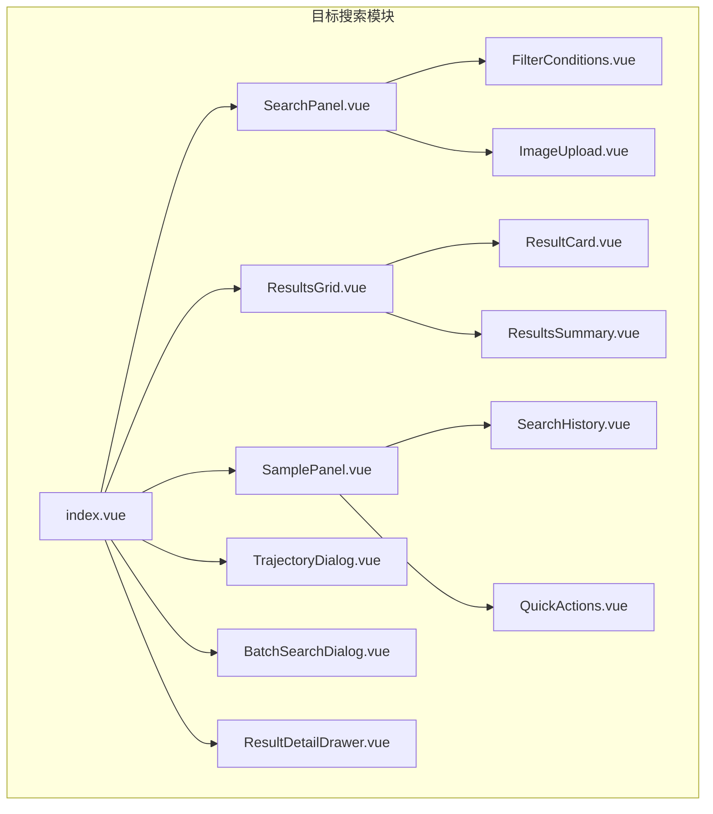
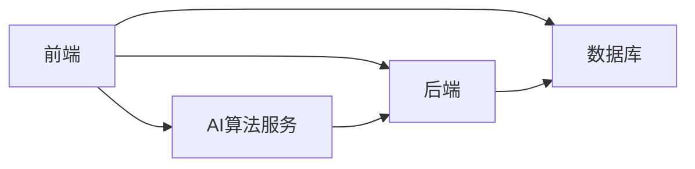
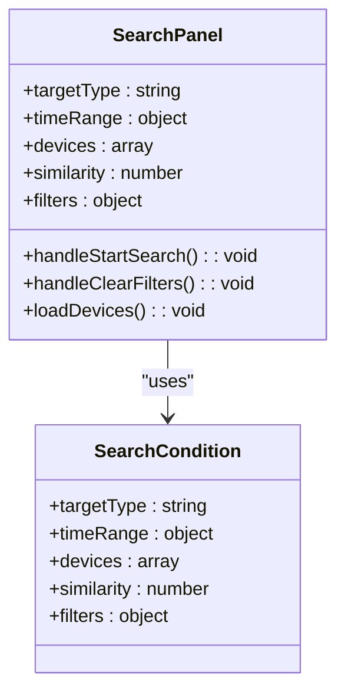
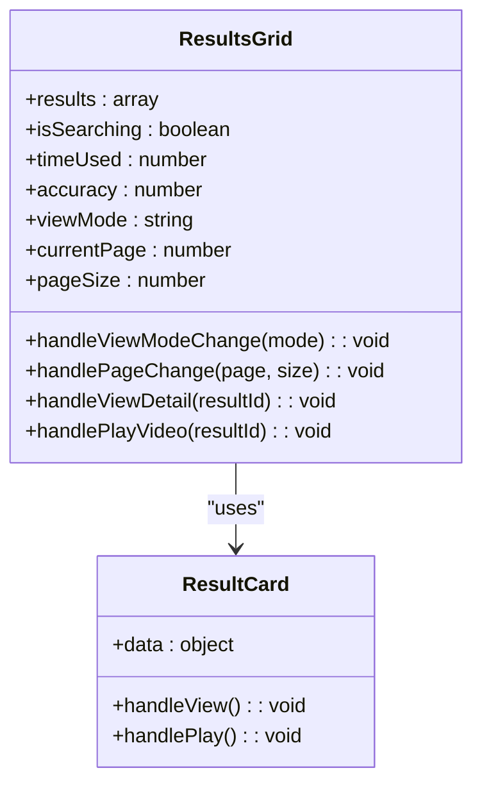
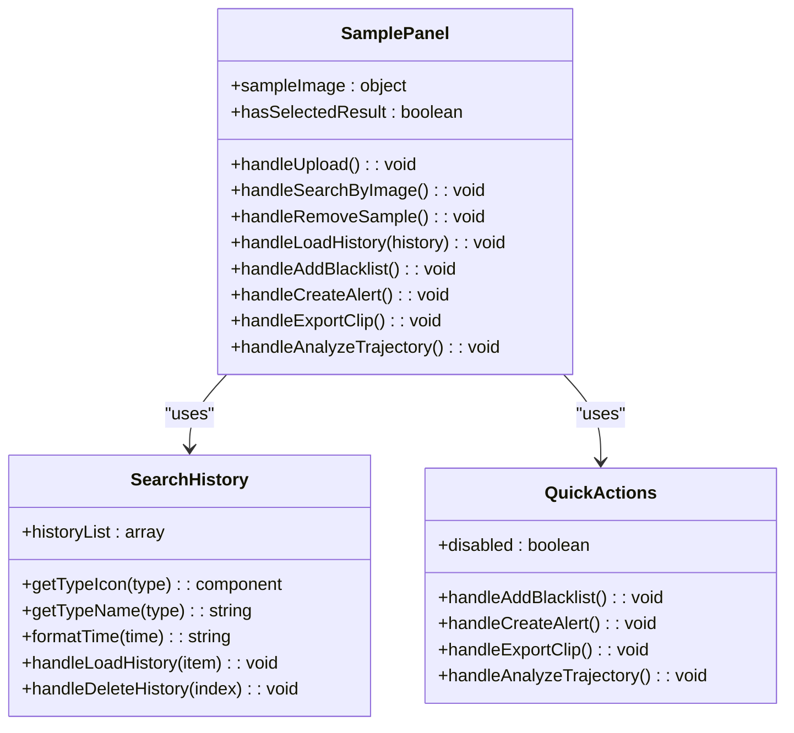
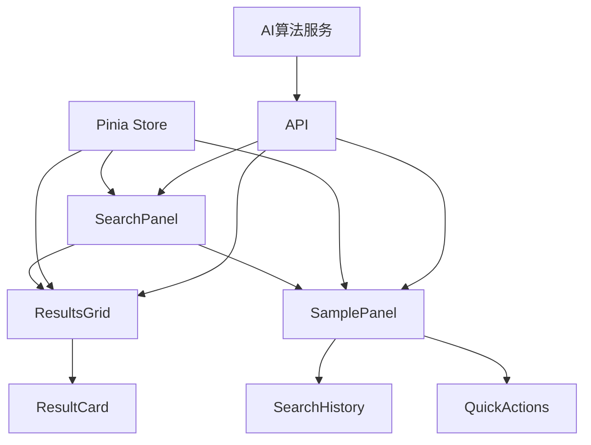

# 目标搜索

<cite>
**本文档引用文件**   
- [目标搜索页面功能布局文档_完善版.md](file://smart-admin-web-javascript\AI开发文档\目标搜索页面功能布局文档_完善版.md)
- [target-search-api.js](file://smart-admin-web-javascript\src\api\business\smart-video\target-search-api.js)
- [index.vue](file://smart-admin-web-javascript\src\views\business\smart-video\target-search\index.vue)
- [SearchPanel.vue](file://smart-admin-web-javascript\src\views\business\smart-video\target-search\components\SearchPanel.vue)
- [ResultsGrid.vue](file://smart-admin-web-javascript\src\views\business\smart-video\target-search\components\ResultsGrid.vue)
- [SamplePanel.vue](file://smart-admin-web-javascript\src\views\business\smart-video\target-search\components\SamplePanel.vue)
- [target-search.js](file://smart-admin-web-javascript\src\store\modules\target-search.js)
</cite>

## 目录
1. [引言](#引言)
2. [项目结构](#项目结构)
3. [核心组件](#核心组件)
4. [架构概述](#架构概述)
5. [详细组件分析](#详细组件分析)
6. [依赖分析](#依赖分析)
7. [性能考虑](#性能考虑)
8. [故障排除指南](#故障排除指南)
9. [结论](#结论)
10. [附录](#附录)（如有必要）

## 引言
目标搜索页面是智能视频监控系统的核心功能模块，用于基于目标属性和图片进行智能检索。该页面支持多种目标类型（人员、车辆、物体）的精准搜索，提供以图搜图、属性筛选、时空检索等功能，通过AI算法实现快速准确的目标定位和轨迹追踪。页面基于SmartAdmin前端框架构建，采用Vue3 + Ant Design Vue技术栈，提供直观的搜索界面、实时进度显示、多维度结果展示等功能。

## 项目结构
目标搜索功能的前端实现位于`smart-admin-web-javascript`项目中，采用模块化设计，将功能拆分为多个独立的组件。主要文件结构如下：

**图源**
- [index.vue](file://smart-admin-web-javascript\src\views\business\smart-video\target-search\index.vue)
- [SearchPanel.vue](file://smart-admin-web-javascript\src\views\business\smart-video\target-search\components\SearchPanel.vue)
- [ResultsGrid.vue](file://smart-admin-web-javascript\src\views\business\smart-video\target-search\components\ResultsGrid.vue)
- [SamplePanel.vue](file://smart-admin-web-javascript\src\views\business\smart-video\target-search\components\SamplePanel.vue)

**本节来源**
- [目标搜索页面功能布局文档_完善版.md](file://smart-admin-web-javascript\AI开发文档\目标搜索页面功能布局文档_完善版.md)

## 核心组件
目标搜索功能的核心组件包括左侧搜索面板、主内容区域和右侧面板。左侧搜索面板提供目标类型选择、时间范围选择、设备选择、相似度阈值和高级筛选等功能。主内容区域显示搜索进度和结果，支持网格视图和列表视图切换。右侧面板提供目标样本图片上传、搜索历史和快速操作功能。

**本节来源**
- [目标搜索页面功能布局文档_完善版.md](file://smart-admin-web-javascript\AI开发文档\目标搜索页面功能布局文档_完善版.md)
- [index.vue](file://smart-admin-web-javascript\src\views\business\smart-video\target-search\index.vue)

## 架构概述
目标搜索功能的架构分为前端和后端两部分。前端采用Vue3 + Ant Design Vue技术栈，使用Pinia进行状态管理，Axios进行HTTP请求。后端提供RESTful API接口，处理搜索请求、进度查询、结果获取等功能。前端通过API接口与后端通信，实现目标检索功能。

**图源**
- [目标搜索页面功能布局文档_完善版.md](file://smart-admin-web-javascript\AI开发文档\目标搜索页面功能布局文档_完善版.md)
- [target-search-api.js](file://smart-admin-web-javascript\src\api\business\smart-video\target-search-api.js)

## 详细组件分析

### 左侧搜索面板分析
左侧搜索面板组件（SearchPanel.vue）负责收集用户输入的搜索条件，包括目标类型、时间范围、设备选择、相似度阈值和高级筛选条件。组件使用Ant Design Vue的表单组件，提供直观的用户界面。

**图源**
- [SearchPanel.vue](file://smart-admin-web-javascript\src\views\business\smart-video\target-search\components\SearchPanel.vue)

**本节来源**
- [目标搜索页面功能布局文档_完善版.md](file://smart-admin-web-javascript\AI开发文档\目标搜索页面功能布局文档_完善版.md)

### 主内容区域分析
主内容区域组件（ResultsGrid.vue）负责显示搜索结果，支持网格视图和列表视图切换。组件使用Ant Design Vue的布局组件，提供灵活的显示方式。结果卡片组件（ResultCard.vue）显示每个搜索结果的缩略图、相似度、置信度、设备和时间信息。

**图源**
- [ResultsGrid.vue](file://smart-admin-web-javascript\src\views\business\smart-video\target-search\components\ResultsGrid.vue)
- [ResultCard.vue](file://smart-admin-web-javascript\src\views\business\smart-video\target-search\components\ResultCard.vue)

**本节来源**
- [目标搜索页面功能布局文档_完善版.md](file://smart-admin-web-javascript\AI开发文档\目标搜索页面功能布局文档_完善版.md)

### 右侧面板分析
右侧面板组件（SamplePanel.vue）负责目标样本图片的上传和管理。组件支持拖拽上传，提供图片预览功能。搜索历史组件（SearchHistory.vue）显示用户的历史搜索记录，支持加载历史搜索条件。快速操作组件（QuickActions.vue）提供加入黑名单、创建告警、导出片段和轨迹分析等快捷操作。

**图源**
- [SamplePanel.vue](file://smart-admin-web-javascript\src\views\business\smart-video\target-search\components\SamplePanel.vue)
- [SearchHistory.vue](file://smart-admin-web-javascript\src\views\business\smart-video\target-search\components\SearchHistory.vue)
- [QuickActions.vue](file://smart-admin-web-javascript\src\views\business\smart-video\target-search\components\QuickActions.vue)

**本节来源**
- [目标搜索页面功能布局文档_完善版.md](file://smart-admin-web-javascript\AI开发文档\目标搜索页面功能布局文档_完善版.md)

## 依赖分析
目标搜索功能依赖于多个前端组件和后端服务。前端组件之间通过props和events进行通信，状态管理使用Pinia。后端服务提供RESTful API接口，处理搜索请求、进度查询、结果获取等功能。AI算法服务负责目标特征提取和匹配。

**图源**
- [目标搜索页面功能布局文档_完善版.md](file://smart-admin-web-javascript\AI开发文档\目标搜索页面功能布局文档_完善版.md)
- [target-search.js](file://smart-admin-web-javascript\src\store\modules\target-search.js)
- [target-search-api.js](file://smart-admin-web-javascript\src\api\business\smart-video\target-search-api.js)

**本节来源**
- [目标搜索页面功能布局文档_完善版.md](file://smart-admin-web-javascript\AI开发文档\目标搜索页面功能布局文档_完善版.md)

## 性能考虑
目标搜索功能在性能方面需要考虑多个方面。首先，图片上传前需要进行压缩，减少传输时间和存储空间。其次，搜索结果数量过多时，需要使用分页或虚拟滚动，避免页面卡顿。此外，搜索条件变化时需要使用防抖，避免频繁请求后端服务。

**本节来源**
- [目标搜索页面功能布局文档_完善版.md](file://smart-admin-web-javascript\AI开发文档\目标搜索页面功能布局文档_完善版.md)

## 故障排除指南
目标搜索功能可能遇到的常见问题包括图片上传失败、搜索结果过多导致页面卡顿、搜索进度不准确和搜索历史过多导致存储溢出。针对这些问题，需要进行严格的文件校验、使用分页或虚拟滚动、结合真实进度和模拟进度以及限制历史记录数量。

**本节来源**
- [目标搜索页面功能布局文档_完善版.md](file://smart-admin-web-javascript\AI开发文档\目标搜索页面功能布局文档_完善版.md)

## 结论
目标搜索页面是智能视频监控系统的核心功能，通过AI算法实现快速准确的目标检索和轨迹追踪。在开发过程中需要特别注意图片处理、搜索进度、结果展示、用户体验和性能优化等方面。遵循本文档的规范和最佳实践，可以快速开发出高质量、高性能的目标搜索页面。

## 附录
### API接口定义
| 接口 | 方法 | 描述 |
| --- | --- | --- |
| /target-search/start | POST | 开始目标检索 |
| /target-search/image | POST | 以图搜图 |
| /target-search/progress/{taskId} | GET | 获取搜索进度 |
| /target-search/results/{taskId} | GET | 获取搜索结果 |
| /target-search/cancel/{taskId} | POST | 取消搜索 |
| /target-search/history | GET | 获取搜索历史 |
| /target-search/save-condition | POST | 保存搜索条件 |
| /target-search/history/delete/{id} | POST | 删除搜索历史 |
| /target-search/export | POST | 导出搜索结果 |
| /target-search/batch | POST | 批量检索 |
| /target-search/trajectory | POST | 获取轨迹数据 |
| /target-search/upload-sample | POST | 上传目标样本图片 |
| /target-search/devices | GET | 获取设备列表 |
| /target-search/areas | GET | 获取区域列表 |
| /target-search/blacklist/add | POST | 加入黑名单 |
| /target-search/alert/create | POST | 创建告警规则 |
| /target-search/video/export | POST | 导出视频片段 |

**本节来源**
- [目标搜索页面功能布局文档_完善版.md](file://smart-admin-web-javascript\AI开发文档\目标搜索页面功能布局文档_完善版.md)