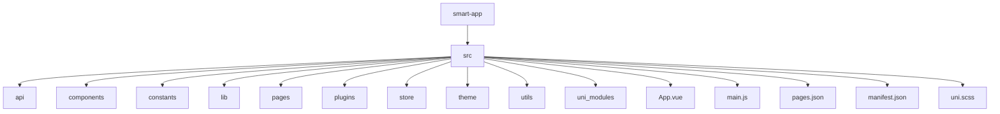
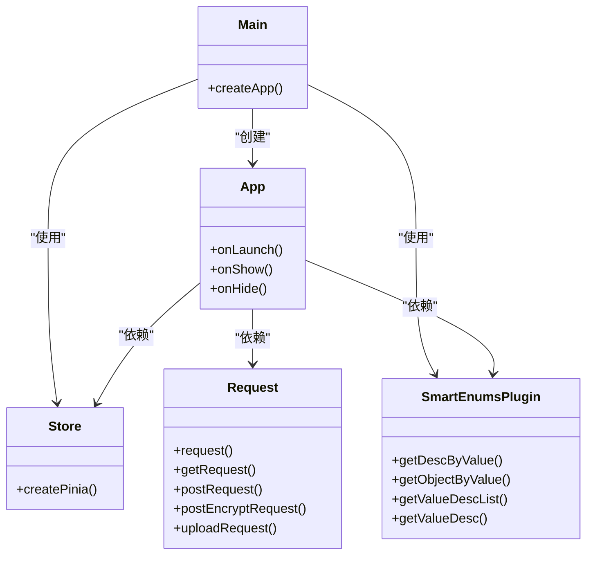
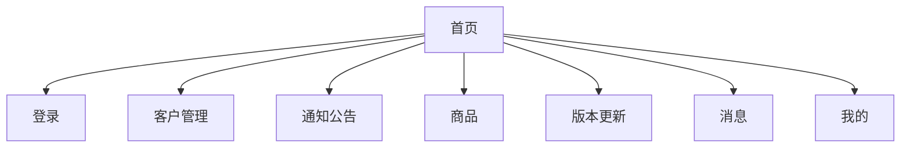
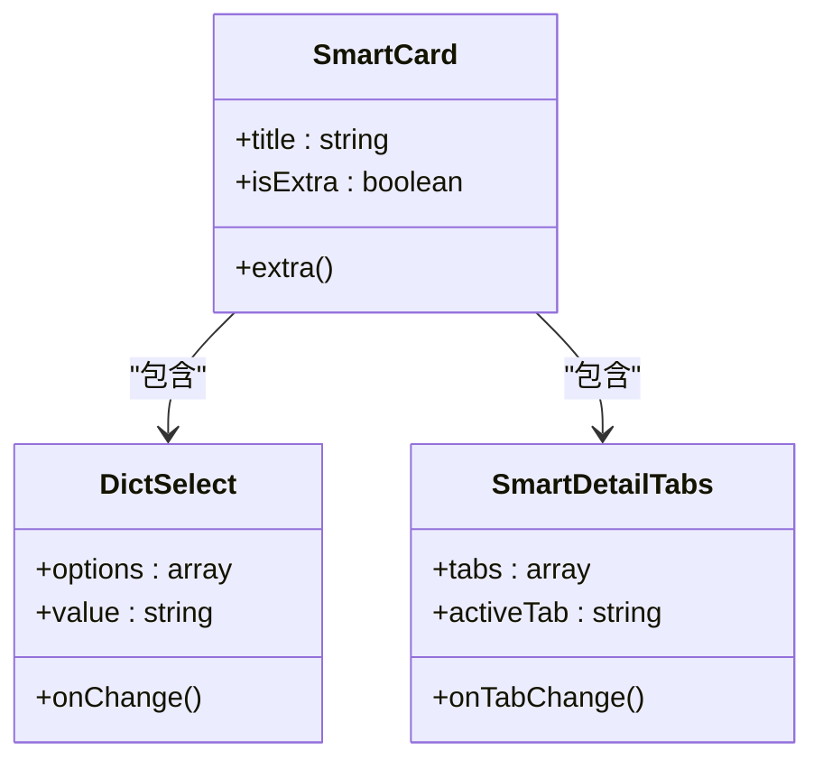
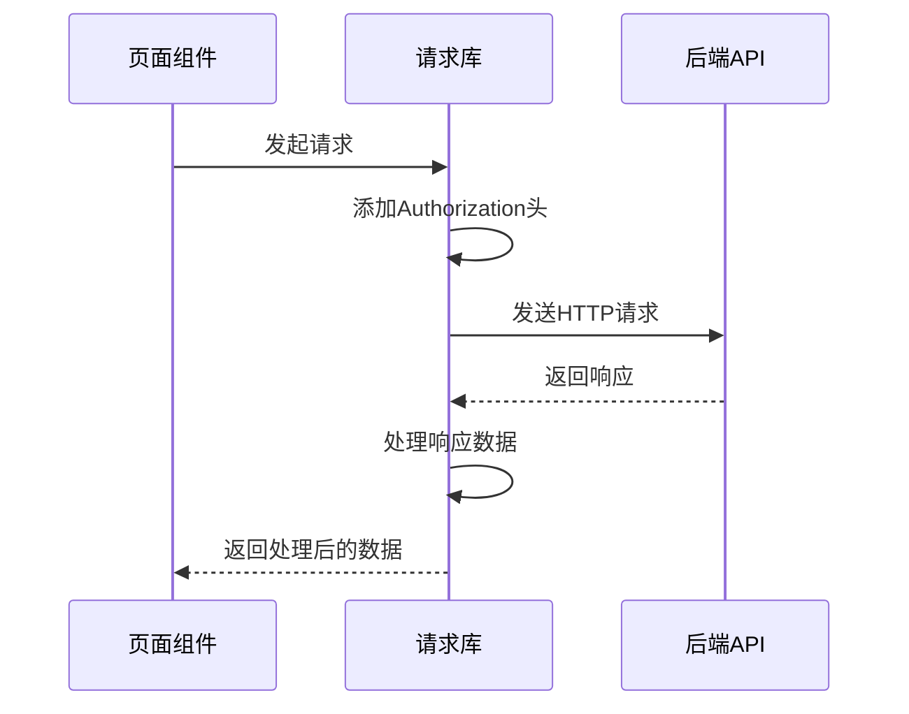
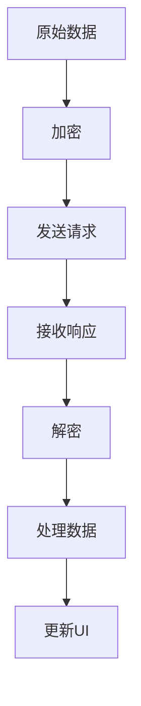
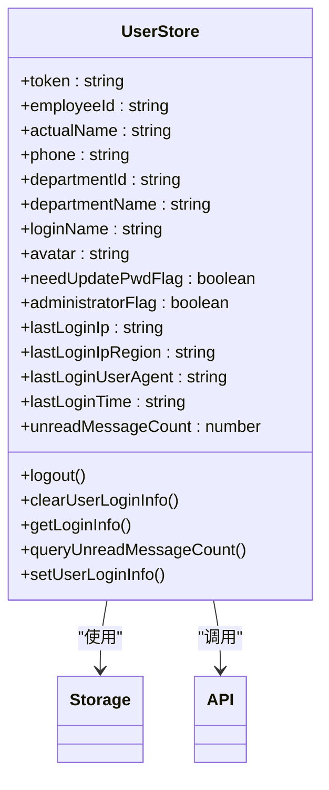
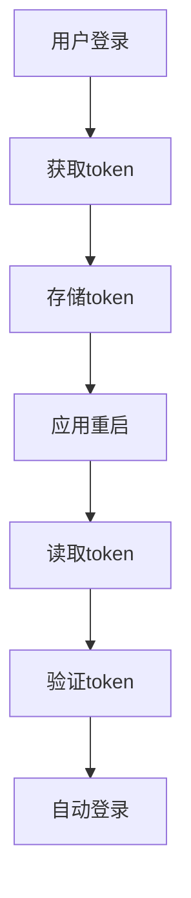
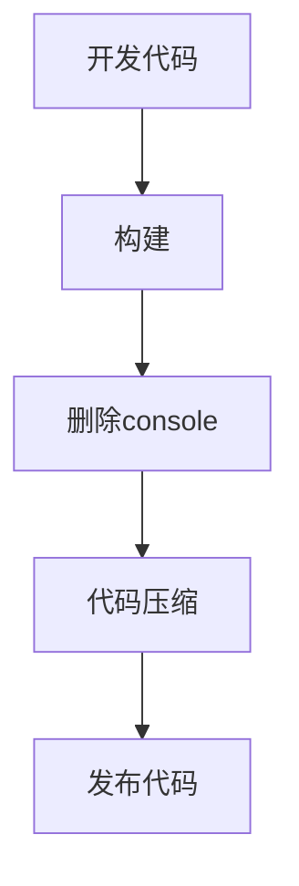
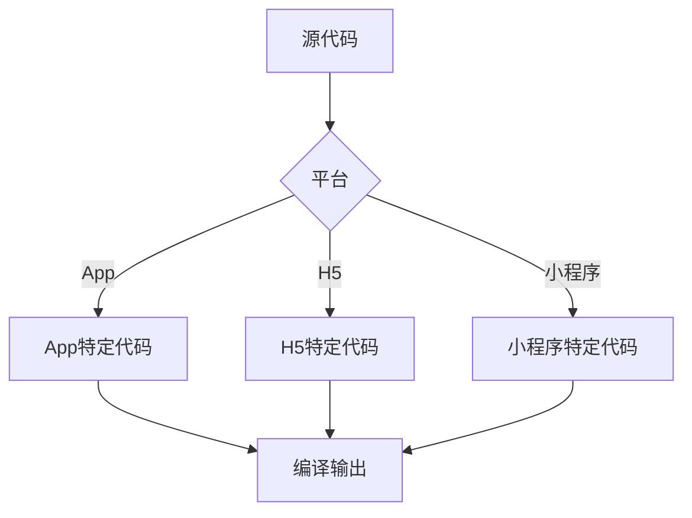

# 移动端应用

<cite>
**本文档引用的文件**  
- [main.js](file://smart-app/src/main.js)
- [App.vue](file://smart-app/src/App.vue)
- [package.json](file://smart-app/package.json)
- [vite.config.js](file://smart-app/vite.config.js)
- [pages.json](file://smart-app/src/pages.json)
- [store/index.js](file://smart-app/src/store/index.js)
- [store/modules/system/user.js](file://smart-app/src/store/modules/system/user.js)
- [lib/smart-request.js](file://smart-app/src/lib/smart-request.js)
- [plugins/smart-enums-plugin.js](file://smart-app/src/plugins/smart-enums-plugin.js)
- [constants/index.js](file://smart-app/src/constants/index.js)
- [pages/home/index.vue](file://smart-app/src/pages/home/index.vue)
- [pages/login/login.vue](file://smart-app/src/pages/login/login.vue)
- [components/smart-card/index.vue](file://smart-app/src/components/smart-card/index.vue)
- [utils/str-util.js](file://smart-app/src/utils/str-util.js)
- [manifest.json](file://smart-app/src/manifest.json)
</cite>

## 目录
1. [简介](#简介)
2. [项目结构](#项目结构)
3. [核心架构](#核心架构)
4. [页面结构与组件](#页面结构与组件)
5. [API交互机制](#api交互机制)
6. [移动端特有功能](#移动端特有功能)
7. [性能优化策略](#性能优化策略)
8. [多端适配方案](#多端适配方案)
9. [开发与调试指南](#开发与调试指南)

## 简介
本文档详细介绍了基于uni-app框架的smart-app移动端应用的架构和实现。文档重点阐述了一次开发多端运行的实现机制，深入分析了移动端的页面结构、组件使用、API交互方式以及特有的功能实现。同时，文档还提供了性能优化策略、多端适配方案以及开发调试指南，为移动端开发者提供完整的开发支持。

## 项目结构
smart-app项目采用uni-app框架构建，实现了跨平台移动应用开发。项目结构清晰，遵循模块化设计原则，主要包含API接口、组件、常量、库文件、页面、插件、状态管理、主题、工具和uni_modules等目录。



**Diagram sources**
- [package.json](file://smart-app/package.json)
- [pages.json](file://smart-app/src/pages.json)
- [manifest.json](file://smart-app/src/manifest.json)

**Section sources**
- [package.json](file://smart-app/package.json)
- [pages.json](file://smart-app/src/pages.json)
- [manifest.json](file://smart-app/src/manifest.json)

## 核心架构
smart-app项目基于uni-app框架构建，采用Vue 3和Pinia状态管理，实现了跨平台移动应用开发。项目架构主要包括应用入口、状态管理、请求封装、插件系统和配置管理等核心组件。



**Diagram sources**
- [main.js](file://smart-app/src/main.js)
- [App.vue](file://smart-app/src/App.vue)
- [store/index.js](file://smart-app/src/store/index.js)
- [lib/smart-request.js](file://smart-app/src/lib/smart-request.js)
- [plugins/smart-enums-plugin.js](file://smart-app/src/plugins/smart-enums-plugin.js)

**Section sources**
- [main.js](file://smart-app/src/main.js)
- [App.vue](file://smart-app/src/App.vue)
- [store/index.js](file://smart-app/src/store/index.js)
- [lib/smart-request.js](file://smart-app/src/lib/smart-request.js)
- [plugins/smart-enums-plugin.js](file://smart-app/src/plugins/smart-enums-plugin.js)

## 页面结构与组件
smart-app项目采用模块化的页面结构设计，每个页面由多个可复用的组件构成。项目使用uni-ui组件库，并结合自定义组件，实现了丰富的用户界面。

### 页面配置
pages.json文件定义了应用的页面路由、导航栏样式和底部标签栏。应用包含首页、登录、客户管理、通知公告、商品、版本更新、消息、表单、选择人员、列表和运单详情等多个页面。



**Diagram sources**
- [pages.json](file://smart-app/src/pages.json)

### 组件使用
项目使用uni-ui组件库，并通过easycom方式自动导入组件。同时，项目还定义了多个自定义组件，如smart-card、dict-select、smart-detail-tabs等。



**Diagram sources**
- [components/smart-card/index.vue](file://smart-app/src/components/smart-card/index.vue)
- [components/dict-select/index.vue](file://smart-app/src/components/dict-select/index.vue)
- [components/smart-detail-tabs/index.vue](file://smart-app/src/components/smart-detail-tabs/index.vue)

**Section sources**
- [pages.json](file://smart-app/src/pages.json)
- [components/smart-card/index.vue](file://smart-app/src/components/smart-card/index.vue)

## API交互机制
smart-app项目通过封装的请求库与后端API进行交互，实现了安全、高效的数据通信。请求封装支持普通请求、加密请求和文件上传等多种方式。

### 请求封装
项目在lib/smart-request.js中封装了统一的请求方法，包括GET、POST、加密POST和文件上传等。请求封装自动处理token认证、响应处理和错误处理。



**Diagram sources**
- [lib/smart-request.js](file://smart-app/src/lib/smart-request.js)

### 数据处理
项目通过加密解密机制保护敏感数据。在发送请求前，敏感数据会被加密；在接收响应后，加密数据会被解密。



**Diagram sources**
- [lib/smart-request.js](file://smart-app/src/lib/smart-request.js)
- [lib/encrypt.js](file://smart-app/src/lib/encrypt.js)

**Section sources**
- [lib/smart-request.js](file://smart-app/src/lib/smart-request.js)

## 移动端特有功能
smart-app项目实现了多种移动端特有功能，包括本地存储、状态管理、消息推送等，提升了用户体验。

### 状态管理
项目使用Pinia进行状态管理，实现了用户登录信息的全局管理。用户登录后，token和用户信息会被存储在本地，并在应用启动时自动加载。



**Diagram sources**
- [store/modules/system/user.js](file://smart-app/src/store/modules/system/user.js)

### 本地存储
项目使用uni.setStorageSync和uni.getStorageSync方法进行本地存储，实现了用户token的持久化存储。



**Diagram sources**
- [store/modules/system/user.js](file://smart-app/src/store/modules/system/user.js)

**Section sources**
- [store/modules/system/user.js](file://smart-app/src/store/modules/system/user.js)

## 性能优化策略
smart-app项目采用了多种性能优化策略，包括启动速度优化、内存管理和代码压缩等，确保应用的流畅运行。

### 启动速度优化
项目通过以下方式优化启动速度：
- 使用SSR模式创建应用
- 延迟加载非关键组件
- 优化图片资源

### 内存管理
项目通过以下方式优化内存管理：
- 使用Pinia进行状态管理
- 及时清理无用数据
- 避免内存泄漏

### 代码压缩
项目在vite.config.js中配置了代码压缩，发布时会自动删除console语句并压缩代码。



**Diagram sources**
- [vite.config.js](file://smart-app/vite.config.js)

**Section sources**
- [vite.config.js](file://smart-app/vite.config.js)

## 多端适配方案
smart-app项目基于uni-app框架，实现了H5、小程序、App等多端适配。项目通过条件编译和平台特定配置，确保在不同平台上的一致性体验。

### 平台支持
项目支持以下平台：
- App (Android/iOS)
- H5
- 微信小程序
- 支付宝小程序
- 百度小程序
- 字节跳动小程序

### 条件编译
项目使用uni-app的条件编译功能，针对不同平台编写特定代码。



**Diagram sources**
- [manifest.json](file://smart-app/src/manifest.json)

**Section sources**
- [manifest.json](file://smart-app/src/manifest.json)

## 开发与调试指南
本节提供smart-app项目的开发和调试指南，帮助开发者快速上手。

### 开发环境
项目使用Vite作为构建工具，支持热重载和快速构建。开发者可以通过以下命令启动不同平台的开发服务器：

```bash
# 开发App
npm run dev:app

# 开发H5
npm run dev:h5

# 开发微信小程序
npm run dev:mp-weixin
```

### 调试技巧
- 使用uni-app开发者工具进行调试
- 利用console.log进行日志输出
- 使用uni.showToast显示提示信息
- 通过网络面板监控API请求

**Section sources**
- [package.json](file://smart-app/package.json)