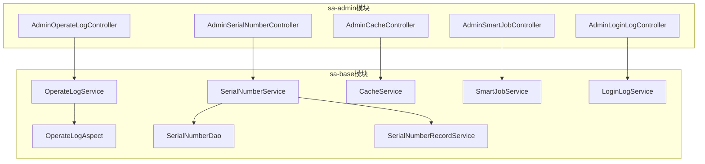
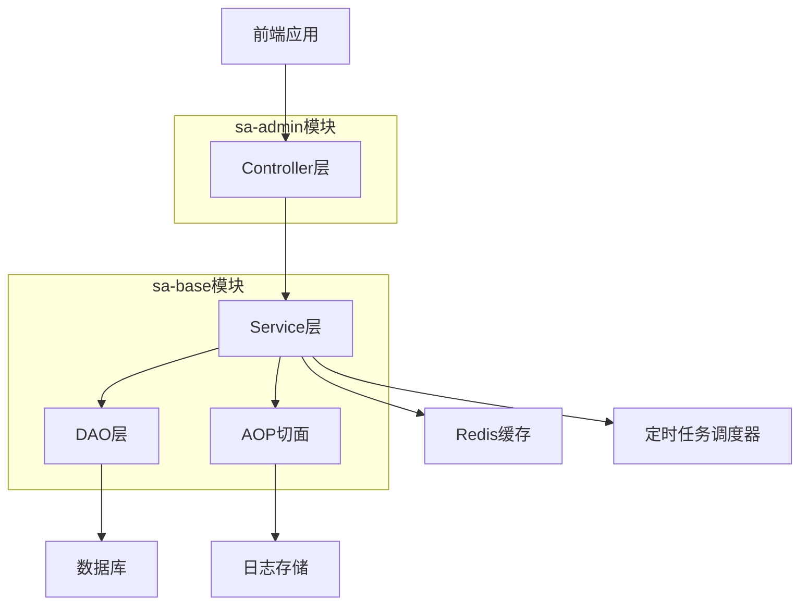
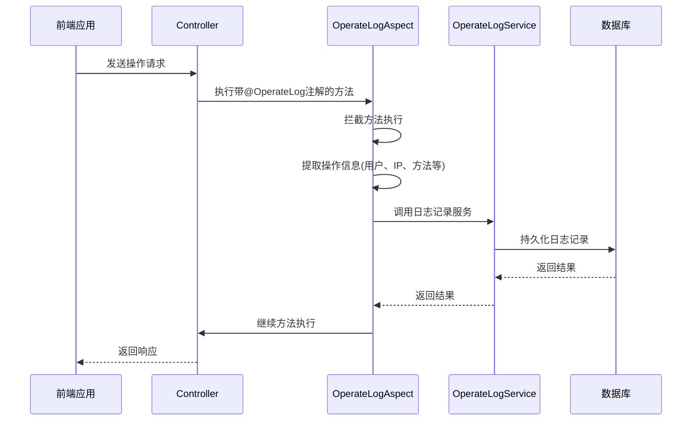
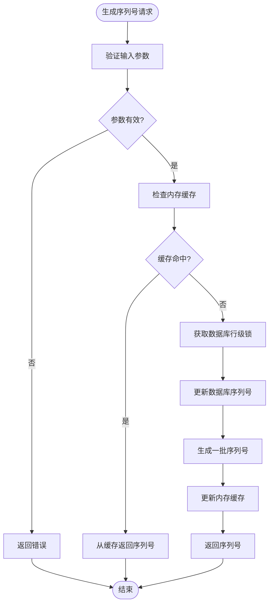
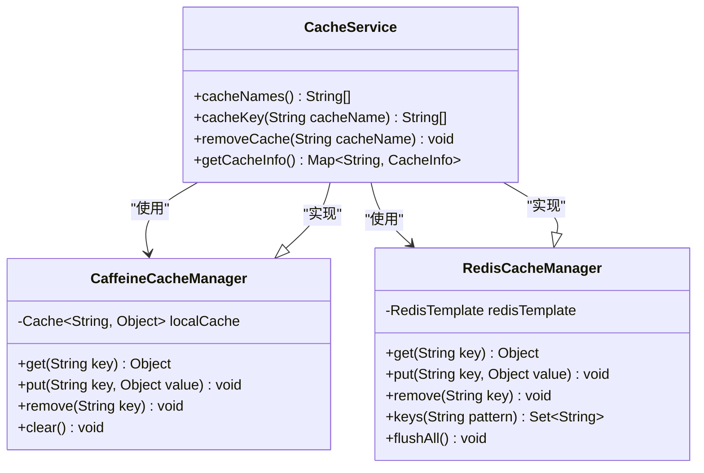
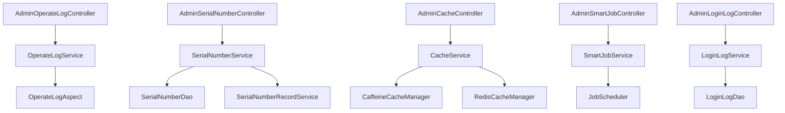

# 系统支持模块(support)

<cite>
**本文档中引用的文件**  
- [AdminOperateLogController.java](file://smart-admin-api-java17-springboot3/sa-admin/src/main/java/net/lab1024/sa/admin/module/system/support/AdminOperateLogController.java)
- [AdminSerialNumberController.java](file://smart-admin-api-java17-springboot3/sa-admin/src/main/java/net/lab1024/sa/admin/module/system/support/AdminSerialNumberController.java)
- [AdminCacheController.java](file://smart-admin-api-java17-springboot3/sa-admin/src/main/java/net/lab1024/sa/admin/module/system/support/AdminCacheController.java)
- [AdminSmartJobController.java](file://smart-admin-api-java17-springboot3/sa-admin/src/main/java/net/lab1024/sa/admin/module/system/support/AdminSmartJobController.java)
- [AdminLoginLogController.java](file://smart-admin-api-java17-springboot3/sa-admin/src/main/java/net/lab1024/sa/admin/module/system/support/AdminLoginLogController.java)
- [OperateLogService.java](file://smart-admin-api-java17-springboot3/sa-base/src/main/java/net/lab1024/sa/base/module/support/operatelog/OperateLogService.java)
- [SerialNumberService.java](file://smart-admin-api-java17-springboot3/sa-base/src/main/java/net/lab1024/sa/base/module/support/serialnumber/service/SerialNumberService.java)
- [CacheService.java](file://smart-admin-api-java17-springboot3/sa-base/src/main/java/net/lab1024/sa/base/module/support/cache/CacheService.java)
- [SmartJobService.java](file://smart-admin-api-java17-springboot3/sa-base/src/main/java/net/lab1024/sa/base/module/support/job/api/SmartJobService.java)
- [LoginLogService.java](file://smart-admin-api-java17-springboot3/sa-base/src/main/java/net/lab1024/sa/base/module/support/loginlog/LoginLogService.java)
- [OperateLogAspect.java](file://smart-admin-api-java17-springboot3/sa-base/src/main/java/net/lab1024/sa/base/module/support/operatelog/OperateLogAspect.java)
- [CacheConfig.java](file://smart-admin-api-java17-springboot3/sa-base/src/main/java/net/lab1024/sa/base/config/CacheConfig.java)
- [RedisConfig.java](file://smart-admin-api-java17-springboot3/sa-base/src/main/java/net/lab1024/sa/base/config/RedisConfig.java)
- [SerialNumberDao.java](file://smart-admin-api-java17-springboot3/sa-base/src/main/java/net/lab1024/sa/base/module/support/serialnumber/dao/SerialNumberDao.java)
- [SerialNumberRecordService.java](file://smart-admin-api-java17-springboot3/sa-base/src/main/java/net/lab1024/sa/base/module/support/serialnumber/service/SerialNumberRecordService.java)
</cite>

## 目录
1. [简介](#简介)
2. [项目结构](#项目结构)
3. [核心组件](#核心组件)
4. [架构概述](#架构概述)
5. [详细组件分析](#详细组件分析)
6. [依赖分析](#依赖分析)
7. [性能考虑](#性能考虑)
8. [故障排除指南](#故障排除指南)
9. [结论](#结论)

## 简介
系统支持模块是smart-admin系统中的关键支撑组件，提供了一系列非功能性需求的技术实现。该模块通过独立的Controller提供管理接口，与sa-base基础模块中的服务进行集成，实现了操作日志、登录日志、定时任务、序列号生成、缓存管理、配置中心和数据变更追踪等核心功能。本文档详细介绍了这些功能的技术实现原理，重点分析了操作日志注解的工作机制、序列号生成服务的高并发处理能力以及多级缓存管理的监控与操作。

## 项目结构
系统支持模块采用分层架构设计，将API接口、业务逻辑、数据访问和AOP切面分离，确保了代码的可维护性和扩展性。控制器位于sa-admin模块中，而核心服务和数据访问组件位于sa-base模块中，实现了功能的解耦。

**图源**  
- [AdminOperateLogController.java](file://smart-admin-api-java17-springboot3/sa-admin/src/main/java/net/lab1024/sa/admin/module/system/support/AdminOperateLogController.java)
- [AdminSerialNumberController.java](file://smart-admin-api-java17-springboot3/sa-admin/src/main/java/net/lab1024/sa/admin/module/system/support/AdminSerialNumberController.java)
- [AdminCacheController.java](file://smart-admin-api-java17-springboot3/sa-admin/src/main/java/net/lab1024/sa/admin/module/system/support/AdminCacheController.java)
- [AdminSmartJobController.java](file://smart-admin-api-java17-springboot3/sa-admin/src/main/java/net/lab1024/sa/admin/module/system/support/AdminSmartJobController.java)
- [AdminLoginLogController.java](file://smart-admin-api-java17-springboot3/sa-admin/src/main/java/net/lab1024/sa/admin/module/system/support/AdminLoginLogController.java)
- [OperateLogService.java](file://smart-admin-api-java17-springboot3/sa-base/src/main/java/net/lab1024/sa/base/module/support/operatelog/OperateLogService.java)
- [SerialNumberService.java](file://smart-admin-api-java17-springboot3/sa-base/src/main/java/net/lab1024/sa/base/module/support/serialnumber/service/SerialNumberService.java)
- [CacheService.java](file://smart-admin-api-java17-springboot3/sa-base/src/main/java/net/lab1024/sa/base/module/support/cache/CacheService.java)
- [SmartJobService.java](file://smart-admin-api-java17-springboot3/sa-base/src/main/java/net/lab1024/sa/base/module/support/job/api/SmartJobService.java)
- [LoginLogService.java](file://smart-admin-api-java17-springboot3/sa-base/src/main/java/net/lab1024/sa/base/module/support/loginlog/LoginLogService.java)

**章节源**  
- [AdminOperateLogController.java](file://smart-admin-api-java17-springboot3/sa-admin/src/main/java/net/lab1024/sa/admin/module/system/support/AdminOperateLogController.java)
- [AdminSerialNumberController.java](file://smart-admin-api-java17-springboot3/sa-admin/src/main/java/net/lab1024/sa/admin/module/system/support/AdminSerialNumberController.java)
- [AdminCacheController.java](file://smart-admin-api-java17-springboot3/sa-admin/src/main/java/net/lab1024/sa/admin/module/system/support/AdminCacheController.java)
- [AdminSmartJobController.java](file://smart-admin-api-java17-springboot3/sa-admin/src/main/java/net/lab1024/sa/admin/module/system/support/AdminSmartJobController.java)
- [AdminLoginLogController.java](file://smart-admin-api-java17-springboot3/sa-admin/src/main/java/net/lab1024/sa/admin/module/system/support/AdminLoginLogController.java)

## 核心组件
系统支持模块的核心组件包括操作日志、序列号生成、缓存管理、定时任务和登录日志等服务。这些组件通过统一的Controller层暴露RESTful API接口，为前端应用提供管理功能。所有控制器都继承自SupportBaseController，实现了统一的异常处理和响应格式。

操作日志组件通过AOP切面自动记录用户操作，序列号生成服务保证了高并发下的唯一性，缓存管理组件支持多级缓存（Caffeine+Redis）的监控与操作，定时任务组件提供了灵活的任务调度能力，登录日志组件则记录了用户的登录行为。

**章节源**  
- [OperateLogService.java](file://smart-admin-api-java17-springboot3/sa-base/src/main/java/net/lab1024/sa/base/module/support/operatelog/OperateLogService.java)
- [SerialNumberService.java](file://smart-admin-api-java17-springboot3/sa-base/src/main/java/net/lab1024/sa/base/module/support/serialnumber/service/SerialNumberService.java)
- [CacheService.java](file://smart-admin-api-java17-springboot3/sa-base/src/main/java/net/lab1024/sa/base/module/support/cache/CacheService.java)
- [SmartJobService.java](file://smart-admin-api-java17-springboot3/sa-base/src/main/java/net/lab1024/sa/base/module/support/job/api/SmartJobService.java)
- [LoginLogService.java](file://smart-admin-api-java17-springboot3/sa-base/src/main/java/net/lab1024/sa/base/module/support/loginlog/LoginLogService.java)

## 架构概述
系统支持模块采用典型的分层架构，包括Controller层、Service层、DAO层和AOP切面层。Controller层负责接收HTTP请求并返回响应，Service层实现核心业务逻辑，DAO层负责数据持久化操作，AOP切面层则处理横切关注点如日志记录。

**图源**  
- [AdminOperateLogController.java](file://smart-admin-api-java17-springboot3/sa-admin/src/main/java/net/lab1024/sa/admin/module/system/support/AdminOperateLogController.java)
- [OperateLogService.java](file://smart-admin-api-java17-springboot3/sa-base/src/main/java/net/lab1024/sa/base/module/support/operatelog/OperateLogService.java)
- [OperateLogAspect.java](file://smart-admin-api-java17-springboot3/sa-base/src/main/java/net/lab1024/sa/base/module/support/operatelog/OperateLogAspect.java)

## 详细组件分析

### 操作日志组件分析
操作日志组件通过AOP（面向切面编程）技术实现，自动记录用户的操作行为。该组件的核心是OperateLogAspect切面，它拦截标记了@OperateLog注解的方法，提取操作信息并持久化到数据库。

**图源**  
- [OperateLogAspect.java](file://smart-admin-api-java17-springboot3/sa-base/src/main/java/net/lab1024/sa/base/module/support/operatelog/OperateLogAspect.java)
- [OperateLogService.java](file://smart-admin-api-java17-springboot3/sa-base/src/main/java/net/lab1024/sa/base/module/support/operatelog/OperateLogService.java)

**章节源**  
- [OperateLogAspect.java](file://smart-admin-api-java17-springboot3/sa-base/src/main/java/net/lab1024/sa/base/module/support/operatelog/OperateLogAspect.java)
- [OperateLogService.java](file://smart-admin-api-java17-springboot3/sa-base/src/main/java/net/lab1024/sa/base/module/support/operatelog/OperateLogService.java)

### 序列号生成组件分析
序列号生成组件设计用于在高并发环境下保证序列号的唯一性和高性能。该组件通过数据库行级锁和内存缓存相结合的方式，实现了高效的序列号生成机制。

**图源**  
- [SerialNumberService.java](file://smart-admin-api-java17-springboot3/sa-base/src/main/java/net/lab1024/sa/base/module/support/serialnumber/service/SerialNumberService.java)
- [SerialNumberDao.java](file://smart-admin-api-java17-springboot3/sa-base/src/main/java/net/lab1024/sa/base/module/support/serialnumber/dao/SerialNumberDao.java)
- [SerialNumberRecordService.java](file://smart-admin-api-java17-springboot3/sa-base/src/main/java/net/lab1024/sa/base/module/support/serialnumber/service/SerialNumberRecordService.java)

**章节源**  
- [SerialNumberService.java](file://smart-admin-api-java17-springboot3/sa-base/src/main/java/net/lab1024/sa/base/module/support/serialnumber/service/SerialNumberService.java)
- [SerialNumberDao.java](file://smart-admin-api-java17-springboot3/sa-base/src/main/java/net/lab1024/sa/base/module/support/serialnumber/dao/SerialNumberDao.java)
- [SerialNumberRecordService.java](file://smart-admin-api-java17-springboot3/sa-base/src/main/java/net/lab1024/sa/base/module/support/serialnumber/service/SerialNumberRecordService.java)

### 缓存管理组件分析
缓存管理组件支持多级缓存架构（Caffeine+Redis），提供了对缓存的全面监控和管理功能。该组件通过统一的CacheService接口，实现了对本地缓存和分布式缓存的统一操作。

**图源**  
- [CacheService.java](file://smart-admin-api-java17-springboot3/sa-base/src/main/java/net/lab1024/sa/base/module/support/cache/CacheService.java)
- [CacheConfig.java](file://smart-admin-api-java17-springboot3/sa-base/src/main/java/net/lab1024/sa/base/config/CacheConfig.java)
- [RedisConfig.java](file://smart-admin-api-java17-springboot3/sa-base/src/main/java/net/lab1024/sa/base/config/RedisConfig.java)

**章节源**  
- [CacheService.java](file://smart-admin-api-java17-springboot3/sa-base/src/main/java/net/lab1024/sa/base/module/support/cache/CacheService.java)
- [CacheConfig.java](file://smart-admin-api-java17-springboot3/sa-base/src/main/java/net/lab1024/sa/base/config/CacheConfig.java)
- [RedisConfig.java](file://smart-admin-api-java17-springboot3/sa-base/src/main/java/net/lab1024/sa/base/config/RedisConfig.java)

## 依赖分析
系统支持模块的组件之间存在清晰的依赖关系。Controller层依赖于Service层，Service层依赖于DAO层和外部服务。AOP切面作为横切关注点，被多个Service组件所使用。

**图源**  
- [AdminOperateLogController.java](file://smart-admin-api-java17-springboot3/sa-admin/src/main/java/net/lab1024/sa/admin/module/system/support/AdminOperateLogController.java)
- [AdminSerialNumberController.java](file://smart-admin-api-java17-springboot3/sa-admin/src/main/java/net/lab1024/sa/admin/module/system/support/AdminSerialNumberController.java)
- [AdminCacheController.java](file://smart-admin-api-java17-springboot3/sa-admin/src/main/java/net/lab1024/sa/admin/module/system/support/AdminCacheController.java)
- [AdminSmartJobController.java](file://smart-admin-api-java17-springboot3/sa-admin/src/main/java/net/lab1024/sa/admin/module/system/support/AdminSmartJobController.java)
- [AdminLoginLogController.java](file://smart-admin-api-java17-springboot3/sa-admin/src/main/java/net/lab1024/sa/admin/module/system/support/AdminLoginLogController.java)
- [OperateLogService.java](file://smart-admin-api-java17-springboot3/sa-base/src/main/java/net/lab1024/sa/base/module/support/operatelog/OperateLogService.java)
- [SerialNumberService.java](file://smart-admin-api-java17-springboot3/sa-base/src/main/java/net/lab1024/sa/base/module/support/serialnumber/service/SerialNumberService.java)
- [CacheService.java](file://smart-admin-api-java17-springboot3/sa-base/src/main/java/net/lab1024/sa/base/module/support/cache/CacheService.java)
- [SmartJobService.java](file://smart-admin-api-java17-springboot3/sa-base/src/main/java/net/lab1024/sa/base/module/support/job/api/SmartJobService.java)
- [LoginLogService.java](file://smart-admin-api-java17-springboot3/sa-base/src/main/java/net/lab1024/sa/base/module/support/loginlog/LoginLogService.java)

**章节源**  
- [AdminOperateLogController.java](file://smart-admin-api-java17-springboot3/sa-admin/src/main/java/net/lab1024/sa/admin/module/system/support/AdminOperateLogController.java)
- [AdminSerialNumberController.java](file://smart-admin-api-java17-springboot3/sa-admin/src/main/java/net/lab1024/sa/admin/module/system/support/AdminSerialNumberController.java)
- [AdminCacheController.java](file://smart-admin-api-java17-springboot3/sa-admin/src/main/java/net/lab1024/sa/admin/module/system/support/AdminCacheController.java)
- [AdminSmartJobController.java](file://smart-admin-api-java17-springboot3/sa-admin/src/main/java/net/lab1024/sa/admin/module/system/support/AdminSmartJobController.java)
- [AdminLoginLogController.java](file://smart-admin-api-java17-springboot3/sa-admin/src/main/java/net/lab1024/sa/admin/module/system/support/AdminLoginLogController.java)

## 性能考虑
系统支持模块在设计时充分考虑了性能因素。操作日志采用异步记录方式，避免阻塞主业务流程；序列号生成使用数据库行级锁和内存缓存预生成机制，确保高并发下的性能和唯一性；缓存管理支持多级缓存架构，有效降低数据库压力；定时任务采用分布式调度机制，确保任务执行的可靠性和可扩展性。

对于高并发场景，系统通过以下方式优化性能：
1. 操作日志异步化：使用线程池异步处理日志记录
2. 序列号批量生成：一次性生成多个序列号放入缓存
3. 多级缓存：结合本地缓存（Caffeine）和分布式缓存（Redis）
4. 数据库连接池：使用高性能连接池管理数据库连接
5. 接口权限缓存：缓存用户权限信息，减少数据库查询

## 故障排除指南
当系统支持模块出现问题时，可以按照以下步骤进行排查：

1. **操作日志未记录**：检查方法是否正确标记@OperateLog注解，确认AOP切面是否正常加载
2. **序列号重复**：检查数据库行级锁是否正常工作，确认序列号生成逻辑是否被并发调用
3. **缓存无法清除**：检查缓存名称是否正确，确认Redis连接是否正常
4. **定时任务不执行**：检查任务调度器是否正常运行，确认任务配置是否正确
5. **登录日志缺失**：检查登录流程是否正常触发日志记录，确认数据库连接是否正常

**章节源**  
- [OperateLogAspect.java](file://smart-admin-api-java17-springboot3/sa-base/src/main/java/net/lab1024/sa/base/module/support/operatelog/OperateLogAspect.java)
- [SerialNumberService.java](file://smart-admin-api-java17-springboot3/sa-base/src/main/java/net/lab1024/sa/base/module/support/serialnumber/service/SerialNumberService.java)
- [CacheService.java](file://smart-admin-api-java17-springboot3/sa-base/src/main/java/net/lab1024/sa/base/module/support/cache/CacheService.java)
- [SmartJobService.java](file://smart-admin-api-java17-springboot3/sa-base/src/main/java/net/lab1024/sa/base/module/support/job/api/SmartJobService.java)
- [LoginLogService.java](file://smart-admin-api-java17-springboot3/sa-base/src/main/java/net/lab1024/sa/base/module/support/loginlog/LoginLogService.java)

## 结论
系统支持模块通过精心设计的架构和实现，为smart-admin系统提供了稳定可靠的支撑功能。操作日志的AOP实现机制确保了日志记录的透明性和完整性，序列号生成服务的高并发处理能力保证了业务的连续性，多级缓存管理架构有效提升了系统性能。这些非功能性需求的实现，不仅增强了系统的可维护性和可扩展性，也为用户提供了更好的使用体验。未来可以考虑引入更先进的分布式锁机制和更智能的缓存策略，进一步提升系统的性能和可靠性。