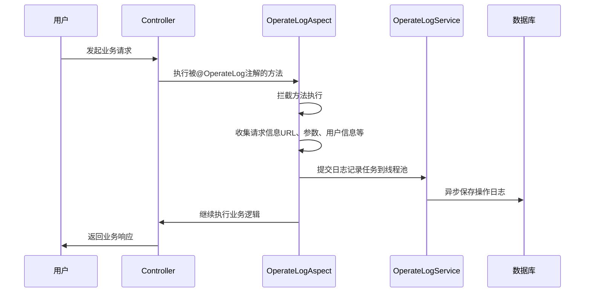
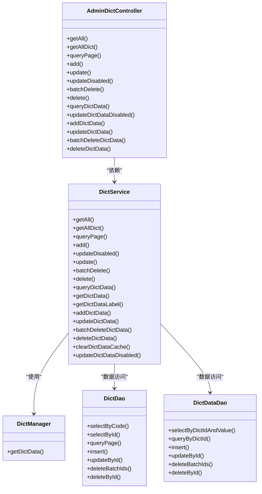
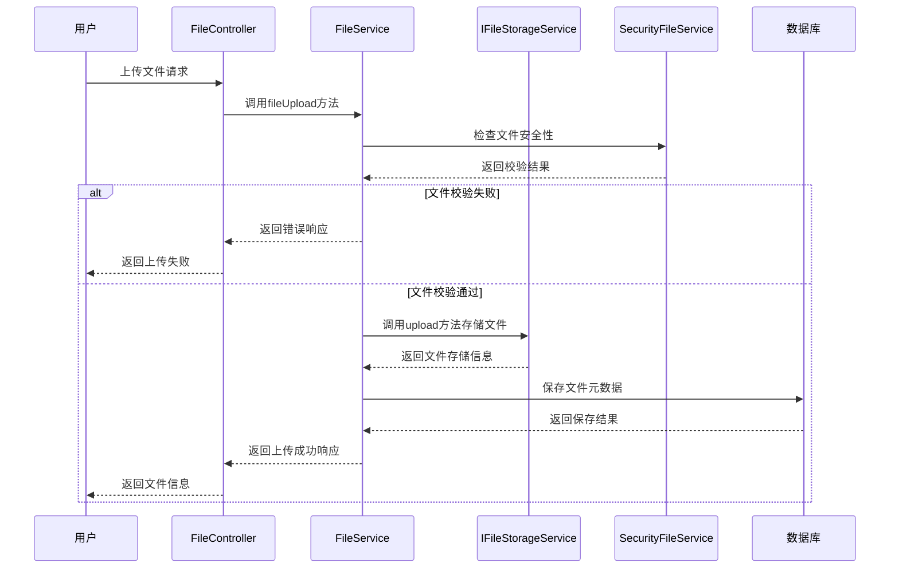
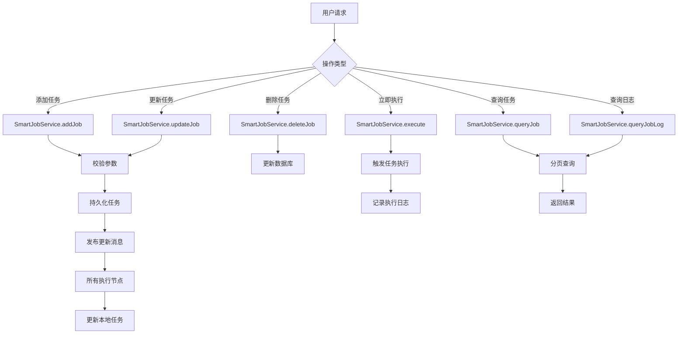
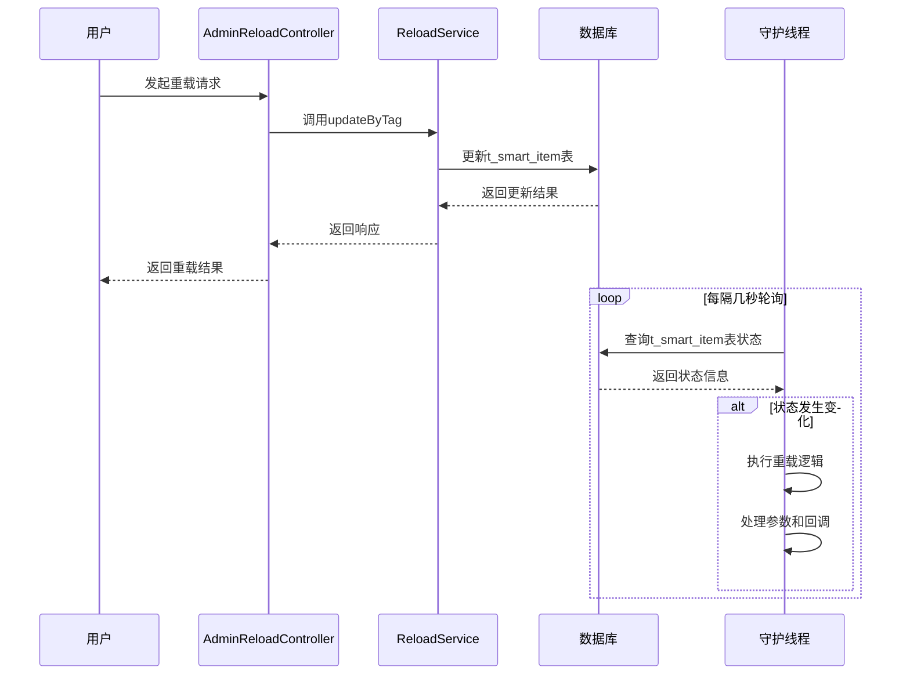

# 系统支持模块

<cite>
**本文档引用文件**   
- [AdminOperateLogController.java](file://smart-admin-api-java17-springboot3\sa-admin\src\main\java\net\lab1024\sa\admin\module\system\support\AdminOperateLogController.java)
- [OperateLogAspect.java](file://smart-admin-api-java17-springboot3\sa-base\src\main\java\net\lab1024\sa\base\module\support\operatelog\core\OperateLogAspect.java)
- [AdminDictController.java](file://smart-admin-api-java17-springboot3\sa-admin\src\main\java\net\lab1024\sa\admin\module\system\support\AdminDictController.java)
- [DictService.java](file://smart-admin-api-java17-springboot3\sa-base\src\main\java\net\lab1024\sa\base\module\support\dict\service\DictService.java)
- [DictManager.java](file://smart-admin-api-java17-springboot3\sa-base\src\main\java\net\lab1024\sa\base\module\support\dict\manager\DictManager.java)
- [AdminFileController.java](file://smart-admin-api-java17-springboot3\sa-admin\src\main\java\net\lab1024\sa\admin\module\system\support\AdminFileController.java)
- [FileService.java](file://smart-admin-api-java17-springboot3\sa-base\src\main\java\net\lab1024\sa\base\module\support\file\service\FileService.java)
- [IFileStorageService.java](file://smart-admin-api-java17-springboot3\sa-base\src\main\java\net\lab1024\sa\base\module\support\file\service\IFileStorageService.java)
- [AdminSmartJobController.java](file://smart-admin-api-java17-springboot3\sa-admin\src\main\java\net\lab1024\sa\admin\module\system\support\AdminSmartJobController.java)
- [SmartJobService.java](file://smart-admin-api-java17-springboot3\sa-base\src\main\java\net\lab1024\sa\base\module\support\job\api\SmartJobService.java)
- [AdminReloadController.java](file://smart-admin-api-java17-springboot3\sa-admin\src\main\java\net\lab1024\sa\admin\module\system\support\AdminReloadController.java)
- [ReloadService.java](file://smart-admin-api-java17-springboot3\sa-base\src\main\java\net\lab1024\sa\base\module\support\reload\ReloadService.java)
- [ReloadConst.java](file://smart-admin-api-java17-springboot3\sa-base\src\main\java\net\lab1024\sa\base\constant\ReloadConst.java)
</cite>

## 目录
1. [操作日志](#操作日志)
2. [数据字典](#数据字典)
3. [文件管理](#文件管理)
4. [定时任务（SmartJob）](#定时任务smartjob)
5. [系统重载（Reload）](#系统重载reload)
6. [业务模块集成示例](#业务模块集成示例)
7. [自定义扩展点使用指南](#自定义扩展点使用指南)

## 操作日志

操作日志功能通过AOP切面技术实现，对系统中所有被`@OperateLog`注解标记的Controller方法进行监控，自动记录用户操作行为。系统通过`OperateLogAspect`切面类实现日志记录的核心逻辑。

`AdminOperateLogController`提供了操作日志的查询接口，支持分页查询和详情查看功能。该控制器通过`OperateLogService`服务类与数据库交互，实现日志数据的持久化存储和查询。日志记录采用异步处理机制，通过线程池将日志写入操作放入后台执行，避免影响主业务流程的性能。



**图源**
- [AdminOperateLogController.java](file://smart-admin-api-java17-springboot3\sa-admin\src\main\java\net\lab1024\sa\admin\module\system\support\AdminOperateLogController.java#L1-L58)
- [OperateLogAspect.java](file://smart-admin-api-java17-springboot3\sa-base\src\main\java\net\lab1024\sa\base\module\support\operatelog\core\OperateLogAspect.java#L1-L292)

**节源**
- [AdminOperateLogController.java](file://smart-admin-api-java17-springboot3\sa-admin\src\main\java\net\lab1024\sa\admin\module\system\support\AdminOperateLogController.java#L1-L58)
- [OperateLogAspect.java](file://smart-admin-api-java17-springboot3\sa-base\src\main\java\net\lab1024\sa\base\module\support\operatelog\core\OperateLogAspect.java#L1-L292)

## 数据字典

数据字典功能提供了动态字典数据的增删改查与缓存管理能力。`AdminDictController`作为数据字典的控制器，暴露了完整的RESTful API接口，支持字典分类和字典项的管理操作。

系统通过`DictService`服务类实现业务逻辑，采用Redis缓存机制提升查询性能。`DictManager`类使用`@Cacheable`注解实现了字典数据的缓存，缓存键由字典编码和数据值组合而成。当字典数据发生变更时，系统通过`@CacheEvict`注解自动清除相关缓存，确保数据一致性。



**图源**
- [AdminDictController.java](file://smart-admin-api-java17-springboot3\sa-admin\src\main\java\net\lab1024\sa\admin\module\system\support\AdminDictController.java#L1-L140)
- [DictService.java](file://smart-admin-api-java17-springboot3\sa-base\src\main\java\net\lab1024\sa\base\module\support\dict\service\DictService.java#L1-L276)
- [DictManager.java](file://smart-admin-api-java17-springboot3\sa-base\src\main\java\net\lab1024\sa\base\module\support\dict\manager\DictManager.java#L1-L47)

**节源**
- [AdminDictController.java](file://smart-admin-api-java17-springboot3\sa-admin\src\main\java\net\lab1024\sa\admin\module\system\support\AdminDictController.java#L1-L140)
- [DictService.java](file://smart-admin-api-java17-springboot3\sa-base\src\main\java\net\lab1024\sa\base\module\support\dict\service\DictService.java#L1-L276)

## 文件管理

文件管理功能通过`AdminFileController`提供文件服务接口，实现了文件上传、下载和查询等核心功能。系统采用策略模式设计，通过`IFileStorageService`接口定义文件存储的通用契约，支持多种文件存储方式（如本地存储、云存储等）。

`FileService`作为核心服务类，负责处理文件上传的业务逻辑，包括文件校验、元数据记录和数据库持久化。文件上传时，系统首先通过`SecurityFileService`进行安全检查，然后调用具体的`IFileStorageService`实现进行文件存储，最后将文件元信息保存到数据库中。



**图源**
- [AdminFileController.java](file://smart-admin-api-java17-springboot3\sa-admin\src\main\java\net\lab1024\sa\admin\module\system\support\AdminFileController.java#L1-L43)
- [FileService.java](file://smart-admin-api-java17-springboot3\sa-base\src\main\java\net\lab1024\sa\base\module\support\file\service\FileService.java#L1-L207)
- [IFileStorageService.java](file://smart-admin-api-java17-springboot3\sa-base\src\main\java\net\lab1024\sa\base\module\support\file\service\IFileStorageService.java#L1-L60)

**节源**
- [AdminFileController.java](file://smart-admin-api-java17-springboot3\sa-admin\src\main\java\net\lab1024\sa\admin\module\system\support\AdminFileController.java#L1-L43)
- [FileService.java](file://smart-admin-api-java17-springboot3\sa-base\src\main\java\net\lab1024\sa\base\module\support\file\service\FileService.java#L1-L207)

## 定时任务（SmartJob）

定时任务功能通过`AdminSmartJobController`提供分布式任务调度的封装接口。系统基于SmartJob框架实现，支持Cron表达式、固定频率等多种触发方式。`SmartJobService`作为核心服务类，负责任务的增删改查和执行状态管理。

任务调度采用发布-订阅模式，当任务配置发生变化时，系统通过`jobClientManager`向所有执行节点发布更新消息，确保集群环境中任务配置的一致性。系统还提供了任务执行记录的查询功能，便于监控任务执行情况和排查问题。



**图源**
- [AdminSmartJobController.java](file://smart-admin-api-java17-springboot3\sa-admin\src\main\java\net\lab1024\sa\admin\module\system\support\AdminSmartJobController.java#L1-L94)
- [SmartJobService.java](file://smart-admin-api-java17-springboot3\sa-base\src\main\java\net\lab1024\sa\base\module\support\job\api\SmartJobService.java#L1-L297)

**节源**
- [AdminSmartJobController.java](file://smart-admin-api-java17-springboot3\sa-admin\src\main\java\net\lab1024\sa\admin\module\system\support\AdminSmartJobController.java#L1-L94)
- [SmartJobService.java](file://smart-admin-api-java17-springboot3\sa-base\src\main\java\net\lab1024\sa\base\module\support\job\api\SmartJobService.java#L1-L297)

## 系统重载（Reload）

系统重载功能通过`AdminReloadController`实现配置热更新与服务重启能力。`ReloadService`服务类负责处理重载逻辑，通过监听数据库中`t_smart_item`表的状态变化来触发重载操作。系统采用守护线程定期轮询机制，无需重启应用即可动态加载配置或执行特定代码。

`ReloadConst`类定义了系统支持的重载项目常量，如`CONFIG_RELOAD`用于配置重载，`CACHE_SERVICE`用于缓存服务重载。当通过`updateByTag`接口更新特定标签的状态标识时，系统会执行相应的重载逻辑，实现内存中的热更新。



**图源**
- [AdminReloadController.java](file://smart-admin-api-java17-springboot3\sa-admin\src\main\java\net\lab1024\sa\admin\module\system\support\AdminReloadController.java#L1-L55)
- [ReloadService.java](file://smart-admin-api-java17-springboot3\sa-base\src\main\java\net\lab1024\sa\base\module\support\reload\ReloadService.java#L1-L69)
- [ReloadConst.java](file://smart-admin-api-java17-springboot3\sa-base\src\main\java\net\lab1024\sa\base\constant\ReloadConst.java#L1-L18)

**节源**
- [AdminReloadController.java](file://smart-admin-api-java17-springboot3\sa-admin\src\main\java\net\lab1024\sa\admin\module\system\support\AdminReloadController.java#L1-L55)
- [ReloadService.java](file://smart-admin-api-java17-springboot3\sa-base\src\main\java\net\lab1024\sa\base\module\support\reload\ReloadService.java#L1-L69)

## 业务模块集成示例

在商品服务中，操作日志功能可用于记录商品的增删改查操作。通过在商品管理的Controller方法上添加`@OperateLog`注解，系统会自动记录操作人员、操作时间、操作内容等信息，便于后续审计和问题追踪。

数据字典功能可用于商品分类、商品状态等下拉框数据的渲染。前端通过调用`/dict/getAllDictData`接口获取所有字典数据并缓存，然后根据字典编码（如"GOODS_STATUS"）从缓存中获取对应的字典项列表，用于渲染下拉选择框。

```mermaid
flowchart LR
A[商品管理页面] --> B[初始化加载]
B --> C[调用/getAllDictData]
C --> D[缓存字典数据]
D --> E[渲染商品状态下拉框]
E --> F[用户操作商品]
F --> G[调用商品API]
G --> H[被@OperateLog注解拦截]
H --> I[记录操作日志]
I --> J[异步保存到数据库]
```

**节源**
- [AdminOperateLogController.java](file://smart-admin-api-java17-springboot3\sa-admin\src\main\java\net\lab1024\sa\admin\module\system\support\AdminOperateLogController.java#L1-L58)
- [AdminDictController.java](file://smart-admin-api-java17-springboot3\sa-admin\src\main\java\net\lab1024\sa\admin\module\system\support\AdminDictController.java#L1-L140)

## 自定义扩展点使用指南

开发者可以通过实现系统提供的扩展点来自定义功能。对于操作日志，可以通过继承`OperateLogAspect`并重写`getOperateLogConfig`方法来自定义线程池配置。对于文件存储，可以通过实现`IFileStorageService`接口来支持新的存储方式（如FTP、SFTP等）。

数据字典的缓存机制可以通过`DictManager`类的`@Cacheable`注解进行扩展，开发者可以自定义缓存策略和缓存键生成规则。定时任务系统支持通过`SmartJobClientManager`注册自定义的任务执行器，实现特定业务逻辑的定时调度。

系统重载功能允许开发者注册自定义的重载处理器，通过监听特定标签的状态变化来执行自定义代码，实现热更新功能。

**节源**
- [OperateLogAspect.java](file://smart-admin-api-java17-springboot3\sa-base\src\main\java\net\lab1024\sa\base\module\support\operatelog\core\OperateLogAspect.java#L1-L292)
- [IFileStorageService.java](file://smart-admin-api-java17-springboot3\sa-base\src\main\java\net\lab1024\sa\base\module\support\file\service\IFileStorageService.java#L1-L60)
- [DictManager.java](file://smart-admin-api-java17-springboot3\sa-base\src\main\java\net\lab1024\sa\base\module\support\dict\manager\DictManager.java#L1-L47)
- [SmartJobClientManager.java](file://smart-admin-api-java17-springboot3\sa-base\src\main\java\net\lab1024\sa\base\module\support\job\api\SmartJobClientManager.java)
- [ReloadCommand.java](file://smart-admin-api-java17-springboot3\sa-base\src\main\java\net\lab1024\sa\base\module\support\reload\ReloadCommand.java)