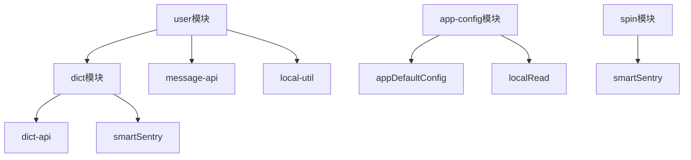
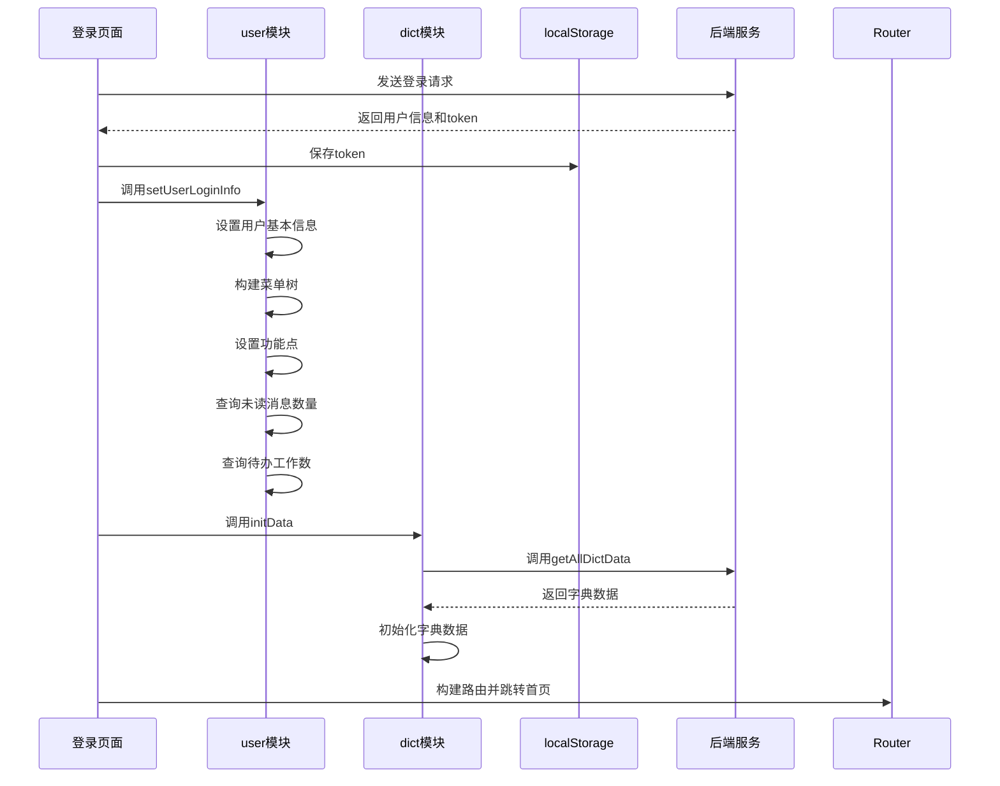

# 系统模块状态管理

<cite>
**本文档引用文件**  
- [user.js](file://smart-admin-web-javascript/src/store/modules/system/user.js)
- [dict.js](file://smart-admin-web-javascript/src/store/modules/system/dict.js)
- [role.js](file://smart-admin-web-javascript/src/store/modules/system/role.js)
- [app-config.js](file://smart-admin-web-javascript/src/store/modules/system/app-config.js)
- [spin.js](file://smart-admin-web-javascript/src/store/modules/system/spin.js)
- [local-storage-key-const.js](file://smart-admin-web-javascript/src/constants/local-storage-key-const.js)
- [menu-const.js](file://smart-admin-web-javascript/src/constants/system/menu-const.js)
- [app-config.js](file://smart-admin-web-javascript/src/config/app-config.js)
- [dict-api.js](file://smart-admin-web-javascript/src/api/support/dict-api.js)
- [message-api.js](file://smart-admin-web-javascript/src/api/support/message-api.js)
- [dict-plugin.js](file://smart-admin-web-javascript/src/plugins/dict-plugin.js)
- [local-util.js](file://smart-admin-web-javascript/src/utils/local-util.js)
</cite>

## 目录
1. [简介](#简介)
2. [核心模块状态管理](#核心模块状态管理)
3. [模块间依赖关系](#模块间依赖关系)
4. [状态变更时序图](#状态变更时序图)
5. [异常处理方案](#异常处理方案)
6. [总结](#总结)

## 简介
本系统采用Pinia作为状态管理工具，实现了user、dict、role、app-config和spin五个核心模块的状态管理。这些模块共同构成了系统的用户认证、权限控制、数据字典、系统配置和加载状态管理的核心功能。通过合理的设计和实现，系统能够高效地管理用户状态、权限信息、系统配置和全局加载状态。

## 核心模块状态管理

### user模块
user模块负责管理用户登录状态、权限信息和请求用户对象。该模块通过Pinia store实现状态管理，包含用户基本信息、菜单权限、标签页和缓存等状态。

**状态结构定义**
- token: 用户认证令牌
- employeeId: 员工ID
- avatar: 用户头像
- loginName: 登录名
- actualName: 姓名
- phone: 手机号
- departmentId: 部门ID
- departmentName: 部门名称
- needUpdatePwdFlag: 是否需要修改密码
- administratorFlag: 是否为超级管理员
- menuTree: 菜单树形结构
- menuRouterList: 存在页面路由的菜单集合
- pointsList: 功能点集合
- tagNav: 标签页
- keepAliveIncludes: 缓存页面集合
- unreadMessageCount: 未读消息数量
- toBeDoneCount: 待办工作数

**getter计算属性**
- getToken: 获取用户token，优先从state获取，否则从localStorage读取
- getNeedUpdatePwdFlag: 获取是否需要修改密码标志
- getMenuRouterInitFlag: 获取菜单路由是否初始化
- getMenuTree: 获取菜单树
- getMenuRouterList: 获取菜单路由列表
- getMenuParentIdListMap: 获取菜单父级ID映射
- getPointList: 获取功能点列表，优先从state获取，否则从localStorage读取
- getTagNav: 获取标签页列表，优先从state获取，否则从localStorage读取

**mutations同步变更**
- setUserLoginInfo: 设置用户登录信息，包括基本信息、菜单权限、功能点等
- setToken: 设置用户token
- setTagNav: 设置标签页
- closeTagNav: 关闭标签页
- closePage: 关闭页面
- pushKeepAliveIncludes: 添加缓存页面
- deleteKeepAliveIncludes: 删除缓存页面
- clearKeepAliveIncludes: 清空缓存页面

**actions异步操作**
- logout: 用户登出，清除所有用户相关状态和localStorage数据
- queryUnreadMessageCount: 查询未读消息数量
- queryToBeDoneList: 查询待办工作数

**Section sources**
- [user.js](file://smart-admin-web-javascript/src/store/modules/system/user.js#L20-L308)
- [local-storage-key-const.js](file://smart-admin-web-javascript/src/constants/local-storage-key-const.js#L19-L32)

### dict模块
dict模块负责管理数据字典的异步加载、本地缓存和动态更新。该模块通过Pinia store实现状态管理，提供数据字典的查询和更新功能。

**状态结构定义**
- dictList: 字典code集合
- dictMap: 字典集合，以字典code为键，字典数据列表为值

**getter计算属性**
- getDictList: 获取字典code集合
- getDictData: 根据字典code获取字典数据
- getDataLabels: 根据字典code和数据值获取对应的标签名称

**mutations同步变更**
- initData: 初始化字典数据，清空现有数据并重新填充
- getDictList: 获取字典列表
- getDictData: 获取字典数据
- getDataLabels: 获取字典标签

**actions异步操作**
- refreshData: 刷新字典数据，从后端获取最新数据并更新状态

**Section sources**
- [dict.js](file://smart-admin-web-javascript/src/store/modules/system/dict.js#L7-L86)
- [dict-api.js](file://smart-admin-web-javascript/src/api/support/dict-api.js#L19-L21)
- [dict-plugin.js](file://smart-admin-web-javascript/src/plugins/dict-plugin.js#L24-L26)

### role模块
role模块负责管理角色权限树的构建、权限校验和权限变更响应。该模块通过Pinia store实现状态管理，提供权限树的初始化、选中和取消选中功能。

**状态结构定义**
- checkedData: 选中的权限数据
- treeMap: 权限树对象映射，以菜单ID为键，菜单对象为值

**getter计算属性**
无

**mutations同步变更**
- initCheckedData: 初始化权限树选中数据
- addCheckedData: 添加选中数据
- addCheckedDataAndChildren: 添加选中数据及其子级
- deleteCheckedData: 删除选中数据
- deleteCheckedDataAndChildren: 删除选中数据及其子级
- initTreeMap: 初始化权限树对象
- selectUpperLevel: 选中上级菜单

**actions异步操作**
无

**Section sources**
- [role.js](file://smart-admin-web-javascript/src/store/modules/system/role.js#L13-L95)

### app-config模块
app-config模块负责管理系统配置的初始化、动态更新和持久化。该模块通过Pinia store实现状态管理，提供系统配置的重置、帮助文档显示和全屏控制功能。

**状态结构定义**
- 从appDefaultConfig继承的所有配置项
- fullScreenFlag: 全屏标志

**getter计算属性**
- getInitializedLanguage: 获取初始化的语言

**mutations同步变更**
- reset: 重置配置到默认值
- showHelpDoc: 显示帮助文档
- hideHelpDoc: 隐藏帮助文档
- startFullScreen: 开始全屏
- exitFullScreen: 退出全屏

**actions异步操作**
无

**Section sources**
- [app-config.js](file://smart-admin-web-javascript/src/store/modules/system/app-config.js#L38-L65)
- [app-config.js](file://smart-admin-web-javascript/src/config/app-config.js#L10-L51)

### spin模块
spin模块负责管理全局加载状态的控制逻辑。该模块通过Pinia store实现状态管理，提供加载状态的显示和隐藏功能。

**状态结构定义**
- loading: 加载状态标志

**getter计算属性**
无

**mutations同步变更**
- hide: 隐藏加载状态
- show: 显示加载状态

**actions异步操作**
无

**Section sources**
- [spin.js](file://smart-admin-web-javascript/src/store/modules/system/spin.js#L13-L45)

## 模块间依赖关系
各模块之间存在明确的依赖关系，通过Pinia store的引用和调用实现功能协同。

**Diagram sources**
- [user.js](file://smart-admin-web-javascript/src/store/modules/system/user.js)
- [dict.js](file://smart-admin-web-javascript/src/store/modules/system/dict.js)
- [app-config.js](file://smart-admin-web-javascript/src/store/modules/system/app-config.js)
- [spin.js](file://smart-admin-web-javascript/src/store/modules/system/spin.js)

## 状态变更时序图
以下时序图展示了用户登录时各模块的状态变更流程。

**Diagram sources**
- [user.js](file://smart-admin-web-javascript/src/store/modules/system/user.js#L151-L188)
- [dict.js](file://smart-admin-web-javascript/src/store/modules/system/dict.js#L57-L64)
- [login.vue](file://smart-admin-web-javascript/src/views/system/login/login.vue#L199-L240)

## 异常处理方案
系统在状态管理中实现了完善的异常处理机制，确保在各种异常情况下系统的稳定性和用户体验。

### user模块异常处理
- 在查询未读消息数量和待办工作数时，使用try-catch捕获异常，并通过smartSentry记录错误
- 在设置标签页时，对路由名称进行有效性检查，避免无效操作

### dict模块异常处理
- 在刷新字典数据时，使用try-catch捕获异常，并通过smartSentry记录错误
- 在初始化字典数据时，对数据进行有效性检查，避免空值或无效数据

### spin模块异常处理
- 在显示和隐藏加载状态时，使用try-catch捕获DOM操作异常，并通过smartSentry记录错误
- 在操作DOM元素时，先检查元素是否存在，避免null引用错误

### 全局异常处理
- 通过axios拦截器处理HTTP响应错误，包括未登录、权限不足、网络超时等情况
- 对于未登录情况，自动跳转到登录页面
- 对于长时间未操作导致需要重新登录的情况，显示提示并自动跳转

**Section sources**
- [user.js](file://smart-admin-web-javascript/src/store/modules/system/user.js#L137-L149)
- [dict.js](file://smart-admin-web-javascript/src/store/modules/system/dict.js#L61-L63)
- [spin.js](file://smart-admin-web-javascript/src/store/modules/system/spin.js#L28-L30)
- [axios.js](file://smart-admin-web-javascript/src/lib/axios.js#L81-L128)

## 总结
本系统通过Pinia实现了user、dict、role、app-config和spin五个核心模块的状态管理。各模块职责明确，通过合理的状态结构定义、getter计算属性、mutations同步变更和actions异步操作，实现了高效的状态管理。模块间通过明确的依赖关系协同工作，确保了系统的稳定性和可维护性。同时，系统实现了完善的异常处理机制，能够在各种异常情况下保持稳定运行，提供了良好的用户体验。