# 系统管理模块

<cite>
**本文档引用文件**   
- [EmployeeController.java](file://smart-admin-api-java17-springboot3\sa-admin\src\main\java\net\lab1024\sa\admin\module\system\employee\controller\EmployeeController.java)
- [DepartmentController.java](file://smart-admin-api-java17-springboot3\sa-admin\src\main\java\net\lab1024\sa\admin\module\system\department\controller\DepartmentController.java)
- [RoleController.java](file://smart-admin-api-java17-springboot3\sa-admin\src\main\java\net\lab1024\sa\admin\module\system\role\controller\RoleController.java)
- [MenuController.java](file://smart-admin-api-java17-springboot3\sa-admin\src\main\java\net\lab1024\sa\admin\module\system\menu\controller\MenuController.java)
- [LoginController.java](file://smart-admin-api-java17-springboot3\sa-admin\src\main\java\net\lab1024\sa\admin\module\system\login\controller\LoginController.java)
- [EmployeeService.java](file://smart-admin-api-java17-springboot3\sa-admin\src\main\java\net\lab1024\sa\admin\module\system\employee\service\EmployeeService.java)
- [DepartmentService.java](file://smart-admin-api-java17-springboot3\sa-admin\src\main\java\net\lab1024\sa\admin\module\system\department\service\DepartmentService.java)
- [RoleService.java](file://smart-admin-api-java17-springboot3\sa-admin\src\main\java\net\lab1024\sa\admin\module\system\role\service\RoleService.java)
- [MenuService.java](file://smart-admin-api-java17-springboot3\sa-admin\src\main\java\net\lab1024\sa\admin\module\system\menu\service\MenuService.java)
- [LoginService.java](file://smart-admin-api-java17-springboot3\sa-admin\src\main\java\net\lab1024\sa\admin\module\system\login\service\LoginService.java)
- [EmployeeManager.java](file://smart-admin-api-java17-springboot3\sa-admin\src\main\java\net\lab1024\sa\admin\module\system\employee\manager\EmployeeManager.java)
- [DepartmentCacheManager.java](file://smart-admin-api-java17-springboot3\sa-admin\src\main\java\net\lab1024\sa\admin\module\system\department\manager\DepartmentCacheManager.java)
- [AdminSwaggerTagConst.java](file://smart-admin-api-java17-springboot3\sa-admin\src\main\java\net\lab1024\sa\admin\constant\AdminSwaggerTagConst.java)
</cite>

## 目录
1. [系统架构概述](#系统架构概述)
2. [四层架构设计模式](#四层架构设计模式)
3. [核心模块功能分析](#核心模块功能分析)
   - [用户管理模块](#用户管理模块)
   - [部门管理模块](#部门管理模块)
   - [岗位管理模块](#岗位管理模块)
   - [角色管理模块](#角色管理模块)
   - [菜单管理模块](#菜单管理模块)
   - [登录认证模块](#登录认证模块)
4. [模块间关联关系](#模块间关联关系)
5. [数据交互示例](#数据交互示例)
6. [典型业务场景实现](#典型业务场景实现)
7. [系统扩展指导](#系统扩展指导)
8. [总结](#总结)

## 系统架构概述

系统管理模块采用标准的四层架构设计模式，包括Controller层、Service层、Manager层和DAO层。这种分层架构确保了代码的高内聚、低耦合，提高了系统的可维护性和可扩展性。系统通过Spring Boot 3框架构建，使用Sa-Token进行权限控制，MyBatis-Plus作为持久层框架。

系统管理模块主要包括用户、部门、岗位、角色、菜单等核心管理功能，这些功能通过RESTful API提供服务，前端通过JavaScript框架进行调用和展示。各模块之间通过清晰的接口定义进行交互，确保了系统的稳定性和可靠性。

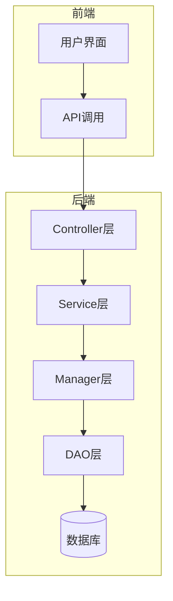

**图源**
- [EmployeeController.java](file://smart-admin-api-java17-springboot3\sa-admin\src\main\java\net\lab1024\sa\admin\module\system\employee\controller\EmployeeController.java)
- [EmployeeService.java](file://smart-admin-api-java17-springboot3\sa-admin\src\main\java\net\lab1024\sa\admin\module\system\employee\service\EmployeeService.java)

## 四层架构设计模式

系统管理模块严格遵循四层架构设计模式，每一层都有明确的职责和边界，确保了代码的清晰性和可维护性。

### Controller层
Controller层负责接收HTTP请求，进行参数验证和权限检查，然后调用Service层处理业务逻辑。所有Controller类都使用@RestController注解，通过@RequestMapping定义API路径。权限控制通过@SaCheckPermission注解实现，确保只有具有相应权限的用户才能访问特定接口。

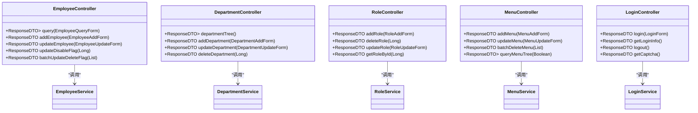

**图源**
- [EmployeeController.java](file://smart-admin-api-java17-springboot3\sa-admin\src\main\java\net\lab1024\sa\admin\module\system\employee\controller\EmployeeController.java)
- [DepartmentController.java](file://smart-admin-api-java17-springboot3\sa-admin\src\main\java\net\lab1024\sa\admin\module\system\department\controller\DepartmentController.java)
- [RoleController.java](file://smart-admin-api-java17-springboot3\sa-admin\src\main\java\net\lab1024\sa\admin\module\system\role\controller\RoleController.java)
- [MenuController.java](file://smart-admin-api-java17-springboot3\sa-admin\src\main\java\net\lab1024\sa\admin\module\system\menu\controller\MenuController.java)
- [LoginController.java](file://smart-admin-api-java17-springboot3\sa-admin\src\main\java\net\lab1024\sa\admin\module\system\login\controller\LoginController.java)

### Service层
Service层是业务逻辑的核心，负责处理具体的业务规则和流程。每个Service类都使用@Service注解，通过@Resource注入所需的DAO和Manager组件。Service层负责协调Manager层完成复杂的业务操作，并返回统一的ResponseDTO格式结果。

### Manager层
Manager层负责封装具体的业务操作，通常包含数据库事务管理。Manager层通过继承ServiceImpl类来获得MyBatis-Plus的基础CRUD功能，同时可以定义更复杂的批量操作和事务性操作。Manager层是Service层与DAO层之间的桥梁，确保了业务逻辑的原子性和一致性。

### DAO层
DAO层负责与数据库进行交互，使用MyBatis-Plus的Mapper接口实现数据的增删改查操作。DAO层通过@Mapper注解标识，可以直接使用MyBatis-Plus提供的通用方法，也可以定义自定义的SQL查询。

## 核心模块功能分析

### 用户管理模块

用户管理模块负责员工信息的增删改查操作，包括基本信息、部门归属、岗位设置和角色分配。EmployeeController提供了完整的RESTful API接口，支持分页查询、添加、更新、删除等操作。

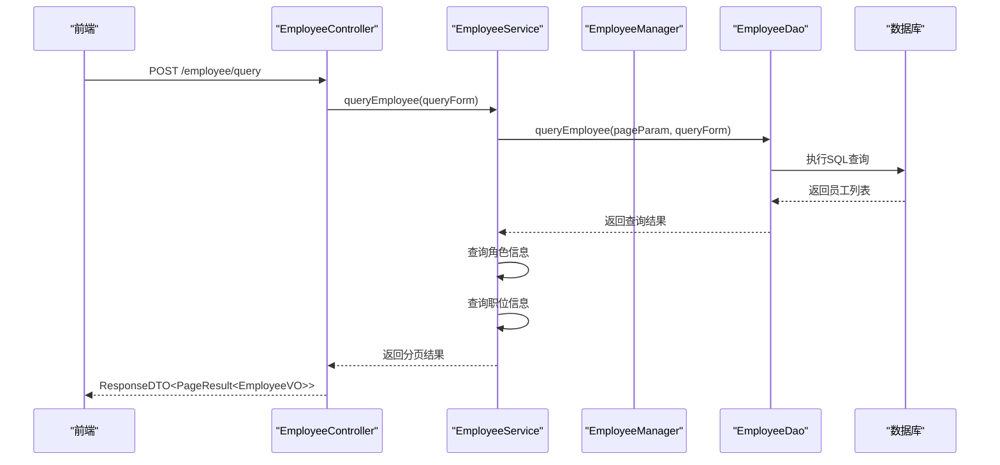

**图源**
- [EmployeeController.java](file://smart-admin-api-java17-springboot3\sa-admin\src\main\java\net\lab1024\sa\admin\module\system\employee\controller\EmployeeController.java)
- [EmployeeService.java](file://smart-admin-api-java17-springboot3\sa-admin\src\main\java\net\lab1024\sa\admin\module\system\employee\service\EmployeeService.java)

### 部门管理模块

部门管理模块实现了部门的树形结构管理，支持无限层级的部门嵌套。DepartmentController提供了查询部门树形列表、添加部门、更新部门和删除部门等接口。部门的树形结构通过缓存优化，提高了查询性能。

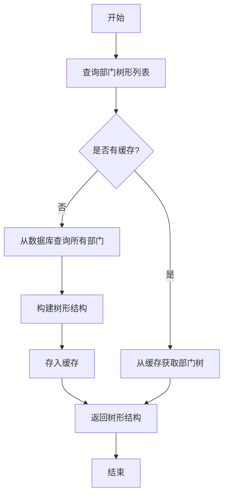

**图源**
- [DepartmentController.java](file://smart-admin-api-java17-springboot3\sa-admin\src\main\java\net\lab1024\sa\admin\module\system\department\controller\DepartmentController.java)
- [DepartmentService.java](file://smart-admin-api-java17-springboot3\sa-admin\src\main\java\net\lab1024\sa\admin\module\system\department\service\DepartmentService.java)
- [DepartmentCacheManager.java](file://smart-admin-api-java17-springboot3\sa-admin\src\main\java\net\lab1024\sa\admin\module\system\department\manager\DepartmentCacheManager.java)

### 岗位管理模块

岗位管理模块负责管理组织中的各种岗位信息，包括岗位名称、描述和相关权限设置。虽然具体的实现代码未完全展示，但从系统架构可以看出，岗位管理遵循与其他模块相同的四层架构模式，通过PositionController、PositionService、PositionManager和PositionDao实现完整的CRUD操作。

### 角色管理模块

角色管理模块实现了角色的创建、删除、更新和查询功能，同时负责角色与菜单权限的分配。RoleController提供了添加角色、删除角色、更新角色和获取角色信息的接口。角色权限的分配通过RoleMenuService实现，确保了权限控制的灵活性和安全性。

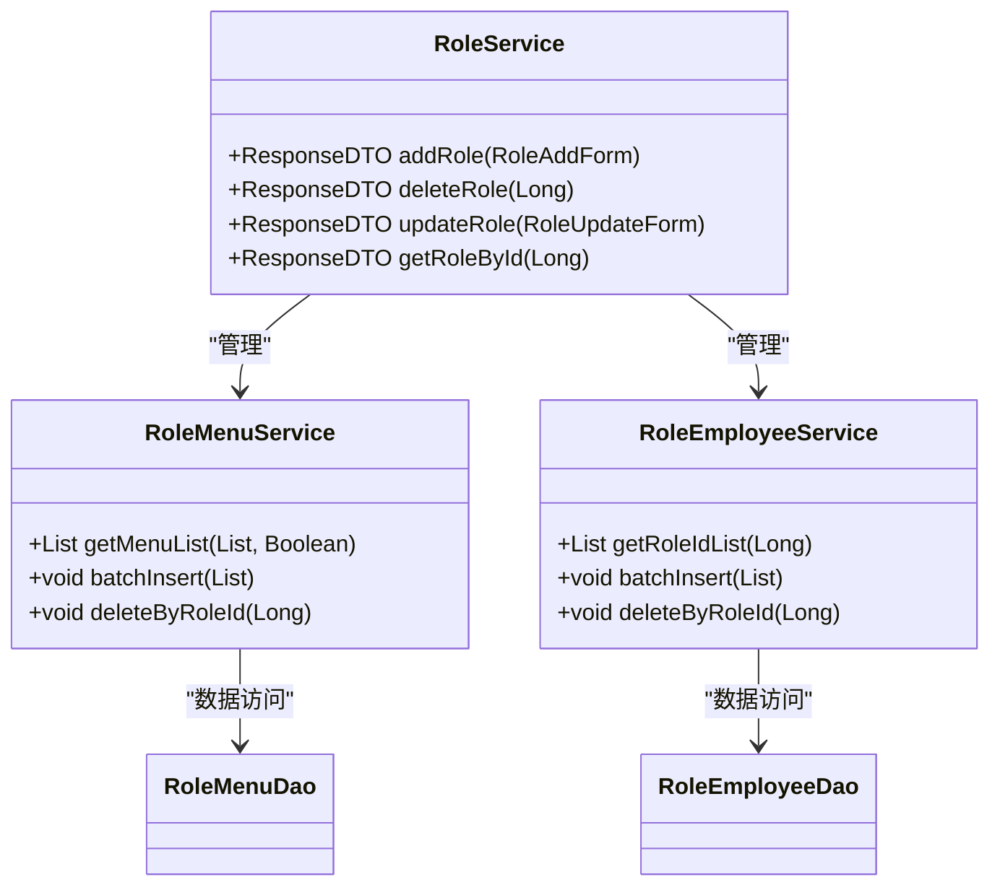

**图源**
- [RoleController.java](file://smart-admin-api-java17-springboot3\sa-admin\src\main\java\net\lab1024\sa\admin\module\system\role\controller\RoleController.java)
- [RoleService.java](file://smart-admin-api-java17-springboot3\sa-admin\src\main\java\net\lab1024\sa\admin\module\system\role\service\RoleService.java)

### 菜单管理模块

菜单管理模块负责系统的菜单树形结构构建和权限控制。MenuController提供了添加菜单、更新菜单、批量删除菜单和查询菜单树的接口。菜单树的构建采用了递归算法，支持过滤功能点只显示菜单项。

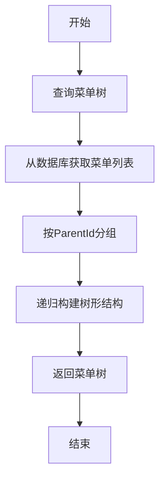

**图源**
- [MenuController.java](file://smart-admin-api-java17-springboot3\sa-admin\src\main\java\net\lab1024\sa\admin\module\system\menu\controller\MenuController.java)
- [MenuService.java](file://smart-admin-api-java17-springboot3\sa-admin\src\main\java\net\lab1024\sa\admin\module\system\menu\service\MenuService.java)

### 登录认证模块

登录认证模块实现了完整的用户登录流程，包括验证码获取、登录验证、双因子认证和登录信息管理。LoginController提供了登录、获取登录信息、退出登录和获取验证码的接口。登录流程中集成了图形验证码和邮箱验证码双重安全机制。

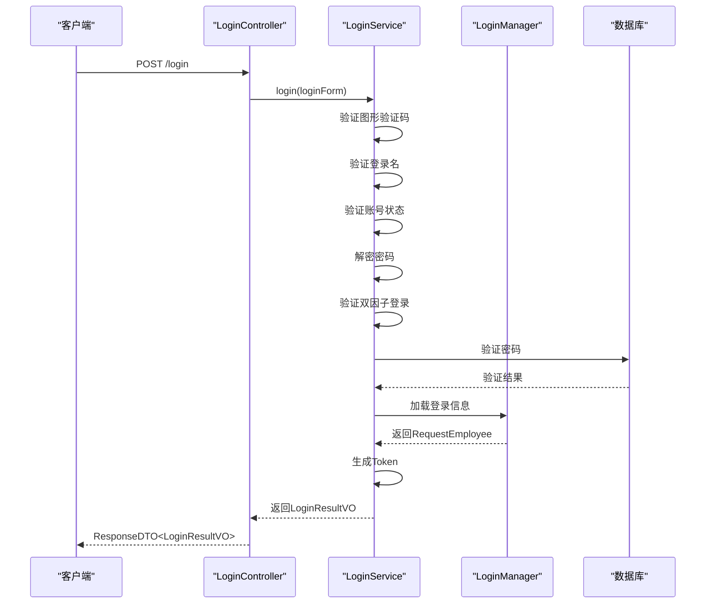

**图源**
- [LoginController.java](file://smart-admin-api-java17-springboot3\sa-admin\src\main\java\net\lab1024\sa\admin\module\system\login\controller\LoginController.java)
- [LoginService.java](file://smart-admin-api-java17-springboot3\sa-admin\src\main\java\net\lab1024\sa\admin\module\system\login\service\LoginService.java)
- [LoginManager.java](file://smart-admin-api-java17-springboot3\sa-admin\src\main\java\net\lab1024\sa\admin\module\system\login\manager\LoginManager.java)

## 模块间关联关系

系统管理模块中的各个组件通过清晰的依赖关系相互协作，形成了一个完整的管理体系。

### EmployeeController与DepartmentController的关联

EmployeeController和DepartmentController之间存在紧密的关联关系。员工信息中包含部门ID，用于标识员工所属的部门。当查询员工信息时，EmployeeService会调用DepartmentService获取部门路径信息，以便在返回结果中显示完整的部门层级。

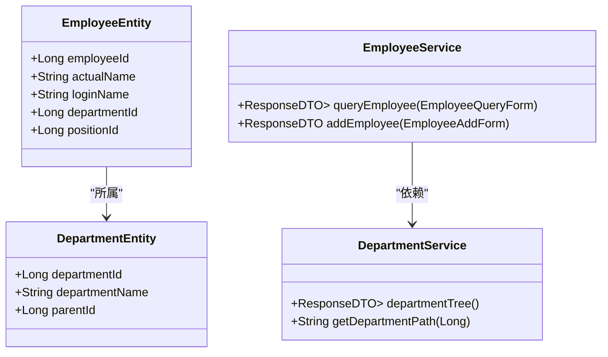

**图源**
- [EmployeeService.java](file://smart-admin-api-java17-springboot3\sa-admin\src\main\java\net\lab1024\sa\admin\module\system\employee\service\EmployeeService.java)
- [DepartmentService.java](file://smart-admin-api-java17-springboot3\sa-admin\src\main\java\net\lab1024\sa\admin\module\system\department\service\DepartmentService.java)

### RoleController的权限分配机制

RoleController通过RoleService实现数据权限和菜单权限的分配。当创建或更新角色时，系统会验证角色名称和编码的唯一性，确保不会出现重复的角色。角色与菜单的关联通过RoleMenuService管理，实现了灵活的权限控制。

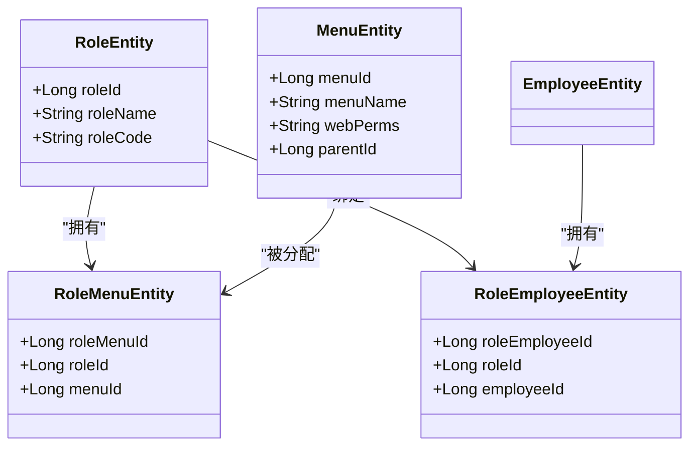

**图源**
- [RoleService.java](file://smart-admin-api-java17-springboot3\sa-admin\src\main\java\net\lab1024\sa\admin\module\system\role\service\RoleService.java)

## 数据交互示例

### 员工与部门的绑定

当新增员工时，系统需要将员工与部门进行绑定。这个过程涉及到EmployeeService和DepartmentService的协同工作。

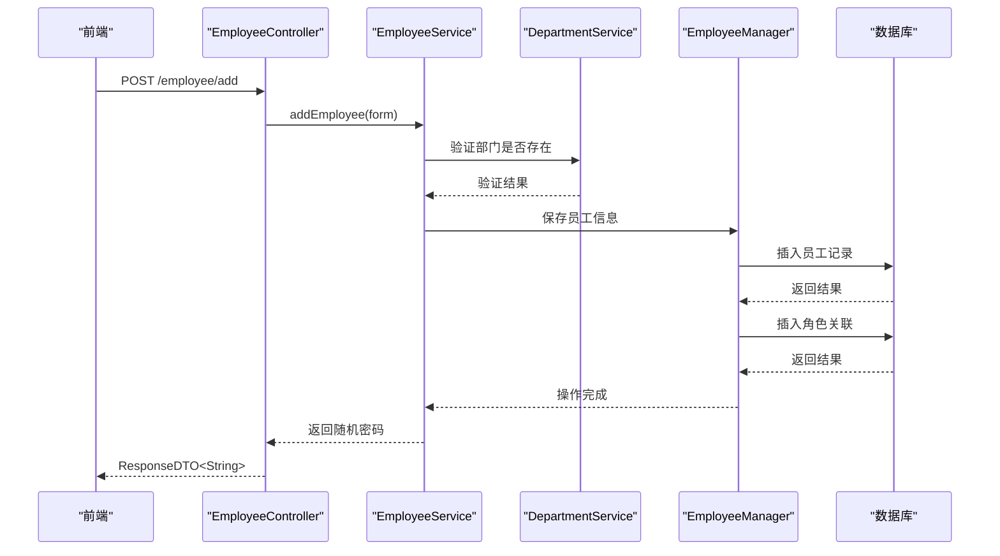

**图源**
- [EmployeeService.java](file://smart-admin-api-java17-springboot3\sa-admin\src\main\java\net\lab1024\sa\admin\module\system\employee\service\EmployeeService.java)
- [EmployeeManager.java](file://smart-admin-api-java17-springboot3\sa-admin\src\main\java\net\lab1024\sa\admin\module\system\employee\manager\EmployeeManager.java)

### 角色与菜单的关联

角色与菜单的关联是权限控制的核心，通过RoleMenuService实现。当为角色分配菜单权限时，系统会清除相关的缓存，确保权限变更立即生效。

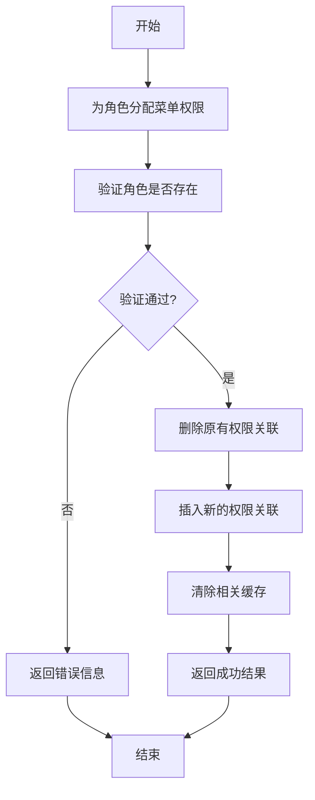

**图源**
- [RoleService.java](file://smart-admin-api-java17-springboot3\sa-admin\src\main\java\net\lab1024\sa\admin\module\system\role\service\RoleService.java)

## 典型业务场景实现

### 新增员工并分配角色

新增员工并分配角色是一个典型的业务场景，涉及到多个服务的协同工作。

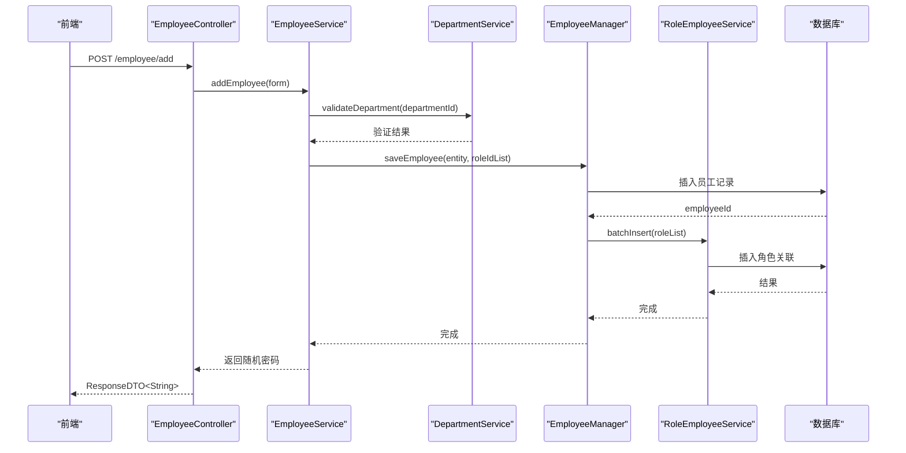

**图源**
- [EmployeeService.java](file://smart-admin-api-java17-springboot3\sa-admin\src\main\java\net\lab1024\sa\admin\module\system\employee\service\EmployeeService.java)
- [EmployeeManager.java](file://smart-admin-api-java17-springboot3\sa-admin\src\main\java\net\lab1024\sa\admin\module\system\employee\manager\EmployeeManager.java)

### 动态菜单加载

动态菜单加载是系统登录后的重要功能，根据用户的角色动态加载相应的菜单。

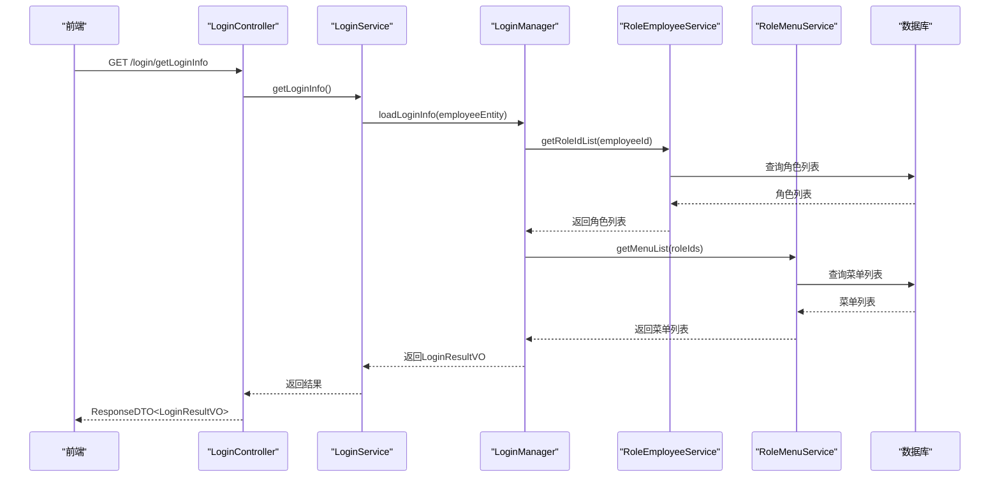

**图源**
- [LoginService.java](file://smart-admin-api-java17-springboot3\sa-admin\src\main\java\net\lab1024\sa\admin\module\system\login\service\LoginService.java)
- [LoginManager.java](file://smart-admin-api-java17-springboot3\sa-admin\src\main\java\net\lab1024\sa\admin\module\system\login\manager\LoginManager.java)

## 系统扩展指导

### 新增字段

当需要为系统管理模块新增字段时，应遵循以下步骤：
1. 在相应的Entity类中添加新字段
2. 在对应的VO类中添加新字段
3. 在Form类中添加新字段（如果需要）
4. 更新DAO层的SQL映射
5. 在Service层处理新字段的业务逻辑
6. 在Controller层暴露相应的API接口

### 权限控制点

系统使用Sa-Token进行权限控制，新增权限控制点时需要：
1. 在Controller方法上添加@SaCheckPermission注解
2. 定义新的权限标识符，遵循"模块:功能:操作"的命名规范
3. 在前端使用v-permission指令控制UI元素的显示

### 数据校验规则

系统使用Jakarta Validation进行数据校验，新增校验规则时：
1. 在Form类中使用@Valid注解
2. 使用相应的校验注解（如@NotBlank、@Size等）
3. 在Service层进行业务规则校验
4. 返回统一的错误响应格式

## 总结

系统管理模块采用清晰的四层架构设计，各组件职责明确，耦合度低。通过Controller、Service、Manager、DAO四层的合理划分，实现了业务逻辑的分层处理和数据访问的分离。模块间通过定义良好的接口进行交互，确保了系统的稳定性和可扩展性。

系统实现了用户、部门、岗位、角色、菜单等核心管理功能，支持树形结构、权限分配、动态加载等复杂业务场景。通过缓存机制优化了频繁访问的数据，提高了系统性能。登录认证流程完善，集成了图形验证码和邮箱验证码双重安全机制，保障了系统的安全性。

开发者在扩展系统功能时，应遵循现有的架构模式和编码规范，确保新功能与现有系统的一致性和兼容性。

**文档来源**
- [EmployeeController.java](file://smart-admin-api-java17-springboot3\sa-admin\src\main\java\net\lab1024\sa\admin\module\system\employee\controller\EmployeeController.java)
- [DepartmentController.java](file://smart-admin-api-java17-springboot3\sa-admin\src\main\java\net\lab1024\sa\admin\module\system\department\controller\DepartmentController.java)
- [RoleController.java](file://smart-admin-api-java17-springboot3\sa-admin\src\main\java\net\lab1024\sa\admin\module\system\role\controller\RoleController.java)
- [MenuController.java](file://smart-admin-api-java17-springboot3\sa-admin\src\main\java\net\lab1024\sa\admin\module\system\menu\controller\MenuController.java)
- [LoginController.java](file://smart-admin-api-java17-springboot3\sa-admin\src\main\java\net\lab1024\sa\admin\module\system\login\controller\LoginController.java)
- [EmployeeService.java](file://smart-admin-api-java17-springboot3\sa-admin\src\main\java\net\lab1024\sa\admin\module\system\employee\service\EmployeeService.java)
- [DepartmentService.java](file://smart-admin-api-java17-springboot3\sa-admin\src\main\java\net\lab1024\sa\admin\module\system\department\service\DepartmentService.java)
- [RoleService.java](file://smart-admin-api-java17-springboot3\sa-admin\src\main\java\net\lab1024\sa\admin\module\system\role\service\RoleService.java)
- [MenuService.java](file://smart-admin-api-java17-springboot3\sa-admin\src\main\java\net\lab1024\sa\admin\module\system\menu\service\MenuService.java)
- [LoginService.java](file://smart-admin-api-java17-springboot3\sa-admin\src\main\java\net\lab1024\sa\admin\module\system\login\service\LoginService.java)
- [EmployeeManager.java](file://smart-admin-api-java17-springboot3\sa-admin\src\main\java\net\lab1024\sa\admin\module\system\employee\manager\EmployeeManager.java)
- [DepartmentCacheManager.java](file://smart-admin-api-java17-springboot3\sa-admin\src\main\java\net\lab1024\sa\admin\module\system\department\manager\DepartmentCacheManager.java)
- [AdminSwaggerTagConst.java](file://smart-admin-api-java17-springboot3\sa-admin\src\main\java\net\lab1024\sa\admin\constant\AdminSwaggerTagConst.java)