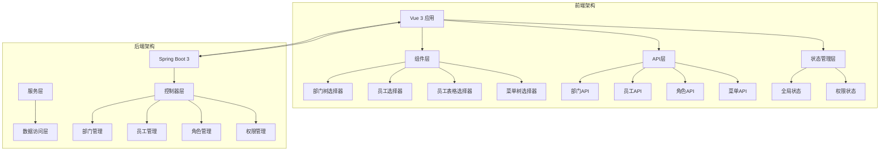
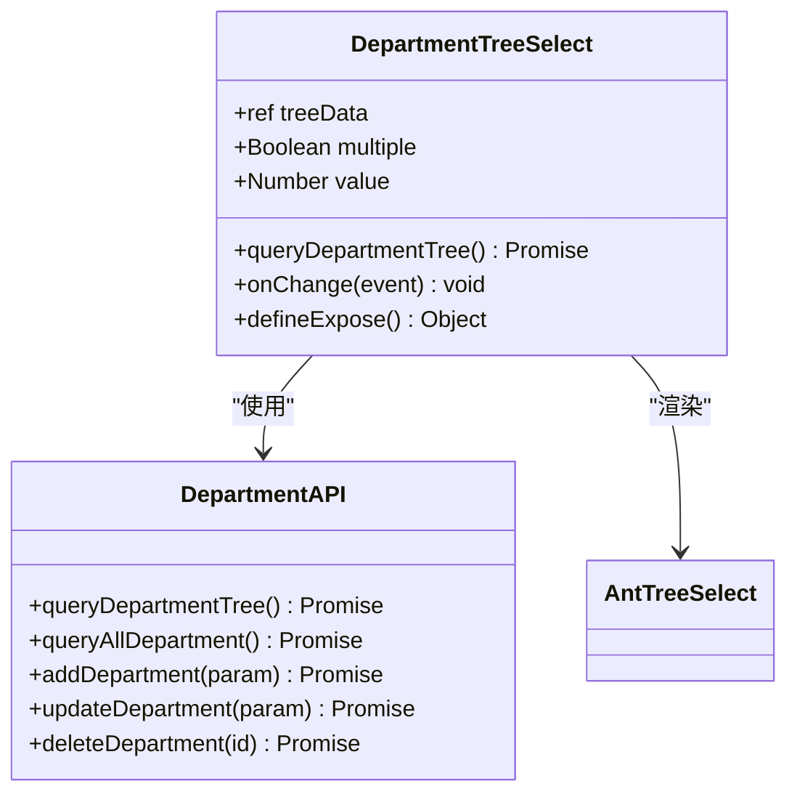
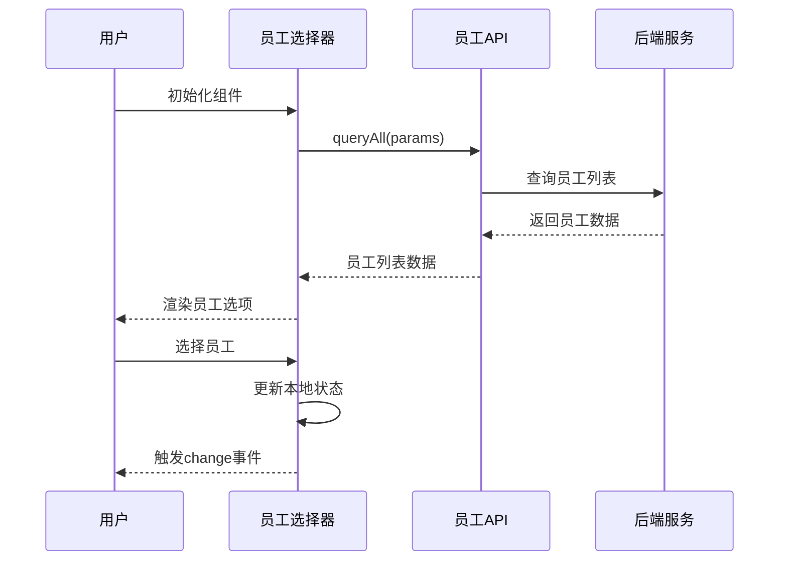
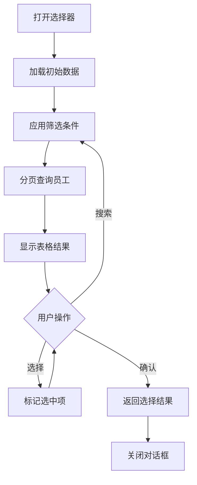
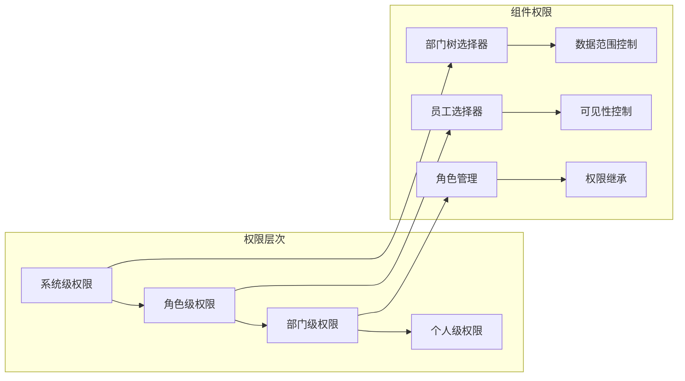
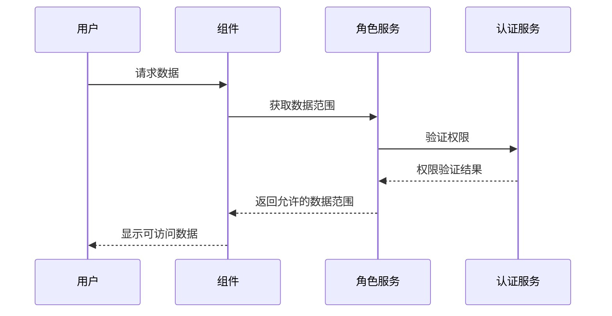
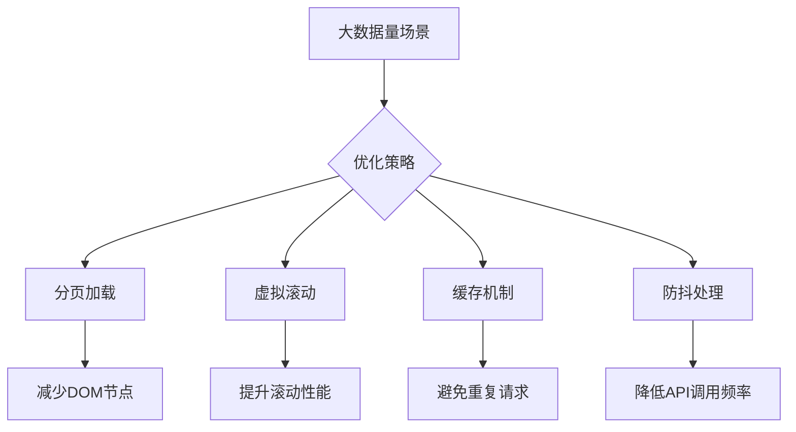

# 系统组件文档

<cite>
**本文档引用的文件**
- [department-tree-select/index.vue](file://smart-admin-web-javascript/src/components/system/department-tree-select/index.vue)
- [employee-select/index.vue](file://smart-admin-web-javascript/src/components/system/employee-select/index.vue)
- [employee-table-select-modal/index.vue](file://smart-admin-web-javascript/src/components/system/employee-table-select-modal/index.vue)
- [menu-tree-select/index.vue](file://smart-admin-web-javascript/src/components/system/menu-tree-select/index.vue)
- [department-api.js](file://smart-admin-web-javascript/src/api/system/department-api.js)
- [employee-api.js](file://smart-admin-web-javascript/src/api/system/employee-api.js)
- [role-api.js](file://smart-admin-web-javascript/src/api/system/role-api.js)
- [menu-api.js](file://smart-admin-web-javascript/src/api/system/menu-api.js)
- [role-data-scope/index.vue](file://smart-admin-web-javascript/src/views/system/role/components/role-data-scope/index.vue)
- [role-employee-list/index.vue](file://smart-admin-web-javascript/src/views/system/role/components/role-employee-list/index.vue)
- [common-const.js](file://smart-admin-web-javascript/src/constants/common-const.js)
- [employee-const.js](file://smart-admin-web-javascript/src/constants/system/employee-const.js)
</cite>

## 目录
1. [项目概述](#项目概述)
2. [系统架构](#系统架构)
3. [核心组件分析](#核心组件分析)
4. [权限系统集成](#权限系统集成)
5. [异步加载与性能优化](#异步加载与性能优化)
6. [使用示例](#使用示例)
7. [最佳实践](#最佳实践)
8. [总结](#总结)

## 项目概述

智能管理系统采用前后端分离架构，前端基于Vue 3构建，提供了完整的组织架构管理功能。系统的核心特色在于其高度集成的权限控制系统和灵活的组织架构选择器组件，支持多层级部门树展示、员工选择、角色权限管理等功能。

### 主要特性

- **多层级组织架构**：支持无限层级的部门树结构
- **灵活的选择器**：提供多种类型的组织架构选择组件
- **权限深度集成**：与角色权限系统无缝对接
- **大数据量优化**：针对大规模组织架构的性能优化
- **实时数据同步**：支持动态数据更新和缓存机制

## 系统架构



**图表来源**
- [department-tree-select/index.vue](file://smart-admin-web-javascript/src/components/system/department-tree-select/index.vue#L1-L59)
- [employee-select/index.vue](file://smart-admin-web-javascript/src/components/system/employee-select/index.vue#L1-L98)
- [department-api.js](file://smart-admin-web-javascript/src/api/system/department-api.js#L1-L46)

## 核心组件分析

### 部门树选择器（DepartmentTreeSelect）

部门树选择器是系统中最核心的组织架构组件，提供了直观的树形结构展示和选择功能。

#### 组件架构



**图表来源**
- [department-tree-select/index.vue](file://smart-admin-web-javascript/src/components/system/department-tree-select/index.vue#L26-L58)
- [department-api.js](file://smart-admin-web-javascript/src/api/system/department-api.js#L12-L45)

#### 核心功能特性

1. **树形结构展示**：支持无限层级的部门树形结构
2. **多选支持**：可配置单选或多选模式
3. **异步加载**：首次加载时异步获取部门数据
4. **搜索功能**：内置搜索功能，支持快速定位
5. **响应式设计**：自适应不同屏幕尺寸

#### 实现要点

- **数据绑定**：通过`v-model:value`实现双向数据绑定
- **字段映射**：使用`fieldNames`属性映射树形数据结构
- **事件处理**：通过`@change`事件监听选择变化
- **暴露方法**：提供`queryDepartmentTree`方法供外部调用刷新数据

**章节来源**
- [department-tree-select/index.vue](file://smart-admin-web-javascript/src/components/system/department-tree-select/index.vue#L1-L59)
- [department-api.js](file://smart-admin-web-javascript/src/api/system/department-api.js#L1-L46)

### 员工选择器（EmployeeSelect）

员工选择器提供了灵活的员工选择功能，支持按角色筛选和状态过滤。

#### 组件设计



**图表来源**
- [employee-select/index.vue](file://smart-admin-web-javascript/src/components/system/employee-select/index.vue#L66-L80)
- [employee-api.js](file://smart-admin-web-javascript/src/api/system/employee-api.js#L17-L19)

#### 功能特性

1. **条件筛选**：
   - 基于角色ID筛选特定角色的员工
   - 按启用/禁用状态过滤
   - 支持多种宽度和尺寸配置

2. **数据源管理**：
   - 支持动态参数传递
   - 错误处理和日志记录
   - 响应式数据更新

3. **用户体验优化**：
   - 实时搜索功能
   - 清晰的部门显示
   - 自动清除功能

**章节来源**
- [employee-select/index.vue](file://smart-admin-web-javascript/src/components/system/employee-select/index.vue#L1-L98)
- [employee-api.js](file://smart-admin-web-javascript/src/api/system/employee-api.js#L1-L99)

### 员工表格选择器（EmployeeTableSelectModal）

员工表格选择器提供了强大的批量选择功能，适用于需要精确筛选和批量操作的场景。

#### 核心功能流程



**图表来源**
- [employee-table-select-modal/index.vue](file://smart-admin-web-javascript/src/components/system/employee-table-select-modal/index.vue#L133-L143)

#### 高级特性

1. **多维筛选**：
   - 关键字搜索
   - 部门树筛选
   - 启用状态过滤

2. **批量操作**：
   - 多选复选框
   - 全选/反选功能
   - 已选状态提示

3. **分页管理**：
   - 可配置的分页大小
   - 快速跳转
   - 数据总数显示

**章节来源**
- [employee-table-select-modal/index.vue](file://smart-admin-web-javascript/src/components/system/employee-table-select-modal/index.vue#L1-L199)

### 菜单树选择器（MenuTreeSelect）

菜单树选择器专门用于权限管理和菜单配置，支持多选和级联选择。

#### 权限集成特性

- **菜单类型过滤**：自动过滤目录类型菜单
- **级联选择**：支持父子节点联动选择
- **权限验证**：与系统权限框架深度集成

**章节来源**
- [menu-tree-select/index.vue](file://smart-admin-web-javascript/src/components/system/menu-tree-select/index.vue#L1-L77)
- [menu-api.js](file://smart-admin-web-javascript/src/api/system/menu-api.js#L1-L55)

## 权限系统集成

系统实现了完整的权限控制体系，与组织架构组件深度集成。

### 权限控制架构



**图表来源**
- [role-data-scope/index.vue](file://smart-admin-web-javascript/src/views/system/role/components/role-data-scope/index.vue#L1-L158)
- [role-employee-list/index.vue](file://smart-admin-web-javascript/src/views/system/role/components/role-employee-list/index.vue#L1-L274)

### 数据范围控制

系统提供了细粒度的数据范围控制机制：

#### 数据范围类型

| 类型 | 描述 | 适用场景 |
|------|------|----------|
| 全部数据 | 可访问所有部门数据 | 系统管理员 |
| 本部门及子部门 | 只能访问当前部门及其子部门 | 部门经理 |
| 本部门 | 只能访问当前部门数据 | 普通员工 |
| 本人数据 | 只能访问自己的数据 | 个人用户 |

#### 权限验证流程



**图表来源**
- [role-data-scope/index.vue](file://smart-admin-web-javascript/src/views/system/role/components/role-data-scope/index.vue#L69-L116)

**章节来源**
- [role-data-scope/index.vue](file://smart-admin-web-javascript/src/views/system/role/components/role-data-scope/index.vue#L1-L158)
- [role-employee-list/index.vue](file://smart-admin-web-javascript/src/views/system/role/components/role-employee-list/index.vue#L1-L274)
- [role-api.js](file://smart-admin-web-javascript/src/api/system/role-api.js#L1-L86)

## 异步加载与性能优化

系统针对大数据量场景进行了深度优化，确保良好的用户体验。

### 异步加载策略

#### 组件级优化

1. **按需加载**：
   - 组件首次渲染时不加载数据
   - 在`onMounted`生命周期钩子中触发数据加载
   - 支持手动刷新数据

2. **懒加载机制**：
   - 部门树选择器采用首次加载策略
   - 员工选择器支持动态参数加载
   - 表格选择器支持分页懒加载

#### 性能优化技术



**图表来源**
- [common-const.js](file://smart-admin-web-javascript/src/constants/common-const.js#L11-L13)

### 大数据量处理

#### 分页配置

系统提供了灵活的分页配置：

```javascript
// 分页常量配置
export const PAGE_SIZE = 10;
export const PAGE_SIZE_OPTIONS = ['5', '10', '15', '20', '30', '40', '50', '75', '100', '150', '200', '300', '500'];
```

#### 性能监控

- **加载状态管理**：每个异步操作都有明确的加载状态指示
- **错误边界处理**：完善的错误捕获和用户提示机制
- **资源清理**：组件销毁时自动清理相关资源

**章节来源**
- [common-const.js](file://smart-admin-web-javascript/src/constants/common-const.js#L1-L73)
- [employee-table-select-modal/index.vue](file://smart-admin-web-javascript/src/components/system/employee-table-select-modal/index.vue#L133-L143)

## 使用示例

### 基础使用场景

#### 角色分配场景

```vue
<template>
  <!-- 部门选择器 -->
  <DepartmentTreeSelect v-model:value="formData.departmentId" />
  
  <!-- 员工选择器 -->
  <EmployeeSelect 
    v-model:value="formData.employeeIds"
    :roleId="roleId"
    :disabledFlag="0"
  />
  
  <!-- 员工表格选择器 -->
  <EmployeeTableSelectModal 
    ref="employeeModal"
    @selectData="handleEmployeeSelect"
  />
</template>
```

#### 权限设置场景

```vue
<template>
  <!-- 角色数据范围配置 -->
  <RoleDataScope />
  
  <!-- 角色员工列表管理 -->
  <RoleEmployeeList />
</template>
```

### 高级使用模式

#### 动态权限控制

```javascript
// 基于用户权限动态控制组件行为
const hasPermission = (permission) => {
  return userStore.hasPermission(permission);
};

// 条件渲染示例
<template>
  <DepartmentTreeSelect 
    v-if="hasPermission('system:department:view')"
    v-model:value="departmentId"
  />
</template>
```

#### 批量操作集成

```javascript
// 批量添加员工到角色
async function addEmployeesToRole(employeeIds) {
  try {
    await roleApi.batchAddRoleEmployee({
      employeeIdList: employeeIds,
      roleId: currentRoleId
    });
    message.success('添加成功');
  } catch (error) {
    console.error('批量添加失败:', error);
  }
}
```

**章节来源**
- [employee-select/index.vue](file://smart-admin-web-javascript/src/components/system/employee-select/index.vue#L34-L57)
- [role-employee-list/index.vue](file://smart-admin-web-javascript/src/views/system/role/components/role-employee-list/index.vue#L166-L193)

## 最佳实践

### 开发规范

1. **组件命名**：
   - 使用语义化的组件名称
   - 遵循统一的命名约定
   - 提供清晰的文档注释

2. **数据流管理**：
   - 使用单向数据流
   - 合理使用`v-model`和事件通信
   - 避免直接修改父组件数据

3. **错误处理**：
   - 完善的异常捕获机制
   - 用户友好的错误提示
   - 日志记录和监控

### 性能优化建议

1. **合理使用缓存**：
   - 对于静态数据使用本地缓存
   - 实现智能的缓存失效策略
   - 避免内存泄漏

2. **优化渲染性能**：
   - 使用`v-if`和`v-show`的正确时机
   - 合理使用`key`属性
   - 避免不必要的重新渲染

3. **网络请求优化**：
   - 实现请求去重机制
   - 使用防抖和节流
   - 合理设置超时时间

### 安全考虑

1. **权限验证**：
   - 前端权限验证作为辅助
   - 后端严格的身份验证和授权
   - 敏感操作的二次确认

2. **数据保护**：
   - 敏感数据的脱敏处理
   - 合理的数据传输加密
   - 防止XSS和CSRF攻击

## 总结

智能管理系统的组织架构选择器组件展现了现代Web应用的最佳实践。通过深度的权限集成、灵活的配置选项和优秀的性能表现，这些组件为系统提供了强大而易用的组织架构管理能力。

### 核心优势

1. **架构完整性**：从组件设计到权限控制的完整解决方案
2. **性能优化**：针对大数据量场景的深度优化
3. **扩展性强**：模块化设计便于功能扩展
4. **用户体验**：直观的操作界面和流畅的交互体验

### 发展方向

随着系统规模的扩大和业务需求的增长，这些组件将继续演进，可能的发展方向包括：

- **移动端优化**：更好的移动端适配
- **实时同步**：WebSocket实现实时数据更新
- **智能推荐**：基于用户行为的智能推荐算法
- **可视化增强**：更丰富的图表和可视化展示

这套组织架构选择器组件不仅满足了当前的业务需求，更为未来的系统扩展奠定了坚实的基础。