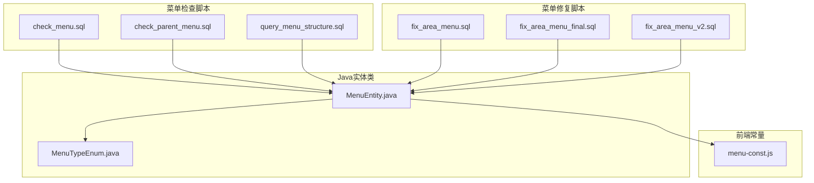
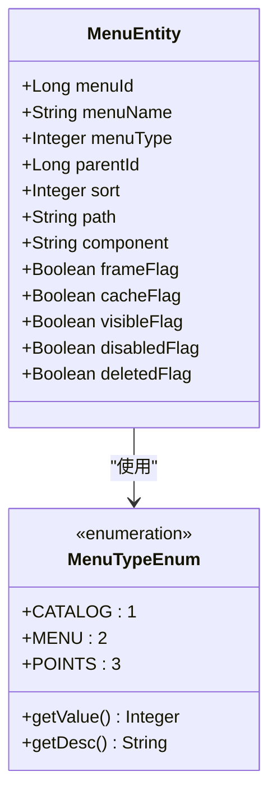
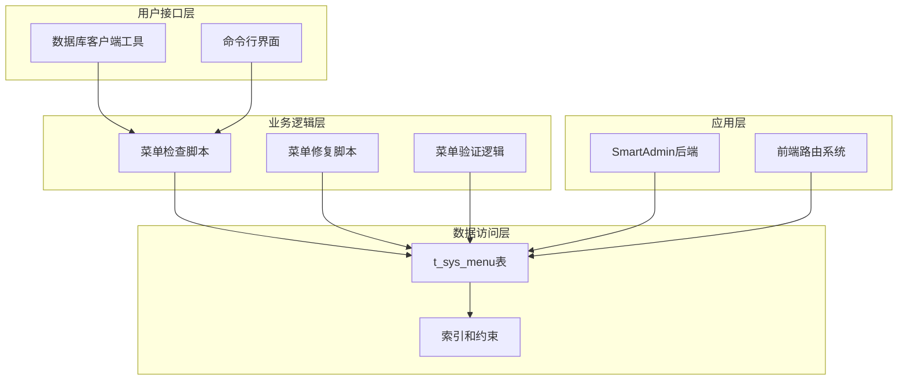
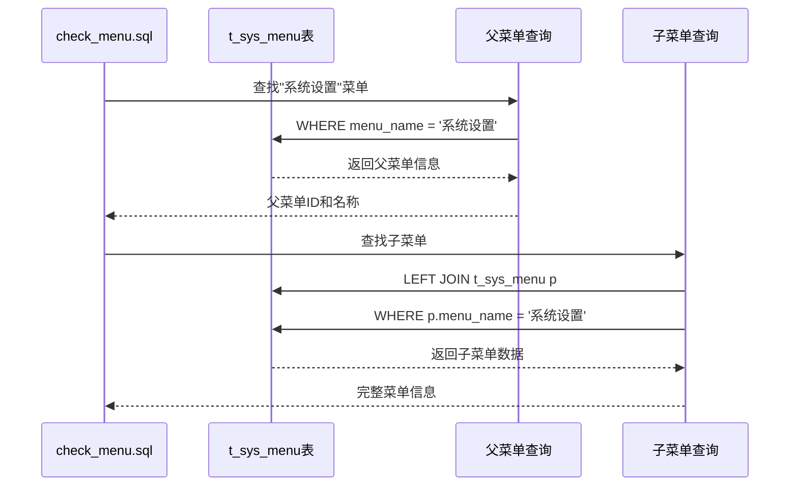
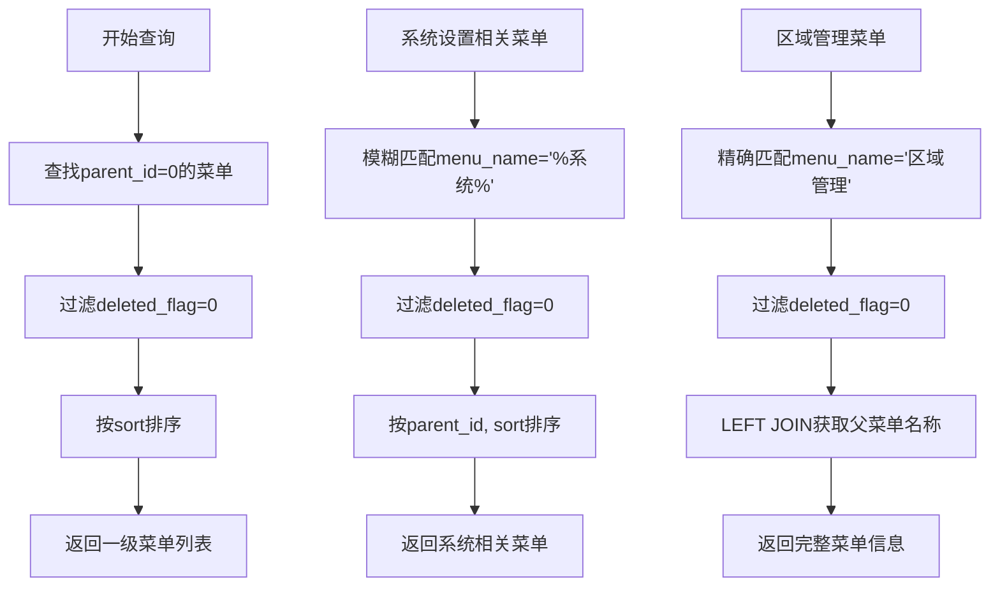
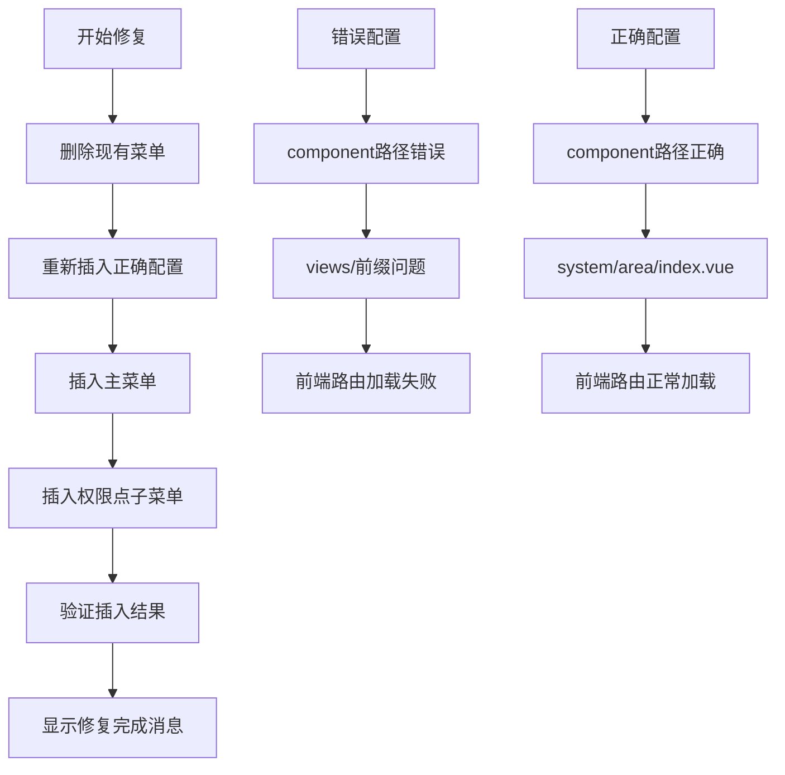
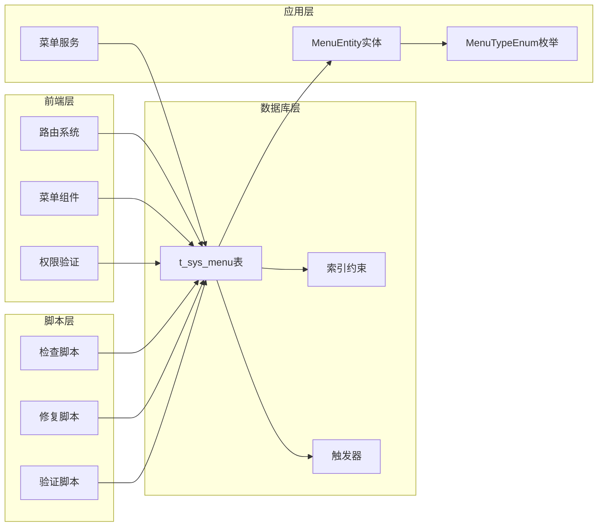

# 菜单检查脚本文档

<cite>
**本文档引用的文件**
- [check_menu.sql](file://check_menu.sql)
- [check_parent_menu.sql](file://check_parent_menu.sql)
- [query_menu_structure.sql](file://query_menu_structure.sql)
- [fix_area_menu.sql](file://数据库SQL脚本\mysql\fix_area_menu.sql)
- [fix_area_menu_final.sql](file://数据库SQL脚本\mysql\fix_area_menu_final.sql)
- [fix_area_menu_v2.sql](file://数据库SQL脚本\mysql\fix_area_menu_v2.sql)
- [MenuEntity.java](file://smart-admin-api-java17-springboot3/sa-admin/src/main/java/net/lab1024/sa/admin/module/system/menu/domain/entity/MenuEntity.java)
- [MenuTypeEnum.java](file://smart-admin-api-java17-springboot3/sa-admin/src/main/java/net/lab1024/sa/admin/module/system/menu/constant/MenuTypeEnum.java)
- [menu-const.js](file://smart-admin-web-javascript/src/constants/system/menu-const.js)
- [区域管理菜单问题修复说明.md](file://区域管理菜单问题修复说明.md)
</cite>

## 目录
1. [概述](#概述)
2. [项目结构](#项目结构)
3. [核心组件](#核心组件)
4. [架构概览](#架构概览)
5. [详细组件分析](#详细组件分析)
6. [依赖关系分析](#依赖关系分析)
7. [性能考虑](#性能考虑)
8. [故障排除指南](#故障排除指南)
9. [结论](#结论)

## 概述

菜单检查脚本是SmartAdmin管理系统中的重要工具，用于验证和诊断系统中菜单数据的完整性。这些脚本通过SQL查询语句对`t_sys_menu`表进行深度检查，确保菜单配置符合系统要求，及时发现并报告潜在的问题。

本文档深入解析了三个核心检查脚本的实现逻辑，包括：
- `check_menu.sql`：系统设置子菜单检查
- `check_parent_menu.sql`：父菜单关系验证
- `query_menu_structure.sql`：菜单结构查询

同时提供了完整的菜单修复解决方案，涵盖区域管理菜单的常见问题及修复方法。

## 项目结构

SmartAdmin项目的菜单相关文件组织结构如下：



**图表来源**
- [check_menu.sql](file://check_menu.sql#L1-L31)
- [MenuEntity.java](file://smart-admin-api-java17-springboot3/sa-admin/src/main/java/net/lab1024/sa/admin/module/system/menu/domain/entity/MenuEntity.java#L1-L137)

**章节来源**
- [check_menu.sql](file://check_menu.sql#L1-L31)
- [check_parent_menu.sql](file://check_parent_menu.sql#L1-L40)
- [query_menu_structure.sql](file://query_menu_structure.sql#L1-L42)

## 核心组件

### 菜单实体模型

系统中的菜单数据通过`MenuEntity`类进行管理，该类映射到数据库的`t_sys_menu`表：

| 字段名 | 类型 | 描述 | 必填 |
|--------|------|------|------|
| menuId | Long | 菜单ID | 是 |
| menuName | String | 菜单名称 | 是 |
| menuType | Integer | 菜单类型（1=目录，2=菜单，3=功能点） | 是 |
| parentId | Long | 父菜单ID | 是 |
| sort | Integer | 显示顺序 | 是 |
| path | String | 路由地址 | 否 |
| component | String | 组件路径 | 否 |
| frameFlag | Boolean | 是否为外链 | 否 |
| cacheFlag | Boolean | 是否缓存 | 否 |
| visibleFlag | Boolean | 显示状态 | 是 |
| disabledFlag | Boolean | 禁用状态 | 是 |
| deletedFlag | Boolean | 删除状态 | 是 |

### 菜单类型枚举



**图表来源**
- [MenuTypeEnum.java](file://smart-admin-api-java17-springboot3/sa-admin/src/main/java/net/lab1024/sa/admin/module/system/menu/constant/MenuTypeEnum.java#L1-L48)
- [MenuEntity.java](file://smart-admin-api-java17-springboot3/sa-admin/src/main/java/net/lab1024/sa/admin/module/system/menu/domain/entity/MenuEntity.java#L1-L137)

**章节来源**
- [MenuEntity.java](file://smart-admin-api-java17-springboot3/sa-admin/src/main/java/net/lab1024/sa/admin/module/system/menu/domain/entity/MenuEntity.java#L1-L137)
- [MenuTypeEnum.java](file://smart-admin-api-java17-springboot3/sa-admin/src/main/java/net/lab1024/sa/admin/module/system/menu/constant/MenuTypeEnum.java#L1-L48)

## 架构概览

菜单检查系统的整体架构采用分层设计，包含数据访问层、业务逻辑层和用户接口层：



**图表来源**
- [check_menu.sql](file://check_menu.sql#L1-L31)
- [fix_area_menu.sql](file://数据库SQL脚本\mysql\fix_area_menu.sql#L1-L59)

## 详细组件分析

### check_menu.sql 分析

该脚本专注于检查系统设置下的子菜单配置，包含两个主要查询：

#### 系统设置子菜单检查



**图表来源**
- [check_menu.sql](file://check_menu.sql#L1-L16)

#### 区域管理菜单检查

该查询专门检查"区域管理"菜单的配置完整性，验证以下字段：
- 菜单ID、名称、类型
- 父菜单ID、路径、组件
- 权限标识、可见性和禁用状态

**章节来源**
- [check_menu.sql](file://check_menu.sql#L1-L31)

### check_parent_menu.sql 分析

该脚本提供全面的父菜单关系验证功能：

#### 一级菜单查询



**图表来源**
- [check_parent_menu.sql](file://check_parent_menu.sql#L1-L40)

**章节来源**
- [check_parent_menu.sql](file://check_parent_menu.sql#L1-L40)

### query_menu_structure.sql 分析

该脚本提供菜单结构的全面查询视图：

#### 顶级菜单查询

查询所有一级菜单（parent_id=0），这是菜单树的根节点。

#### 系统相关菜单查询

通过LIKE操作符查找包含"系统"关键词的所有菜单，支持模糊匹配。

#### 区域管理菜单配置查询

结合LEFT JOIN获取完整的菜单层次结构信息，包括父菜单名称、路径、组件等详细配置。

**章节来源**
- [query_menu_structure.sql](file://query_menu_structure.sql#L1-L42)

### 菜单修复脚本分析

#### fix_area_menu.sql 修复脚本

该脚本专门解决区域管理菜单不显示的问题，包含以下步骤：



**图表来源**
- [fix_area_menu.sql](file://数据库SQL脚本\mysql\fix_area_menu.sql#L1-L59)

#### 修复关键要素

1. **Component路径修正**：将错误的`views/system/area/index.vue`修正为正确的`system/area/index.vue`
2. **父菜单关系**：确保区域管理菜单正确挂载到"系统设置"菜单下
3. **权限点配置**：完整创建12个权限点，覆盖区域管理的所有功能

**章节来源**
- [fix_area_menu.sql](file://数据库SQL脚本\mysql\fix_area_menu.sql#L1-L59)
- [fix_area_menu_final.sql](file://数据库SQL脚本\mysql\fix_area_menu_final.sql#L1-L90)
- [fix_area_menu_v2.sql](file://数据库SQL脚本\mysql\fix_area_menu_v2.sql#L1-L78)

## 依赖关系分析

菜单检查系统的依赖关系复杂，涉及多个层面的相互作用：



**图表来源**
- [MenuEntity.java](file://smart-admin-api-java17-springboot3/sa-admin/src/main/java/net/lab1024/sa/admin/module/system/menu/domain/entity/MenuEntity.java#L1-L137)
- [check_menu.sql](file://check_menu.sql#L1-L31)

**章节来源**
- [MenuEntity.java](file://smart-admin-api-java17-springboot3/sa-admin/src/main/java/net/lab1024/sa/admin/module/system/menu/domain/entity/MenuEntity.java#L1-L137)
- [MenuTypeEnum.java](file://smart-admin-api-java17-springboot3/sa-admin/src/main/java/net/lab1024/sa/admin/module/system/menu/constant/MenuTypeEnum.java#L1-L48)

## 性能考虑

### 查询优化策略

1. **索引利用**：确保`t_sys_menu`表在`menu_name`、`parent_id`、`deleted_flag`等字段上有适当的索引
2. **查询限制**：使用`LIMIT 1`减少不必要的数据扫描
3. **连接优化**：合理使用LEFT JOIN避免笛卡尔积
4. **批量操作**：在修复脚本中使用批量插入提高效率

### 数据库设计考虑

- **字段长度优化**：合理设置字符串字段的最大长度
- **默认值设置**：为布尔类型字段设置合理的默认值
- **约束完整性**：确保外键约束和唯一性约束的正确性

## 故障排除指南

### 常见问题及解决方案

#### 1. 区域管理菜单不显示

**问题症状**：
- 后端API正常，但前端菜单不显示
- 控制台无明显错误信息

**根本原因**：
- Component路径配置错误：`views/system/area/index.vue`而非`system/area/index.vue`

**解决方案**：
```sql
-- 手动修复
UPDATE t_sys_menu
SET component = 'system/area/index.vue'
WHERE menu_name = '区域管理'
AND deleted_flag = 0;
```

**预防措施**：
- 遵循`system/area/index.vue`的路径格式规范
- 避免在路径中包含`views/`前缀

#### 2. 菜单层级关系错误

**问题症状**：
- 菜单显示位置不正确
- 权限分配异常

**解决方案**：
使用`check_parent_menu.sql`脚本检查菜单层级关系，必要时使用修复脚本重新配置。

#### 3. 权限配置缺失

**问题症状**：
- 用户无法访问特定功能
- 权限验证失败

**解决方案**：
检查权限点配置，确保每个功能都有对应的权限标识。

**章节来源**
- [区域管理菜单问题修复说明.md](file://区域管理菜单问题修复说明.md#L1-L165)

## 结论

菜单检查脚本是SmartAdmin管理系统中不可或缺的数据质量保证工具。通过深入分析三个核心检查脚本和多个修复脚本，我们可以得出以下结论：

### 主要价值

1. **数据完整性保障**：通过多维度检查确保菜单配置的正确性
2. **问题快速定位**：提供详细的检查结果帮助快速定位问题
3. **自动化修复能力**：内置多种修复方案应对常见问题
4. **系统维护支持**：在系统升级和迁移过程中发挥重要作用

### 最佳实践建议

1. **定期检查**：建立定期的菜单数据检查机制
2. **标准化配置**：遵循统一的菜单配置规范
3. **备份优先**：在执行修复脚本前做好数据备份
4. **测试验证**：修复后充分测试确保功能正常

### 发展方向

随着系统的不断发展，菜单检查脚本可以进一步增强：
- 增加更多的自动化检查规则
- 提供图形化的检查结果展示
- 集成到CI/CD流程中实现自动化验证
- 支持更复杂的菜单结构验证

通过持续优化和完善菜单检查系统，可以有效提升SmartAdmin管理系统的稳定性和用户体验。