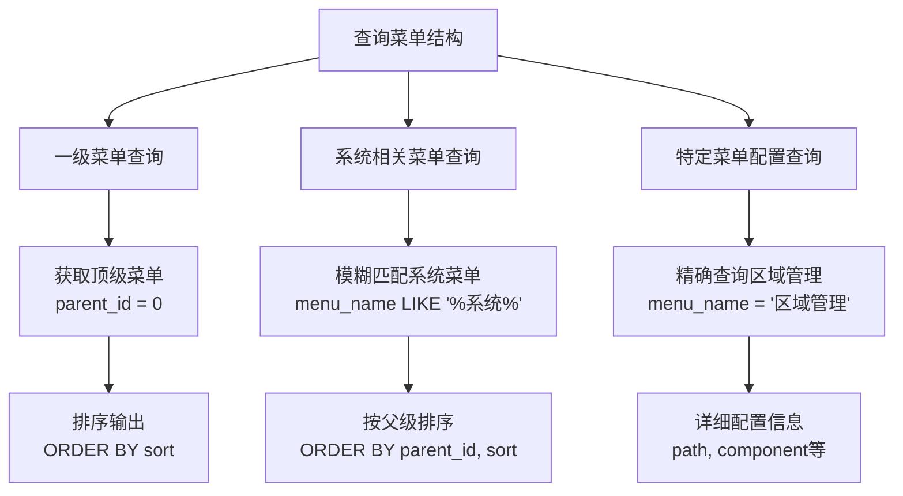
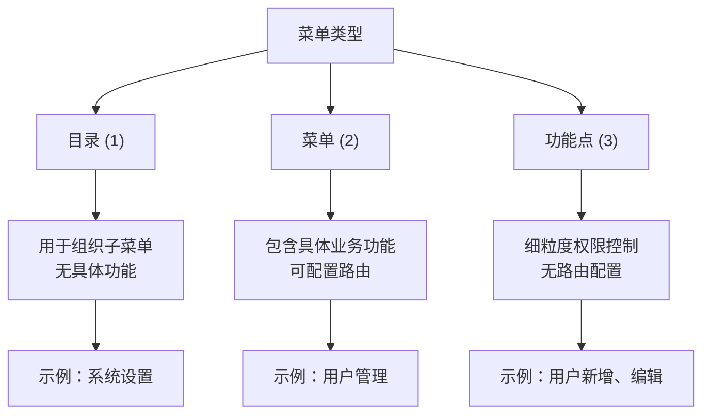
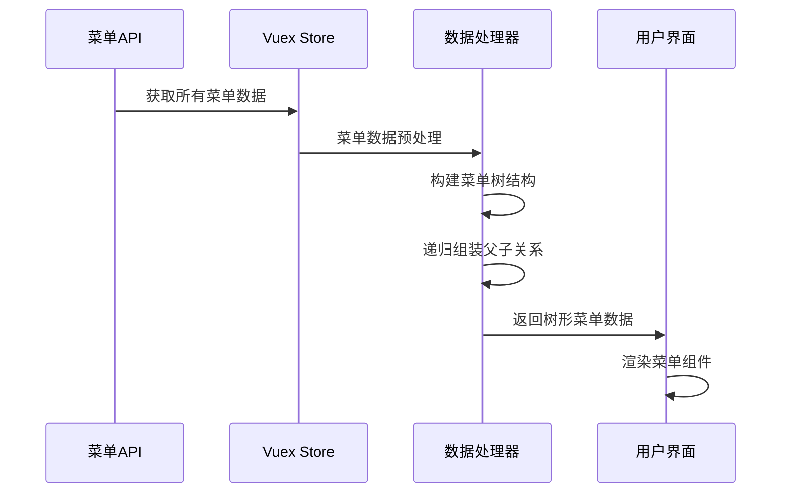
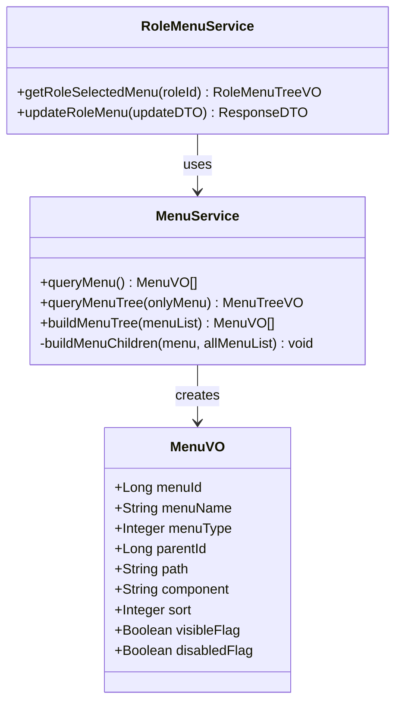
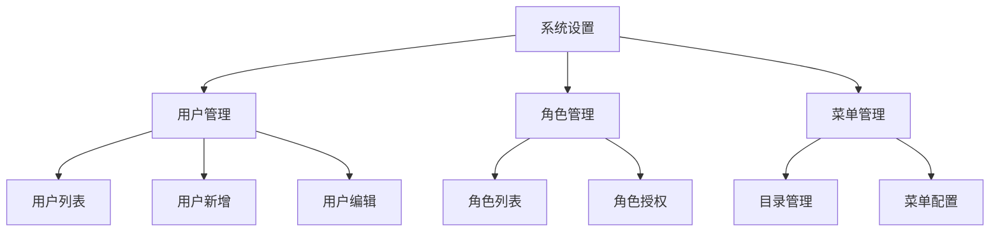
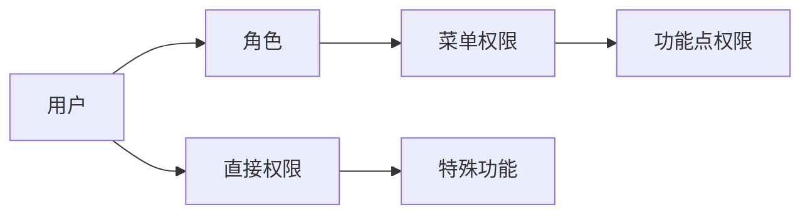

# 菜单结构查询脚本文档

<cite>
**本文档引用的文件**
- [query_menu_structure.sql](file://query_menu_structure.sql)
- [check_menu.sql](file://check_menu.sql)
- [check_parent_menu.sql](file://check_parent_menu.sql)
- [区域管理菜单问题修复说明.md](file://区域管理菜单问题修复说明.md)
- [menu-api.js](file://smart-admin-web-javascript/src/api/system/menu-api.js)
- [menu-data-handler.js](file://smart-admin-web-javascript/src/views/system/menu/menu-data-handler.js)
- [user.js](file://smart-admin-web-javascript/src/store/modules/system/user.js)
- [README.md](file://README.md)
</cite>

## 目录
1. [简介](#简介)
2. [项目背景](#项目背景)
3. [核心查询脚本分析](#核心查询脚本分析)
4. [菜单结构设计](#菜单结构设计)
5. [递归查询实现](#递归查询实现)
6. [查询结果字段详解](#查询结果字段详解)
7. [实际应用场景](#实际应用场景)
8. [性能优化策略](#性能优化策略)
9. [故障排查指南](#故障排查指南)
10. [最佳实践建议](#最佳实践建议)

## 简介

SmartAdmin是一个基于SpringBoot3+Vue3的企业级管理系统，提供了完整的菜单权限管理体系。本文档深入解析`query_menu_structure.sql`脚本的技术实现，详细说明如何通过递归查询构建完整的菜单树形结构，以及该查询在系统调试、权限分析和前端路由生成中的重要作用。

## 项目背景

SmartAdmin采用现代化的前后端分离架构，支持多种数据库（MySQL、PostgreSQL、国产数据库等），具备完善的权限控制体系。系统菜单采用树形结构设计，支持无限层级的菜单组织，为不同角色用户提供个性化的功能访问权限。

### 技术特点

- **多数据库支持**：兼容主流数据库和国产数据库
- **权限控制**：基于角色的访问控制（RBAC）
- **前端路由**：动态生成前端路由配置
- **菜单树形结构**：支持无限层级菜单组织

**章节来源**
- [README.md](file://README.md#L1-L84)

## 核心查询脚本分析

### 脚本结构概述

`query_menu_structure.sql`包含三个主要查询，分别用于不同的菜单分析场景：



**图表来源**
- [query_menu_structure.sql](file://query_menu_structure.sql#L1-L42)

### 查询语句详解

#### 1. 一级菜单查询

```sql
-- 查询系统中所有一级菜单（顶级菜单）
SELECT
    menu_id,
    menu_name,
    menu_type,
    sort,
    icon,
    visible_flag
FROM t_sys_menu
WHERE parent_id = 0
AND deleted_flag = 0
ORDER BY sort;
```

**查询特点**：
- **筛选条件**：`parent_id = 0`标识顶级菜单
- **状态过滤**：`deleted_flag = 0`排除已删除的菜单
- **排序依据**：按照`sort`字段升序排列
- **返回字段**：包含菜单的基本信息和显示标志

#### 2. 系统相关菜单查询

```sql
-- 查询所有包含"系统"的菜单
SELECT
    m.menu_id,
    m.menu_name,
    m.menu_type,
    m.parent_id,
    p.menu_name as parent_menu_name,
    m.sort
FROM t_sys_menu m
LEFT JOIN t_sys_menu p ON m.parent_id = p.menu_id
WHERE m.menu_name LIKE '%系统%'
AND m.deleted_flag = 0
ORDER BY m.parent_id, m.sort;
```

**查询特点**：
- **关联查询**：使用`LEFT JOIN`获取父菜单名称
- **模糊匹配**：`LIKE '%系统%'`查找包含"系统"关键词的菜单
- **排序逻辑**：先按父菜单ID分组，再按排序号排序

#### 3. 特定菜单配置查询

```sql
-- 查询"区域管理"当前的配置
SELECT
    m.menu_id,
    m.menu_name,
    m.parent_id,
    p.menu_name as parent_menu_name,
    m.path,
    m.component,
    m.visible_flag,
    m.disabled_flag
FROM t_sys_menu m
LEFT JOIN t_sys_menu p ON m.parent_id = p.menu_id
WHERE m.menu_name = '区域管理'
AND m.deleted_flag = 0;
```

**查询特点**：
- **精确匹配**：`menu_name = '区域管理'`定位特定菜单
- **完整配置**：包含路由路径、组件路径等详细信息
- **状态检查**：同时检查可见性和禁用状态

**章节来源**
- [query_menu_structure.sql](file://query_menu_structure.sql#L1-L42)

## 菜单结构设计

### 数据库表结构

系统菜单采用标准的树形结构设计，主要包含以下字段：

| 字段名 | 类型 | 描述 | 约束 |
|--------|------|------|------|
| menu_id | BIGINT | 菜单唯一标识 | PRIMARY KEY |
| menu_name | VARCHAR(50) | 菜单名称 | NOT NULL |
| menu_type | TINYINT | 菜单类型（1目录、2菜单、3功能点） | NOT NULL |
| parent_id | BIGINT | 父菜单ID | DEFAULT 0 |
| path | VARCHAR(200) | 路由路径 | NULLABLE |
| component | VARCHAR(200) | 组件路径 | NULLABLE |
| sort | INT | 排序号 | DEFAULT 0 |
| icon | VARCHAR(100) | 图标 | NULLABLE |
| visible_flag | TINYINT | 是否可见 | DEFAULT 1 |
| disabled_flag | TINYINT | 是否禁用 | DEFAULT 0 |
| deleted_flag | TINYINT | 是否删除 | DEFAULT 0 |

### 菜单类型说明



**图表来源**
- [menu-const.js](file://smart-admin-web-javascript/src/constants/system/menu-const.js#L1-L43)

**章节来源**
- [区域管理菜单问题修复说明.md](file://区域管理菜单问题修复说明.md#L1-L165)

## 递归查询实现

### 前端菜单树构建

系统前端采用递归方式构建菜单树结构，主要流程如下：



**图表来源**
- [menu-data-handler.js](file://smart-admin-web-javascript/src/views/system/menu/menu-data-handler.js#L1-L54)
- [user.js](file://smart-admin-web-javascript/src/store/modules/system/user.js#L322-L363)

### 递归算法实现

前端菜单树构建的核心算法：

```javascript
// 构建菜单树
function buildMenuTree(menuList) {
    // 获取有效目录和菜单
    let catalogAndMenuList = menuList.filter(
        (menu) => menu.menuType !== MENU_TYPE_ENUM.POINTS.value && 
                 menu.visibleFlag && 
                 !menu.disabledFlag
    );
    
    // 获取顶级目录
    let topCatalogList = catalogAndMenuList.filter(
        (menu) => menu.parentId === 0
    );
    
    // 递归构建子菜单
    for (const topCatalog of topCatalogList) {
        buildMenuChildren(topCatalog, catalogAndMenuList);
    }
    return topCatalogList;
}
```

### 后端菜单服务

后端通过`MenuService`提供菜单查询服务：



**图表来源**
- [RoleMenuService.java](file://smart-admin-api-java17-springboot3\sa-admin\src\main\java\net\lab1024\sa\admin\module\system\role\service\RoleMenuService.java#L1-L31)

**章节来源**
- [menu-data-handler.js](file://smart-admin-web-javascript/src/views/system/menu/menu-data-handler.js#L1-L54)
- [user.js](file://smart-admin-web-javascript/src/store/modules/system/user.js#L322-L363)

## 查询结果字段详解

### 基础字段说明

| 字段名 | 类型 | 含义 | 应用场景 |
|--------|------|------|----------|
| menu_id | BIGINT | 菜单唯一标识 | 菜单识别和关联 |
| menu_name | VARCHAR | 菜单显示名称 | 用户界面展示 |
| menu_type | TINYINT | 菜单类型 | 控制菜单行为 |
| parent_id | BIGINT | 父菜单ID | 构建树形结构 |
| sort | INT | 排序号 | 确定菜单顺序 |

### 高级字段说明

| 字段名 | 类型 | 含义 | 前端应用 |
|--------|------|------|----------|
| path | VARCHAR | 路由路径 | Vue Router配置 |
| component | VARCHAR | 组件路径 | 动态组件加载 |
| icon | VARCHAR | 图标类名 | 菜单图标显示 |
| visible_flag | TINYINT | 可见标志 | 权限控制 |
| disabled_flag | TINYINT | 禁用标志 | 功能开关 |

### 层级深度计算

通过查询结果可以计算菜单的层级深度：

```sql
-- 计算菜单层级深度
WITH RECURSIVE menu_depth AS (
    SELECT 
        menu_id,
        menu_name,
        parent_id,
        1 as depth
    FROM t_sys_menu
    WHERE parent_id = 0
    
    UNION ALL
    
    SELECT 
        m.menu_id,
        m.menu_name,
        m.parent_id,
        md.depth + 1
    FROM t_sys_menu m
    INNER JOIN menu_depth md ON m.parent_id = md.menu_id
)
SELECT * FROM menu_depth;
```

**章节来源**
- [query_menu_structure.sql](file://query_menu_structure.sql#L1-L42)

## 实际应用场景

### 1. 前端路由配置生成

基于查询结果生成Vue Router配置：

```javascript
// 路由配置生成示例
function generateRoutesFromMenu(menuList) {
    return menuList.map(menu => {
        if (menu.menuType === 2 && menu.path && menu.component) {
            return {
                path: menu.path,
                name: menu.menuName,
                component: () => import(`@/views/${menu.component}`),
                meta: {
                    title: menu.menuName,
                    icon: menu.icon,
                    hidden: !menu.visibleFlag
                }
            };
        }
        return null;
    }).filter(route => route !== null);
}
```

### 2. 权限分析和审计

通过菜单查询进行权限分析：

```sql
-- 分析菜单权限分布
SELECT 
    m.menu_name,
    COUNT(rm.role_id) as role_count,
    GROUP_CONCAT(DISTINCT r.role_name) as roles
FROM t_sys_menu m
LEFT JOIN t_sys_role_menu rm ON m.menu_id = rm.menu_id
LEFT JOIN t_sys_role r ON rm.role_id = r.role_id
GROUP BY m.menu_id
ORDER BY role_count DESC;
```

### 3. 菜单可视化展示

生成菜单树状图：



**图表来源**
- [check_menu.sql](file://check_menu.sql#L1-L31)

### 4. 系统调试和问题排查

#### 调试查询示例

```sql
-- 检查菜单完整性
SELECT 
    menu_id,
    menu_name,
    parent_id,
    CASE 
        WHEN parent_id != 0 AND NOT EXISTS (
            SELECT 1 FROM t_sys_menu m2 
            WHERE m2.menu_id = t_sys_menu.parent_id
        ) THEN 'Parent Missing'
        ELSE 'OK'
    END as parent_status
FROM t_sys_menu
WHERE deleted_flag = 0;
```

**章节来源**
- [check_menu.sql](file://check_menu.sql#L1-L31)
- [check_parent_menu.sql](file://check_parent_menu.sql#L1-L40)

## 性能优化策略

### 1. 索引优化

为提高查询性能，建议在以下字段上创建索引：

```sql
-- 菜单表索引优化
CREATE INDEX idx_menu_parent_id ON t_sys_menu(parent_id);
CREATE INDEX idx_menu_deleted_flag ON t_sys_menu(deleted_flag);
CREATE INDEX idx_menu_sort ON t_sys_menu(sort);
CREATE FULLTEXT INDEX idx_menu_name ON t_sys_menu(menu_name);
```

### 2. 查询优化技巧

#### 分页查询

```sql
-- 大数据量分页查询
SELECT 
    menu_id,
    menu_name,
    menu_type,
    parent_id,
    sort
FROM t_sys_menu
WHERE deleted_flag = 0
ORDER BY sort
LIMIT 100 OFFSET 0;
```

#### 缓存策略

```sql
-- 菜单缓存查询
SELECT 
    menu_id,
    menu_name,
    menu_type,
    parent_id,
    path,
    component,
    icon,
    visible_flag,
    disabled_flag
FROM t_sys_menu
WHERE deleted_flag = 0
AND update_time >= DATE_SUB(NOW(), INTERVAL 1 HOUR);
```

### 3. 前端性能优化

#### 菜单懒加载

```javascript
// 菜单组件懒加载
const LazyMenu = defineAsyncComponent({
    loader: () => import('@/components/LazyMenu.vue'),
    loadingComponent: LoadingSpinner,
    errorComponent: ErrorBoundary,
    delay: 200,
    timeout: 3000
});
```

#### 菜单树缓存

```javascript
// 菜单树缓存机制
const menuTreeCache = new Map();

function getMenuTree(roleId) {
    const cacheKey = `menu_${roleId}`;
    
    if (menuTreeCache.has(cacheKey)) {
        return Promise.resolve(menuTreeCache.get(cacheKey));
    }
    
    return menuApi.queryMenuTree().then(result => {
        menuTreeCache.set(cacheKey, result.data);
        return result;
    });
}
```

**章节来源**
- [menu-api.js](file://smart-admin-web-javascript/src/api/system/menu-api.js#L1-L55)

## 故障排查指南

### 常见问题及解决方案

#### 1. 菜单不显示问题

**问题现象**：菜单在数据库中存在但在前端不显示

**排查步骤**：
1. 检查`visible_flag`是否为1
2. 检查`disabled_flag`是否为0  
3. 检查`deleted_flag`是否为0
4. 验证前端路由配置

**解决方案**：
```sql
-- 修复菜单显示问题
UPDATE t_sys_menu 
SET visible_flag = 1, disabled_flag = 0
WHERE menu_name = '目标菜单名称' 
AND deleted_flag = 0;
```

#### 2. 菜单层级混乱

**问题现象**：菜单显示顺序错误或层级关系异常

**排查步骤**：
1. 检查`sort`字段值
2. 验证`parent_id`关联性
3. 检查菜单类型配置

**解决方案**：
```sql
-- 重置菜单排序
UPDATE t_sys_menu 
SET sort = menu_id % 100 
WHERE deleted_flag = 0;
```

#### 3. 权限分配错误

**问题现象**：用户无法访问某些菜单功能

**排查步骤**：
1. 检查角色菜单关联表
2. 验证权限字符串配置
3. 检查用户角色分配

**解决方案**：
```sql
-- 检查权限分配
SELECT 
    r.role_name,
    m.menu_name,
    rm.create_time
FROM t_sys_role r
JOIN t_sys_role_menu rm ON r.role_id = rm.role_id
JOIN t_sys_menu m ON rm.menu_id = m.menu_id
WHERE m.menu_name LIKE '%目标功能%'
ORDER BY r.role_name, m.sort;
```

### 调试工具和技巧

#### 1. 菜单完整性检查

```sql
-- 检查菜单完整性
SELECT 
    menu_id,
    menu_name,
    parent_id,
    CASE 
        WHEN parent_id != 0 AND NOT EXISTS (
            SELECT 1 FROM t_sys_menu m2 
            WHERE m2.menu_id = t_sys_menu.parent_id
        ) THEN '❌ 父菜单缺失'
        WHEN parent_id = 0 AND menu_type != 1 THEN '⚠️ 顶级菜单非目录类型'
        ELSE '✅ 正常'
    END as status
FROM t_sys_menu
WHERE deleted_flag = 0;
```

#### 2. 权限路径验证

```sql
-- 验证权限路径
WITH RECURSIVE menu_path AS (
    SELECT 
        menu_id,
        menu_name,
        parent_id,
        CAST(menu_name AS CHAR(1000)) as path
    FROM t_sys_menu
    WHERE parent_id = 0
    
    UNION ALL
    
    SELECT 
        m.menu_id,
        m.menu_name,
        m.parent_id,
        CONCAT(mp.path, ' → ', m.menu_name)
    FROM t_sys_menu m
    INNER JOIN menu_path mp ON m.parent_id = mp.menu_id
)
SELECT * FROM menu_path;
```

**章节来源**
- [区域管理菜单问题修复说明.md](file://区域管理菜单问题修复说明.md#L1-L165)

## 最佳实践建议

### 1. 菜单设计原则

#### 分层设计
- 目录层级不超过4层
- 每层菜单数量控制在20个以内
- 同级菜单按功能相关性分组

#### 命名规范
```sql
-- 推荐的菜单命名格式
INSERT INTO t_sys_menu (menu_name, menu_type, parent_id, sort, path, component)
VALUES 
    ('系统管理', 1, 0, 1, '', ''),  -- 目录
    ('用户管理', 2, 1, 1, '/system/user', 'system/user/index.vue'),  -- 菜单
    ('用户新增', 3, 2, 1, '', '', 1, '/system/user/add', 'system:user:add');  -- 功能点
```

### 2. 权限设计规范

#### RBAC权限模型


#### 权限字符串规范
```
业务模块:功能:操作
示例：system:user:add（系统管理:用户:新增）
```

### 3. 数据维护建议

#### 定期检查清单
1. **菜单完整性**：检查所有菜单的父子关系
2. **权限有效性**：验证权限字符串的正确性
3. **性能监控**：监控菜单查询的响应时间
4. **缓存更新**：及时更新菜单缓存

#### 自动化脚本
```sql
-- 菜单健康检查脚本
DELIMITER $$

CREATE PROCEDURE check_menu_health()
BEGIN
    -- 检查孤立菜单
    SELECT '孤立菜单' as issue, COUNT(*) as count
    FROM t_sys_menu m
    WHERE parent_id != 0 
    AND NOT EXISTS (SELECT 1 FROM t_sys_menu m2 WHERE m2.menu_id = m.parent_id);
    
    -- 检查重复排序号
    SELECT '重复排序号' as issue, sort, COUNT(*) as count
    FROM t_sys_menu
    GROUP BY sort
    HAVING COUNT(*) > 1;
END$$

DELIMITER ;
```

### 4. 开发规范

#### 菜单配置模板
```sql
-- 新增菜单的标准模板
SET @parent_id = (SELECT menu_id FROM t_sys_menu WHERE menu_name = '上级菜单');

INSERT INTO t_sys_menu (
    menu_name, menu_type, parent_id, sort, path, component, 
    perms_type, api_perms, web_perms, icon, 
    frame_flag, frame_url, cache_flag, visible_flag, disabled_flag, deleted_flag
) VALUES (
    '菜单名称', 2, @parent_id, 1, '/业务路径', '业务组件路径',
    1, '/api/权限', '业务:权限:标识', 'ant-design:图标名',
    0, '', 1, 1, 0, 0
);
```

#### 前端集成规范
```javascript
// 菜单API调用规范
const useMenuStore = create((set, get) => ({
    menuList: [],
    isLoading: false,
    
    fetchMenu: async () => {
        set({ isLoading: true });
        try {
            const response = await menuApi.queryMenuTree();
            set({ menuList: response.data, isLoading: false });
        } catch (error) {
            console.error('菜单加载失败:', error);
            set({ isLoading: false });
        }
    }
}));
```

通过遵循这些最佳实践，可以确保菜单系统的稳定性、可维护性和扩展性，为用户提供良好的使用体验。