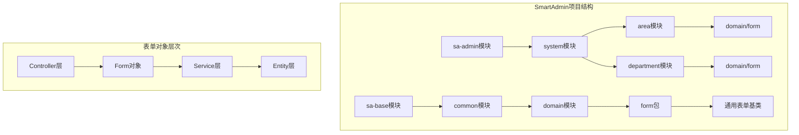
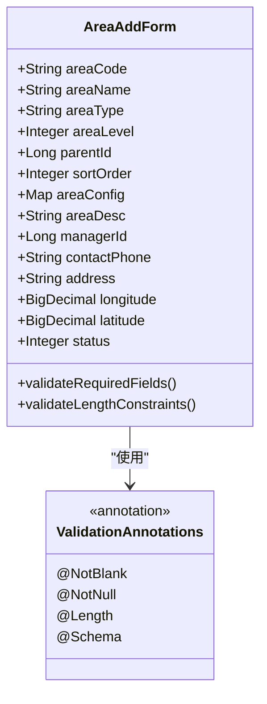
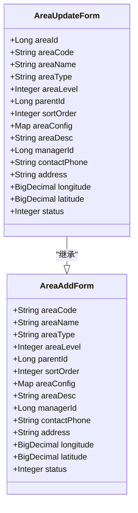
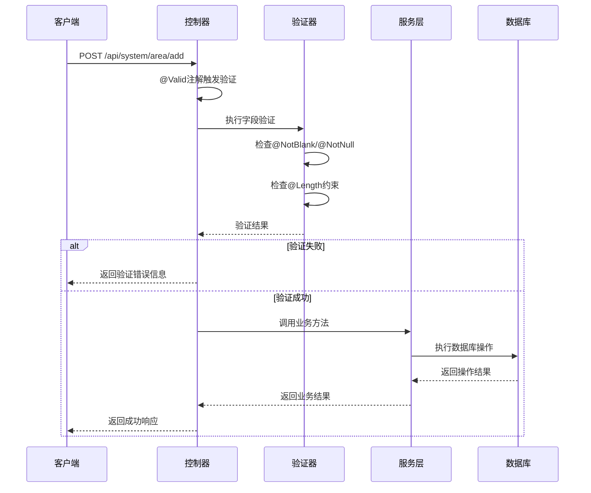
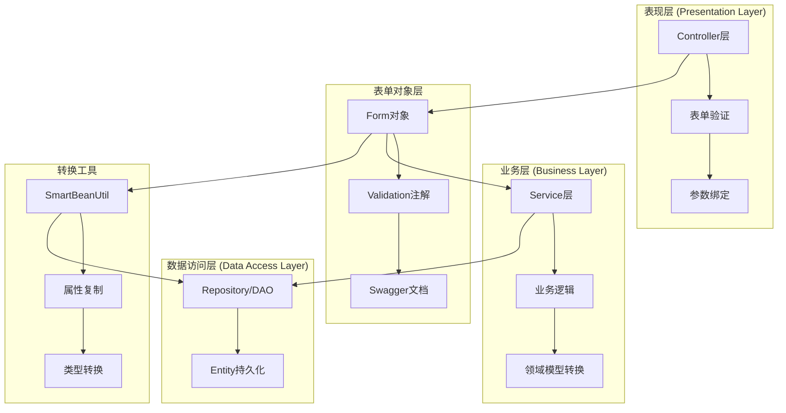
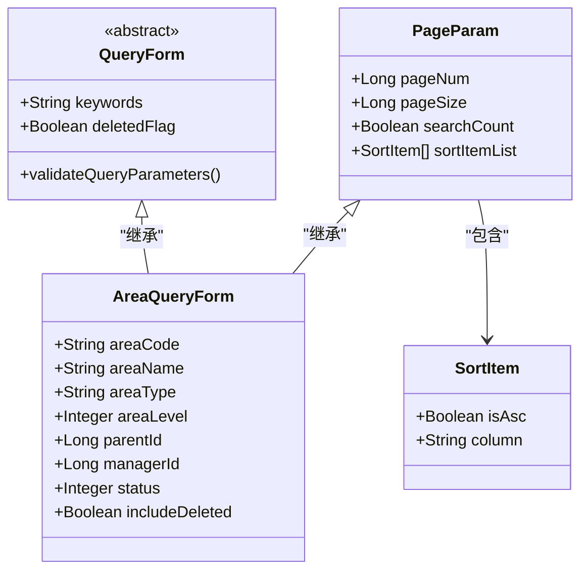
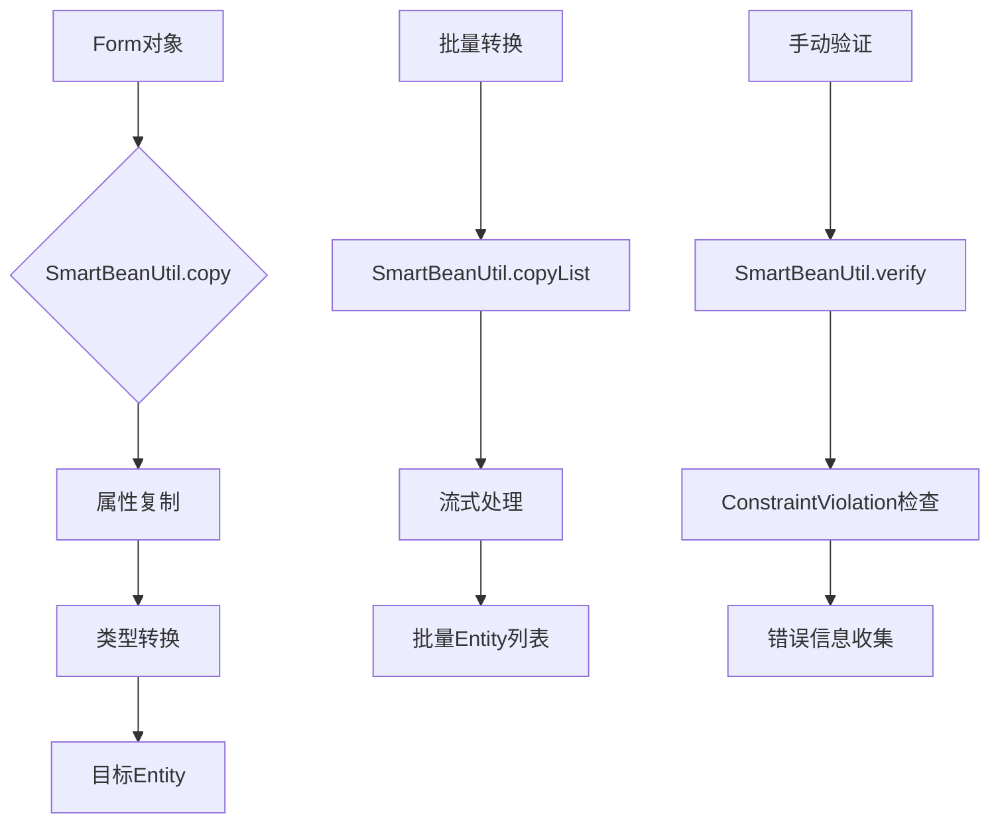
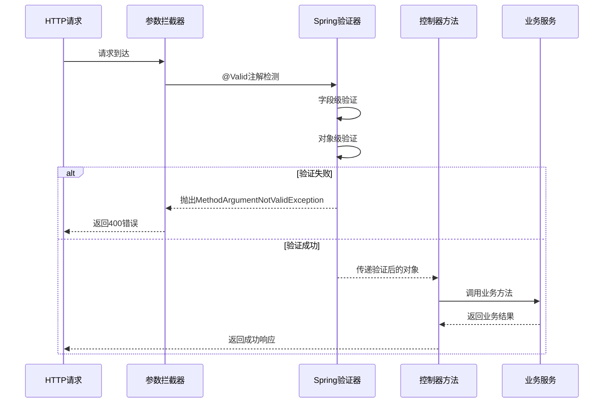
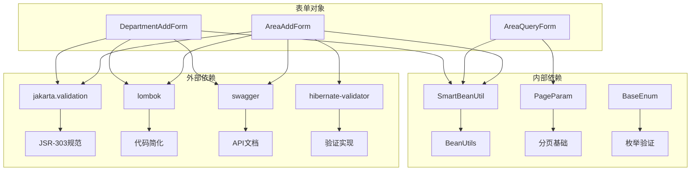

# 表单传输对象

<cite>
**本文档中引用的文件**
- [AreaAddForm.java](file://smart-admin-api-java17-springboot3/sa-admin/src/main/java/net/lab1024/sa/admin/module/system/area/domain/form/AreaAddForm.java)
- [AreaUpdateForm.java](file://smart-admin-api-java17-springboot3/sa-admin/src/main/java/net/lab1024/sa/admin/module/system/area/domain/form/AreaUpdateForm.java)
- [AreaQueryForm.java](file://smart-admin-api-java17-springboot3/sa-admin/src\main\java\net\lab1024/sa/admin/module/system/area/domain/form/AreaQueryForm.java)
- [AreaController.java](file://smart-admin-api-java17-springboot3/sa-admin/src/main/java/net/lab1024/sa/admin/module/system/area/controller/AreaController.java)
- [DepartmentAddForm.java](file://smart-admin-api-java17-springboot3/sa-admin/src/main/java/net/lab1024/sa/admin/module/system/department/domain/form/DepartmentAddForm.java)
- [DepartmentUpdateForm.java](file://smart-admin-api-java17-springboot3/sa-admin/src/main/java/net/lab1024/sa/admin/module/system/department/domain/form/DepartmentUpdateForm.java)
- [DepartmentController.java](file://smart-admin-api-java17-springboot3/sa-admin/src/main/java/net/lab1024/sa/admin/module/system/department/controller/DepartmentController.java)
- [SmartBeanUtil.java](file://smart-admin-api-java17-springboot3/sa-base/src/main/java/net/lab1024/sa/base/common/util/SmartBeanUtil.java)
- [PageParam.java](file://smart-admin-api-java17-springboot3/sa-base/src/main/java/net/lab1024/sa/base/common/domain/PageParam.java)
- [QueryForm.java](file://smart-admin-api-java17-springboot3/sa-base/src/main/resources/code-generator-template/java/domain/form/QueryForm.java.vm)
</cite>

## 目录
1. [引言](#引言)
2. [项目结构概述](#项目结构概述)
3. [核心表单对象设计](#核心表单对象设计)
4. [架构概览](#架构概览)
5. [详细组件分析](#详细组件分析)
6. [依赖关系分析](#依赖关系分析)
7. [性能考虑](#性能考虑)
8. [故障排除指南](#故障排除指南)
9. [结论](#结论)

## 引言

表单传输对象（Form Object）是现代Web应用程序中不可或缺的架构组件，特别是在采用分层架构的Spring Boot项目中。本文档深入分析了SmartAdmin项目中表单对象的设计理念、实现方式以及最佳实践，重点关注AreaAddForm、AreaUpdateForm等核心表单类的应用。

表单对象作为Controller层与Service层之间的桥梁，承担着接收前端请求参数、执行数据验证、传递业务逻辑处理的重要职责。通过合理的表单设计，可以显著提升系统的可维护性、可测试性和安全性。

## 项目结构概述

SmartAdmin项目采用标准的Maven多模块架构，其中表单对象主要分布在以下目录结构中：



**图表来源**
- [AreaController.java](file://smart-admin-api-java17-springboot3/sa-admin/src/main/java/net/lab1024/sa/admin/module/system/area/controller/AreaController.java#L1-L93)
- [DepartmentController.java](file://smart-admin-api-java17-springboot3/sa-admin/src/main/java/net/lab1024/sa/admin/module/system/department/controller/DepartmentController.java#L1-L69)

**章节来源**
- [AreaController.java](file://smart-admin-api-java17-springboot3/sa-admin/src/main/java/net/lab1024/sa/admin/module/system/area/controller/AreaController.java#L1-L93)
- [DepartmentController.java](file://smart-admin-api-java17-springboot3/sa-admin/src/main/java/net/lab1024/sa/admin/module/system/department/controller/DepartmentController.java#L1-L69)

## 核心表单对象设计

### AreaAddForm与AreaUpdateForm设计分析

以区域管理模块的AreaAddForm和AreaUpdateForm为例，展示了表单对象的核心设计理念：

#### AreaAddForm设计特点

AreaAddForm专注于数据创建场景，包含完整的区域信息字段：



**图表来源**
- [AreaAddForm.java](file://smart-admin-api-java17-springboot3/sa-admin/src/main/java/net/lab1024/sa/admin/module/system/area/domain/form/AreaAddForm.java#L1-L74)

#### AreaUpdateForm设计特点

AreaUpdateForm继承了AreaAddForm的部分字段，但增加了区域ID字段用于标识更新对象：



**图表来源**
- [AreaUpdateForm.java](file://smart-admin-api-java17-springboot3/sa-admin/src/main/java/net/lab1024/sa/admin/module/system/area/domain/form/AreaUpdateForm.java#L1-L78)
- [AreaAddForm.java](file://smart-admin-api-java17-springboot3/sa-admin/src/main/java/net/lab1024/sa/admin/module/system/area/domain/form/AreaAddForm.java#L1-L74)

### 验证机制设计

表单对象采用了完整的JSR-303 Bean Validation框架，结合Hibernate Validator实现强类型验证：

#### 验证注解体系

| 注解类型 | 用途 | 示例 |
|---------|------|------|
| @NotBlank | 验证字符串非空且非空白 | 区域名称、区域编码 |
| @NotNull | 验证对象非空 | 父区域ID、区域ID |
| @Length | 验证字符串长度范围 | 区域名称(200字符)、联系电话(20字符) |
| @Schema | 提供OpenAPI文档信息 | 字段描述、示例值 |

#### 验证流程设计



**图表来源**
- [AreaController.java](file://smart-admin-api-java17-springboot3/sa-admin/src/main/java/net/lab1024/sa/admin/module/system/area/controller/AreaController.java#L60-L75)
- [SmartBeanUtil.java](file://smart-admin-api-java17-springboot3/sa-base/src/main/java/net/lab1024/sa/base/common/util/SmartBeanUtil.java#L77-L95)

**章节来源**
- [AreaAddForm.java](file://smart-admin-api-java17-springboot3/sa-admin/src/main/java/net/lab1024/sa/admin/module/system/area/domain/form/AreaAddForm.java#L1-L74)
- [AreaUpdateForm.java](file://smart-admin-api-java17-springboot3/sa-admin/src/main/java/net/lab1024/sa/admin/module/system/area/domain/form/AreaUpdateForm.java#L1-L78)
- [AreaController.java](file://smart-admin-api-java17-springboot3/sa-admin/src/main/java/net/lab1024/sa/admin/module/system/area/controller/AreaController.java#L60-L75)

## 架构概览

SmartAdmin项目的表单对象架构体现了清晰的分层设计原则：



**图表来源**
- [AreaController.java](file://smart-admin-api-java17-springboot3/sa-admin/src/main/java/net/lab1024/sa/admin/module/system/area/controller/AreaController.java#L1-L93)
- [SmartBeanUtil.java](file://smart-admin-api-java17-springboot3/sa-base/src/main/java/net/lab1024/sa/base/common/util/SmartBeanUtil.java#L1-L95)

## 详细组件分析

### QueryForm特殊用途分析

QueryForm作为分页查询专用的表单对象，展现了表单设计的灵活性和扩展性：

#### QueryForm设计特征



**图表来源**
- [AreaQueryForm.java](file://smart-admin-api-java17-springboot3/sa-admin/src/main/java/net/lab1024/sa/admin/module/system/area/domain/form/AreaQueryForm.java#L1-L41)
- [PageParam.java](file://smart-admin-api-java17-springboot3/sa-base/src/main/java/net/lab1024/sa/base/common/domain/PageParam.java#L1-L59)

#### QueryForm与普通Form的区别

| 特性 | 普通Form | QueryForm |
|------|----------|-----------|
| 继承关系 | 独立类 | 继承PageParam |
| 主要用途 | CRUD操作 | 分页查询 |
| 验证策略 | 全字段验证 | 关键字验证 |
| 参数类型 | 实体字段 | 查询条件 |
| 扩展性 | 固定字段 | 可扩展查询 |

### SmartBeanUtil转换工具分析

SmartBeanUtil提供了强大的对象转换能力，是Form与Entity转换的核心工具：

#### 转换机制设计



**图表来源**
- [SmartBeanUtil.java](file://smart-admin-api-java17-springboot3/sa-base/src/main/java/net/lab1024/sa/base/common/util/SmartBeanUtil.java#L47-L95)

#### 转换最佳实践

SmartBeanUtil的copy方法提供了三种转换方式：

1. **属性复制**：直接复制对象属性
2. **对象复制**：创建新对象并复制属性  
3. **批量转换**：处理集合对象转换

**章节来源**
- [AreaQueryForm.java](file://smart-admin-api-java17-springboot3/sa-admin/src/main/java/net/lab1024/sa/admin/module/system/area/domain/form/AreaQueryForm.java#L1-L41)
- [PageParam.java](file://smart-admin-api-java17-springboot3/sa-base/src/main/java/net/lab1024/sa/base/common/domain/PageParam.java#L1-L59)
- [SmartBeanUtil.java](file://smart-admin-api-java17-springboot3/sa-base/src/main/java/net/lab1024/sa/base/common/util/SmartBeanUtil.java#L1-L95)

### Controller层集成分析

Controller层通过@Valid注解实现了表单验证的自动化：

#### 验证集成模式



**图表来源**
- [AreaController.java](file://smart-admin-api-java17-springboot3/sa-admin/src/main/java/net/lab1024/sa/admin/module/system/area/controller/AreaController.java#L60-L75)
- [DepartmentController.java](file://smart-admin-api-java17-springboot3/sa-admin/src/main/java/net/lab1024/sa/admin/module/system/department/controller/DepartmentController.java#L44-L53)

**章节来源**
- [AreaController.java](file://smart-admin-api-java17-springboot3/sa-admin/src/main/java/net/lab1024/sa/admin/module/system/area/controller/AreaController.java#L60-L75)
- [DepartmentController.java](file://smart-admin-api-java17-springboot3/sa-admin/src/main/java/net/lab1024/sa/admin/module/system/department/controller/DepartmentController.java#L44-L53)

## 依赖关系分析

表单对象的依赖关系体现了良好的架构设计原则：



**图表来源**
- [AreaAddForm.java](file://smart-admin-api-java17-springboot3/sa-admin/src/main/java/net/lab1024/sa/admin/module/system/area/domain/form/AreaAddForm.java#L1-L10)
- [DepartmentAddForm.java](file://smart-admin-api-java17-springboot3/sa-admin/src/main/java/net/lab1024/sa/admin/module/system/department/domain/form/DepartmentAddForm.java#L1-L10)

### 核心依赖说明

| 依赖组件 | 版本要求 | 作用 | 必需性 |
|---------|----------|------|--------|
| spring-boot-starter-validation | 3.x+ | Bean验证支持 | 必需 |
| hibernate-validator | 8.x+ | JSR-303实现 | 必需 |
| lombok | 1.18+ | 代码简化 | 推荐 |
| spring-boot-starter-web | 3.x+ | Web支持 | 必需 |

**章节来源**
- [AreaAddForm.java](file://smart-admin-api-java17-springboot3/sa-admin/src/main/java/net/lab1024/sa/admin/module/system/area/domain/form/AreaAddForm.java#L1-L10)
- [DepartmentAddForm.java](file://smart-admin-api-java17-springboot3/sa-admin/src/main/java/net/lab1024/sa/admin/module/system/department/domain/form/DepartmentAddForm.java#L1-L10)

## 性能考虑

表单对象设计在性能方面需要考虑以下几个关键因素：

### 验证性能优化

1. **延迟验证**：仅在必要时执行验证逻辑
2. **缓存验证器**：SmartBeanUtil中静态初始化验证器
3. **选择性验证**：根据业务场景选择性启用验证

### 内存使用优化

1. **对象复用**：合理使用对象池减少GC压力
2. **字段精简**：避免不必要的字段定义
3. **批量处理**：利用SmartBeanUtil的批量转换功能

### 并发安全考虑

所有表单对象都是无状态的，适合并发访问。SmartBeanUtil的验证器也是线程安全的。

## 故障排除指南

### 常见验证问题

#### 验证失败处理

当表单验证失败时，系统会抛出MethodArgumentNotValidException异常，可以通过全局异常处理器统一处理：

```java
// 异常处理示例路径
// sa-base/src/main/java/net/lab1024/sa/base/handler/GlobalExceptionHandler.java
```

#### 验证消息本地化

系统支持多语言验证消息，需要正确配置messages.properties文件。

### 转换问题诊断

#### SmartBeanUtil转换失败

1. **检查字段类型兼容性**
2. **验证getter/setter方法**
3. **确认泛型类型信息**

#### 性能问题排查

1. **验证器初始化开销**
2. **大量数据转换性能**
3. **内存泄漏风险**

**章节来源**
- [SmartBeanUtil.java](file://smart-admin-api-java17-springboot3/sa-base/src/main/java/net/lab1024/sa/base/common/util/SmartBeanUtil.java#L77-L95)

## 结论

SmartAdmin项目的表单对象设计体现了现代Java Web开发的最佳实践，通过以下核心特性实现了高质量的架构设计：

### 设计优势总结

1. **清晰的职责分离**：Form对象专门负责参数接收和验证，Service层专注于业务逻辑
2. **强类型验证**：基于JSR-303的完整验证体系，确保数据完整性
3. **灵活的扩展性**：QueryForm等特殊用途表单展现了良好的设计灵活性
4. **高效的转换机制**：SmartBeanUtil提供了便捷的对象转换工具
5. **完善的文档支持**：Swagger注解确保API文档的准确性

### 最佳实践建议

1. **合理设计Form继承关系**：通过继承减少重复代码，提高维护性
2. **精确控制验证粒度**：根据业务场景选择合适的验证策略
3. **充分利用转换工具**：善用SmartBeanUtil简化对象转换逻辑
4. **重视性能优化**：在高并发场景下注意验证和转换的性能影响
5. **完善异常处理**：建立统一的验证错误处理机制

### 发展方向

随着技术的发展，表单对象设计可以进一步演进：

1. **响应式编程支持**：适应Reactor生态系统的异步处理需求
2. **函数式验证**：引入函数式验证逻辑，提高表达能力
3. **编译时验证**：探索编译时验证的可能性，提升运行时性能
4. **AI辅助验证**：利用机器学习优化验证规则和错误提示

通过持续优化表单对象设计，可以构建更加健壮、高效、易维护的企业级应用系统。