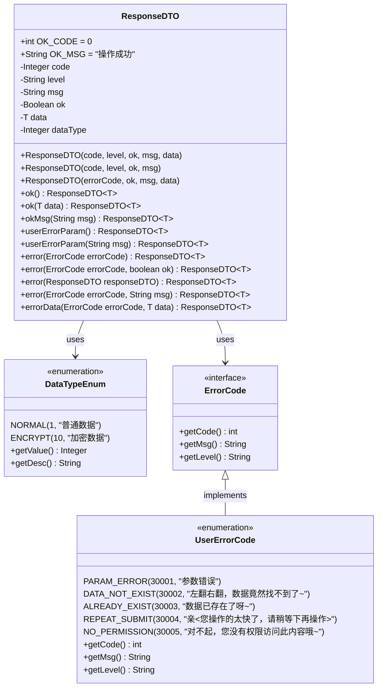
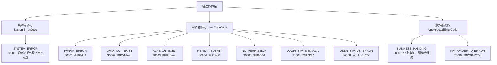
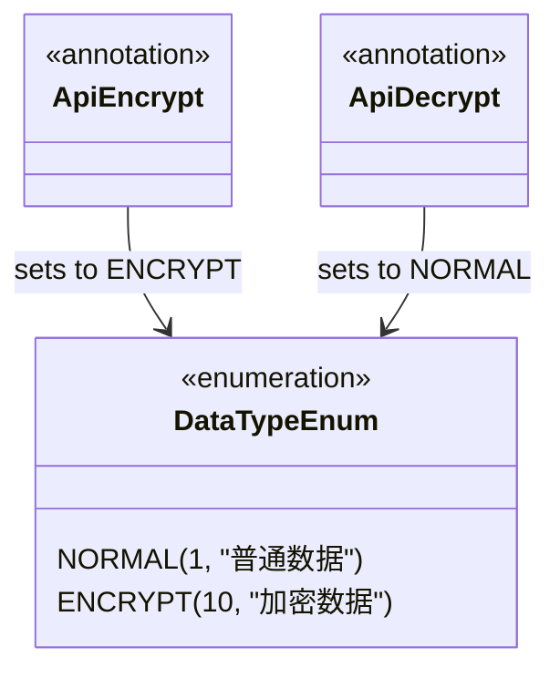
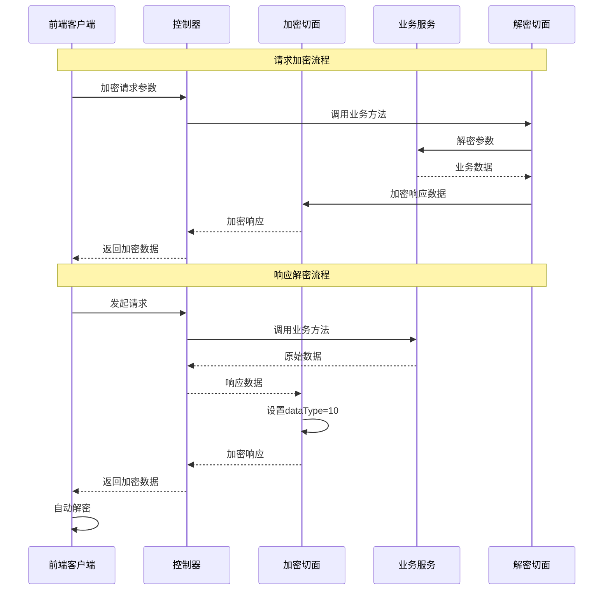

# 请求/响应格式

<cite>
**本文档引用的文件**
- [ResponseDTO.java](file://smart-admin-api-java17-springboot3/sa-base/src/main/java/net/lab1024/sa/base/common/domain/ResponseDTO.java)
- [DataTypeEnum.java](file://smart-admin-api-java17-springboot3/sa-base/src/main/java/net/lab1024/sa/base/common/enumeration/DataTypeEnum.java)
- [UserErrorCode.java](file://smart-admin-api-java17-springboot3/sa-base/src/main/java/net/lab1024/sa/base/common/code/UserErrorCode.java)
- [ErrorCode.java](file://smart-admin-api-java17-springboot3/sa-base/src/main/java/net/lab1024/sa/base/common/code/ErrorCode.java)
- [SystemErrorCode.java](file://smart-admin-api-java17-springboot3/sa-base/src/main/java/net/lab1024/sa/base/common/code/SystemErrorCode.java)
- [UnexpectedErrorCode.java](file://smart-admin-api-java17-springboot3/sa-base/src/main/java/net/lab1024/sa/base/common/code/UnexpectedErrorCode.java)
- [AdminApiEncryptController.java](file://smart-admin-api-java17-springboot3/sa-admin/src/main/java/net/lab1024/sa/admin/module/system/support/AdminApiEncryptController.java)
- [EncryptResponseAdvice.java](file://smart-admin-api-java17-springboot3/sa-base/src/main/java/net/lab1024/sa/base/module/support/apiencrypt/advice/EncryptResponseAdvice.java)
- [DecryptRequestAdvice.java](file://smart-admin-api-java17-springboot3/sa-base/src/main/java/net/lab1024/sa/base/module/support/apiencrypt/advice/DecryptRequestAdvice.java)
- [axios.js](file://smart-admin-web-javascript/src/lib/axios.js)
- [encrypt.js](file://smart-admin-web-javascript/src/lib/encrypt.js)
- [common-const.js](file://smart-admin-web-javascript/src/constants/common-const.js)
- [LoginController.java](file://smart-admin-api-java17-springboot3/sa-admin/src/main/java/net/lab1024/sa/admin/module/system/login/controller/LoginController.java)
- [EmployeeController.java](file://smart-admin-api-java17-springboot3/sa-admin/src/main/java/net/lab1024/sa/admin/module/system/employee/controller/EmployeeController.java)
</cite>

## 目录
1. [概述](#概述)
2. [ResponseDTO类设计](#responsedto类设计)
3. [核心字段详解](#核心字段详解)
4. [静态方法使用指南](#静态方法使用指南)
5. [错误码体系](#错误码体系)
6. [加密数据处理](#加密数据处理)
7. [前后端交互示例](#前后端交互示例)
8. [前端解析最佳实践](#前端解析最佳实践)
9. [总结](#总结)

## 概述

SmartAdmin框架采用统一的请求响应格式，通过ResponseDTO类提供标准化的API响应结构。该设计确保了前后端交互的一致性，简化了错误处理和数据传输流程。

## ResponseDTO类设计

ResponseDTO是一个泛型类，提供了灵活且强大的响应数据结构。



**图表来源**
- [ResponseDTO.java](file://smart-admin-api-java17-springboot3/sa-base/src/main/java/net/lab1024/sa/base/common/domain/ResponseDTO.java#L22-L122)
- [DataTypeEnum.java](file://smart-admin-api-java17-springboot3/sa-base/src/main/java/net/lab1024/sa/base/common/enumeration/DataTypeEnum.java#L15-L32)
- [ErrorCode.java](file://smart-admin-api-java17-springboot3/sa-base/src/main/java/net/lab1024/sa/base/common/code/ErrorCode.java#L1-L47)

**章节来源**
- [ResponseDTO.java](file://smart-admin-api-java17-springboot3/sa-base/src/main/java/net/lab1024/sa/base/common/domain/ResponseDTO.java#L1-L122)

## 核心字段详解

### code字段
- **类型**: `Integer`
- **含义**: 返回码，用于标识响应状态
- **约定**: 成功响应使用`OK_CODE`(0)，失败响应使用相应的错误码
- **应用场景**: 前端根据code值判断请求是否成功

### level字段
- **类型**: `String`
- **含义**: 错误级别，区分系统级、用户级和意外错误
- **可选值**: 
  - `"system"`: 系统错误
  - `"user"`: 用户错误
  - `"unexpected"`: 意外错误

### msg字段
- **类型**: `String`
- **含义**: 错误消息，提供具体的错误描述
- **优先级**: 当传入自定义msg时使用自定义消息，否则使用错误码对应的默认消息

### ok字段
- **类型**: `Boolean`
- **含义**: 操作成功标志
- **约定**: 成功响应为`true`，失败响应为`false`

### data字段
- **类型**: `T` (泛型)
- **含义**: 返回的数据内容
- **应用场景**: 成功响应携带业务数据，失败响应通常为null

### dataType字段
- **类型**: `Integer`
- **含义**: 数据类型标识
- **关联枚举**: DataTypeEnum
- **取值说明**:
  - `1`: NORMAL - 普通数据
  - `10`: ENCRYPT - 加密数据

**章节来源**
- [ResponseDTO.java](file://smart-admin-api-java17-springboot3/sa-base/src/main/java/net/lab1024/sa/base/common/domain/ResponseDTO.java#L28-L43)

## 静态方法使用指南

### 成功响应方法

#### ok()
```java
// 最简单的成功响应
ResponseDTO<String> response = ResponseDTO.ok();
// 返回: {"code":0,"ok":true,"msg":"操作成功","data":null}
```

#### ok(T data)
```java
// 携带数据的成功响应
String result = "操作完成";
ResponseDTO<String> response = ResponseDTO.ok(result);
// 返回: {"code":0,"ok":true,"msg":"操作成功","data":"操作完成"}
```

#### okMsg(String msg)
```java
// 自定义成功消息
ResponseDTO<String> response = ResponseDTO.okMsg("任务执行成功");
// 返回: {"code":0,"ok":true,"msg":"任务执行成功","data":null}
```

### 用户参数错误方法

#### userErrorParam()
```java
// 参数验证失败
ResponseDTO<String> response = ResponseDTO.userErrorParam();
// 返回: {"code":30001,"level":"user","ok":false,"msg":"参数错误","data":null}
```

#### userErrorParam(String msg)
```java
// 自定义参数错误消息
ResponseDTO<String> response = ResponseDTO.userErrorParam("用户名不能为空");
// 返回: {"code":30001,"level":"user","ok":false,"msg":"用户名不能为空","data":null}
```

### 错误响应方法

#### error(ErrorCode errorCode)
```java
// 系统错误响应
ResponseDTO<String> response = ResponseDTO.error(SystemErrorCode.SYSTEM_ERROR);
// 返回: {"code":10001,"level":"system","ok":false,"msg":"系统似乎出现了点小问题","data":null}
```

#### error(ErrorCode errorCode, boolean ok)
```java
// 自定义成功标志的错误响应
ResponseDTO<String> response = ResponseDTO.error(UserErrorCode.NO_PERMISSION, true);
// 返回: {"code":30005,"level":"user","ok":true,"msg":"对不起，您没有权限访问此内容哦~","data":null}
```

#### errorData(ErrorCode errorCode, T data)
```java
// 错误响应携带数据
ResponseDTO<UserVO> response = ResponseDTO.errorData(UserErrorCode.DATA_NOT_EXIST, userVO);
// 返回: {"code":30002,"level":"user","ok":false,"msg":"左翻右翻，数据竟然找不到了~","data":userVO}
```

**章节来源**
- [ResponseDTO.java](file://smart-admin-api-java17-springboot3/sa-base/src/main/java/net/lab1024/sa/base/common/domain/ResponseDTO.java#L74-L121)

## 错误码体系

SmartAdmin采用三层错误码体系，每层都有明确的职责和使用场景。



**图表来源**
- [SystemErrorCode.java](file://smart-admin-api-java17-springboot3/sa-base/src/main/java/net/lab1024/sa/base/common/code/SystemErrorCode.java#L18-L39)
- [UserErrorCode.java](file://smart-admin-api-java17-springboot3/sa-base/src/main/java/net/lab1024/sa/base/common/code/UserErrorCode.java#L18-L53)
- [UnexpectedErrorCode.java](file://smart-admin-api-java17-springboot3/sa-base/src/main/java/net/lab1024/sa/base/common/code/UnexpectedErrorCode.java#L18-L43)

### 错误码使用约定

1. **系统错误**: 以1开头，表示系统层面的问题
2. **用户错误**: 以3开头，表示用户操作导致的错误
3. **意外错误**: 以2开头，表示不应该发生的异常情况

**章节来源**
- [ErrorCode.java](file://smart-admin-api-java17-springboot3/sa-base/src/main/java/net/lab1024/sa/base/common/code/ErrorCode.java#L1-L47)
- [SystemErrorCode.java](file://smart-admin-api-java17-springboot3/sa-base/src/main/java/net/lab1024/sa/base/common/code/SystemErrorCode.java#L1-L39)
- [UserErrorCode.java](file://smart-admin-api-java17-springboot3/sa-base/src/main/java/net/lab1024/sa/base/common/code/UserErrorCode.java#L1-L53)
- [UnexpectedErrorCode.java](file://smart-admin-api-java17-springboot3/sa-base/src/main/java/net/lab1024/sa/base/common/code/UnexpectedErrorCode.java#L1-L43)

## 加密数据处理

SmartAdmin支持API数据加密传输，通过注解和自动切面实现透明的加密解密。

### 加密类型



**图表来源**
- [DataTypeEnum.java](file://smart-admin-api-java17-springboot3/sa-base/src/main/java/net/lab1024/sa/base/common/enumeration/DataTypeEnum.java#L15-L32)
- [ApiEncrypt.java](file://smart-admin-api-java17-springboot3/sa-base/src/main/java/net/lab1024/sa/base/module/support/apiencrypt/annotation/ApiEncrypt.java#L1-L20)
- [ApiDecrypt.java](file://smart-admin-api-java17-springboot3/sa-base/src/main/java/net/lab1024/sa/base/module/support/apiencrypt/annotation/ApiDecrypt.java#L1-L20)

### 加密流程



**图表来源**
- [EncryptResponseAdvice.java](file://smart-admin-api-java17-springboot3/sa-base/src/main/java/net/lab1024/sa/base/module/support/apiencrypt/advice/EncryptResponseAdvice.java#L34-L63)
- [DecryptRequestAdvice.java](file://smart-admin-api-java17-springboot3/sa-base/src/main/java/net/lab1024/sa/base/module/support/apiencrypt/advice/DecryptRequestAdvice.java#L34-L39)

### 加密算法支持

1. **AES加密**: 支持128位密钥长度
2. **国密SM4**: 符合中国国家标准

**章节来源**
- [AdminApiEncryptController.java](file://smart-admin-api-java17-springboot3/sa-admin/src/main/java/net/lab1024/sa/admin/module/system/support/AdminApiEncryptController.java#L36-L81)
- [EncryptResponseAdvice.java](file://smart-admin-api-java17-springboot3/sa-base/src/main/java/net/lab1024/sa/base/module/support/apiencrypt/advice/EncryptResponseAdvice.java#L1-L63)
- [DecryptRequestAdvice.java](file://smart-admin-api-java17-springboot3/sa-base/src/main/java/net/lab1024/sa/base/module/support/apiencrypt/advice/DecryptRequestAdvice.java#L1-L39)

## 前后端交互示例

### 成功响应示例

#### 基础成功响应
```json
{
  "code": 0,
  "ok": true,
  "msg": "操作成功",
  "data": null
}
```

#### 携带数据的成功响应
```json
{
  "code": 0,
  "ok": true,
  "msg": "操作成功",
  "data": {
    "userId": 1001,
    "userName": "admin",
    "email": "admin@example.com"
  }
}
```

### 参数错误响应示例
```json
{
  "code": 30001,
  "level": "user",
  "ok": false,
  "msg": "用户名不能为空",
  "data": null
}
```

### 业务错误响应示例
```json
{
  "code": 30002,
  "level": "user",
  "ok": false,
  "msg": "用户不存在",
  "data": null
}
```

### 系统错误响应示例
```json
{
  "code": 10001,
  "level": "system",
  "ok": false,
  "msg": "系统似乎出现了点小问题",
  "data": null
}
```

### 加密数据响应示例
```json
{
  "code": 0,
  "ok": true,
  "msg": "操作成功",
  "data": "加密后的数据字符串",
  "dataType": 10
}
```

**章节来源**
- [LoginController.java](file://smart-admin-api-java17-springboot3/sa-admin/src/main/java/net/lab1024/sa/admin/module/system/login/controller/LoginController.java#L45-L89)
- [EmployeeController.java](file://smart-admin-api-java17-springboot3/sa-admin/src/main/java/net/lab1024/sa/admin/module/system/employee/controller/EmployeeController.java#L42-L129)

## 前端解析最佳实践

### Axios拦截器配置

前端通过Axios拦截器自动处理响应数据，包括加密数据解密和错误处理。

```javascript
// 响应拦截器 - 处理加密数据
smartAxios.interceptors.response.use(
  (response) => {
    // 如果是加密数据
    if (response.data.dataType === DATA_TYPE_ENUM.ENCRYPT.value) {
      response.data.encryptData = response.data.data;
      let decryptStr = decryptData(response.data.data);
      if (decryptStr) {
        response.data.data = JSON.parse(decryptStr);
      }
    }
    
    // 错误处理
    const res = response.data;
    if (res.code && res.code !== 1) {
      // 特殊错误处理逻辑
      if (res.code === 30007 || res.code === 30008) {
        // 登录失效处理
        message.error('您没有登录，请重新登录');
        setTimeout(logout, 300);
        return Promise.reject(response);
      }
      
      // 显示错误消息
      message.error(res.msg);
      return Promise.reject(response);
    }
    
    return Promise.resolve(res);
  }
);
```

### 数据类型常量定义

```javascript
export const DATA_TYPE_ENUM = {
  NORMAL: {
    value: 1,
    desc: '普通',
  },
  ENCRYPT: {
    value: 10,
    desc: '加密',
  },
};
```

### 加密数据处理函数

```javascript
// 加密请求参数
export const postEncryptRequest = (url, data) => {
  return request({
    data: { encryptData: encryptData(data) },
    url,
    method: 'post',
  });
};

// 解密响应数据
const decryptData = function (data) {
  return !data ? null : EncryptObject.decryptData(data);
};
```

### 错误处理策略

1. **登录状态检查**: 自动检测登录失效并跳转登录页
2. **权限错误**: 显示权限不足提示
3. **业务错误**: 显示具体的业务错误信息
4. **系统错误**: 提供友好的系统错误提示

**章节来源**
- [axios.js](file://smart-admin-web-javascript/src/lib/axios.js#L54-L111)
- [encrypt.js](file://smart-admin-web-javascript/src/lib/encrypt.js#L108-L121)
- [common-const.js](file://smart-admin-web-javascript/src/constants/common-const.js#L61-L73)

## 总结

SmartAdmin的请求响应格式设计体现了以下特点：

1. **统一性**: 所有API响应都遵循相同的格式规范
2. **完整性**: 包含状态码、消息、数据和元信息
3. **扩展性**: 支持加密传输和多种数据类型
4. **易用性**: 提供丰富的静态方法简化响应构建
5. **安全性**: 内置加密机制保护敏感数据传输

通过合理使用ResponseDTO类和相关工具，开发者可以构建出既安全又易于维护的API系统。前端开发者只需关注响应数据的解析和错误处理，无需关心底层的加密细节。