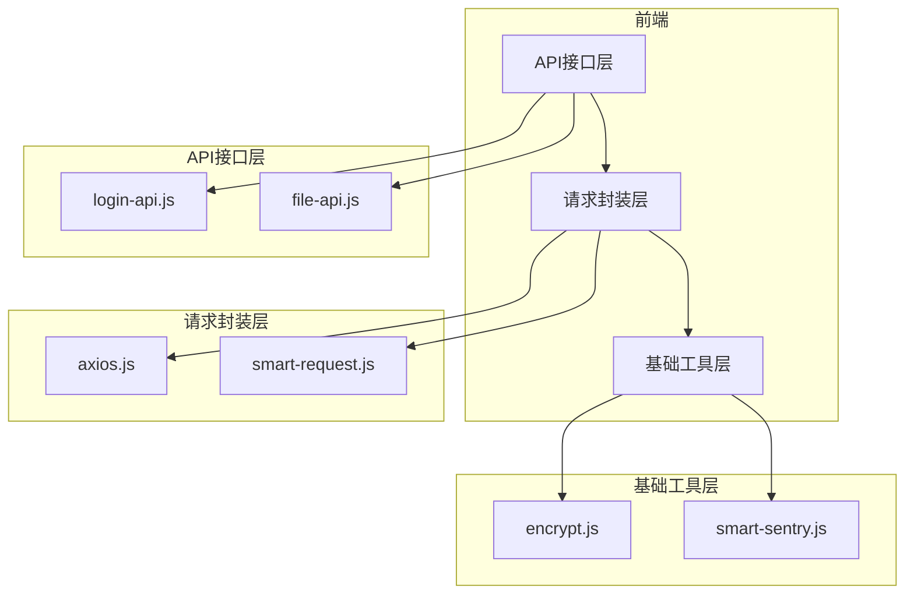
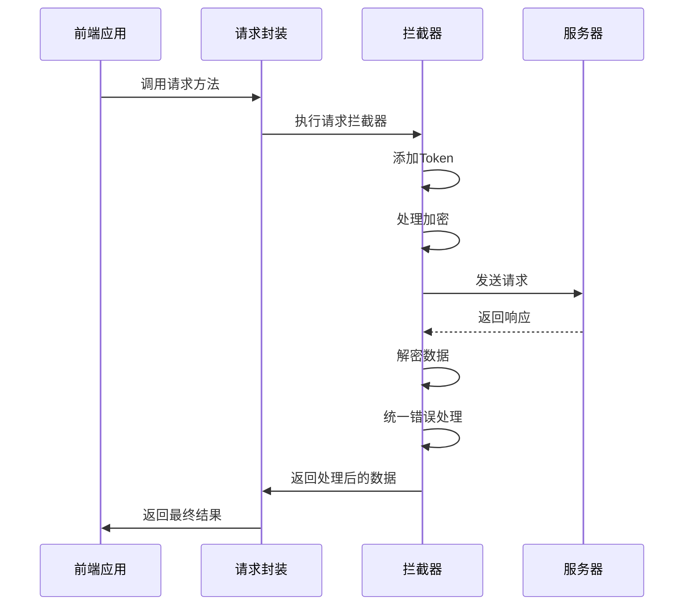
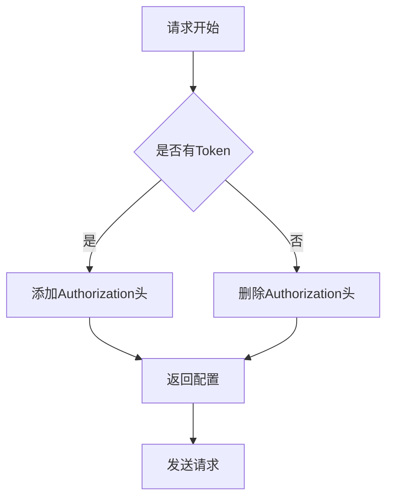
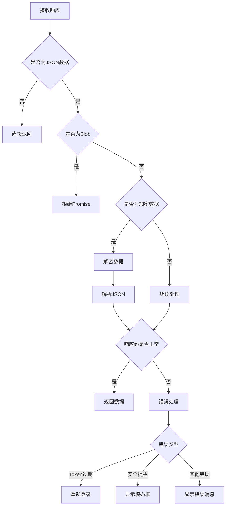
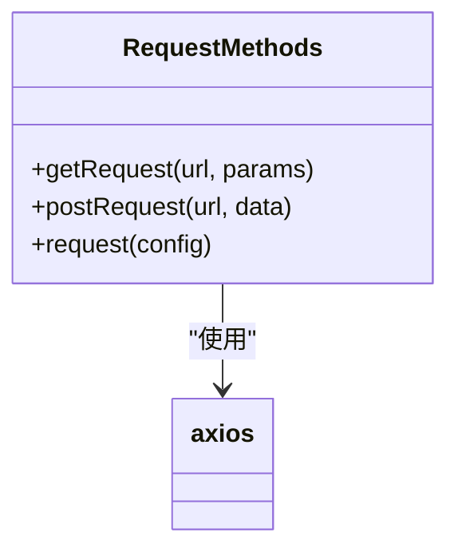
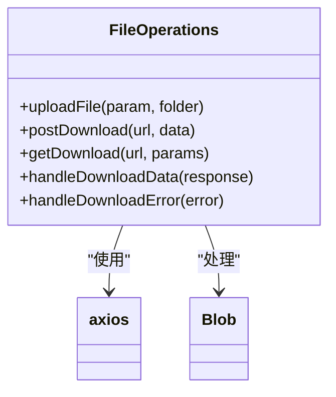
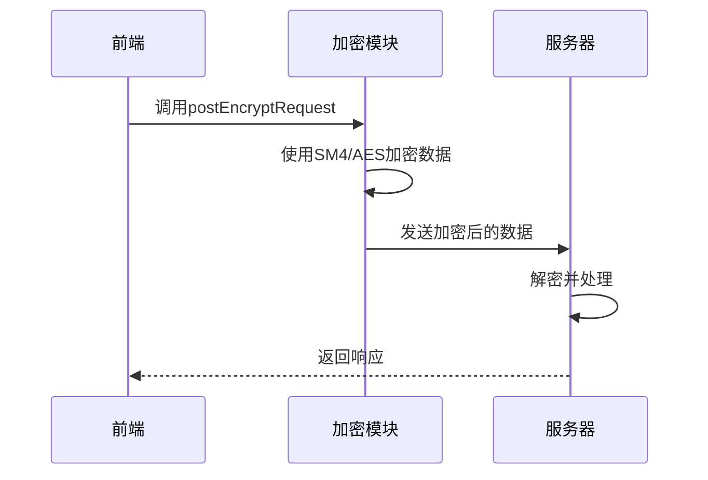
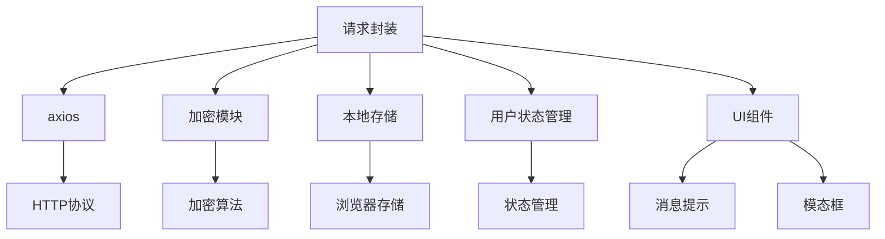

# 请求封装

<cite>
**本文档引用的文件**
- [axios.js](file://smart-admin-web-javascript\src\lib\axios.js)
- [smart-request.js](file://smart-app\src\lib\smart-request.js)
- [encrypt.js](file://smart-admin-web-javascript\src\lib\encrypt.js)
- [login-api.js](file://smart-admin-web-javascript\src\api\system\login-api.js)
- [file-api.js](file://smart-admin-web-javascript\src\api\support\file-api.js)
</cite>

## 目录
1. [项目结构](#项目结构)
2. [核心组件](#核心组件)
3. [架构概述](#架构概述)
4. [详细组件分析](#详细组件分析)
5. [依赖分析](#依赖分析)
6. [性能考虑](#性能考虑)
7. [故障排除指南](#故障排除指南)
8. [结论](#结论)

## 项目结构
项目结构展示了请求封装在整体架构中的位置和组织方式。

**图示来源**
- [axios.js](file://smart-admin-web-javascript\src\lib\axios.js)
- [smart-request.js](file://smart-app\src\lib\smart-request.js)
- [encrypt.js](file://smart-admin-web-javascript\src\lib\encrypt.js)

**章节来源**
- [axios.js](file://smart-admin-web-javascript\src\lib\axios.js#L1-L251)
- [smart-request.js](file://smart-app\src\lib\smart-request.js#L1-L129)

## 核心组件
请求封装的核心组件包括axios实例的创建、请求和响应拦截器的配置、以及各种请求方法的封装。

**章节来源**
- [axios.js](file://smart-admin-web-javascript\src\lib\axios.js#L22-L128)
- [smart-request.js](file://smart-app\src\lib\smart-request.js#L63-L80)

## 架构概述
请求封装的架构设计旨在提供一个统一、安全、易用的HTTP请求处理机制。

**图示来源**
- [axios.js](file://smart-admin-web-javascript\src\lib\axios.js#L35-L128)
- [smart-request.js](file://smart-app\src\lib\smart-request.js#L63-L80)

## 详细组件分析
对请求封装的各个组件进行深入分析，包括拦截器、请求方法、加密处理等。

### 请求拦截器分析
请求拦截器负责在请求发送前进行预处理，如添加认证信息、设置请求头等。

**图示来源**
- [axios.js](file://smart-admin-web-javascript\src\lib\axios.js#L35-L50)

**章节来源**
- [axios.js](file://smart-admin-web-javascript\src\lib\axios.js#L35-L50)

### 响应拦截器分析
响应拦截器负责处理服务器返回的响应，包括数据解包、错误统一处理等。

**图示来源**
- [axios.js](file://smart-admin-web-javascript\src\lib\axios.js#L55-L128)

**章节来源**
- [axios.js](file://smart-admin-web-javascript\src\lib\axios.js#L55-L128)

### 请求方法封装分析
封装了多种请求方法，以适应不同的使用场景。

#### GET和POST请求

**图示来源**
- [axios.js](file://smart-admin-web-javascript\src\lib\axios.js#L134-L155)

**章节来源**
- [axios.js](file://smart-admin-web-javascript\src\lib\axios.js#L134-L155)

#### 文件上传和下载

**图示来源**
- [axios.js](file://smart-admin-web-javascript\src\lib\axios.js#L172-L250)
- [file-api.js](file://smart-admin-web-javascript\src\api\support\file-api.js#L1-L38)

**章节来源**
- [axios.js](file://smart-admin-web-javascript\src\lib\axios.js#L172-L250)
- [file-api.js](file://smart-admin-web-javascript\src\api\support\file-api.js#L1-L38)

### 加密请求分析
支持对请求数据进行加密传输，确保数据安全。

**图示来源**
- [axios.js](file://smart-admin-web-javascript\src\lib\axios.js#L162-L168)
- [encrypt.js](file://smart-admin-web-javascript\src\lib\encrypt.js#L1-L121)

**章节来源**
- [axios.js](file://smart-admin-web-javascript\src\lib\axios.js#L162-L168)
- [encrypt.js](file://smart-admin-web-javascript\src\lib\encrypt.js#L1-L121)

## 依赖分析
分析请求封装与其他组件的依赖关系。

**图示来源**
- [axios.js](file://smart-admin-web-javascript\src\lib\axios.js#L11-L17)
- [smart-request.js](file://smart-app\src\lib\smart-request.js#L10-L13)

**章节来源**
- [axios.js](file://smart-admin-web-javascript\src\lib\axios.js#L11-L17)
- [smart-request.js](file://smart-app\src\lib\smart-request.js#L10-L13)

## 性能考虑
请求封装在性能方面的考虑和优化措施。

- **连接复用**：通过axios的配置实现HTTP连接复用
- **错误处理**：统一的错误处理机制减少重复代码
- **资源管理**：合理管理Blob对象，避免内存泄漏
- **异步处理**：所有请求均为异步，避免阻塞主线程

**章节来源**
- [axios.js](file://smart-admin-web-javascript\src\lib\axios.js#L22-L25)
- [axios.js](file://smart-admin-web-javascript\src\lib\axios.js#L226-L249)

## 故障排除指南
常见问题及解决方案。

### Token相关问题
- **问题**：Token过期或无效
- **解决方案**：检查用户登录状态，重新登录获取新Token

### 文件下载问题
- **问题**：文件下载失败
- **解决方案**：检查网络连接，确认服务器返回的Content-Type和Content-Disposition头信息

### 加密解密问题
- **问题**：加密数据无法正确解密
- **解决方案**：确认前后端使用的加密算法和密钥一致

**章节来源**
- [axios.js](file://smart-admin-web-javascript\src\lib\axios.js#L79-L108)
- [axios.js](file://smart-admin-web-javascript\src\lib\axios.js#L205-L218)

## 结论
请求封装提供了一套完整的HTTP请求处理方案，通过拦截器机制实现了请求的预处理和响应的后处理，统一了错误处理逻辑，提高了代码的可维护性和安全性。同时，通过封装不同的请求方法，简化了API调用，使开发者能够更专注于业务逻辑的实现。