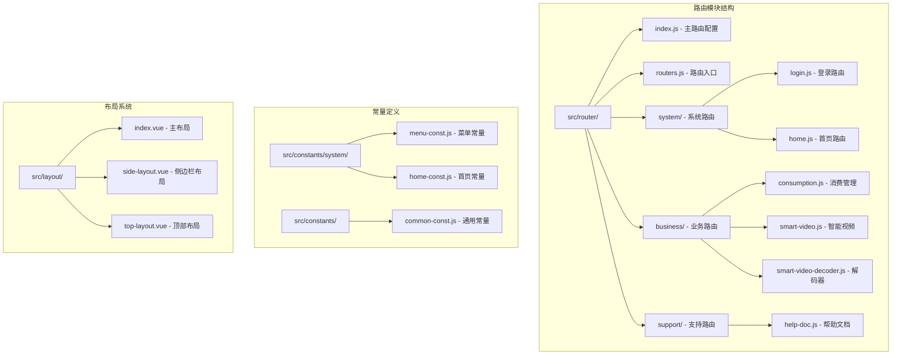
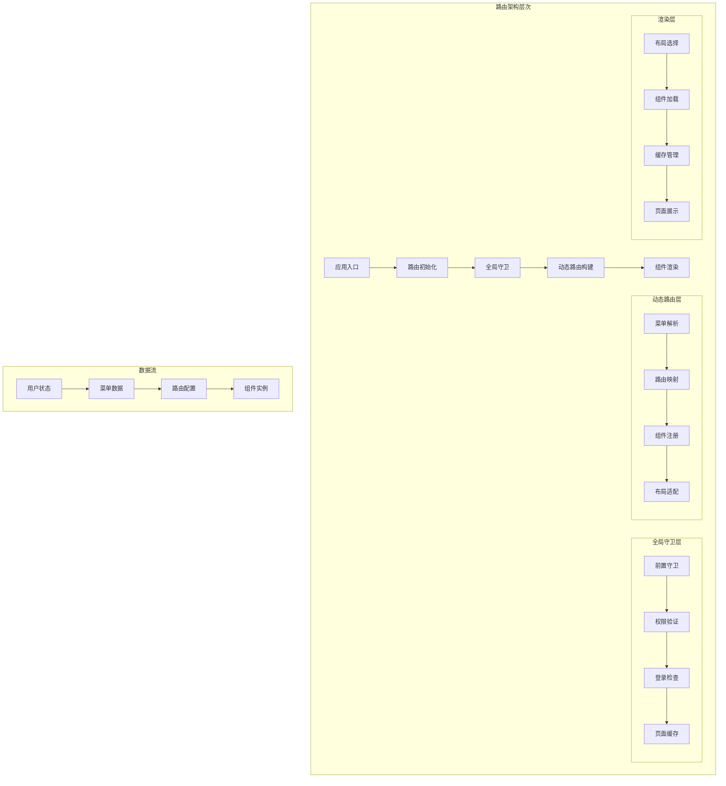
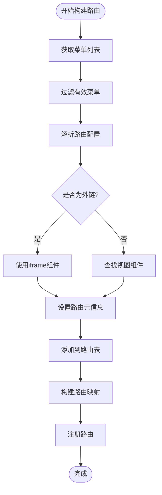
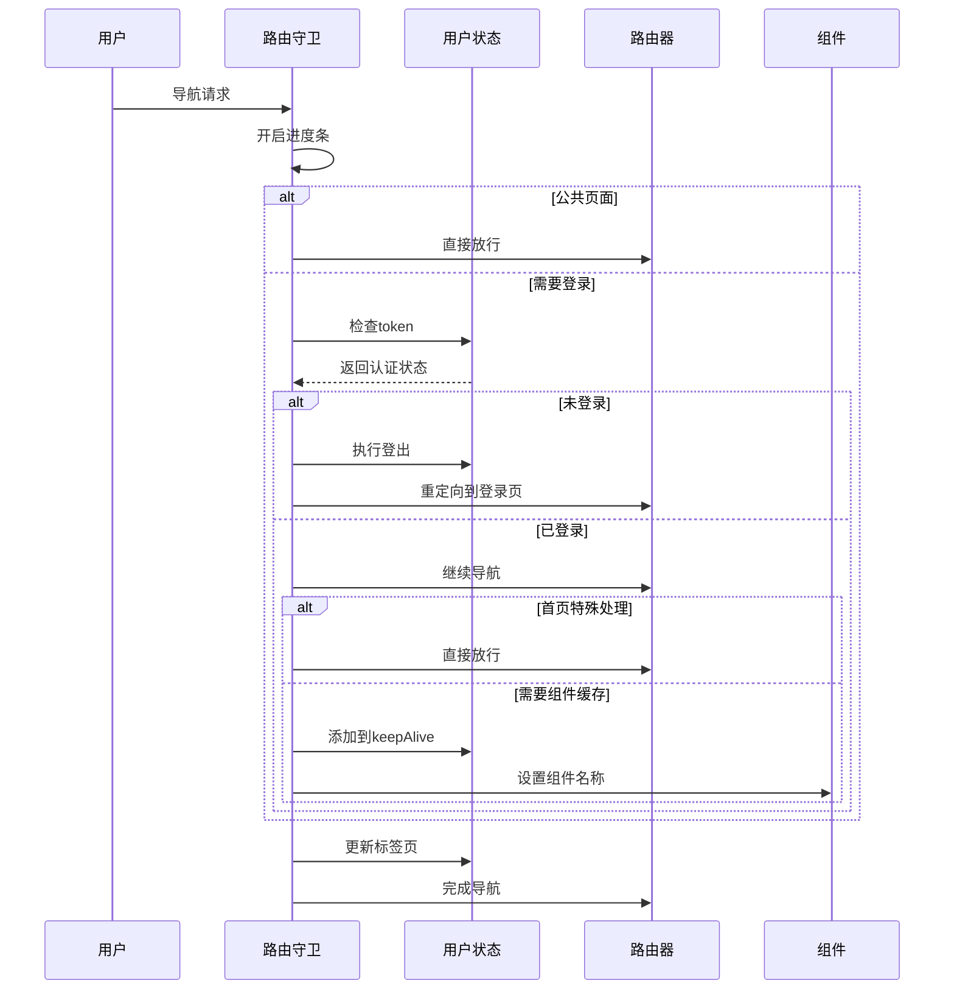
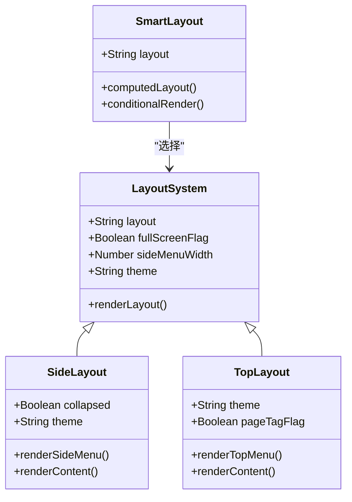
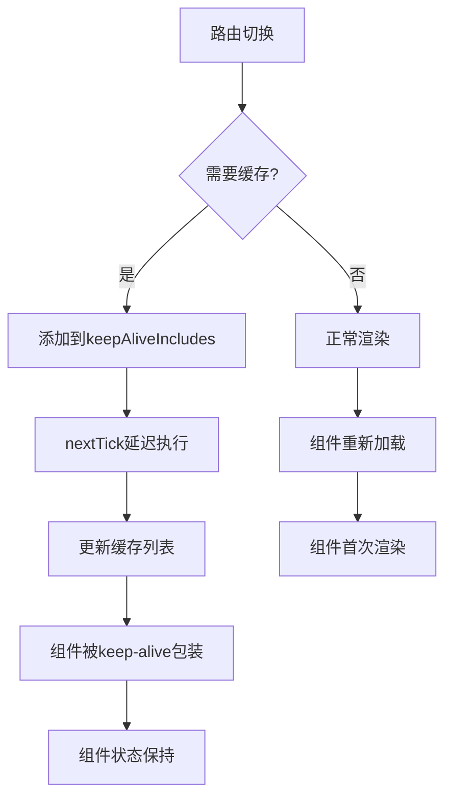
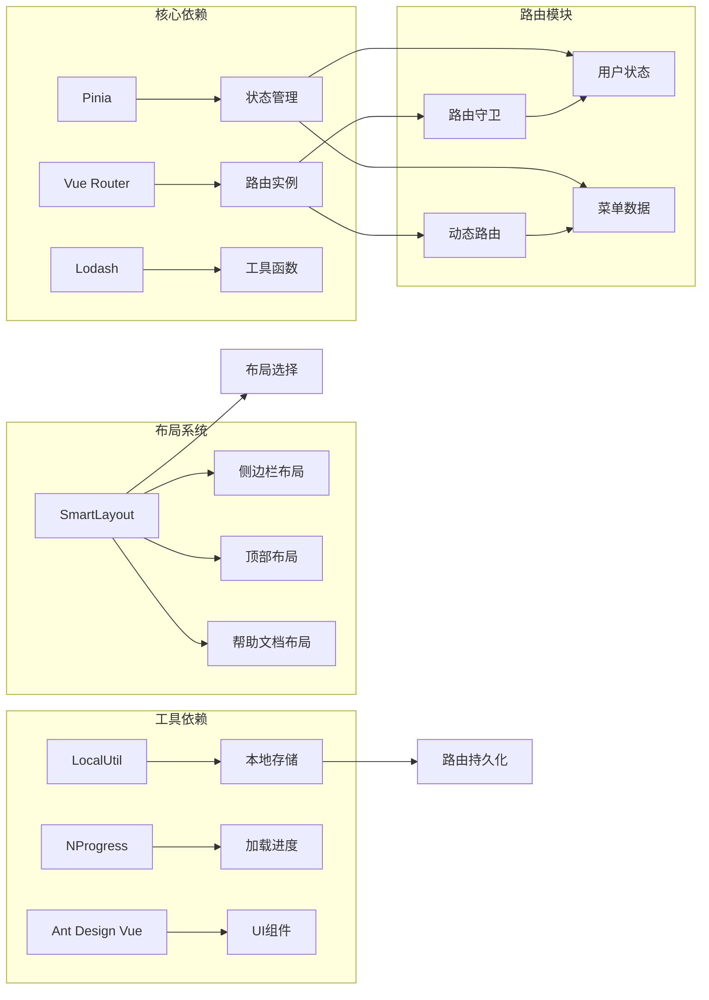

# 路由系统

<cite>
**本文档中引用的文件**
- [src/router/index.js](file://smart-admin-web-javascript/src/router/index.js)
- [src/router/routers.js](file://smart-admin-web-javascript/src/router/routers.js)
- [src/router/system/login.js](file://smart-admin-web-javascript/src/router/system/login.js)
- [src/router/system/home.js](file://smart-admin-web-javascript/src/router/system/home.js)
- [src/router/business/consumption.js](file://smart-admin-web-javascript/src/router/business/consumption.js)
- [src/router/support/help-doc.js](file://smart-admin-web-javascript/src/router/support/help-doc.js)
- [src/router/business/smart-video.js](file://smart-admin-web-javascript/src/router/business/smart-video.js)
- [src/constants/system/menu-const.js](file://smart-admin-web-javascript/src/constants/system/menu-const.js)
- [src/constants/common-const.js](file://smart-admin-web-javascript/src/constants/common-const.js)
- [src/layout/index.vue](file://smart-admin-web-javascript/src/layout/index.vue)
- [src/layout/side-layout.vue](file://smart-admin-web-javascript/src/layout/side-layout.vue)
- [src/layout/top-layout.vue](file://smart-admin-web-javascript/src/layout/top-layout.vue)
- [src/store/modules/system/user.js](file://smart-admin-web-javascript/src/store/modules/system/user.js)
</cite>

## 目录
1. [简介](#简介)
2. [项目结构](#项目结构)
3. [核心组件](#核心组件)
4. [架构概览](#架构概览)
5. [详细组件分析](#详细组件分析)
6. [依赖关系分析](#依赖关系分析)
7. [性能考虑](#性能考虑)
8. [故障排除指南](#故障排除指南)
9. [结论](#结论)

## 简介

SmartAdmin路由系统是一个基于Vue Router的现代化前端路由解决方案，采用模块化设计和动态路由生成机制。该系统支持多种布局模式、完善的权限控制、智能缓存管理和动态菜单加载，为企业级应用提供了灵活而强大的路由管理能力。

系统的核心特性包括：
- 基于Vue Router 4.x的动态路由实现
- 模块化的路由组织结构（system、business、support）
- 完善的路由守卫和权限验证机制
- 智能的组件缓存和懒加载策略
- 支持多种布局模式的响应式设计

## 项目结构

路由系统的文件组织采用了清晰的模块化结构，按照功能领域进行分类：

**图表来源**
- [src/router/index.js](file://smart-admin-web-javascript/src/router/index.js#L1-L166)
- [src/router/routers.js](file://smart-admin-web-javascript/src/router/routers.js#L1-L27)

**章节来源**
- [src/router/index.js](file://smart-admin-web-javascript/src/router/index.js#L1-L50)
- [src/router/routers.js](file://smart-admin-web-javascript/src/router/routers.js#L1-L27)

## 核心组件

### 路由主控制器

路由系统的核心控制器位于`src/router/index.js`，负责整个路由的初始化、动态路由构建和全局路由守卫。

主要功能包括：
- Vue Router实例的创建和配置
- 全局前置守卫（beforeEach）实现权限验证
- 全局后置守卫（afterEach）处理页面加载进度
- 动态路由构建函数（buildRoutes）

### 路由模块化设计

系统采用三层模块化设计：

1. **系统模块（system）**：包含基础功能路由
   - 登录认证（login.js）
   - 首页导航（home.js）
   - 系统管理功能

2. **业务模块（business）**：包含具体业务功能
   - 消费管理系统（consumption.js）
   - 智能视频监控（smart-video.js）
   - 其他业务模块

3. **支持模块（support）**：包含辅助功能
   - 帮助文档（help-doc.js）
   - 系统工具和配置

**章节来源**
- [src/router/index.js](file://smart-admin-web-javascript/src/router/index.js#L23-L88)
- [src/router/routers.js](file://smart-admin-web-javascript/src/router/routers.js#L10-L26)

## 架构概览

路由系统采用分层架构设计，实现了关注点分离和高度可扩展性：

**图表来源**
- [src/router/index.js](file://smart-admin-web-javascript/src/router/index.js#L31-L88)
- [src/store/modules/system/user.js](file://smart-admin-web-javascript/src/store/modules/system/user.js#L176-L188)

## 详细组件分析

### 动态路由生成机制

动态路由生成是系统的核心功能，通过`buildRoutes`函数实现：

**图表来源**
- [src/router/index.js](file://smart-admin-web-javascript/src/router/index.js#L98-L165)

#### 路由元信息配置

每个路由都包含丰富的元信息配置：

| 元信息字段 | 类型 | 描述 | 示例值 |
|-----------|------|------|--------|
| id | String | 数据库菜单ID | "9001" |
| componentName | String | 组件名称 | "SmartVideoSystemOverview" |
| title | String | 页面标题 | "智能视频 - 系统概览" |
| icon | String | 菜单图标 | "DashboardOutlined" |
| hideInMenu | Boolean | 是否隐藏菜单 | false |
| keepAlive | Boolean | 是否缓存组件 | true |
| frameFlag | Boolean | 是否为外链 | false |
| frameUrl | String | 外链URL | "/external/doc" |

**章节来源**
- [src/router/index.js](file://smart-admin-web-javascript/src/router/index.js#L123-L142)

### 路由守卫实现

系统实现了完善的路由守卫机制，确保安全性和用户体验：

**图表来源**
- [src/router/index.js](file://smart-admin-web-javascript/src/router/index.js#L31-L88)

#### 权限验证流程

路由守卫的权限验证遵循严格的流程：

1. **公共页面放行**：404错误页面等公共页面无需验证
2. **登录状态检查**：验证用户token有效性
3. **登录页特殊处理**：已登录用户自动跳转首页
4. **首页特殊处理**：首页需要登录但无需权限验证
5. **组件缓存管理**：根据配置设置keep-alive

**章节来源**
- [src/router/index.js](file://smart-admin-web-javascript/src/router/index.js#L35-L82)

### 布局系统集成

路由系统与布局系统深度集成，支持多种布局模式：

**图表来源**
- [src/layout/index.vue](file://smart-admin-web-javascript/src/layout/index.vue#L10-L33)
- [src/layout/side-layout.vue](file://smart-admin-web-javascript/src/layout/side-layout.vue#L1-L50)
- [src/layout/top-layout.vue](file://smart-admin-web-javascript/src/layout/top-layout.vue#L1-L50)

**章节来源**
- [src/layout/index.vue](file://smart-admin-web-javascript/src/layout/index.vue#L1-L34)

### 智能缓存机制

系统实现了智能的组件缓存机制，提升用户体验：

#### Keep-Alive配置

| 缓存类型 | 配置方式 | 适用场景 | 性能影响 |
|---------|----------|----------|----------|
| 全局缓存 | `keepAlive: true` | 频繁访问页面 | 中等内存占用 |
| 条件缓存 | 动态添加/移除 | 特定业务场景 | 低内存占用 |
| 外链缓存 | iframe组件 | 第三方页面 | 最小内存占用 |

#### 缓存管理流程

**图表来源**
- [src/router/index.js](file://smart-admin-web-javascript/src/router/index.js#L76-L85)
- [src/store/modules/system/user.js](file://smart-admin-web-javascript/src/store/modules/system/user.js#L260-L290)

**章节来源**
- [src/store/modules/system/user.js](file://smart-admin-web-javascript/src/store/modules/system/user.js#L260-L290)

### 模块化路由配置

#### 系统路由模块

系统路由模块包含基础功能的路由配置：

**登录路由**：提供用户认证功能
- 路径：`/login`
- 组件：`/views/system/login3/login.vue`
- 元信息：`hideInMenu: true`

**首页路由**：系统主入口
- 路径：`/home`
- 组件：`/views/system/home/index.vue`
- 嵌套子路由：个人中心等功能

**章节来源**
- [src/router/system/login.js](file://smart-admin-web-javascript/src/router/system/login.js#L11-L21)
- [src/router/system/home.js](file://smart-admin-web-javascript/src/router/system/home.js#L14-L48)

#### 业务路由模块

业务路由模块按功能领域组织：

**消费管理系统**：包含数据总览和区域管理
- 路径：`/business/consumption/dashboard`
- 路径：`/business/consumption/region`
- 缓存配置：`keepAlive: true`

**智能视频系统**：完整的视频监控解决方案
- 系统概览：`/business/smart-video/system-overview`
- 设备管理：`/business/smart-video/device-list`
- 监控预览：`/business/smart-video/monitor-preview`
- 解码器管理：`/business/smart-video/decoder-management`
- 智能分析：算法模式、目标智能、行为分析
- 检索功能：目标检索、以图搜图
- 联动管理：联动设置、联动记录
- 系统分析：过热图、过热统计

**章节来源**
- [src/router/business/consumption.js](file://smart-admin-web-javascript/src/router/business/consumption.js#L14-L61)
- [src/router/business/smart-video.js](file://smart-admin-web-javascript/src/router/business/smart-video.js#L17-L295)

#### 支持路由模块

支持路由模块提供辅助功能：

**帮助文档**：独立的帮助文档系统
- 路径：`/help-doc`
- 布局：`HelpDocLayout`
- 子路由：帮助文档详情页

**章节来源**
- [src/router/support/help-doc.js](file://smart-admin-web-javascript/src/router/support/help-doc.js#L12-L28)

## 依赖关系分析

路由系统的依赖关系体现了良好的模块化设计：

**图表来源**
- [src/router/index.js](file://smart-admin-web-javascript/src/router/index.js#L12-L22)
- [src/store/modules/system/user.js](file://smart-admin-web-javascript/src/store/modules/system/user.js#L1-L20)

**章节来源**
- [src/router/index.js](file://smart-admin-web-javascript/src/router/index.js#L12-L22)

## 性能考虑

### 懒加载优化

系统采用Vue 3的动态导入实现组件懒加载：

- **按需加载**：只有访问时才加载对应组件
- **代码分割**：大型组件单独打包，减少初始加载体积
- **预加载策略**：关键组件优先加载

### 缓存策略

智能缓存策略平衡性能和资源消耗：

- **组件缓存**：keep-alive机制避免重复渲染
- **路由缓存**：路由映射表减少重复计算
- **状态缓存**：用户状态本地持久化

### 首屏优化

- **路由预加载**：关键路由提前准备
- **渐进式加载**：非关键功能延迟加载
- **资源压缩**：代码和资源的最小化处理

## 故障排除指南

### 常见问题及解决方案

#### 路由无法访问

**问题描述**：用户无法访问某些路由页面

**可能原因**：
1. 菜单权限配置错误
2. 组件路径配置错误
3. 路由守卫拦截

**解决步骤**：
1. 检查菜单数据中的`visibleFlag`字段
2. 验证组件文件路径是否存在
3. 查看浏览器控制台错误信息

#### 组件缓存失效

**问题描述**：页面刷新后状态丢失

**可能原因**：
1. keepAlive配置错误
2. 组件名称不匹配
3. 缓存容量超限

**解决步骤**：
1. 检查`meta.keepAlive`配置
2. 验证`componentName`设置
3. 清理缓存或增加容量限制

#### 路由守卫异常

**问题描述**：登录状态验证失败

**可能原因**：
1. token过期或无效
2. 用户状态同步问题
3. 守卫逻辑错误

**解决步骤**：
1. 检查本地存储的token
2. 验证用户状态更新逻辑
3. 查看守卫函数的错误日志

**章节来源**
- [src/router/index.js](file://smart-admin-web-javascript/src/router/index.js#L35-L82)
- [src/store/modules/system/user.js](file://smart-admin-web-javascript/src/store/modules/system/user.js#L119-L131)

## 结论

SmartAdmin路由系统展现了现代前端路由的最佳实践，通过以下核心特性实现了高效、灵活、可维护的路由管理：

### 技术优势

1. **模块化设计**：清晰的功能划分和职责分离
2. **动态路由**：基于后端菜单的灵活路由生成
3. **智能缓存**：平衡性能和用户体验的缓存策略
4. **权限控制**：完善的路由守卫和权限验证机制
5. **多布局支持**：适应不同业务场景的布局方案

### 架构特点

- **可扩展性**：易于添加新模块和功能
- **可维护性**：清晰的代码结构和文档
- **性能优化**：懒加载和缓存机制提升体验
- **安全性**：完善的权限验证和状态管理

### 应用价值

该路由系统为企业级应用提供了坚实的技术基础，支持复杂的业务需求和用户交互，同时保持了良好的开发体验和运行性能。通过合理的架构设计和最佳实践的应用，为项目的长期发展奠定了可靠的基础。