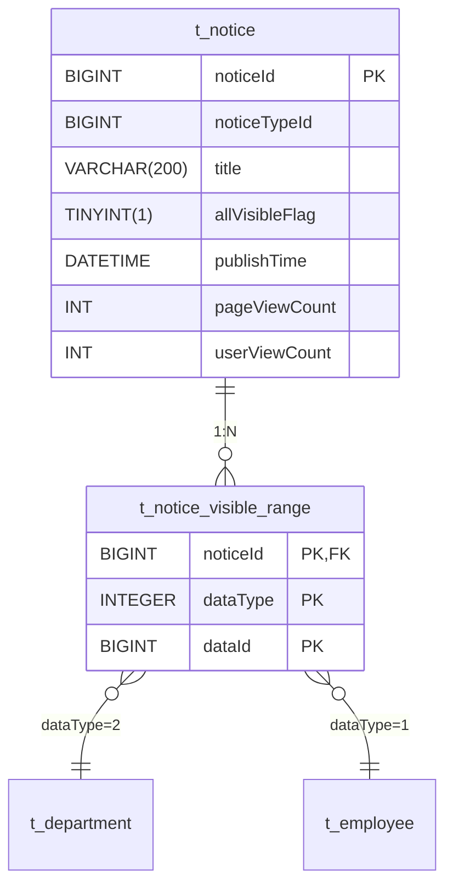
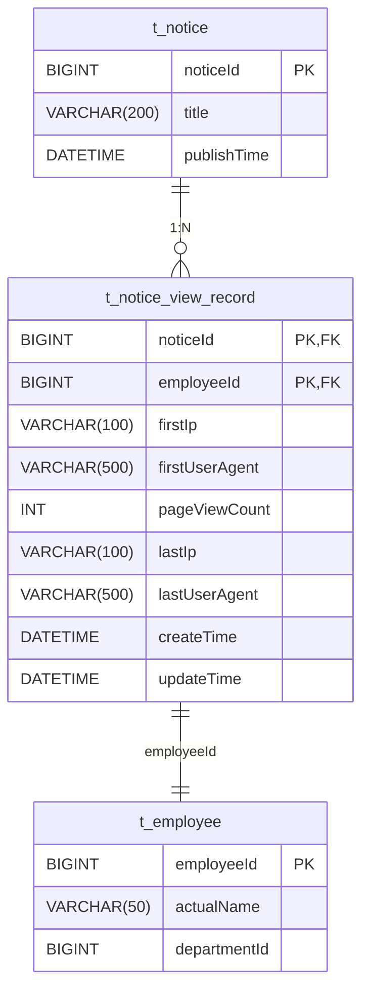
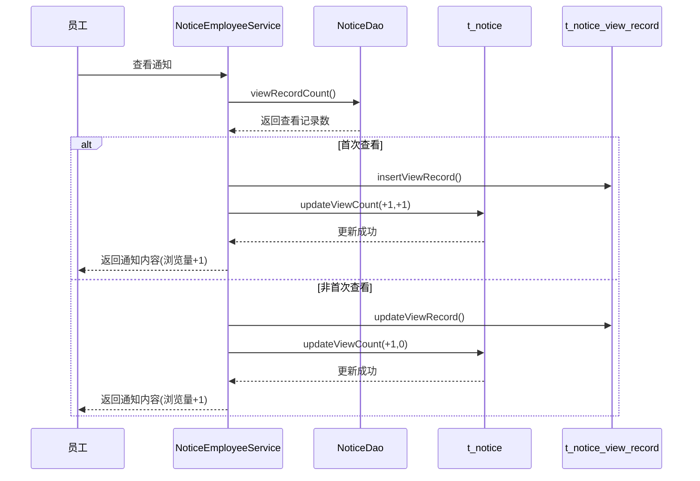
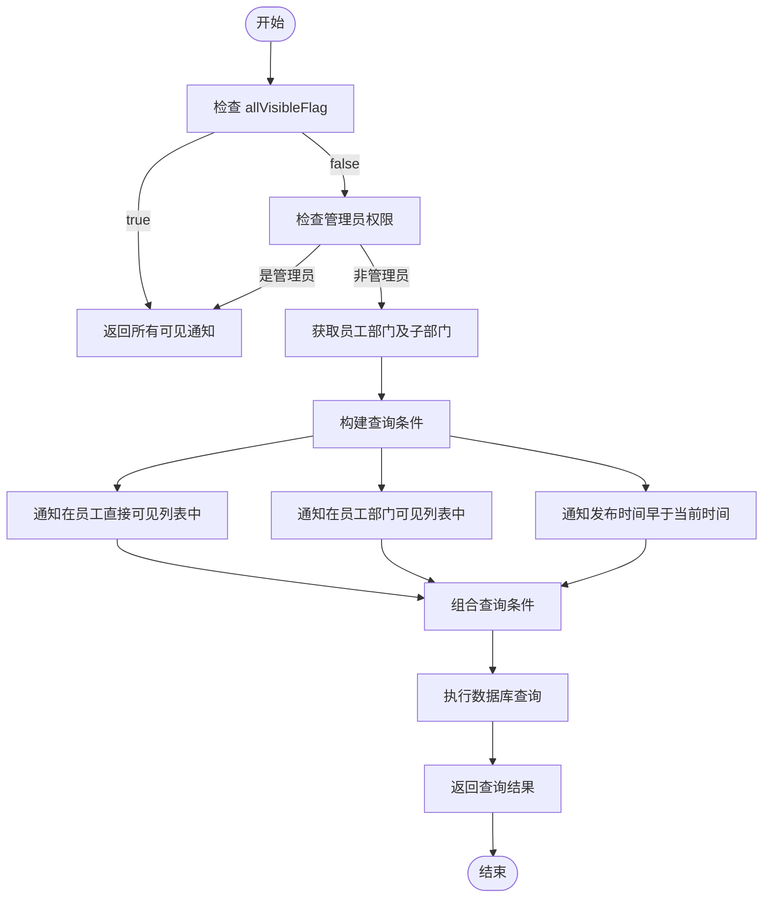
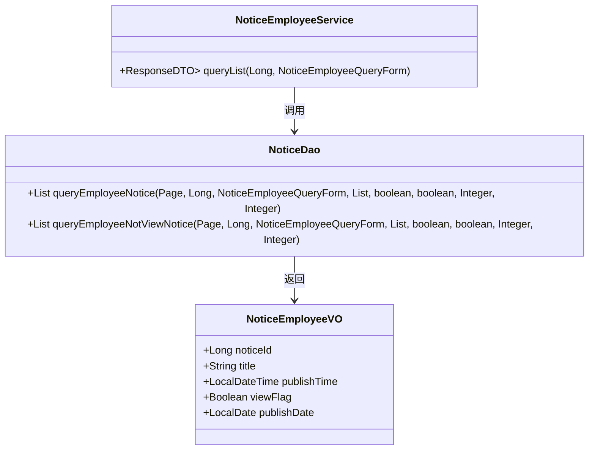

# 通知公告表结构

<cite>
**本文档引用的文件**   
- [NoticeEntity.java](file://smart-admin-api-java17-springboot3\sa-admin\src\main\java\net\lab1024\sa\admin\module\business\oa\notice\domain\entity\NoticeEntity.java)
- [NoticeDao.java](file://smart-admin-api-java17-springboot3\sa-admin\src\main\java\net\lab1024\sa\admin\module\business\oa\notice\dao\NoticeDao.java)
- [NoticeMapper.xml](file://smart-admin-api-java17-springboot3\sa-admin\src\main\resources\mapper\business\oa\notice\NoticeMapper.xml)
- [NoticeVisibleRangeDataTypeEnum.java](file://smart-admin-api-java17-springboot3\sa-admin\src\main\java\net\lab1024\sa\admin\module\business\oa\notice\constant\NoticeVisibleRangeDataTypeEnum.java)
- [NoticeVisibleRangeVO.java](file://smart-admin-api-java17-springboot3\sa-admin\src\main\java\net\lab1024\sa\admin\module\business\oa\notice\domain\vo\NoticeVisibleRangeVO.java)
- [NoticeViewRecordVO.java](file://smart-admin-api-java17-springboot3\sa-admin\src\main\java\net\lab1024\sa\admin\module\business\oa\notice\domain\vo\NoticeViewRecordVO.java)
- [NoticeEmployeeService.java](file://smart-admin-api-java17-springboot3\sa-admin\src\main\java\net\lab1024\sa\admin\module\business\oa\notice\service\NoticeEmployeeService.java)
</cite>

## 目录
1. [主表(t_notice)结构](#主表t_notice结构)
2. [可见范围表(t_notice_visible_range)设计](#可见范围表t_notice_visible_range设计)
3. [查看记录表(t_notice_view_record)设计](#查看记录表t_notice_view_record设计)
4. [浏览量更新机制](#浏览量更新机制)
5. [数据权限查询逻辑](#数据权限查询逻辑)
6. [已读未读状态判断](#已读未读状态判断)

## 主表(t_notice)结构

通知公告主表(t_notice)存储了通知公告的核心信息，包括标题、内容、发布时间等关键字段。该表是整个通知公告模块的基础，通过noticeId作为主键与其他子表建立关联关系。

**表字段说明：**

| 字段名 | 类型 | 约束 | 说明 |
|--------|------|------|------|
| noticeId | BIGINT | 主键, 自增 | 通知公告ID |
| noticeTypeId | BIGINT | 非空 | 通知类型ID，关联通知类型表 |
| title | VARCHAR(200) | 非空 | 标题 |
| allVisibleFlag | TINYINT(1) | 非空 | 是否全部可见标识，true表示所有员工可见 |
| scheduledPublishFlag | TINYINT(1) | 非空 | 是否定时发布标识 |
| publishTime | DATETIME | 非空 | 发布时间 |
| contentText | TEXT | | 内容纯文本格式 |
| contentHtml | LONGTEXT | | 内容HTML格式 |
| attachment | VARCHAR(1000) | | 附件，多个文件用英文逗号分隔 |
| pageViewCount | INT | 默认0 | 页面浏览量，记录页面被打开的总次数 |
| userViewCount | INT | 默认0 | 用户浏览量，记录不同用户查看的数量 |
| source | VARCHAR(100) | | 来源 |
| author | VARCHAR(50) | | 作者 |
| documentNumber | VARCHAR(100) | | 文号 |
| deletedFlag | TINYINT(1) | 非空 | 删除标识，逻辑删除标志 |
| createUserId | BIGINT | 非空 | 创建人ID |
| createTime | DATETIME | 非空 | 创建时间 |
| updateTime | DATETIME | | 更新时间 |

**关键字段约束条件：**
- **noticeId**: 作为主键，采用自增策略，确保每条通知公告的唯一性
- **title**: 限制长度为200个字符，确保标题简洁明了
- **allVisibleFlag**: 布尔类型，当值为true时，通知对所有员工可见，忽略可见范围设置
- **pageViewCount** 和 **userViewCount**: 两个独立的计数器，分别记录页面级别的浏览次数和用户级别的查看人数
- **contentHtml**: 使用LONGTEXT类型，支持存储大容量的富文本内容

**Section sources**
- [NoticeEntity.java](file://smart-admin-api-java17-springboot3\sa-admin\src\main\java\net\lab1024\sa\admin\module\business\oa\notice\domain\entity\NoticeEntity.java#L23-L98)
- [NoticeMapper.xml](file://smart-admin-api-java17-springboot3\sa-admin\src\main\resources\mapper\business\oa\notice\NoticeMapper.xml#L7-L24)

## 可见范围表(t_notice_visible_range)设计

可见范围表(t_notice_visible_range)实现了灵活的发布范围控制机制，支持按部门和员工两种维度进行精确的权限管理。该设计采用了通用的数据结构，通过data_type字段区分不同的数据类型，实现了扩展性和灵活性的平衡。



**表字段说明：**

| 字段名 | 类型 | 约束 | 说明 |
|--------|------|------|------|
| noticeId | BIGINT | 复合主键, 外键 | 通知公告ID，关联主表 |
| dataType | INT | 复合主键 | 数据类型，1=员工, 2=部门 |
| dataId | BIGINT | 复合主键 | 数据ID，员工ID或部门ID |

**可见范围控制机制：**

1. **复合主键设计**: 采用noticeId、dataType、dataId三个字段组成的复合主键，确保同一通知对同一员工或部门不会重复设置可见性

2. **数据类型枚举**: 通过NoticeVisibleRangeDataTypeEnum枚举类定义了两种可见范围类型：
   - EMPLOYEE(1, "员工"): 指定特定员工可见
   - DEPARTMENT(2, "部门"): 指定特定部门及其子部门可见

3. **灵活的查询逻辑**: 在查询员工可见的通知时，系统会同时检查以下条件：
   - 通知的allVisibleFlag是否为true（全局可见）
   - 员工是否被直接指定为可见对象
   - 员工所在部门是否被指定为可见对象

4. **批量操作支持**: 通过MyBatis的foreach标签支持批量插入可见范围，提高性能：
```xml
<insert id="insertVisibleRange">
    insert into t_notice_visible_range
    (notice_id, data_type, data_id)
    values
    <foreach collection="visibleRangeFormList" separator="," item="item">
        ( #{noticeId} , #{item.dataType}, #{item.dataId} )
    </foreach>
</insert>
```

**Section sources**
- [NoticeVisibleRangeDataTypeEnum.java](file://smart-admin-api-java17-springboot3\sa-admin\src\main\java\net\lab1024\sa\admin\module\business\oa\notice\constant\NoticeVisibleRangeDataTypeEnum.java#L24-L29)
- [NoticeMapper.xml](file://smart-admin-api-java17-springboot3\sa-admin\src\main\resources\mapper\business\oa\notice\NoticeMapper.xml#L29-L36)
- [NoticeVisibleRangeVO.java](file://smart-admin-api-java17-springboot3\sa-admin\src\main\java\net\lab1024\sa\admin\module\business\oa\notice\domain\vo\NoticeVisibleRangeVO.java#L20-L24)

## 查看记录表(t_notice_view_record)设计

查看记录表(t_notice_view_record)用于追踪员工对通知公告的阅读状态和浏览行为，为统计分析和提醒功能提供数据支持。该表设计考虑了性能优化和数据完整性，能够准确记录用户的查看行为。



**表字段说明：**

| 字段名 | 类型 | 约束 | 说明 |
|--------|------|------|------|
| noticeId | BIGINT | 复合主键, 外键 | 通知公告ID，关联主表 |
| employeeId | BIGINT | 复合主键, 外键 | 员工ID，关联员工表 |
| firstIp | VARCHAR(100) | | 首次查看的IP地址 |
| firstUserAgent | VARCHAR(500) | | 首次查看的用户代理信息 |
| pageViewCount | INT | 非空, 默认1 | 查看次数，记录该员工查看此通知的总次数 |
| lastIp | VARCHAR(100) | | 最后一次查看的IP地址 |
| lastUserAgent | VARCHAR(500) | | 最后一次查看的用户代理信息 |
| createTime | DATETIME | 非空 | 创建时间，首次查看时间 |
| updateTime | DATETIME | | 更新时间，最后一次查看时间 |

**查看记录管理机制：**

1. **复合主键设计**: 采用noticeId和employeeId组成的复合主键，确保每个员工对每条通知只能有一条查看记录

2. **首次查看处理**: 当员工第一次查看通知时，执行insert操作，同时记录首次访问的IP和UserAgent信息

3. **后续查看更新**: 当同一员工再次查看同一通知时，执行update操作，仅增加查看次数并更新最后访问信息

4. **数据完整性**: 通过外键约束确保记录的员工和通知必须存在

5. **性能优化**: 对createTime和updateTime字段建立索引，支持按时间排序查询

**Section sources**
- [NoticeMapper.xml](file://smart-admin-api-java17-springboot3\sa-admin\src\main\resources\mapper\business\oa\notice\NoticeMapper.xml#L250-L261)
- [NoticeViewRecordVO.java](file://smart-admin-api-java17-springboot3\sa-admin\src\main\java\net\lab1024\sa\admin\module\business\oa\notice\domain\vo\NoticeViewRecordVO.java#L1-L49)

## 浏览量更新机制

浏览量更新机制采用增量更新策略，通过原子性操作确保在高并发场景下的数据一致性。系统区分了页面浏览量(pageViewCount)和用户浏览量(userViewCount)两个指标，提供了更精细的统计维度。

**增量更新实现：**



**核心更新逻辑：**

1. **检查查看状态**: 首先查询t_notice_view_record表，判断员工是否已查看过该通知
```java
long viewCount = noticeDao.viewRecordCount(noticeId, requestEmployeeId);
```

2. **首次查看处理**: 如果是首次查看，则同时增加页面浏览量和用户浏览量
```java
// 该员工对于这个通知是第一次查看 页面浏览量+1 用户浏览量+1
noticeDao.updateViewCount(noticeId, 1, 1);
```

3. **非首次查看处理**: 如果不是首次查看，则只增加页面浏览量，不增加用户浏览量
```xml
<update id="updateViewCount">
    update t_notice
    set page_view_count = page_view_count + #{pageViewCountIncrement},
        user_view_count = user_view_count + #{userViewCountIncrement}
    where notice_id = #{noticeId}
</update>
```

4. **原子性保证**: 所有更新操作都在数据库层面完成，利用数据库的事务机制确保数据一致性

5. **高并发优化**: 通过直接在SQL中进行增量计算，避免了读-改-写模式可能引发的并发问题

**Section sources**
- [NoticeEmployeeService.java](file://smart-admin-api-java17-springboot3\sa-admin\src\main\java\net\lab1024\sa\admin\module\business\oa\notice\service\NoticeEmployeeService.java#L88-L112)
- [NoticeMapper.xml](file://smart-admin-api-java17-springboot3\sa-admin\src\main\resources\mapper\business\oa\notice\NoticeMapper.xml#L262-L267)

## 数据权限查询逻辑

数据权限查询逻辑基于员工的组织架构和权限设置，实现了精细化的访问控制。系统通过结合allVisibleFlag标志、可见范围设置和员工的部门层级关系，确保员工只能查看其权限范围内的通知公告。

**查询逻辑流程：**



**核心查询条件：**

1. **全局可见检查**: 如果通知的allVisibleFlag为true，则所有员工都可查看
```xml
or t_notice.all_visible_flag = true
```

2. **管理员权限**: 管理员可以查看所有未删除的通知，不受可见范围限制

3. **部门层级查询**: 对于非管理员员工，系统会获取其所在部门及所有子部门的ID列表，用于查询条件匹配
```java
if (!employeeEntity.getAdministratorFlag() && employeeEntity.getDepartmentId() != null) {
    employeeDepartmentIdList = departmentService.selfAndChildrenIdList(employeeEntity.getDepartmentId());
}
```

4. **可见范围匹配**: 查询条件会检查通知是否在以下任一范围内：
   - 直接指定该员工可见
   - 指定该员工所在部门可见
   - 全局可见

5. **定时发布控制**: 只有发布时间早于当前时间的通知才会对员工可见
```xml
and t_notice.publish_time &lt; now()
```

**Section sources**
- [NoticeDao.java](file://smart-admin-api-java17-springboot3\sa-admin\src\main\java\net\lab1024\sa\admin\module\business\oa\notice\dao\NoticeDao.java#L68-L97)
- [NoticeMapper.xml](file://smart-admin-api-java17-springboot3\sa-admin\src\main\resources\mapper\business\oa\notice\NoticeMapper.xml#L107-L163)

## 已读未读状态判断

已读未读状态判断采用高效的子查询方式，在查询通知列表时一次性确定每条通知的阅读状态，避免了多次数据库查询的性能开销。这种设计在保证准确性的同时，最大限度地优化了查询性能。

**状态判断实现：**



**核心判断逻辑：**

1. **子查询判断**: 在查询通知列表的SQL中，使用子查询直接计算每条通知的阅读状态
```xml
(select count(*) from t_notice_view_record where t_notice_view_record.employee_id = #{requestEmployeeId} and t_notice_view_record.notice_id = t_notice.notice_id) as viewFlag
```

2. **VO对象扩展**: NoticeEmployeeVO继承自NoticeVO，增加了viewFlag字段用于表示阅读状态
```java
public class NoticeEmployeeVO extends NoticeVO {
    @Schema(description = "是否查看")
    private Boolean viewFlag;
    
    @Schema(description = "发布日期")
    private LocalDate publishDate;
}
```

3. **未读通知查询**: 提供专门的接口查询未读通知，通过viewFlag = 0条件过滤
```xml
<if test="query.notViewFlag">
    AND viewFlag = 0
</if>
```

4. **服务层封装**: NoticeEmployeeService封装了查询逻辑，根据查询参数决定是查询全部通知还是仅查询未读通知
```java
if (noticeEmployeeQueryForm.getNotViewFlag() != null && noticeEmployeeQueryForm.getNotViewFlag()) {
    noticeList = noticeDao.queryEmployeeNotViewNotice(page, ...);
} else {
    noticeList = noticeDao.queryEmployeeNotice(page, ...);
}
```

**Section sources**
- [NoticeEmployeeVO.java](file://smart-admin-api-java17-springboot3\sa-admin\src\main\java\net\lab1024\sa\admin\module\business\oa\notice\domain\vo\NoticeEmployeeVO.java#L18-L26)
- [NoticeMapper.xml](file://smart-admin-api-java17-springboot3\sa-admin\src\main\resources\mapper\business\oa\notice\NoticeMapper.xml#L111-L112)
- [NoticeEmployeeService.java](file://smart-admin-api-java17-springboot3\sa-admin\src\main\java\net\lab1024\sa\admin\module\business\oa\notice\service\NoticeEmployeeService.java#L60-L63)