# 通知管理功能技术文档

<cite>
**本文档引用的文件**
- [NoticeController.java](file://smart-admin-api-java17-springboot3\sa-admin\src\main\java\net\lab1024\sa\admin\module\business\oa\notice\controller\NoticeController.java)
- [NoticeService.java](file://smart-admin-api-java17-springboot3\sa-admin\src\main\java\net\lab1024\sa\admin\module\business\oa\notice\service\NoticeService.java)
- [NoticeEntity.java](file://smart-admin-api-java17-springboot3\sa-admin\src\main\java\net\lab1024\sa\admin\module\business\oa\notice\domain\entity\NoticeEntity.java)
- [NoticeAddForm.java](file://smart-admin-api-java17-springboot3\sa-admin\src\main\java\net\lab1024\sa\admin\module\business\oa\notice\domain\form\NoticeAddForm.java)
- [NoticeUpdateForm.java](file://smart-admin-api-java17-springboot3\sa-admin\src\main\java\net\lab1024\sa\admin\module\business\oa\notice\domain\form\NoticeUpdateForm.java)
- [NoticeDao.java](file://smart-admin-api-java17-springboot3\sa-admin\src\main\java\net\lab1024\sa\admin\module\business\oa\notice\dao\NoticeDao.java)
- [NoticeManager.java](file://smart-admin-api-java17-springboot3\sa-admin\src\main\java\net\lab1024\sa\admin\module\business\oa\notice\manager\NoticeManager.java)
- [NoticeVisibleRangeDataTypeEnum.java](file://smart-admin-api-java17-springboot3\sa-admin\src\main\java\net\lab1024\sa\admin\module\business\oa\notice\constant\NoticeVisibleRangeDataTypeEnum.java)
- [notice-list.vue](file://smart-admin-web-javascript\src\views\business\oa\notice\notice-list.vue)
- [notice-detail.vue](file://smart-admin-web-javascript\src\views\business\oa\notice\notice-detail.vue)
- [notice-form-drawer.vue](file://smart-admin-web-javascript\src\views\business\oa\notice\components\notice-form-drawer.vue)
- [notice-api.js](file://smart-admin-web-javascript\src\api\business\oa\notice-api.js)
</cite>

## 目录
1. [概述](#概述)
2. [系统架构](#系统架构)
3. [后端核心组件](#后端核心组件)
4. [前端组件架构](#前端组件架构)
5. [API接口设计](#api接口设计)
6. [数据模型设计](#数据模型设计)
7. [业务流程分析](#业务流程分析)
8. [功能特性详解](#功能特性详解)
9. [最佳实践与使用示例](#最佳实践与使用示例)
10. [总结](#总结)

## 概述

通知管理系统是一个完整的公告和通知发布平台，支持多种发布方式（草稿、立即发布、定时发布）、灵活的可见范围控制（全员或指定员工/部门）以及完善的权限管理。系统采用前后端分离架构，后端基于Spring Boot 3框架，前端使用Vue 3 + Ant Design Vue构建。

### 主要功能特性

- **多类型通知管理**：支持公告和通知两种类型
- **灵活的发布策略**：草稿保存、立即发布、定时发布
- **精确的可见范围控制**：支持全员可见和部分可见（员工/部门）
- **完善的权限管理**：基于角色的访问控制
- **丰富的展示形式**：支持富文本内容、附件上传
- **详细的统计分析**：浏览量、查看记录统计

## 系统架构

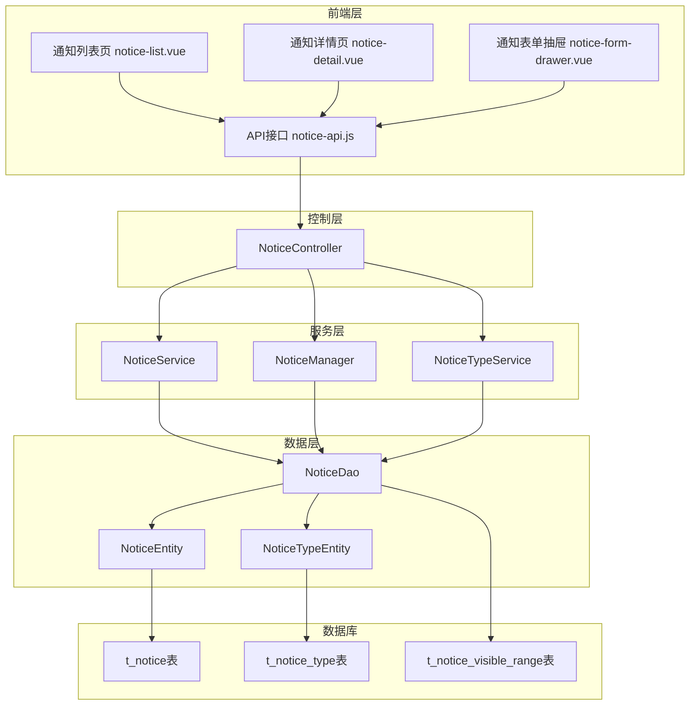

**图表来源**
- [NoticeController.java](file://smart-admin-api-java17-springboot3\sa-admin\src\main\java\net\lab1024\sa\admin\module\business\oa\notice\controller\NoticeController.java#L36-L140)
- [NoticeService.java](file://smart-admin-api-java17-springboot3\sa-admin\src\main\java\net\lab1024\sa\admin\module\business\oa\notice\service\NoticeService.java#L50-L241)
- [NoticeDao.java](file://smart-admin-api-java17-springboot3\sa-admin\src\main\java\net\lab1024\sa\admin\module\business\oa\notice\dao\NoticeDao.java#L29-L127)

## 后端核心组件

### NoticeController 控制器

控制器负责处理HTTP请求，提供RESTful API接口，包含以下核心功能：

#### 通知类型管理接口
- `GET /oa/noticeType/getAll` - 获取所有通知类型
- `GET /oa/noticeType/add/{name}` - 添加通知类型
- `GET /oa/noticeType/update/{noticeTypeId}/{name}` - 更新通知类型
- `GET /oa/noticeType/delete/{noticeTypeId}` - 删除通知类型

#### 通知管理接口
- `POST /oa/notice/query` - 分页查询通知列表
- `POST /oa/notice/add` - 添加新通知
- `POST /oa/notice/update` - 更新通知
- `GET /oa/notice/getUpdateVO/{noticeId}` - 获取通知更新详情
- `GET /oa/notice/delete/{noticeId}` - 删除通知

#### 员工查看接口
- `GET /oa/notice/employee/view/{noticeId}` - 查看通知详情
- `POST /oa/notice/employee/query` - 查询员工可见通知
- `POST /oa/notice/employee/queryViewRecord` - 查询查看记录

**节来源**
- [NoticeController.java](file://smart-admin-api-java17-springboot3\sa-admin\src\main\java\net\lab1024\sa\admin\module\business\oa\notice\controller\NoticeController.java#L36-L140)

### NoticeService 业务服务

服务层实现核心业务逻辑，主要包括：

#### 通知查询功能
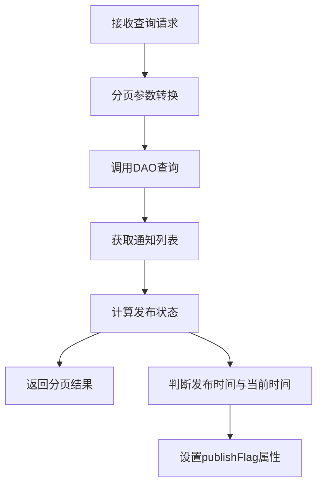

**图表来源**
- [NoticeService.java](file://smart-admin-api-java17-springboot3\sa-admin\src\main\java\net\lab1024\sa\admin\module\business\oa\notice\service\NoticeService.java#L78-L84)

#### 通知创建流程
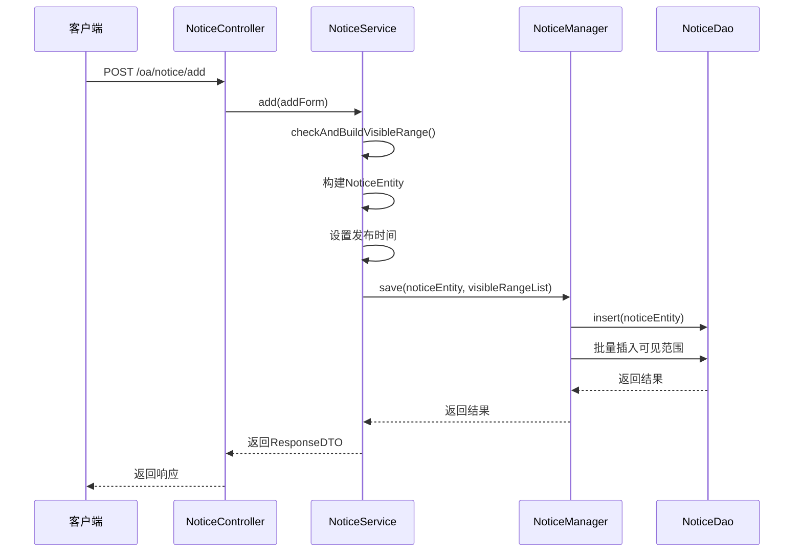

**图表来源**
- [NoticeService.java](file://smart-admin-api-java17-springboot3\sa-admin\src\main\java\net\lab1024\sa\admin\module\business\oa\notice\service\NoticeService.java#L89-L104)
- [NoticeManager.java](file://smart-admin-api-java17-springboot3\sa-admin\src\main\java\net\lab1024\sa\admin\module\business\oa\notice\manager\NoticeManager.java#L36-L55)

#### 可见范围校验逻辑
服务层实现了严格的可见范围校验机制：
- 验证通知类型是否存在
- 校验全员可见标志
- 验证员工ID有效性
- 验证部门ID有效性
- 支持批量ID校验

**节来源**
- [NoticeService.java](file://smart-admin-api-java17-springboot3\sa-admin\src\main\java\net\lab1024\sa\admin\module\business\oa\notice\service\NoticeService.java#L111-L158)

### NoticeEntity 实体模型

通知实体类定义了通知的核心字段和业务规则：

#### 核心字段说明

| 字段名 | 类型 | 描述 | 约束 |
|--------|------|------|------|
| noticeId | Long | 通知ID | 主键自增 |
| noticeTypeId | Long | 通知类型ID | 外键关联 |
| title | String | 标题 | 非空，最大200字符 |
| allVisibleFlag | Boolean | 是否全员可见 | 非空 |
| scheduledPublishFlag | Boolean | 是否定时发布 | 非空 |
| publishTime | LocalDateTime | 发布时间 | 非空（非定时发布时） |
| contentText | String | 纯文本内容 | 非空 |
| contentHtml | String | HTML内容 | 非空 |
| attachment | String | 附件列表 | 最多1000字符 |
| pageViewCount | Integer | 页面浏览量 | 默认0 |
| userViewCount | Integer | 用户浏览量 | 默认0 |

#### 状态管理字段
- `deletedFlag`：软删除标记，默认false
- `createUserId`：创建者ID
- `createTime`：创建时间
- `updateTime`：更新时间

**节来源**
- [NoticeEntity.java](file://smart-admin-api-java17-springboot3\sa-admin\src\main\java\net\lab1024\sa\admin\module\business\oa\notice\domain\entity\NoticeEntity.java#L20-L100)

### NoticeDao 数据访问

DAO层提供了通知相关的数据操作方法：

#### 核心数据操作
- **可见范围管理**：insertVisibleRange、deleteVisibleRange、queryVisibleRange
- **通知主表操作**：query、updateDeletedFlag
- **员工查看相关**：queryEmployeeNotice、queryEmployeeNotViewNotice
- **查看记录管理**：viewRecordCount、insertViewRecord、updateViewRecord
- **浏览量统计**：updateViewCount

**节来源**
- [NoticeDao.java](file://smart-admin-api-java17-springboot3\sa-admin\src\main\java\net\lab1024\sa\admin\module\business\oa\notice\dao\NoticeDao.java#L29-L127)

## 前端组件架构

### 通知列表页 (notice-list.vue)

列表页是通知管理的主要入口，提供完整的CRUD操作界面：

#### 功能特性
- **高级查询**：支持分类、关键词、文号、创建人、时间范围等多维度查询
- **分页展示**：支持自定义每页大小和快速跳转
- **操作按钮**：新增、编辑、删除、查看详情
- **权限控制**：基于Sa-Token的权限验证

#### 数据流设计
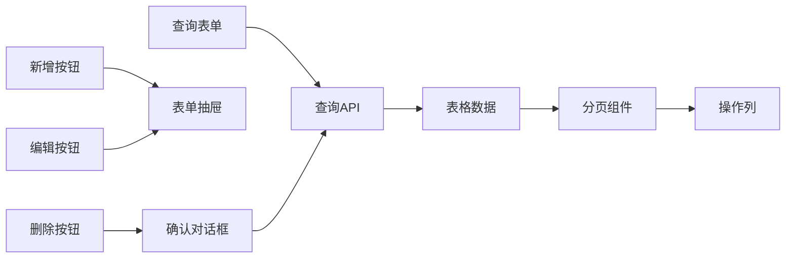

**图表来源**
- [notice-list.vue](file://smart-admin-web-javascript\src\views\business\oa\notice\notice-list.vue#L1-L355)

**节来源**
- [notice-list.vue](file://smart-admin-web-javascript\src\views\business\oa\notice\notice-list.vue#L1-L355)

### 通知详情页 (notice-detail.vue)

详情页展示通知的完整信息和相关统计：

#### 展示内容
- **基本信息**：标题、分类、文号、作者、来源、发布时间等
- **内容展示**：富文本内容渲染
- **附件列表**：支持预览和下载
- **可见范围**：显示可见员工/部门列表
- **查看记录**：历史查看统计

#### 组件交互
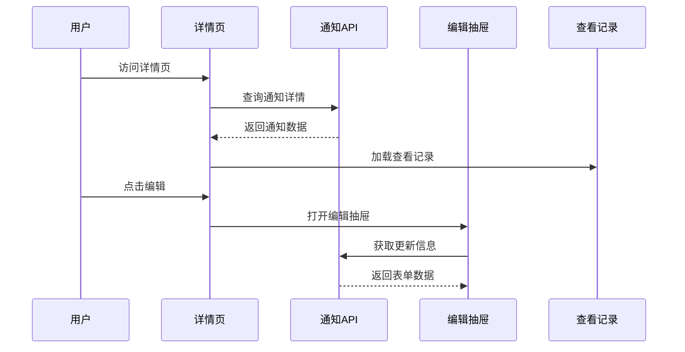

**图表来源**
- [notice-detail.vue](file://smart-admin-web-javascript\src\views\business\oa\notice\notice-detail.vue#L1-L145)

**节来源**
- [notice-detail.vue](file://smart-admin-web-javascript\src\views\business\oa\notice\notice-detail.vue#L1-L145)

### 通知表单抽屉 (notice-form-drawer.vue)

表单抽屉是通知创建和编辑的核心组件：

#### 表单字段设计
- **基础信息**：标题、分类、文号、作者、来源
- **可见范围**：全员可见/部分可见切换
- **发布设置**：定时发布开关、发布时间选择
- **内容编辑**：富文本编辑器集成
- **附件上传**：支持多文件上传

#### 发布策略控制
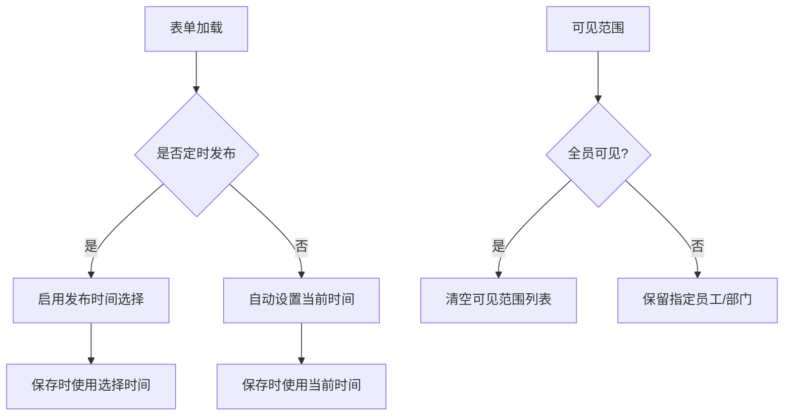

**图表来源**
- [notice-form-drawer.vue](file://smart-admin-web-javascript\src\views\business\oa\notice\components\notice-form-drawer.vue#L1-L308)

**节来源**
- [notice-form-drawer.vue](file://smart-admin-web-javascript\src\views\business\oa\notice\components\notice-form-drawer.vue#L1-L308)

### API接口封装 (notice-api.js)

前端API层统一管理所有通知相关的HTTP请求：

#### 接口分类
- **通知类型管理**：getAllNoticeTypeList、addNoticeType、updateNoticeType、deleteNoticeType
- **通知管理**：queryNotice、addNotice、updateNotice、deleteNotice、getUpdateNoticeInfo
- **员工查看**：view、queryEmployeeNotice、queryViewRecord

**节来源**
- [notice-api.js](file://smart-admin-web-javascript\src\api\business\oa\notice-api.js#L1-L75)

## API接口设计

### 后端API接口规范

#### 通知类型管理
| 方法 | URL | 描述 | 权限 |
|------|-----|------|------|
| GET | `/oa/noticeType/getAll` | 获取所有通知类型 | 无 |
| GET | `/oa/noticeType/add/{name}` | 添加通知类型 | 通知类型管理权限 |
| GET | `/oa/noticeType/update/{noticeTypeId}/{name}` | 更新通知类型 | 通知类型管理权限 |
| GET | `/oa/noticeType/delete/{noticeTypeId}` | 删除通知类型 | 通知类型管理权限 |

#### 通知管理
| 方法 | URL | 描述 | 权限 |
|------|-----|------|------|
| POST | `/oa/notice/query` | 分页查询通知 | 通知查询权限 |
| POST | `/oa/notice/add` | 添加通知 | 通知添加权限 |
| POST | `/oa/notice/update` | 更新通知 | 通知更新权限 |
| GET | `/oa/notice/getUpdateVO/{noticeId}` | 获取更新详情 | 通知更新权限 |
| GET | `/oa/notice/delete/{noticeId}` | 删除通知 | 通知删除权限 |

#### 员工查看
| 方法 | URL | 描述 | 权限 |
|------|-----|------|------|
| GET | `/oa/notice/employee/view/{noticeId}` | 查看通知详情 | 通知查看权限 |
| POST | `/oa/notice/employee/query` | 查询员工通知 | 通知查看权限 |
| POST | `/oa/notice/employee/queryViewRecord` | 查询查看记录 | 通知查看权限 |

### 前端API调用示例

```javascript
// 查询通知列表
const queryNotice = async (params) => {
  return await postRequest('/oa/notice/query', params);
};

// 添加通知
const addNotice = async (data) => {
  return await postRequest('/oa/notice/add', data);
};

// 更新通知
const updateNotice = async (data) => {
  return await postRequest('/oa/notice/update', data);
};

// 删除通知
const deleteNotice = async (noticeId) => {
  return await getRequest(`/oa/notice/delete/${noticeId}`);
};
```

## 数据模型设计

### 数据库表结构

#### t_notice 主表
```sql
CREATE TABLE `t_notice` (
  `notice_id` bigint NOT NULL AUTO_INCREMENT COMMENT '通知ID',
  `notice_type_id` bigint NOT NULL COMMENT '通知类型ID',
  `title` varchar(200) NOT NULL COMMENT '标题',
  `all_visible_flag` tinyint(1) NOT NULL DEFAULT '1' COMMENT '是否全员可见',
  `scheduled_publish_flag` tinyint(1) NOT NULL DEFAULT '0' COMMENT '是否定时发布',
  `publish_time` datetime DEFAULT NULL COMMENT '发布时间',
  `content_text` text NOT NULL COMMENT '纯文本内容',
  `content_html` text NOT NULL COMMENT 'HTML内容',
  `attachment` varchar(1000) DEFAULT NULL COMMENT '附件列表',
  `page_view_count` int NOT NULL DEFAULT '0' COMMENT '页面浏览量',
  `user_view_count` int NOT NULL DEFAULT '0' COMMENT '用户浏览量',
  `source` varchar(100) DEFAULT NULL COMMENT '来源',
  `author` varchar(50) DEFAULT NULL COMMENT '作者',
  `document_number` varchar(100) DEFAULT NULL COMMENT '文号',
  `deleted_flag` tinyint(1) NOT NULL DEFAULT '0' COMMENT '删除标记',
  `create_user_id` bigint DEFAULT NULL COMMENT '创建者ID',
  `update_time` datetime DEFAULT NULL COMMENT '更新时间',
  `create_time` datetime DEFAULT NULL COMMENT '创建时间',
  PRIMARY KEY (`notice_id`)
) ENGINE=InnoDB DEFAULT CHARSET=utf8mb4;
```

#### t_notice_visible_range 可见范围表
```sql
CREATE TABLE `t_notice_visible_range` (
  `id` bigint NOT NULL AUTO_INCREMENT,
  `notice_id` bigint NOT NULL COMMENT '通知ID',
  `data_type` tinyint NOT NULL COMMENT '数据类型(1:员工, 2:部门)',
  `data_id` bigint NOT NULL COMMENT '数据ID',
  `data_name` varchar(100) DEFAULT NULL COMMENT '数据名称',
  PRIMARY KEY (`id`),
  KEY `idx_notice_id` (`notice_id`)
) ENGINE=InnoDB DEFAULT CHARSET=utf8mb4;
```

### 枚举类型定义

#### 可见范围数据类型
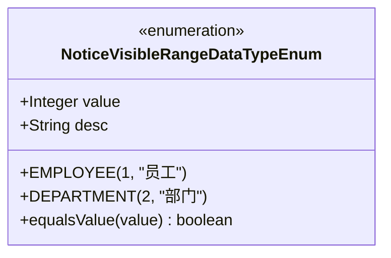

**图表来源**
- [NoticeVisibleRangeDataTypeEnum.java](file://smart-admin-api-java17-springboot3\sa-admin\src\main\java\net\lab1024\sa\admin\module\business\oa\notice\constant\NoticeVisibleRangeDataTypeEnum.java#L18-L37)

**节来源**
- [NoticeVisibleRangeDataTypeEnum.java](file://smart-admin-api-java17-springboot3\sa-admin\src\main\java\net\lab1024\sa\admin\module\business\oa\notice\constant\NoticeVisibleRangeDataTypeEnum.java#L1-L37)

## 业务流程分析

### 通知创建流程

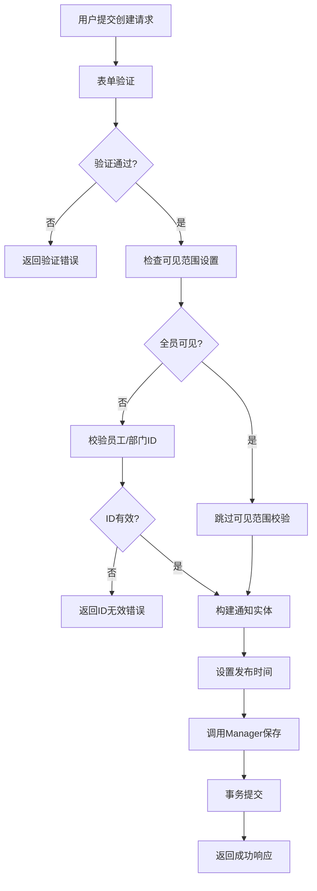

**图表来源**
- [NoticeService.java](file://smart-admin-api-java17-springboot3\sa-admin\src\main\java\net\lab1024\sa\admin\module\business\oa\notice\service\NoticeService.java#L89-L104)

### 可见范围控制机制

系统支持两种可见范围模式：

#### 1. 全员可见模式
- `allVisibleFlag = true`
- 不需要设置具体的可见范围
- 适用于公司公告、重要通知

#### 2. 部分可见模式
- `allVisibleFlag = false`
- 需要设置具体的员工或部门列表
- 支持混合选择（员工+部门）

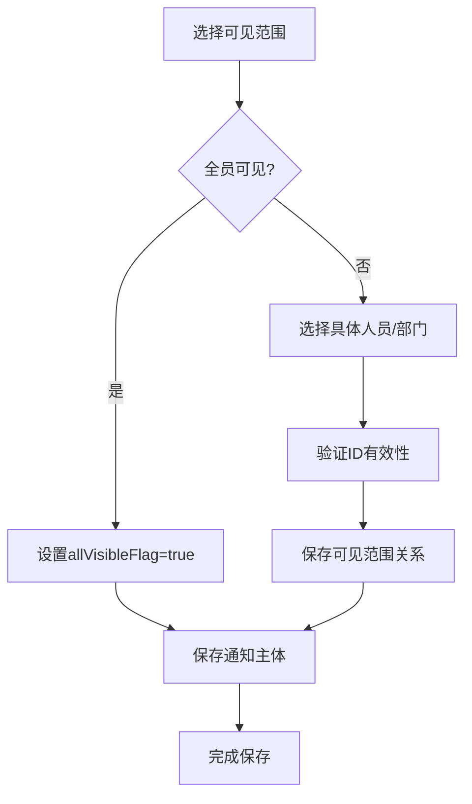

**图表来源**
- [NoticeService.java](file://smart-admin-api-java17-springboot3\sa-admin\src\main\java\net\lab1024\sa\admin\module\business\oa\notice\service\NoticeService.java#L111-L158)

### 发布策略管理

#### 草稿保存
- `scheduledPublishFlag = false`
- `publishTime = 当前时间`
- 通知立即生效

#### 立即发布
- `scheduledPublishFlag = false`
- `publishTime = 用户指定时间`
- 通知立即生效

#### 定时发布
- `scheduledPublishFlag = true`
- `publishTime = 用户指定未来时间`
- 系统定时任务检查并发布

**节来源**
- [NoticeAddForm.java](file://smart-admin-api-java17-springboot3\sa-admin\src\main\java\net\lab1024\sa\admin\module\business\oa\notice\domain\form\NoticeAddForm.java#L40-L46)

## 功能特性详解

### 通知草稿保存

#### 实现机制
- 草稿状态不设置发布时间
- 支持随时修改和重新发布
- 提供草稿列表查看功能

#### 代码实现要点
```java
// 草稿保存逻辑
if (!addForm.getScheduledPublishFlag()) {
    noticeEntity.setPublishTime(LocalDateTime.now());
}
```

### 立即发布功能

#### 特性说明
- 发布时间设置为当前时间
- 通知立即对目标用户可见
- 支持富文本和附件内容

#### 使用场景
- 紧急通知发布
- 日常工作提醒
- 临时公告发布

### 定时发布功能

#### 核心特性
- 支持未来任意时间发布
- 系统后台定时检查
- 自动发布机制

#### 技术实现
- 存储未来发布时间
- 后台定时任务扫描
- 自动状态更新

### 可见范围精确控制

#### 支持的组合模式
1. **全员可见**：所有员工都能看到
2. **部门可见**：指定部门内的员工可见
3. **员工可见**：指定具体员工可见
4. **混合可见**：部门+员工的组合

#### 数据一致性保证
- 批量ID校验确保有效性
- 事务控制保证数据完整性
- 级联删除处理依赖关系

### 内容富文本编辑

#### 技术栈
- 基于wangEditor的富文本编辑器
- 支持图片、视频、链接等多媒体内容
- 富文本与纯文本双重存储

#### 内容处理流程
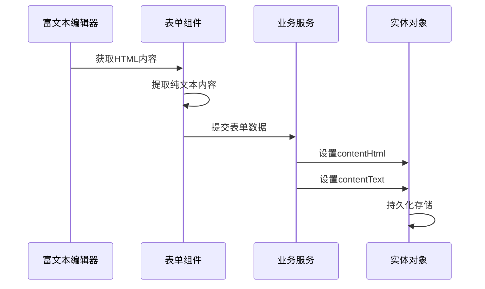

**图表来源**
- [notice-form-drawer.vue](file://smart-admin-web-javascript\src\views\business\oa\notice\components\notice-form-drawer.vue#L199-L207)

### 附件管理功能

#### 支持的文件类型
- 图片文件（jpg、png、gif等）
- 文档文件（pdf、doc、xls等）
- 压缩文件（zip、rar等）

#### 上传限制
- 单文件大小限制：10MB
- 最大文件数量：10个
- 文件夹分类存储

#### 附件处理流程
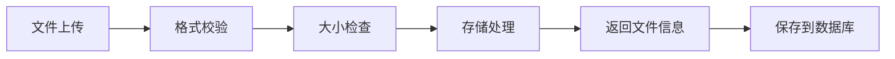

**节来源**
- [notice-form-drawer.vue](file://smart-admin-web-javascript\src\views\business\oa\notice\components\notice-form-drawer.vue#L286-L291)

### 浏览量统计

#### 统计维度
- **页面浏览量**：通知被查看的总次数
- **用户浏览量**：独立用户的查看次数
- **查看记录**：详细的查看历史

#### 统计机制
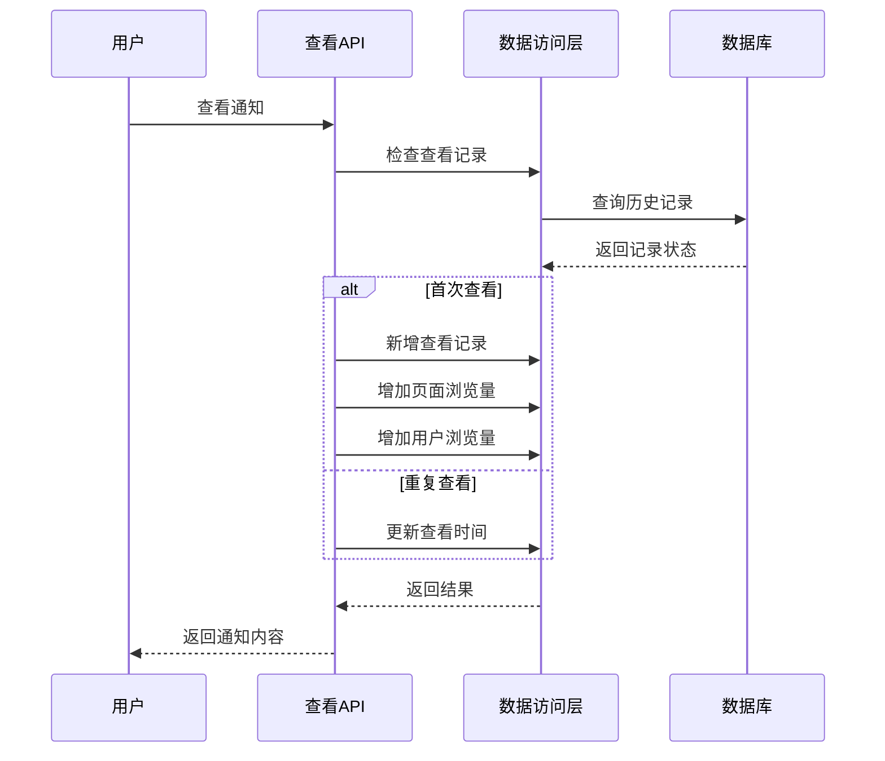

**图表来源**
- [NoticeDao.java](file://smart-admin-api-java17-springboot3\sa-admin\src\main\java\net\lab1024\sa\admin\module\business\oa\notice\dao\NoticeDao.java#L99-L123)

## 最佳实践与使用示例

### 通知创建最佳实践

#### 1. 内容质量控制
```javascript
// 建议的内容格式
const noticeContent = {
    title: "重要通知：系统维护公告",
    noticeTypeId: 1, // 公告类型ID
    allVisibleFlag: true,
    scheduledPublishFlag: false,
    publishTime: new Date(),
    contentHtml: "<h1>系统维护通知</h1><p>尊敬的用户，...</p>",
    contentText: "系统维护通知：尊敬的用户，...",
    author: "系统管理员",
    source: "IT部门",
    documentNumber: "SYS-MT-20240101-001"
};
```

#### 2. 可见范围设置建议
- **全员通知**：用于公司级公告、政策变更
- **部门通知**：用于部门内部事项
- **特定员工**：用于个人通知、审批通知

#### 3. 发布时机选择
- 工作日工作时间发布重要通知
- 避免在午休时间发布
- 定时发布考虑时区差异

### 前端使用示例

#### 通知列表查询
```javascript
// 查询通知列表
const queryNoticeList = async () => {
    const queryForm = {
        noticeTypeId: 1,
        keywords: '系统维护',
        documentNumber: '',
        createUserName: '',
        deletedFlag: false,
        publishTimeBegin: '2024-01-01 00:00:00',
        publishTimeEnd: '2024-12-31 23:59:59',
        pageNum: 1,
        pageSize: 10
    };
    
    try {
        const result = await noticeApi.queryNotice(queryForm);
        console.log('通知列表:', result.data.list);
        console.log('总数:', result.data.total);
    } catch (error) {
        console.error('查询失败:', error);
    }
};
```

#### 通知创建示例
```javascript
// 创建通知
const createNotice = async () => {
    const noticeData = {
        title: "春节放假通知",
        noticeTypeId: 1,
        allVisibleFlag: true,
        scheduledPublishFlag: false,
        publishTime: new Date(),
        contentHtml: "<p>全体员工请注意：</p><p>春节期间放假安排...</p>",
        contentText: "全体员工请注意：春节期间放假安排...",
        author: "人力资源部",
        source: "公司行政部",
        documentNumber: "HR-HOLIDAY-202401",
        attachment: "",
        visibleRangeList: []
    };
    
    try {
        await noticeApi.addNotice(noticeData);
        message.success('通知创建成功');
        // 刷新列表
        queryNoticeList();
    } catch (error) {
        message.error('创建失败:' + error.message);
    }
};
```

#### 定时发布设置
```javascript
// 设置定时发布
const scheduleNotice = async () => {
    const futureTime = new Date();
    futureTime.setDate(futureTime.getDate() + 1); // 明天发布
    
    const noticeData = {
        title: "明天系统维护通知",
        noticeTypeId: 1,
        allVisibleFlag: true,
        scheduledPublishFlag: true,
        publishTime: futureTime,
        contentHtml: "<p>明天系统将进行维护，请提前做好准备。</p>",
        contentText: "明天系统将进行维护，请提前做好准备。",
        author: "运维团队",
        source: "IT部门",
        visibleRangeList: []
    };
    
    try {
        await noticeApi.addNotice(noticeData);
        message.success('定时发布设置成功');
    } catch (error) {
        message.error('设置失败:' + error.message);
    }
};
```

### 错误处理最佳实践

#### 1. 参数验证
```javascript
// 表单验证示例
const formRules = {
    title: [
        { required: true, message: '请输入通知标题' },
        { max: 200, message: '标题长度不能超过200字符' }
    ],
    noticeTypeId: [
        { required: true, message: '请选择通知类型' }
    ],
    contentHtml: [
        { required: true, message: '请输入通知内容' }
    ]
};
```

#### 2. 异常捕获
```javascript
// API调用异常处理
const safeApiCall = async (apiMethod, params) => {
    try {
        const response = await apiMethod(params);
        return response;
    } catch (error) {
        if (error.response) {
            // 服务器返回错误
            message.error(`操作失败: ${error.response.data.message}`);
        } else if (error.request) {
            // 请求超时
            message.error('网络连接超时，请稍后重试');
        } else {
            // 其他错误
            message.error('操作出错: ' + error.message);
        }
        throw error;
    }
};
```

### 性能优化建议

#### 1. 查询优化
- 使用索引优化查询性能
- 合理设置分页大小
- 避免全表扫描

#### 2. 缓存策略
- 缓存通知类型列表
- 缓存热门通知内容
- 使用Redis缓存频繁访问的数据

#### 3. 批量操作
- 批量删除通知
- 批量更新可见范围
- 批量统计浏览量

### 安全注意事项

#### 1. 输入验证
- 严格验证所有用户输入
- 过滤危险字符
- 防止XSS攻击

#### 2. 权限控制
- 基于角色的访问控制
- 操作日志记录
- 敏感操作二次确认

#### 3. 数据保护
- 敏感信息脱敏显示
- 文件上传安全检查
- 数据备份和恢复

## 总结

通知管理系统是一个功能完整、架构清晰的企业级应用系统。通过本文档的详细分析，我们可以看到：

### 技术架构优势
- **分层设计**：清晰的分层架构，职责明确
- **前后端分离**：现代化的技术栈，易于维护和扩展
- **权限控制**：完善的权限管理体系
- **数据一致性**：严格的事务管理和数据校验

### 功能特性亮点
- **灵活的发布策略**：支持草稿、立即发布、定时发布
- **精确的可见范围控制**：支持全员、部门、员工的灵活组合
- **丰富的展示形式**：富文本内容、附件支持
- **完善的统计分析**：浏览量、查看记录等详细数据

### 开发实践价值
- **最佳实践**：提供了完整的CRUD操作示例
- **错误处理**：详细的异常处理和用户反馈机制
- **性能优化**：查询优化、缓存策略等性能考虑
- **安全防护**：输入验证、权限控制等安全措施

该系统为企业提供了高效、可靠的通知管理解决方案，能够满足各种规模企业的通知发布需求，具有良好的扩展性和维护性。通过合理的架构设计和功能实现，确保了系统的稳定运行和用户体验的持续优化。