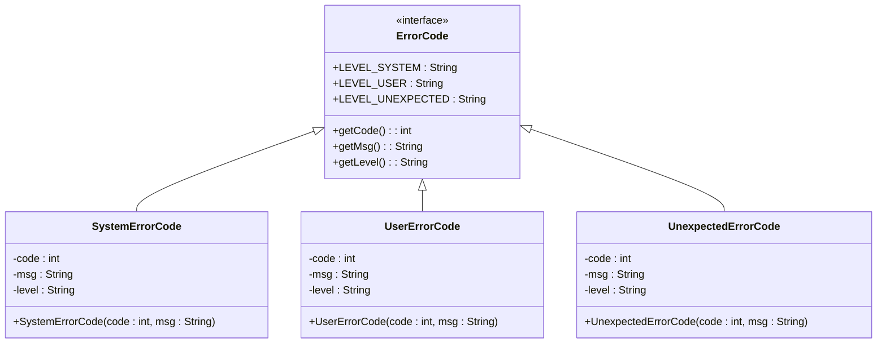
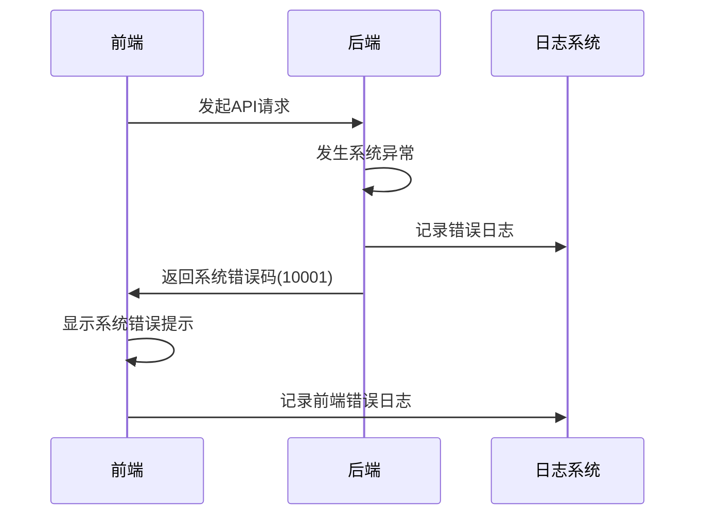
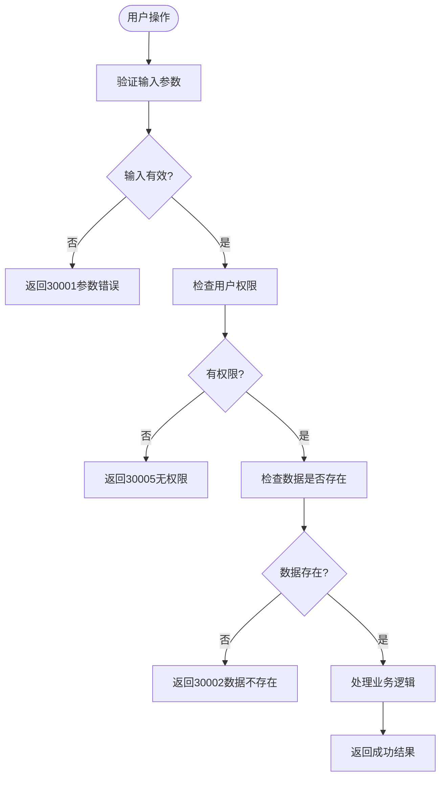
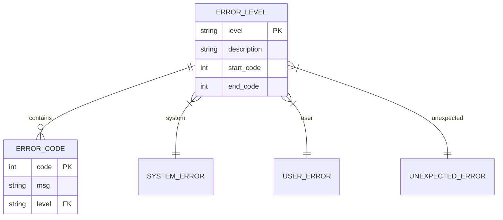
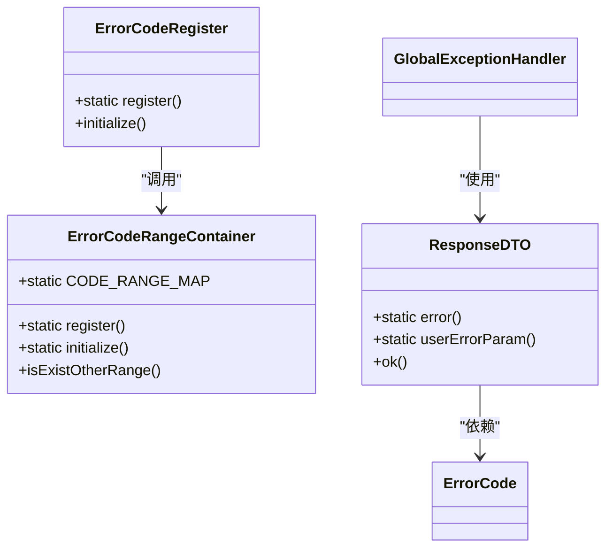
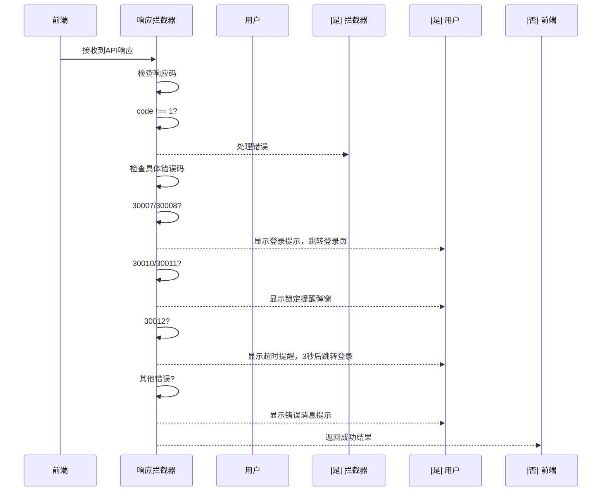
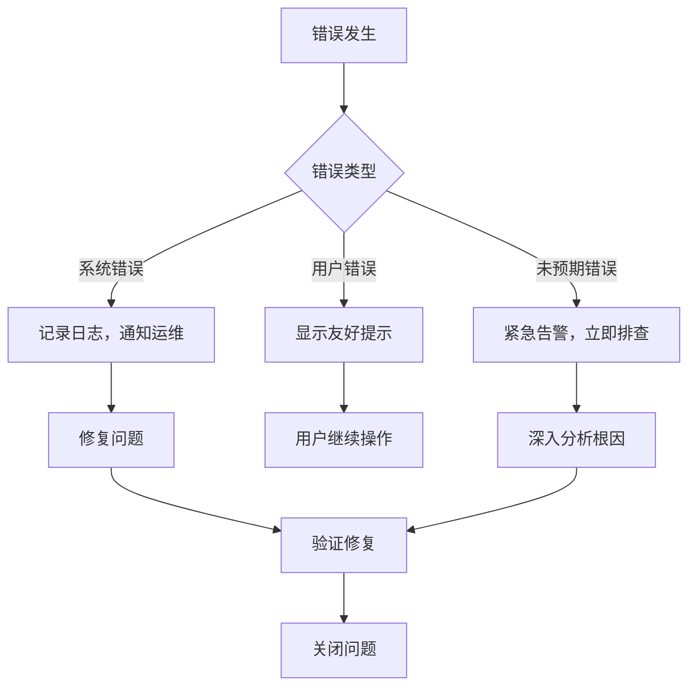

# 错误码体系

<cite>
**本文档引用的文件**  
- [ErrorCode.java](file://smart-admin-api-java17-springboot3/sa-base/src/main/java/net/lab1024/sa/base/common/code/ErrorCode.java)
- [SystemErrorCode.java](file://smart-admin-api-java17-springboot3/sa-base/src/main/java/net/lab1024/sa/base/common/code/SystemErrorCode.java)
- [UserErrorCode.java](file://smart-admin-api-java17-springboot3/sa-base/src/main/java/net/lab1024/sa/base/common/code/UserErrorCode.java)
- [UnexpectedErrorCode.java](file://smart-admin-api-java17-springboot3/sa-base/src/main/java/net/lab1024/sa/base/common/code/UnexpectedErrorCode.java)
- [ErrorCodeRegister.java](file://smart-admin-api-java17-springboot3/sa-base/src/main/java/net/lab1024/sa/base/common/code/ErrorCodeRegister.java)
- [GlobalExceptionHandler.java](file://smart-admin-api-java17-springboot3/sa-base/src/main/java/net/lab1024/sa/base/handler/GlobalExceptionHandler.java)
- [ResponseDTO.java](file://smart-admin-api-java17-springboot3/sa-base/src/main/java/net/lab1024/sa/base/common/domain/ResponseDTO.java)
- [axios.js](file://smart-admin-web-javascript/src/lib/axios.js)
- [vue3-admin-system-prompt.md](file://smart-admin-web-javascript/docs/vue3-admin-system-prompt.md)
</cite>

## 目录
1. [错误码体系概述](#错误码体系概述)
2. [错误码接口设计](#错误码接口设计)
3. [系统级错误码](#系统级错误码)
4. [用户级错误码](#用户级错误码)
5. [未预期错误码](#未预期错误码)
6. [错误码分层结构与编码规范](#错误码分层结构与编码规范)
7. [前端错误处理机制](#前端错误处理机制)
8. [错误处理最佳实践](#错误处理最佳实践)

## 错误码体系概述

本项目采用分层的错误码体系，将错误分为三个等级：系统级错误、用户级错误和未预期错误。这种分层设计有助于快速识别错误的严重程度和处理优先级。系统级错误需要立即关注和处理，用户级错误通常由用户操作引起，而未预期错误表示发生了理论上不应该发生的情况。

错误码体系通过枚举类实现，确保了类型安全和代码可读性。所有错误码都实现了统一的`ErrorCode`接口，包含错误码、错误消息和错误等级三个核心属性。通过`ErrorCodeRegister`类进行集中注册和范围校验，防止错误码冲突和越界。

**Section sources**
- [ErrorCode.java](file://smart-admin-api-java17-springboot3/sa-base/src/main/java/net/lab1024/sa/base/common/code/ErrorCode.java#L1-L47)
- [ErrorCodeRegister.java](file://smart-admin-api-java17-springboot3/sa-base/src/main/java/net/lab1024/sa/base/common/code/ErrorCodeRegister.java#L1-L41)

## 错误码接口设计

错误码体系的核心是`ErrorCode`接口，它定义了所有错误码必须实现的三个基本属性：

- **code**: 错误码数值，用于唯一标识一个错误
- **msg**: 错误消息，提供给用户或开发者的可读性描述
- **level**: 错误等级，标识错误的严重程度和类型



**Diagram sources**
- [ErrorCode.java](file://smart-admin-api-java17-springboot3/sa-base/src/main/java/net/lab1024/sa/base/common/code/ErrorCode.java#L1-L47)

**Section sources**
- [ErrorCode.java](file://smart-admin-api-java17-springboot3/sa-base/src/main/java/net/lab1024/sa/base/common/code/ErrorCode.java#L1-L47)

## 系统级错误码

系统级错误码（`SystemErrorCode`）表示系统内部发生了严重问题，需要立即关注和处理。这类错误通常与系统稳定性、数据库连接、网络通信等基础设施相关。

| 错误码 | 中文描述 | 触发场景 | 建议处理方式 |
|-------|---------|---------|-----------|
| 10001 | 系统似乎出现了点小问题 | 系统内部异常、未捕获的异常、服务不可用等 | 立即通知运维人员检查系统状态，查看日志定位问题，必要时重启服务 |

系统级错误通过`ResponseDTO.error()`方法返回，前端收到此类错误时应显示通用的系统错误提示，并记录详细的错误日志供后续分析。



**Diagram sources**
- [SystemErrorCode.java](file://smart-admin-api-java17-springboot3/sa-base/src/main/java/net/lab1024/sa/base/common/code/SystemErrorCode.java#L1-L39)
- [GlobalExceptionHandler.java](file://smart-admin-api-java17-springboot3/sa-base/src/main/java/net/lab1024/sa/base/handler/GlobalExceptionHandler.java#L93-L103)

**Section sources**
- [SystemErrorCode.java](file://smart-admin-api-java17-springboot3/sa-base/src/main/java/net/lab1024/sa/base/common/code/SystemErrorCode.java#L1-L39)

## 用户级错误码

用户级错误码（`UserErrorCode`）表示由用户操作引起的错误，通常不需要系统管理员立即干预。这类错误码涵盖了参数验证、权限控制、业务规则等常见场景。

| 错误码 | 中文描述 | 触发场景 | 建议处理方式 |
|-------|---------|---------|-----------|
| 30001 | 参数错误 | 请求参数不符合验证规则 | 在对应输入字段显示具体的错误信息 |
| 30002 | 左翻右翻，数据竟然找不到了~ | 请求的资源不存在 | 提示用户数据不存在，建议刷新页面或检查输入 |
| 30003 | 数据已存在了呀~ | 创建重复数据 | 提示用户该数据已存在，建议修改输入 |
| 30004 | 亲~您操作的太快了，请稍等下再操作~ | 操作过于频繁 | 显示提示并禁用操作按钮一段时间 |
| 30005 | 对不起，您没有权限访问此内容哦~ | 权限不足 | 提示用户无权限，可引导联系管理员 |
| 30006 | 系統正在紧急开发中，敬请期待~ | 功能开发中 | 显示友好提示，告知功能即将上线 |
| 30007 | 您还未登录或登录失效，请重新登录！ | 登录状态失效 | 跳转到登录页面重新登录 |
| 30008 | 用户状态异常 | 用户账户被禁用或锁定 | 提示用户联系管理员解决 |
| 30009 | 请勿重复提交 | 表单重复提交 | 禁用提交按钮，防止重复操作 |
| 30010 | 登录连续失败已经被锁定，无法登录 | 登录失败次数过多被锁定 | 显示锁定提示，告知解锁时间 |
| 30011 | 登录连续失败将会锁定提醒 | 登录失败接近锁定阈值 | 显示警告，提醒用户注意 |
| 30012 | 长时间未操作系统，需要重新登录 | 会话超时 | 弹出提示框，确认后跳转登录 |



**Diagram sources**
- [UserErrorCode.java](file://smart-admin-api-java17-springboot3/sa-base/src/main/java/net/lab1024/sa/base/common/code/UserErrorCode.java#L1-L53)
- [GlobalExceptionHandler.java](file://smart-admin-api-java17-springboot3/sa-base/src/main/java/net/lab1024/sa/base/handler/GlobalExceptionHandler.java#L43-L74)

**Section sources**
- [UserErrorCode.java](file://smart-admin-api-java17-springboot3/sa-base/src/main/java/net/lab1024/sa/base/common/code/UserErrorCode.java#L1-L53)

## 未预期错误码

未预期错误码（`UnexpectedErrorCode`）表示发生了理论上不应该发生的情况，这类错误需要高度重视，可能表明系统存在严重的设计缺陷或数据一致性问题。

| 错误码 | 中文描述 | 触发场景 | 建议处理方式 |
|-------|---------|---------|-----------|
| 20001 | 呃~ 业务繁忙，请稍后重试 | 业务处理异常繁忙或死锁 | 提示用户稍后重试，同时立即排查系统瓶颈 |
| 20002 | 付款单id发生了异常，请联系技术人员排查 | ID生成或引用异常 | 记录详细日志，通知开发人员紧急处理 |

未预期错误通常表示系统存在严重问题，需要立即通知开发团队进行深入调查。这类错误不应该在正常业务流程中出现。

**Section sources**
- [UnexpectedErrorCode.java](file://smart-admin-api-java17-springboot3/sa-base/src/main/java/net/lab1024/sa/base/common/code/UnexpectedErrorCode.java#L1-L43)

## 错误码分层结构与编码规范

项目采用分层的错误码结构，通过不同的数值范围来区分错误类型：



**编码规范：**

1. **范围划分**：
   - 系统错误码：10001-20000
   - 未预期错误码：20001-30000
   - 用户错误码：30001-40000

2. **注册机制**：
   通过`ErrorCodeRegister`类进行集中注册，确保错误码范围不重叠，避免冲突。

3. **校验机制**：
   `ErrorCodeRangeContainer`类负责校验错误码是否在指定范围内，以及是否存在重复定义。

4. **扩展性**：
   预留了足够的数值空间，便于未来扩展新的错误类型。



**Diagram sources**
- [ErrorCodeRegister.java](file://smart-admin-api-java17-springboot3/sa-base/src/main/java/net/lab1024/sa/base/common/code/ErrorCodeRegister.java#L1-L41)
- [ErrorCodeRangeContainer.java](file://smart-admin-api-java17-springboot3/sa-base/src/main/java/net/lab1024/sa/base/common/code/ErrorCodeRangeContainer.java#L1-L46)
- [ResponseDTO.java](file://smart-admin-api-java17-springboot3/sa-base/src/main/java/net/lab1024/sa/base/common/domain/ResponseDTO.java#L1-L122)

**Section sources**
- [ErrorCodeRegister.java](file://smart-admin-api-java17-springboot3/sa-base/src/main/java/net/lab1024/sa/base/common/code/ErrorCodeRegister.java#L1-L41)
- [ErrorCodeRangeContainer.java](file://smart-admin-api-java17-springboot3/sa-base/src/main/java/net/lab1024/sa/base/common/code/ErrorCodeRangeContainer.java#L1-L46)

## 前端错误处理机制

前端通过axios拦截器实现统一的错误处理机制，根据不同的错误码执行相应的处理策略：



**具体处理策略：**

1. **登录相关错误**（30007, 30008）：
   - 显示"您没有登录，请重新登录"提示
   - 300毫秒后自动跳转到登录页面

2. **账户锁定提醒**（30010, 30011）：
   - 弹出模态框显示锁定信息
   - 阻止用户继续操作

3. **会话超时**（30012）：
   - 弹出重要提醒模态框
   - 确认后3秒自动跳转登录

4. **网络错误**：
   - 超时：显示"网络超时"
   - 连接错误：显示"网络连接错误"

5. **其他错误**：
   - 直接显示错误消息提示

```javascript
// 响应拦截器中的错误处理逻辑
if (res.code && res.code !== 1) {
  // Token过期或登录失效
  if (res.code === 30007 || res.code === 30008) {
    message.error('您没有登录，请重新登录');
    setTimeout(logout, 300);
    return Promise.reject(response);
  }
  
  // 账户锁定提醒
  if (res.code === 30010 || res.code === 30011) {
    Modal.error({
      title: '重要提醒',
      content: res.msg,
    });
    return Promise.reject(response);
  }
  
  // 会话超时
  if (res.code === 30012) {
    Modal.error({
      title: '重要提醒',
      content: res.msg,
      onOk: logout,
    });
    setTimeout(logout, 3000);
    return Promise.reject(response);
  }
  
  // 其他错误
  message.error(res.msg);
  return Promise.reject(response);
}
```

**Diagram sources**
- [axios.js](file://smart-admin-web-javascript/src/lib/axios.js#L41-L83)
- [vue3-admin-system-prompt.md](file://smart-admin-web-javascript/docs/vue3-admin-system-prompt.md#L1093-L1147)

**Section sources**
- [axios.js](file://smart-admin-web-javascript/src/lib/axios.js#L41-L83)

## 错误处理最佳实践

### 后端最佳实践

1. **异常分类处理**：
   - 使用`GlobalExceptionHandler`统一处理各类异常
   - 将技术异常转换为业务友好的错误码

2. **日志记录**：
   - 系统错误和未预期错误必须记录详细日志
   - 生产环境避免暴露敏感错误信息

3. **错误码复用**：
   - 优先使用已定义的错误码
   - 避免随意创建新的错误码

### 前端最佳实践

1. **统一拦截**：
   - 通过axios拦截器实现统一错误处理
   - 避免在业务代码中重复处理相同错误

2. **用户友好**：
   - 根据错误类型提供差异化的用户提示
   - 敏感错误信息不直接暴露给用户

3. **错误上报**：
   - 使用`smartSentry.captureError()`上报未处理的异常
   - 记录前端错误日志供调试分析

4. **用户体验**：
   - 对可恢复错误提供重试机制
   - 对严重错误提供明确的后续操作指引



**Section sources**
- [GlobalExceptionHandler.java](file://smart-admin-api-java17-springboot3/sa-base/src/main/java/net/lab1024/sa/base/handler/GlobalExceptionHandler.java#L1-L131)
- [smart-sentry.js](file://smart-admin-web-javascript/src/lib/smart-sentry.js#L1-L22)