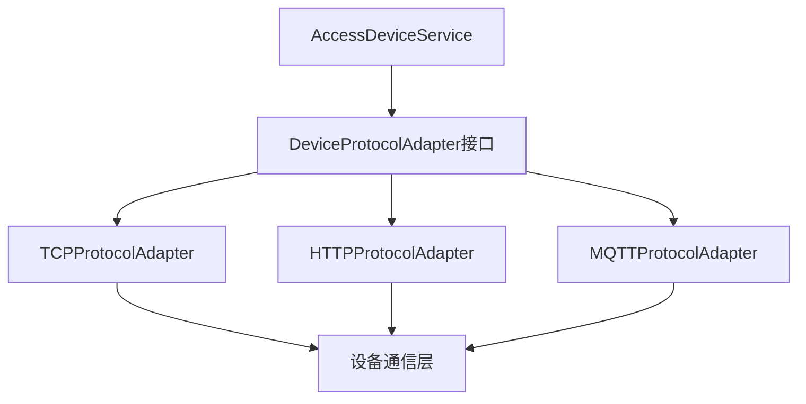

# 门禁系统功能梳理与完善方案

> **📋 文档版本**: v1.0.0  
> **📋 创建时间**: 2025-11-19  
> **📋 适用范围**: 门禁系统全局功能梳理、待办事项分析、功能完善方案

---

## 📊 一、门禁系统功能现状分析

### 1.1 已实现功能模块

#### ✅ 设备管理模块（AccessDevice）
**位置**: `smart-admin-api-java17-springboot3/sa-admin/src/main/java/net/lab1024/sa/admin/module/smart/access/`

**已实现功能**:
- ✅ 设备分页查询（支持多条件筛选）
- ✅ 设备详情查询
- ✅ 设备新增、编辑、删除
- ✅ 设备状态控制（启用/禁用）
- ✅ 设备统计信息（总数、在线数、离线数、在线率）
- ✅ 区域设备列表查询
- ✅ 设备在线状态检查

**代码质量**:
- ✅ 遵循四层架构规范（Controller → Service → Manager → Dao）
- ✅ 使用@Resource依赖注入
- ✅ 使用jakarta.*包名
- ✅ 完整的权限控制@SaCheckPermission
- ✅ 统一响应格式ResponseDTO

#### ✅ 区域管理模块（AccessArea）
**已实现功能**:
- ✅ 区域树形结构管理
- ✅ 区域新增、编辑、删除
- ✅ 区域层级管理
- ✅ 区域移动功能
- ✅ 区域路径计算和更新

**代码质量**:
- ✅ 遵循架构规范
- ✅ 完整的业务逻辑验证

#### ✅ 访问记录模块（AccessRecord）
**已实现功能**:
- ✅ 访问记录查询
- ✅ 访问记录缓存管理（多级缓存：Caffeine + Redis）
- ✅ 用户当日访问记录查询
- ✅ 设备当日访问记录查询
- ✅ 访问统计分析

**代码质量**:
- ✅ 使用BaseCacheManager实现多级缓存
- ✅ 缓存Key规范统一
- ✅ 性能优化到位

#### ✅ 智能门禁控制模块（SmartAccessControl）
**已实现功能**:
- ✅ 权限验证基础逻辑
- ✅ 设备权限检查
- ✅ 时间范围基础验证
- ✅ 日期有效性验证

**代码质量**:
- ✅ 基础权限验证逻辑完整

---

## 🚨 二、待办事项分析（TODO）

### 2.1 设备管理模块待办事项

#### 🔴 高优先级待办

**1. 远程开门协议调用实现**
- **位置**: `AccessDeviceServiceImpl.java:345`
- **当前状态**: 仅检查设备在线状态，未实现实际协议调用
- **需要实现**:
  ```java
  // TODO: 实现远程开门协议调用
  // 需要集成设备通信协议（如TCP/IP、HTTP、MQTT等）
  // 需要实现设备指令封装和发送
  // 需要实现设备响应解析和错误处理
  ```
- **影响范围**: 远程开门功能无法正常使用
- **建议方案**: 
  - 创建设备通信协议适配器接口
  - 实现不同设备厂商的协议适配器
  - 使用策略模式支持多协议切换

**2. 设备重启协议调用实现**
- **位置**: `AccessDeviceServiceImpl.java:467`
- **当前状态**: 未实现
- **需要实现**: 设备远程重启功能
- **建议方案**: 复用设备通信协议适配器

**3. 设备时间同步协议调用实现**
- **位置**: `AccessDeviceServiceImpl.java:491`
- **当前状态**: 未实现
- **需要实现**: 设备时间同步功能
- **建议方案**: 复用设备通信协议适配器

### 2.2 区域管理模块待办事项

#### 🟡 中优先级待办

**1. 获取区域设备列表实现**
- **位置**: `AccessAreaServiceImpl.java:326`
- **当前状态**: 返回空列表
- **需要实现**:
  ```java
  // TODO: 实现获取区域设备列表
  // 需要查询AccessDeviceEntity表
  // 需要支持includeChildren参数（是否包含子区域设备）
  // 需要优化查询性能（使用索引、缓存）
  ```
- **影响范围**: 区域设备关联查询功能缺失
- **建议方案**:
  - 查询AccessDeviceEntity表，关联areaId字段
  - 如果includeChildren=true，递归查询子区域设备
  - 使用缓存优化查询性能

**2. 区域统计信息实现**
- **位置**: `AccessAreaServiceImpl.java:432`
- **当前状态**: 未实现
- **需要实现**: 区域设备数量、访问统计等信息
- **建议方案**: 使用聚合查询和缓存

**3. 检查区域是否关联设备实现**
- **位置**: `AccessAreaServiceImpl.java:583`
- **当前状态**: 未实现
- **需要实现**: 删除区域前检查是否有关联设备
- **影响范围**: 区域删除功能可能误删有关联设备的区域
- **建议方案**: 查询AccessDeviceEntity表，检查areaId关联

**4. 使用枚举或常量优化**
- **位置**: `AccessAreaServiceImpl.java:546, 562`
- **当前状态**: 使用魔法数字
- **需要实现**: 使用枚举或常量替代魔法数字
- **建议方案**: 创建区域类型枚举、区域状态枚举

### 2.3 智能门禁控制模块待办事项

#### 🟡 中优先级待办

**1. 复杂时间段校验逻辑实现**
- **位置**: `SmartAccessControlServiceImpl.java:308`
- **当前状态**: 仅简化处理，未实现复杂时间段校验
- **需要实现**:
  ```java
  // TODO: 实现更复杂的时间段校验逻辑
  // 需要解析JSON时间段配置
  // 需要支持工作日/周末、节假日、特殊日期等
  // 需要支持多个时间段组合（如：工作日8:00-18:00，周末10:00-16:00）
  // 需要支持时间段重叠处理
  ```
- **影响范围**: 时间段权限控制功能不完善
- **建议方案**:
  - 设计时间段配置JSON格式
  - 实现时间段解析器
  - 实现时间段验证引擎
  - 支持复杂时间段规则

---

## 📋 三、功能完善方案

### 3.1 设备通信协议适配器设计

#### 架构设计


#### 实现步骤
1. **创建设备协议适配器接口**
   - 定义统一的方法签名
   - 支持远程开门、重启、时间同步等操作
   
2. **实现具体协议适配器**
   - TCP协议适配器（适用于TCP/IP设备）
   - HTTP协议适配器（适用于HTTP API设备）
   - MQTT协议适配器（适用于物联网设备）

3. **设备协议配置管理**
   - 在AccessDeviceEntity中增加protocolType字段
   - 在设备配置中存储协议参数（IP、端口、认证信息等）

4. **协议调用封装**
   - 统一异常处理
   - 超时控制
   - 重试机制
   - 日志记录

### 3.2 区域设备关联查询优化

#### 实现方案
```java
@Override
public List<AccessDeviceEntity> getAreaDevices(Long areaId, Boolean includeChildren) {
    // 1. 查询当前区域设备
    List<AccessDeviceEntity> devices = accessDeviceDao.selectList(
        new LambdaQueryWrapper<AccessDeviceEntity>()
            .eq(AccessDeviceEntity::getAreaId, areaId)
    );
    
    // 2. 如果包含子区域，递归查询
    if (includeChildren != null && includeChildren) {
        List<Long> childAreaIds = getChildAreaIds(areaId);
        if (!childAreaIds.isEmpty()) {
            List<AccessDeviceEntity> childDevices = accessDeviceDao.selectList(
                new LambdaQueryWrapper<AccessDeviceEntity>()
                    .in(AccessDeviceEntity::getAreaId, childAreaIds)
            );
            devices.addAll(childDevices);
        }
    }
    
    // 3. 使用缓存优化
    String cacheKey = "area:devices:" + areaId + ":" + includeChildren;
    return cacheManager.getCache(cacheKey, () -> devices, 5, TimeUnit.MINUTES);
}
```

#### 性能优化
- 使用数据库索引优化查询（areaId字段索引）
- 使用多级缓存（Caffeine本地缓存 + Redis分布式缓存）
- 批量查询优化（避免N+1查询问题）

### 3.3 时间段权限验证引擎

#### 时间段配置JSON格式设计
```json
{
  "timeSlots": [
    {
      "type": "weekday",
      "days": [1, 2, 3, 4, 5],
      "timeRanges": [
        {"start": "08:00", "end": "18:00"}
      ]
    },
    {
      "type": "weekend",
      "days": [6, 7],
      "timeRanges": [
        {"start": "10:00", "end": "16:00"}
      ]
    },
    {
      "type": "holiday",
      "dates": ["2025-01-01", "2025-05-01"],
      "timeRanges": [
        {"start": "09:00", "end": "17:00"}
      ]
    }
  ]
}
```

#### 时间段验证引擎实现
```java
public class TimeSlotValidator {
    /**
     * 验证当前时间是否在允许的时间段内
     * 
     * @param timeSlotConfig 时间段配置JSON
     * @param currentTime 当前时间
     * @return 是否在允许的时间段内
     */
    public boolean validate(String timeSlotConfig, LocalDateTime currentTime) {
        // 1. 解析JSON配置
        TimeSlotConfig config = parseConfig(timeSlotConfig);
        
        // 2. 检查是否为节假日
        if (isHoliday(config, currentTime)) {
            return validateHolidayTimeSlot(config, currentTime);
        }
        
        // 3. 检查工作日/周末
        DayOfWeek dayOfWeek = currentTime.getDayOfWeek();
        if (isWeekday(dayOfWeek)) {
            return validateWeekdayTimeSlot(config, currentTime);
        } else {
            return validateWeekendTimeSlot(config, currentTime);
        }
    }
}
```

### 3.4 区域统计信息实现

#### 统计信息内容
- 区域设备总数
- 在线设备数量
- 离线设备数量
- 今日访问次数
- 本月访问次数
- 区域访问趋势

#### 实现方案
```java
@Override
public Map<String, Object> getAreaStatistics(Long areaId) {
    Map<String, Object> statistics = new HashMap<>();
    
    // 1. 设备统计
    Long totalDevices = accessDeviceDao.countByAreaId(areaId);
    Long onlineDevices = accessDeviceDao.countOnlineByAreaId(areaId);
    statistics.put("totalDevices", totalDevices);
    statistics.put("onlineDevices", onlineDevices);
    statistics.put("offlineDevices", totalDevices - onlineDevices);
    
    // 2. 访问统计
    LocalDate today = LocalDate.now();
    Long todayAccessCount = accessRecordDao.countByAreaIdAndDate(areaId, today);
    statistics.put("todayAccessCount", todayAccessCount);
    
    // 3. 使用缓存
    String cacheKey = "area:stats:" + areaId + ":" + today;
    return cacheManager.getCache(cacheKey, () -> statistics, 5, TimeUnit.MINUTES);
}
```

---

## 🎯 四、完善优先级规划

### 4.1 高优先级（P0）- 核心功能缺失

1. **设备通信协议适配器实现** ⭐⭐⭐
   - 影响：远程开门、重启、时间同步功能无法使用
   - 工作量：3-5天
   - 依赖：设备协议文档、设备测试环境

2. **区域设备关联查询实现** ⭐⭐⭐
   - 影响：区域管理功能不完整
   - 工作量：1-2天
   - 依赖：数据库索引优化

3. **区域删除前关联检查** ⭐⭐
   - 影响：可能误删有关联设备的区域
   - 工作量：0.5天
   - 依赖：无

### 4.2 中优先级（P1）- 功能增强

1. **时间段权限验证引擎** ⭐⭐
   - 影响：时间段权限控制功能不完善
   - 工作量：2-3天
   - 依赖：时间段配置规范设计

2. **区域统计信息实现** ⭐⭐
   - 影响：区域管理数据展示不完整
   - 工作量：1-2天
   - 依赖：访问记录数据完整性

3. **枚举和常量优化** ⭐
   - 影响：代码可维护性
   - 工作量：0.5天
   - 依赖：无

### 4.3 低优先级（P2）- 代码优化

1. **代码注释完善**
2. **单元测试补充**
3. **性能优化**

---

## 📝 五、实施计划

### 阶段一：核心功能完善（1周）

**Day 1-2: 设备通信协议适配器**
- [ ] 设计设备协议适配器接口
- [ ] 实现TCP协议适配器
- [ ] 实现HTTP协议适配器
- [ ] 集成到AccessDeviceService
- [ ] 编写单元测试

**Day 3: 区域设备关联查询**
- [ ] 实现getAreaDevices方法
- [ ] 实现递归查询子区域设备
- [ ] 添加缓存优化
- [ ] 编写单元测试

**Day 4: 区域删除关联检查**
- [ ] 实现区域关联设备检查
- [ ] 优化删除流程
- [ ] 编写单元测试

**Day 5: 代码审查和测试**
- [ ] 代码审查
- [ ] 集成测试
- [ ] 性能测试
- [ ] 文档更新

### 阶段二：功能增强（1周）

**Day 1-2: 时间段权限验证引擎**
- [ ] 设计时间段配置JSON格式
- [ ] 实现时间段解析器
- [ ] 实现时间段验证引擎
- [ ] 集成到SmartAccessControlService
- [ ] 编写单元测试

**Day 3: 区域统计信息**
- [ ] 实现区域统计查询
- [ ] 添加缓存优化
- [ ] 编写单元测试

**Day 4: 枚举和常量优化**
- [ ] 创建区域类型枚举
- [ ] 创建区域状态枚举
- [ ] 替换魔法数字
- [ ] 编写单元测试

**Day 5: 代码审查和测试**
- [ ] 代码审查
- [ ] 集成测试
- [ ] 文档更新

---

## ✅ 六、验收标准

### 6.1 功能验收

- [ ] 远程开门功能正常使用
- [ ] 设备重启功能正常使用
- [ ] 设备时间同步功能正常使用
- [ ] 区域设备列表查询功能正常
- [ ] 区域统计信息查询功能正常
- [ ] 时间段权限验证功能正常
- [ ] 区域删除关联检查功能正常

### 6.2 代码质量验收

- [ ] 所有代码遵循repowiki规范
- [ ] 单元测试覆盖率≥80%
- [ ] 代码审查通过
- [ ] 性能测试通过
- [ ] 安全扫描通过

### 6.3 文档验收

- [ ] API文档更新完整
- [ ] 代码注释完善
- [ ] 用户手册更新
- [ ] 运维手册更新

---

## 📚 七、相关文档

- [门禁系统开发检查清单](docs/CHECKLISTS/门禁系统开发检查清单.md)
- [开发规范文档](docs/DEV_STANDARDS.md)
- [架构设计规范](docs/ARCHITECTURE_STANDARDS.md)
- [数据库设计规范](docs/repowiki/zh/content/开发规范体系/数据库设计规范.md)

---

## 🔄 八、持续改进

### 8.1 监控指标

- 设备在线率
- 远程操作成功率
- 权限验证响应时间
- 缓存命中率

### 8.2 优化方向

- 设备通信协议扩展（支持更多设备厂商）
- 时间段权限规则可视化配置
- 区域统计信息实时更新
- 性能优化（查询优化、缓存优化）

---

**📝 文档维护**: 本文档将根据实施进度持续更新  
**👥 负责人**: IOE-DREAM Team  
**📅 最后更新**: 2025-11-19

