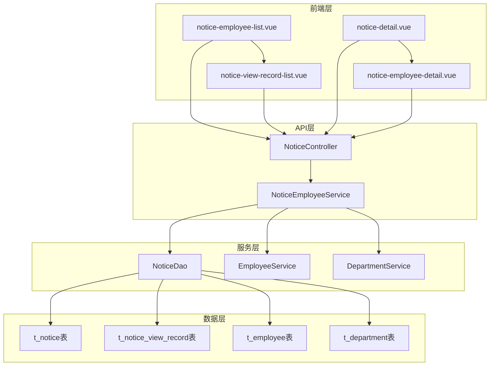
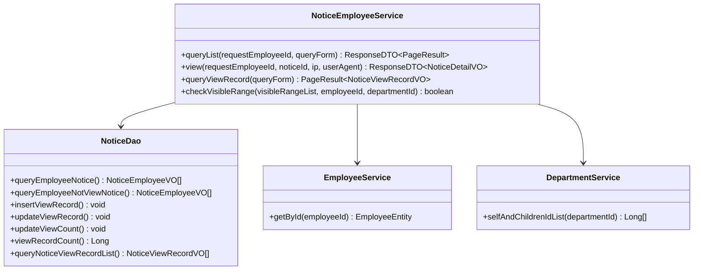
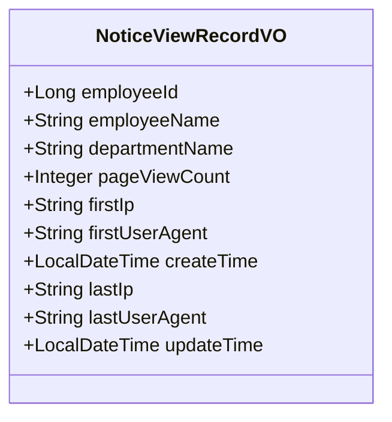
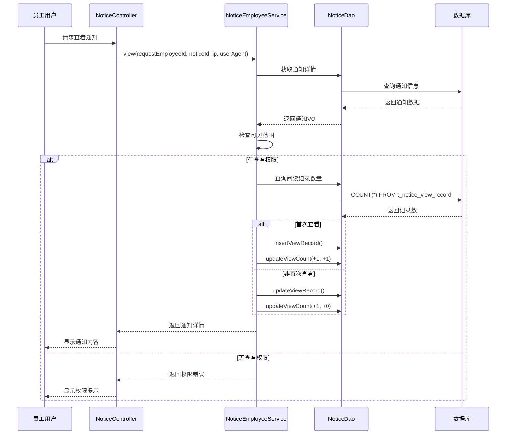
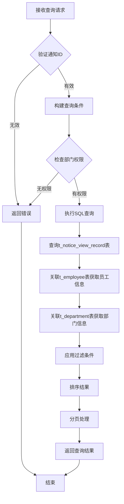

# 阅读记录跟踪技术文档

<cite>
**本文档引用的文件**
- [NoticeEmployeeService.java](file://smart-admin-api-java17-springboot3\sa-admin\src\main\java\net\lab1024\sa\admin\module\business\oa\notice\service\NoticeEmployeeService.java)
- [NoticeViewRecordQueryForm.java](file://smart-admin-api-java17-springboot3\sa-admin\src\main\java\net\lab1024\sa\admin\module\business\oa\notice\domain\form\NoticeViewRecordQueryForm.java)
- [NoticeViewRecordVO.java](file://smart-admin-api-java17-springboot3\sa-admin\src\main\java\net\lab1024\sa\admin\module\business\oa\notice\domain\vo\NoticeViewRecordVO.java)
- [NoticeMapper.xml](file://smart-admin-api-java17-springboot3\sa-admin\src\main\resources\mapper\business\oa\notice\NoticeMapper.xml)
- [notice-view-record-list.vue](file://smart-admin-web-javascript\src\views\business\oa\notice\components\notice-view-record-list.vue)
- [notice-employee-list.vue](file://smart-admin-web-javascript\src\views\business\oa\notice\notice-employee-list.vue)
- [notice-api.js](file://smart-admin-web-javascript\src\api\business\oa\notice-api.js)
</cite>

## 目录
1. [概述](#概述)
2. [系统架构](#系统架构)
3. [核心组件分析](#核心组件分析)
4. [数据模型设计](#数据模型设计)
5. [业务流程详解](#业务流程详解)
6. [前端实现](#前端实现)
7. [统计与分析功能](#统计与分析功能)
8. [性能优化策略](#性能优化策略)
9. [故障排除指南](#故障排除指南)
10. [最佳实践建议](#最佳实践建议)

## 概述

通知阅读记录跟踪功能是智能管理系统中的重要组成部分，负责记录和管理通知公告的阅读状态。该系统通过多层次的架构设计，实现了对员工通知查看行为的完整追踪，包括已读/未读标记、阅读时间记录、设备信息识别等功能。

### 主要特性

- **实时阅读状态跟踪**：自动记录员工的通知查看行为
- **多维度统计分析**：提供阅读率、活跃度等关键指标
- **灵活的查询功能**：支持按部门、时间段、关键词等多种条件查询
- **设备信息识别**：记录查看设备的IP地址和用户代理信息
- **权限控制机制**：基于部门和员工范围的访问控制

## 系统架构



**架构图来源**
- [NoticeEmployeeService.java](file://smart-admin-api-java17-springboot3\sa-admin\src\main\java\net\lab1024\sa\admin\module\business\oa\notice\service\NoticeEmployeeService.java#L35-L47)
- [notice-view-record-list.vue](file://smart-admin-web-javascript\src\views\business\oa\notice\components\notice-view-record-list.vue#L63-L124)

## 核心组件分析

### NoticeEmployeeService - 员工通知服务

NoticeEmployeeService是通知阅读跟踪的核心业务服务类，负责处理员工通知的查询、查看和统计功能。

#### 主要业务方法



**类图来源**
- [NoticeEmployeeService.java](file://smart-admin-api-java17-springboot3\sa-admin\src\main\java\net\lab1024\sa\admin\module\business\oa\notice\service\NoticeEmployeeService.java#L35-L155)

#### 关键业务逻辑

1. **通知查询逻辑**：
   - 支持分页查询员工通知列表
   - 自动过滤可见范围内的通知
   - 提供未读通知筛选功能

2. **阅读状态更新**：
   - 首次查看时插入阅读记录
   - 后续查看时更新阅读记录
   - 维护页面浏览量和用户浏览量统计

3. **权限验证**：
   - 检查通知的可见范围设置
   - 支持部门级和员工级权限控制

**节来源**
- [NoticeEmployeeService.java](file://smart-admin-api-java17-springboot3\sa-admin\src\main\java\net\lab1024\sa\admin\module\business\oa\notice\service\NoticeEmployeeService.java#L52-L155)

### NoticeViewRecordQueryForm - 查询表单

查询表单设计用于支持复杂的阅读记录查询需求，提供了灵活的筛选条件。

#### 表单字段设计

| 字段名 | 类型 | 描述 | 必填 |
|--------|------|------|------|
| noticeId | Long | 通知公告ID | 是 |
| departmentId | Long | 部门ID | 否 |
| keywords | String | 关键字搜索 | 否 |

**节来源**
- [NoticeViewRecordQueryForm.java](file://smart-admin-api-java17-springboot3\sa-admin\src\main\java\net\lab1024\sa\admin\module\business\oa\notice\domain\form\NoticeViewRecordQueryForm.java#L18-L31)

### NoticeViewRecordVO - 视图对象

视图对象封装了通知阅读记录的完整数据结构，包含员工信息、阅读统计和设备信息。

#### 数据结构定义



**类图来源**
- [NoticeViewRecordVO.java](file://smart-admin-api-java17-springboot3\sa-admin\src\main\java\net\lab1024\sa\admin\module\business\oa\notice\domain\vo\NoticeViewRecordVO.java#L18-L49)

**节来源**
- [NoticeViewRecordVO.java](file://smart-admin-api-java17-springboot3\sa-admin\src\main\java\net\lab1024\sa\admin\module\business\oa\notice\domain\vo\NoticeViewRecordVO.java#L18-L49)

## 数据模型设计

### 数据库表结构

系统使用三个核心表来支撑通知阅读记录功能：

#### t_notice表 - 通知主表
| 字段名 | 类型 | 描述 |
|--------|------|------|
| notice_id | BIGINT | 通知ID |
| title | VARCHAR | 标题 |
| page_view_count | INT | 页面浏览量 |
| user_view_count | INT | 用户浏览量 |
| publish_time | DATETIME | 发布时间 |

#### t_notice_view_record表 - 阅读记录表
| 字段名 | 类型 | 描述 |
|--------|------|------|
| notice_id | BIGINT | 通知ID |
| employee_id | BIGINT | 员工ID |
| first_ip | VARCHAR | 首次查看IP |
| first_user_agent | VARCHAR | 首次用户代理 |
| last_ip | VARCHAR | 最后查看IP |
| last_user_agent | VARCHAR | 最后用户代理 |
| page_view_count | INT | 查看次数 |
| create_time | DATETIME | 首次查看时间 |
| update_time | DATETIME | 最后查看时间 |

**节来源**
- [NoticeMapper.xml](file://smart-admin-api-java17-springboot3\sa-admin\src\main\resources\mapper\business\oa\notice\NoticeMapper.xml#L247-L269)

### SQL查询语句

系统提供了多种SQL查询语句来支持不同的业务需求：

1. **插入阅读记录**：
```sql
INSERT INTO t_notice_view_record 
(notic_id, employee_id, first_ip, first_user_agent, page_view_count)
VALUES (#{noticeId}, #{employeeId}, #{ip}, #{userAgent}, #{pageViewCount})
```

2. **更新阅读记录**：
```sql
UPDATE t_notice_view_record
SET page_view_count = page_view_count + 1,
    last_ip = #{ip},
    last_user_agent = #{userAgent}
WHERE notice_id = #{noticeId}
  AND employee_id = #{employeeId}
```

3. **更新浏览量统计**：
```sql
UPDATE t_notice
SET page_view_count = page_view_count + #{pageViewCountIncrement},
    user_view_count = user_view_count + #{userViewCountIncrement}
WHERE notice_id = #{noticeId}
```

**节来源**
- [NoticeMapper.xml](file://smart-admin-api-java17-springboot3\sa-admin\src\main\resources\mapper\business\oa\notice\NoticeMapper.xml#L250-L267)

## 业务流程详解

### 员工通知查看流程



**序列图来源**
- [NoticeEmployeeService.java](file://smart-admin-api-java17-springboot3\sa-admin\src\main\java\net\lab1024\sa\admin\module\business\oa\notice\service\NoticeEmployeeService.java#L94-L120)

### 阅读记录查询流程



**流程图来源**
- [NoticeEmployeeService.java](file://smart-admin-api-java17-springboot3\sa-admin\src\main\java\net\lab1024\sa\admin\module\business\oa\notice\service\NoticeEmployeeService.java#L147-L155)

**节来源**
- [NoticeEmployeeService.java](file://smart-admin-api-java17-springboot3\sa-admin\src\main\java\net\lab1024\sa\admin\module\business\oa\notice\service\NoticeEmployeeService.java#L147-L155)

## 前端实现

### notice-view-record-list.vue - 阅读记录列表组件

该组件负责展示通知的阅读记录，提供详细的查看统计和设备信息。

#### 组件功能特性

1. **查询功能**：
   - 部门筛选
   - 关键字搜索（姓名、IP、设备信息）
   - 分页显示

2. **数据显示**：
   - 员工姓名和部门
   - 查看次数统计
   - 设备信息识别
   - 时间戳记录

3. **设备信息解析**：
   - 使用ua-parser-js解析用户代理字符串
   - 显示浏览器、操作系统和设备型号

**节来源**
- [notice-view-record-list.vue](file://smart-admin-web-javascript\src\views\business\oa\notice\components\notice-view-record-list.vue#L63-L161)

### notice-employee-list.vue - 员工通知列表

该组件展示员工可查看的通知列表，并提供未读标记和统计信息。

#### 关键功能

1. **通知列表展示**：
   - 标题、分类、作者、来源等基本信息
   - 已读/未读状态标识
   - 访问量统计（用户数/总次数）

2. **筛选功能**：
   - 分类筛选
   - 关键字搜索
   - 发布时间范围
   - 未读标记筛选

**节来源**
- [notice-employee-list.vue](file://smart-admin-web-javascript\src\views\business\oa\notice\notice-employee-list.vue#L41-L200)

### API接口设计

前端通过统一的API接口与后端交互：

| 接口名称 | 方法 | URL | 功能描述 |
|----------|------|-----|----------|
| 查询通知列表 | POST | /oa/notice/employee/query | 查询员工通知列表 |
| 查看通知详情 | GET | /oa/notice/employee/view/{noticeId} | 查看通知详细内容 |
| 查询阅读记录 | POST | /oa/notice/employee/queryViewRecord | 查询阅读记录 |

**节来源**
- [notice-api.js](file://smart-admin-web-javascript\src\api\business\oa\notice-api.js#L45-L74)

## 统计与分析功能

### 阅读率统计

系统提供了多层次的阅读统计功能：

1. **通知级别统计**：
   - 页面浏览量（page_view_count）
   - 用户浏览量（user_view_count）
   - 阅读率计算公式：用户浏览量 ÷ 页面浏览量 × 100%

2. **部门级别统计**：
   - 按部门汇总阅读数据
   - 部门阅读活跃度排行

3. **时间维度统计**：
   - 按日、周、月统计阅读趋势
   - 通知发布后的阅读时效分析

### 未读提醒功能

系统支持基于阅读状态的提醒机制：

1. **自动标记未读**：
   - 新通知发布时自动标记为未读
   - 员工首次查看时更新为已读

2. **批量确认功能**：
   - 支持批量标记为已读
   - 提供确认对话框防止误操作

3. **催办功能**：
   - 对于重要通知提供催办提醒
   - 基于阅读时间和重要性级别

## 性能优化策略

### 数据库优化

1. **索引设计**：
   - 在t_notice_view_record表上为notice_id和employee_id建立复合索引
   - 在t_notice表上为publish_time建立索引

2. **查询优化**：
   - 使用LIMIT限制查询结果数量
   - 实现缓存机制减少重复查询

3. **数据分区**：
   - 按时间范围对阅读记录表进行分区
   - 提高历史数据查询效率

### 前端优化

1. **懒加载**：
   - 阅读记录列表采用分页加载
   - 大数据量时使用虚拟滚动

2. **缓存策略**：
   - 缓存通知基本信息
   - 减少重复的API调用

3. **防抖处理**：
   - 查询按钮添加防抖机制
   - 避免频繁的服务器请求

## 故障排除指南

### 常见问题及解决方案

1. **阅读记录不更新**
   - 检查IP地址和User-Agent参数是否正确传递
   - 验证数据库连接和权限设置
   - 确认通知ID和员工ID的有效性

2. **查询结果不准确**
   - 检查权限过滤逻辑
   - 验证时间范围参数格式
   - 确认部门层级关系配置

3. **性能问题**
   - 分析慢查询日志
   - 检查索引使用情况
   - 优化查询条件和分页设置

### 调试技巧

1. **日志记录**：
   - 启用SQL日志查看执行的查询语句
   - 记录关键业务流程的执行时间

2. **监控指标**：
   - 监控数据库查询响应时间
   - 跟踪API接口调用频率

3. **测试数据**：
   - 使用测试数据验证功能完整性
   - 模拟不同权限场景进行测试

## 最佳实践建议

### 开发建议

1. **代码规范**：
   - 遵循Spring Boot项目规范
   - 使用适当的注释和文档

2. **异常处理**：
   - 实现完善的异常捕获机制
   - 提供友好的错误提示信息

3. **安全性**：
   - 验证所有输入参数
   - 实施适当的权限控制

### 运维建议

1. **监控告警**：
   - 监控系统性能指标
   - 设置关键功能的告警阈值

2. **备份策略**：
   - 定期备份重要数据
   - 测试数据恢复流程

3. **容量规划**：
   - 评估数据增长趋势
   - 制定相应的扩容计划

### 用户体验优化

1. **界面设计**：
   - 提供清晰的状态指示
   - 优化查询响应速度

2. **功能扩展**：
   - 支持导出阅读报告
   - 提供个性化通知设置

通过以上技术文档，开发者可以全面理解通知阅读记录跟踪功能的实现原理和使用方法，为系统的维护和扩展提供有力支持。