# IOE-DREAM全局端到端业务流程图

> **文档版本**: v1.0.0
> **创建日期**: 2025-12-16
> **业务范围**: 门禁 + 考勤 + 消费 + 访客 + 视频监控
> **集成程度**: 全模块端到端业务流程

---

## 🏗️ 整体架构业务流程图

### 系统总体业务架构

---

## 🚪 门禁管理端到端业务流程

### 门禁控制完整流程

### 门禁权限管理流程

---

## ⏰ 考勤管理端到端业务流程

### 智能考勤完整流程

### 考勤数据分析流程

---

## 💳 消费管理端到端业务流程

### 无感消费完整流程

### 账户管理流程

---

## 👥 访客管理端到端业务流程

### 访客预约到访完整流程

---

## 📹 视频监控端到端业务流程

### 智能视频监控完整流程

---

## 🔄 跨模块业务联动流程

### 异常事件跨模块联动流程

```mermaid
graph TB
    A[异常事件发生] --> B{事件类型}

    B -->|门禁异常| C[门禁服务处理]
    B -->|考勤异常| D[考勤服务处理]
    B -->|消费异常| E[消费服务处理]
    B -->|访客异常| F[访客服务处理]
    B -->|视频异常| G[视频服务处理]

    C --> H[视频联动抓拍]
    D --> H
    E --> H
    F --> H
    G --> H

    H --> I[AI智能分析]
    I --> J{风险等级评估}

    J -->|高风险| K[紧急告警]
    J -->|中风险| L[预警通知]
    J -->|低风险| M[记录备案]

    K --> N[通知安保人员]
    K --> O[自动报警]
    K --> P[联动其他系统]

    L --> Q[通知管理人员]
    L --> R[发送短信通知]
    L --> S[App推送通知]

    M --> T[保存异常记录]
    M --> U[更新风险评估模型]

    N --> V[现场处理]
    O --> V
    P --> V

    V --> W[处理结果反馈]
    W --> X[事件关闭]
```

### 数据同步一致性流程

---

## 📊 业务监控与分析流程

### 全方位业务监控体系

---

## 🎯 核心业务KPI监控

### 关键性能指标体系

### 业务流程优化指标

| 业务模块 | KPI指标 | 目标值 | 监控频率 |
|---------|---------|--------|----------|
| 门禁管理 | 通行成功率 | ≥99.9% | 实时 |
| 门禁管理 | 识别响应时间 | ≤2秒 | 实时 |
| 门禁管理 | 异常处理时效 | ≤5分钟 | 实时 |
| 考勤管理 | 考勤准确率 | ≥99.5% | 每日 |
| 考勤管理 | 排班优化率 | ≥95% | 每周 |
| 考勤管理 | 异常检测率 | ≥98% | 实时 |
| 消费管理 | 交易成功率 | ≥99.8% | 实时 |
| 消费管理 | 支付响应时间 | ≤3秒 | 实时 |
| 消费管理 | 账务准确率 | 100% | 每日 |
| 访客管理 | 预约处理时效 | ≤30分钟 | 实时 |
| 访客管理 | 访客满意度 | ≥95% | 每月 |
| 访客管理 | 权限激活时效 | ≤1分钟 | 实时 |
| 视频监控 | 视频可用性 | ≥99.9% | 实时 |
| 视频监控 | AI分析准确率 | ≥95% | 实时 |
| 视频监控 | 存储完整性 | 100% | 每日 |

---

## 📋 实施计划与时间线

### 端到端流程实施路线图

---

## ✅ 流程完整性检查清单

### 业务流程覆盖度检查

- [ ] **门禁管理流程**
  - [x] 用户权限验证流程
  - [x] 生物识别认证流程
  - [x] 设备控制流程
  - [x] 异常处理流程
  - [x] 视频联动流程
  - [ ] 多因子认证流程
  - [ ] 反潜回流程

- [ ] **考勤管理流程**
  - [x] 智能排班流程
  - [x] GPS定位打卡流程
  - [x] 生物识别考勤流程
  - [x] 数据统计分析流程
  - [x] 异常检测流程
  - [ ] 加班审批流程
  - [ ] 请假管理流程

- [ ] **消费管理流程**
  - [x] 人脸识别消费流程
  - [x] 账户管理流程
  - [x] 支付处理流程
  - [x] 离线同步流程
  - [x] 结算清算流程
  - [ ] 退款处理流程
  - [ ] 补贴发放流程

- [ ] **访客管理流程**
  - [x] 预约申请流程
  - [x] 审批流程
  - [x] 到访签到流程
  - [x] 权限管理流程
  - [x] 签离流程
  - [ ] 访客轨迹追踪
  - [ ] 黑名单管理流程

- [ ] **视频监控流程**
  - [x] 实时监控流程
  - [x] AI分析流程
  - [x] 异常检测流程
  - [x] 视频回放流程
  - [x] 智能搜索流程
  - [ ] 存储管理流程
  - [ ] 设备维护流程

### 跨模块集成检查

- [x] **数据同步流程**
- [x] **异常事件联动流程**
- [x] **消息通知流程**
- [x] **权限集成流程**
- [x] **设备状态同步流程**
- [ ] **统一认证流程**
- [ ] **日志审计流程**

---

## 🎯 下一步实施重点

基于以上全局端到端业务流程图分析，下一步实施重点为：

1. **P0级关键修复**：
   - 修复门禁安全漏洞和权限控制
   - 实现智能排班算法引擎
   - 实现视频监控核心功能

2. **P1级功能完善**：
   - 修复所有Controller层业务逻辑缺失
   - 完善跨模块业务联动机制
   - 优化系统性能和稳定性

3. **P2级增强优化**：
   - 完善AI智能分析功能
   - 优化用户体验
   - 增强监控告警体系

---

**文档创建完成时间**: 2025-12-16
**流程图总数**: 15个核心业务流程图
**业务模块覆盖**: 5个核心模块 + 3个支撑模块
**集成度**: 端到端全流程覆盖
**下一步**: 基于此流程图开始P0级功能完整实现