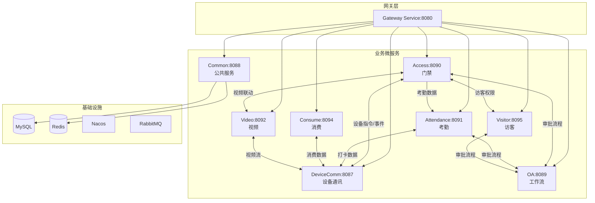
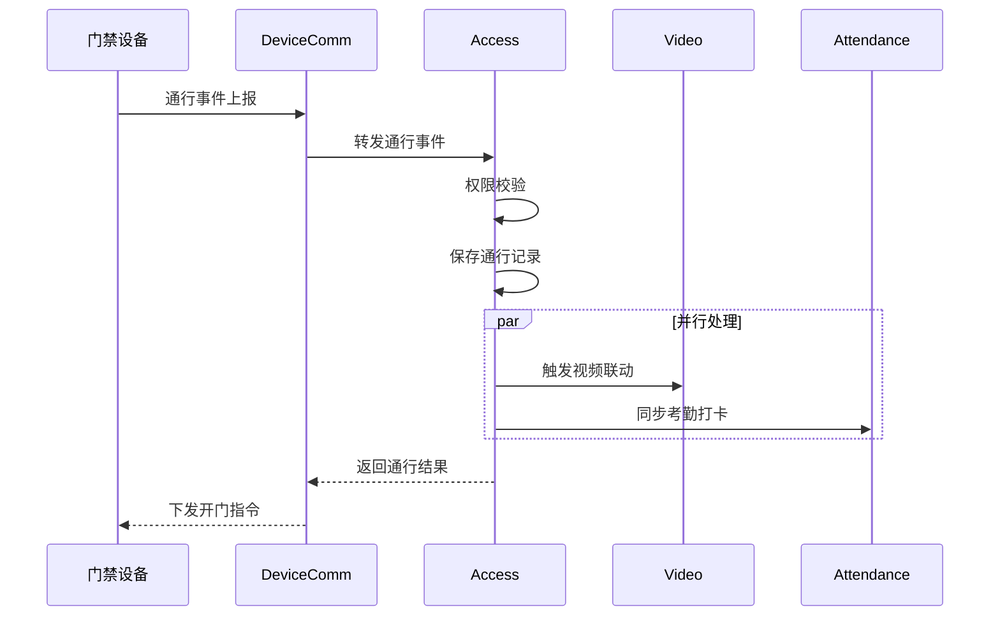
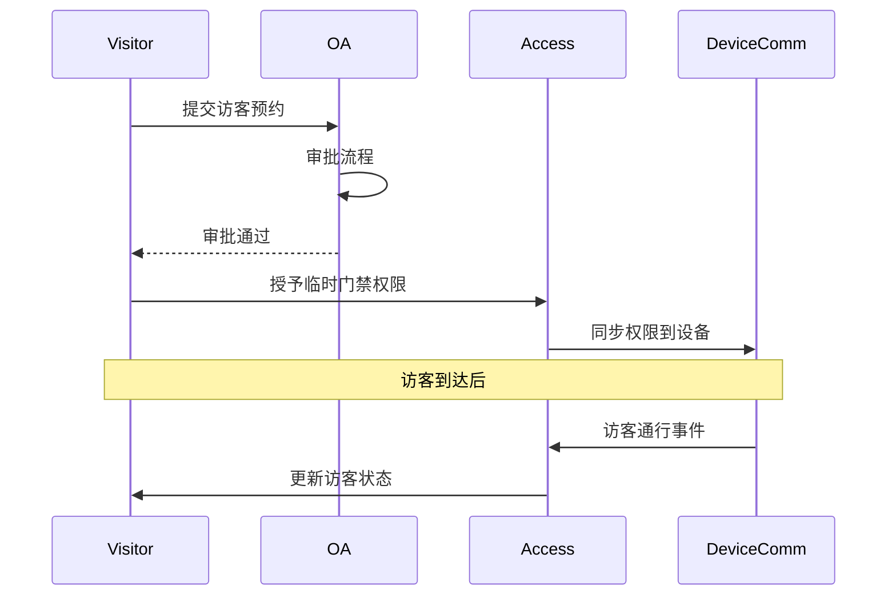
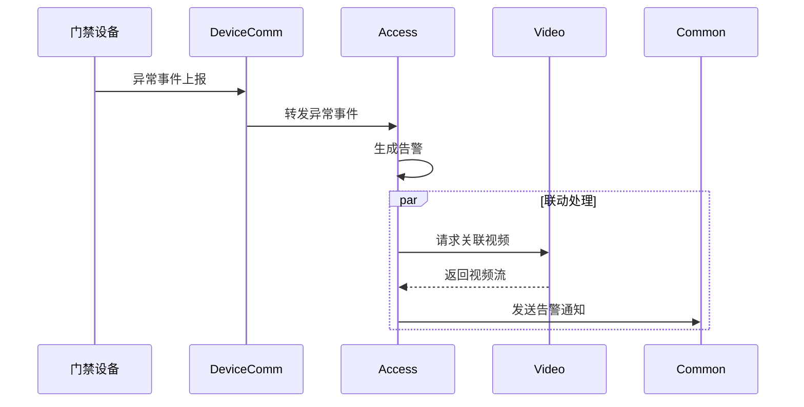

# IOE-DREAM 模块间关联总览

> **版本**: v1.0.0  
> **创建日期**: 2025-12-17

---

## 📊 系统全局关联图



---

## 🔗 微服务间关联矩阵

| 服务 | Gateway | Common | DeviceComm | OA | Access | Attendance | Video | Consume | Visitor |
|------|:-------:|:------:|:----------:|:--:|:------:|:----------:|:-----:|:-------:|:-------:|
| **Gateway** | - | ✓ | ✓ | ✓ | ✓ | ✓ | ✓ | ✓ | ✓ |
| **Common** | - | - | - | - | ✓ | ✓ | ✓ | ✓ | ✓ |
| **DeviceComm** | - | ✓ | - | - | ✓ | ✓ | ✓ | ✓ | - |
| **OA** | - | ✓ | - | - | ✓ | ✓ | - | - | ✓ |
| **Access** | - | ✓ | ✓ | ✓ | - | ✓ | ✓ | - | ✓ |
| **Attendance** | - | ✓ | ✓ | ✓ | ✓ | - | - | - | - |
| **Video** | - | ✓ | ✓ | - | ✓ | - | - | - | ✓ |
| **Consume** | - | ✓ | ✓ | - | - | - | - | - | - |
| **Visitor** | - | ✓ | - | ✓ | ✓ | - | ✓ | - | - |

---

## 📋 关键业务场景关联

### 场景1: 员工门禁通行



### 场景2: 访客预约通行



### 场景3: 门禁告警联动



---

## 🔧 数据共享设计

### 共享数据表（microservices-common）

| 数据域 | 表名 | 使用服务 |
|--------|------|----------|
| 用户 | t_common_user | 全部 |
| 部门 | t_common_department | 全部 |
| 区域 | t_common_area | Access, Visitor, Video |
| 设备 | t_common_device | Access, Attendance, Consume |
| 权限 | t_common_permission | 全部 |

### 服务专有数据表

| 服务 | 表前缀 | 示例 |
|------|--------|------|
| Access | t_access_ | t_access_record, t_access_device |
| Attendance | t_attendance_ | t_attendance_record |
| Video | t_video_ | t_video_device |
| Consume | t_consume_ | t_consume_record |
| Visitor | t_visitor_ | t_visitor_appointment |

---

## ⚡ 消息队列设计

### Exchange定义

| Exchange | Type | 说明 |
|----------|------|------|
| ioedream.access | topic | 门禁事件 |
| ioedream.attendance | topic | 考勤事件 |
| ioedream.alert | fanout | 告警广播 |
| ioedream.notification | topic | 通知消息 |

### Queue绑定

| Queue | Exchange | Routing Key | Consumer |
|-------|----------|-------------|----------|
| access.event.attendance | ioedream.access | access.event.* | Attendance |
| access.alert.video | ioedream.alert | # | Video |
| notification.push | ioedream.notification | notification.* | Common |

---

## 🔐 服务调用安全

### 内部服务认证

```yaml
# 服务间调用携带内部Token
headers:
  X-Service-Name: ioedream-access-service
  X-Service-Token: ${internal.service.token}
  X-Trace-Id: ${trace.id}
```

### 调用链路追踪

- 使用Micrometer + Zipkin进行链路追踪
- 所有跨服务调用携带TraceId
- 日志记录包含完整调用链信息

---

**📝 文档维护**: IOE-DREAM架构团队 | 2025-12-17
