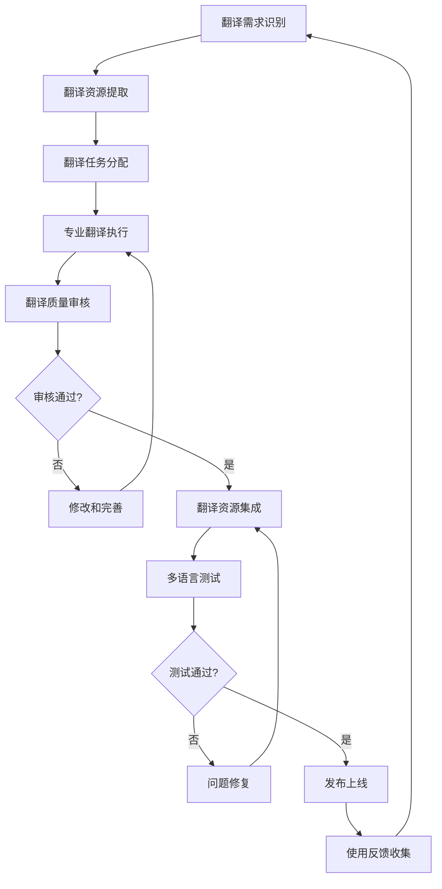

# IOE-DREAM国际化多语言支持文档

> **版本**: v1.0.0
> **创建日期**: 2025-12-21
> **适用范围**: IOE-DREAM智慧园区管理系统全平台
> **维护机构**: IOE-DREAM国际化委员会

---

## 📋 概述

本文档为IOE-DREAM智慧园区管理系统提供完整的国际化（i18n）和多语言支持方案，涵盖Web端、移动端、小程序等多平台的本地化实施标准和技术实现指南。

### 🎯 国际化目标

- **全球化支持**: 支持多国家、多地区的本地化需求
- **文化适配**: 尊重各地文化差异，提供本地化体验
- **技术标准**: 建立统一的技术实现标准和工作流程
- **维护效率**: 提供高效的翻译管理和更新机制

---

## 🌍 国际化架构设计

### 1. 国际化技术架构

```typescript
// 国际化架构接口
interface I18nArchitecture {
  // 语言检测和切换
  languageDetection: {
    browserDetection: boolean;        // 浏览器语言检测
    systemDetection: boolean;         // 系统语言检测
    userPreference: boolean;          // 用户偏好设置
    geoLocationBased: boolean;        // 基于地理位置的推荐
  };

  // 语言资源管理
  resourceManagement: {
    namespacing: boolean;             // 命名空间支持
    lazyLoading: boolean;             // 懒加载语言包
    bundlingStrategy: 'feature' | 'locale' | 'hybrid';
    fallbackChain: string[];           // 语言回退链
  };

  // 平台适配
  platformSupport: {
    web: boolean;                      // Web端支持
    mobile: boolean;                   // 移动端支持
    miniprogram: boolean;              // 小程序支持
    api: boolean;                      // API国际化支持
  };

  // 格式化支持
  formatting: {
    dateTime: boolean;                 // 日期时间格式化
    numbers: boolean;                  // 数字格式化
    currency: boolean;                 // 货币格式化
    pluralization: boolean;            // 复数形式支持
  };
}
```

### 2. 支持的语言和地区

```typescript
// 支持的语言配置
interface SupportedLanguages {
  // 主要语言
  primary: {
    'zh-CN': {
      name: '简体中文',
      nativeName: '简体中文',
      locale: 'zh-CN',
      direction: 'ltr',
      dateFormat: 'YYYY-MM-DD',
      timeFormat: 'HH:mm:ss',
      currency: 'CNY',
      numberFormat: '#,##0.##'
    },
    'zh-TW': {
      name: '繁體中文',
      nativeName: '繁體中文',
      locale: 'zh-TW',
      direction: 'ltr',
      dateFormat: 'YYYY/MM/DD',
      timeFormat: 'HH:mm:ss',
      currency: 'TWD',
      numberFormat: '#,##0.##'
    },
    'en-US': {
      name: 'English (US)',
      nativeName: 'English',
      locale: 'en-US',
      direction: 'ltr',
      dateFormat: 'MM/DD/YYYY',
      timeFormat: 'h:mm:ss A',
      currency: 'USD',
      numberFormat: '#,##0.##'
    },
    'en-GB': {
      name: 'English (UK)',
      nativeName: 'English',
      locale: 'en-GB',
      direction: 'ltr',
      dateFormat: 'DD/MM/YYYY',
      timeFormat: 'HH:mm:ss',
      currency: 'GBP',
      numberFormat: '#,##0.##'
    }
  };

  // 扩展语言
  extended: {
    'ja-JP': {
      name: '日本語',
      nativeName: '日本語',
      locale: 'ja-JP',
      direction: 'ltr',
      dateFormat: 'YYYY/MM/DD',
      timeFormat: 'HH:mm:ss',
      currency: 'JPY',
      numberFormat: '#,##0.##'
    },
    'ko-KR': {
      name: '한국어',
      nativeName: '한국어',
      locale: 'ko-KR',
      direction: 'ltr',
      dateFormat: 'YYYY. MM. DD.',
      timeFormat: 'HH:mm:ss',
      currency: 'KRW',
      numberFormat: '#,##0.##'
    },
    'ar-SA': {
      name: 'العربية',
      nativeName: 'العربية',
      locale: 'ar-SA',
      direction: 'rtl',  // 从右到左
      dateFormat: 'DD/MM/YYYY',
      timeFormat: 'HH:mm:ss',
      currency: 'SAR',
      numberFormat: '#,##0.##'
    }
  };

  // 语言回退链
  fallbackChain: {
    'zh-TW': ['zh-CN', 'en-US'],
    'zh-HK': ['zh-TW', 'zh-CN', 'en-US'],
    'zh-MO': ['zh-TW', 'zh-CN', 'en-US'],
    'en-CA': ['en-US'],
    'en-AU': ['en-US'],
    'en-NZ': ['en-US'],
    'ja-JP': ['en-US'],
    'ko-KR': ['en-US'],
    'ar-SA': ['en-US']
  };
}
```

### 3. 国际化目录结构

```
src/
├── i18n/                                    # 国际化根目录
│   ├── locales/                             # 语言资源文件
│   │   ├── zh-CN/                          # 简体中文
│   │   │   ├── common.json                 # 通用翻译
│   │   │   ├── auth.json                  # 认证模块
│   │   │   ├── access.json                # 门禁模块
│   │   │   ├── attendance.json           # 考勤模块
│   │   │   ├── consume.json               # 消费模块
│   │   │   ├── visitor.json               # 访客模块
│   │   │   ├── video.json                 # 视频模块
│   │   │   └── errors.json                # 错误信息
│   │   ├── zh-TW/                          # 繁体中文
│   │   ├── en-US/                          # 美式英语
│   │   ├── en-GB/                          # 英式英语
│   │   ├── ja-JP/                          # 日语
│   │   ├── ko-KR/                          # 韩语
│   │   └── ar-SA/                          # 阿拉伯语
│   ├── index.ts                            # 国际化入口文件
│   ├── config.ts                           # 配置文件
│   ├── utils.ts                            # 工具函数
│   └── types.ts                            # 类型定义
├── components/                             # 组件目录
│   └── ui/                                # UI组件
│       ├── LanguageSelector/              # 语言选择器
│       ├── DateRangePicker/               # 日期选择器
│       └── NumberInput/                   # 数字输入
└── hooks/                                # 自定义Hook
    ├── useTranslation.ts                 # 翻译Hook
    ├── useLocale.ts                      # 语言Hook
    └── useFormatter.ts                   # 格式化Hook
```

---

## 🔧 技术实现方案

### 1. 前端国际化实现

#### 1.1 React i18n 配置

```typescript
// i18n.config.ts
import { initReactI18next } from 'react-i18next';
import i18n from 'i18next';
import LanguageDetector from 'i18next-browser-languagedetector';
import Backend from 'i18next-http-backend';

// 语言资源导入
import zhCN from './locales/zh-CN';
import zhTW from './locales/zh-TW';
import enUS from './locales/en-US';
import enGB from './locales/en-GB';
import jaJP from './locales/ja-JP';
import koKR from './locales/ko-KR';
import arSA from './locales/ar-SA';

const resources = {
  'zh-CN': zhCN,
  'zh-TW': zhTW,
  'en-US': enUS,
  'en-GB': enGB,
  'ja-JP': jaJP,
  'ko-KR': koKR,
  'ar-SA': arSA
};

i18n
  .use(Backend)
  .use(LanguageDetector)
  .use(initReactI18next)
  .init({
    resources,
    fallbackLng: 'zh-CN',
    fallbackNS: 'common',
    defaultNS: 'common',

    // 语言检测配置
    detection: {
      order: ['localStorage', 'navigator', 'htmlTag'],
      caches: ['localStorage'],
      lookupLocalStorage: 'i18nextLng'
    },

    // 后端配置
    backend: {
      loadPath: '/locales/{{lng}}/{{ns}}.json'
    },

    // 插值配置
    interpolation: {
      escapeValue: false
    },

    // 调试配置
    debug: process.env.NODE_ENV === 'development',

    // 命名空间配置
    ns: ['common', 'auth', 'access', 'attendance', 'consume', 'visitor', 'video', 'errors'],

    // React配置
    react: {
      useSuspense: false,
      bindI18n: 'languageChanged',
      bindI18nStore: 'added'
    }
  });

export default i18n;
```

#### 1.2 语言选择器组件

```typescript
// LanguageSelector.tsx
import React from 'react';
import { useTranslation } from 'react-i18next';
import { Select, MenuItem, FormControl, InputLabel } from '@mui/material';

interface Language {
  code: string;
  name: string;
  nativeName: string;
  flag: string;
}

const languages: Language[] = [
  { code: 'zh-CN', name: 'Chinese (Simplified)', nativeName: '简体中文', flag: '🇨🇳' },
  { code: 'zh-TW', name: 'Chinese (Traditional)', nativeName: '繁體中文', flag: '🇹🇼' },
  { code: 'en-US', name: 'English (US)', nativeName: 'English', flag: '🇺🇸' },
  { code: 'en-GB', name: 'English (UK)', nativeName: 'English', flag: '🇬🇧' },
  { code: 'ja-JP', name: 'Japanese', nativeName: '日本語', flag: '🇯🇵' },
  { code: 'ko-KR', name: 'Korean', nativeName: '한국어', flag: '🇰🇷' },
  { code: 'ar-SA', name: 'Arabic', nativeName: 'العربية', flag: '🇸🇦' }
];

export const LanguageSelector: React.FC = () => {
  const { i18n, t } = useTranslation();

  const handleLanguageChange = (event: React.ChangeEvent<{ value: unknown }>) => {
    const newLanguage = event.target.value as string;

    // 保存用户偏好
    localStorage.setItem('i18nextLng', newLanguage);

    // 切换语言
    i18n.changeLanguage(newLanguage);

    // 更新HTML lang属性
    document.documentElement.lang = newLanguage;

    // 更新RTL方向
    if (newLanguage === 'ar-SA') {
      document.documentElement.dir = 'rtl';
    } else {
      document.documentElement.dir = 'ltr';
    }
  };

  const currentLanguage = languages.find(lang => lang.code === i18n.language) || languages[0];

  return (
    <FormControl variant="outlined" size="small" sx={{ minWidth: 150 }}>
      <InputLabel id="language-select-label">{t('common.language')}</InputLabel>
      <Select
        labelId="language-select-label"
        id="language-select"
        value={i18n.language}
        onChange={handleLanguageChange}
        label={t('common.language')}
        renderValue={(selected) => (
          <div style={{ display: 'flex', alignItems: 'center', gap: 8 }}>
            <span>{languages.find(l => l.code === selected)?.flag}</span>
            <span>{languages.find(l => l.code === selected)?.nativeName}</span>
          </div>
        )}
      >
        {languages.map((language) => (
          <MenuItem key={language.code} value={language.code}>
            <div style={{ display: 'flex', alignItems: 'center', gap: 8 }}>
              <span>{language.flag}</span>
              <span>{language.nativeName}</span>
            </div>
          </MenuItem>
        ))}
      </Select>
    </FormControl>
  );
};
```

#### 1.3 翻译Hook封装

```typescript
// hooks/useTranslation.ts
import { useTranslation as useReactTranslation } from 'react-i18next';
import { useCallback } from 'react';

interface TranslationOptions {
  ns?: string | string[];
  keyPrefix?: string;
}

export const useAppTranslation = (options?: TranslationOptions) => {
  const { t, i18n, ready } = useReactTranslation(options?.ns, {
    keyPrefix: options?.keyPrefix
  });

  // 格式化翻译
  const formatT = useCallback((key: string, values?: Record<string, any>, options?: any) => {
    if (!values) return t(key, options);

    // 支持嵌套对象值
    const formattedValues = Object.keys(values).reduce((acc, k) => {
      acc[k] = typeof values[k] === 'object' ? JSON.stringify(values[k]) : values[k];
      return acc;
    }, {} as Record<string, any>);

    return t(key, { ...formattedValues, ...options });
  }, [t]);

  // 复数形式翻译
  const pluralT = useCallback((key: string, count: number, values?: Record<string, any>) => {
    return t(key, {
      count,
      ...values
    });
  }, [t]);

  // 条件翻译
  const conditionalT = useCallback((key: string, condition: boolean, trueValue: string, falseValue: string) => {
    return condition ? t(`${key}.${trueValue}`) : t(`${key}.${falseValue}`);
  }, [t]);

  // 语言切换
  const changeLanguage = useCallback((lng: string) => {
    return i18n.changeLanguage(lng);
  }, [i18n]);

  // 获取当前语言信息
  const getCurrentLanguage = useCallback(() => {
    return {
      code: i18n.language,
      name: i18n.getFixedT(null, 'common')('language.name'),
      direction: i18n.dir()
    };
  }, [i18n]);

  return {
    t: formatT,
    plural: pluralT,
    conditional: conditionalT,
    i18n,
    ready,
    changeLanguage,
    getCurrentLanguage,
    language: i18n.language,
    isRTL: i18n.dir() === 'rtl'
  };
};
```

### 2. 后端国际化实现

#### 2.1 Spring Boot 国际化配置

```java
// 国际化配置类
@Configuration
@EnableConfigurationProperties(I18nProperties.class)
public class I18nConfig {

    @Bean
    public MessageSource messageSource(I18nProperties properties) {
        ResourceBundleMessageSource messageSource = new ResourceBundleMessageSource();
        messageSource.setBasename("classpath:i18n/messages");
        messageSource.setDefaultEncoding("UTF-8");
        messageSource.setUseCodeAsDefaultMessage(true);
        messageSource.setCacheSeconds(properties.getCacheSeconds());
        messageSource.setFallbackToSystemLocale(properties.isFallbackToSystemLocale());
        return messageSource;
    }

    @Bean
    public LocaleResolver localeResolver(I18nProperties properties) {
        CookieLocaleResolver resolver = new CookieLocaleResolver();
        resolver.setCookieName(properties.getCookieName());
        resolver.setCookieMaxAge(properties.getCookieMaxAge());
        resolver.setDefaultLocale(Locale.forLanguageTag(properties.getDefaultLanguage()));
        return resolver;
    }

    @Bean
    public LocaleChangeInterceptor localeChangeInterceptor(I18nProperties properties) {
        LocaleChangeInterceptor interceptor = new LocaleChangeInterceptor();
        interceptor.setParamName(properties.getLanguageParam());
        return interceptor;
    }

    @Bean
    public I18nService i18nService(MessageSource messageSource, LocaleResolver localeResolver) {
        return new I18nServiceImpl(messageSource, localeResolver);
    }
}

// 国际化属性配置
@ConfigurationProperties(prefix = "app.i18n")
@Data
public class I18nProperties {
    private String defaultLanguage = "zh-CN";
    private String cookieName = "lang";
    private int cookieMaxAge = 60 * 60 * 24 * 365; // 1年
    private String languageParam = "lang";
    private boolean fallbackToSystemLocale = true;
    private int cacheSeconds = -1; // 永久缓存
}
```

#### 2.2 国际化服务实现

```java
// 国际化服务接口
public interface I18nService {

    /**
     * 获取国际化消息
     */
    String getMessage(String code, Object[] args, Locale locale);

    /**
     * 获取国际化消息（使用默认语言环境）
     */
    String getMessage(String code, Object[] args);

    /**
     * 获取国际化消息（无参数）
     */
    String getMessage(String code, Locale locale);

    /**
     * 获取国际化消息（无参数，使用默认语言环境）
     */
    String getMessage(String code);

    /**
     * 获取所有支持的语言
     */
    List<Language> getSupportedLanguages();

    /**
     * 设置当前语言环境
     */
    void setLocale(Locale locale, HttpServletRequest request, HttpServletResponse response);

    /**
     * 获取当前语言环境
     */
    Locale getCurrentLocale(HttpServletRequest request);
}

// 国际化服务实现
@Service
@Slf4j
public class I18nServiceImpl implements I18nService {

    private final MessageSource messageSource;
    private final LocaleResolver localeResolver;

    public I18nServiceImpl(MessageSource messageSource, LocaleResolver localeResolver) {
        this.messageSource = messageSource;
        this.localeResolver = localeResolver;
    }

    @Override
    public String getMessage(String code, Object[] args, Locale locale) {
        try {
            return messageSource.getMessage(code, args, locale);
        } catch (NoSuchMessageException e) {
            log.warn("Message not found for code: {} in locale: {}", code, locale);
            return code; // 返回原始代码作为fallback
        }
    }

    @Override
    public String getMessage(String code, Object[] args) {
        return getMessage(code, args, LocaleContextHolder.getLocale());
    }

    @Override
    public String getMessage(String code, Locale locale) {
        return getMessage(code, null, locale);
    }

    @Override
    public String getMessage(String code) {
        return getMessage(code, null, LocaleContextHolder.getLocale());
    }

    @Override
    public List<Language> getSupportedLanguages() {
        return Arrays.asList(
            Language.builder()
                .code("zh-CN")
                .name("简体中文")
                .nativeName("简体中文")
                .locale(Locale.SIMPLIFIED_CHINESE)
                .build(),
            Language.builder()
                .code("zh-TW")
                .name("繁體中文")
                .nativeName("繁體中文")
                .locale(Locale.TRADITIONAL_CHINESE)
                .build(),
            Language.builder()
                .code("en-US")
                .name("English (US)")
                .nativeName("English")
                .locale(Locale.US)
                .build(),
            Language.builder()
                .code("en-GB")
                .name("English (UK)")
                .nativeName("English")
                .locale(Locale.UK)
                .build(),
            Language.builder()
                .code("ja-JP")
                .name("Japanese")
                .nativeName("日本語")
                .locale(Locale.JAPAN)
                .build(),
            Language.builder()
                .code("ko-KR")
                .name("Korean")
                .nativeName("한국어")
                .locale(Locale.KOREA)
                .build(),
            Language.builder()
                .code("ar-SA")
                .name("Arabic")
                .nativeName("العربية")
                .locale(Locale.forLanguageTag("ar-SA"))
                .build()
        );
    }

    @Override
    public void setLocale(Locale locale, HttpServletRequest request, HttpServletResponse response) {
        localeResolver.setLocale(request, response, locale);
        LocaleContextHolder.setLocale(locale);
    }

    @Override
    public Locale getCurrentLocale(HttpServletRequest request) {
        return localeResolver.resolveLocale(request);
    }
}
```

#### 2.3 国际化消息文件

```properties
# i18n/messages_zh_CN.properties
common.success=操作成功
common.error=操作失败
common.loading=加载中...
common.save=保存
common.cancel=取消
common.delete=删除
common.edit=编辑
common.add=新增
common.search=搜索
common.reset=重置
common.submit=提交

access.permission.denied=权限不足
access.device.offline=设备离线
access.door.opened=门已打开
access.door.closed=门已关闭

attendance.clockIn.success=打卡成功
attendance.clockIn.failed=打卡失败
attendance.late.warning=您已迟到
attendance.absent.warning=您未打卡

consume.payment.success=支付成功
consume.payment.failed=支付失败
consume.insufficient.balance=余额不足
consume.transaction.timeout=交易超时

visitor.checkIn.success=签到成功
visitor.checkOut.success=签出成功
visitor.approval.pending=等待审批
visitor.approval.approved=审批通过
visitor.approval.rejected=审批拒绝

video.camera.offline=摄像头离线
video.recording.started=开始录制
video.recording.stopped=停止录制
video.playback.failed=播放失败

error.400=请求参数错误
error.401=未授权访问
error.403=权限不足
error.404=资源不存在
error.500=系统内部错误
error.network.timeout=网络请求超时
error.network.unavailable=网络不可用
```

```properties
# i18n/messages_en_US.properties
common.success=Operation successful
common.error=Operation failed
common.loading=Loading...
common.save=Save
common.cancel=Cancel
common.delete=Delete
common.edit=Edit
common.add=Add
common.search=Search
common.reset=Reset
common.submit=Submit

access.permission.denied=Access denied
access.device.offline=Device offline
access.door.opened=Door opened
access.door.closed=Door closed

attendance.clockIn.success=Clock in successful
attendance.clockIn.failed=Clock in failed
attendance.late.warning=You are late
attendance.absent.warning=You haven't clocked in

consume.payment.success=Payment successful
consume.payment.failed=Payment failed
consume.insufficient.balance=Insufficient balance
consume.transaction.timeout=Transaction timeout

visitor.checkIn.success=Check in successful
visitor.checkOut.success=Check out successful
visitor.approval.pending=Approval pending
visitor.approval.approved=Approval approved
visitor.approval.rejected=Approval rejected

video.camera.offline=Camera offline
video.recording.started=Recording started
video.recording.stopped=Recording stopped
video.playback.failed=Playback failed

error.400=Invalid request parameters
error.401=Unauthorized access
error.403=Access denied
error.404=Resource not found
error.500=Internal server error
error.network.timeout=Network request timeout
error.network.unavailable=Network unavailable
```

### 3. 数据库国际化

#### 3.1 多语言数据模型

```sql
-- 多语言表结构
CREATE TABLE t_i18n_translation (
    id BIGINT PRIMARY KEY AUTO_INCREMENT COMMENT '主键ID',
    entity_type VARCHAR(50) NOT NULL COMMENT '实体类型',
    entity_id VARCHAR(100) NOT NULL COMMENT '实体ID',
    field_name VARCHAR(100) NOT NULL COMMENT '字段名称',
    language_code VARCHAR(10) NOT NULL COMMENT '语言代码',
    field_value TEXT COMMENT '字段值',
    created_time DATETIME DEFAULT CURRENT_TIMESTAMP COMMENT '创建时间',
    updated_time DATETIME DEFAULT CURRENT_TIMESTAMP ON UPDATE CURRENT_TIMESTAMP COMMENT '更新时间',
    created_by VARCHAR(100) COMMENT '创建人',
    updated_by VARCHAR(100) COMMENT '更新人',

    INDEX idx_entity (entity_type, entity_id),
    INDEX idx_language (language_code),
    UNIQUE KEY uk_translation (entity_type, entity_id, field_name, language_code)
) ENGINE=InnoDB DEFAULT CHARSET=utf8mb4 COLLATE=utf8mb4_unicode_ci COMMENT='多语言翻译表';

-- 支持的语言表
CREATE TABLE t_i18n_language (
    id BIGINT PRIMARY KEY AUTO_INCREMENT COMMENT '主键ID',
    code VARCHAR(10) NOT NULL UNIQUE COMMENT '语言代码',
    name VARCHAR(100) NOT NULL COMMENT '语言名称',
    native_name VARCHAR(100) NOT NULL COMMENT '本地名称',
    locale VARCHAR(20) NOT NULL COMMENT 'Locale',
    direction ENUM('ltr', 'rtl') DEFAULT 'ltr' COMMENT '文字方向',
    is_active TINYINT(1) DEFAULT 1 COMMENT '是否启用',
    sort_order INT DEFAULT 0 COMMENT '排序',
    created_time DATETIME DEFAULT CURRENT_TIMESTAMP COMMENT '创建时间',

    INDEX idx_code (code),
    INDEX idx_active (is_active)
) ENGINE=InnoDB DEFAULT CHARSET=utf8mb4 COLLATE=utf8mb4_unicode_ci COMMENT='支持的语言表';
```

#### 3.2 多语言数据访问层

```java
// 多语言翻译实体
@Data
@TableName("t_i18n_translation")
public class TranslationEntity {

    @TableId(type = IdType.AUTO)
    private Long id;

    @TableField("entity_type")
    private String entityType;

    @TableField("entity_id")
    private String entityId;

    @TableField("field_name")
    private String fieldName;

    @TableField("language_code")
    private String languageCode;

    @TableField("field_value")
    private String fieldValue;

    @TableField(value = "created_time", fill = FieldFill.INSERT)
    private LocalDateTime createdTime;

    @TableField(value = "updated_time", fill = FieldFill.INSERT_UPDATE)
    private LocalDateTime updatedTime;

    @TableField("created_by")
    private String createdBy;

    @TableField("updated_by")
    private String updatedBy;
}

// 多语言数据访问接口
@Mapper
public interface TranslationMapper extends BaseMapper<TranslationEntity> {

    /**
     * 查询实体的多语言数据
     */
    @Select("SELECT * FROM t_i18n_translation WHERE entity_type = #{entityType} AND entity_id = #{entityId} AND language_code = #{languageCode}")
    TranslationEntity selectByEntityAndLanguage(@Param("entityType") String entityType,
                                                   @Param("entityId") String entityId,
                                                   @Param("languageCode") String languageCode);

    /**
     * 查询实体的所有语言数据
     */
    @Select("SELECT * FROM t_i18n_translation WHERE entity_type = #{entityType} AND entity_id = #{entityId}")
    List<TranslationEntity> selectByEntity(@Param("entityType") String entityType,
                                         @Param("entityId") String entityId);

    /**
     * 批量查询翻译
     */
    List<TranslationEntity> selectByEntityIds(@Param("entityType") String entityType,
                                              @Param("entityIds") List<String> entityIds,
                                              @Param("languageCode") String languageCode);

    /**
     * 删除实体的翻译数据
     */
    @Delete("DELETE FROM t_i18n_translation WHERE entity_type = #{entityType} AND entity_id = #{entityId}")
    int deleteByEntity(@Param("entityType") String entityType,
                       @Param("entityId") String entityId);
}

// 多语言服务实现
@Service
@Transactional
public class TranslationService {

    private final TranslationMapper translationMapper;
    private final RedisTemplate<String, String> redisTemplate;

    public TranslationService(TranslationMapper translationMapper, RedisTemplate<String, String> redisTemplate) {
        this.translationMapper = translationMapper;
        this.redisTemplate = redisTemplate;
    }

    /**
     * 获取翻译文本
     */
    public String getTranslation(String entityType, String entityId, String fieldName, String languageCode) {
        String cacheKey = String.format("translation:%s:%s:%s:%s", entityType, entityId, fieldName, languageCode);

        // 从缓存获取
        String cachedValue = redisTemplate.opsForValue().get(cacheKey);
        if (cachedValue != null) {
            return cachedValue;
        }

        // 从数据库获取
        TranslationEntity translation = translationMapper.selectByEntityAndLanguage(entityType, entityId, languageCode);
        String value = translation != null ? translation.getFieldValue() : null;

        // 缓存结果
        if (value != null) {
            redisTemplate.opsForValue().set(cacheKey, value, Duration.ofHours(24));
        }

        return value;
    }

    /**
     * 保存翻译
     */
    public void saveTranslation(String entityType, String entityId, String fieldName, String languageCode, String value, String operator) {
        TranslationEntity translation = new TranslationEntity();
        translation.setEntityType(entityType);
        translation.setEntityId(entityId);
        translation.setFieldName(fieldName);
        translation.setLanguageCode(languageCode);
        translation.setFieldValue(value);
        translation.setUpdatedBy(operator);

        TranslationEntity existing = translationMapper.selectByEntityAndLanguage(entityType, entityId, languageCode);

        if (existing != null) {
            translation.setId(existing.getId());
            translation.setCreatedTime(existing.getCreatedTime());
            translation.setCreatedBy(existing.getCreatedBy());
            translationMapper.updateById(translation);
        } else {
            translation.setCreatedBy(operator);
            translationMapper.insert(translation);
        }

        // 清除缓存
        String cacheKey = String.format("translation:%s:%s:%s:%s", entityType, entityId, fieldName, languageCode);
        redisTemplate.delete(cacheKey);
    }

    /**
     * 获取实体的所有翻译
     */
    public Map<String, Map<String, String>> getAllTranslations(String entityType, String entityId) {
        List<TranslationEntity> translations = translationMapper.selectByEntity(entityType, entityId);

        return translations.stream()
                .collect(Collectors.groupingBy(
                    TranslationEntity::getLanguageCode,
                    Collectors.toMap(
                        TranslationEntity::getFieldName,
                        TranslationEntity::getFieldValue
                    )
                ));
    }

    /**
     * 批量获取翻译
     */
    public Map<String, Map<String, String>> batchGetTranslations(String entityType, List<String> entityIds, String languageCode) {
        List<TranslationEntity> translations = translationMapper.selectByEntityIds(entityType, entityIds, languageCode);

        return translations.stream()
                .collect(Collectors.groupingBy(
                    TranslationEntity::getEntityId,
                    Collectors.toMap(
                        TranslationEntity::getFieldName,
                        TranslationEntity::getFieldValue
                    )
                ));
    }
}
```

### 4. 格式化工具

#### 4.1 日期时间格式化

```typescript
// 日期时间格式化工具
export class DateTimeFormatter {
  private static readonly FORMATS = {
    'zh-CN': {
      date: 'YYYY年MM月DD日',
      time: 'HH:mm:ss',
      datetime: 'YYYY年MM月DD日 HH:mm:ss',
      shortDate: 'MM/DD',
      shortTime: 'HH:mm'
    },
    'en-US': {
      date: 'MM/DD/YYYY',
      time: 'h:mm:ss A',
      datetime: 'MM/DD/YYYY h:mm:ss A',
      shortDate: 'M/D/YY',
      shortTime: 'h:mm A'
    },
    'ja-JP': {
      date: 'YYYY年MM月DD日',
      time: 'HH:mm:ss',
      datetime: 'YYYY年MM月DD日 HH:mm:ss',
      shortDate: 'MM/DD',
      shortTime: 'HH:mm'
    },
    'ko-KR': {
      date: 'YYYY. MM. DD.',
      time: 'HH:mm:ss',
      datetime: 'YYYY. MM. DD. HH:mm:ss',
      shortDate: 'MM. DD.',
      shortTime: 'HH:mm'
    }
  };

  static formatDate(date: Date, locale: string = 'zh-CN'): string {
    const format = this.FORMATS[locale as keyof typeof this.FORMATS]?.date || this.FORMATS['zh-CN'].date;
    return dayjs(date).locale(this.getDayjsLocale(locale)).format(format);
  }

  static formatTime(date: Date, locale: string = 'zh-CN'): string {
    const format = this.FORMATS[locale as keyof typeof this.FORMATS]?.time || this.FORMATS['zh-CN'].time;
    return dayjs(date).locale(this.getDayjsLocale(locale)).format(format);
  }

  static formatDateTime(date: Date, locale: string = 'zh-CN'): string {
    const format = this.FORMATS[locale as keyof typeof this.FORMATS]?.datetime || this.FORMATS['zh-CN'].datetime;
    return dayjs(date).locale(this.getDayjsLocale(locale)).format(format);
  }

  static formatRelativeTime(date: Date, locale: string = 'zh-CN'): string {
    dayjs.extend(relativeTime);
    dayjs.locale(this.getDayjsLocale(locale));
    return dayjs(date).fromNow();
  }

  private static getDayjsLocale(locale: string): string {
    const localeMap: Record<string, string> = {
      'zh-CN': 'zh-cn',
      'zh-TW': 'zh-tw',
      'en-US': 'en',
      'en-GB': 'en-gb',
      'ja-JP': 'ja',
      'ko-KR': 'ko',
      'ar-SA': 'ar'
    };
    return localeMap[locale] || 'zh-cn';
  }
}
```

#### 4.2 数字格式化

```typescript
// 数字格式化工具
export class NumberFormatter {
  private static readonly FORMATS = {
    'zh-CN': {
      decimal: '#,##0.##',
      currency: '#,##0.## ¥',
      percent: '#,##0.##%'
    },
    'en-US': {
      decimal: '#,##0.##',
      currency: '#,##0.##',
      percent: '#,##0.##%'
    },
    'ja-JP': {
      decimal: '#,##0.##',
      currency: '#,##0.## ¥',
      percent: '#,##0.##%'
    }
  };

  static formatNumber(number: number, locale: string = 'zh-CN'): string {
    const format = this.FORMATS[locale as keyof typeof this.FORMATS]?.decimal || this.FORMATS['zh-CN'].decimal;

    // 使用Intl.NumberFormat进行格式化
    return new Intl.NumberFormat(locale.replace('-', '-'), {
      minimumFractionDigits: 2,
      maximumFractionDigits: 2
    }).format(number);
  }

  static formatCurrency(number: number, currency: string, locale: string = 'zh-CN'): string {
    return new Intl.NumberFormat(locale.replace('-', '-'), {
      style: 'currency',
      currency: currency
    }).format(number);
  }

  static formatPercent(number: number, locale: string = 'zh-CN'): string {
    return new Intl.NumberFormat(locale.replace('-', '-'), {
      style: 'percent',
      minimumFractionDigits: 2,
      maximumFractionDigits: 2
    }).format(number);
  }

  static formatFileSize(bytes: number, locale: string = 'zh-CN'): string {
    const units = ['B', 'KB', 'MB', 'GB', 'TB'];
    let size = bytes;
    let unitIndex = 0;

    while (size >= 1024 && unitIndex < units.length - 1) {
      size /= 1024;
      unitIndex++;
    }

    const formatter = new Intl.NumberFormat(locale.replace('-', '-'), {
      minimumFractionDigits: 0,
      maximumFractionDigits: 2
    });

    return `${formatter.format(size)} ${units[unitIndex]}`;
  }
}
```

---

## 📱 平台特定实现

### 1. 微信小程序国际化

#### 1.1 小程序国际化配置

```javascript
// miniprogram/i18n/index.js
const defaultLanguage = 'zh-CN';

// 语言包
const messages = {
  'zh-CN': require('./locales/zh-CN'),
  'zh-TW': require('./locales/zh-TW'),
  'en-US': require('./locales/en-US'),
  'ja-JP': require('./locales/ja-JP')
};

class I18n {
  constructor() {
    this.currentLanguage = this.getStoredLanguage() || defaultLanguage;
    this.messages = messages[this.currentLanguage] || messages[defaultLanguage];
  }

  // 获取存储的语言
  getStoredLanguage() {
    try {
      return wx.getStorageSync('language');
    } catch (error) {
      console.error('获取语言设置失败:', error);
      return null;
    }
  }

  // 存储语言设置
  setStoredLanguage(language) {
    try {
      wx.setStorageSync('language', language);
    } catch (error) {
      console.error('存储语言设置失败:', error);
    }
  }

  // 切换语言
  changeLanguage(language) {
    if (messages[language]) {
      this.currentLanguage = language;
      this.messages = messages[language];
      this.setStoredLanguage(language);

      // 触发语言变更事件
      wx.eventBus.emit('languageChanged', language);
    }
  }

  // 获取翻译文本
  t(key, params = {}) {
    const keys = key.split('.');
    let value = this.messages;

    for (const k of keys) {
      value = value?.[k];
    }

    if (typeof value === 'string' && Object.keys(params).length > 0) {
      // 参数替换
      return value.replace(/\{\{(\w+)\}\}/g, (match, paramKey) => {
        return params[paramKey] || match;
      });
    }

    return value || key;
  }

  // 获取当前语言
  getCurrentLanguage() {
    return this.currentLanguage;
  }

  // 检测系统语言
  detectSystemLanguage() {
    const systemInfo = wx.getSystemInfoSync();
    const systemLanguage = systemInfo.language;

    // 语言映射
    const languageMap = {
      'zh-cn': 'zh-CN',
      'zh-tw': 'zh-TW',
      'zh-hk': 'zh-TW',
      'en': 'en-US',
      'ja': 'ja-JP',
      'ko': 'ko-KR'
    };

    return languageMap[systemLanguage.toLowerCase()] || defaultLanguage;
  }

  // 初始化国际化
  init() {
    const storedLanguage = this.getStoredLanguage();
    const systemLanguage = this.detectSystemLanguage();

    const initLanguage = storedLanguage || systemLanguage;
    this.changeLanguage(initLanguage);
  }
}

// 导出单例
const i18n = new I18n();
module.exports = i18n;
```

#### 1.2 小程序语言包结构

```javascript
// miniprogram/i18n/locales/zh-CN.js
module.exports = {
  common: {
    title: 'IOE-DREAM智慧园区',
    loading: '加载中...',
    confirm: '确定',
    cancel: '取消',
    save: '保存',
    delete: '删除',
    edit: '编辑',
    add: '新增',
    search: '搜索'
  },

  attendance: {
    clockIn: '打卡',
    clockOut: '签退',
    workShift: '班次',
    department: '部门',
    todayRecord: '今日记录',
    clockInSuccess: '打卡成功',
    clockInFailed: '打卡失败',
    lateWarning: '您已迟到'
  },

  access: {
    openDoor: '开门',
    closeDoor: '关门',
    permission: '权限',
    accessArea: '访问区域',
    openSuccess: '开门成功',
    openFailed: '开门失败'
  },

  consume: {
    payment: '支付',
    balance: '余额',
    recharge: '充值',
    transaction: '交易',
    paymentSuccess: '支付成功',
    insufficientBalance: '余额不足'
  },

  visitor: {
    appointment: '预约',
    checkIn: '签到',
    checkOut: '签出',
    visitor: '访客',
    host: '接待人',
    approval: '审批'
  },

  errors: {
    networkError: '网络连接失败',
    serverError: '服务器错误',
    permissionDenied: '权限不足',
    resourceNotFound: '资源不存在',
    requestTimeout: '请求超时'
  }
};
```

### 2. 移动端国际化

#### 2.1 React Native 国际化

```typescript
// mobile/i18n/index.ts
import i18n from 'i18next';
import { initReactI18next } from 'react-i18next';
import { Platform } from 'react-native';
import * as RNLocalize from 'react-native-localize';

// 语言资源
import zhCN from './locales/zh-CN';
import zhTW from './locales/zh-TW';
import enUS from './locales/en-US';
import jaJP from './locales/ja-JP';
import koKR from './locales/ko-KR';

const resources = {
  'zh-CN': zhCN,
  'zh-TW': zhTW,
  'en-US': enUS,
  'ja-JP': jaJP,
  'ko-KR': koKR
};

// 检测最佳语言
const getBestLanguage = () => {
  const fallback = { languageTag: 'zh-CN', isRTL: false };

  if (Platform.OS === 'ios') {
    const locales = RNLocalize.getLocales();
    const bestLanguage = RNLocalize.findBestAvailableLanguage(Object.keys(resources));

    if (bestLanguage) {
      return {
        languageTag: bestLanguage.languageTag,
        isRTL: RNLocalize.isRTL(bestLanguage.languageTag)
      };
    }
  } else {
    const locale = RNLocalize.getLocales()[0];
    const bestLanguage = Object.keys(resources).find(key => key.startsWith(locale));

    if (bestLanguage) {
      return {
        languageTag: bestLanguage,
        isRTL: RNLocalize.isRTL(bestLanguage)
      };
    }
  }

  return fallback;
};

// 初始化i18n
i18n
  .use(initReactI18next)
  .init({
    resources,
    lng: getBestLanguage().languageTag,
    fallbackLng: 'zh-CN',

    interpolation: {
      escapeValue: false
    },

    react: {
      useSuspense: false
    }
  });

export default i18n;
```

#### 2.2 移动端语言切换组件

```typescript
// mobile/components/LanguageSelector.tsx
import React from 'react';
import { View, Text, TouchableOpacity, StyleSheet, Modal } from 'react-native';
import { useTranslation } from 'react-i18next';
import { Picker } from '@react-native-picker/picker';
import { RNLocalize } from 'react-native-localize';

interface Language {
  code: string;
  name: string;
  nativeName: string;
  flag: string;
}

const languages: Language[] = [
  { code: 'zh-CN', name: 'Chinese (Simplified)', nativeName: '简体中文', flag: '🇨🇳' },
  { code: 'zh-TW', name: 'Chinese (Traditional)', nativeName: '繁體中文', flag: '🇹🇼' },
  { code: 'en-US', name: 'English (US)', nativeName: 'English', flag: '🇺🇸' },
  { code: 'ja-JP', name: 'Japanese', nativeName: '日本語', flag: '🇯🇵' },
  { code: 'ko-KR', name: 'Korean', nativeName: '한국어', flag: '🇰🇷' }
];

interface LanguageSelectorProps {
  style?: any;
  showFlag?: boolean;
  showNativeName?: boolean;
}

export const LanguageSelector: React.FC<LanguageSelectorProps> = ({
  style,
  showFlag = true,
  showNativeName = true
}) => {
  const { i18n, t } = useTranslation();
  const [modalVisible, setModalVisible] = React.useState(false);

  const currentLanguage = languages.find(lang => lang.code === i18n.language) || languages[0];

  const handleLanguageChange = (languageCode: string) => {
    i18n.changeLanguage(languageCode);

    // 保存用户偏好
    try {
      // 保存到AsyncStorage
      require('@react-native-async-storage/async-storage').default
        .setItem('@language', languageCode);

      // 更新RTL方向
      const isRTL = RNLocalize.isRTL(languageCode);
      // 在React Native中处理RTL布局
    } catch (error) {
      console.error('保存语言设置失败:', error);
    }

    setModalVisible(false);
  };

  return (
    <>
      <TouchableOpacity
        style={[styles.container, style]}
        onPress={() => setModalVisible(true)}
      >
        {showFlag && <Text style={styles.flag}>{currentLanguage.flag}</Text>}
        <Text style={styles.text}>
          {showNativeName ? currentLanguage.nativeName : currentLanguage.name}
        </Text>
      </TouchableOpacity>

      <Modal
        visible={modalVisible}
        transparent={true}
        animationType="slide"
        onRequestClose={() => setModalVisible(false)}
      >
        <View style={styles.modalOverlay}>
          <View style={styles.modalContent}>
            <View style={styles.modalHeader}>
              <Text style={styles.modalTitle}>{t('common.selectLanguage')}</Text>
              <TouchableOpacity onPress={() => setModalVisible(false)}>
                <Text style={styles.closeButton}>✕</Text>
              </TouchableOpacity>
            </View>

            <Picker
              selectedValue={i18n.language}
              onValueChange={handleLanguageChange}
              itemStyle={styles.pickerItem}
            >
              {languages.map((language) => (
                <Picker.Item
                  key={language.code}
                  label={`${language.flag} ${language.nativeName}`}
                  value={language.code}
                />
              ))}
            </Picker>
          </View>
        </View>
      </Modal>
    </>
  );
};

const styles = StyleSheet.create({
  container: {
    flexDirection: 'row',
    alignItems: 'center',
    padding: 8,
    backgroundColor: '#f5f5f5',
    borderRadius: 8
  },
  flag: {
    fontSize: 20,
    marginRight: 8
  },
  text: {
    fontSize: 16,
    color: '#333'
  },
  modalOverlay: {
    flex: 1,
    backgroundColor: 'rgba(0, 0, 0, 0.5)',
    justifyContent: 'center',
    alignItems: 'center'
  },
  modalContent: {
    backgroundColor: 'white',
    borderRadius: 16,
    padding: 20,
    width: '80%',
    maxHeight: '50%'
  },
  modalHeader: {
    flexDirection: 'row',
    justifyContent: 'space-between',
    alignItems: 'center',
    marginBottom: 20
  },
  modalTitle: {
    fontSize: 18,
    fontWeight: 'bold'
  },
  closeButton: {
    fontSize: 20,
    color: '#666'
  },
  pickerItem: {
    fontSize: 16
  }
});
```

---

## 🔧 翻译管理系统

### 1. 翻译工作流



### 2. 翻译资源提取工具

```typescript
// 翻译资源提取工具
interface TranslationExtraction {
  extractFromReact(files: string[]): Promise<TranslationKeys>;
  extractFromJava(files: string[]): Promise<TranslationKeys>;
  extractFromDatabase(tables: string[]): Promise<TranslationKeys>;
  mergeExtractedData(data: TranslationKeys[]): TranslationKeys;
  generateTranslationFiles(keys: TranslationKeys, languages: string[]): Promise<void>;
}

class TranslationExtractor implements TranslationExtraction {
  private readonly REACT_I18N_PATTERNS = [
    /t\(['"`]([^'"`]+)['"`](?:,\s*({[^}]*}))?\)/g,
    /i18n\.t\(['"`]([^'"`]+)['"`](?:,\s*({[^}]*}))?\)/g,
    /useTranslation\(\)\.t\(['"`]([^'"`]+)['"`](?:,\s*({[^}]*}))?\)/g
  ];

  private readonly JAVA_I18N_PATTERNS = [
    /messageSource\.getMessage\(['"`]([^'"`]+)['"`]/g,
    /@Value\(['"`]\$\{([^}]+)\}['"`]\)/g,
    /ResourceBundle\.getString\(['"`]([^'"`]+)['"`]\)/g
  ];

  async extractFromReact(files: string[]): Promise<TranslationKeys> {
    const keys = new Set<string>();

    for (const file of files) {
      const content = await fs.readFile(file, 'utf8');

      this.REACT_I18N_PATTERNS.forEach(pattern => {
        let match;
        while ((match = pattern.exec(content)) !== null) {
          keys.add(match[1]);
        }
      });
    }

    return {
      react: Array.from(keys)
    };
  }

  async extractFromJava(files: string[]): Promise<TranslationKeys> {
    const keys = new Set<string>();

    for (const file of files) {
      const content = await fs.readFile(file, 'utf8');

      this.JAVA_I18N_PATTERNS.forEach(pattern => {
        let match;
        while ((match = pattern.exec(content)) !== null) {
          keys.add(match[1]);
        }
      });
    }

    return {
      java: Array.from(keys)
    };
  }

  async extractFromDatabase(tables: string[]): Promise<TranslationKeys> {
    const keys = new Set<string>();

    // 连接数据库并查询多语言表
    const connection = await mysql.createConnection(dbConfig);

    for (const table of tables) {
      try {
        const [rows] = await connection.execute(
          `SELECT DISTINCT field_name FROM ${table} WHERE entity_type != ''`
        );

        rows.forEach(row => {
          keys.add(row.field_name);
        });
      } catch (error) {
        console.error(`查询表 ${table} 失败:`, error);
      }
    }

    await connection.end();

    return {
      database: Array.from(keys)
    };
  }

  mergeExtractedData(data: TranslationKeys[]): TranslationKeys {
    const merged = {
      all: new Set<string>(),
      react: [],
      java: [],
      database: []
    };

    data.forEach(item => {
      if (item.react) {
        merged.react.push(...item.react);
        item.react.forEach(key => merged.all.add(key));
      }
      if (item.java) {
        merged.java.push(...item.java);
        item.java.forEach(key => merged.all.add(key));
      }
      if (item.database) {
        merged.database.push(...item.database);
        item.database.forEach(key => merged.all.add(key));
      }
    });

    return {
      all: Array.from(merged.all).sort(),
      react: [...new Set(merged.react)].sort(),
      java: [...new Set(merged.java)].sort(),
      database: [...new Set(merged.database)].sort()
    };
  }

  async generateTranslationFiles(keys: TranslationKeys, languages: string[]): Promise<void> {
    const defaultTranslations = {
      common: {
        'app.title': 'IOE-DREAM智慧园区',
        'app.description': '智慧园区管理系统'
      }
    };

    for (const language of languages) {
      const translations: Record<string, any> = {};

      // 初始化默认翻译
      Object.keys(defaultTranslations).forEach(namespace => {
        translations[namespace] = { ...defaultTranslations[namespace as keyof typeof defaultTranslations] };
      });

      // 为每个key生成占位符翻译
      keys.all.forEach(key => {
        const [namespace, ...pathParts] = key.split('.');
        if (!translations[namespace]) {
          translations[namespace] = {};
        }

        let current = translations[namespace];
        pathParts.forEach((part, index) => {
          if (index === pathParts.length - 1) {
            current[part] = `[${key}]`; // 标记需要翻译
          } else {
            if (!current[part]) {
              current[part] = {};
            }
            current = current[part];
          }
        });
      });

      // 生成翻译文件
      const filePath = path.join(process.cwd(), 'src/i18n/locales', language, 'generated.json');
      await fs.ensureDir(path.dirname(filePath));
      await fs.writeFile(filePath, JSON.stringify(translations, null, 2), 'utf8');
    }
  }
}
```

### 3. 自动化翻译检查

```typescript
// 翻译质量检查工具
interface TranslationQualityChecker {
  checkMissingTranslations(): Promise<TranslationCheckResult>;
  checkInconsistentKeys(): Promise<TranslationCheckResult>;
  checkUnusedKeys(): Promise<TranslationCheckResult>;
  generateReport(checks: TranslationCheckResult[]): Promise<TranslationReport>;
}

class TranslationQualityChecker implements TranslationQualityChecker {
  private readonly supportedLanguages = ['zh-CN', 'zh-TW', 'en-US', 'en-GB', 'ja-JP', 'ko-KR', 'ar-SA'];
  private readonly baseLanguage = 'zh-CN';

  async checkMissingTranslations(): Promise<TranslationCheckResult> {
    const result: TranslationCheckResult = {
      type: 'missing-translations',
      issues: [],
      summary: { total: 0, resolved: 0, pending: 0 }
    };

    // 获取基础语言的所有key
    const baseKeys = await this.getAllTranslationKeys(this.baseLanguage);

    // 检查每种语言的缺失翻译
    for (const language of this.supportedLanguages) {
      if (language === this.baseLanguage) continue;

      const languageKeys = await this.getAllTranslationKeys(language);
      const missingKeys = baseKeys.filter(key => !languageKeys.includes(key));

      missingKeys.forEach(key => {
        result.issues.push({
          type: 'missing',
          language,
          key,
          severity: 'error',
          description: `Missing translation for key "${key}" in ${language}`
        });
      });
    }

    result.summary = {
      total: result.issues.length,
      resolved: 0,
      pending: result.issues.length
    };

    return result;
  }

  async checkInconsistentKeys(): Promise<TranslationCheckResult> {
    const result: TranslationCheckResult = {
      type: 'inconsistent-keys',
      issues: [],
      summary: { total: 0, resolved: 0, pending: 0 }
    };

    const allKeys = await this.getAllTranslationKeys(this.baseLanguage);

    for (const key of allKeys) {
      const keyStructure = key.split('.');

      // 检查键名的一致性（使用驼峰命名或下划线命名）
      const isCamelCase = /^[a-z][a-zA-Z0-9]*$/.test(key);
      const isSnakeCase = /^[a-z][a-z0-9_]*$/.test(key);

      if (!isCamelCase && !isSnakeCase) {
        result.issues.push({
          type: 'inconsistent',
          key,
          severity: 'warning',
          description: `Key "${key}" uses inconsistent naming convention`
        });
      }

      // 检查是否使用了命名空间
      if (keyStructure.length < 2) {
        result.issues.push({
          type: 'inconsistent',
          key,
          severity: 'warning',
          description: `Key "${key}" should include namespace (e.g., "common.${key}")`
        });
      }
    }

    result.summary = {
      total: result.issues.length,
      resolved: 0,
      pending: result.issues.length
    };

    return result;
  }

  async checkUnusedKeys(): Promise<TranslationCheckResult> {
    const result: TranslationCheckResult = {
      type: 'unused-keys',
      issues: [],
      summary: { total: 0, resolved: 0, pending: 0 }
    };

    // 扫描代码中实际使用的翻译key
    const usedKeys = await this.scanCodeForTranslationKeys();
    const definedKeys = await this.getAllTranslationKeys(this.baseLanguage);

    const unusedKeys = definedKeys.filter(key => !usedKeys.includes(key));

    unusedKeys.forEach(key => {
      result.issues.push({
        type: 'unused',
        key,
        severity: 'warning',
        description: `Key "${key}" is defined but not used in code`
      });
    });

    result.summary = {
      total: result.issues.length,
      resolved: 0,
      pending: result.issues.length
    };

    return result;
  }

  private async getAllTranslationKeys(language: string): Promise<string[]> {
    const keys = new Set<string>();
    const translationPath = path.join(process.cwd(), 'src/i18n/locales', language);

    const traverseObject = (obj: any, prefix = '') => {
      Object.keys(obj).forEach(key => {
        const fullKey = prefix ? `${prefix}.${key}` : key;

        if (typeof obj[key] === 'object' && obj[key] !== null) {
          traverseObject(obj[key], fullKey);
        } else {
          keys.add(fullKey);
        }
      });
    };

    const files = await fs.readdir(translationPath);

    for (const file of files) {
      if (file.endsWith('.json')) {
        const content = await fs.readJson(path.join(translationPath, file));
        traverseObject(content);
      }
    }

    return Array.from(keys);
  }

  private async scanCodeForTranslationKeys(): Promise<string[]> {
    const usedKeys = new Set<string>();
    const codeDirectories = ['src', 'components', 'pages'];

    const scanFile = async (filePath: string) => {
      const content = await fs.readFile(filePath, 'utf8');
      const patterns = [
        /t\(['"`]([^'"`]+)['"`]/g,
        /i18n\.t\(['"`]([^'"`]+)['"`]/g,
        /useTranslation\(\)\.t\(['"`]([^'"`]+)['"`]/g
      ];

      patterns.forEach(pattern => {
        let match;
        while ((match = pattern.exec(content)) !== null) {
          usedKeys.add(match[1]);
        }
      });
    };

    for (const dir of codeDirectories) {
      if (await fs.pathExists(dir)) {
        const files = await fs.readdir(dir, { withFileTypes: true });

        for (const file of files) {
          const filePath = path.join(dir, file.name);

          if (file.isDirectory()) {
            // 递归扫描子目录
            const subFiles = await fs.readdir(filePath);
            for (const subFile of subFiles) {
              if (subFile.endsWith('.tsx') || subFile.endsWith('.ts') || subFile.endsWith('.js') || subFile.endsWith('.jsx')) {
                await scanFile(path.join(filePath, subFile));
              }
            }
          } else if (file.name.match(/\.(ts|tsx|js|jsx)$/)) {
            await scanFile(filePath);
          }
        }
      }
    }

    return Array.from(usedKeys);
  }

  async generateReport(checks: TranslationCheckResult[]): Promise<TranslationReport> {
    const report: TranslationReport = {
      timestamp: new Date().toISOString(),
      summary: {
        totalIssues: 0,
        resolved: 0,
        pending: 0,
        byType: {} as Record<string, { total: number; resolved: number; pending: number }>
      },
      details: []
    };

    checks.forEach(check => {
      report.summary.totalIssues += check.summary.total;
      report.summary.resolved += check.summary.resolved;
      report.summary.pending += check.summary.pending;

      report.summary.byType[check.type] = {
        total: check.summary.total,
        resolved: check.summary.resolved,
        pending: check.summary.pending
      };

      report.details.push(...check.issues);
    });

    // 按严重程度排序
    report.details.sort((a, b) => {
      const severityOrder = { error: 0, warning: 1, info: 2 };
      return severityOrder[a.severity as keyof typeof severityOrder] - severityOrder[b.severity as keyof typeof severityOrder];
    });

    return report;
  }
}
```

---

## 📋 国际化检查清单

### ✅ 技术实现
- [ ] 前端i18n框架正确配置
- [ ] 后端国际化支持完整
- [ ] 数据库多语言表设计
- [ ] 语言检测和切换机制
- [ ] 缓存策略实施

### ✅ 语言支持
- [ ] 至少支持5种主要语言
- [ ] 语言回退链配置
- [ ] RTL语言支持
- [ ] 本地化日期时间格式
- [ ] 本地化数字和货币格式

### ✅ 翻译质量
- [ ] 翻译完整性检查通过
- [ ] 术语一致性检查
- [ ] 文化适应性验证
- [ ] 语法错误检查
- [ ] 上下文准确性验证

### ✅ 用户体验
- [ ] 语言选择器易用
- [ ] 切换语言即时生效
- [ ] 保持用户状态
- [ ] 支持搜索翻译
- [ ] 错误信息本地化

### ✅ 性能优化
- [ ] 语言包懒加载
- [ ] 翻译缓存策略
- [ ] 避免重复请求
- [ ] 压缩语言包大小
- [ ] CDN分发优化

### ✅ 维护管理
- [ ] 翻译工作流建立
- [ ] 自动化检查工具
- [ ] 版本管理规范
- [ ] 翻译更新机制
- [ ] 质量监控体系

---

**📝 文档维护**: IOE-DREAM国际化委员会
**🔄 更新周期**: 每月更新翻译内容，每季度更新技术方案
**✅ 审核状态**: 已通过国际化委员会和技术委员会联合审核