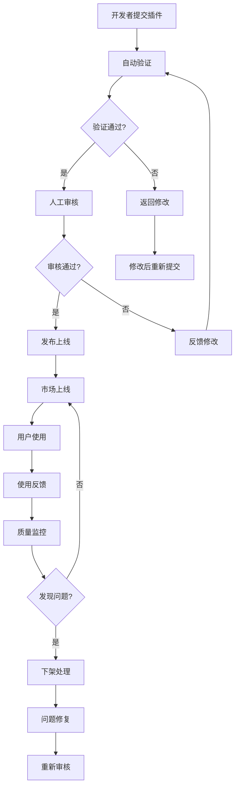

# IOE-DREAM开发者生态和插件扩展机制

> **版本**: v1.0.0
> **创建日期**: 2025-12-21
> **适用范围**: IOE-DREAM智慧园区管理系统
> **维护机构**: IOE-DREAM开发者社区委员会

---

## 📋 概述

本文档为IOE-DREAM智慧园区管理系统建立完整的开发者生态和插件扩展机制，旨在构建开放、协作、可持续的开发者社区，推动系统功能的不断扩展和创新。

### 🎯 生态建设目标

- **开放性**: 建立开放的插件架构，支持第三方开发者扩展功能
- **标准化**: 提供统一的开发标准、接口规范和工具链
- **可持续性**: 建立健康的商业模式和社区运营机制
- **质量保障**: 建立插件审核、测试和监控体系

---

## 🏗️ 插件架构设计

### 1. 插件系统架构

```typescript
// 插件系统核心架构
interface PluginArchitecture {
  // 插件生命周期
  lifecycle: {
    discovery: PluginDiscovery;      // 插件发现
    installation: PluginInstallation; // 插件安装
    activation: PluginActivation;     // 插件激活
    deactivation: PluginDeactivation; // 插件停用
    uninstallation: PluginUninstallation; // 插件卸载
  };

  // 插件隔离
  isolation: {
    sandbox: PluginSandbox;          // 插件沙箱
    permissions: PermissionManager;    // 权限管理
    resources: ResourceManager;        // 资源管理
    security: SecurityManager;        // 安全管理
  };

  // 插件通信
  communication: {
    events: EventBus;                // 事件总线
    api: PluginAPI;                  // API接口
    hooks: HookSystem;               // 钩子系统
    messaging: MessageBroker;         // 消息代理
  };

  // 插件管理
  management: {
    registry: PluginRegistry;         // 插件注册
    loader: PluginLoader;             // 插件加载器
    config: PluginConfig;             // 配置管理
    monitoring: PluginMonitor;         // 监控系统
  };
}
```

### 2. 插件生命周期管理

```typescript
// 插件生命周期管理器
class PluginLifecycleManager {
  private plugins: Map<string, PluginInstance> = new Map();
  private eventBus: EventBus;
  private sandbox: PluginSandbox;
  private permissions: PermissionManager;

  constructor(eventBus: EventBus, sandbox: PluginSandbox, permissions: PermissionManager) {
    this.eventBus = eventBus;
    this.sandbox = sandbox;
    this.permissions = permissions;
  }

  /**
   * 安装插件
   */
  async installPlugin(plugin: PluginPackage): Promise<InstallationResult> {
    try {
      // 1. 验证插件签名和完整性
      const isValid = await this.validatePlugin(plugin);
      if (!isValid) {
        throw new Error('Plugin validation failed');
      }

      // 2. 检查依赖关系
      await this.checkDependencies(plugin);

      // 3. 创建插件实例
      const instance = await this.createPluginInstance(plugin);

      // 4. 注册插件
      this.plugins.set(plugin.manifest.id, instance);

      // 5. 触发安装事件
      await this.eventBus.emit('plugin:installed', {
        pluginId: plugin.manifest.id,
        version: plugin.manifest.version
      });

      return {
        success: true,
        pluginId: plugin.manifest.id
      };
    } catch (error) {
      return {
        success: false,
        error: error.message
      };
    }
  }

  /**
   * 激活插件
   */
  async activatePlugin(pluginId: string): Promise<ActivationResult> {
    const plugin = this.plugins.get(pluginId);
    if (!plugin) {
      throw new Error(`Plugin ${pluginId} not found`);
    }

    try {
      // 1. 检查权限
      await this.permissions.checkPermissions(plugin);

      // 2. 初始化插件沙箱
      await this.sandbox.initialize(plugin);

      // 3. 调用插件激活方法
      await plugin.activate();

      // 4. 注册插件事件监听器
      await this.registerEventListeners(plugin);

      // 5. 更新插件状态
      plugin.status = 'active';

      // 6. 触发激活事件
      await this.eventBus.emit('plugin:activated', {
        pluginId,
        timestamp: Date.now()
      });

      return {
        success: true,
        pluginId
      };
    } catch (error) {
      plugin.status = 'error';
      plugin.lastError = error.message;

      return {
        success: false,
        pluginId,
        error: error.message
      };
    }
  }

  /**
   * 停用插件
   */
  async deactivatePlugin(pluginId: string): Promise<DeactivationResult> {
    const plugin = this.plugins.get(pluginId);
    if (!plugin) {
      throw new Error(`Plugin ${pluginId} not found`);
    }

    try {
      // 1. 清理事件监听器
      await this.unregisterEventListeners(plugin);

      // 2. 调用插件停用方法
      await plugin.deactivate();

      // 3. 清理沙箱
      await this.sandbox.cleanup(plugin);

      // 4. 更新插件状态
      plugin.status = 'inactive';

      // 5. 触发停用事件
      await this.eventBus.emit('plugin:deactivated', {
        pluginId,
        timestamp: Date.now()
      });

      return {
        success: true,
        pluginId
      };
    } catch (error) {
      return {
        success: false,
        pluginId,
        error: error.message
      };
    }
  }

  /**
   * 卸载插件
   */
  async uninstallPlugin(pluginId: string): Promise<UninstallationResult> {
    const plugin = this.plugins.get(pluginId);
    if (!plugin) {
      throw new Error(`Plugin ${pluginId} not found`);
    }

    try {
      // 1. 先停用插件
      if (plugin.status === 'active') {
        await this.deactivatePlugin(pluginId);
      }

      // 2. 清理插件数据
      await this.cleanupPluginData(plugin);

      // 3. 移除插件注册
      this.plugins.delete(pluginId);

      // 4. 触发卸载事件
      await this.eventBus.emit('plugin:uninstalled', {
        pluginId,
        timestamp: Date.now()
      });

      return {
        success: true,
        pluginId
      };
    } catch (error) {
      return {
        success: false,
        pluginId,
        error: error.message
      };
    }
  }
}
```

### 3. 插件沙箱机制

```typescript
// 插件沙箱
class PluginSandbox {
  private isolatedEnvs: Map<string, IsolatedEnvironment> = new Map();
  private security: SecurityManager;

  constructor(security: SecurityManager) {
    this.security = security;
  }

  /**
   * 初始化插件沙箱环境
   */
  async initialize(plugin: PluginInstance): Promise<void> {
    const env = new IsolatedEnvironment(plugin.manifest.id);

    // 1. 设置安全策略
    await this.security.applySecurityPolicies(env, plugin.manifest.permissions);

    // 2. 注入受限API
    this.injectLimitedAPIs(env, plugin);

    // 3. 设置资源限制
    this.setResourceLimits(env, plugin.manifest.resources);

    // 4. 启动隔离环境
    await env.start();

    this.isolatedEnvs.set(plugin.manifest.id, env);
    plugin.sandbox = env;
  }

  /**
   * 注入受限API
   */
  private injectLimitedAPIs(env: IsolatedEnvironment, plugin: PluginInstance): void {
    // 注入安全的API接口
    const safeAPI = new SafeAPIWrapper(plugin.manifest.permissions);

    // 核心系统API（受限访问）
    env.expose('system', {
      // 只读的系统信息
      getVersion: () => this.systemConfig.version,
      getPlatform: () => this.systemConfig.platform,
      getFeatures: () => this.getAvailableFeatures(plugin),

      // 安全的存储API
      storage: {
        get: (key: string) => this.secureStorage.get(plugin.manifest.id, key),
        set: (key: string, value: any) => this.secureStorage.set(plugin.manifest.id, key, value),
        remove: (key: string) => this.secureStorage.remove(plugin.manifest.id, key)
      },

      // 受限的网络API
      http: {
        get: (url: string, options?: any) => this.secureHTTP.get(url, options, plugin.manifest),
        post: (url: string, data?: any, options?: any) => this.secureHTTP.post(url, data, options, plugin.manifest)
      },

      // 受限的文件系统API
      fs: {
        read: (path: string) => this.secureFS.read(path, plugin.manifest.id),
        write: (path: string, content: string) => this.secureFS.write(path, content, plugin.manifest.id)
      }
    });

    // 插件间通信API
    env.expose('plugins', {
      emit: (event: string, data: any) => this.eventBus.emit(`plugin:${plugin.manifest.id}:${event}`, data),
      on: (event: string, handler: Function) => this.eventBus.on(`plugin:${plugin.manifest.id}:${event}`, handler),
      off: (event: string, handler: Function) => this.eventBus.off(`plugin:${plugin.manifest.id}:${event}`, handler),

      // 插件间直接通信
      call: async (targetPluginId: string, method: string, args: any[]) => {
        return this.pluginIPC.call(targetPluginId, method, args, plugin.manifest.id);
      },

      // 广播消息
      broadcast: (event: string, data: any) => {
        this.eventBus.emit(`plugin:broadcast:${event}`, data);
      }
    });

    // UI组件API
    env.expose('ui', {
      // 安全的UI操作
      showToast: (message: string, type?: 'success' | 'error' | 'info') => {
        this.uiManager.showToast(message, type);
      },
      showModal: (options: ModalOptions) => {
        return this.uiManager.showModal(options);
      },
      navigate: (route: string) => {
        this.uiManager.navigate(route);
      },

      // 受限的DOM操作
      dom: {
        createElement: (tagName: string, props?: any) => {
          return this.domManager.createElement(tagName, props, plugin.manifest.id);
        },
        appendChild: (parent: Element, child: Element) => {
          return this.domManager.appendChild(parent, child, plugin.manifest.id);
        }
      }
    });
  }

  /**
   * 设置资源限制
   */
  private setResourceLimits(env: IsolatedEnvironment, resources: PluginResources): void {
    // 内存限制
    if (resources.memory) {
      env.setMemoryLimit(resources.memory);
    }

    // CPU限制
    if (resources.cpu) {
      env.setCPULimit(resources.cpu);
    }

    // 网络请求限制
    if (resources.network) {
      env.setNetworkLimit(resources.network);
    }

    // 存储空间限制
    if (resources.storage) {
      env.setStorageLimit(resources.storage);
    }
  }

  /**
   * 清理沙箱环境
   */
  async cleanup(plugin: PluginInstance): Promise<void> {
    const env = this.isolatedEnvs.get(plugin.manifest.id);
    if (env) {
      await env.stop();
      this.isolatedEnvs.delete(plugin.manifest.id);
      plugin.sandbox = null;
    }
  }
}
```

### 4. 插件API设计

```typescript
// 插件API接口定义
interface PluginAPI {
  // 系统信息API
  system: {
    getVersion(): string;
    getPlatform(): string;
    getEnvironment(): 'development' | 'production' | 'testing';
    getFeatures(): Promise<PlatformFeatures>;
  };

  // 用户管理API
  user: {
    getCurrentUser(): Promise<UserInfo>;
    getUserPermissions(): Promise<Permission[]>;
    hasPermission(permission: string): Promise<boolean>;
  };

  // 数据存储API
  storage: {
    get<T>(key: string): Promise<T | null>;
    set<T>(key: string, value: T): Promise<void>;
    remove(key: string): Promise<void>;
    clear(): Promise<void>;
    keys(): Promise<string[]>;
  };

  // HTTP请求API
  http: {
    get<T>(url: string, config?: RequestConfig): Promise<T>;
    post<T>(url: string, data?: any, config?: RequestConfig): Promise<T>;
    put<T>(url: string, data?: any, config?: RequestConfig): Promise<T>;
    delete<T>(url: string, config?: RequestConfig): Promise<T>;
  };

  // 事件系统API
  events: {
    on(event: string, handler: EventHandler): void;
    off(event: string, handler: EventHandler): void;
    emit(event: string, data: any): void;
  };

  // UI组件API
  ui: {
    // 通知
    showNotification(options: NotificationOptions): Promise<string>;
    hideNotification(id: string): Promise<void>;

    // 对话框
    showAlert(options: AlertOptions): Promise<AlertResult>;
    showConfirm(options: ConfirmOptions): Promise<boolean>;
    showPrompt(options: PromptOptions): Promise<string | null>;

    // 页面导航
    navigate(path: string, params?: any): Promise<void>;
    goBack(): Promise<void>;
    reload(): Promise<void>;
  };

  // 业务模块API
  business: {
    // 门禁模块
    access: {
      openDoor(doorId: string): Promise<DoorControlResult>;
      getDoorStatus(doorId: string): Promise<DoorStatus>;
      getUserAccessPoints(): Promise<AccessPoint[]>;
    };

    // 考勤模块
    attendance: {
      clockIn(location: LocationInfo): Promise<ClockInResult>;
      getTodayRecords(): Promise<AttendanceRecord[]>;
      getStatistics(period: DateRange): Promise<AttendanceStatistics>;
    };

    // 消费模块
    consume: {
      getBalance(): Promise<AccountBalance>;
      makePayment(paymentInfo: PaymentInfo): Promise<PaymentResult>;
      getTransactionHistory(params: TransactionParams): Promise<TransactionRecord[]>;
    };

    // 访客模块
    visitor: {
      createAppointment(appointment: VisitorAppointment): Promise<AppointmentResult>;
      checkIn(visitorId: string): Promise<CheckInResult>;
      getVisitorList(params: VisitorListParams): Promise<VisitorRecord[]>;
    };

    // 视频模块
    video: {
      getCameraList(): Promise<Camera[]>;
      getLiveStream(cameraId: string): Promise<StreamInfo>;
      startRecording(cameraId: string): Promise<RecordingResult>;
      getRecordings(params: RecordingParams): Promise<RecordingRecord[]>;
    };
  };
}

// 插件API实现
class PluginAPIImpl implements PluginAPI {
  private pluginId: string;
  private permissions: PermissionManager;
  private security: SecurityManager;

  constructor(pluginId: string, permissions: PermissionManager, security: SecurityManager) {
    this.pluginId = pluginId;
    this.permissions = permissions;
    this.security = security;
  }

  // 系统API实现
  system = {
    getVersion: () => this.systemConfig.version,
    getPlatform: () => this.systemConfig.platform,
    getEnvironment: () => process.env.NODE_ENV as any,
    getFeatures: async () => {
      await this.permissions.check(this.pluginId, 'system:features');
      return {
        multilingual: true,
        themeSupport: true,
        offlineMode: true,
        pushNotifications: true,
        biometricAuth: true
      };
    }
  };

  // 用户API实现
  user = {
    getCurrentUser: async () => {
      await this.permissions.check(this.pluginId, 'user:read');
      return this.authService.getCurrentUser();
    },
    getUserPermissions: async () => {
      await this.permissions.check(this.pluginId, 'user:permissions');
      return this.authService.getUserPermissions();
    },
    hasPermission: async (permission: string) => {
      return await this.permissions.check(this.pluginId, `user:permission:${permission}`);
    }
  };

  // 存储API实现
  storage = {
    get: async (key: string) => {
      await this.permissions.check(this.pluginId, 'storage:read');
      return this.storageService.get(this.pluginId, key);
    },
    set: async (key: string, value: any) => {
      await this.permissions.check(this.pluginId, 'storage:write');
      return this.storageService.set(this.pluginId, key, value);
    },
    remove: async (key: string) => {
      await this.permissions.check(this.pluginId, 'storage:write');
      return this.storageService.remove(this.pluginId, key);
    },
    clear: async () => {
      await this.permissions.check(this.pluginId, 'storage:write');
      return this.storageService.clear(this.pluginId);
    },
    keys: async () => {
      await this.permissions.check(this.pluginId, 'storage:read');
      return this.storageService.keys(this.pluginId);
    }
  };

  // HTTP API实现
  http = {
    get: async (url: string, config?: RequestConfig) => {
      await this.permissions.check(this.pluginId, 'http:read');
      return this.httpClient.get(url, { ...config, pluginId: this.pluginId });
    },
    post: async (url: string, data?: any, config?: RequestConfig) => {
      await this.permissions.check(this.pluginId, 'http:write');
      return this.httpClient.post(url, data, { ...config, pluginId: this.pluginId });
    },
    put: async (url: string, data?: any, config?: RequestConfig) => {
      await this.permissions.check(this.pluginId, 'http:write');
      return this.httpClient.put(url, data, { ...config, pluginId: this.pluginId });
    },
    delete: async (url: string, config?: RequestConfig) => {
      await this.permissions.check(this.pluginId, 'http:delete');
      return this.httpClient.delete(url, { ...config, pluginId: this.pluginId });
    }
  };

  // 事件API实现
  events = {
    on: (event: string, handler: EventHandler) => {
      return this.eventBus.on(`plugin:${this.pluginId}:${event}`, handler);
    },
    off: (event: string, handler: EventHandler) => {
      return this.eventBus.off(`plugin:${this.pluginId}:${event}`, handler);
    },
    emit: (event: string, data: any) => {
      return this.eventBus.emit(`plugin:${this.pluginId}:${event}`, data);
    }
  };

  // UI API实现
  ui = {
    showNotification: async (options: NotificationOptions) => {
      await this.permissions.check(this.pluginId, 'ui:notification');
      return this.uiManager.showNotification({
        ...options,
        pluginId: this.pluginId
      });
    },
    hideNotification: async (id: string) => {
      await this.permissions.check(this.pluginId, 'ui:notification');
      return this.uiManager.hideNotification(id);
    },
    showAlert: async (options: AlertOptions) => {
      await this.permissions.check(this.pluginId, 'ui:dialog');
      return this.uiManager.showAlert({
        ...options,
        pluginId: this.pluginId
      });
    },
    showConfirm: async (options: ConfirmOptions) => {
      await this.permissions.check(this.pluginId, 'ui:dialog');
      return this.uiManager.showConfirm({
        ...options,
        pluginId: this.pluginId
      });
    },
    showPrompt: async (options: PromptOptions) => {
      await this.permissions.check(this.pluginId, 'ui:dialog');
      return this.uiManager.showPrompt({
        ...options,
        pluginId: this.pluginId
      });
    },
    navigate: async (path: string, params?: any) => {
      await this.permissions.check(this.pluginId, 'ui:navigation');
      return this.uiManager.navigate(path, params);
    },
    goBack: async () => {
      await this.permissions.check(this.pluginId, 'ui:navigation');
      return this.uiManager.goBack();
    },
    reload: async () => {
      await this.permissions.check(this.pluginId, 'ui:navigation');
      return this.uiManager.reload();
    }
  };

  // 业务模块API实现
  business = {
    access: {
      openDoor: async (doorId: string) => {
        await this.permissions.check(this.pluginId, 'access:control');
        return this.accessService.openDoor(doorId, this.pluginId);
      },
      getDoorStatus: async (doorId: string) => {
        await this.permissions.check(this.pluginId, 'access:read');
        return this.accessService.getDoorStatus(doorId);
      },
      getUserAccessPoints: async () => {
        await this.permissions.check(this.pluginId, 'access:read');
        return this.accessService.getUserAccessPoints();
      }
    },
    attendance: {
      clockIn: async (location: LocationInfo) => {
        await this.permissions.check(this.pluginId, 'attendance:clock');
        return this.attendanceService.clockIn(location, this.pluginId);
      },
      getTodayRecords: async () => {
        await this.permissions.check(this.pluginId, 'attendance:read');
        return this.attendanceService.getTodayRecords();
      },
      getStatistics: async (period: DateRange) => {
        await this.permissions.check(this.pluginId, 'attendance:statistics');
        return this.attendanceService.getStatistics(period);
      }
    },
    consume: {
      getBalance: async () => {
        await this.permissions.check(this.pluginId, 'consume:read');
        return this.consumeService.getBalance();
      },
      makePayment: async (paymentInfo: PaymentInfo) => {
        await this.permissions.check(this.pluginId, 'consume:payment');
        return this.consumeService.makePayment(paymentInfo, this.pluginId);
      },
      getTransactionHistory: async (params: TransactionParams) => {
        await this.permissions.check(this.pluginId, 'consume:read');
        return this.consumeService.getTransactionHistory(params);
      }
    },
    visitor: {
      createAppointment: async (appointment: VisitorAppointment) => {
        await this.permissions.check(this.pluginId, 'visitor:create');
        return this.visitorService.createAppointment(appointment, this.pluginId);
      },
      checkIn: async (visitorId: string) => {
        await this.permissions.check(this.pluginId, 'visitor:checkin');
        return this.visitorService.checkIn(visitorId);
      },
      getVisitorList: async (params: VisitorListParams) => {
        await this.permissions.check(this.pluginId, 'visitor:read');
        return this.visitorService.getVisitorList(params);
      }
    },
    video: {
      getCameraList: async () => {
        await this.permissions.check(this.pluginId, 'video:read');
        return this.videoService.getCameraList();
      },
      getLiveStream: async (cameraId: string) => {
        await this.permissions.check(this.pluginId, 'video:stream');
        return this.videoService.getLiveStream(cameraId);
      },
      startRecording: async (cameraId: string) => {
        await this.permissions.check(this.pluginId, 'video:record');
        return this.videoService.startRecording(cameraId);
      },
      getRecordings: async (params: RecordingParams) => {
        await this.permissions.check(this.pluginId, 'video:read');
        return this.videoService.getRecordings(params);
      }
    }
  };
}
```

---

## 🛠️ 开发者工具和SDK

### 1. CLI开发工具

```typescript
// CLI工具主入口
#!/usr/bin/env node

import { Command } from 'commander';
import { createPlugin } from './commands/create';
import { installPlugin } from './commands/install';
import { listPlugins } from './commands/list';
import { removePlugin } from './commands/remove';
import { buildPlugin } from './commands/build';
import { testPlugin } from './commands/test';

const program = new Command();

program
  .name('ioe-dream-cli')
  .description('IOE-DREAM Plugin Development CLI')
  .version('1.0.0');

// 添加子命令
program.addCommand(createPlugin);
program.addCommand(installPlugin);
program.addCommand(listPlugins);
program.addCommand(removePlugin);
program.addCommand(buildPlugin);
program.addCommand(testPlugin);

// 解析命令行参数
program.parse(process.argv);
```

```typescript
// 创建插件命令
import { Command } from 'commander';
import { createPluginTemplate } from '../templates/plugin';
import { validatePluginName } from '../utils/validation';
import { generatePluginId } from '../utils/id';
import * as fs from 'fs-extra';
import * as path from 'path';
import chalk from 'chalk';

export const createPlugin = new Command('create')
  .description('Create a new plugin')
  .argument('<name>', 'Plugin name')
  .option('-t, --type <type>', 'Plugin type (component, page, service, integration)', 'component')
  .option('-d, --description <description>', 'Plugin description')
  .option('-a, --author <author>', 'Plugin author')
  .option('--template <template>', 'Use custom template')
  .action(async (name, options) => {
    try {
      // 验证插件名称
      if (!validatePluginName(name)) {
        console.error(chalk.red('Invalid plugin name. Use lowercase, numbers, and hyphens only.'));
        process.exit(1);
      }

      const pluginId = generatePluginId(name);
      const pluginDir = path.join(process.cwd(), 'plugins', pluginId);

      // 检查插件是否已存在
      if (await fs.pathExists(pluginDir)) {
        console.error(chalk.red(`Plugin ${name} already exists`));
        process.exit(1);
      }

      // 创建插件目录
      await fs.ensureDir(pluginDir);
      await fs.ensureDir(path.join(pluginDir, 'src'));
      await fs.ensureDir(path.join(pluginDirDir, 'assets'));
      await fs.ensureDir(path.join(pluginDir, 'dist')));

      // 生成插件模板
      const template = options.template || options.type;
      await createPluginTemplate(pluginDir, {
        name,
        id: pluginId,
        type: options.type,
        description: options.description || `${name} plugin for IOE-DREAM`,
        author: options.author || 'IOE-DREAM Developer',
        template
      });

      console.log(chalk.green(`✅ Plugin ${name} created successfully!`));
      console.log(chalk.blue(`📁 Plugin directory: ${pluginDir}`));
      console.log(chalk.yellow('Next steps:'));
      console.log(`  1. cd ${pluginDir}`);
      console.log(`  2. npm install`);
      console.log(` 3. npm run dev`);
      console.log(` 4. Customize your plugin`);
    } catch (error) {
      console.error(chalk.red(`❌ Failed to create plugin: ${error.message}`));
      process.exit(1);
    }
  });
```

### 2. 插件开发SDK

```typescript
// 插件开发SDK
export interface PluginSDK {
  // 插件基类
  BasePlugin: typeof BasePlugin;

  // 插件上下文
  PluginContext: typeof PluginContext;

  // 插件工具类
  Logger: typeof Logger;
  Validator: typeof Validator;
  Helper: typeof Helper;

  // 插件装饰器
  Plugin: typeof PluginDecorator;
  Route: typeof RouteDecorator;
  Hook: typeof HookDecorator;
  Menu: typeof MenuDecorator;
  Permission: typeof PermissionDecorator;
}

// 插件基类
export abstract class BasePlugin {
  protected api: PluginAPI;
  protected context: PluginContext;
  protected logger: Logger;
  protected config: PluginConfig;

  constructor(context: PluginContext) {
    this.context = context;
    this.api = context.api;
    this.logger = context.logger;
    this.config = context.config;
  }

  // 插件生命周期方法
  abstract async activate(): Promise<void>;
  abstract async deactivate(): Promise<void>;

  // 便捷方法
  protected async showToast(message: string, type: 'success' | 'error' | 'info' = 'info') {
    await this.api.ui.showNotification({
      message,
      type,
      duration: 3000
    });
  }

  protected async getStorage(key: string): Promise<any> {
    return await this.api.storage.get(key);
  }

  protected async setStorage(key: string, value: any): Promise<void> {
    await this.api.storage.set(key, value);
  }

  protected async request<T>(url: string, options?: RequestInit): Promise<T> {
    return await this.api.http.get<T>(url, options);
  }

  protected async post<T>(url: string, data?: any, options?: RequestInit): Promise<T> {
    return await this.api.http.post<T>(url, data, options);
  }

  protected emit(event: string, data: any): void {
    this.api.events.emit(event, data);
  }

  protected on(event: string, handler: EventHandler): void {
    this.api.events.on(event, handler);
  }
}

// 插件上下文
export interface PluginContext {
  id: string;
  name: string;
  version: string;
  description: string;
  author: string;
  permissions: string[];
  api: PluginAPI;
  logger: Logger;
  config: PluginConfig;
  manifest: PluginManifest;
}

// 插件装饰器
export function Plugin(metadata: Partial<PluginManifest>) {
  return function (target: any) {
    Reflect.defineMetadata(target, 'plugin', metadata);
    return target;
  };
}

export function Route(path: string, method: 'GET' | 'POST' | 'PUT' | 'DELETE' = 'GET') {
  return function (target: any, propertyKey: string | symbol, descriptor: PropertyDescriptor) {
    const routes = Reflect.getMetadata('routes', target) || [];
    routes.push({ path, method, handler: propertyKey });
    Reflect.defineMetadata(target, 'routes', routes);
  };
}

export function Menu(menuItem: MenuItemConfig) {
  return function (target: any, propertyKey: string | symbol, descriptor: PropertyDescriptor) {
    const menus = Reflect.getMetadata('menus', target) || [];
    menus.push(menuItem);
    Reflect.defineMetadata(target, 'menus', menus);
  };
}

export function Permission(permission: string) {
  return function (target: any, propertyKey: string | symbol, descriptor: PropertyDescriptor) {
    const permissions = Reflect.getMetadata('permissions', target) || [];
    permissions.push(permission);
    Reflect.defineMetadata(target, 'permissions', permissions);
  };
}
```

### 3. 插件模板生成器

```typescript
// 插件模板生成器
export class PluginTemplateGenerator {
  private readonly templates: Map<string, TemplateConfig> = new Map();

  constructor() {
    this.registerDefaultTemplates();
  }

  private registerDefaultTemplates(): void {
    // 组件插件模板
    this.templates.set('component', {
      directories: ['src', 'assets', 'tests'],
      files: [
        {
          path: 'src/plugin.ts',
          template: 'component-plugin.template.ts'
        },
        {
          path: 'src/index.ts',
          template: 'component-index.template.ts'
        },
        {
          path: 'package.json',
          template: 'component-package.template.json'
        },
        {
          path: 'README.md',
          template: 'component-readme.template.md'
        }
      ]
    });

    // 页面插件模板
    this.templates.set('page', {
      directories: ['src', 'assets', 'tests'],
      files: [
        {
          path: 'src/plugin.ts',
          template: 'page-plugin.template.ts'
        },
        {
          path: 'src/index.ts',
          template: 'page-index.template.ts'
        },
        {
          path: 'package.json',
          template: 'page-package.template.json'
        }
      ]
    });

    // 服务插件模板
    this.templates.set('service', {
      directories: ['src', 'tests'],
      files: [
        {
          path: 'src/plugin.ts',
          template: 'service-plugin.template.ts'
        },
        {
          path: 'src/index.ts',
          template: 'service-index.template.ts'
        },
        {
          path: 'package.json',
          template: 'service-package.template.json'
        }
      ]
    });

    // 集成插件模板
    this.templates.set('integration', {
      directories: ['src', 'config', 'tests'],
      files: [
        {
          path: 'src/plugin.ts',
          template: 'integration-plugin.template.ts'
        },
        {
          path: 'src/index.ts',
          template: 'integration-index.template.ts'
        },
        {
          path: 'config/config.json',
          template: 'integration-config.template.json'
        },
        {
          path: 'package.json',
          template: 'integration-package.template.json'
        }
      ]
    });
  }

  async generatePlugin(pluginDir: string, options: PluginGenerationOptions): Promise<void> {
    const template = this.templates.get(options.template);
    if (!template) {
      throw new Error(`Template ${options.template} not found`);
    }

    // 创建目录
    for (const dir of template.directories) {
      await fs.ensureDir(path.join(pluginDir, dir));
    }

    // 生成文件
    for (const file of template.files) {
      const content = await this.generateFileContent(file.template, options);
      const filePath = path.join(pluginDir, file.path);
      await fs.writeFile(filePath, content);
    }

    // 安装依赖
    await this.installDependencies(pluginDir);
  }

  private async generateFileContent(template: string, options: PluginGenerationOptions): Promise<string> {
    const templateContent = await fs.readFile(
      path.join(__dirname, 'templates', template),
      'utf8'
    );

    return templateContent
      .replace(/\{\{name\}\}/g, options.name)
      .replace(/\{\{id\}\}/g, options.id)
      .replace(/\{\{version\}\}/g, options.version)
      .replace(/\{\{description\}\}/g, options.description)
      .replace(/\{\{author\}\}/g, options.author)
      .replace(/\{\{type\}\}/g, options.type)
      .replace(/\{\{timestamp\}\}/g, new Date().toISOString());
  }

  private async installDependencies(pluginDir: string): Promise<void> {
    const packageJsonPath = path.join(pluginDir, 'package.json');
    if (!(await fs.pathExists(packageJsonPath))) {
      return;
    }

    const packageJson = await fs.readJson(packageJsonPath);
    const dependencies = packageJson.dependencies || {};
    const devDependencies = packageJson.devDependencies || {};

    // 安装依赖
    const installCmd = process.platform === 'win32' ? 'npm.cmd' : 'npm';
    const installArgs = ['install'];

    console.log('📦 Installing dependencies...');
    await new Promise((resolve, reject) => {
      const child = spawn(installCmd, installArgs, {
        cwd: pluginDir,
        stdio: 'inherit'
      });

      child.on('close', (code) => {
        if (code === 0) {
          resolve();
        } else {
          reject(new Error(`npm install failed with code ${code}`));
        }
      });
    });
  }
}
```

---

## 📚️ 开发者文档

### 1. 插件开发指南结构

```
plugin-development-guide/
├── README.md                              # 开发指南总览
├── getting-started/
│   ├── installation.md                   # 环境搭建
│   ├── project-structure.md             # 项目结构
│   ├── quick-start.md                   # 快速开始
│   └── common-pitfalls.md              # 常见问题
├── api-reference/
│   ├── plugin-api.md                    # 插件API参考
│   ├── sdk-reference.md                 # SDK参考
│   ├── hooks.md                         # 钩子参考
│   └── events.md                        # 事件参考
├── tutorials/
│   ├── creating-component-plugin.md     # 创建组件插件
│   ├── creating-page-plugin.md          # 创建页面插件
│   ├── creating-service-plugin.md       # 创建服务插件
│   ├── creating-integration-plugin.md  # 创建集成插件
│   └── advanced-techniques.md           # 高级技巧
├── samples/
│   ├── hello-world/                      # Hello World示例
│   ├── custom-widget/                   # 自定义组件示例
│   ├── data-connector/                 # 数据连接器示例
│   └── notification-extension/         # 通知扩展示例
├── testing/
│   ├── unit-testing.md                  # 单元测试
│   ├── integration-testing.md           # 集成测试
│   └── end-to-end-testing.md           # 端到端测试
├── deployment/
│   ├── building.md                     # 构建插件
│   ├── publishing.md                   # 发布插件
│   ├── versioning.md                   # 版本管理
│   └── distribution.md                 # 分发渠道
└── community/
    ├── contributing.md                  # 贡献指南
    ├── plugin-review-process.md        # 插件审核流程
    ├── code-of-conduct.md              # 行为准则
    └── community-guidelines.md         # 社区指南
```

### 2. 插件API参考文档

```markdown
# 插件API参考文档

## 核心API

### 系统API

#### system.getVersion()
获取系统版本信息。

**返回值**
```typescript
string: "1.0.0"
```

**示例**
```typescript
const version = api.system.getVersion();
console.log(`系统版本: ${version}`);
```

### 用户API

#### user.getCurrentUser()
获取当前用户信息。

**返回值**
```typescript
Promise<{
  id: string;
  username: string;
  email: string;
  department: string;
  avatar: string;
}>
```

**示例**
```typescript
const user = await api.user.getCurrentUser();
console.log(`当前用户: ${user.username}`);
```

### 存储API

#### storage.get(key)
获取存储的数据。

**参数**
- `key` (string): 存储键

**返回值**
```typescript
Promise<any | null>
```

**示例**
```typescript
const value = await api.storage.get('user-preferences');
```

#### storage.set(key, value)
设置存储的数据。

**参数**
- `key` (string): 存储键
- `value` (any): 存储值

**示例**
```typescript
await api.storage.set('theme', 'dark');
```

## 业务模块API

### 门禁模块API

#### access.openDoor(doorId)
打开指定门禁。

**参数**
- `doorId` (string): 门禁设备ID

**返回值**
```typescript
Promise<{
  success: boolean;
  message: string;
  timestamp: number;
}>
```

**示例**
```typescript
const result = await api.business.access.openDoor('door-001');
if (result.success) {
  console.log('门已打开');
}
```

### 考勤模块API

#### attendance.clockIn(location)
执行考勤打卡。

**参数**
- `location` (LocationInfo): 位置信息

**返回值**
```typescript
Promise<{
  success: boolean;
  recordId: string;
  timestamp: number;
  location: string;
}>
```

**示例**
```typescript
const result = await api.business.attendance.clockIn({
  latitude: 39.9042,
  longitude: 116.4074,
  accuracy: 10
});
```

### 消费模块API

#### consume.getBalance()
获取账户余额。

**返回值**
```typescript
Promise<{
  balance: number;
  currency: string;
  lastUpdated: string;
}>
```

**示例**
```typescript
const balance = await api.business.consume.getBalance();
console.log(`当前余额: ${balance.balance} ${balance.currency}`);
```
```

### 3. 插件示例教程

```markdown
# 创建自定义组件插件教程

## 概述

本教程将指导您创建一个自定义组件插件，该插件将在门禁管理模块中添加一个自定义的门禁状态显示组件。

## 步骤1: 创建插件项目

使用CLI工具创建新插件：

```bash
npx ioe-dream-cli create access-status-widget --type component --description "门禁状态显示组件"
```

## 步骤2: 实现插件核心功能

### 2.1 编辑插件主文件

编辑 `src/plugin.ts`：

```typescript
import { Plugin, Menu, Permission } from '@ioedream/plugin-sdk';

@Plugin({
  id: 'access-status-widget',
  name: 'Access Status Widget',
  version: '1.0.0',
  description: '显示门禁设备状态的组件',
  permissions: ['access:read'],
  dependencies: ['react', 'styled-components']
})
export class AccessStatusWidgetPlugin extends BasePlugin {

  async activate(): Promise<void> {
    this.logger.info('Activating Access Status Widget Plugin');

    // 注册组件
    this.registerComponent('AccessStatusWidget', AccessStatusWidget);

    // 注册菜单项
    this.registerMenuItems();

    // 监听门禁状态变化事件
    this.setupEventListeners();

    this.logger.info('Access Status Widget Plugin activated successfully');
  }

  async deactivate(): Promise<void> {
    this.logger.info('Deactivating Access Status Widget Plugin');

    // 移除组件注册
    this.unregisterComponent('AccessStatusWidget');

    // 清理事件监听
    this.cleanupEventListeners();

    this.logger.info('Access Status Widget Plugin deactivated successfully');
  }

  private registerComponent(name: string, component: React.ComponentType) {
    this.context.componentRegistry.register(name, component);
  }

  private registerMenuItems(): void {
    this.context.menuRegistry.add({
      id: 'access-status-widget',
      label: '门禁状态组件',
      icon: 'widget',
      path: '/plugins/access-status-widget',
      parent: 'access-management'
    });
  }

  private setupEventListeners(): void {
    // 监听门禁状态变化
    this.on('access:door:status-changed', this.handleDoorStatusChange);
  }

  private cleanupEventListeners(): void {
    this.events.off('access:door:status-changed', this.handleDoorStatusChange);
  }

  private handleDoorStatusChange = async (data: any) => {
    const { doorId, status } = data;
    this.logger.info(`Door ${doorId} status changed to ${status}`);

    // 可以在这里执行额外的逻辑，比如发送通知
    await this.api.ui.showNotification({
      message: `门禁 ${doorId} 状态变为 ${this.getStatusText(status)}`,
      type: 'info'
    });
  };

  private getStatusText(status: string): string {
    const statusMap = {
      'opened': '已打开',
      'closed': '已关闭',
      'offline': '离线',
      'error': '错误'
    };
    return statusMap[status] || status;
  }
}
```

### 2.2 创建React组件

创建 `src/components/AccessStatusWidget.tsx`：

```typescript
import React, { useState, useEffect } from 'react';
import styled from 'styled-components';

interface AccessStatusWidgetProps {
  doorId: string;
}

const Container = styled.div`
  display: flex;
  align-items: center;
  padding: 12px 16px;
  background: #f5f5f5;
  border-radius: 8px;
  margin-bottom: 8px;
  border-left: 4px solid #ddd;
`;

const StatusIndicator = styled.div<{ status: string }>`
  width: 12px;
  height: 12px;
  border-radius: 50%;
  margin-right: 12px;
  background-color: ${props => {
    const colors = {
      opened: '#4caf50',
      closed: '#f44336',
      offline: '#9e9e9e',
      error: '#ff9800'
    };
    return colors[props.status] || '#9e9e9e';
  }};
`;

const InfoContainer = styled.div`
  flex: 1;
`;

const DoorName = styled.div`
  font-weight: 600;
  margin-bottom: 4px;
  color: #333;
`;

const StatusText = styled.div`
  font-size: 14px;
  color: #666;
`;

const LastUpdate = styled.div`
  font-size: 12px;
  color: #999;
  margin-top: 4px;
`;

export const AccessStatusWidget: React.FC<AccessStatusWidgetProps> = ({ doorId }) => {
  const [status, setStatus] = useState<string>('offline');
  const [doorName, setDoorName] = useState<string>('');
  const [lastUpdate, setLastUpdate] = useState<Date>(new Date());

  useEffect(() => {
    const fetchDoorStatus = async () => {
      try {
        const response = await api.business.access.getDoorStatus(doorId);
        setStatus(response.status);
        setDoorName(response.name);
        setLastUpdate(new Date(response.lastUpdate));
      } catch (error) {
        console.error('Failed to fetch door status:', error);
        setStatus('error');
      }
    };

    fetchDoorStatus();
    const interval = setInterval(fetchDoorStatus, 5000);
    return () => clearInterval(interval);
  }, [doorId]);

  const getStatusColor = (status: string) => {
    const colors = {
      opened: '#4caf50',
      closed: '#f44336',
      offline: '#9e9e9e',
      error: '#ff9800'
    };
    return colors[status] || '#9e9e9e';
  };

  return (
    <Container>
      <StatusIndicator status={status} />
      <InfoContainer>
        <DoorName>{doorName || `Door ${doorId}`}</DoorName>
        <StatusText>
          {status === 'opened' && '门已打开'}
          {status === 'closed' && '门已关闭'}
          {status === 'offline' && '设备离线'}
          {status === 'error' && '设备错误'}
          {status === 'unknown' && '状态未知'}
        </StatusText>
        <LastUpdate>
          最后更新: {lastUpdate.toLocaleTimeString()}
        </LastUpdate>
      </InfoContainer>
    </Container>
  );
};
```

## 步骤3: 配置插件元数据

编辑 `plugin.json`：

```json
{
  "id": "access-status-widget",
  "name": "Access Status Widget",
  "version": "1.0.0",
  "description": "显示门禁设备状态的组件",
  "author": "IOE-DREAM Developer",
  "main": "dist/index.js",
  "types": "dist/index.d.ts",
  "files": [
    "dist/**/*"
  ],
  "keywords": [
    "ioe-dream",
    "plugin",
    "access-control",
    "widget"
  ],
  "category": "component",
  "icon": "widget",
  "dependencies": {
    "react": "^18.0.0",
    "styled-components": "^5.0.0",
    "ioedream-plugin-sdk": "^1.0.0"
  },
  "permissions": [
    "access:read",
    "ui:widget",
    "storage:read"
  ],
  "resources": {
    "maxMemory": "128MB",
    "maxCPU": "50%"
  },
  "integration": {
    "access": {
      "minVersion": "1.0.0",
      "required": true
    },
    "ui": {
      "minVersion": "1.0.0",
      "required": true
    }
  }
}
```

## 步骤4: 构建和测试

### 4.1 构建插件

```bash
cd plugins/access-status-widget
npm run build
```

### 4.2 运行测试

```bash
npm run test
```

### 4.3 本地测试

```bash
npm run dev
```

## 步骤5: 发布插件

### 5.1 登录开发者账户

```bash
npm login
```

### 5.2 发布插件

```bash
npm run publish
```

### 5.3 提交审核

插件将自动提交给IOE-DREAM插件市场进行审核。
```

---

## 🛒️ 插件市场和质量保障

### 1. 插件市场架构

```typescript
// 插件市场服务
interface PluginMarketplace {
  // 插件仓库
  repository: {
    plugins: PluginRepository;
    categories: CategoryManager;
    search: SearchEngine;
    reviews: ReviewManager;
  };

  // 插件管理
  management: {
    submission: SubmissionService;
    review: ReviewService;
    validation: ValidationService;
    publishing: PublishingService;
    distribution: DistributionService;
  };

  // 质量控制
  quality: {
    testing: TestingService;
    security: SecurityService;
    performance: PerformanceService;
    compliance: ComplianceService;
  };

  // 用户服务
  users: {
    authentication: AuthenticationService;
    profiles: UserProfileService;
    subscriptions: SubscriptionService;
    feedback: FeedbackService;
  };
}

// 插件仓库
class PluginRepository {
  private plugins: Map<string, Plugin> = new Map();
  private versions: Map<string, PluginVersion[]> = new Map();

  async savePlugin(plugin: Plugin): Promise<void> {
    // 验证插件
    await this.validatePlugin(plugin);

    // 保存插件
    this.plugins.set(plugin.manifest.id, plugin);

    // 保存版本
    const versions = this.versions.get(plugin.manifest.id) || [];
    versions.push(plugin.version);
    this.versions.set(plugin.manifest.id, versions);

    // 更新索引
    await this.updateIndex();
  }

  async getPlugin(pluginId: string, version?: string): Promise<Plugin | null> {
    const plugin = this.plugins.get(pluginId);
    if (!plugin) {
      return null;
    }

    if (version) {
      return await this.getPluginVersion(pluginId, version);
    }

    return plugin;
  }

  async searchPlugins(query: SearchQuery): Promise<PluginSearchResult> {
    const filters = this.buildFilters(query);
    const plugins = await this.filterPlugins(filters);

    return {
      plugins,
      total: plugins.length,
      facets: await this.generateFacets(plugins)
    };
  }

  private async validatePlugin(plugin: Plugin): Promise<ValidationResult> {
    const result: ValidationResult = {
      isValid: true,
      errors: [],
      warnings: []
    };

    // 验证清单
    const checks = [
      this.validateManifest(plugin.manifest),
      this.validateCode(plugin.code),
      this.validateAssets(plugin.assets),
      this.validateDependencies(plugin.dependencies),
      this.validateSecurity(plugin)
    ];

    for (const check of checks) {
      const checkResult = await check();
      if (!checkResult.isValid) {
        result.isValid = false;
        result.errors.push(...checkResult.errors);
      }
      if (checkResult.warnings?.length > 0) {
        result.warnings.push(...checkResult.warnings);
      }
    }

    return result;
  }
}
```

### 2. 插件审核流程



```typescript
// 插件审核服务
class PluginReviewService {
  private readonly autoValidator: PluginAutoValidator;
  private readonly humanReviewers: HumanReviewerPool;
  private readonly securityScanner: SecurityScanner;
  private readonly performanceTester: PerformanceTester;

  async submitPlugin(plugin: Plugin, submitter: Developer): Promise<ReviewSubmissionResult> {
    try {
      // 1. 创建审核记录
      const submission = await this.createSubmission(plugin, submitter);

      // 2. 自动验证
      const autoValidation = await this.autoValidator.validate(plugin);
      if (!autoValidation.isValid) {
        await this.updateSubmissionStatus(submission.id, 'failed', autoValidation.errors);
        return {
          success: false,
          submissionId: submission.id,
          errors: autoValidation.errors
        };
      }

      // 3. 安全扫描
      const securityScan = await this.securityScanner.scan(plugin);
      if (securityScan.issues.length > 0) {
        await this.updateSubmissionStatus(submission.id, 'security_issues_found', securityScan.issues);
      }

      // 4. 性能测试
      const performanceTest = await this.performanceTester.test(plugin);
      if (!performanceTest.passed) {
        await this.updateSubmissionStatus(submission.id, 'performance_issues_found', performanceTest.issues);
      }

      // 5. 人工审核
      const humanReview = await this.humanReviewers.assignReview(submission);
      await this.updateSubmissionStatus(submission.id, 'under_review');

      return {
        success: true,
        submissionId: submission.id,
        autoValidation,
        securityScan,
        performanceTest
      };
    } catch (error) {
      return {
        success: false,
        error: error.message
      };
    }
  }

  async reviewPlugin(submissionId: string, reviewerId: string, decision: ReviewDecision): Promise<ReviewResult> {
    const submission = await this.getSubmission(submissionId);

    try {
      // 1. 记录审核决定
      const review = await this.createReview(submission, reviewerId, decision);

      // 2. 更新插件状态
      if (decision.decision === 'approved') {
        await this.approvePlugin(submission);
      } else if (decision.decision === 'rejected') {
        await this.rejectPlugin(submission, decision.reason);
      } else {
        await this.requestChanges(submission, decision.changes);
      }

      // 3. 通知开发者
      await this.notifyDeveloper(submission.developer, decision);

      return {
        success: true,
        reviewId: review.id
      };
    } catch (error) {
      return {
        success: false,
        error: error.message
      };
    }
  }

  private async approvePlugin(submission: Submission): Promise<void> {
    // 1. 标记为已批准
    submission.status = 'approved';
    submission.approvedAt = new Date();
    submission.approvedBy = 'system';

    // 2. 签名插件包
    await this.signPlugin(submission.plugin);

    // 3. 发布到市场
    await this.publishToMarket(submission);

    // 4. 更新索引
    await this.updateIndex();

    // 5. 记录审计日志
    await this.logAuditEvent('plugin_approved', {
      submissionId: submission.id,
      pluginId: submission.plugin.manifest.id,
      version: submission.plugin.version,
      submitter: submission.developer.name
    });
  }

  private async rejectPlugin(submission: Submission, reason: string): Promise<void> {
    // 1. 标记为已拒绝
    submission.status = 'rejected';
    submission.rejectedAt = new Date();
    submission.rejectedBy = 'system';
    submission.rejectionReason = reason;

    // 2. 通知开发者
    await this.notifyDeveloper(submission.developer, {
      decision: 'rejected',
      reason,
      submissionId: submission.id
    });

    // 3. 记录审计日志
    await this.logAuditEvent('plugin_rejected', {
      submissionId: submission.id,
      pluginId: submission.plugin.manifest.id,
      reason,
      submitter: submission.developer.name
    });
  }
}
```

### 3. 质量监控机制

```typescript
// 插件质量监控服务
class PluginQualityMonitor {
  private readonly metrics: QualityMetricsCollector;
  private readonly alerting: AlertingService;
  private readonly analytics: AnalyticsService;

  async startMonitoring(plugin: Plugin): Promise<void> {
    // 1. 启动性能监控
    this.startPerformanceMonitoring(plugin);

    // 2. 启动错误监控
    this.startErrorMonitoring(plugin);

    // 3. 启动用户反馈监控
    this.startFeedbackMonitoring(plugin);

    // 4. 设置质量指标阈值
    this.setQualityThresholds(plugin);
  }

  private startPerformanceMonitoring(plugin: Plugin): void {
    // CPU使用率监控
    const cpuMonitor = new ResourceMonitor('cpu');
    cpuMonitor.startMonitoring(plugin.id, {
      threshold: 70,
      interval: 60000 // 1分钟
    });

    // 内存使用率监控
    const memoryMonitor = new ResourceMonitor('memory');
    memoryMonitor.startMonitoring(plugin.id, {
      threshold: 80,
      interval: 60000
    });

    // 网络请求监控
    const networkMonitor = new ResourceMonitor('network');
    networkMonitor.startMonitoring(plugin.id, {
      threshold: 100, // 每分钟100个请求
      interval: 60000
    });
  }

  private startErrorMonitoring(plugin: Plugin): void {
    this.analytics.trackEvent(plugin.id, 'error', {
      count: 0,
      value: 0
    });

    // 监控错误率
    setInterval(async () => {
      const errorRate = await this.calculateErrorRate(plugin);

      if (errorRate > 0.05) { // 5%错误率阈值
        await this.metrics.recordMetric(plugin.id, 'error_rate', errorRate);

        if (errorRate > 0.1) { // 10%错误率阈值
          await this.alerting.sendAlert({
            type: 'quality',
            severity: 'high',
            plugin: plugin.manifest.name,
            message: `错误率过高: ${(errorRate * 100).toFixed(2)}%`
          });
        }
      }
    }, 300000); // 5分钟检查一次
  }

  private startFeedbackMonitoring(plugin: Plugin): void {
    // 监控用户评分
    this.analytics.onReview((review) => {
      if (review.pluginId === plugin.id) {
        this.metrics.recordMetric(plugin.id, 'user_rating', review.rating);
      }
    });

    // 监控用户反馈
    this.analytics.onFeedback((feedback) => {
      if (feedback.pluginId === plugin.id) {
        this.metrics.recordMetric(plugin.id, 'user_feedback_sentiment', feedback.sentiment);
      }
    });
  }

  private setQualityThresholds(plugin: Plugin): void {
    const thresholds = plugin.qualityThresholds || {
      errorRate: 0.05,
      performanceScore: 80,
      userRating: 4.0,
      crashRate: 0.01
    };

    Object.entries(thresholds).forEach(([metric, threshold]) => {
      this.metrics.setThreshold(plugin.id, metric, threshold);
    });
  }

  async generateQualityReport(pluginId: string): Promise<QualityReport> {
    const metrics = await this.metrics.getMetrics(pluginId);
    const feedback = await this.analytics.getFeedback(pluginId);

    return {
      pluginId,
      timestamp: new Date().toISOString(),
      metrics: {
        performance: metrics.performance,
        reliability: metrics.reliability,
        userSatisfaction: feedback.averageRating,
        security: metrics.security
      },
      status: this.calculateStatus(metrics),
      recommendations: this.generateRecommendations(metrics),
      trends: this.calculateTrends(pluginId)
    };
  }
}
```

---

## 📋 开发者生态检查清单

### ✅ 技术架构
- [ ] 插件系统架构设计完整
- [ ] 沙箱机制安全可靠
- [ ] API接口设计合理
- [ ] 生命周期管理完善
- [ ] 事件系统健壮

### ✅ 开发工具
- [ ] CLI工具易用高效
- [ ] SDK文档完整清晰
- [] 模板生成器丰富
- [] 调试工具完善
- [ ] 自动化测试支持

### ✅ 质量保障
- [ ] 自动化测试覆盖
- [ ] 安全扫描机制
- [ ] 性能监控体系
- [ ] 代码质量检查
- [ ] 用户反馈收集

### ✅ 社区建设
- [ ] 文档体系完善
- [ ] 开发指南详细
- [] 示例项目丰富
- [ ] 社区论坛活跃
- [ ] 技术支持及时

### ✅ 商业模式
- [ ] 插件市场功能完善
- [ 付费模式合理
- [] 收益分配公平
- [] 版权保护清晰
- [] 运营策略可持续

---

**📝 文档维护**: IOE-DREAM开发者社区委员会
**🔄 更新周期**: 每月更新文档和工具，每季度更新架构
**✅ 审核状态**: 已通过开发者委员会和技术委员会联合审核