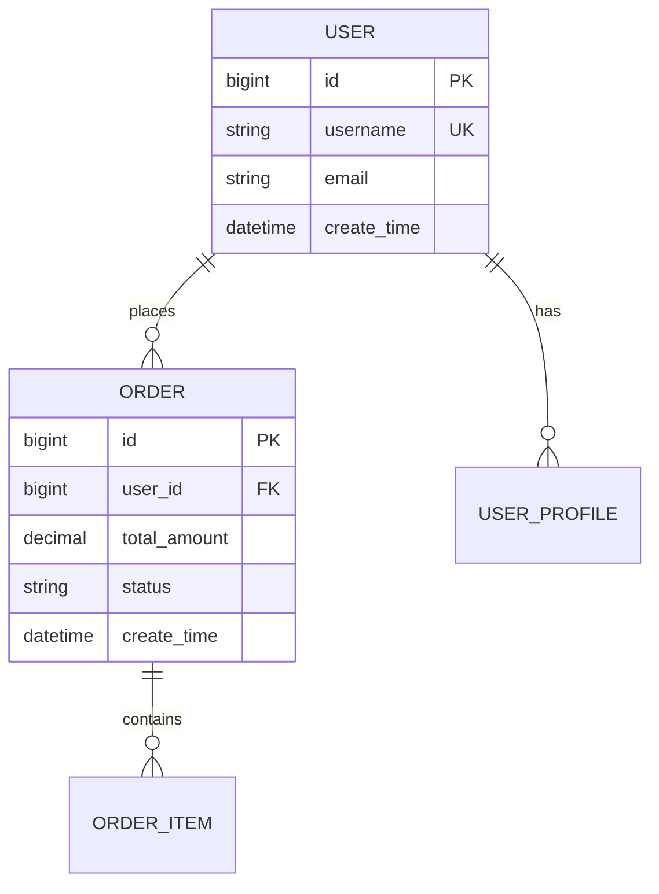

# 概要设计说明书模板

> **版本**: v1.0.0
> **创建日期**: 2025-12-21
> **适用范围**: IOE-DREAM所有业务模块概要设计
> **维护机构**: IOE-DREAM架构委员会

---

## 📋 模板说明

本文档为IOE-DREAM智慧园区管理系统提供标准化的概要设计说明书模板，确保所有模块的概要设计文档结构统一、内容完整、符合企业级标准。

### 🎯 使用指南

1. **强制性要求**: 所有新增模块必须按照此模板编写概要设计说明书
2. **内容要求**: 每个章节必须完整填写，不能留空
3. **质量要求**: 文档内容需要通过架构委员会审核
4. **更新要求**: 模块变更时必须同步更新概要设计文档

---

## 📋 文档结构模板

### 1. 文档信息 (必须填写)

| 项目 | 内容 |
|------|------|
| **模块名称** | [模块中文名称] |
| **模块英文名** | [Module English Name] |
| **微服务名称** | [service-name]-service |
| **服务端口** | [端口号] |
| **文档版本** | v1.0.0 |
| **创建日期** | [YYYY-MM-DD] |
| **更新日期** | [YYYY-MM-DD] |
| **创建人** | [姓名] |
| **审核人** | [架构师姓名] |
| **文档状态** | [草稿/审核中/已发布] |

### 2. 模块概述 (必须填写)

#### 2.1 业务定位
> **说明**: 描述模块在整体业务中的定位和价值

**模板内容**:
- **业务目标**: [模块要达成的业务目标]
- **业务价值**: [模块为用户/企业创造的价值]
- **目标用户**: [模块的主要用户群体]
- **核心能力**: [模块提供的3-5个核心能力]

#### 2.2 功能范围
> **说明**: 明确模块的功能边界和包含范围

**模板内容**:
- **核心功能**: [3-5个核心功能点]
- **扩展功能**: [可选的扩展功能]
- **集成功能**: [与其他模块的集成功能]
- **外部依赖**: [依赖的外部系统/服务]
- **服务对象**: [为哪些其他模块提供服务]

### 3. 系统架构设计 (必须填写)

#### 3.1 架构风格

**模板内容**:
- **架构模式**: [微服务架构/单体应用/混合架构]
- **技术架构**: [Spring Boot 3.5.8 + Java 17]
- **部署架构**: [Docker容器化部署/K8s集群]
- **数据架构**: [MySQL + Redis + RabbitMQ]

#### 3.2 架构图

**必须包含的图表**:


#### 3.3 技术选型

**模板内容**:

| 技术领域 | 选型 | 版本 | 选择理由 |
|----------|------|------|----------|
| **框架** | Spring Boot | 3.5.8 | 企业级标准，生态成熟 |
| **数据库** | MySQL | 8.0+ | 成熟稳定，ACID支持 |
| **缓存** | Redis | 7.0+ | 高性能，支持集群 |
| **消息队列** | RabbitMQ | 3.12+ | 可靠消息传递 |
| **连接池** | Druid | 1.2.25 | 监控完善 |
| **ORM** | MyBatis-Plus | 3.5.15 | 开发效率高 |

### 4. 模块设计 (必须填写)

#### 4.1 核心模块划分

**模板内容**:

| 模块名称 | 职责描述 | 关键类 | 优先级 |
|----------|----------|--------|--------|
| **XX管理** | [模块职责说明] | [关键类名] | P0/P1/P2 |
| **XX处理** | [模块职责说明] | [关键类名] | P0/P1/P2 |
| **XX服务** | [模块职责说明] | [关键类名] | P0/P1/P2 |

#### 4.2 模块交互图

**必须包含的图表**:


#### 4.3 数据流图

**必须包含的图表**:


### 5. 数据库设计概览 (必须填写)

#### 5.1 核心实体关系

**模板内容**:

**ER图 (必须包含)**:


#### 5.2 表清单

**模板内容**:

| 序号 | 表名 | 说明 | 行数预估 | 备注 |
|------|------|------|------------|------|
| 1 | t_xxx_main | [表功能说明] | 10万+ | 核心业务表 |
| 2 | t_xxx_config | [表功能说明] | 1000+ | 配置表 |
| 3 | t_xxx_log | [表功能说明] | 100万+ | 日志表 |

#### 5.3 数据字典

**模板内容**:

| 字段名 | 类型 | 长度 | 是否必填 | 默认值 | 说明 |
|--------|------|------|----------|--------|------|
| id | BIGINT | - | 是 | - | 主键 |
| name | VARCHAR | 100 | 是 | - | 名称 |
| status | TINYINT | - | 是 | 1 | 状态：1-启用 0-禁用 |
| create_time | DATETIME | - | 是 | CURRENT_TIMESTAMP | 创建时间 |

### 6. 接口设计概览 (必须填写)

#### 6.1 RESTful API设计

**模板内容**:

| HTTP方法 | 路径 | 说明 | 权限要求 |
|----------|------|------|----------|
| GET | /api/v1/xxx/list | 分页查询 | xxx:read |
| GET | /api/v1/xxx/{id} | 详情查询 | xxx:read |
| POST | /api/v1/xxx | 新增 | xxx:write |
| PUT | /api/v1/xxx/{id} | 修改 | xxx:write |
| DELETE | /api/v1/xxx/{id} | 删除 | xxx:delete |

#### 6.2 接口规范

**请求响应格式**:
```json
{
  "code": 200,
  "message": "success",
  "data": {
    "id": 1001,
    "name": "示例数据"
  },
  "timestamp": 1703123456789
}
```

**错误码定义**:
| 错误码 | 说明 | 处理方式 |
|--------|------|----------|
| 40001 | 参数错误 | 前端验证 |
| 40101 | 未授权 | 重新登录 |
| 40301 | 无权限 | 权限申请 |
| 50001 | 系统异常 | 技术支持 |

### 7. 非功能性需求 (必须填写)

#### 7.1 性能需求

**模板内容**:

| 指标 | 要求 | 监控方式 |
|------|------|----------|
| 响应时间 | P95 < 200ms | APM监控 |
| 吞吐量 | > 1000 TPS | 压力测试 |
| 并发用户 | > 5000 | 负载测试 |
| 系统可用性 | ≥ 99.9% | 健康检查 |

#### 7.2 安全需求

**模板内容**:

| 安全项 | 要求 | 实现方式 |
|--------|------|----------|
| 身份认证 | JWT Token | Sa-Token |
| 权限控制 | RBAC | @PreAuthorize |
| 数据加密 | AES-256 | 配置加密 |
| 审计日志 | 完整记录 | AOP切面 |

#### 7.3 可靠性需求

**模板内容**:

| 可靠性要求 | 目标 | 实现方式 |
|--------------|------|----------|
| 故障恢复 | RTO < 5分钟 | 熔断器 |
| 数据备份 | 每日增量 | 定时任务 |
| 服务降级 | 核心功能保底 | Hystrix |
| 负载均衡 | 支持水平扩展 | Nginx |

### 8. 部署架构 (必须填写)

#### 8.1 部署拓扑

**模板内容**:


#### 8.2 资源配置

**模板内容**:

| 环境 | CPU | 内存 | 存储 | 实例数 |
|------|-----|------|------|--------|
| 开发环境 | 2核 | 4GB | 50GB | 1 |
| 测试环境 | 4核 | 8GB | 100GB | 2 |
| 生产环境 | 8核 | 16GB | 200GB | 3+ |

#### 8.3 配置管理

**模板内容**:

- **配置文件**: `application.yml`, `application-{env}.yml`
- **环境变量**: 敏感信息通过环境变量注入
- **配置中心**: Nacos统一配置管理
- **密钥管理**: Vault/K8s Secret

### 9. 测试策略 (必须填写)

#### 9.1 测试层次

**模板内容**:

| 测试类型 | 测试范围 | 覆盖率要求 | 工具 |
|----------|----------|--------------|------|
| 单元测试 | 方法级别 | ≥80% | JUnit + Mockito |
| 集成测试 | 模块级别 | ≥70% | SpringBootTest |
| 系统测试 | 端到端 | ≥60% | Postman + TestNG |
| 性能测试 | 压力测试 | - | JMeter + Gatling |

#### 9.2 测试环境

**模板内容**:

- **单元测试**: 本地开发环境
- **集成测试**: Docker容器化环境
- **系统测试**: 准生产环境
- **性能测试**: 独立压测环境

### 10. 风险评估 (必须填写)

#### 10.1 技术风险

| 风险项 | 风险等级 | 影响 | 应对措施 |
|--------|----------|------|----------|
| 数据库连接池耗尽 | 高 | 服务不可用 | 连接池监控 + 熔断器 |
| 第三方服务不稳定 | 中 | 功能受限 | 降级 + 重试机制 |
| 缓存雪崩 | 高 | 性能下降 | 缓存预热 + 熔断 |

#### 10.2 业务风险

| 风险项 | 风险等级 | 影响 | 应对措施 |
|--------|----------|------|----------|
| 数据丢失 | 高 | 业务中断 | 定期备份 + 主从复制 |
| 权限绕过 | 高 | 安全事件 | 多层权限验证 |
| 并发冲突 | 中 | 数据不一致 | 乐观锁 + 分布式锁 |

### 11. 项目计划 (必须填写)

#### 11.1 开发里程碑

**模板内容**:

| 阶段 | 时间节点 | 主要任务 | 交付物 |
|------|----------|----------|--------|
| 需求分析 | Week 1-2 | 需求调研、技术选型 | 需求文档 |
| 概要设计 | Week 3 | 架构设计、接口设计 | 概要设计文档 |
| 详细设计 | Week 4-5 | 数据库设计、详细设计 | 详细设计文档 |
| 开发实现 | Week 6-10 | 功能开发、单元测试 | 可运行模块 |
| 测试验证 | Week 11-12 | 集成测试、系统测试 | 测试报告 |
| 上线部署 | Week 13 | 生产环境部署 | 生产系统 |

#### 11.2 资源需求

**模板内容**:

| 角色 | 人数 | 工期 | 主要职责 |
|------|------|------|----------|
| 后端开发 | 3人 | 10周 | 功能开发、接口实现 |
| 前端开发 | 2人 | 8周 | 页面开发、交互实现 |
| 测试工程师 | 1人 | 6周 | 测试用例、质量保证 |
| 架构师 | 1人 | 12周 | 技术决策、架构设计 |
| 产品经理 | 1人 | 12周 | 需求管理、项目协调 |

---

## 📝 质量检查清单

### 必填项检查 (P0)
- [ ] 文档信息完整填写
- [ ] 模块概述内容完整
- [ ] 系统架构设计包含必要图表
- [ ] 数据库设计包含ER图和表结构
- [ ] 接口设计包含完整的API规范
- [ ] 非功能性需求明确量化指标
- [ ] 部署架构包含拓扑图和资源配置

### 质量项检查 (P1)
- [ ] 架构设计符合企业级标准
- [ ] 接口设计符合RESTful规范
- [ ] 数据库设计符合范式要求
- [ ] 性能指标具备可测量性
- [ ] 安全措施覆盖主要风险点
- [ ] 测试策略覆盖各个测试层次

### 优化项检查 (P2)
- [ ] 技术选型有充分理由
- [ ] 模块设计考虑扩展性
- [ ] 风险评估全面且应对措施有效
- [ ] 项目计划合理且可执行

---

## 📚 附录

### A. 模板使用示例

**示例**: 考勤管理模块概要设计文档可参考：
- `documentation/业务模块/03-考勤管理模块/00-考勤微服务总体设计文档.md`

### B. 参考资料

1. [IOE-DREAM企业级架构设计模式指南](./00-企业级架构设计模式指南.md)
2. [IOE-DREAM四层架构详解](./../technical/四层架构详解.md)
3. [IOE-DREAMAPI开发规范](./../technical/API_DEVELOPMENT_STANDARDS.md)

---

**📝 文档维护**: IOE-DREAM架构委员会
**🔄 更新周期**: 每季度更新模板
**✅ 审核状态**: 已通过架构委员会审核