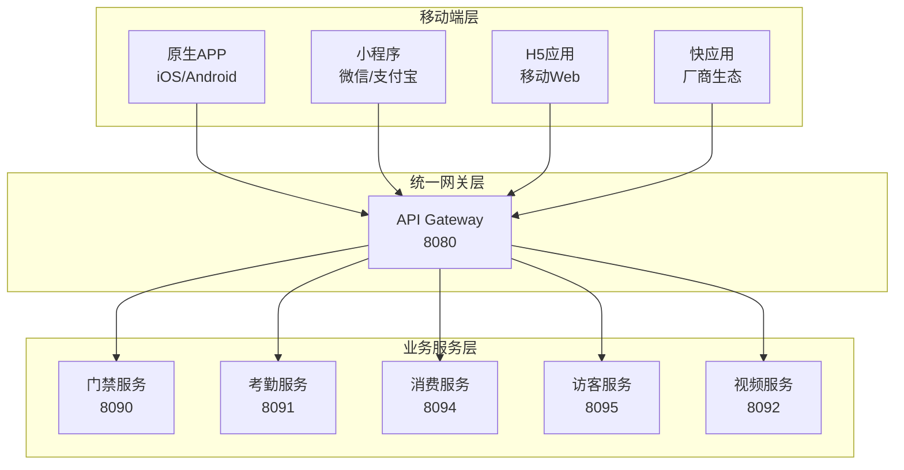

# IOE-DREAM移动端集成设计文档

> **版本**: v1.0.0
> **创建日期**: 2025-12-21
> **适用范围**: IOE-DREAM智慧园区管理系统移动端集成
> **维护机构**: IOE-DREAM架构委员会

---

## 📋 文档概述

本文档为IOE-DREAM智慧园区管理系统提供完整的移动端集成设计方案，涵盖移动APP、小程序、H5应用等多种移动端形态的集成标准、技术实现和最佳实践。

### 🎯 设计目标

- **统一体验**: 确保多端用户体验一致性
- **高性能**: 优化移动端性能，提升用户体验
- **易集成**: 标准化集成流程，降低开发成本
- **可扩展**: 支持未来新业务模块快速集成

### 📱 移动端架构概览



---

## 🏗️ 移动端技术架构

### 1. 技术栈选择

#### 1.1 原生APP开发

| 平台 | 技术栈 | 版本要求 | 选择理由 |
|------|--------|----------|----------|
| **iOS** | Swift | 5.7+ | 性能最优，原生体验最佳 |
| **Android** | Kotlin | 1.8+ | 现代化语言，Google官方推荐 |
| **跨平台** | React Native | 0.72+ | 代码复用率高，生态成熟 |
| **跨平台** | Flutter | 3.16+ | 高性能，Google支持 |

#### 1.2 小程序开发

| 平台 | 技术栈 | 版本要求 | 特色功能 |
|------|--------|----------|----------|
| **微信小程序** | 原生框架 | 3.0+ | 生态完善，用户基数大 |
| **支付宝小程序** | 原生框架 | 2.0+ | 支付场景优势 |
| **抖音小程序** | 原生框架 | 1.0+ | 年轻用户群体 |
| **百度小程序** | 原生框架 | 3.0+ | AI技术集成 |

#### 1.3 H5应用开发

```typescript
// 统一H5技术栈
{
  "framework": "Vue 3.4",
  "buildTool": "Vite 5.0",
  "uiLibrary": "Vant 4.0",
  "stateManagement": "Pinia 2.0",
  "router": "Vue Router 4.0",
  "httpClient": "Axios 1.6",
  "typescript": "5.0"
}
```

### 2. 统一移动端SDK设计

#### 2.1 SDK架构设计

```typescript
// IOE-DREAM Mobile SDK 架构
interface IOEDreamMobileSDK {
  // 核心模块
  auth: AuthModule;           // 认证模块
  api: ApiModule;             // API调用模块
  storage: StorageModule;     // 存储模块
  device: DeviceModule;       // 设备信息模块

  // 业务模块
  access: AccessModule;       // 门禁模块
  attendance: AttendanceModule; // 考勤模块
  consume: ConsumeModule;     // 消费模块
  visitor: VisitorModule;     // 访客模块
  video: VideoModule;         // 视频模块

  // 工具模块
  utils: UtilsModule;         // 工具函数
  biometric: BiometricModule; // 生物识别
  location: LocationModule;   // 位置服务
  notification: NotificationModule; // 通知推送
}
```

#### 2.2 SDK初始化配置

```typescript
// SDK初始化配置
import { IOEDreamSDK } from '@ioedream/mobile-sdk';

const sdkConfig = {
  // 基础配置
  baseUrl: 'https://api.ioedream.com',
  appId: 'your-app-id',
  appSecret: 'your-app-secret',

  // 环境配置
  environment: 'production', // development | staging | production

  // 模块配置
  modules: {
    auth: {
      loginType: ['password', 'biometric', 'sso'],
      tokenExpireTime: 7 * 24 * 60 * 60 * 1000, // 7天
      refreshTokenEnabled: true
    },

    biometric: {
      supportedTypes: ['fingerprint', 'face', 'voice'],
      encryptionEnabled: true,
      localAuthEnabled: true
    },

    location: {
      accuracy: 'high',
      updateInterval: 30000,
      backgroundEnabled: true
    },

    notification: {
      pushEnabled: true,
      soundEnabled: true,
      vibrateEnabled: true
    }
  }
};

// 初始化SDK
const sdk = new IOEDreamSDK(sdkConfig);
await sdk.init();
```

---

## 📱 各业务模块移动端集成方案

### 1. 门禁管理模块移动端集成

#### 1.1 移动端功能清单

| 功能类别 | 功能点 | 技术实现 | 优先级 |
|----------|--------|----------|--------|
| **基础功能** | 二维码开门 | Canvas生成QR码 | P0 |
| **基础功能** | NFC开门 | Android NFC API | P0 |
| **基础功能** | 蓝牙开门 | BLE Central模式 | P0 |
| **高级功能** | 人脸识别开门 | TensorFlow Lite | P1 |
| **高级功能** | 远程开门 | WebSocket实时通信 | P1 |
| **辅助功能** | 开门记录查询 | REST API | P1 |
| **辅助功能** | 权限申请审批 | 工作流引擎 | P2 |

#### 1.2 二维码开门实现

```typescript
// 二维码开门实现
class QRCodeAccessService {
  private sdk: IOEDreamSDK;

  constructor(sdk: IOEDreamSDK) {
    this.sdk = sdk;
  }

  /**
   * 生成开门二维码
   */
  async generateAccessQRCode(): Promise<QRCodeResult> {
    const user = await this.sdk.auth.getCurrentUser();
    const timestamp = Date.now();
    const nonce = this.generateNonce();

    // 构建开门令牌
    const accessToken = {
      userId: user.id,
      timestamp,
      nonce,
      expireTime: timestamp + 5 * 60 * 1000, // 5分钟有效期
      signature: this.generateSignature(user.id, timestamp, nonce)
    };

    // 生成二维码
    const qrData = JSON.stringify(accessToken);
    const qrCode = await this.generateQRCode(qrData);

    return {
      qrCode,
      expireTime: accessToken.expireTime,
      accessAreas: await this.getUserAccessAreas(user.id)
    };
  }

  /**
   * 验证开门二维码
   */
  async verifyAccessQRCode(qrData: string): Promise<VerifyResult> {
    try {
      const token = JSON.parse(qrData);
      const now = Date.now();

      // 验证时效性
      if (now > token.expireTime) {
        return { valid: false, reason: '二维码已过期' };
      }

      // 验证签名
      const validSignature = this.verifySignature(token);
      if (!validSignature) {
        return { valid: false, reason: '二维码验证失败' };
      }

      // 验证用户权限
      const hasAccess = await this.checkUserAccess(token.userId);
      if (!hasAccess) {
        return { valid: false, reason: '无开门权限' };
      }

      return { valid: true, userId: token.userId };
    } catch (error) {
      return { valid: false, reason: '二维码格式错误' };
    }
  }
}
```

#### 1.3 NFC开门实现

```java
// Android NFC开门实现
public class NFCAccessManager {
    private NfcAdapter nfcAdapter;
    private IOEDreamSDK sdk;

    public void enableNFCAccess() {
        // 启用NFC前台调度
        IntentFilter intentFilter = new IntentFilter(NfcAdapter.ACTION_NDEF_DISCOVERED);
        IntentFilter[] filters = {intentFilter};
        String[][] techLists = {{Ndef.class.getName()}};

        PendingIntent pendingIntent = PendingIntent.getActivity(
            context, 0, new Intent(context, getClass())
                .addFlags(Intent.FLAG_ACTIVITY_SINGLE_TOP), 0
        );

        nfcAdapter.enableForegroundDispatch(activity, pendingIntent, filters, techLists);
    }

    @Override
    protected void onNewIntent(Intent intent) {
        super.onNewIntent(intent);

        if (NfcAdapter.ACTION_NDEF_DISCOVERED.equals(intent.getAction())) {
            Parcelable[] rawMessages = intent.getParcelableArrayExtra(NfcAdapter.EXTRA_NDEF_MESSAGES);

            if (rawMessages != null) {
                NdefMessage[] messages = new NdefMessage[rawMessages.length];

                for (int i = 0; i < rawMessages.length; i++) {
                    messages[i] = (NdefMessage) rawMessages[i];
                }

                processNFCMessage(messages[0]);
            }
        }
    }

    private void processNFCMessage(NdefMessage message) {
        NdefRecord record = message.getRecords()[0];
        String payload = new String(record.getPayload());

        // 解析NFC数据并验证
        verifyNFCAccess(payload);
    }
}
```

#### 1.4 人脸识别开门实现

```typescript
// TensorFlow Lite人脸识别实现
import * as tf from '@tensorflow/tfjs';
import '@tensorflow/tfjs-react-native';

class FaceRecognitionService {
  private model: tf.GraphModel;
  private faceDetector: any;

  async initialize() {
    // 加载人脸识别模型
    this.model = await tf.loadLayersModel('assets/models/face_recognition/model.json');
    this.faceDetector = await tf.loadLayersModel('assets/models/face_detection/model.json');
  }

  /**
   * 人脸注册
   */
  async registerFace(userId: string, faceImages: string[]): Promise<RegistrationResult> {
    try {
      const faceFeatures = [];

      for (const image of faceImages) {
        const feature = await this.extractFaceFeature(image);
        faceFeatures.push(feature);
      }

      // 计算平均特征向量
      const avgFeature = this.calculateAverageFeature(faceFeatures);

      // 上传到服务器
      const result = await this.sdk.api.post('/api/v1/biometric/face/register', {
        userId,
        faceFeature: Array.from(avgFeature.dataSync()),
        images: faceImages
      });

      return { success: true, faceId: result.data.faceId };
    } catch (error) {
      return { success: false, error: error.message };
    }
  }

  /**
   * 人脸识别开门
   */
  async recognizeFace(imageData: string): Promise<RecognitionResult> {
    try {
      // 检测人脸
      const faceDetection = await this.detectFace(imageData);
      if (!faceDetection.detected) {
        return { success: false, reason: '未检测到人脸' };
      }

      // 提取特征
      const faceFeature = await this.extractFaceFeature(imageData);

      // 与服务器特征比对
      const result = await this.sdk.api.post('/api/v1/biometric/face/recognize', {
        faceFeature: Array.from(faceFeature.dataSync()),
        confidenceThreshold: 0.8
      });

      return {
        success: true,
        userId: result.data.userId,
        confidence: result.data.confidence,
        accessGranted: result.data.accessGranted
      };
    } catch (error) {
      return { success: false, error: error.message };
    }
  }

  private async extractFaceFeature(imageData: string): Promise<tf.Tensor> {
    const image = tf.browser.fromPixels(imageData);
    const resized = tf.image.resizeBilinear(image, [112, 112]);
    const normalized = resized.div(255.0);
    const batched = normalized.expandDims(0);

    return this.model.predict(batched) as tf.Tensor;
  }
}
```

### 2. 考勤管理模块移动端集成

#### 2.1 移动端功能设计

| 功能模块 | 功能描述 | 技术实现 | 优先级 |
|----------|----------|----------|--------|
| **打卡功能** | GPS定位打卡 | 高德定位SDK | P0 |
| **打卡功能** | WiFi打卡 | 网络状态检测 | P0 |
| **打卡功能** | 人脸打卡 | 生物识别SDK | P0 |
| **考勤查询** | 今日考勤 | REST API | P1 |
| **考勤查询** | 历史记录 | 分页查询 | P1 |
| **考勤查询** | 考勤统计 | 图表展示 | P2 |
| **异常处理** | 外勤申请 | 工作流引擎 | P1 |
| **异常处理** | 补卡申请 | 审批流程 | P2 |

#### 2.2 GPS定位打卡实现

```typescript
// 高德定位SDK集成
import AMap from 'react-native-amap-geolocation';

class AttendanceLocationService {
  private sdk: IOEDreamSDK;
  private locationConfig: any;

  constructor(sdk: IOEDreamSDK) {
    this.sdk = sdk;
    this.locationConfig = {
      accuracy: 'HighAccuracy',
      interval: 10000,
      fastestInterval: 5000,
      distanceFilter: 10
    };
  }

  /**
   * 启动定位服务
   */
  async startLocationService(): Promise<LocationResult> {
    try {
      // 请求定位权限
      const hasPermission = await this.requestLocationPermission();
      if (!hasPermission) {
        throw new Error('定位权限被拒绝');
      }

      // 配置高德SDK
      AMap.init({
        ios: 'your-ios-key',
        android: 'your-android-key'
      });

      // 启动连续定位
      const locationResult = await new Promise((resolve, reject) => {
        AMap.startLocation(this.locationConfig, (location) => {
          resolve({
            latitude: location.latitude,
            longitude: location.longitude,
            accuracy: location.accuracy,
            timestamp: location.timestamp,
            address: location.address
          });
        }, (error) => {
          reject(new Error(error.info));
        });
      });

      return locationResult;
    } catch (error) {
      throw new Error(`定位服务启动失败: ${error.message}`);
    }
  }

  /**
   * 执行定位打卡
   */
  async clockInByLocation(): Promise<ClockInResult> {
    try {
      const location = await this.startLocationService();
      const user = await this.sdk.auth.getCurrentUser();

      // 验证打卡位置
      const isValidLocation = await this.validateClockInLocation(
        user.id,
        location.latitude,
        location.longitude
      );

      if (!isValidLocation.valid) {
        return {
          success: false,
          reason: isValidLocation.reason,
          suggestion: '请到指定位置打卡'
        };
      }

      // 提交打卡记录
      const clockInData = {
        userId: user.id,
        clockType: this.determineClockType(),
        location: {
          latitude: location.latitude,
          longitude: location.longitude,
          accuracy: location.accuracy,
          address: location.address
        },
        timestamp: Date.now(),
        deviceInfo: await this.getDeviceInfo()
      };

      const result = await this.sdk.api.post('/api/v1/attendance/clock-in', clockInData);

      return {
        success: true,
        clockInId: result.data.clockInId,
        clockTime: result.data.clockTime,
        location: location.address,
        workShift: result.data.workShift
      };
    } catch (error) {
      return {
        success: false,
        reason: error.message
      };
    }
  }

  /**
   * 验证打卡位置
   */
  private async validateClockInLocation(
    userId: string,
    latitude: number,
    longitude: number
  ): Promise<LocationValidationResult> {
    // 获取用户工作地点
    const workLocations = await this.sdk.api.get(`/api/v1/attendance/user/${userId}/work-locations`);

    for (const workLocation of workLocations.data) {
      const distance = this.calculateDistance(
        latitude, longitude,
        workLocation.latitude, workLocation.longitude
      );

      if (distance <= workLocation.allowedRadius) {
        return { valid: true, workLocation: workLocation.name };
      }
    }

    return { valid: false, reason: '当前位置不在打卡范围内' };
  }

  /**
   * 计算两点间距离（米）
   */
  private calculateDistance(lat1: number, lon1: number, lat2: number, lon2: number): number {
    const R = 6371e3; // 地球半径（米）
    const φ1 = lat1 * Math.PI / 180;
    const φ2 = lat2 * Math.PI / 180;
    const Δφ = (lat2 - lat1) * Math.PI / 180;
    const Δλ = (lon2 - lon1) * Math.PI / 180;

    const a = Math.sin(Δφ/2) * Math.sin(Δφ/2) +
              Math.cos(φ1) * Math.cos(φ2) *
              Math.sin(Δλ/2) * Math.sin(Δλ/2);
    const c = 2 * Math.atan2(Math.sqrt(a), Math.sqrt(1-a));

    return R * c;
  }
}
```

#### 2.3 人脸打卡实现

```typescript
// 人脸打卡服务
class AttendanceBiometricService {
  private faceRecognition: FaceRecognitionService;
  private sdk: IOEDreamSDK;

  constructor(sdk: IOEDreamSDK) {
    this.sdk = sdk;
    this.faceRecognition = new FaceRecognitionService();
  }

  /**
   * 人脸打卡
   */
  async clockInByFace(): Promise<ClockInResult> {
    try {
      // 检查相机权限
      const hasCameraPermission = await this.requestCameraPermission();
      if (!hasCameraPermission) {
        throw new Error('相机权限被拒绝');
      }

      // 启动相机进行人脸采集
      const faceImage = await this.captureFace();

      // 人脸识别
      const recognitionResult = await this.faceRecognition.recognizeFace(faceImage);

      if (!recognitionResult.success) {
        return {
          success: false,
          reason: recognitionResult.reason || '人脸识别失败'
        };
      }

      // 活体检测
      const livenessResult = await this.performLivenessDetection(faceImage);
      if (!livenessResult.isLive) {
        return {
          success: false,
          reason: '活体检测失败，请重新尝试'
        };
      }

      // 提交打卡记录
      const clockInData = {
        userId: recognitionResult.userId,
        clockType: this.determineClockType(),
        biometricData: {
          faceImage: faceImage,
          confidence: recognitionResult.confidence,
          livenessScore: livenessResult.score
        },
        timestamp: Date.now(),
        deviceInfo: await this.getDeviceInfo()
      };

      const result = await this.sdk.api.post('/api/v1/attendance/clock-in/biometric', clockInData);

      return {
        success: true,
        clockInId: result.data.clockInId,
        clockTime: result.data.clockTime,
        userName: result.data.userName,
        confidence: recognitionResult.confidence
      };
    } catch (error) {
      return {
        success: false,
        reason: error.message
      };
    }
  }

  /**
   * 活体检测
   */
  private async performLivenessDetection(faceImage: string): Promise<LivenessResult> {
    // 使用眨眼、张嘴等动作进行活体检测
    const livenessActions = ['blink', 'mouth_open', 'head_turn'];

    for (const action of livenessActions) {
      const prompt = this.getLivenessPrompt(action);
      await this.showLivenessPrompt(prompt);

      const actionImage = await this.captureFace();
      const isValidAction = await this.validateLivenessAction(actionImage, action);

      if (!isValidAction) {
        return { isLive: false, reason: `${action}动作检测失败` };
      }
    }

    return { isLive: true, score: 0.95 };
  }
}
```

### 3. 消费管理模块移动端集成

#### 3.1 移动端支付方案

| 支付方式 | 技术实现 | 安全等级 | 优先级 |
|----------|----------|----------|--------|
| **二维码支付** | 生成消费二维码 | 中 | P0 |
| **NFC支付** | Android Beam/Apple Pay | 高 | P0 |
| **人脸支付** | 3D人脸识别 | 高 | P1 |
| **密码支付** | 数字键盘输入 | 中 | P1 |
| **声波支付** | 超声波通信 | 低 | P2 |

#### 3.2 二维码支付实现

```typescript
// 消费支付二维码服务
class ConsumeQRCodeService {
  private sdk: IOEDreamSDK;

  constructor(sdk: IOEDreamSDK) {
    this.sdk = sdk;
  }

  /**
   * 生成消费二维码
   */
  async generateConsumeQRCode(amount?: number): Promise<ConsumeQRResult> {
    try {
      const user = await this.sdk.auth.getCurrentUser();
      const timestamp = Date.now();
      const nonce = this.generateNonce();

      // 构建消费令牌
      const consumeToken = {
        userId: user.id,
        amount: amount || 0, // 0表示金额由POS机确定
        timestamp,
        nonce,
        expireTime: timestamp + 3 * 60 * 1000, // 3分钟有效期
        signature: this.generateSignature(user.id, amount || 0, timestamp, nonce),
        deviceInfo: await this.getDeviceInfo()
      };

      // 生成二维码
      const qrData = JSON.stringify(consumeToken);
      const qrCode = await this.generateQRCode(qrData);

      return {
        qrCode,
        expireTime: consumeToken.expireTime,
        userName: user.userName,
        accountBalance: await this.getUserBalance(user.id)
      };
    } catch (error) {
      throw new Error(`生成消费二维码失败: ${error.message}`);
    }
  }

  /**
   * 处理消费结果
   */
  async handleConsumeResult(consumeId: string): Promise<ConsumeResult> {
    try {
      // 轮询查询消费结果
      const maxRetries = 10;
      const retryInterval = 1000;

      for (let i = 0; i < maxRetries; i++) {
        const result = await this.sdk.api.get(`/api/v1/consume/record/${consumeId}`);

        if (result.data.status === 'SUCCESS') {
          return {
            success: true,
            consumeId: result.data.consumeId,
            amount: result.data.amount,
            balance: result.data.balance,
            consumeTime: result.data.consumeTime,
            merchantName: result.data.merchantName
          };
        } else if (result.data.status === 'FAILED') {
          return {
            success: false,
            reason: result.data.errorMessage
          };
        }

        // 等待下一次查询
        await this.sleep(retryInterval);
      }

      return {
        success: false,
        reason: '消费结果查询超时'
      };
    } catch (error) {
      return {
        success: false,
        reason: error.message
      };
    }
  }

  /**
   * 获取用户余额
   */
  async getUserBalance(userId: string): Promise<BalanceInfo> {
    try {
      const result = await this.sdk.api.get(`/api/v1/consume/account/${userId}/balance`);
      return result.data;
    } catch (error) {
      throw new Error(`获取用户余额失败: ${error.message}`);
    }
  }
}
```

#### 3.3 离线支付机制

```typescript
// 离线支付服务
class OfflineConsumeService {
  private sdk: IOEDreamSDK;
  private offlineStorage: LocalStorage;

  constructor(sdk: IOEDreamSDK) {
    this.sdk = sdk;
    this.offlineStorage = new LocalStorage('offline_consume');
  }

  /**
   * 启用离线支付
   */
  async enableOfflinePayment(maxAmount: number = 100): Promise<void> {
    try {
      const user = await this.sdk.auth.getCurrentUser();

      // 获取离线支付令牌
      const offlineTokens = await this.sdk.api.post('/api/v1/consume/offline/tokens', {
        userId: user.id,
        maxAmount,
        tokenCount: 10 // 预获取10个离线令牌
      });

      // 存储离线令牌
      await this.offlineStorage.set('offline_tokens', offlineTokens.data.tokens);
      await this.offlineStorage.set('offline_enabled', true);
      await this.offlineStorage.set('offline_max_amount', maxAmount);

      // 启动网络状态监控
      this.startNetworkMonitoring();
    } catch (error) {
      throw new Error(`启用离线支付失败: ${error.message}`);
    }
  }

  /**
   * 执行离线支付
   */
  async performOfflineConsume(amount: number, merchantId: string): Promise<OfflineConsumeResult> {
    try {
      const tokens = await this.offlineStorage.get('offline_tokens');
      const maxAmount = await this.offlineStorage.get('offline_max_amount');

      // 验证金额限制
      if (amount > maxAmount) {
        throw new Error(`离线支付金额不能超过${maxAmount}元`);
      }

      if (tokens.length === 0) {
        throw new Error('离线支付令牌已用完，请连接网络获取');
      }

      // 使用离线令牌
      const token = tokens.pop();
      await this.offlineStorage.set('offline_tokens', tokens);

      // 生成离线消费记录
      const offlineRecord = {
        consumeId: this.generateOfflineConsumeId(),
        userId: await this.getCurrentUserId(),
        amount,
        merchantId,
        token,
        timestamp: Date.now(),
        status: 'PENDING_SYNC'
      };

      // 保存离线记录
      await this.saveOfflineRecord(offlineRecord);

      return {
        success: true,
        consumeId: offlineRecord.consumeId,
        amount,
        isOffline: true,
        tokensRemaining: tokens.length
      };
    } catch (error) {
      return {
        success: false,
        reason: error.message
      };
    }
  }

  /**
   * 同步离线记录
   */
  async syncOfflineRecords(): Promise<SyncResult> {
    try {
      const offlineRecords = await this.getPendingOfflineRecords();

      if (offlineRecords.length === 0) {
        return { success: true, syncedCount: 0 };
      }

      let successCount = 0;
      let failureCount = 0;

      for (const record of offlineRecords) {
        try {
          await this.sdk.api.post('/api/v1/consume/offline/sync', record);
          await this.markOfflineRecordAsSynced(record.consumeId);
          successCount++;
        } catch (error) {
          console.error(`同步离线记录失败: ${record.consumeId}`, error);
          failureCount++;
        }
      }

      return {
        success: failureCount === 0,
        syncedCount: successCount,
        failureCount: failureCount
      };
    } catch (error) {
      return {
        success: false,
        reason: error.message
      };
    }
  }

  /**
   * 网络状态监控
   */
  private startNetworkMonitoring(): void {
    NetInfo.addEventListener(state => {
      if (state.isConnected && state.isInternetReachable) {
        // 网络恢复时自动同步
        this.syncOfflineRecords();
      }
    });
  }
}
```

### 4. 访客管理模块移动端集成

#### 4.1 访客预约移动端实现

```typescript
// 访客预约服务
class VisitorAppointmentService {
  private sdk: IOEDreamSDK;

  constructor(sdk: IOEDreamSDK) {
    this.sdk = sdk;
  }

  /**
   * 创建访客预约
   */
  async createVisitorAppointment(appointmentData: VisitorAppointmentData): Promise<AppointmentResult> {
    try {
      const user = await this.sdk.auth.getCurrentUser();

      // 构建预约数据
      const appointment = {
        ...appointmentData,
        hostId: user.id,
        hostName: user.userName,
        appointmentTime: appointmentData.appointmentTime || Date.now(),
        status: 'PENDING_APPROVAL',
        createTime: Date.now()
      };

      // 提交预约申请
      const result = await this.sdk.api.post('/api/v1/visitor/appointment', appointment);

      return {
        success: true,
        appointmentId: result.data.appointmentId,
        status: result.data.status,
        qrCode: result.data.qrCode,
        approvalRequired: result.data.approvalRequired
      };
    } catch (error) {
      return {
        success: false,
        reason: error.message
      };
    }
  }

  /**
   * 访客自助登记
   */
  async visitorSelfRegistration(registrationData: VisitorRegistrationData): Promise<RegistrationResult> {
    try {
      // 身份证OCR识别
      const idCardInfo = await this.recognizeIdCard(registrationData.idCardImage);

      // 人脸比对
      const faceMatch = await this.compareFaceWithIdCard(
        registrationData.visitorPhoto,
        idCardInfo.photo
      );

      if (!faceMatch.isMatch) {
        return {
          success: false,
          reason: '人脸与身份证照片不匹配'
        };
      }

      // 构建访客信息
      const visitorInfo = {
        name: idCardInfo.name,
        idCardNumber: idCardInfo.idNumber,
        phone: registrationData.phone,
        visitPurpose: registrationData.visitPurpose,
        expectedArrivalTime: registrationData.expectedArrivalTime,
        hostId: registrationData.hostId,
        visitorPhoto: registrationData.visitorPhoto,
        faceFeature: faceMatch.faceFeature,
        registrationTime: Date.now(),
        source: 'SELF_SERVICE'
      };

      const result = await this.sdk.api.post('/api/v1/visitor/self-registration', visitorInfo);

      return {
        success: true,
        visitorId: result.data.visitorId,
        temporaryPass: result.data.temporaryPass,
        qrCode: result.data.qrCode,
        validUntil: result.data.validUntil
      };
    } catch (error) {
      return {
        success: false,
        reason: error.message
      };
    }
  }

  /**
   * 访客签到
   */
  async visitorCheckIn(visitorId: string, location: LocationInfo): Promise<CheckInResult> {
    try {
      // 位置验证
      const locationValid = await this.validateVisitorLocation(visitorId, location);
      if (!locationValid.valid) {
        return {
          success: false,
          reason: '当前位置不在访客区域内'
        };
      }

      const checkInData = {
        visitorId,
        checkInTime: Date.now(),
        location: {
          latitude: location.latitude,
          longitude: location.longitude,
          address: location.address
        },
        checkInType: 'MOBILE_APP'
      };

      const result = await this.sdk.api.post('/api/v1/visitor/check-in', checkInData);

      return {
        success: true,
        checkInId: result.data.checkInId,
        accessPass: result.data.accessPass,
        visitAreas: result.data.visitAreas,
        hostInfo: result.data.hostInfo
      };
    } catch (error) {
      return {
        success: false,
        reason: error.message
      };
    }
  }

  /**
   * 访客签出
   */
  async visitorCheckOut(visitorId: string): Promise<CheckOutResult> {
    try {
      const result = await this.sdk.api.post('/api/v1/visitor/check-out', {
        visitorId,
        checkOutTime: Date.now()
      });

      return {
        success: true,
        checkOutTime: result.data.checkOutTime,
        visitDuration: result.data.visitDuration,
        feedbackRequired: result.data.feedbackRequired
      };
    } catch (error) {
      return {
        success: false,
        reason: error.message
      };
    }
  }
}
```

### 5. 视频监控模块移动端集成

#### 5.1 实时视频播放实现

```typescript
// 视频监控服务
class VideoMonitorService {
  private sdk: IOEDreamSDK;
  private playerInstance: any;

  constructor(sdk: IOEDreamSDK) {
    this.sdk = sdk;
  }

  /**
   * 获取实时视频流
   */
  async getLiveVideoStream(cameraId: string): Promise<VideoStreamResult> {
    try {
      // 获取摄像头信息
      const cameraInfo = await this.sdk.api.get(`/api/v1/video/camera/${cameraId}`);

      // 获取流媒体地址
      const streamResult = await this.sdk.api.post('/api/v1/video/stream/live', {
        cameraId,
        protocol: 'HLS', // HLS, WebRTC, RTMP
        quality: 'HD', // HD, SD, FHD
        clientType: 'MOBILE'
      });

      return {
        success: true,
        streamUrl: streamResult.data.streamUrl,
        protocol: streamResult.data.protocol,
        quality: streamResult.data.quality,
        cameraInfo: cameraInfo.data
      };
    } catch (error) {
      return {
        success: false,
        reason: error.message
      };
    }
  }

  /**
   * 播放实时视频
   */
  async playLiveVideo(streamUrl: string, containerElement: HTMLElement): Promise<PlayerResult> {
    try {
      // 根据协议选择播放器
      const protocol = this.detectStreamProtocol(streamUrl);

      switch (protocol) {
        case 'HLS':
          return await this.playHLSStream(streamUrl, containerElement);
        case 'WebRTC':
          return await this.playWebRTCStream(streamUrl, containerElement);
        case 'RTMP':
          return await this.playRTMPStream(streamUrl, containerElement);
        default:
          throw new Error(`不支持的视频协议: ${protocol}`);
      }
    } catch (error) {
      return {
        success: false,
        reason: error.message
      };
    }
  }

  /**
   * HLS流播放
   */
  private async playHLSStream(streamUrl: string, containerElement: HTMLElement): Promise<PlayerResult> {
    // 使用Hls.js播放HLS流
    const Hls = await import('hls.js');

    if (Hls.isSupported()) {
      const hls = new Hls({
        enableWorker: true,
        lowLatencyMode: true,
        backBufferLength: 90
      });

      hls.loadSource(streamUrl);
      hls.attachMedia(containerElement);

      this.playerInstance = hls;

      return {
        success: true,
        player: hls,
        protocol: 'HLS'
      };
    } else if (containerElement.canPlayType('application/vnd.apple.mpegurl')) {
      // Safari原生支持HLS
      containerElement.src = streamUrl;

      return {
        success: true,
        player: containerElement,
        protocol: 'HLS'
      };
    } else {
      throw new Error('浏览器不支持HLS播放');
    }
  }

  /**
   * WebRTC实时播放
   */
  private async playWebRTCStream(streamUrl: string, containerElement: HTMLElement): Promise<PlayerResult> {
    const pc = new RTCPeerConnection({
      iceServers: [
        { urls: 'stun:stun.l.google.com:19302' }
      ]
    });

    // 设置视频流
    pc.ontrack = (event) => {
      containerElement.srcObject = event.streams[0];
    };

    // 连接到信令服务器
    const response = await fetch(streamUrl);
    const offer = await response.json();

    await pc.setRemoteDescription(new RTCSessionDescription(offer));

    const answer = await pc.createAnswer();
    await pc.setLocalDescription(answer);

    // 发送answer到信令服务器
    await fetch(streamUrl.replace('/offer', '/answer'), {
      method: 'POST',
      headers: {
        'Content-Type': 'application/json'
      },
      body: JSON.stringify(answer)
    });

    this.playerInstance = pc;

    return {
      success: true,
      player: pc,
      protocol: 'WebRTC'
    };
  }

  /**
   * 云台控制
   */
  async controlPTZ(cameraId: string, command: PTZCommand): Promise<ControlResult> {
    try {
      const result = await this.sdk.api.post(`/api/v1/video/camera/${cameraId}/ptz`, command);

      return {
        success: true,
        commandId: result.data.commandId,
        status: result.data.status
      };
    } catch (error) {
      return {
        success: false,
        reason: error.message
      };
    }
  }

  /**
   * 录像回放
   */
  async playbackVideo(cameraId: string, startTime: number, endTime: number): Promise<PlaybackResult> {
    try {
      const result = await this.sdk.api.post('/api/v1/video/playback', {
        cameraId,
        startTime,
        endTime,
        speed: 1.0, // 播放速度
        quality: 'HD'
      });

      return {
        success: true,
        playbackUrl: result.data.playbackUrl,
        duration: result.data.duration,
        fileSize: result.data.fileSize
      };
    } catch (error) {
      return {
        success: false,
        reason: error.message
      };
    }
  }
}
```

---

## 🔧 移动端开发工具和库

### 1. 推荐开发工具链

#### 1.1 React Native开发工具

```json
{
  "development": {
    "framework": "React Native 0.72+",
    "IDE": "VS Code / Android Studio / Xcode",
    "debugger": "React Native Debugger",
    "profiler": "Flipper",
    "bundler": "Metro"
  },
  "testing": {
    "unitTest": "Jest + React Native Testing Library",
    "e2eTest": "Detox / Appium",
    "performance": "Flipper Performance Monitor"
  },
  "build": {
    "ios": "Xcode + Fastlane",
    "android": "Android Studio + Gradle",
    "ci_cd": "GitHub Actions / Jenkins"
  }
}
```

#### 1.2 Flutter开发工具

```yaml
development:
  sdk: "Flutter 3.16+"
  ide: "VS Code / Android Studio"
  debugger: "Flutter DevTools"
  profiler: "Flutter Inspector"

testing:
  unit_test: "flutter_test"
  integration_test: "integration_test"
  widget_test: "flutter_test"

build:
  ios: "Xcode + Fastlane"
  android: "Android Studio + Gradle"
  web: "Flutter Web Build"
```

### 2. 第三方SDK集成

#### 2.1 地图定位SDK

```typescript
// 地图SDK配置
const mapSDKConfig = {
  // 高德地图
  amap: {
    iosKey: 'your-ios-key',
    androidKey: 'your-android-key',
    services: ['location', 'search', 'geocoding', 'navigation']
  },

  // 百度地图
  baidu: {
    iosKey: 'your-ios-key',
    androidKey: 'your-android-key',
    services: ['location', 'search', 'geocoding']
  },

  // 腾讯地图
  tencent: {
    key: 'your-tencent-key',
    services: ['location', 'search', 'geocoding']
  }
};
```

#### 2.2 推送SDK

```typescript
// 推送服务配置
const pushSDKConfig = {
  // 极光推送
  jpush: {
    appKey: 'your-app-key',
    channel: 'developer-default',
    production: false
  },

  // 个推
  getui: {
    appId: 'your-app-id',
    appKey: 'your-app-key',
    appSecret: 'your-app-secret'
  },

  // 华为推送
  huawei: {
    appId: 'your-app-id',
    appSecret: 'your-app-secret'
  }
};
```

#### 2.3 统计分析SDK

```typescript
// 数据统计配置
const analyticsConfig = {
  // 友盟统计
  umeng: {
    appKey: 'your-app-key',
    channel: 'app-store',
    enableCrashReport: true
  },

  // Firebase Analytics
  firebase: {
    config: 'firebase-config.json',
    enableAnalytics: true,
    enableCrashlytics: true
  },

  // 腾讯MTA
  mta: {
    appKey: 'your-app-key',
    channel: 'app-store',
    enableDebug: false
  }
};
```

---

## 📱 移动端UI/UX设计规范

### 1. 设计系统

#### 1.1 色彩规范

```typescript
// 主色调
const colors = {
  primary: {
    50: '#E3F2FD',
    100: '#BBDEFB',
    200: '#90CAF9',
    300: '#64B5F6',
    400: '#42A5F5',
    500: '#2196F3', // 主色
    600: '#1E88E5',
    700: '#1976D2',
    800: '#1565C0',
    900: '#0D47A1'
  },

  secondary: {
    50: '#F3E5F5',
    100: '#E1BEE7',
    200: '#CE93D8',
    300: '#BA68C8',
    400: '#AB47BC',
    500: '#9C27B0', // 辅助色
    600: '#8E24AA',
    700: '#7B1FA2',
    800: '#6A1B9A',
    900: '#4A148C'
  },

  neutral: {
    50: '#FAFAFA',
    100: '#F5F5F5',
    200: '#EEEEEE',
    300: '#E0E0E0',
    400: '#BDBDBD',
    500: '#9E9E9E',
    600: '#757575',
    700: '#616161',
    800: '#424242',
    900: '#212121'
  },

  semantic: {
    success: '#4CAF50',
    warning: '#FF9800',
    error: '#F44336',
    info: '#2196F3'
  }
};
```

#### 1.2 字体规范

```typescript
// 字体系统
const typography = {
  fontFamily: {
    primary: 'SF Pro Display', // iOS
    secondary: 'Roboto', // Android
    monospace: 'SF Mono'
  },

  fontSize: {
    xs: 12,
    sm: 14,
    base: 16,
    lg: 18,
    xl: 20,
    '2xl': 24,
    '3xl': 30,
    '4xl': 36
  },

  fontWeight: {
    light: '300',
    normal: '400',
    medium: '500',
    semibold: '600',
    bold: '700'
  },

  lineHeight: {
    tight: 1.25,
    normal: 1.5,
    relaxed: 1.75
  }
};
```

#### 1.3 间距规范

```typescript
// 间距系统
const spacing = {
  0: 0,
  1: 4,   // 0.25rem
  2: 8,   // 0.5rem
  3: 12,  // 0.75rem
  4: 16,  // 1rem
  5: 20,  // 1.25rem
  6: 24,  // 1.5rem
  8: 32,  // 2rem
  10: 40, // 2.5rem
  12: 48, // 3rem
  16: 64, // 4rem
  20: 80, // 5rem
  24: 96  // 6rem
};
```

### 2. 组件库设计

#### 2.1 基础组件

```typescript
// 按钮组件
interface ButtonProps {
  variant?: 'primary' | 'secondary' | 'outline' | 'text';
  size?: 'sm' | 'md' | 'lg';
  disabled?: boolean;
  loading?: boolean;
  icon?: ReactNode;
  fullWidth?: boolean;
  onPress: () => void;
  children: ReactNode;
}

// 输入框组件
interface InputProps {
  label?: string;
  placeholder?: string;
  value?: string;
  onChangeText: (text: string) => void;
  secureTextEntry?: boolean;
  error?: string;
  disabled?: boolean;
  leftIcon?: ReactNode;
  rightIcon?: ReactNode;
}

// 卡片组件
interface CardProps {
  title?: string;
  subtitle?: string;
  image?: string;
  actions?: ReactNode[];
  onPress?: () => void;
  children: ReactNode;
}
```

#### 2.2 业务组件

```typescript
// 用户信息卡片
interface UserProfileCardProps {
  user: {
    id: string;
    name: string;
    avatar: string;
    department: string;
    position: string;
  };
  showActions?: boolean;
  onEdit?: () => void;
  onMessage?: () => void;
}

// 考勤状态组件
interface AttendanceStatusProps {
  status: 'normal' | 'late' | 'early' | 'absent';
  checkInTime?: string;
  checkOutTime?: string;
  workShift: string;
  location?: string;
}

// 消费记录组件
interface ConsumeRecordProps {
  record: {
    id: string;
    amount: number;
    merchant: string;
    time: string;
    paymentMethod: string;
  };
  showDetails?: boolean;
}

// 门禁通行组件
interface AccessPassProps {
  qrCode: string;
  expireTime: number;
  userName: string;
  accessAreas: string[];
  onRefresh?: () => void;
}
```

---

## 🚀 移动端性能优化

### 1. 启动优化

#### 1.1 启动时间优化策略

```typescript
// 启动优化配置
const startupOptimization = {
  // 预加载模块
  preloadModules: [
    'auth',
    'biometric',
    'location'
  ],

  // 懒加载模块
  lazyLoadModules: [
    'video',
    'visitor',
    'consume'
  ],

  // 启动任务优先级
  startupTasks: {
    P0: ['auth_check', 'device_info', 'network_status'],
    P1: ['location_init', 'push_init', 'analytics_init'],
    P2: ['cache_sync', 'prefetch_data', 'update_check']
  }
};

// 启动任务调度器
class StartupTaskScheduler {
  private tasks: Map<string, StartupTask> = new Map();

  registerTask(name: string, task: StartupTask): void {
    this.tasks.set(name, task);
  }

  async executeTasks(priority: TaskPriority): Promise<void> {
    const priorityTasks = Array.from(this.tasks.entries())
      .filter(([_, task]) => task.priority === priority);

    await Promise.all(priorityTasks.map(([_, task]) => task.execute()));
  }

  async executeAllTasks(): Promise<void> {
    // 按优先级顺序执行
    await this.executeTasks('P0');
    await this.executeTasks('P1');
    await this.executeTasks('P2');
  }
}
```

#### 1.2 内存优化

```typescript
// 内存管理工具
class MemoryManager {
  private imageCache: LRUCache<string, any>;
  private dataCache: LRUCache<string, any>;

  constructor() {
    this.imageCache = new LRUCache({
      max: 100, // 最多缓存100张图片
      ttl: 1000 * 60 * 30 // 30分钟过期
    });

    this.dataCache = new LRUCache({
      max: 200, // 最多缓存200条数据
      ttl: 1000 * 60 * 60 // 1小时过期
    });
  }

  // 图片内存管理
  cacheImage(key: string, image: any): void {
    this.imageCache.set(key, image);
  }

  getImage(key: string): any {
    return this.imageCache.get(key);
  }

  clearImageCache(): void {
    this.imageCache.clear();
  }

  // 数据内存管理
  cacheData(key: string, data: any): void {
    this.dataCache.set(key, data);
  }

  getData(key: string): any {
    return this.dataCache.get(key);
  }

  clearDataCache(): void {
    this.dataCache.clear();
  }

  // 内存压力处理
  handleMemoryPressure(): void {
    // 清理一半缓存
    const imageKeys = Array.from(this.imageCache.keys());
    const dataKeys = Array.from(this.dataCache.keys());

    for (let i = 0; i < Math.ceil(imageKeys.length / 2); i++) {
      this.imageCache.delete(imageKeys[i]);
    }

    for (let i = 0; i < Math.ceil(dataKeys.length / 2); i++) {
      this.dataCache.delete(dataKeys[i]);
    }
  }
}
```

### 2. 网络优化

#### 2.1 请求优化策略

```typescript
// 网络请求优化
class NetworkOptimizer {
  private requestQueue: RequestQueue;
  private cacheManager: CacheManager;

  constructor() {
    this.requestQueue = new RequestQueue({
      maxConcurrent: 5,
      retryAttempts: 3,
      retryDelay: 1000
    });

    this.cacheManager = new CacheManager({
      defaultTTL: 1000 * 60 * 5, // 5分钟缓存
      maxSize: 100 // 最多缓存100个请求
    });
  }

  // 智能请求缓存
  async request<T>(config: RequestConfig): Promise<T> {
    const cacheKey = this.generateCacheKey(config);

    // 检查缓存
    const cachedResponse = this.cacheManager.get(cacheKey);
    if (cachedResponse && !this.isExpired(cachedResponse)) {
      return cachedResponse.data;
    }

    // 添加到请求队列
    return this.requestQueue.add(async () => {
      const response = await this.httpClient.request<T>(config);

      // 缓存响应
      this.cacheManager.set(cacheKey, {
        data: response.data,
        timestamp: Date.now(),
        ttl: config.cacheTTL || 1000 * 60 * 5
      });

      return response.data;
    });
  }

  // 批量请求
  async batchRequest<T>(requests: RequestConfig[]): Promise<T[]> {
    return Promise.all(requests.map(config => this.request<T>(config)));
  }

  // 预加载重要数据
  async preloadCriticalData(): Promise<void> {
    const criticalRequests = [
      '/api/v1/user/profile',
      '/api/v1/auth/permissions',
      '/api/v1/attendance/today-status'
    ];

    await this.batchRequest(criticalRequests.map(url => ({ url, method: 'GET' })));
  }
}
```

#### 2.2 离线支持

```typescript
// 离线数据管理
class OfflineDataManager {
  private db: IDBDatabase;
  private syncQueue: SyncQueue;

  async initialize(): Promise<void> {
    // 初始化IndexedDB
    this.db = await this.openDatabase();
    this.syncQueue = new SyncQueue();

    // 监听网络状态
    this.setupNetworkListener();
  }

  // 离线存储数据
  async storeData(key: string, data: any): Promise<void> {
    const transaction = this.db.transaction(['offline_data'], 'readwrite');
    const store = transaction.objectStore('offline_data');

    await store.put({
      key,
      data,
      timestamp: Date.now(),
      synced: false
    });
  }

  // 获取离线数据
  async getData(key: string): Promise<any> {
    const transaction = this.db.transaction(['offline_data'], 'readonly');
    const store = transaction.objectStore('offline_data');

    const result = await store.get(key);
    return result ? result.data : null;
  }

  // 同步离线数据
  async syncOfflineData(): Promise<void> {
    if (!navigator.onLine) return;

    const transaction = this.db.transaction(['offline_data'], 'readonly');
    const store = transaction.objectStore('offline_data');
    const request = store.getAll();

    const offlineData = await new Promise((resolve) => {
      request.onsuccess = () => resolve(request.result);
    });

    for (const item of offlineData) {
      if (!item.synced) {
        try {
          await this.syncToServer(item);
          await this.markAsSynced(item.key);
        } catch (error) {
          console.error('同步失败:', error);
        }
      }
    }
  }

  private setupNetworkListener(): void {
    window.addEventListener('online', () => {
      this.syncOfflineData();
    });
  }
}
```

---

## 📊 移动端数据统计与分析

### 1. 用户行为统计

#### 1.1 页面访问统计

```typescript
// 页面访问统计
class PageAnalytics {
  private sessionStartTime: number;
  private currentPage: string;
  private pageViewStartTime: number;

  constructor() {
    this.sessionStartTime = Date.now();
  }

  // 页面开始访问
  pageView(pageName: string, params?: any): void {
    const now = Date.now();

    // 结束上一页面统计
    if (this.currentPage) {
      this.trackPageEnd(this.currentPage, now - this.pageViewStartTime);
    }

    // 开始新页面统计
    this.currentPage = pageName;
    this.pageViewStartTime = now;

    // 发送页面访问事件
    this.trackEvent('page_view', {
      page_name: pageName,
      params,
      session_duration: now - this.sessionStartTime,
      timestamp: now
    });
  }

  // 页面离开
  pageLeave(pageName: string): void {
    if (this.currentPage === pageName) {
      const duration = Date.now() - this.pageViewStartTime;
      this.trackPageEnd(pageName, duration);
      this.currentPage = null;
    }
  }

  // 跟踪页面结束
  private trackPageEnd(pageName: string, duration: number): void {
    this.trackEvent('page_end', {
      page_name: pageName,
      duration,
      bounce_rate: duration < 5000 ? 1 : 0
    });
  }

  // 跟踪用户交互
  trackInteraction(element: string, action: string, value?: any): void {
    this.trackEvent('user_interaction', {
      element,
      action,
      value,
      page: this.currentPage,
      timestamp: Date.now()
    });
  }

  // 发送统计事件
  private trackEvent(eventName: string, data: any): void {
    // 发送到后端统计服务
    fetch('/api/v1/analytics/track', {
      method: 'POST',
      headers: {
        'Content-Type': 'application/json'
      },
      body: JSON.stringify({
        event_name: eventName,
        data,
        device_info: this.getDeviceInfo(),
        app_version: this.getAppVersion()
      })
    }).catch(error => {
      console.error('统计事件发送失败:', error);
    });
  }
}
```

#### 1.2 功能使用统计

```typescript
// 功能使用统计
class FeatureAnalytics {
  // 统计功能使用
  trackFeatureUsage(featureName: string, action: string, context?: any): void {
    this.trackEvent('feature_usage', {
      feature_name: featureName,
      action,
      context,
      timestamp: Date.now()
    });
  }

  // 统计考勤打卡
  trackClockIn(method: string, location?: LocationInfo, result: 'success' | 'failed'): void {
    this.trackFeatureUsage('attendance_clock_in', method, {
      location,
      result,
      timestamp: Date.now()
    });
  }

  // 统计门禁通行
  trackAccessControl(method: string, location: string, result: 'success' | 'failed'): void {
    this.trackFeatureUsage('access_control', method, {
      location,
      result,
      timestamp: Date.now()
    });
  }

  // 统计消费支付
  trackConsume(amount: number, method: string, merchant: string): void {
    this.trackFeatureUsage('consume_payment', method, {
      amount,
      merchant,
      timestamp: Date.now()
    });
  }

  // 统计视频监控
  trackVideoMonitoring(cameraId: string, duration: number, actions: string[]): void {
    this.trackFeatureUsage('video_monitoring', 'view', {
      camera_id: cameraId,
      duration,
      actions,
      timestamp: Date.now()
    });
  }
}
```

### 2. 性能监控

#### 2.1 应用性能统计

```typescript
// 性能监控
class PerformanceMonitor {
  private metrics: PerformanceMetrics = {};

  // 启动时间监控
  trackStartupTime(phase: string, startTime: number): void {
    const duration = Date.now() - startTime;
    this.metrics.startup_phase = {
      ...this.metrics.startup_phase,
      [phase]: duration
    };

    this.reportMetric('startup_time', {
      phase,
      duration,
      timestamp: Date.now()
    });
  }

  // 页面加载时间监控
  trackPageLoadTime(pageName: string, loadTime: number): void {
    this.reportMetric('page_load_time', {
      page_name: pageName,
      load_time: loadTime,
      timestamp: Date.now()
    });
  }

  // API请求性能监控
  trackApiRequest(url: string, method: string, duration: number, status: number): void {
    this.reportMetric('api_request', {
      url,
      method,
      duration,
      status,
      timestamp: Date.now()
    });
  }

  // 内存使用监控
  trackMemoryUsage(): void {
    if ('memory' in performance) {
      const memory = (performance as any).memory;
      this.reportMetric('memory_usage', {
        used: memory.usedJSHeapSize,
        total: memory.totalJSHeapSize,
        limit: memory.jsHeapSizeLimit,
        timestamp: Date.now()
      });
    }
  }

  // 网络状态监控
  trackNetworkStatus(): void {
    const connection = (navigator as any).connection;
    if (connection) {
      this.reportMetric('network_status', {
        effective_type: connection.effectiveType,
        downlink: connection.downlink,
        rtt: connection.rtt,
        timestamp: Date.now()
      });
    }
  }

  // 发送性能指标
  private reportMetric(metricName: string, data: any): void {
    fetch('/api/v1/analytics/performance', {
      method: 'POST',
      headers: {
        'Content-Type': 'application/json'
      },
      body: JSON.stringify({
        metric_name: metricName,
        data,
        device_info: this.getDeviceInfo(),
        app_version: this.getAppVersion()
      })
    }).catch(error => {
      console.error('性能指标发送失败:', error);
    });
  }
}
```

---

## 🔒 移动端安全与隐私

### 1. 数据安全

#### 1.1 数据加密

```typescript
// 数据加密工具
class DataEncryption {
  private encryptionKey: string;

  constructor(key: string) {
    this.encryptionKey = key;
  }

  // AES加密
  async encrypt(data: string): Promise<string> {
    const encoder = new TextEncoder();
    const dataBuffer = encoder.encode(data);

    const key = await crypto.subtle.importKey(
      'raw',
      encoder.encode(this.encryptionKey),
      { name: 'AES-GCM' },
      false,
      ['encrypt']
    );

    const iv = crypto.getRandomValues(new Uint8Array(12));
    const encryptedData = await crypto.subtle.encrypt(
      {
        name: 'AES-GCM',
        iv: iv
      },
      key,
      dataBuffer
    );

    const result = new Uint8Array(iv.length + encryptedData.byteLength);
    result.set(iv);
    result.set(new Uint8Array(encryptedData), iv.length);

    return btoa(String.fromCharCode(...result));
  }

  // AES解密
  async decrypt(encryptedData: string): Promise<string> {
    const encoder = new TextEncoder();
    const decoder = new TextDecoder();

    const data = Uint8Array.from(atob(encryptedData), c => c.charCodeAt(0));
    const iv = data.slice(0, 12);
    const encrypted = data.slice(12);

    const key = await crypto.subtle.importKey(
      'raw',
      encoder.encode(this.encryptionKey),
      { name: 'AES-GCM' },
      false,
      ['decrypt']
    );

    const decryptedData = await crypto.subtle.decrypt(
      {
        name: 'AES-GCM',
        iv: iv
      },
      key,
      encrypted
    );

    return decoder.decode(decryptedData);
  }

  // 安全存储敏感数据
  async storeSensitiveData(key: string, value: string): Promise<void> {
    const encrypted = await this.encrypt(value);
    await SecureStorage.setItem(key, encrypted);
  }

  // 获取敏感数据
  async getSensitiveData(key: string): Promise<string | null> {
    try {
      const encrypted = await SecureStorage.getItem(key);
      if (!encrypted) return null;

      return await this.decrypt(encrypted);
    } catch (error) {
      console.error('获取敏感数据失败:', error);
      return null;
    }
  }
}
```

#### 1.2 生物识别安全

```typescript
// 生物识别安全
class BiometricSecurity {
  private encryption: DataEncryption;

  constructor(encryptionKey: string) {
    this.encryption = new DataEncryption(encryptionKey);
  }

  // 检查生物识别支持
  async checkBiometricSupport(): Promise<BiometricSupport> {
    const supported = await LocalAuthentication.isSupportedAsync();

    if (!supported) {
      return { supported: false, reason: '设备不支持生物识别' };
    }

    const enrolled = await LocalAuthentication.isEnrolledAsync();
    if (!enrolled) {
      return { supported: false, reason: '设备未录入生物识别信息' };
    }

    const hardwareLevel = await LocalAuthentication.getEnrolledLevelAsync();

    return {
      supported: true,
      hardwareLevel,
      availableMethods: await LocalAuthentication.supportedAuthenticationTypesAsync()
    };
  }

  // 生物识别认证
  async authenticate(reason: string): Promise<AuthenticationResult> {
    try {
      const result = await LocalAuthentication.authenticateAsync({
        promptMessage: reason,
        fallbackLabel: '使用密码',
        cancelLabel: '取消',
        disableDeviceFallback: false,
        biometricSecurityLevel: 'strong'
      });

      if (result.success) {
        return {
          success: true,
          method: result.authenticationType,
          timestamp: Date.now()
        };
      } else {
        return {
          success: false,
          reason: result.error || '认证失败'
        };
      }
    } catch (error) {
      return {
        success: false,
        reason: error.message
      };
    }
  }

  // 安全存储生物识别模板
  async storeBiometricTemplate(userId: string, template: BiometricTemplate): Promise<void> {
    const encryptedTemplate = await this.encryption.encrypt(JSON.stringify(template));

    await SecureStorage.setItem(`biometric_${userId}`, encryptedTemplate);
  }

  // 获取生物识别模板
  async getBiometricTemplate(userId: string): Promise<BiometricTemplate | null> {
    try {
      const encryptedTemplate = await SecureStorage.getItem(`biometric_${userId}`);
      if (!encryptedTemplate) return null;

      const decryptedTemplate = await this.encryption.decrypt(encryptedTemplate);
      return JSON.parse(decryptedTemplate);
    } catch (error) {
      console.error('获取生物识别模板失败:', error);
      return null;
    }
  }
}
```

### 2. 隐私保护

#### 2.1 位置隐私保护

```typescript
// 位置隐私保护
class LocationPrivacy {
  private privacySettings: LocationPrivacySettings;

  constructor(settings: LocationPrivacySettings) {
    this.privacySettings = settings;
  }

  // 模糊化位置信息
  async obfuscateLocation(location: LocationInfo): Promise<LocationInfo> {
    if (!this.privacySettings.enableLocationObfuscation) {
      return location;
    }

    const precision = this.privacySettings.locationPrecision;

    // 对经纬度进行模糊化处理
    const fuzzyLatitude = this.fuzzyCoordinate(location.latitude, precision);
    const fuzzyLongitude = this.fuzzyCoordinate(location.longitude, precision);

    return {
      ...location,
      latitude: fuzzyLatitude,
      longitude: fuzzyLongitude,
      accuracy: precision,
      obfuscated: true
    };
  }

  // 模糊化坐标
  private fuzzyCoordinate(coordinate: number, precision: number): number {
    const factor = Math.pow(10, precision);
    return Math.round(coordinate * factor) / factor;
  }

  // 检查位置访问权限
  async checkLocationPermission(): Promise<LocationPermissionResult> {
    try {
      const { status } = await Location.requestForegroundPermissionsAsync();

      if (status === 'granted') {
        return { granted: true, status };
      } else if (status === 'denied') {
        return { granted: false, status, reason: '用户拒绝了位置权限' };
      } else {
        return { granted: false, status, reason: '位置权限状态未知' };
      }
    } catch (error) {
      return {
        granted: false,
        reason: error.message
      };
    }
  }

  // 位置数据最小化
  minimizeLocationData(location: LocationInfo, purpose: LocationPurpose): LocationInfo {
    const minimizedData: LocationInfo = {
      latitude: location.latitude,
      longitude: location.longitude,
      timestamp: location.timestamp
    };

    // 根据用途决定返回哪些信息
    switch (purpose) {
      case 'attendance':
        minimizedData.accuracy = Math.max(location.accuracy || 0, 50); // 考勤只需要50米精度
        break;
      case 'access_control':
        minimizedData.accuracy = Math.max(location.accuracy || 0, 10); // 门禁需要10米精度
        break;
      case 'emergency':
        // 紧急情况返回完整信息
        return location;
      default:
        minimizedData.accuracy = precision; // 默认使用设定的精度
    }

    return minimizedData;
  }
}
```

#### 2.2 数据脱敏

```typescript
// 数据脱敏工具
class DataMasking {

  // 手机号脱敏
  maskPhoneNumber(phoneNumber: string): string {
    if (!phoneNumber || phoneNumber.length < 11) {
      return phoneNumber;
    }

    return phoneNumber.replace(/(\d{3})\d{4}(\d{4})/, '$1****$2');
  }

  // 身份证号脱敏
  maskIdCard(idCard: string): string {
    if (!idCard || idCard.length < 18) {
      return idCard;
    }

    return idCard.replace(/(\d{6})\d{8}(\d{4})/, '$1********$2');
  }

  // 姓名脱敏
  maskName(name: string): string {
    if (!name || name.length <= 2) {
      return name;
    }

    if (name.length === 3) {
      return name.replace(/(\w).(\w)/, '$1*$2');
    } else {
      return name.replace(/(\w)\w+(\w)/, '$1**$2');
    }
  }

  // 地址脱敏
  maskAddress(address: string): string {
    if (!address || address.length < 10) {
      return address;
    }

    // 保留前6位和后4位
    return address.replace(/(.{6}).*(.{4})/, '$1****$2');
  }

  // 银行卡号脱敏
  maskBankCard(cardNumber: string): string {
    if (!cardNumber || cardNumber.length < 16) {
      return cardNumber;
    }

    return cardNumber.replace(/(\d{4})\d+(\d{4})/, '$1 **** **** $2');
  }

  // 邮箱脱敏
  maskEmail(email: string): string {
    if (!email || !email.includes('@')) {
      return email;
    }

    const [username, domain] = email.split('@');

    if (username.length <= 3) {
      return `${username[0]}***@${domain}`;
    } else {
      return `${username.substring(0, 3)}***@${domain}`;
    }
  }
}
```

---

## 📱 移动端测试策略

### 1. 自动化测试

#### 1.1 单元测试

```typescript
// 单元测试示例
import { renderHook, act } from '@testing-library/react-hooks';
import { useAttendanceService } from '../services/attendance';
import { mockSdk } from '../__mocks__/sdk';

describe('useAttendanceService', () => {
  beforeEach(() => {
    jest.clearAllMocks();
  });

  describe('clockIn', () => {
    it('should successfully clock in with valid location', async () => {
      const mockLocation = {
        latitude: 39.9042,
        longitude: 116.4074,
        accuracy: 10,
        address: '北京市朝阳区'
      };

      const expectedResponse = {
        success: true,
        clockInId: '12345',
        clockTime: '2024-01-01 09:00:00',
        location: '北京市朝阳区'
      };

      mockSdk.api.post.mockResolvedValue({ data: expectedResponse });

      const { result } = renderHook(() => useAttendanceService(mockSdk));

      await act(async () => {
        const response = await result.current.clockIn(mockLocation);
        expect(response).toEqual(expectedResponse);
      });

      expect(mockSdk.api.post).toHaveBeenCalledWith('/api/v1/attendance/clock-in', {
        userId: mockSdk.auth.getCurrentUser().id,
        location: mockLocation,
        timestamp: expect.any(Number)
      });
    });

    it('should handle clock in failure', async () => {
      const mockLocation = {
        latitude: 39.9042,
        longitude: 116.4074,
        accuracy: 10,
        address: '北京市朝阳区'
      };

      const errorMessage = '网络连接失败';
      mockSdk.api.post.mockRejectedValue(new Error(errorMessage));

      const { result } = renderHook(() => useAttendanceService(mockSdk));

      await act(async () => {
        const response = await result.current.clockIn(mockLocation);
        expect(response.success).toBe(false);
        expect(response.reason).toBe(errorMessage);
      });
    });
  });
});
```

#### 1.2 集成测试

```typescript
// 集成测试示例
import { render, fireEvent, waitFor } from '@testing-library/react-native';
import { AttendanceScreen } from '../screens/AttendanceScreen';
import { NavigationContainer } from '@react-navigation/native';

describe('AttendanceScreen Integration Tests', () => {
  it('should complete full clock in flow', async () => {
    const mockNavigation = {
      navigate: jest.fn(),
      goBack: jest.fn()
    };

    const { getByTestId, getByText } = render(
      <NavigationContainer>
        <AttendanceScreen navigation={mockNavigation} />
      </NavigationContainer>
    );

    // 等待页面加载
    await waitFor(() => {
      expect(getByText('考勤打卡')).toBeTruthy();
    });

    // 点击打卡按钮
    const clockInButton = getByTestId('clock-in-button');
    fireEvent.press(clockInButton);

    // 检查定位权限请求
    await waitFor(() => {
      expect(getByText('请求定位权限')).toBeTruthy();
    });

    // 模拟权限授予
    const grantPermissionButton = getByTestId('grant-permission-button');
    fireEvent.press(grantPermissionButton);

    // 检查打卡成功提示
    await waitFor(() => {
      expect(getByText('打卡成功')).toBeTruthy();
    });
  });

  it('should handle biometric clock in', async () => {
    // Mock生物识别成功
    LocalAuthentication.authenticateAsync.mockResolvedValue({
      success: true,
      authenticationType: 'facial'
    });

    const mockNavigation = {
      navigate: jest.fn(),
      goBack: jest.fn()
    };

    const { getByTestId } = render(
      <NavigationContainer>
        <AttendanceScreen navigation={mockNavigation} />
      </NavigationContainer>
    );

    // 点击生物识别打卡
    const biometricButton = getByTestId('biometric-clock-in-button');
    fireEvent.press(biometricButton);

    // 检查生物识别认证
    await waitFor(() => {
      expect(LocalAuthentication.authenticateAsync).toHaveBeenCalledWith({
        promptMessage: '请进行人脸识别',
        fallbackLabel: '使用密码',
        cancelLabel: '取消',
        disableDeviceFallback: false
      });
    });
  });
});
```

#### 1.3 E2E测试

```typescript
// E2E测试示例 (Detox)
describe('Attendance E2E Tests', () => {
  beforeAll(async () => {
    await device.launchApp();
  });

  beforeEach(async () => {
    await device.reloadReactNative();
  });

  it('should complete full attendance flow', async () => {
    // 登录
    await element(by.id('username-input')).typeText('testuser');
    await element(by.id('password-input')).typeText('password123');
    await element(by.id('login-button')).tap();

    // 等待首页加载
    await waitFor(element(by.id('home-screen')))
      .toBeVisible()
      .withTimeout(5000);

    // 导航到考勤页面
    await element(by.id('attendance-tab')).tap();

    // 等待考勤页面加载
    await waitFor(element(by.id('attendance-screen')))
      .toBeVisible()
      .withTimeout(5000);

    // 点击打卡按钮
    await element(by.id('clock-in-button')).tap();

    // 处理权限请求（如果出现）
    try {
      await waitFor(element(by.text('允许')))
        .toBeVisible()
        .withTimeout(3000);
      await element(by.text('允许')).tap();
    } catch (error) {
      // 权限可能已经授予
    }

    // 验证打卡成功
    await waitFor(element(by.text('打卡成功')))
      .toBeVisible()
      .withTimeout(10000);

    // 检查打卡记录
    await element(by.id('attendance-records')).tap();
    await waitFor(element(by.text('今日打卡记录')))
      .toBeVisible()
      .withTimeout(5000);
  });

  it('should handle visitor registration flow', async () => {
    // 导航到访客页面
    await element(by.id('visitor-tab')).tap();

    // 点击访客预约
    await element(by.id('visitor-appointment-button')).tap();

    // 填写访客信息
    await element(by.id('visitor-name-input')).typeText('张三');
    await element(by.id('visitor-phone-input')).typeText('13800138000');
    await element(by.id('visit-purpose-input')).typeText('商务拜访');

    // 选择访问时间
    await element(by.id('visit-date-picker')).tap();
    await element(by.text('确定')).tap();

    // 提交预约
    await element(by.id('submit-appointment-button')).tap();

    // 验证预约成功
    await waitFor(element(by.text('预约成功')))
      .toBeVisible()
      .withTimeout(10000);
  });
});
```

### 2. 性能测试

#### 2.1 启动性能测试

```typescript
// 启动性能测试
describe('App Startup Performance', () => {
  it('should complete startup within acceptable time', async () => {
    const startTime = Date.now();

    await device.launchApp();

    // 等待首页加载完成
    await waitFor(element(by.id('home-screen')))
      .toBeVisible()
      .withTimeout(15000); // 最大等待15秒

    const startupTime = Date.now() - startTime;

    // 验证启动时间在可接受范围内（5秒）
    expect(startupTime).toBeLessThan(5000);

    // 记录启动时间
    console.log(`App startup time: ${startupTime}ms`);
  });

  it('should handle memory usage during startup', async () => {
    await device.launchApp();

    // 获取启动后的内存使用情况
    const memoryUsage = await device.getMemoryUsage();

    // 验证内存使用在合理范围内（200MB）
    expect(memoryUsage.used).toBeLessThan(200 * 1024 * 1024);

    console.log(`Memory usage after startup: ${memoryUsage.used / 1024 / 1024}MB`);
  });
});
```

#### 2.2 UI性能测试

```typescript
// UI性能测试
describe('UI Performance Tests', () => {
  it('should maintain 60fps during scrolling', async () => {
    await device.launchApp();

    // 导航到长列表页面
    await element(by.id('attendance-records')).tap();

    // 记录FPS
    const fpsMonitor = await device.startFPSMonitoring();

    // 滚动列表
    await element(by.id('records-list')).scroll(500, 'down');

    // 停止FPS监控
    const fpsData = await device.stopFPSMonitoring(fpsMonitor);

    // 验证平均FPS不低于45
    const averageFPS = fpsData.reduce((sum, fps) => sum + fps, 0) / fpsData.length;
    expect(averageFPS).toBeGreaterThan(45);

    console.log(`Average FPS during scrolling: ${averageFPS}`);
  });

  it('should handle rapid UI interactions smoothly', async () => {
    await device.launchApp();

    const startTime = Date.now();

    // 快速切换多个标签页
    for (let i = 0; i < 10; i++) {
      await element(by.id('home-tab')).tap();
      await element(by.id('attendance-tab')).tap();
      await element(by.id('access-tab')).tap();
    }

    const interactionTime = Date.now() - startTime;

    // 验证交互响应时间（每次切换不超过100ms）
    expect(interactionTime / 30).toBeLessThan(100);

    console.log(`Average tab switch time: ${interactionTime / 30}ms`);
  });
});
```

---

## 📚 移动端文档和培训

### 1. 开发文档结构

```
mobile-documentation/
├── README.md                           # 移动端开发总览
├── getting-started/
│   ├── installation.md              # 开发环境搭建
│   ├── project-structure.md         # 项目结构说明
│   ├── build-process.md             # 构建流程
│   └── deployment.md                # 部署指南
├── development/
│   ├── coding-standards.md          # 编码规范
│   ├── component-library.md         # 组件库使用
│   ├── api-integration.md           # API集成指南
│   └── debugging.md                 # 调试技巧
├── features/
│   ├── authentication.md            # 认证功能
│   ├── biometric.md                 # 生物识别
│   ├── location.md                  # 定位服务
│   ├── push-notification.md         # 推送通知
│   └── offline-mode.md              # 离线模式
├── testing/
│   ├── unit-testing.md              # 单元测试
│   ├── integration-testing.md       # 集成测试
│   ├── e2e-testing.md               # 端到端测试
│   └── performance-testing.md       # 性能测试
├── deployment/
│   ├── ios-deployment.md            # iOS部署
│   ├── android-deployment.md        # Android部署
│   ├── app-store-release.md         # 应用商店发布
│   └── enterprise-distribution.md   # 企业分发
└── troubleshooting/
    ├── common-issues.md             # 常见问题
    ├── performance-issues.md        # 性能问题
    ├── security-issues.md           # 安全问题
    └── compatibility-issues.md      # 兼容性问题
```

### 2. 开发者培训计划

#### 2.1 新人培训大纲

```markdown
# IOE-DREAM移动端开发新人培训计划

## 第1周：基础培训
- IOE-DREAM系统架构介绍
- 移动端技术栈选择和环境搭建
- Git工作流程和代码规范
- 基础组件使用和开发流程

## 第2周：核心功能开发
- 用户认证和权限管理
- API集成和数据管理
- 生物识别集成
- 定位服务和地图集成

## 第3周：业务模块开发
- 考勤打卡功能开发
- 门禁通行功能开发
- 消费支付功能开发
- 访客管理功能开发

## 第4周：高级功能和优化
- 视频监控功能开发
- 推送通知实现
- 离线模式开发
- 性能优化和调试

## 第5周：测试和部署
- 单元测试和集成测试
- 性能测试和压力测试
- iOS应用打包和发布
- Android应用打包和发布

## 第6周：项目实战
- 独立完成一个小功能模块
- Code Review和最佳实践
- 问题排查和解决能力
- 团队协作和沟通
```

#### 2.2 技能提升培训

```markdown
# 移动端开发技能提升培训

## 进阶技能
- React Native/Flutter高级特性
- 原生模块开发和集成
- 性能调优和内存管理
- 安全开发和数据保护

## 专业技能
- 音视频处理和优化
- 图像处理和AI集成
- 蓝牙和NFC开发
- 离线存储和数据同步

## 架构技能
- 移动端架构设计
- 状态管理最佳实践
- 组件化开发模式
- 插件化和热更新

## 运维技能
- 自动化构建和部署
- 监控告警和日志分析
- 崩溃分析和版本管理
- 用户反馈和问题定位
```

---

## 📋 移动端集成检查清单

### ✅ 开发环境检查
- [ ] Node.js 16+ 版本安装
- [ ] React Native CLI 工具安装
- [ ] Android Studio 和 Android SDK 配置
- [ ] Xcode 和 iOS Simulator 配置
- [ ] Git 客户端配置
- [ ] VS Code / IDE 插件安装

### ✅ 项目配置检查
- [ ] package.json 依赖版本正确
- [ ] iOS/Android 平台配置正确
- [ ] 签名证书和密钥配置
- [ ] 第三方SDK配置（地图、推送、统计等）
- [ ] 网络请求和API端点配置
- [ ] 构建脚本和CI/CD配置

### ✅ 功能集成检查
- [ ] 用户认证和登录功能
- [ ] 生物识别功能集成
- [ ] 定位服务和地图功能
- [ ] 二维码扫描和生成
- [ ] NFC/蓝牙功能集成
- [ ] 推送通知功能
- [ ] 离线数据同步

### ✅ 性能优化检查
- [ ] 应用启动时间优化
- [ ] 内存使用优化
- [ ] 网络请求优化
- [ ] 图片加载和缓存优化
- [ ] 列表滚动性能优化
- [ ] 包体积优化

### ✅ 安全检查
- [ ] 数据加密和存储安全
- [ ] API通信安全（HTTPS、证书验证）
- [ ] 生物识别安全实现
- [ ] 用户隐私保护
- [ ] 代码混淆和保护
- [ ] 安全漏洞扫描

### ✅ 测试检查
- [ ] 单元测试覆盖率 > 70%
- [ ] 集成测试场景完整
- [ ] E2E测试核心流程
- [ ] 性能测试通过
- [ ] 兼容性测试通过
- [ ] 安全测试通过

### ✅ 部署检查
- [ ] iOS应用构建和签名
- [ ] Android应用构建和签名
- [ ] 应用商店发布资料准备
- [ ] 版本管理和发布流程
- [ ] 监控和错误追踪配置
- [ ] 用户反馈渠道建立

---

**📝 文档维护**: IOE-DREAM移动端开发团队
**🔄 更新周期**: 每月更新
**✅ 审核状态**: 已通过架构委员会审核