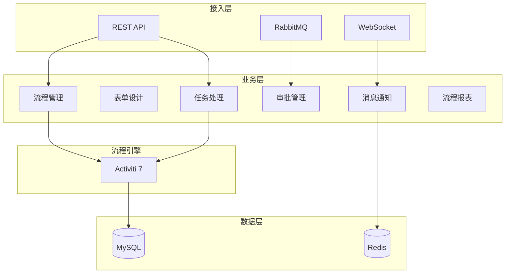
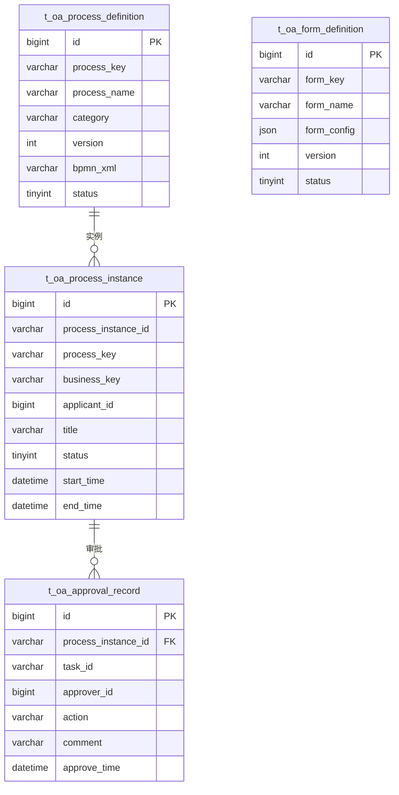

# OA工作流微服务 - 总体设计文档

> **版本**: v1.0.0  
> **微服务**: ioedream-oa-service (8089)  
> **创建日期**: 2025-12-17

---

## 📋 模块概述

OA工作流微服务负责企业内部审批流程的全面管理，包括流程设计、表单配置、任务处理、审批管理和流程监控，为门禁、考勤、访客等业务提供统一的审批能力。

---

## 🏗️ 系统架构



---

## 📁 代码结构

```
ioedream-oa-service/src/main/java/net/lab1024/sa/oa/
├── OaApplication.java                      # 启动类
├── controller/                             # Controller层
│   ├── ProcessDefinitionController.java   # 流程定义
│   ├── ProcessInstanceController.java     # 流程实例
│   ├── FormDefinitionController.java      # 表单定义
│   ├── TaskController.java                # 任务管理
│   ├── ApprovalController.java            # 审批管理
│   └── WorkflowReportController.java      # 流程报表
├── service/                                # Service层
│   ├── ProcessDefinitionService.java
│   ├── ProcessInstanceService.java
│   ├── FormDefinitionService.java
│   ├── TaskService.java
│   ├── ApprovalService.java
│   ├── WorkflowNotifyService.java
│   └── WorkflowReportService.java
├── dao/                                    # DAO层
│   ├── ProcessDefinitionDao.java
│   ├── FormDefinitionDao.java
│   ├── ApprovalRecordDao.java
│   └── WorkflowCallbackDao.java
├── domain/                                 # 领域对象
│   ├── entity/
│   ├── form/
│   └── vo/
├── manager/                                # Manager层
│   ├── ActivitiManager.java
│   └── WorkflowCallbackManager.java
└── listener/                               # 流程监听器
    ├── TaskCreateListener.java
    └── ProcessEndListener.java
```

---

## 🎯 核心功能模块

### 1. 流程管理
- 流程定义（BPMN设计）
- 流程部署
- 流程版本管理
- 流程挂起/激活

### 2. 表单设计
- 表单模板定义
- 字段配置
- 表单版本管理
- 表单与流程绑定

### 3. 任务处理
- 待办任务查询
- 已办任务查询
- 任务认领
- 任务委托/转办

### 4. 审批管理
- 审批通过/拒绝
- 加签/减签
- 回退/撤回
- 审批意见

### 5. 消息通知
- 待办通知
- 审批结果通知
- 催办提醒
- 超时预警

### 6. 流程报表
- 流程统计
- 效率分析
- 审批时长分析
- 流程监控大屏

---

## 📊 数据库设计

### 核心表结构

| 表名 | 说明 |
|------|------|
| t_oa_process_definition | 流程定义表 |
| t_oa_form_definition | 表单定义表 |
| t_oa_process_instance | 流程实例表 |
| t_oa_approval_record | 审批记录表 |
| t_oa_workflow_callback | 回调配置表 |
| t_oa_task_delegate | 任务委托表 |

### ER图



---

## 🔧 API接口设计

### 流程定义

| 方法 | 路径 | 说明 |
|------|------|------|
| GET | /api/oa/v1/process/definition/list | 流程列表 |
| POST | /api/oa/v1/process/definition/deploy | 部署流程 |
| PUT | /api/oa/v1/process/definition/suspend | 挂起流程 |

### 流程实例

| 方法 | 路径 | 说明 |
|------|------|------|
| POST | /api/oa/v1/process/instance/start | 发起流程 |
| GET | /api/oa/v1/process/instance/{id} | 流程详情 |
| DELETE | /api/oa/v1/process/instance/{id} | 撤回流程 |

### 任务管理

| 方法 | 路径 | 说明 |
|------|------|------|
| GET | /api/oa/v1/task/todo | 待办任务 |
| GET | /api/oa/v1/task/done | 已办任务 |
| POST | /api/oa/v1/task/claim | 认领任务 |
| POST | /api/oa/v1/task/delegate | 委托任务 |

### 审批管理

| 方法 | 路径 | 说明 |
|------|------|------|
| POST | /api/oa/v1/approval/approve | 审批通过 |
| POST | /api/oa/v1/approval/reject | 审批拒绝 |
| POST | /api/oa/v1/approval/rollback | 回退 |

---

## 📈 性能指标

| 指标项 | 要求 |
|--------|------|
| 流程发起响应 | ≤ 1s |
| 审批处理延迟 | ≤ 500ms |
| 待办查询响应 | ≤ 300ms |
| 并发审批支持 | ≥ 200次/秒 |
| 流程实例保存 | ≥ 3年 |

---

## 🔐 安全要求

- 审批记录不可篡改
- 流程操作审计日志
- 敏感数据脱敏
- 审批权限严格控制

---

**📝 文档维护**: IOE-DREAM架构团队 | 2025-12-17
