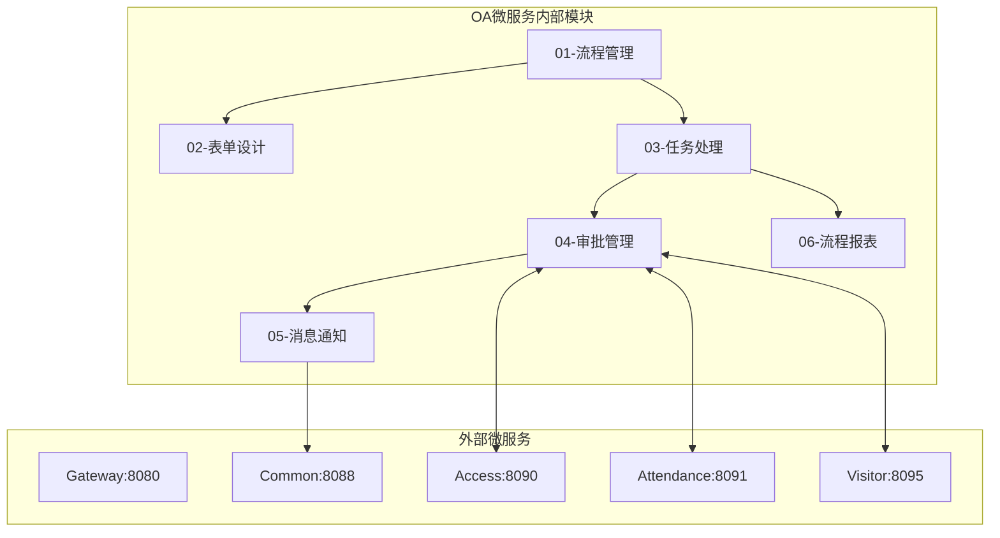
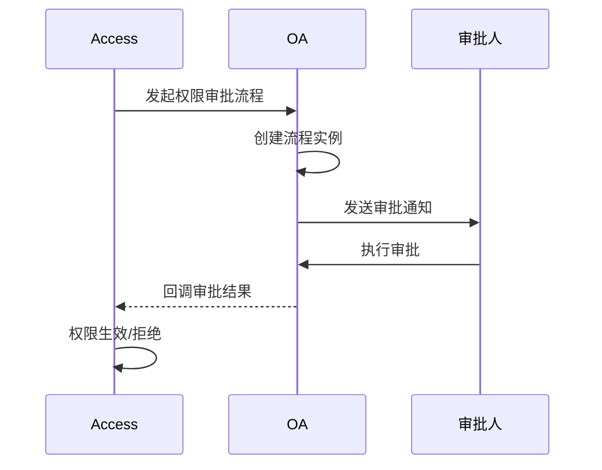
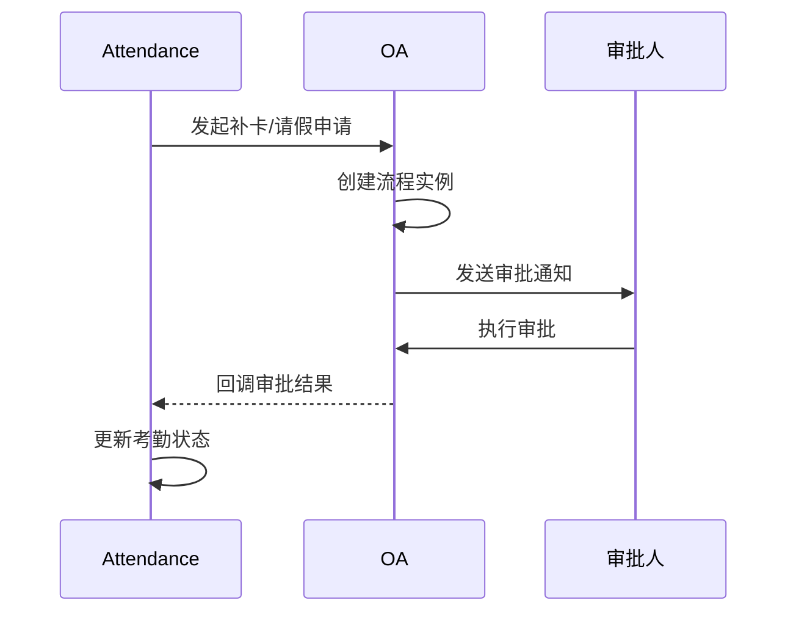
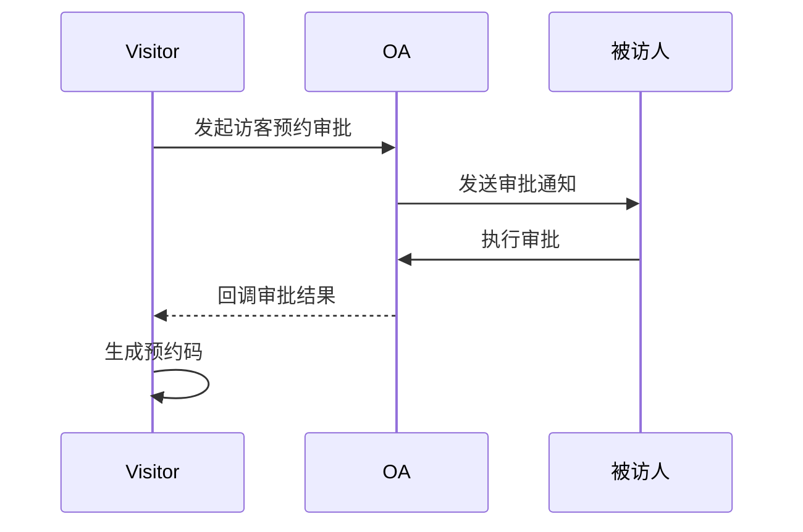
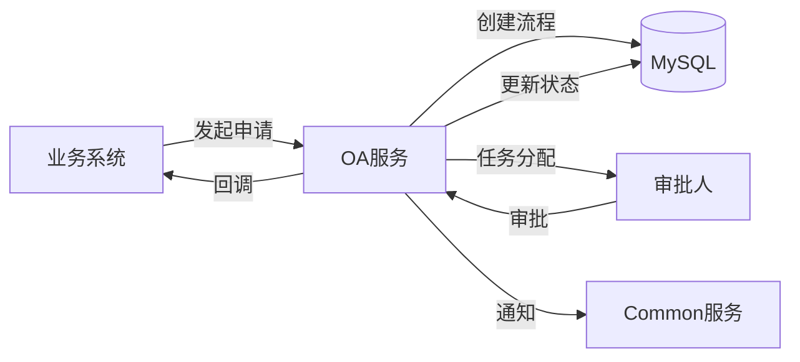

# OA工作流模块 - 模块间关联设计文档

> **版本**: v1.0.0  
> **微服务**: ioedream-oa-service (8089)  
> **创建日期**: 2025-12-17

---

## 📊 模块关联全景图



---

## 🔗 内部模块关联详细设计

### 1. 流程管理 ↔ 表单设计

| 关联点 | 说明 | 数据流向 |
|--------|------|----------|
| 表单绑定 | 流程绑定业务表单 | FORM → FLOW |
| 字段映射 | 流程变量映射表单字段 | FORM → FLOW |
| 表单渲染 | 流程节点渲染对应表单 | FLOW → FORM |

**关键接口**:
```java
// WorkflowFormService.java
FormDefinitionVO getFormDefinition(String formKey);
void bindFormToProcess(Long processId, String formKey);
```

### 2. 任务处理 ↔ 审批管理

| 关联点 | 说明 | 数据流向 |
|--------|------|----------|
| 任务分配 | 审批任务分配到处理人 | TASK → APPROVAL |
| 审批执行 | 执行审批动作 | APPROVAL → TASK |
| 状态更新 | 审批后更新任务状态 | APPROVAL → TASK |

**关键接口**:
```java
// WorkflowTaskService.java
List<TaskVO> getMyTasks(Long userId);
void completeTask(String taskId, ApprovalForm form);

// ApprovalService.java
void approve(String taskId, String comment);
void reject(String taskId, String reason);
```

### 3. 审批管理 ↔ 消息通知

| 关联点 | 说明 | 数据流向 |
|--------|------|----------|
| 待办通知 | 新任务通知审批人 | APPROVAL → NOTIFY |
| 结果通知 | 审批结果通知申请人 | APPROVAL → NOTIFY |
| 催办通知 | 超时催办提醒 | APPROVAL → NOTIFY |

**关键接口**:
```java
// WorkflowNotifyService.java
void sendTaskNotify(Long userId, TaskNotifyDTO notify);
void sendApprovalResult(Long applicantId, ResultNotifyDTO result);
```

---

## 🌐 外部微服务关联设计

### 1. OA服务 ↔ 门禁服务 (8090)



**关键API**:
```
POST /api/oa/v1/workflow/access/apply      # 门禁权限申请
POST /api/oa/v1/workflow/access/callback   # 审批回调
```

### 2. OA服务 ↔ 考勤服务 (8091)



**关键API**:
```
POST /api/oa/v1/workflow/attendance/apply  # 考勤申请
POST /api/oa/v1/workflow/attendance/callback # 审批回调
```

### 3. OA服务 ↔ 访客服务 (8095)



**关键API**:
```
POST /api/oa/v1/workflow/visitor/apply     # 访客预约审批
POST /api/oa/v1/workflow/visitor/callback  # 审批回调
```

---

## 📋 数据流转设计

### 审批流程数据流



---

## 🔧 接口契约规范

| 调用方 | 被调用方 | 接口 | 超时 | 重试 |
|--------|----------|------|------|------|
| ACC | OA | startWorkflow | 5s | 2次 |
| ATT | OA | startWorkflow | 5s | 2次 |
| VIS | OA | startWorkflow | 5s | 2次 |
| OA | CMN | sendNotify | 3s | 3次 |

---

**📝 文档维护**: IOE-DREAM架构团队 | 2025-12-17
