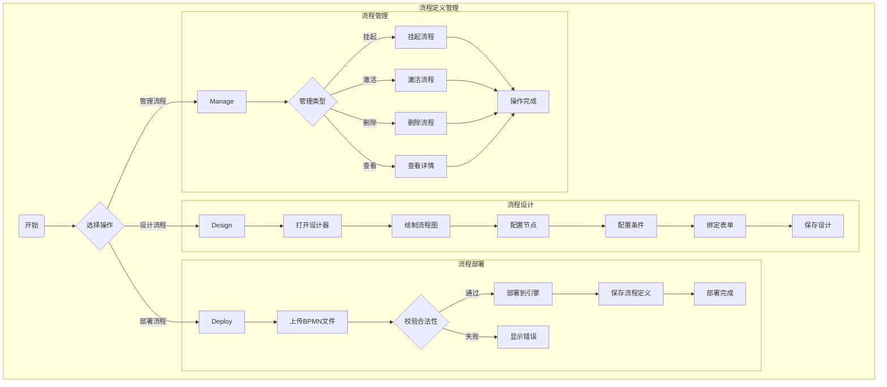
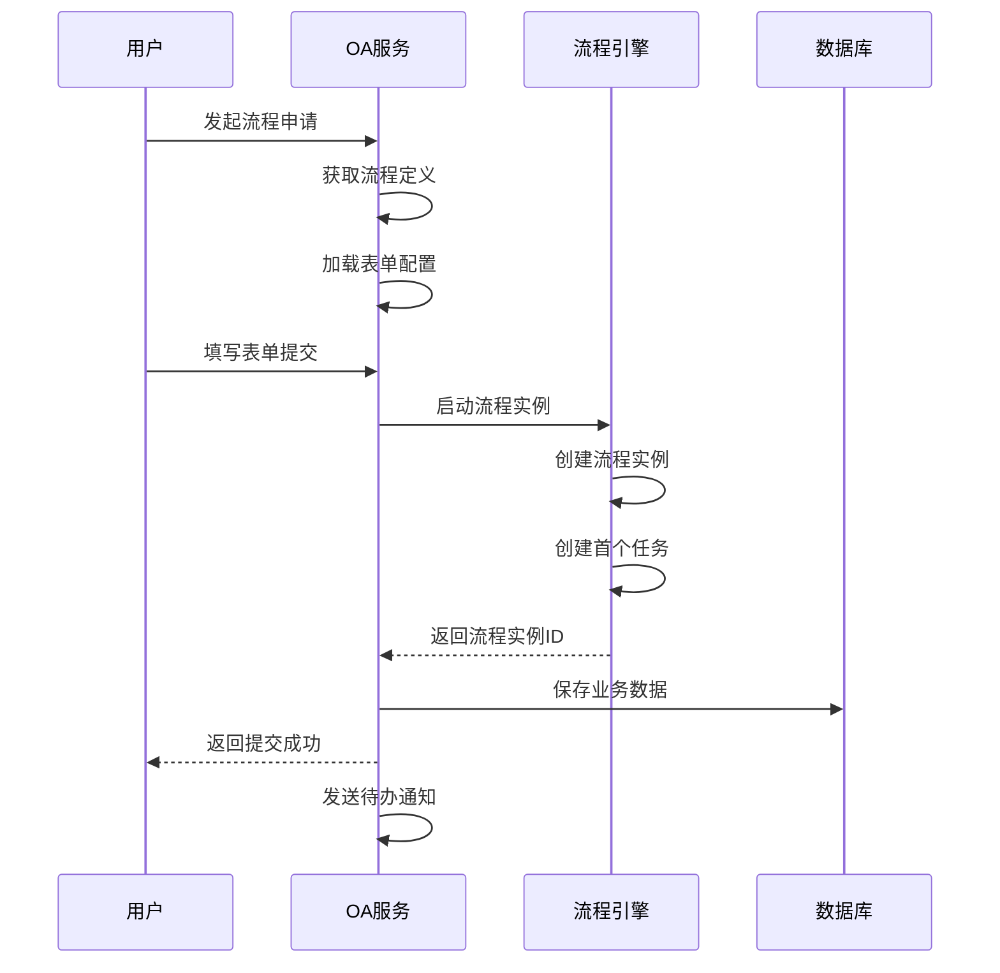
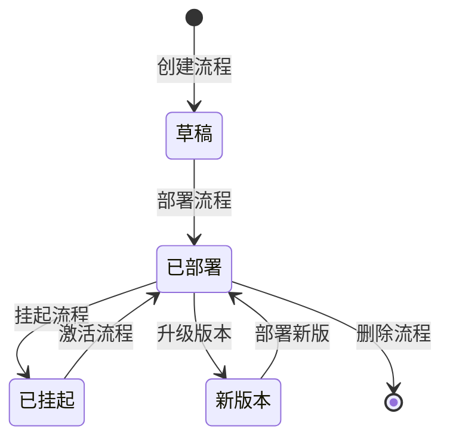

# 流程管理 - 业务流程图

> **版本**: v1.0.0  
> **创建日期**: 2025-12-17

---

## 📊 流程定义管理流程

```mermaid
graph TB
    subgraph 流程定义管理
        Start(开始) --> Choose{选择操作}
        
        Choose -->|设计流程| Design
        Choose -->|部署流程| Deploy
        Choose -->|管理流程| Manage
        
        subgraph 流程设计
            Design --> OpenDesigner[打开设计器]
            OpenDesigner --> DrawFlow[绘制流程图]
            DrawFlow --> ConfigNode[配置节点]
            ConfigNode --> ConfigCondition[配置条件]
            ConfigCondition --> BindForm[绑定表单]
            BindForm --> SaveDesign[保存设计]
        end
        
        subgraph 流程部署
            Deploy --> UploadBpmn[上传BPMN文件]
            UploadBpmn --> ValidateBpmn{校验合法性}
            ValidateBpmn -->|通过| DeployToEngine[部署到引擎]
            ValidateBpmn -->|失败| ShowError[显示错误]
            DeployToEngine --> SaveDefinition[保存流程定义]
            SaveDefinition --> DeployEnd[部署完成]
        end
        
        subgraph 流程管理
            Manage --> ManageType{管理类型}
            ManageType -->|挂起| Suspend[挂起流程]
            ManageType -->|激活| Activate[激活流程]
            ManageType -->|删除| Delete[删除流程]
            ManageType -->|查看| View[查看详情]
            Suspend --> ManageEnd[操作完成]
            Activate --> ManageEnd
            Delete --> ManageEnd
            View --> ManageEnd
        end
    end
```

---

## 📊 流程实例发起流程

```mermaid
sequenceDiagram
    participant User as 用户
    participant OA as OA服务
    participant Engine as 流程引擎
    participant DB as 数据库
    
    User->>OA: 发起流程申请
    OA->>OA: 获取流程定义
    OA->>OA: 加载表单配置
    User->>OA: 填写表单提交
    OA->>Engine: 启动流程实例
    Engine->>Engine: 创建流程实例
    Engine->>Engine: 创建首个任务
    Engine-->>OA: 返回流程实例ID
    OA->>DB: 保存业务数据
    OA-->>User: 返回提交成功
    OA->>OA: 发送待办通知
```

---

## 📊 流程版本管理

```mermaid
stateDiagram-v2
    [*] --> 草稿: 创建流程
    草稿 --> 已部署: 部署流程
    已部署 --> 已挂起: 挂起流程
    已挂起 --> 已部署: 激活流程
    已部署 --> 新版本: 升级版本
    新版本 --> 已部署: 部署新版
    已部署 --> [*]: 删除流程
```

---

**📝 文档维护**: IOE-DREAM架构团队 | 2025-12-17
